# 10 Вкладка Deliver. Экспорт материала

#Deliver

## 2 Рендер проекта. Главные настройки

Это окно с деливером, в котором можно передвигаться по таймлайнам

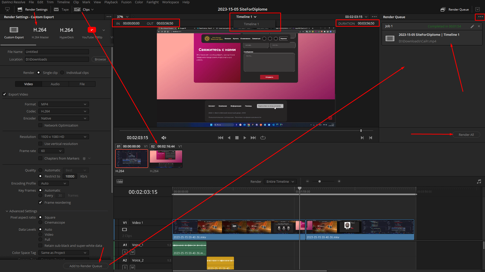

Монтажный кодек

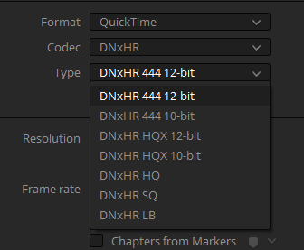

Просмотровый кодек

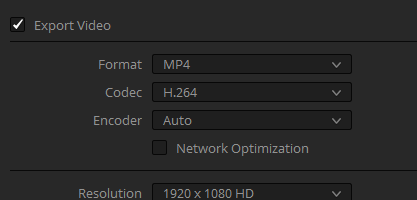

Мы можем выбрать разрешение больше, чем full hd, даже если наш таймлайн full hd. Самое главное, чтобы исходники были 4к, чтобы видео вышло в 4к

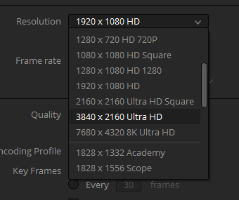

битность:

- для 1080 - 10 мегабит
- для 4к - 25 мегабит

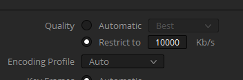

В продвинутых настройках:

- определяем размер пикселя (если снимали на анаморфот)
- определяем цветовое пространство и гамму, если мы будем передавать дальше на графику и покрас
- галки:
    - прокси можем использовать, если при 1080 мы сделали прокси 1080
    - последняя галка используется только для raw материалов с про-камер

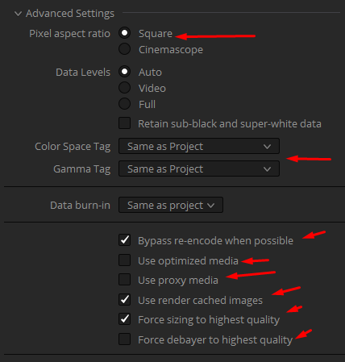

Этот параметр отключит всю цветокоррекцию

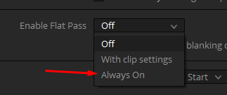

Чтобы добавить субтитры прямо на видеодорожку

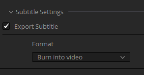

## 3 Экспорт отдельных клипов, экспорт альфа-канала

Экспорт индвивидуальных клипов выполняется подобным образом:

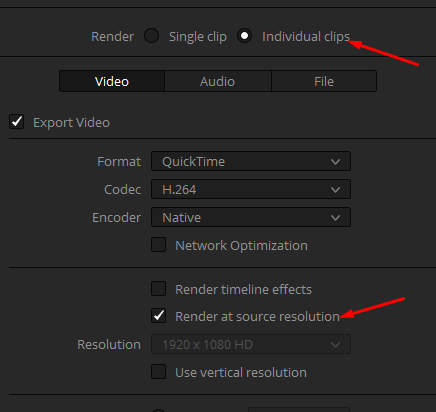
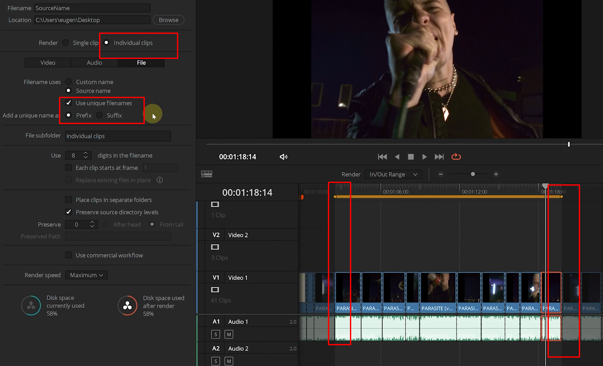

Чтобы экспортировать с альфаканалом, нужно выбрать нужный кодек и поставить галочку

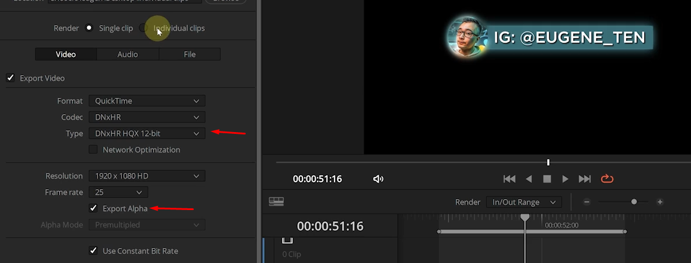

Чтобы экспортировать для премьера, нужно будет переотрендерить видеоклипы в определённую папку

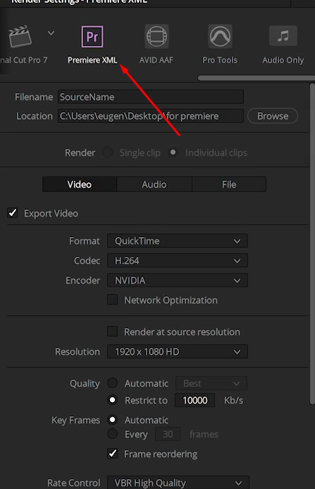

Ну и этот же XML можно импортировать в давинчи

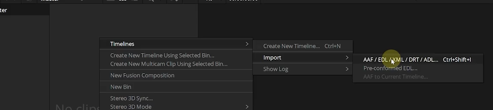

## 4 Создание очереди рендера, создание пресетов рендера

Мы можем поставить много видео на очередь в рендере просто через добавление кусочков в очередь

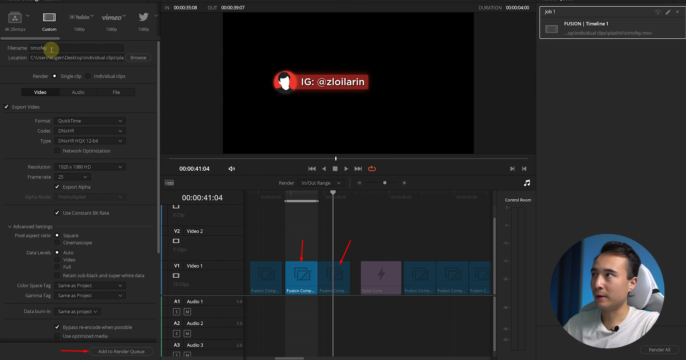

Ту мы можем раскрыть детали рендера

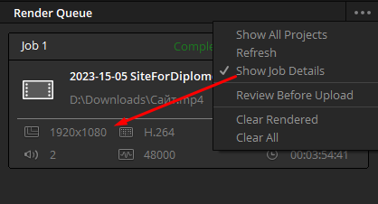

И тут мы можем создать новый пресет

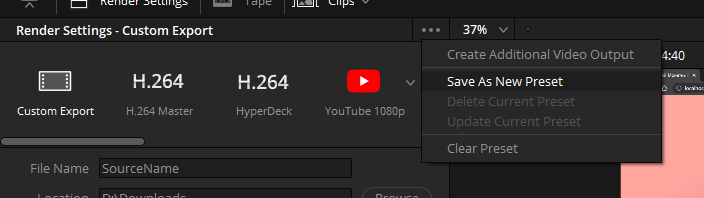

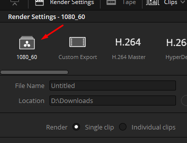

## 5 Media Management в DVR - сохрани терабайты места на дисках

Иногда нам может потребоваться сохранить проект на всякий пожарный на будущее, чтобы не перекачивать его заново. Хранить все футажи мы тоже не хотим. Чтобы исправить данную проблему, в давинчи есть такая функция, как медиа менеджмент

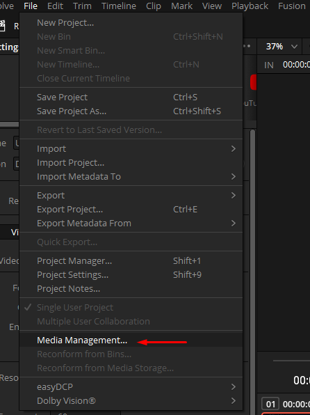

С такими настройками мы отрендерим новый проект, который будет иметь только вырезанные куски из наших футажей

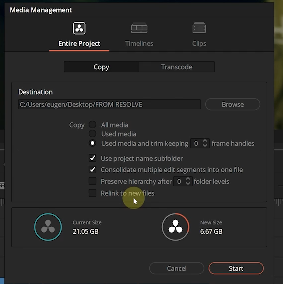

Ну или так же можно транскодировать футажи в другой менее тяжёлый формат

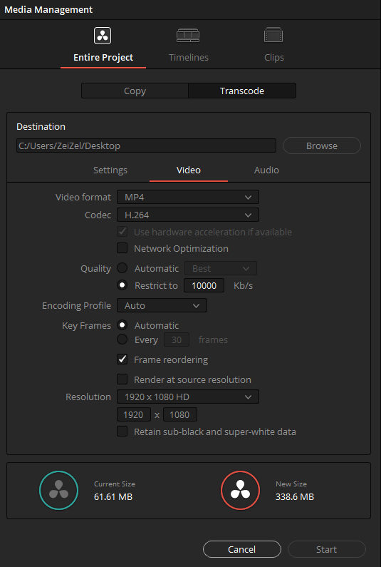

Далее нам нужно будет экспортировать _drt_ файл с таймлинией, к которой будут подцеплены футажи в папку с футажами, куда мы их экспортировали

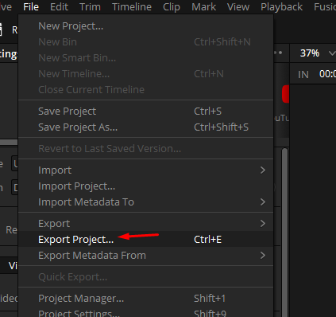

И при импорте можно будет просто подцепить таймлайн

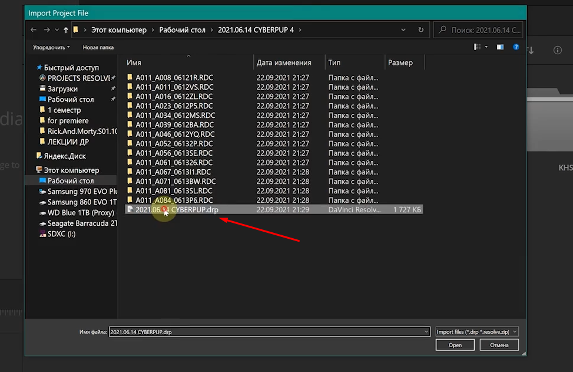

Так же мы можем экспортировать таймлайн

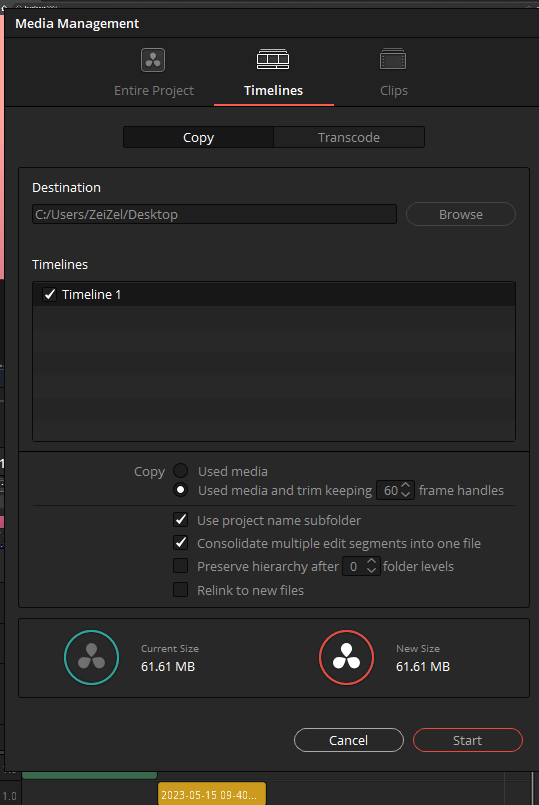
