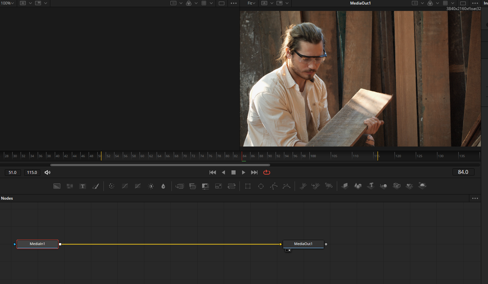
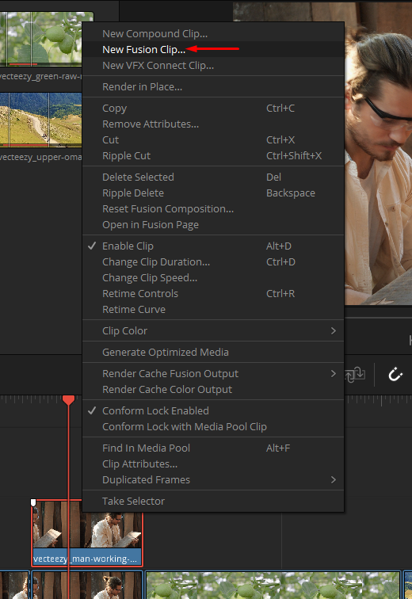
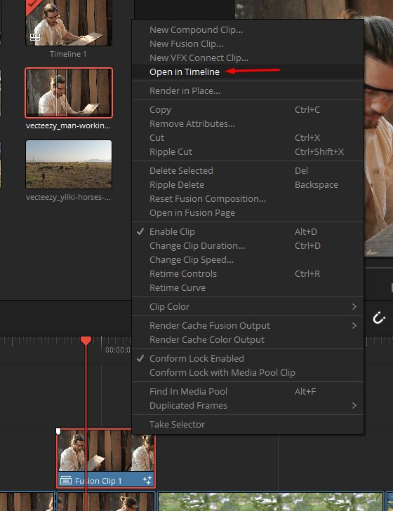
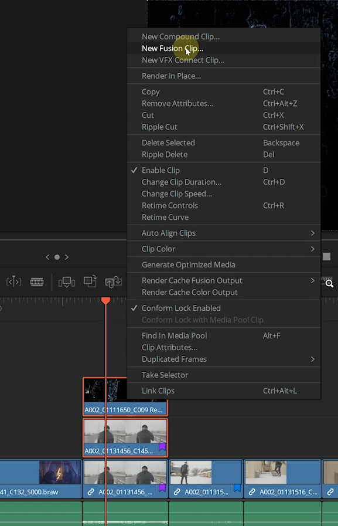
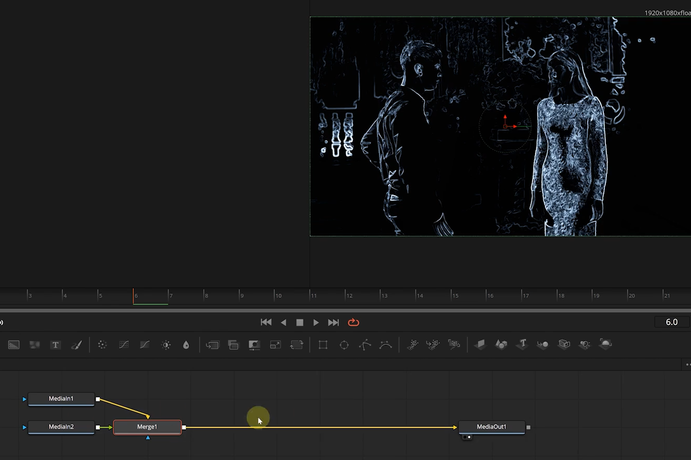
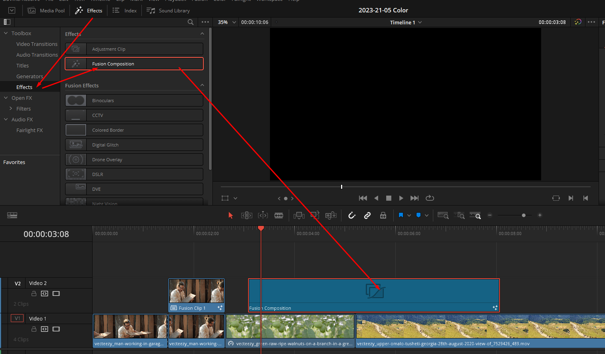
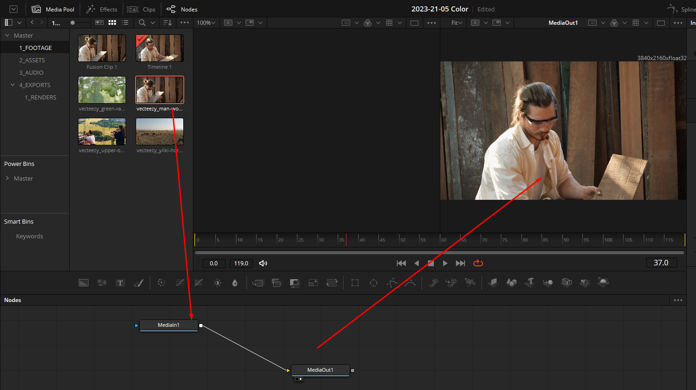
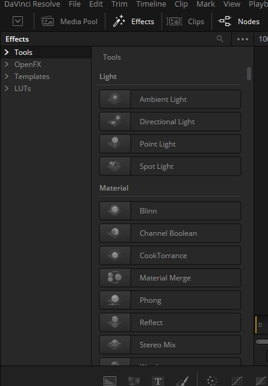
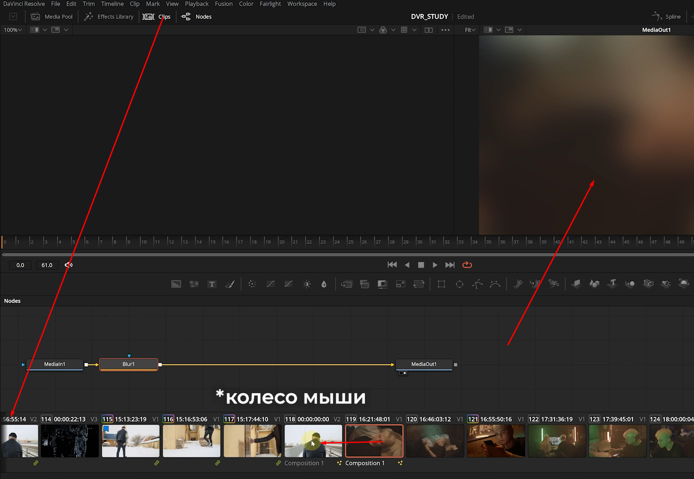

# 8 Вкладка Fusion
#Fusion

## 1 Задачи вкладки Fusion. Что такое композитинг

Во фьюжене можно:
- кеить
- ротоскопить
- композить
- делать моушен-дизайн

## 2 Взаимодействие вкладок Edit, Fusion и Color clip, fusion clip, fusion composition, compound clip

`Shift+5` перекинет футаж на работу внутри фьюжена. Открывается тот клип, на котором стоит плейхед

Работа будет происходить с самим исходником (без покраса и смены разрешения)

Чтобы сохранить цветокор и работать с размером таймлайна, нужно добавить новый фьюжн клип

Делать это стоит скопировав исходник, чтобы не потерять его

Но так же сохранятся возможность работать с клипом внутри его таймлайна и менять его

Так же мы можем создать новый фьюжн-клип, если нам нужно будет добавить другой футаж внутрь клипа

Так же можно создать компаунд-клип, но он будет отображаться, как единый футаж без слоёв

И последний способ - создать новый фьюжн-клип

## 3 Обзор вкладки Fusion. Интерфейс

Тут находятся все клипы доступные в давинчи, но тут неудобно до них добираться - проще воспользоваться `ctrl+space`

Так же тут можно переносить эффекты по средней кнопке мыши через окно с клипами

## 4 Логика работы во Fusion media in out, pipes, merge, viewers

## 5 Основные ноды вкладки Fusion. Toolbar

## 6 Работа с текстом. Окна keyframes и curves

## 7 Работа с текстом. Окна keyframes и curves часть вторая

## 8 Modifiers - автоматическая анимация параметров

## 9 Motion Blur. Где он нужен и как его включить

## 10 Chroma Keying вырезаем фон. Delta Keyer

## 11 Tracker трекинг объектов

## 12 Planar Tracker

## 13 Luma Keying

## 14 Rotoscoping - выделяем сложные области. Magic Mask

## 15 Clean-up убираем ненужное из кадра с помощью ноды Paint

## 16 Clean-up дублирование паттерна

## 17 Как снизить нагрузку на ПК. Ноды Saver & Loader

## 18 Композитинг

