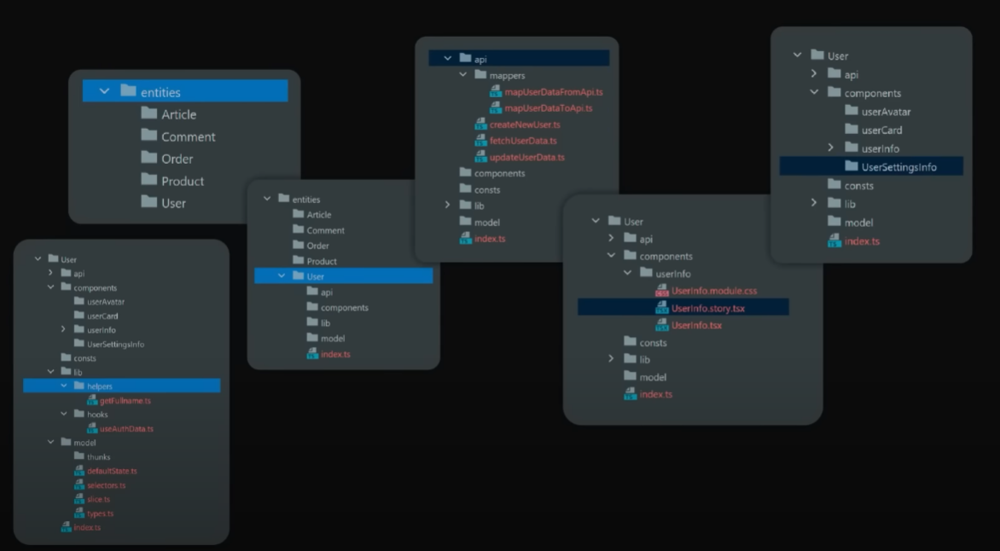

## Слои

Мы имеем 7 слоёв, каждый из которых может быть поделён на определённые сегменты:
- ui - вся визуальная часть компонентов
- model - определённые данные и куски, которые отвечают за модель взаимодействия и логику внутри компонента (его слайсы, типы)
- lib - хуки или другие утилитарные компоненты
- config - настройка 
- api - связь с внешним миром через отправку запросов
- constants - константы слоя

FSD позволяет следовать всем канонам ООП за счёт своей структуры. 
Public API предоставляет доступ только к нужным файлам из нашей целевой папки

Shared вмещает в себя весь переиспользуемый контент по приложению. В него стоит поместить конфиги, инстансы API, ассеты, утилиты, хуки, константы и разного вида кнопки, инпуты, свитчеры в ui

Так выглядит структура папок уже у конкретной сущности 
Она хранит свои компоненты, константы, хелперы, которые нужны только ей и отдаёт наружу только компоненты, которые могут пригодиться в слоях выше
Мапперы подготавливают данные для отправки на сервер или для вывод на фронтенде

Фича - это отдельная функциональность, которая приводит к определённому результату (кнопка, которая получает состояние подписки и позволяет отписаться или подписаться, лайк/убрать лайк, дизлайк/убрать дизлайк, тугглер темы или свитчер языка) 

Он так же может хранить те же самые сегменты, что и остальные модули

Дальше уже идут виджеты
Они представляют собой отдельные части страницы - хедер, футер, сайдбар, отдельный пост

Дальше уже идут страницы
В идеале, она должна состоять просто из виджетов, которые уже в своих рамках реализуют нужную функциональность для пользователя

Слой приложения хранит в себе чисто все нужные компоненты, которые отвечают за entry-point или входную точку приложения

Как можно определить, к какому слою должен относиться компонент?

А тут уже располагаются примеры тех компонентов, которые могут находиться в определённых слоях:
- shared - переиспользуемые отдельные блоки, которые мы можем вынести в другое приложение
- entity - общий компонент пост, который подходит под посты пользователей, групп и который имеет место под текст, фавиконку и не имеет фичей (тех же лайков и пересылки сообщений), потому что они могут отличаться по реализации в зависимости от разных постов
- features - бизнес-действия пользователя - лайк, репост, удалить, изменить комментарий, добавить его
- widgets - блок с соединённой сущностью и фичёй
- pages - цельная страница, которая должна состоять из виджетов

