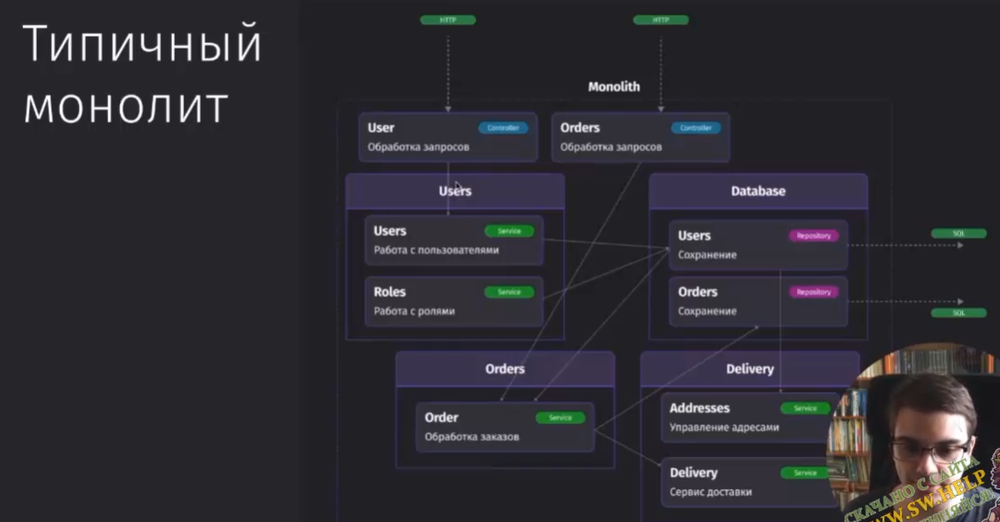

## 1. Введение
### Когда нужны микросервисы?

Проблемы типичной монолитной системы: 
- Добавление нового функционала со временем становится крайне тяжёлой задачей. 
- Появляются малоиспользуемые модули
- Появляются несколько точек для выполнения одной и той же задачи (например, запись одних и тех же данных в БД)
В реальных проектах заказчик присылает в качестве ТЗ не сразу весь проект, а только его часть. Поэтому и получается один большой клубок связей

Минусы монолита:

Что решают микросервисы:
Главная особенность заключается в том, что мы можем использовать разные стеки технологий для разных блоков сайта и мы можем спокойно переписать старый код, который представляет из себя небольшой блок логики

Микросервисная архитектура подразумевает под собой то, что мы разбиваем приложение на много различных сервисов, которые запускаются отдельно 

Для чего подходят микросервисы:

