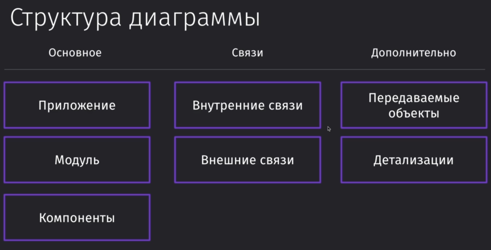
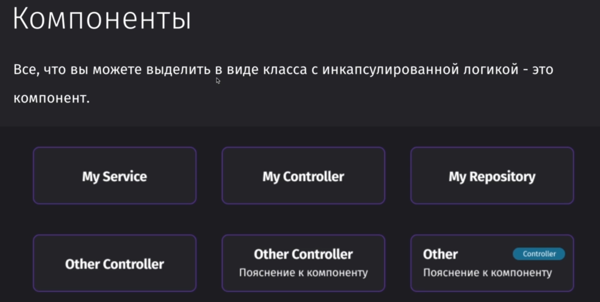
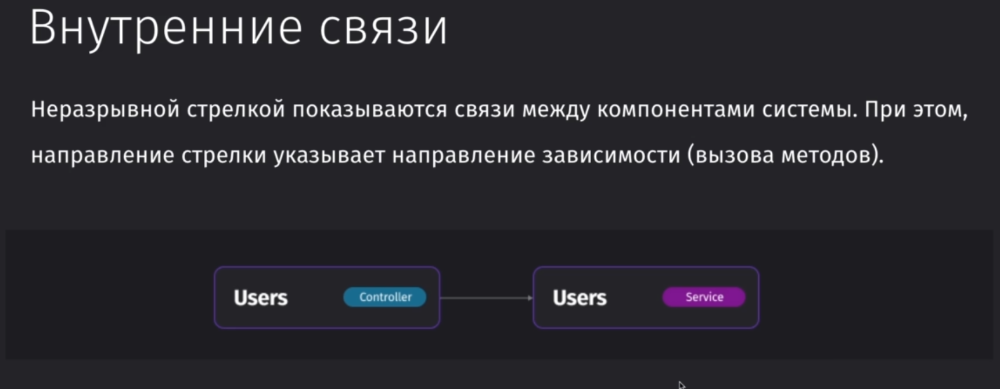
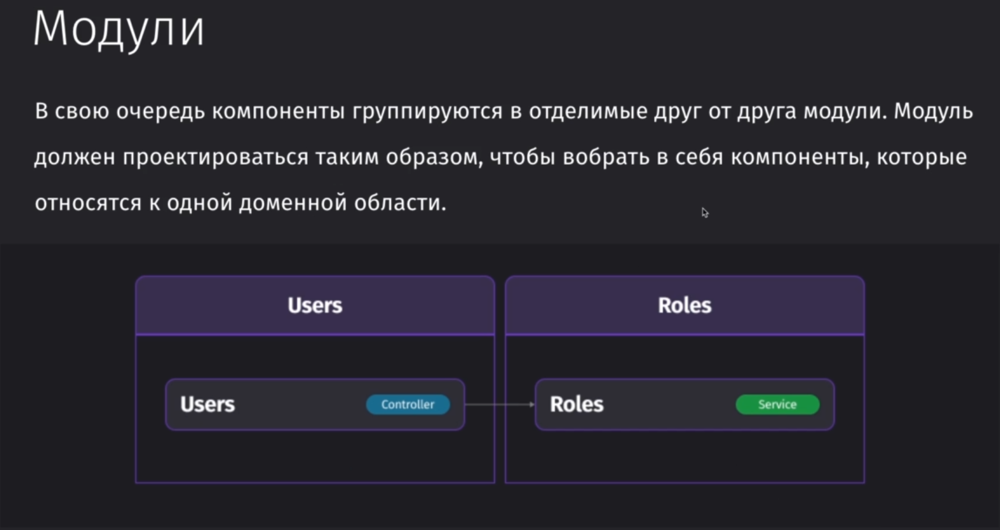
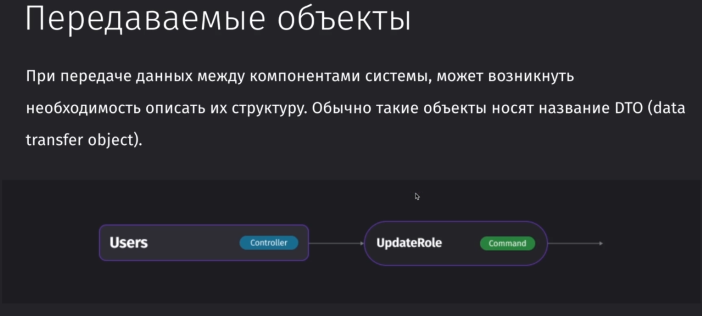
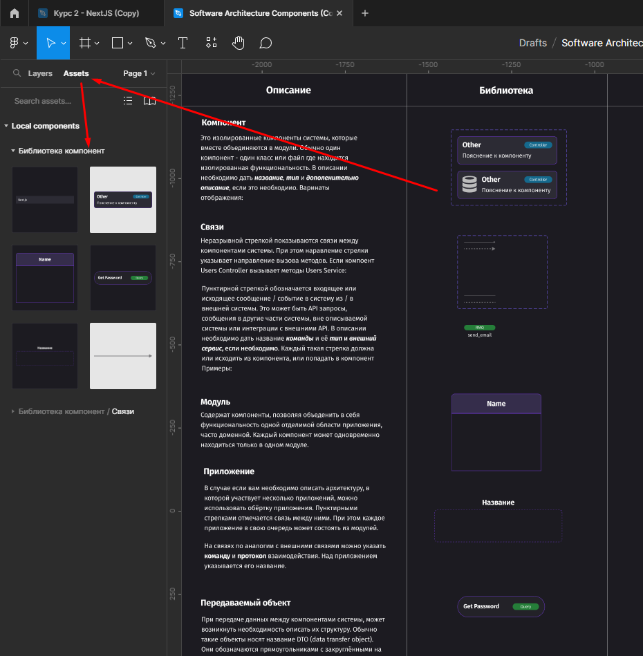
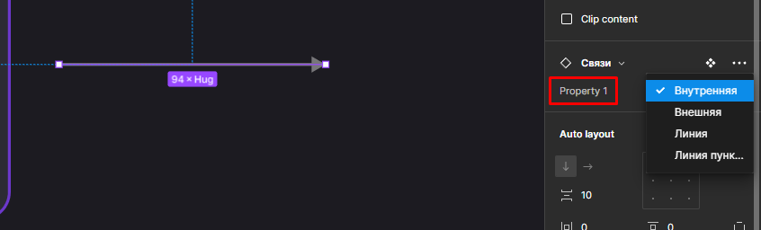
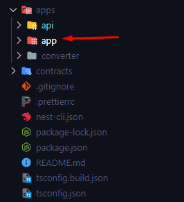
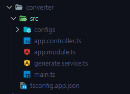
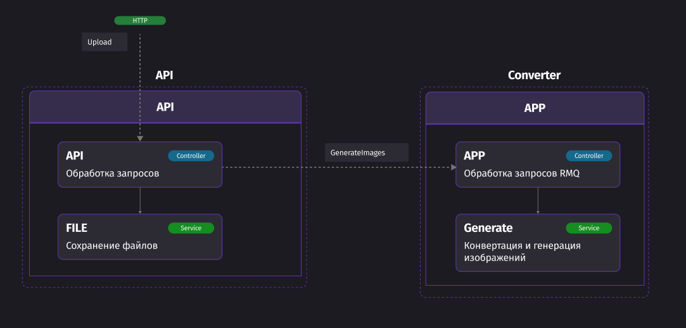

## Вводное видео

Нотации для описания построения архитектуры программы:
1) ==Диаграмма классов==
	- Хорошо подходит для анализа существующего кода
	- Полезно при планировании небольших систем
1) ==c4model==
	- Хорошо отображает 3 и 4 уровень вложенности
	- Слабая стандартизация на третьем уровне

==C4model== подразумевает под собой подразделение диаграммы на 4 уровня абстракции:
- контекст
- контейнер
- компонент
- код

Общие требования к нотации кода:
- На верхнем уровне описывать отделимые части системы - ==Компоненты==
- Подходит для описания монолитов и микросервисов
- Связи описывают зависимости и поток вызовов, но сильно усложнены

## 9 - Разбор компонент

Структура диаграммы:
- Основные элементы представляют собой отдельные компоненты, которые и составляют собой систему 
- Связи покажут нам, как эти компоненты взаимодействуют между друг другом 
- Дополнительные элементы позволят уточнить детали в нашей схеме

Компонент - это отделимая сущность, которая является отдельной частью системы, которая внутри себя содержит всю нужную логику для её работы

Обычно, компоненты представляют из себя классы. Зачастую, это сервисы, контроллеры или репозитории или любая другая вещь с инкапсулированной логикой

Связь обозначает зависимость одного компонента от другого и вызов его (на изображении: контроллер пользователей вызывает сервис пользователей)

Двунаправленные стрелки могут быть, но они означают о циклической зависимости, что может приводить к определённым проблемам в архитектуре (это нарушает поток вызова компонентов)

Внешние связи говорят нам о том, что мы работаем с внешней базой данных, внешним АПИ или другими внешними элементами

Модуль - это замкнутая область, в которой хранится вся информация о компонентах и их взаимодействиях в пределах одной доменной области.

- Доменная область - это набор связанных понятий с одной бизнес-частью приложения.
- Между модулями должно быть минимальное количество связей и зависимостей, чтобы они оставались легкоотделимыми.

Приложение - это обёртка, которая инкапсулирует логику связанных между собой модулей

- Если в монолите этот элемент не так актуален, то в микросервисах это не так, так как нам требуется полное представление о всех сервисах в приложении и как они взаимодействуют. 
- Стрелки связей между приложениями отмечаются пунктирной линией, так как запрос уже происходит извне (с помощью ==http==, ==rabbitmq== и так далее)

Передаваемый объект - это класс, который содержит данные и структуру того, какие данные должны быть (вызываем команду с какими-то данными и для этого создаём инстанс этой команды и передаём в неё данные).

Детализация - это специальный объект, который позволяет договориться о структуре передаваемых данных.

Например, мы можем:
- Указать список зависимостей библиотек приложения
- Указать структуру для занесения данных в базу данных
- Указать список команд, который принимает контроллер
- И так далее

## 10 - Использование Figma

Тут находится ссылка на [**макет с нужными компонентами**](https://www.figma.com/community/file/1076518826949849808/Software-Architecture-Components).

Правильный способ использования компонентов:
1) Все нужные элементы уже выделены в компоненты - их не нужно копировать
2) Во вкладке **Assets** показаны все имеющиеся компоненты
3) Из представленной вкладки просто перетаскиваем компонент, который может нам понадобиться

4) Так же нажав на `shift+I` можно вывести быстрый список компонентов

5) Так же компоненты могут иметь несколько стилей отображения, которые можно поменять через **properties** (конкретно в данном случае можно поменять стиль стрелки)

6) Чтобы погнуть стрелку, можно нажать на Ctrl+D и потянуть за один конец в нужную сторону

7) Если изменить свойства одного компонента, то они поменяются во всех

## 11 - Пример описания

Наше приложение имеет подобную структуру. Папку `app` мы не описываем, так как это фронт. Однако, если потребуется, то можно будет описать и его, но в представленном контексте мы будем только описывать получаемые с фронта запросы.

Так выглядит структура объектов в данных папках:
- Контроллер АПИ принимает в себя запросы с фронта, сервис `files` сохраняет сгенерированное изображение конвертером (второй модуль), а модуль управляет всеми процессами внури АПИ.
- Конвертер имеет свой контроллер, который получает запрос с АПИ на триггер сервиса по генерации изобаржений. Далее сгенерированное изобрежние возвращается обратно в АПИ, где сохраняется сервисом `files`.

 

И примерно так будет выглядеть структура приложения по заданным условиям:

