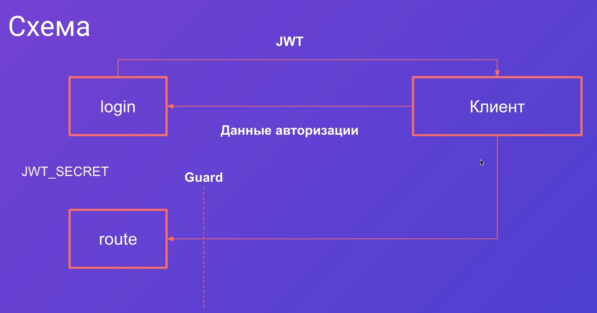
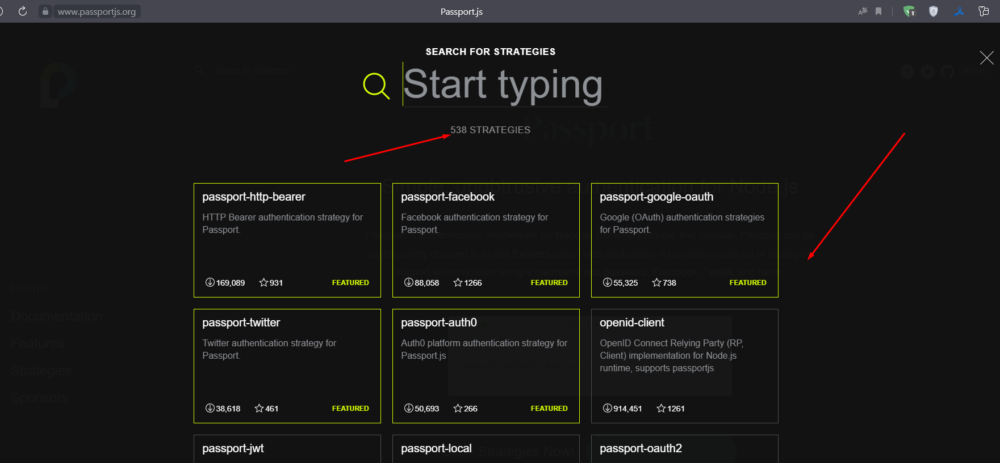
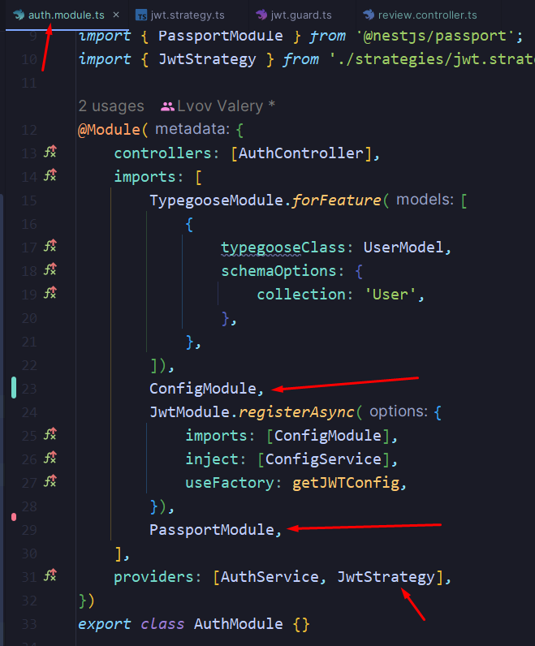
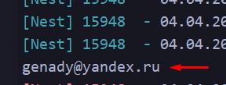
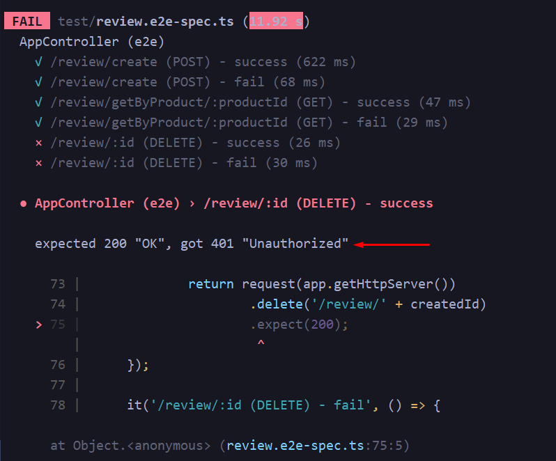
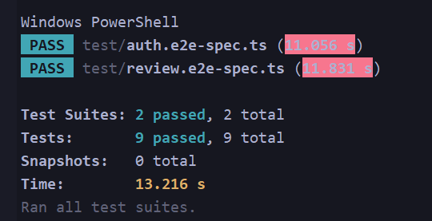

## 001 Регистрация пользователя

Установим библиотеку для работы с шифрованием паролей (чтобы не хранить в базе пароли в открытом виде)

```bash
npm i bcryptjs
npm i -D @types/bcryptjs
```

Заменим имя модели на `UserModel` вместо `AuthModel`, чтобы точнее указать, что мы тут работаем с моделью пользователя

`src > auth > user.model.ts`
```TS
import { prop } from '@typegoose/typegoose';
import { Base, TimeStamps } from '@typegoose/typegoose/lib/defaultClasses';

export interface UserModel extends Base {}

export class UserModel extends TimeStamps {
	@prop({
		unique: true,
	})
	email: string;

	@prop()
	passwordHash: string;
}
```

Заменим `UserModel` на `AuthModel` в зависимостях модуля

`src > auth > auth.module.ts`
```TS
import { Module } from '@nestjs/common';
import { AuthController } from './auth.controller';
import { TypegooseModule } from 'nestjs-typegoose';
import { UserModel } from './user.model';
import { AuthService } from './auth.service';

@Module({
	controllers: [AuthController],
	imports: [
		TypegooseModule.forFeature([
			{
				typegooseClass: UserModel,
				schemaOptions: {
					collection: 'User',
				},
			},
		]),
	],
	providers: [AuthService],
})
export class AuthModule {}
```

Далее нужно провалидировать ДТОшку того объекта для регистрации и аутентификации, который приходит к нам с клиента

`src > auth > dto > auth.dto.ts`
```TS
import { IsString } from 'class-validator';

export class AuthDto {
	@IsString()
	login: string;

	@IsString()
	password: string;
}
```

Далее реализуем логику сервиса:
- Инжектим модель `UserModel` 
- добавляем методы `createUser` для создания нового пользователя (в `return` возвращается созданный пользователь + вызывается функция для сохранения его в базе через функцию `save()`) и `findUser` для поиска уже существующего пользователя в базе

`src > auth > auth.service.ts`
```TS
import { Injectable } from '@nestjs/common';
import { AuthDto } from './dto/auth.dto';
import { InjectModel } from 'nestjs-typegoose';
import { UserModel } from './user.model';
import { ModelType } from '@typegoose/typegoose/lib/types';
import { genSaltSync, hashSync } from 'bcryptjs';

@Injectable()
export class AuthService {
	constructor(@InjectModel(UserModel) private readonly userModel: ModelType<UserModel>) {}

	async createUser(dto: AuthDto) {
		// генерируем соль в 10 круток
		const salt = genSaltSync(10);

		// создаём нового пользователя
		const newUser = new this.userModel({
			email: dto.login,
			passwordHash: hashSync(dto.password, salt), // хеширование пароля
		});

		// возвращаем пользователя и сохраняем его в базу
		return newUser.save();
	}

	async findUser(email: string) {
		return this.userModel.findOne({ email }).exec();
	}
}
```

Далее уже опишем контроллер:
- Сюда мы вставляем зависимость от сервиса `AuthService`
- Далее реализуем метод `register`, который будет сначала искать старого пользователя, если он его найдёт, то вернёт ошибку неверного запроса, а если не найдёт, то отправит запрос в сервис на создание пользователя
- сам метод регистрации оборачиваем в декоратор `@UsePipes(new ValidationPipe())`, чтобы работала валидация по ДТОшке (в ней работает `class-validator`)

`src > auth > auth.controller.ts`
```TS
import {
	BadRequestException,
	Controller,
	HttpException,
	Post,
	UsePipes,
	ValidationPipe,
} from '@nestjs/common';
import { Body, HttpCode } from '@nestjs/common/decorators';
import { AuthDto } from './dto/auth.dto';
import { AuthService } from './auth.service';
import { ALREADY_REGISTERED_ERROR } from './auth.constants';

@Controller('auth')
export class AuthController {
	constructor(private readonly authService: AuthService) {}

	@UsePipes(new ValidationPipe())
	@Post('register')
	async register(@Body() dto: AuthDto) {
		const oldUser = await this.authService.findUser(dto.login);

		if (oldUser) {
			throw new BadRequestException(ALREADY_REGISTERED_ERROR);
		}

		return this.authService.createUser(dto);
	}

	@HttpCode(200)
	@Post('login')
	async login(@Body() dto: AuthDto) {}
}
```

Тут мы сохраним строковую константу с ошибкой

`src > auth > auth.constants.ts`
```TS
export const ALREADY_REGISTERED_ERROR = 'Данный пользователь уже существует';
```

При первом запросе на регистрацию мы получим полные данные по пользователю


При повторной попытке на те же данные мы получим ошибку


## 002 Как работает JWT

Основные причины появления JWT:
- Приход SPA, которые не использовали куки
- Потребность разделять авторизацию и сервер, который имеет приватные роуты

Схема работы с JWT:
- Клиент делает запрос к серверу авторизации и передаёт в него данные авторизации
- Далее сервис логина выпускает клиенту JWT-токен. Сервис подписывает JWT некоторым секретом, который знает только сервер
- Далее, когда пользователь обращается к приватным роутам, guard на бэке проверяет, что у клиента используется валидный JWT-токен



Токен разбит на 3 части:
- `HEADER` - хранит в себе тип (`typ`) и алгоритм(`alg`) шифрования.
- `PAYLOAD` - сами передаваемые данные на сервер (почту, пароль, `iat` - время создания токена).
- `SIGNATURE` - подпись, по которой идёт проверка. Так же она хранит секрет, по которому будет происходить дешифровка данных на сервере.


На сайте [JWT](https://jwt.io/) можно посмотреть пример работы JWT-токена

/_lessons/_png/Pasted%20image%2020221210200618.png)

Если мы злоумышленник и хотим что-то изменить в передаваемых данных, то у нас это не получится, так как изменение данных не работает без перекодировки от секрета


## 003 Авторизация и генерация JWT

Устанавливаем модуль для работы с JWT внутри неста

```bash
npm i @nestjs/jwt
```

Добавляем переменную секрета в конфиг окружения

`.env`


Добавляем функцию для генерации конфига JWT. Конкретно тут нам нужен будет только секрет

`src > configs > jwt.config.ts`
```TS
import { ConfigService } from '@nestjs/config';
import { JwtModuleOptions } from '@nestjs/jwt';

export const getJWTConfig = async (configService: ConfigService): Promise<JwtModuleOptions> => {
	return {
		secret: configService.get('JWT_SECRET'),
	};
};
```

Добавляем в модуль аутентификации зависимость от `JwtModule`.
Эта зависимость будет в себя принимать нестовские `ConfigModule` и `ConfigService` и фектори, который в себя принимает функцию-генератор конфига для формирования JWT 

`src > auth > auth.module.ts`
```TS
import { Module } from '@nestjs/common';
import { AuthController } from './auth.controller';
import { TypegooseModule } from 'nestjs-typegoose';
import { UserModel } from './user.model';
import { AuthService } from './auth.service';
import { JwtModule } from '@nestjs/jwt';
import { ConfigModule, ConfigService } from '@nestjs/config';
import { getJWTConfig } from '../configs/jwt.config';

@Module({
	controllers: [AuthController],
	imports: [
		TypegooseModule.forFeature([
			{
				typegooseClass: UserModel,
				schemaOptions: {
					collection: 'User',
				},
			},
		]),
		JwtModule.registerAsync({
			imports: [ConfigModule],
			inject: [ConfigService],
			useFactory: getJWTConfig,
		}),
	],
	providers: [AuthService],
})
export class AuthModule {}
```

В сервис добавляем два метода:
- `validateUser` - метод валидации пользователья, который 
	- сначала ищет пользователя в базе по почте с помощью метода `findUser` (если не найдёт, то выкинет ошибку почты), 
	- затем проверяет пароль пользователя через сравнение с зашифрованной версией в базе (если не сходятся, то выведет ошибку пароля) 
	- и уже в конце возвращает почту пользователя
- `login` - этот метод формирует JWT, который зашифрует в себе объект `payload` (почту пользователя)

`src > auth > auth.service.ts`
```TS
import { Injectable, UnauthorizedException } from '@nestjs/common';
import { AuthDto } from './dto/auth.dto';
import { InjectModel } from 'nestjs-typegoose';
import { UserModel } from './user.model';
import { ModelType } from '@typegoose/typegoose/lib/types';
import { genSalt, hash, compare } from 'bcryptjs';
import { USER_NOT_FOUND_ERROR, WRONG_PASSWORD_ERROR } from './auth.constants';
import { JwtService } from '@nestjs/jwt';

@Injectable()
export class AuthService {
	constructor(
		@InjectModel(UserModel) private readonly userModel: ModelType<UserModel>,
		private readonly jwtService: JwtService,
	) {}

	async createUser(dto: AuthDto) {
		const salt = await genSalt(10);

		const newUser = new this.userModel({
			email: dto.login,
			passwordHash: await hash(dto.password, salt),
		});

		return newUser.save();
	}

	async findUser(email: string) {
		return this.userModel.findOne({ email }).exec();
	}

	// метод валидации пользователя, из которого мы возвращаем только почту
	async validateUser(email: string, password: string): Promise<Pick<UserModel, 'email'>> {
		// ищем пользователя
		const user = await this.findUser(email);

		// если пользователь не был найден, то выкинем ошибку
		if (!user) {
			throw new UnauthorizedException(USER_NOT_FOUND_ERROR);
		}

		// сравниваем полученный с сервера пароль с хешем пароля пользователя из базы
		const isCorrectPassword = await compare(password, user.passwordHash);

		// если пароль неверный, то выкидываем ошибку
		if (!isCorrectPassword) {
			throw new UnauthorizedException(WRONG_PASSWORD_ERROR);
		}

		return { email: user.email };
	}

	// эта функция присвоит JWT пользователю
	async login(email: string) {
		// передаём сюда все данные, которые мы хотим зашифровать
		const payload = { email };

		// возвращаем сгенерированный JWT-токен доступа
		return {
			access_token: await this.jwtService.signAsync(payload),
		};
	}
}
```

Сейчас добавим две константы с текстом ошибки, которые будут возвращаться на фронт из нашего контроллера

`src > auth > auth.constants.ts`
```TS
export const ALREADY_REGISTERED_ERROR = 'Данный пользователь уже существует';
export const USER_NOT_FOUND_ERROR = 'Пользователь с таким email не найден';
export const WRONG_PASSWORD_ERROR = 'Пароль был введён неверно';
```

Далее добавляем в контроллер метод логина, который
- получает на вход логин и пароль по модели аутентификации
- из метода валидации пользователя `validateUser` получает почту
- возвращает на фронт JWT-токен с помощью метода `login` (внутрь которого как `payload` передаём почту) из сервиса 

`src > auth > auth.controller.ts`
```TS
import {
	BadRequestException,
	Controller,
	HttpException,
	Post,
	UsePipes,
	ValidationPipe,
} from '@nestjs/common';
import { Body, HttpCode } from '@nestjs/common/decorators';
import { AuthDto } from './dto/auth.dto';
import { AuthService } from './auth.service';
import { ALREADY_REGISTERED_ERROR } from './auth.constants';

@Controller('auth')
export class AuthController {
	constructor(private readonly authService: AuthService) {}

	@UsePipes(new ValidationPipe())
	@Post('register')
	async register(@Body() dto: AuthDto) {
		const oldUser = await this.authService.findUser(dto.login);

		if (oldUser) {
			throw new BadRequestException(ALREADY_REGISTERED_ERROR);
		}

		return this.authService.createUser(dto);
	}

	@UsePipes(new ValidationPipe())
	@HttpCode(200)
	@Post('login')
	async login(@Body() { login, password }: AuthDto) {
		// сохраняем почту провалидированного пользователя
		const { email } = await this.authService.validateUser(login, password);

		return this.authService.login(email);
	}
}
```

При логине мы получаем токен для доступа:


Если ввели неверную почту


Если ввели неверный пароль:


## 004 JWT стратегия и Guard

Существует огромное количество стратегий для защиты входа



Установим зависимости:
- паспорт неста
- паспорт
- стратегию для паспорта (аутентификация через JWT)
- типы для стратегии

```bash
npm i @nestjs/passport passport passport-jwt
npm i -D @types/passport-jwt 
```

Далее нам нужно реализовать конфиг стратегии, который будет
- возвращать класс с функциональностью `PassportStrategy`, 
- конфиг стратегии, который передаём в `super()` 
- и дополнительные методы (например, наша валидация, которая возвращает почту в силу того, что валидация у нас уже прошла ранее)

`src > auth > strategies > jwt.strategy.ts`
```TS
// пишем провайдер, который экстендится от паспортной стратегии
import { PassportStrategy } from '@nestjs/passport';
import { Injectable } from '@nestjs/common';
import { ExtractJwt, Strategy } from 'passport-jwt';
import { ConfigService } from '@nestjs/config';
import { UserModel } from '../user.model';

@Injectable()
export class JwtStrategy extends PassportStrategy(Strategy) {
	constructor(private readonly configService: ConfigService) {
		super({
			// откуда мы получаем JWT (из хедера запроса по Bearer)
			jwtFromRequest: ExtractJwt.fromAuthHeaderAsBearerToken(),
			// игнорируем завершаемость
			ignoreExpiration: true,
			// получаем секрет
			secretOrKey: configService.get('JWT_SECRET'),
		});
	}

	// тут мы опишем дополнительную валидацию (так как валидация прошла до этого момента)
	// в методе login сервиса аутентификации мы зашифровали только emailс помощью JWT
	async validate({ email }: Pick<UserModel, 'email'>) {
		// тут можно просто вернуть email, так как вся валидация пройдёт уже тогда, когда эти данные попадут в стратегию
		return email;
	}
}
```

Далее нам нужно будет:
- добавить `ConfigModule` в модуль аутентификации, чтобы мы могли добавить в провайдера нашу `JwtStrategy`, которая использует `ConfigService`
- добавить `PassportModule` для подключения работы паспорта
- и добавить в провайдеры `JwtStrategy`

`src > auth > auth.module.ts`


Тут мы уже описываем наш гуард

Создаём класс `JwtAuthGuard`, который будет являться просто алиасом (будет повторять функционал оригинального класса из неста, но имея другое имя) для класса `AuthGuard` с типом `jwt`. Такой подход будет удобнее для дальнейшего использования в декораторах

`src > auth > guards > jwt.guard.ts`
```TS
import { AuthGuard } from '@nestjs/passport';

export class JwtAuthGuard extends AuthGuard('jwt') {}
```

Далее очень просто через декоратор `@UseGuards(имя_гуарда)` мы можем добавить любой наш гуард на запрос по роуту. Конкретно мы добавим `JwtAuthGuard`, который будет сверять JWT из хедера запроса у пользователя

`src > review > review.controller.ts`


Получает клиент JWT при авторизации


Если у нас не будет JWT, то все запросы по закрытым роутам будут неавторизованными


Если же мы добавим JWT в Bearer, то наш запрос уже будет авторизован и мы сможем получить данные с сервера (только для правильной работы запроса нужно использовать строку подобной сгенерированной с помощью `new Types.ObjectId().toHexString()`) 


## 005 Декоратор для получения пользователя

Далее напишем собственный декоратор для получения данных из запроса (аналог `@Param` или `@Body` для вытаскивания значений из нужных частей запроса на сервер)

Для реализации данной цели сильно помогает встроенная в нест функция `createParamDecorator` для создания декораторов из параметров запроса. Конкретно эта функция помогает нам работать с получаемым контекстом и данными.

Тут мы создали декоратор для получения почты пользователя из запроса

`src > decorators > user-email.decorator.ts`
```TS
import { createParamDecorator, ExecutionContext } from '@nestjs/common';

// декоратор для получения почты из запроса
export const UserEmail = createParamDecorator((data: unknown, ctx: ExecutionContext) => {
	// тут мы получаем тот запрос, который прилетел в роут
	const request = ctx.switchToHttp().getRequest();

	// далее возвращаем пользователя, который состоит из чистого нашего email
	return request.user;
});
```

Получаем с помощью декоратора почту пользователя и выводим в консоль

`src > review > review.controller.ts`


И при запросе на сервер мы получили почту пользователя



## 006 Тесты с авторизацией

Сейчас наши тесты проходят с ошибкой, так как запросы на удаление постов не проходят по гуардам (в запросе нет JWT-токена)



Чтобы добавить токен в тесты:
- добавим данные для входа пользователя `loginDto`
- далее создадим `res`, который будет хранить в себе `body` ответа от сервера с токеном
- далее сохраняем токен в переменную, получая его из `body.access_token`
- далее в тестах, где нужен JWT, добавляем в чейн метод `set()`, который позволяет установить заголовок запрос
- в запросе устанавливаем имя `Authorization` и в его значение кладём `Bearer` с токеном

`test > review.e2e-spec.ts`
```TS
import { Test, TestingModule } from '@nestjs/testing';
import { INestApplication } from '@nestjs/common';
import * as request from 'supertest';
import { AppModule } from './../src/app.module';
import { CreateReviewDto } from '../src/review/dto/create-review.dto';
import { disconnect, Types } from 'mongoose';
import { REVIEW_NOT_FOUND } from '../src/review/review.constants';
import { AuthDto } from '../src/auth/dto/auth.dto';

const productId = new Types.ObjectId().toHexString();

const testDto: CreateReviewDto = {
	name: 'Olek',
	rating: 3.5,
	title: '',
	description: '',
	productId,
};

// захардкоженые данные для логина
const loginDto: AuthDto = {
	login: 'genady@yandex.ru',
	password: 'gennnady',
};

describe('AppController (e2e)', () => {
	let app: INestApplication;
	let createdId: string;
	let token: string; // токен, получаемый из тела запроса

	beforeEach(async () => {
		const moduleFixture: TestingModule = await Test.createTestingModule({
			imports: [AppModule],
		}).compile();

		app = moduleFixture.createNestApplication();
		await app.init();

		// пишем запрос на получение с учётом логина пользователя
		const { body } = await request(app.getHttpServer())
			.post('/auth/login') // отправляем запрос на логин
			.send(loginDto); // отправляем объект с данными для логина

		// получаем токен
		token = body.access_token;
	});

	it('/review/create (POST) - success', async () => {
		return request(app.getHttpServer())
			.post('/review/create')
			.send(testDto)
			.expect(201)
			.then(({ body }: request.Response) => {
				createdId = body._id;
				expect(createdId).toBeDefined();
			});
	});

	it('/review/create (POST) - fail', async () => {
		return request(app.getHttpServer())
			.post('/review/create')
			.send({ ...testDto, rating: 0 })
			.expect(400);
	});

	it('/review/getByProduct/:productId (GET) - success', async () => {
		return request(app.getHttpServer())
			.get('/review/getByProduct/' + productId)
			.expect(200)
			.then(({ body }: request.Response) => {
				expect(body.length).toBe(1);
			});
	});

	it('/review/getByProduct/:productId (GET) - fail', async () => {
		return request(app.getHttpServer())
			.get('/review/getByProduct/' + new Types.ObjectId().toHexString())
			.expect(200)
			.then(({ body }: request.Response) => {
				expect(body.length).toBe(0);
			});
	});

	it('/review/:id (DELETE) - success', () => {
		return (
			request(app.getHttpServer())
				.delete('/review/' + createdId)
				// далее устанавливаем сюда заголовок запроса
				.set('Authorization', 'Bearer ' + token)
				.expect(200)
		);
	});

	it('/review/:id (DELETE) - fail', () => {
		return request(app.getHttpServer())
			.delete('/review/' + new Types.ObjectId().toHexString())
			.set('Authorization', 'Bearer ' + token)
			.expect(404, {
				statusCode: 404,
				message: REVIEW_NOT_FOUND,
			});
	});

	afterAll(() => {
		disconnect();
	});
});
```

И далее все тесты проходят успешно


## 007 Упражнение 3 - Тесты логина

Далее нам нужно будет создать отдельные e2e тесты для проверки логина пользователя

Делаем проверку на
- удачный логин
- ошибку в пароле
- ошибку в логине

В методе `expect()` в ошибках мы можем передать не только статускод, но и ответ от сервера, который нами ожидается

`test > auth.e2e-spec.ts`
```TS
import { Test, TestingModule } from '@nestjs/testing';
import { INestApplication } from '@nestjs/common';
import { AppModule } from './../src/app.module';
import { disconnect } from 'mongoose';
import { AuthDto } from '../src/auth/dto/auth.dto';
import * as request from 'supertest';

const loginDto: AuthDto = {
	login: 'genady@yandex.ru',
	password: 'gennnady',
};

describe('AppController (e2e)', () => {
	let app: INestApplication;

	beforeEach(async () => {
		const moduleFixture: TestingModule = await Test.createTestingModule({
			imports: [AppModule],
		}).compile();

		app = moduleFixture.createNestApplication();
		await app.init();
	});

	it('/auth/login (POST) - success', async () => {
		return request(app.getHttpServer())
			.post('/auth/login')
			.send(loginDto)
			.expect(200)
			.then(({ body }: request.Response) => {
				// проверяем, что токен доступа в теле запроса задан
				expect(body.access_token).toBeDefined();
			});
	});

	it('/auth/login (POST) - fail password', async () => {
		return request(app.getHttpServer())
			.post('/auth/login')
			.send({ ...loginDto, password: '' })
			// в ожидание мы вставляем тот http-статус, который должен нам прийти и весь ответ от сервера
			.expect(401, {
				statusCode: 401,
				message: 'Пароль был введён неверно',
				error: 'Unauthorized',
			});
	});

	it('/auth/login (POST) - fail login', async () => {
		return request(app.getHttpServer())
			.post('/auth/login')
			.send({ ...loginDto, login: 'gena@mail.ru' })
			.expect(401, {
				statusCode: 401,
				message: 'Пользователь с таким email не найден',
				error: 'Unauthorized',
			});
	});

	afterAll(() => {
		disconnect();
	});
});
```


