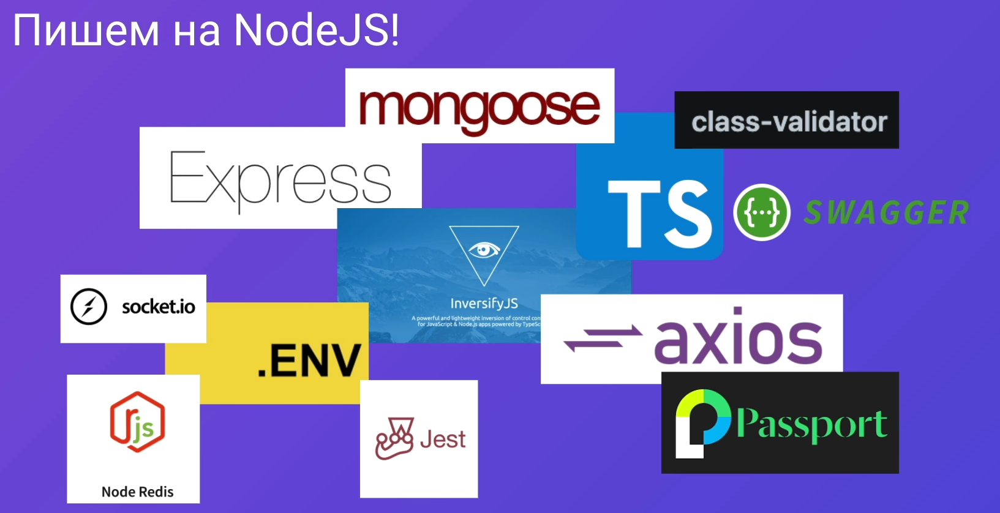
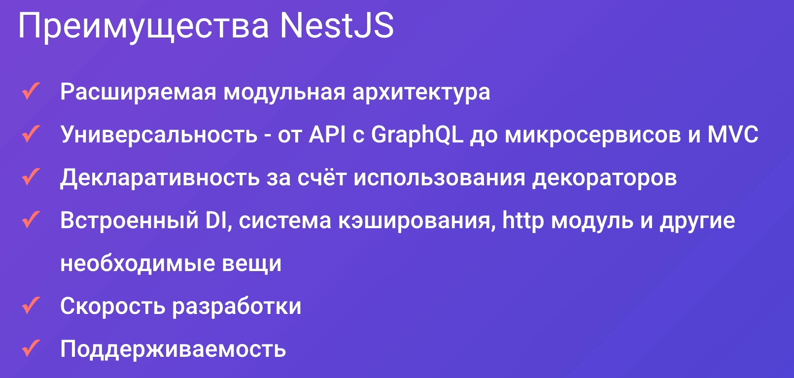
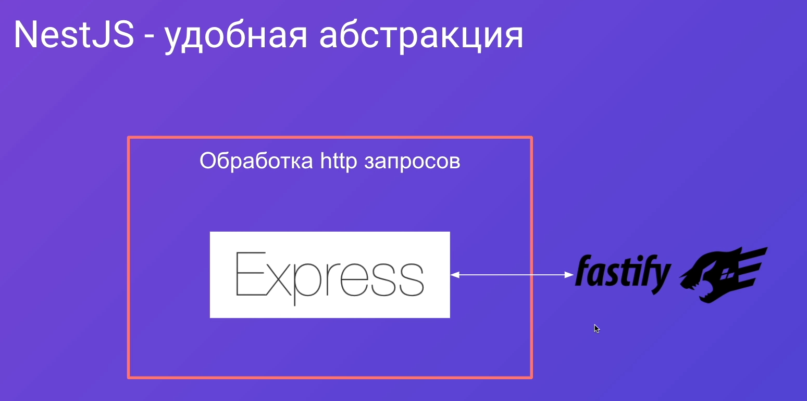
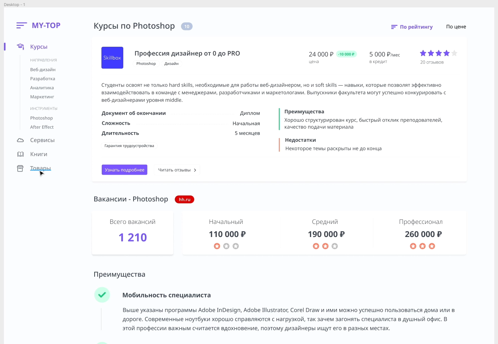

В современном мире для построения большого и среднего бэкэнда под сайт требуется огромное количество библиотек и разных технологий:
- ==Typescript== для простого и быстрого рефакторинга кода
- ==Express== для минимального построения архитектуры приложения
- ==InversifyJs== для эффективного внедрения зависимостей и построения контейнера
- ==Mongoose== для подключения к монге
- ==Axios== для написания запросов на фронт
- ==Redis== для кеширования данных
- ==.env== для работы с переменными окружения
- ==Jest== для написания тестов на отдельные части приложения
- ==Socket.io== для построения приложения на сокетах
- ==class-validator== для проиведения валидации данных на сервере
- ==Passport== уже позволит нам прикрутить регистрацию и авторизацию пользователя в системе
- ==Swagger== позволит с фронта просмотреть список доступных API на бэке

И вот такой велосипед придётся собирать каждый раз под каждый проект

Преймущества, которые позволяют удерживать несту лидирующие места:

Нест используется уже во многих компаниях как фреймворк для бэкэнда, поэтому его спокойно можно использовать на проектах любого масштаба

- Модули в несте инкапсулируют определённые сервисы, которые занимаются своей задачей
- Модули могут быть связаны и зависеть друг от друга
- Хорошей практикой будет разделить разную логику на сервисы (сервис по работе с бизнес-логикой и для работы с базой данных)
- Контроллер отвечает только за то, какой сервис должен дёрнутся при запросе от клиента 

Так же некст позволяет нам абстрагироваться от конкретной реализации конкретной библиотеки. Мы можем написать собственную библиотеку, которая будет абстракцией уже над существующей библиотекой.

Далее по курсу будет разрабатываться API для сайта по топам курсов, где будутпредставлены:
- Сами курсы
- Цена курса
- Цена по кредиту
- Отзывы
- Оценки
- Различные вкладки сайта

