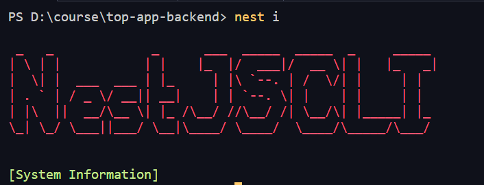

## Работа с NestCLI

Первым делом, нам нужно установить CLI от неста, чтобы с ним эффективно работать

```bash
npm i -g @nestjs/cli
```



Чтобы создать новый проект, нужно уже записать данную команду

```bash
nest new <name> [options]
```

Так же мы имеем дополнительные параметры, которые могут нам помочь в работе:
- `--dry-run` - покажет в консоли, что по идее должно было бы произойти при выполнении данной команды, но никаких реальных изменений в проекте не будет


Следующая команда создаёт компонент по определённой схеме, которую мы можем вызвать через `nest i`

```bash
nest generate <schematic> <name> [options]
```


*Пример*: данная команда сгенерирует сервис

```bash
nest g s myService
```

Тут уже можно увидеть, что флаг `--flat` генерирует файлы в той же папке, где и исполняется индексовый файл. Однако, если насильно указать в запросе папку перед названием файла, то она всё равно будет сгенерирована


Следующая команда уже используется для билда проекта на продакшен

```bash
nest build
```


Собирает и запускает проект

```bash
nest start
```


