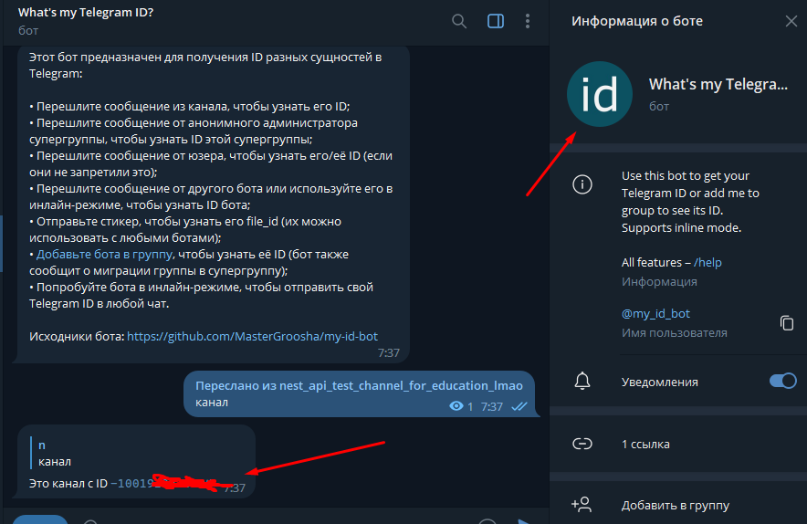
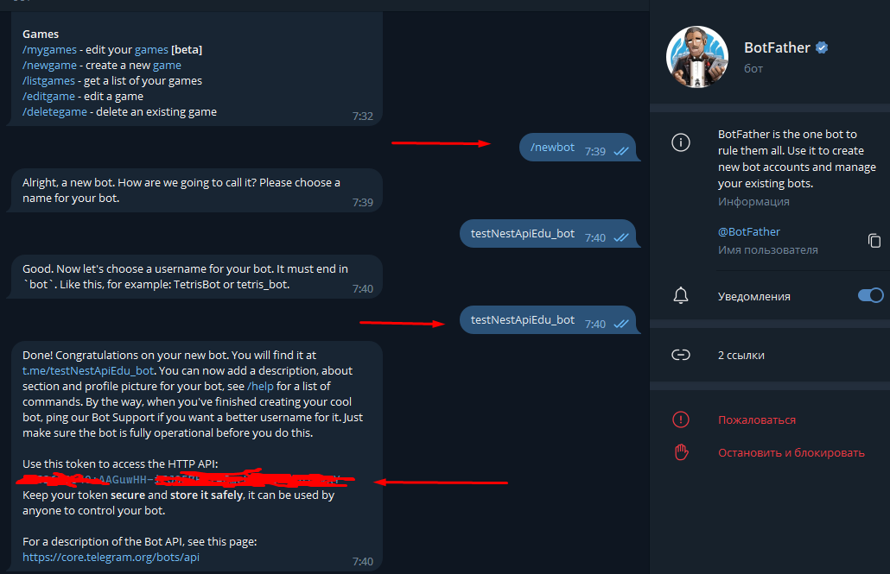
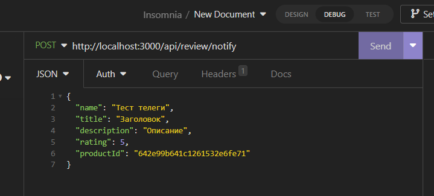
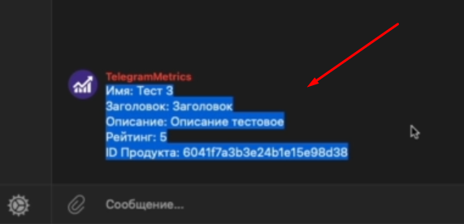

## 1. Подготовка бота

Взаимодействие с телеграмом можно осуществлять как через обычные запросы по их АПИ, так и через модуль `Telegraf`, который реализует у себя всю нужную функциональность 


Для начала работы от самого телеграма нам понадобится токен нашего бота и id чата


Чтобы получить id чата, нужно добавить в чат бота, который по полученному сообщению будет доставать id 




Для генерации id бота нужно будет обратиться к [@BotFather](https://t.me/BotFather) 



## 2. Интеграция Telegraf

Первым делом нужно установить библиотеку, которая будет осуществлять взаимодействие с телегой

```bash
npm i telegraf
```

Контроллер тут нам не понадобится, так как мы будем пользоваться уже существующим

```bash
nest g module telegram
nest g service telegram --no-spec
```

Добавляем в среду окружения полученные id 

`.env`
```env
CHAT_ID=-100... 
TELEGRAM_TOKEN=6052658640:AAG...
```

Создадим интерфейс `ITelegramOptions`, который опишет ту конфигурацию, которую мы будем передавать в телеграф и `ITelegramModuleAsyncOptions`, который опишет те данные, которые должны будут принимать в себя опции для создания нашей собственной реализации интеграции модуля `forRootAsync` (как это работает в `Typegoose`)

`src > telegram > telegram.interface.ts`
```TS
import { ModuleMetadata } from '@nestjs/common';

export interface ITelegramOptions {
	chatId: string;
	token: string;
}

export interface ITelegramModuleAsyncOptions extends Pick<ModuleMetadata, 'imports'> {
	useFactory: (...args: any[]) => Promise<ITelegramOptions> | ITelegramOptions;
	inject?: any[];
}
```

Далее нам нужно сюда заинжектить `ConfigService` (инжектится он сюда, потому что мы подключим его через `app.module.ts` дальше), который предоставляет возможность взаимодействовать с `.env`

`src > configs > telegram.config.ts`
```TS
import { ConfigService } from '@nestjs/config';
import { ITelegramOptions } from 'src/telegram/telegram.interface';

export const getTelegramConfig = (configService: ConfigService): ITelegramOptions => {
	const token = configService.get('TELEGRAM_TOKEN');
	if (!token) {
		throw new Error('TELEGRAM_TOKEN не задан');
	}
	return {
		token,
		chatId: configService.get('CHAT_ID') ?? '',
	};
};
```

Далее создадим константу, по которой мы сможем получать опции для нашего модуля телеграма по всему приложению через инжект

`src > telegram > telegram.constants.ts`
```TS
export const TELEGRAM_MODULE_OPTIONS = 'TELEGRAM_MODULE_OPTIONS';
```

Дальше в модуле мы должны описать две функции, которые мы будем использовать при внедрении данного модуля в `app.module.ts`:
- `forRootAsync()` - создаст конфиг для подключения данного модуля
- `createAsyncOptionsProvider()` - соберёт опции для подключения

`src > telegram > telegram.module.ts`
```TS
import { DynamicModule, Global, Module, Provider } from '@nestjs/common';
import { TelegramService } from './telegram.service';
import { ITelegramModuleAsyncOptions } from './telegram.interface';
import { TELEGRAM_MODULE_OPTIONS } from './telegram.constants';

@Global()
@Module({})
export class TelegramModule {
	// тут мы создаём асинхронно наш модуль
	static forRootAsync(options: ITelegramModuleAsyncOptions): DynamicModule {
		// создаём асинхронные опции в качестве провайдера
		// в качестве провайдера для того, чтобы в любом месте его можно было достать по токену TELEGRAM_MODULE_OPTIONS
		const asyncOptions = this.createAsyncOptionsProvider(options);
		return {
			module: TelegramModule,
			imports: options.imports,
			providers: [TelegramService, asyncOptions],
			exports: [TelegramService],
		};
	}

	// эта функция будет возвращать готовый провайдер, в который будет внедрены useFactory и опции
	private static createAsyncOptionsProvider(options: ITelegramModuleAsyncOptions): Provider {
		return {
			// провайдим опции по токену
			provide: TELEGRAM_MODULE_OPTIONS,
			// используем фэктори
			useFactory: async (...args: any[]) => {
				// тут мы вызываем фэктори, который передали уже внутри options для формирования конфигурации
				const config = await options.useFactory(...args);
				return config;
			},
			// инжектим внутрь провайдера необходимые зависимости (например, если нам нужен будет ConfigService)
			inject: options.inject || [],
		};
	}
}
```

В сервисе уже реализуем работу с телеграмом через сам телеграф

`src > telegram > telegram.service.ts`
```TS
import { Inject, Injectable } from '@nestjs/common';
import { Telegraf } from 'telegraf';
import { TELEGRAM_MODULE_OPTIONS } from './telegram.constants';
import { ITelegramOptions } from './telegram.interface';

@Injectable()
export class TelegramService {
	bot: Telegraf;
	options: ITelegramOptions;

	constructor(@Inject(TELEGRAM_MODULE_OPTIONS) options: ITelegramOptions) {
		this.bot = new Telegraf(options.token);
		this.options = options;
	}

	async sendMessage(message: string, chatId: string = this.options.chatId) {
		// отправляем сообщение, написав id чата и само сообщение для отправки
		await this.bot.telegram.sendMessage(chatId, message);
	}
}
```

Далее нам нужно глобально подключить наш `TelegramModule` и добавить ему `ConfigService`, а так же для `useFactory` назначить функцию сборки конфига `getTelegramConfig`

`src > app.module.ts`
```TS
@Module({  
   imports: [  
      ConfigModule.forRoot(),  
      TypegooseModule.forRootAsync({  
         imports: [ConfigModule],  
         inject: [ConfigService],  
         useFactory: getMongoConfig,  
      }),  
      AuthModule,  
      ProductModule,  
      ReviewModule,  
      TopPageModule,  
      FilesModule,  
      TelegramModule.forRootAsync({  
         // импортируем ConfigModule, потому что в нём находится ConfigService  
         imports: [ConfigModule],  
         // инжектим ConfigService, чтобы фектори мог его использовать  
         inject: [ConfigService],  
         useFactory: getTelegramConfig,  
      }),  
   ],  
   controllers: [AppController],  
   providers: [AppService],  
})  
export class AppModule {}
```

Далее подключаем `TelegramModule` в модуль для создания обзоров

`src > review > review.module.ts`
```TS
@Module({
	controllers: [ReviewController],
	imports: [
		TypegooseModule.forFeature([
			{
				typegooseClass: ReviewModel,
				schemaOptions: {
					collection: 'Review',
				},
			},
		]),
		TelegramModule,
	],
	providers: [ReviewService],
})
export class ReviewModule {}
```

Далее нам нужно инжектнуть `TelegramService` в контроллер обзоров и тут же вызвать отправку сообщения через метод `notify`

`src > review > review.controller.ts`


Далее нам остаётся дать запрос на роут нотифая



И мы получаем имя нашего бота


