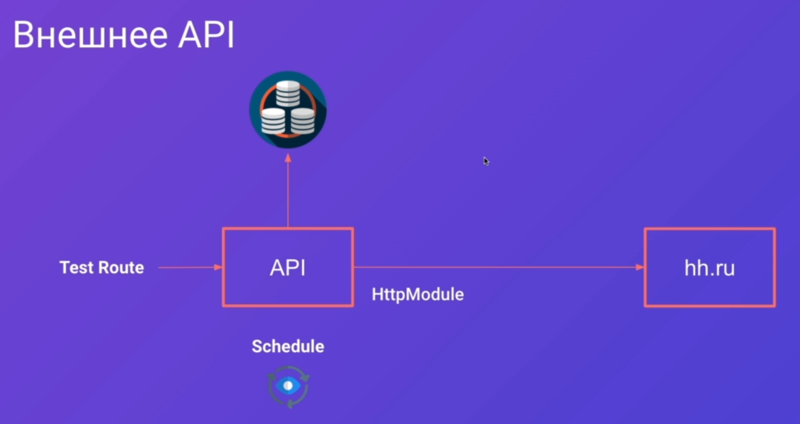
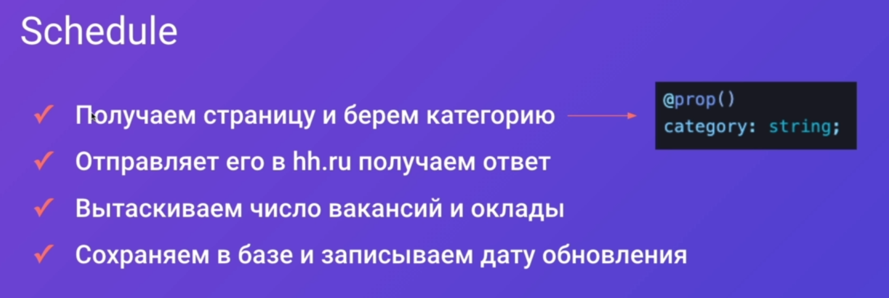
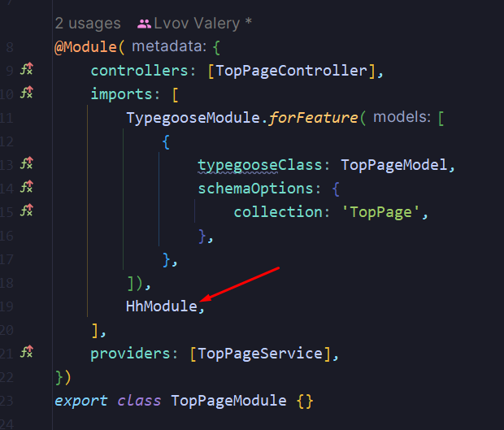
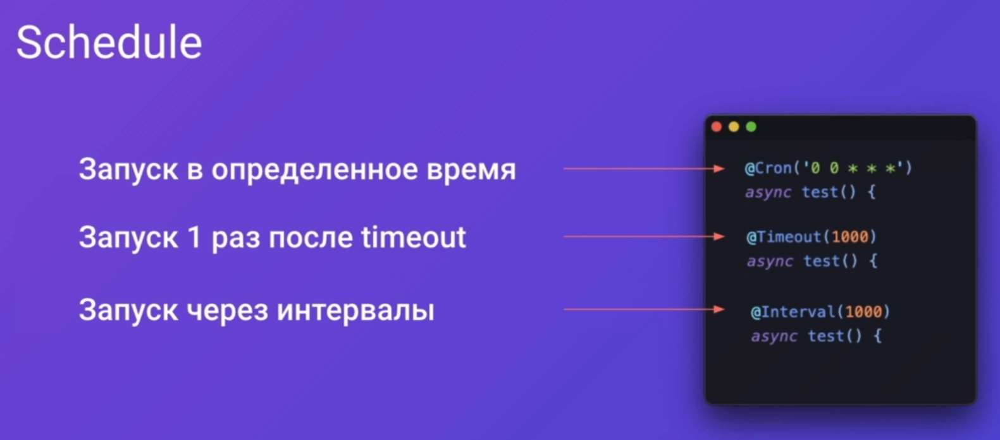
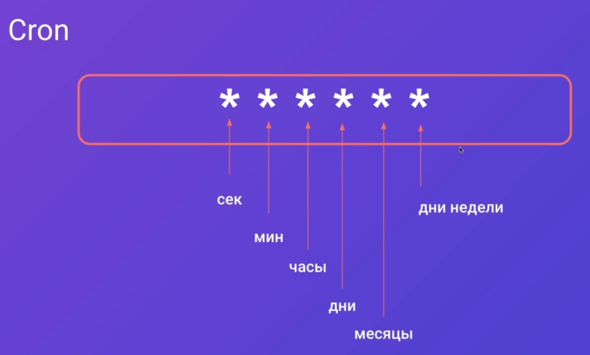
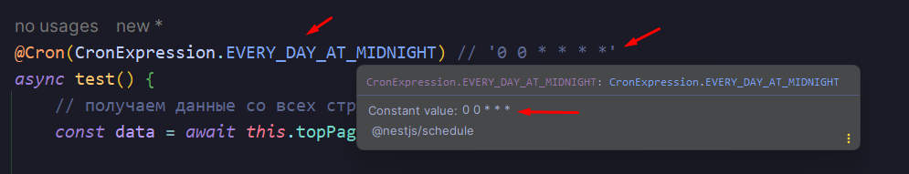

## 1. Обзор модуля

Нам нужно будет подключить два внешних API для работы с данными, которые мы можем получить с *hh.ru*:
- `HttpModule` - позволяет отправлять Htttp-запросы
- `Schedule` - позволяет выполнять запросы по определённому расписанию

Такая связка часто используется, чтобы доставать и загружать определённые данные по расписанию



Порядок действий:

[Тут](https://github.com/hhru/api) находится документация по АПИ *hh.ru* 



## 2. Подготовка моделей

По полученной выше документации запрос на вакансии по запросу `typescript`, мы получаем такой ответ:


Добавляем модуль и сервис **hh**

```bash
nest g module hh
nest g service hh --no-spec
```

Модель описана интерфейсами по той причине, что нам нет нужды валидировать её (сторонний АПИ как-никак).

Тут мы описываем ответ по тем данным, которые приходят к нам с *hh.ru*

`src > hh > hh.model.ts`
```TS
// ответ от hh.ru
export interface HhResponse {
	items: Vacancy[];
	found: number;
	pages: number;
	per_page: number;
	page: number;
	clusters: Cluster[];
	arguments?: any;
	alternate_url: string;
}

// это отдельный кластер
export interface Cluster {
	name: string;
	id: string;
	items: ClusterElement[];
}

// отдельный элемент кластера
export interface ClusterElement {
	name: string;
	url: string;
	count: number;
}

// вакансия
export interface Vacancy {
	id: string;
	premium: boolean;
	name: string;
	department?: any;
	has_test: boolean;
	response_letter_required: boolean;
	area: Area;
	salary?: Salary;
	type: Type;
	address?: Address;
	response_url?: any;
	sort_point_distance?: any;
	published_at: string;
	created_at: string;
	archived: boolean;
	apply_alternate_url: string;
	insider_interview?: any;
	url: string;
	alternate_url: string;
	relations: any[];
	employer: Employer;
	snippet: Snippet;
	contacts?: Contact;
	schedule: Type;
	working_days: any[];
	working_time_intervals: any[];
	working_time_modes: any[];
	accept_temporary: boolean;
}

// контакты в вакансии
export interface Contact {
	name: string;
	email: string;
	phones: Phone[];
}

// телефон
export interface Phone {
	comment?: any;
	city: string;
	number: string;
	country: string;
}

//
export interface Snippet {
	requirement?: string;
	responsibility?: string;
}

// сотрудник
export interface Employer {
	id: string;
	name: string;
	url: string;
	alternate_url: string;
	logo_urls?: Logourl;
	vacancies_url: string;
	trusted: boolean;
}

//
export interface Logourl {
	'90': string;
	'240': string;
	original: string;
}

//
export interface Address {
	city?: string;
	street?: string;
	building?: string;
	description?: any;
	lat?: number;
	lng?: number;
	raw?: string;
	metro?: Metro;
	metro_stations: Metro[];
	id: string;
}

//
export interface Metro {
	station_name: string;
	line_name: string;
	station_id: string;
	line_id: string;
	lat: number;
	lng: number;
}

//
export interface Type {
	id: string;
	name: string;
}

//
export interface Salary {
	from: number;
	to?: number;
	currency: string;
	gross: boolean;
}

//
export interface Area {
	id: string;
	name: string;
	url: string;
}
```

Первым делом мы экспортируем наш сервис топ-пейджа, чтобы воспользоваться им в `HhModule`

`src > top-page > top-page.module.ts`
```TS
@Module({  
   controllers: [TopPageController],  
   imports: [  
      TypegooseModule.forFeature([  
         {  
            typegooseClass: TopPageModel,  
            schemaOptions: {  
               collection: 'TopPage',  
            },  
         },  
      ]),  
   ],  
   providers: [TopPageService],  
   exports: [TopPageService],  
})  
export class TopPageModule {}
```

Импортируем в `HhModule` сервис топ-пейджа, методы которого будем вызвать в данном модуле

`src > hh > hh.module.ts`
```TS
import { Module } from '@nestjs/common';
import { HhService } from './hh.service';
import { TopPageService } from '../top-page/top-page.service';

@Module({
	providers: [HhService],
	imports: [TopPageService],
})
export class HhModule {}
```

В сервисе топ-пейджа нужно будет добавить метод `findForHhUpdate()`, который будет искать **Курсы** для обновления данных **hh** (будем обновлять зарплаты в них)

`src > top-page > top-page.service.ts`
```TS
// метод, который будет искать все те записи, которые нужно обновить
async findForHhUpdate(date: Date) {
	return this.topPageModel
		.find({
			firstCategory: 0,
			// обращаемся к вложенному свойству
			'hh.updatedAt': {
				// ищем дату старше, чем текущая дата -1 день
				$lt: addDays(date, -1),
			},
		})
		.exec();
}
```

Так же нам нужно будет добавить дату обновления в модель топ-пейджа

`src > top-page > top-page.model.ts`
```TS
export class HhData {
	@prop()
	count: number; // количество вакансий

	@prop()
	juniorSalary: number;

	@prop()
	middleSalary: number;

	@prop()
	seniorSalary: number;

	@prop()
	updatedAt: Date; // дата
}
```

Так же добавляем дату в модель создания топ-пейджа

`src > top-page > create-top-page.model.ts`
```TS
export class HhDataDto {  
   @IsNumber()  
   count: number;  
  
   @IsNumber()  
   juniorSalary: number;  
  
   @IsNumber()  
   middleSalary: number;  
  
   @IsNumber()  
   seniorSalary: number;  
  
   @IsDate()  
   updatedAt: Date; // дата  
}
```

## 3. HttpModule

Устанавливаем нестовский `axios` и чистый модуль `axios` для запросов

```bash
npm i @nestjs/axios axios
```

Экспортируем сервис `HhService` из модуля **hh**, чтобы использовать его в топ-пейдже

`src > hh > hh.module.ts`
```TS
import { Module } from '@nestjs/common';
import { HhService } from './hh.service';
import { ConfigModule } from '@nestjs/config';
import { HttpModule } from '@nestjs/axios';

@Module({
	providers: [HhService],
	imports: [ConfigModule, HttpModule],
	exports: [HhService],
})
export class HhModule {}
```

Реализуем в `HhService`:
- `getData` - отправляет запрос на сервер на получение данных
- `parseData` - парсит полученные данные и достаёт нужное из ответа
- `getSalaryFromString` - получает только зарплаты из полученных строк с зарплатами

`src > hh > hh.service.ts`
```TS
import { Injectable, Logger } from '@nestjs/common';
import { ConfigService } from '@nestjs/config';
import { HttpService } from '@nestjs/axios';
import { API_URL, CLUSTER_FIND_ERROR, SALARY_CLUSTER_ID } from './hh.constants';
import { HhResponse } from './hh.models';
import { HhData } from '../top-page/top-page.model';
import { lastValueFrom } from 'rxjs';

@Injectable()
export class HhService {
	private readonly token: string;

	constructor(
		// просто инжектим сервис конфигурации без реализации forRootAsync
		private readonly configService: ConfigService,
		// Инжектим сервис для http-запросов
		private readonly httpService: HttpService,
	) {
		// получаем токен из env
		this.token = this.configService.get('HH_TOKEN') ?? '';
	}

	// тут мы будем получать данные с АПИ хх.ру
	async getData(text: string) {
		try {
			// lastValueFrom кастует вложенный в него код в Observable и ждёт получения от него данных
			const { data } = await lastValueFrom(
				// тут мы отправляем запрос на получение ответа от hh.ru
				this.httpService.get<HhResponse>(API_URL.vacancies, {
					// параметры запроса
					params: {
						// текст запроса ровно тот, который пришёл
						text,
						// информацию мы хотим получать по кластерам
						clusters: true,
					},
					// заголовки
					headers: {
						// пользователь, который запрашивает данные
						'User-Agent': 'GainTop/2.3 (smoli@gmail.com)',
						// авторизация запроса
						Authorization: 'Bearer ' + this.token,
					},
				}),
			);

			// возвращаем отпаршенные даныне
			return this.parseData(data);
		} catch (e) {
			// если получим ошибку, то нужно будет её вывести
			Logger.error(e);
		}
	}

	// тут мы будем парсить полученные данные
	private parseData(data: HhResponse): HhData {
		// ищем кластер, id которого = salary
		const salaryCluster = data.clusters.find((c) => c.id === SALARY_CLUSTER_ID);

		// если кластер не найден, то нужно будет выкинуть ошибку
		if (!salaryCluster) {
			throw new Error(CLUSTER_FIND_ERROR);
		}

		// зарплата джуна
		// выбираем вторую запись из полученного массива зарплат
		const juniorSalary = this.getSalaryFromString(salaryCluster.items[1].name);

		// зарплата мидла
		const middleSalary = this.getSalaryFromString(
			// берём зарплату из середины списка
			salaryCluster.items[Math.ceil(salaryCluster.items.length / 2)].name,
		);

		// зарплата сеньора
		const seniorSalary = this.getSalaryFromString(
			// выбираем из списка самую высокую зарплату
			salaryCluster.items[salaryCluster.items.length - 1].name,
		);

		return {
			// количество вакансий
			count: data.found,
			// зарплаты
			juniorSalary,
			middleSalary,
			seniorSalary,
			// дата обновления
			updatedAt: new Date(),
		};
	}

	// тут мы будем получать зарплату цифрой из полученного ответа
	private getSalaryFromString(s: string): number {
		// выбираем несколько подряд идущих чисел
		const numberRegExp = /(\d+)/g;

		// сохраняем все совпадения по regexp
		const res = s.match(numberRegExp);

		// если результата нет
		if (!res) {
			return 0;
		}

		// если всё ок, то вернём число
		return Number(res[0]);
	}
}
```

Выносим все возможные для переиспользования строки в отдельный файл с константами

`src > hh > hh.constants.ts`
```TS
// ссылка на корень АПИ хх
const API_ROOT_API = 'https://api.hh.ru';

// тут находится объект с разными роутами хх
export const API_URL = {
	vacancies: API_ROOT_API + '/vacancies',
};

// id кластера зарплат
export const SALARY_CLUSTER_ID = 'salary';

// ошибка ненайденного кластера
export const CLUSTER_FIND_ERROR = 'Не найден кластер Salary';
```

Добавляем в зависимости топ-пейджа модуль `HhModule`

`src > top-page > top-page.module.ts`


Добавляем в сервис главной страницы `findForHhUpdate`, который будет искать данные для обновления в сервисе **hh**  

`src > top-page > top-page.service.ts`
```TS
import { Injectable } from '@nestjs/common';
import { TopLevelCategory, TopPageModel } from './top-page.model';
import { InjectModel } from 'nestjs-typegoose';
import { ModelType } from '@typegoose/typegoose/lib/types';
import { CreateTopPageDto } from './dto/create-top-page.dto';
import { addDays } from 'date-fns';
import { Types } from 'mongoose';

@Injectable()
export class TopPageService {
	constructor(
		@InjectModel(TopPageModel) private readonly topPageModel: ModelType<TopPageModel>,
	) {}

	async create(dto: CreateTopPageDto) {
		return this.topPageModel.create(dto);
	}

	async findById(id: string) {
		return this.topPageModel.findById(id).exec();
	}

	async findByAlias(alias: string) {
		return this.topPageModel.findOne({ alias }).exec();
	}

	async findAll() {
		return this.topPageModel.find({}).exec();
	}

	async findByCategory(firstCategory: TopLevelCategory) {
		return this.topPageModel
			.aggregate()
			.match({
				firstCategory,
			})
			.group({
				_id: { secondCategory: '$secondCategory' },
				pages: {
					$push: { alias: '$alias', title: '$title', _id: '$_id', category: '$category' },
				},
			})
			.exec();
	}

	async findByText(text: string) {
		return this.topPageModel.find({ $text: { $search: text, $caseSensitive: false } }).exec();
	}

	async deleteById(id: string) {
		return this.topPageModel.findByIdAndRemove(id).exec();
	}

	// так же сюда может прилететь не только строка, но и Types.ObjectId
	async updateById(id: string | Types.ObjectId, dto: CreateTopPageDto) {
		return this.topPageModel.findByIdAndUpdate(id, dto, { new: true }).exec();
	}

	// метод, который будет искать все те записи, нужные для обновления
	async findForHhUpdate(date: Date) {
		return this.topPageModel
			.find({
				firstCategory: 0,
				// условие на выборку даты
				$or: [
					// если есть запись даты обновления, то выполняем поиск
					{ 'hh.updatedAt': { $lt: addDays(date, -1) } },
					// если даты обновления нет
					{ 'hh.updatedAt': { $exists: false } },
				],
			})
			.exec();
	}
}
```

В контроллер топ-пейджа добавляем два метода, которые будут искать данные по запросу (`textSearch`) и обновлять данные по зарплатам (`test`)

`src > top-page > top-page.controller.ts`
```TS
@Get('textSearch/:text')
async textSearch(@Param('text') text: string) {
	return this.topPageService.findByText(text);
}

// @Cron(CronExpression.EVERY_DAY_AT_MIDNIGHT)
@Post('test')
async test() {
	// получаем данные со всех страниц, которые нужно обновить
	const data = await this.topPageService.findForHhUpdate(new Date());

	//
	for (let page of data) {
		page.hh = await this.hhService.getData(page.category);
		await this.topPageService.updateById(page._id, page);
	}
}
```

## 4. ScheduleModule

Устанавливаем нужные зависимости в проект:

```bash
npm i @nestjs/schedule
npm i -D @types/cron
```

После установки зависимости, у нас появится доступ к трём декораторам:
- `Cron` - позволяет запускать функцию в определённое время
- `Timeout` - запускает один раз через определённый промежуток
- `Interval` - запускает по заданному интервалу



Нотация крона:
- `0 0 0 0 2 5` - запуск каждую пятницу февраля



Далее запускаем задачу выполнения контроллера в определённое время.

Так же мы можем через `SchedulerRegistry` получать доступ к выполняемой кроном задаче. Это может пригодиться, если мы каждые несколько минут запускаем выполнение задачи и она может не успеть выполниться 

`src > top-page > top-page.controller.ts`
```TS
constructor(
	private readonly topPageService: TopPageService,
	private readonly hhService: HhService,
	private readonly schedulerRegistry: SchedulerRegistry,
) {}

/// CODE ...

@Cron(CronExpression.EVERY_DAY_AT_MIDNIGHT, { name: 'test' }) // '0 0 * * * *'
async test() {
	// получаем задачу крона 
	const job = this.schedulerRegistry.getCronJob('test');

	const data = await this.topPageService.findForHhUpdate(new Date());

	for (let page of data) {
		page.hh = await this.hhService.getData(page.category);
		await this.topPageService.updateById(page._id, page);
	}
}
```



> [!info] Рекомендации по использованию `Cron`:
> - Не нужно использовать его на целиковых сервисах. Это затруднит поиск триггера определённых задач
> - Если у нас большой микросервис, то стоит вынести все запуски крона в отдельный микросервис
