### 001 Основные концепции


Файл-серверные СУБД не могут предоставить высокую надёжность данных и доступность. Они позволяют разгрузить нагрузку на сервер с данными, но от него высока нагрузка на локальную сеть. Такие СУБД не способы справляться с большой нагрузкой

Клиент-серверные используются по концепции сервер-пльзователь. Сервер принимает всю нагрузку во время работы.

Встраиваемые СУБД обычно используются в мобильных приложениях в качестве системы поиска и хранения данных пользователя. Представляет собой библиотеку

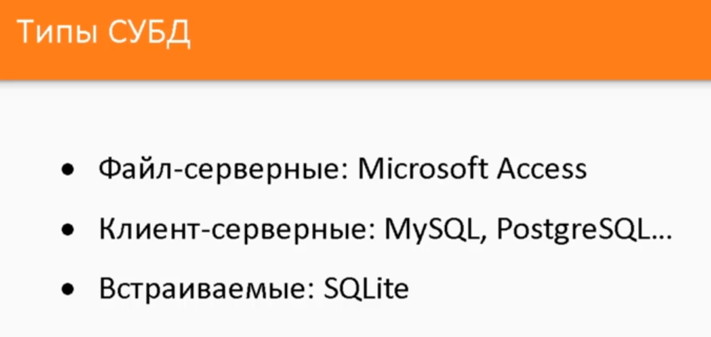
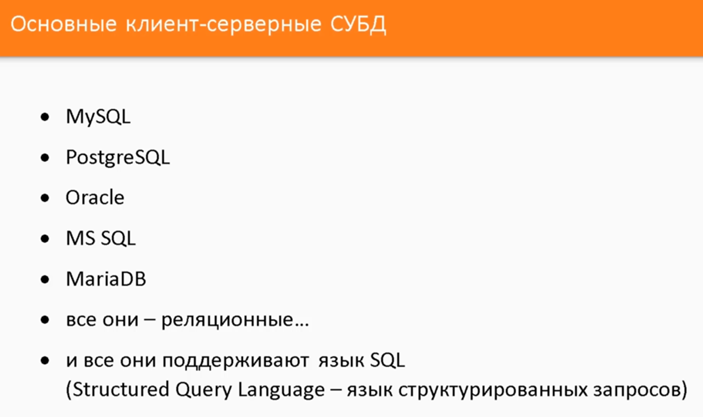

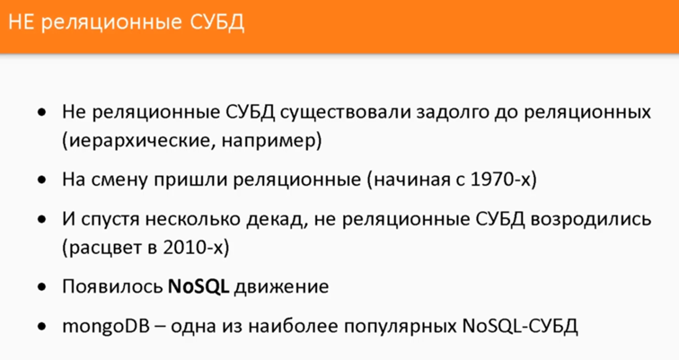


011 -Northwind - https://1drv.ms/u/s!AqtQeAOHZEjQuqteZmactYPQo1--Gg?e=waXi8e

### 002 Реляционная модель и SQL


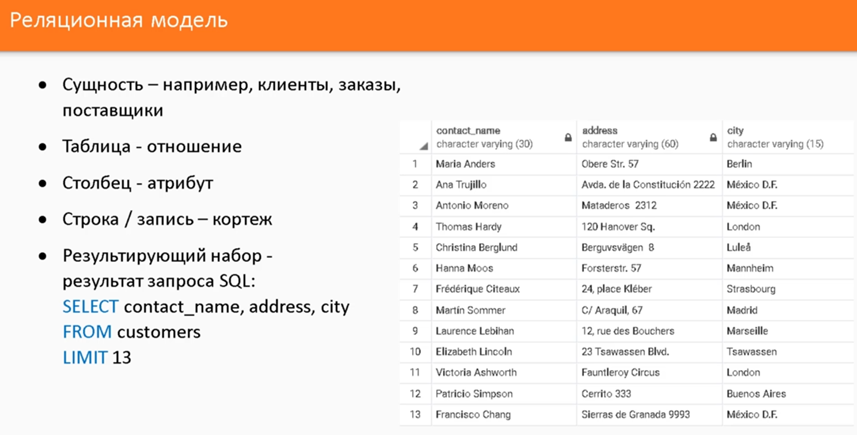

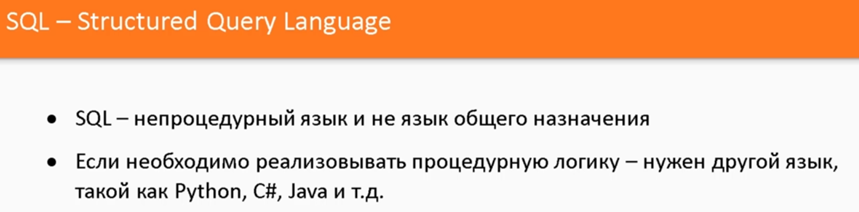


- SQL-запросы делятся на данные группы по своему назначению.

В каждой СУБД используется свой диалект SQL. Однако они все придерживаются стандарта ANSI-92. Так же разница присутствует и в процедурных расширениях

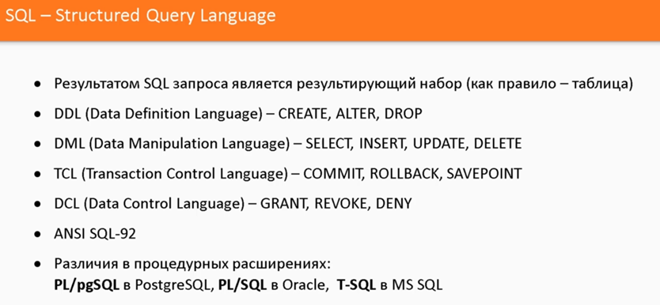


### 003 Почему PostgreSQL
-
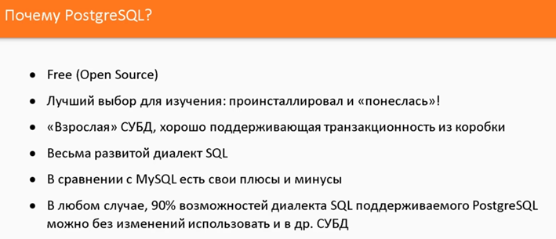


### 005 Типы данных в PostgreSQL

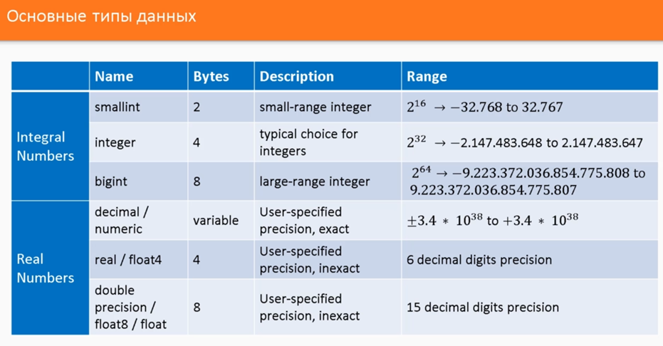


- serial-значения будут инкрементироваться автоматически в БД и их изменять не надо. Это, грубо говоря, индексы. Они начинаются в БД с 1

Char представляет из себя фиксированное значение. Например, если мы уже знаем какой длинны будет строка, то чар выделит только нужное количество памяти. Если ввести строку меньшего размера, то она добьётся пробелами. Varchar не добивает строку пробелами. Text поддерживает любой размер строки (в прошлые типы данных в n подставляется длина строки)

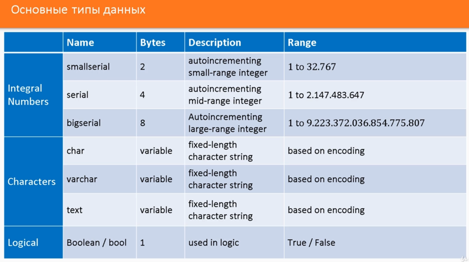

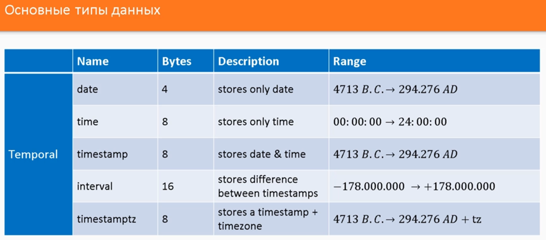

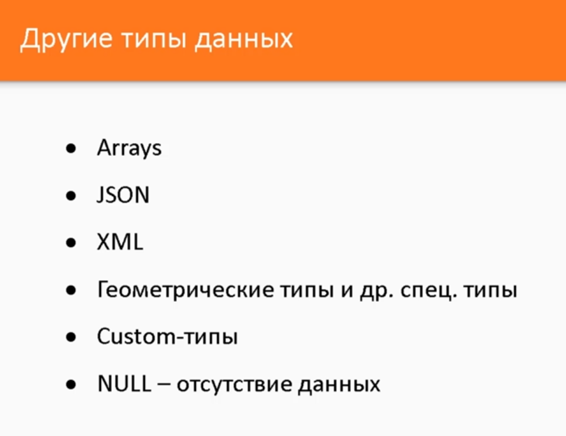


### 006 Создание БД

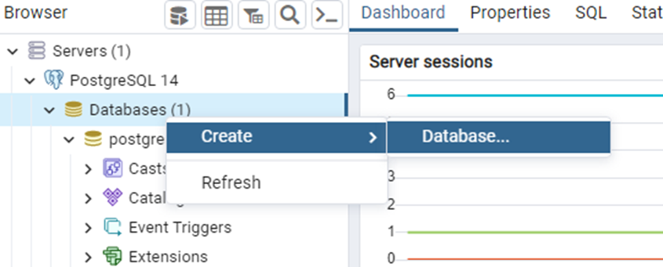

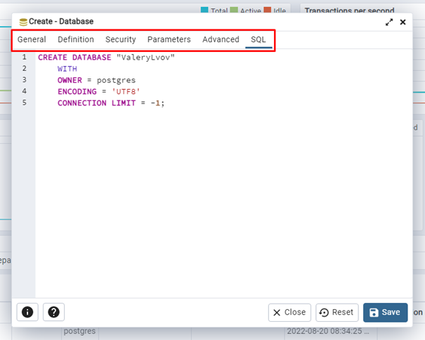


- Далее пойдёт речь про удаление БД.

Удалять БД можно только если к ней нет никаких подключений. Если они есть, то их придётся удалять.

Чтобы удалить БД, нужно встать на другую БД и через неё произвести удаление нужной нам БД

На рисунке отцепление БД:

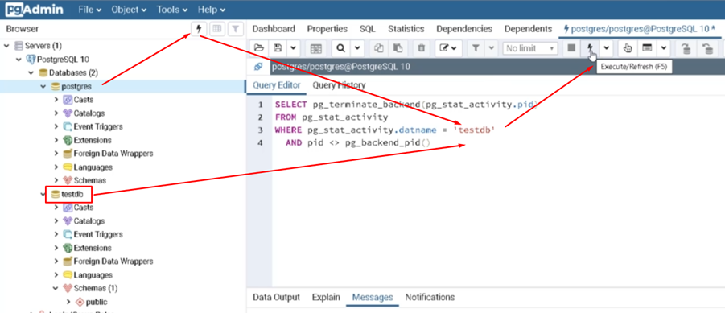


Такой код позволяет удалить БД

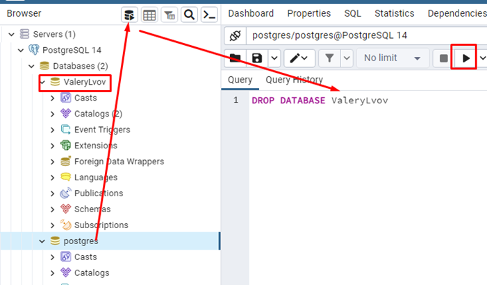


Создание БД тоже производится через другую БД

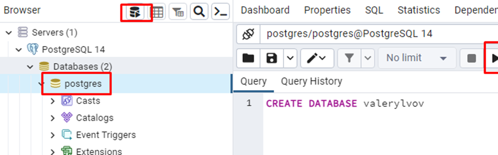


### 007 Создание таблиц

- И вот примерно так выглядит синтаксис создания таблиц.

Мы так же открываем редактор нужной нам БД. Первая строка отвечает за создание самой таблицы. В следующих строках у нас идут инструкции внутри «()», которые ограничиваются запятой. Внутри инструкции мы прописываем наименование столбца, далее тип принимаемого в него значения и определённый модификатор.

Primary Key говорит нам, что данный столбец будет ключевым и будет содержать число строки.

NOT NULL запрещает помещать отсутствующее значение в строку.

Чтобы написать второй блок инструкций, нам нужно отделить блоки кода «;»

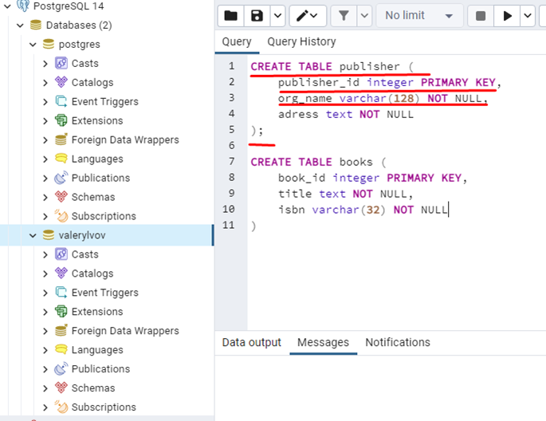


Таким способом мы можем удалять ненужные таблицы

```SQL
DROP TABLE Pusblisher;
DROP TABLE Books;
```


Так же мы можем создавать таблицы посредством инструментария самой СУБД

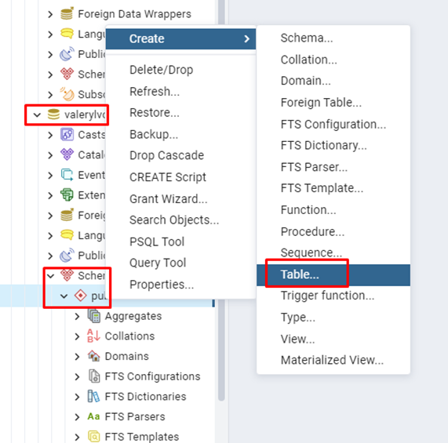


Для начала задём имя

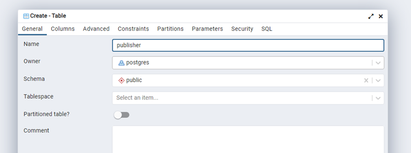


Потом создаём столбцы

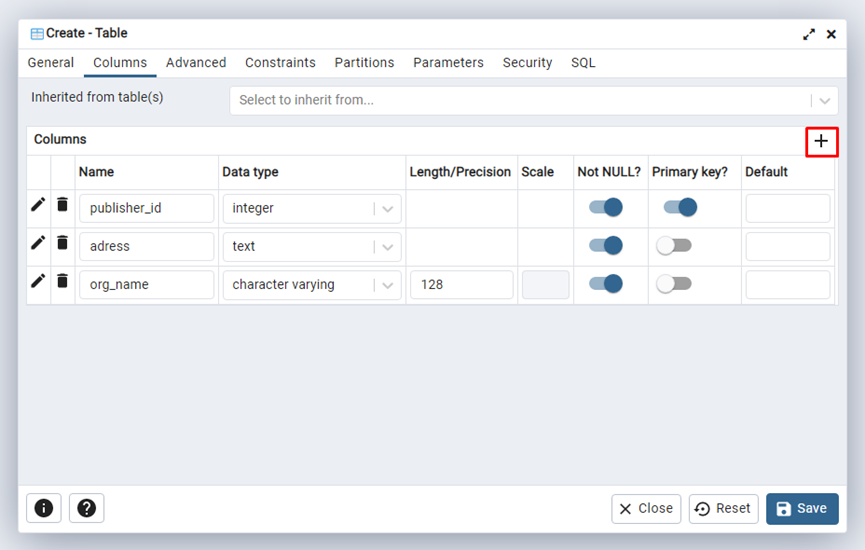


И в констрэинтах создаём имя для праймари кея. Дело в том, что по соглашениям наименование ПК должно начинаться на «pk_»

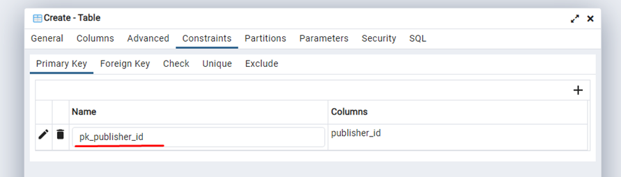


### 008 Отношение 'один ко многим'

С помощью синтаксиса `INSERT INTO таблица VALUES(значения_1),(значения_2);` мы можем добавить нужные нам значения в поля таблицы

```SQL
INSERT INTO books
VALUES
(1, 'The diary of a yong girl', '12931293'),
(2, 'Lord of the rings', '12314245');
```

Чтобы заэкранировать кавычку в слове, нужно её написать дважды

```SQL
INSERT INTO publisher 
VALUES
(1, 'Evryman''s library', 'NY'); // экранирование
```

Через команду SELECT мы можем вывести нужные нам данные по определённому запросу

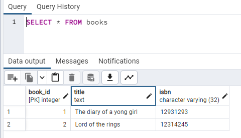

Конкретно в нашем примере мы имеем две сущности - издатель и книга. Нам нужно показать, что один издатель может выпустить несколько книг. 
Тут показан пример связи один ко многим

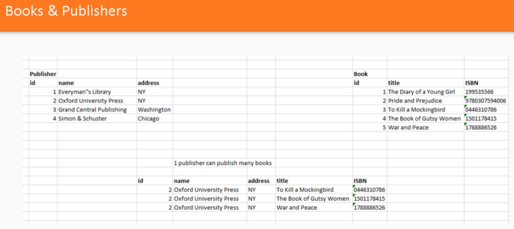

Уже таким способом мы можем попробовать добавить зависимость в таблицу книг (через создание внешнего ключа, который будет зависимостью от паблишера)

```SQL
ALTER TABLE books
ADD COLUMN fk_publisher_id;

ALTER TABLE books 
ADD CONSTRAINT fk_book_publisher 
FOREIGN KEY(fk_publisher_id) REFERENCES publisher(publisher_id);
```

Или же мы можем добавлять зависимости при создании таблицы
Так же когда мы создаём колонку ==(при создании таблицы)== с внешним ключом, нам не нужно указывать, что это внешний ключ (`FOREIGN KEY`). Нам просто нужно указать `REFERENCES` ==(на что ссылается)==

```SQL
CREATE TABLE book (
	book_id integer PRIMARY KEY,
	title text NOT NULL,
	isbn varchar(32) NOT NULL,
	fk_publisher_id integer REFERENCES publisher(publisher_id) NOT NULL
);
```

Что нам даёт такая реализация связей?
Например, нам нужно найти книги, которые выпустило издательство Oxford University Press. Мы просто смотрим на таблицу с id нашего издателя и по этому id ищем записи в таблице
Конкретно тут под `один ко многим` имеется ввиду, что одно издательство может опубликовать несколько книг 

### 009 Отношение 'один к одному'

Пример отношений один к одному:

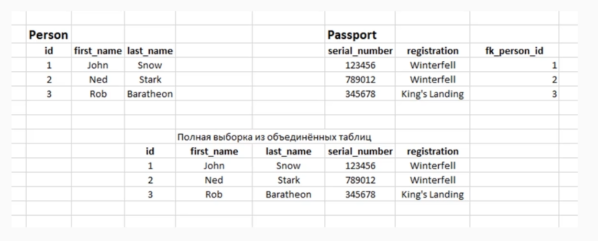

Конкретно тут мы создали условия, когда один паспорт связан с одним человеком

Создали таблицы с персонами и паспортами
```SQL
CREATE TABLE person 
(
	person_id int PRIMARY KEY,
	first_name varchar(64) NOT NULL,
	last_name varchar(64) NOT NULL
);

CREATE TABLE passport 
(
	passport_id int PRIMARY KEY,
	serial_number int NOT NULL,
	fk_passport_person int REFERENCES person(person_id)
);
```
Добавили забытый столбец с регистрацией в паспорте
```SQL
ALTER TABLE passport 
ADD COLUMN registration text NOT NULL
```
Добавили значение персоны
```SQL
INSERT INTO person VALUES  (1, 'John', 'Snow');
```
Добавили паспорт
```SQL
INSERT INTO passport VALUES (1, 123421, 1, 'WFell')
```

### 010 Отношение 'многие ко многим'

Конкретно тут нам представлена область отношений авторов к их книгам: 
1) Мы можем попробовать найти все книги за авторством кого-то
2) Мы можем найти все книги, за авторством которой стояли определённые люди

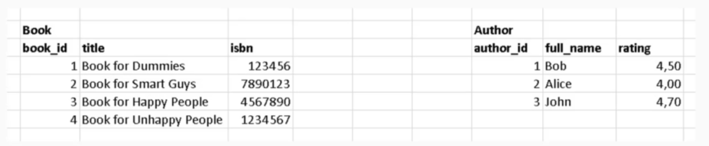

Отношения многие ко многим всегда моделируется с помощью третьей таблицы, которая их связывает. Простым `FOREIGN KEY` тут не получится обойтись

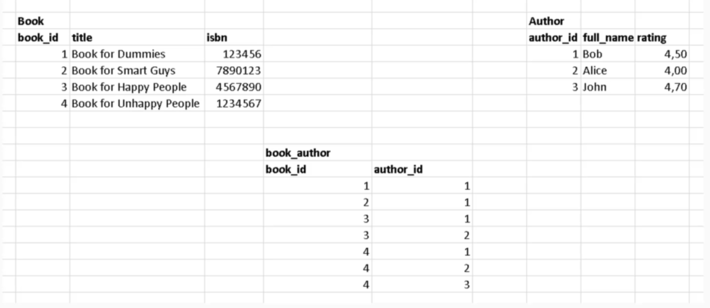

В SQL есть условие `IF EXISTS`, которое позволяет запустить команду, если существует определённое значение.

```SQL
-- удалит таблицу book и author, если они существуют 
DROP TABLE IF EXISTS book;
DROP TABLE IF EXISTS author;
```

Тут создаём таблицы книг и авторов

```SQL
CREATE TABLE book (
	book_id int PRIMARY KEY,
	title text NOT NULL,
	isbn text NOT NULL
);

CREATE TABLE author (
	author_id int PRIMARY KEY,
	full_name text NOT NULL,
	rating real
);
```

Тут уже связываем таблицы друг с другом. Через `CONSTRAINT` задаём ограничение в виде ==составного (composite) первичного ключа== 

```SQL
CREATE TABLE book_author (
	book_id int REFERENCES book(book_id),
	author_id int REFERENCES author(author_id),
	
	-- задаём ограничение/первичный ключ
	CONSTRAINT pk_book_author PRIMARY KEY (book_id, author_id) -- composite key
);
```