# MongoDB
#MongoDB #DataBase 

### Теория

MongoDB - это документоориентированная БД, которая работает с JSON форматом представления данных
База данных состоит из коллекций. Коллекции хранят документы. Документы же хранятся в JSON-подобном формате. Документы в одной коллекции необязательно должны иметь одинаковую структуру

### Что представляет из себя Mongo DB?

Коннектимся к БД

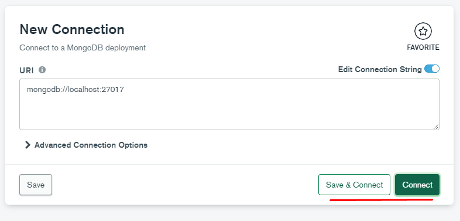

И тут мы можем увидеть все наши БД

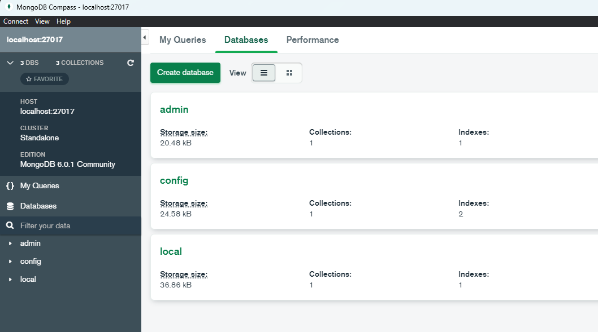

И, конечно, нужно избегать графического интерфейса и работать только в терминале

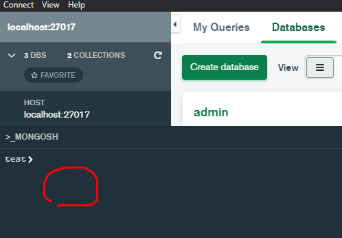

И первым делом отобразим список имеющихся у нас БД

```shell
show databases 
// или 
show dbs
```
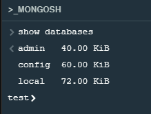

### Создание удаление использование баз данных

Оператор *use* определит какую сущность мы будем использовать. Если её нет, то эта сущность будет создана 

```shell
use mongo // создаст таблицу mongo
```

*db.createCollection("имя_коллекции")* - создаст новую коллекцию внутри активной БД 

```shell
db.createCollection("users") // создаст коллекцию users в сущности mongo
```

Увидеть изменения мы сможем только после обновления БД 

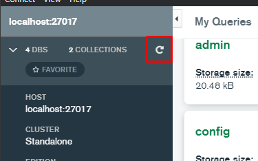

И вот мы видим созданную коллекцию

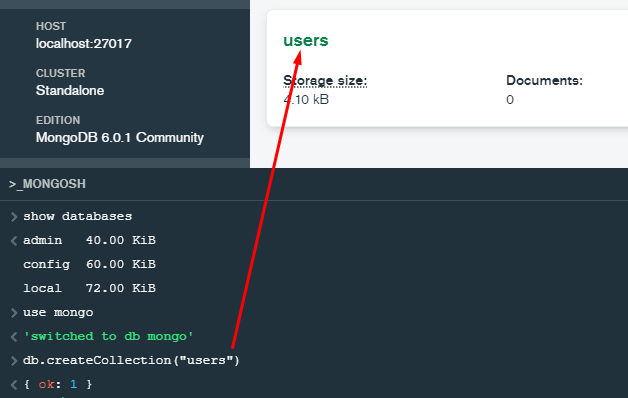

Отобразит все коллекции внутри активной БД

```shell 
show collection
```

Удалит базу данных

```shell
db.dropDatabase()
```

### insert - Добавление документа в коллекцию

*insert* - устаревший метод, который позволяет добавлять новые объекты в базу. 
В примере инсертится новый документ в коллекцию users

```Shell
db.users.insert({
    name: "Valery",
    age: 19
})
```

Однако мы можем увидеть такую ошибку, которая говорит нам, что *insert* использовать не стоит - этот метод нежелателен для использования 
>[!Warning] 'DeprecationWarning: Collection.insert() is deprecated. Use insertOne, insertMany, or bulkWrite.

Добавим ещё несколько записей в документ

```Shell
db.users.insertMany([
    { name: "Valery", age: 19},
    { name: "Rita", age: 24},
    { name: "Galina", age: 34},
    { name: "Varya", age: 32},
    { name: "Masya", age: 25}
])
```

В ответ получим, что к 5и сущностям у нас добавлены ещё и id

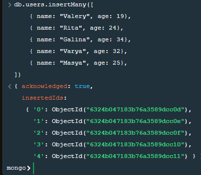

### find - Поиск документов в коллекции

Метод *find* выведет весь документ в коллекции users 

```shell
db.users.find()
```

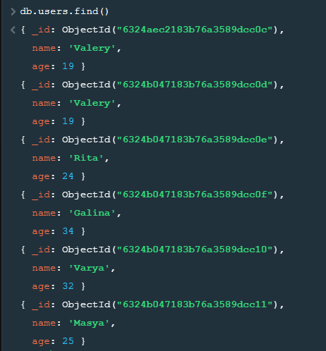

### find - Поиск по критериям

Так же в метод find мы можем вписать критерии поиска, а именно вложить объект с нужными нам свойствами и получить объекты с такими же свойствами:

```shell
db.users.find({age: 25, name: 'Masya'})
```

```JSON
{ 
	_id: ObjectId("6324b047183b76a3589dcc11"),  
	name: 'Masya',  
	age: 25 
}
```

Свойств может быть сколько угодно

``` shell
db.users.find({age: 19})
```
``` JSON
{ 
	_id: ObjectId("6324aec2183b76a3589dcc0c"),  
	name: 'Valery',  age: 19 
}
{ 
	_id: ObjectId("6324b047183b76a3589dcc0d"),  
	name: 'Valery',  age: 19 
}
```

### find - $or Условие ИЛИ

В качестве объекта так же внутрь можно передавать операторы для работы с условиями. Мы можем через **{$or: [{первое условие}, {второе условие}]}** передавать массив условий поиска определённых значений  

```shell
db.users.find({$or:[{age: 25}, {age: 32}, {name: 'Rita'}]})
```
``` JSON
{ 
	_id: ObjectId("6324b047183b76a3589dcc0e"),  
	name: 'Rita',  age: 24 
}
{ 
	_id: ObjectId("6324b047183b76a3589dcc10"),  
	name: 'Varya',  age: 32 
}
{ 
	_id: ObjectId("6324b047183b76a3589dcc11"),  
	name: 'Masya',  age: 25 
}
```

### find - $lt, $gt, $lte, $gte, $ne, меньше, больше, либо равно, не равно

**$lt** - less then - ищет значения меньше заданного
**$lte** - less then or equal - ищет значения меньше или = заданному
**$gt** - greater then - ищет значения больше заданного
**$gte** - greater or equal - ищет значения больше или = заданному
**$ne** - not equal - ищет значения не равные заданным  

Пример использования операции, которая выведет все объекты с возрастом меньше 30:
```shell
db.users.find({age: {$lt: 30}})
```
```JSON
{ _id: ObjectId("6324aec2183b76a3589dcc0c"),  name: 'Valery',  age: 19 }
{ _id: ObjectId("6324b047183b76a3589dcc0d"),  name: 'Valery',  age: 19 }
{ _id: ObjectId("6324b047183b76a3589dcc0e"),  name: 'Rita',  age: 24 }
{ _id: ObjectId("6324b047183b76a3589dcc11"),  name: 'Masya',  age: 25 }
```

### find.sort- Сортировка

Метод *sort()*, который вызывается после *find*, сортирует значения по определённому свойству. Задание сортировки зависит от числа 1 (возрастание) или -1 (убывание)

Конкретно в этом примере выведутся все записи в порядке возрастания
```shell
db.users.find().sort({age: 1})
```

А тут в порядке убывания  
```shell
db.users.find().sort({age: -1})
```

### find.limit - Ограничение по количеству получаемых документов

Функция `limit()` позволяет нам ограничить число получаемых записей

```shell
db.users.find().limit(2)
```
```JSON
{ _id: ObjectId("6324aec2183b76a3589dcc0c"),  name: 'Valery',  age: 19 }
{ _id: ObjectId("6324b047183b76a3589dcc0d"),  name: 'Valery',  age: 19 }
```

Так же имеется функция **findOne({свойство_объекта})**, которая позволяет вывести один объект, который удовлетворяет заданным условиям

```shell
db.users.findOne({_id: ObjectId("6324b047183b76a3589dcc0e")})
```
```JSON
{ 
	_id: ObjectId("6324b047183b76a3589dcc0e"),  
	name: 'Rita',  age: 24 
}
```

Уже функция **distinct()** вернёт только уникальные записи.
В базе находится два поля с 'Valery'. Дистинкт выведет все имена без повторений

```shell
db.users.distinct('name')
```
```JSON
[ 'Galina', 'Masya', 'Rita', 'Valery', 'Varya' ]
```

Так же хочется сказать, что мы можем не просто найти одну запись, но так же и удалить/переместить/обновить её

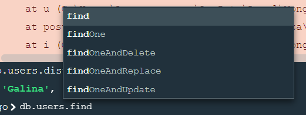

### update - $set обновление документов в коллекции

Функция **update()** модифицирует первую найденную запись. Однако лучше использовать **updateOne()** или **updateMany()**

```JS
db.users.update(
    {name: "Valery"}, // Ищет запись с таким свойством
    {
        $set: { // Замена
            name: "Ilon", // Имени
            age: 15 // Возраста
        }
    }
)
```

Было две записи с 'Valery' - одна заменилась на введённые выше значения

```JSON
{ 
	_id: ObjectId("6324aec2183b76a3589dcc0c"),  
	name: 'Ilon',  age: 15 
}
{ 
	_id: ObjectId("6324b047183b76a3589dcc0d"),  
	name: 'Valery',  age: 19 
}
```

### update - $rename переименовать поле документа

Модификтор *$rename* переименует ключи 

Конкретно в примере ключ name будет переименован в fullname 
```JS
db.users.updateMany(
    {},
    {
        $rename: {
            name: "fullname"
        }
    }
)
```
```JSON
{ 
	_id: ObjectId("6324aec2183b76a3589dcc0c"),  
	age: 15,  
	fullname: 'Ilon' 
}
```

### delete - Удалить документ из коллекции

Функции deleteOne() и deleteMany() позволяют удалить поле по заданному свойству

Конкретно в этом примере удалится поле 'Ilon' 
```shell
db.users.deleteOne({age: 15})
```

### BulkWrite - Множественный запрос

Метод `bulkWrite([{}])` позволяет делать множественные запросы. Он принимает в себя массив объектов, внутри которых мы пишем сами запросы (добавить, удалить, обновить и так далее)

Конкретно в этом примере мы добавляем нового пользователя и удаляем другого
```JSON
db.users.bulkWrite([
    {
        insertOne: {
            document: {name: 'Nastya', age: 18}
        }
    },
    {
        deleteOne: {
            filter: {fullname: 'Rita'}
        }
    }
])
```

Как можно увидеть в логе (который появляется при каждом обновлении), мы добавили и удалили одного пользователя

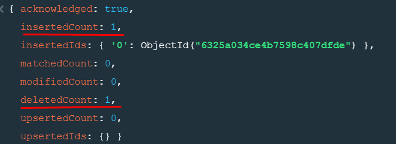

### Типы связей

**1 ко многим**

Массив posts хранит в себе два объекта, которые относятся к одному пользователю

```Shell
db.users.update(
    {fullname: 'Masya'},
    {
        $set: {
            posts: [
                {title: 'JS', text: 'JS top'},
                {title: 'mongo', text: 'mongo db'}
            ]
        }
    }
)
```

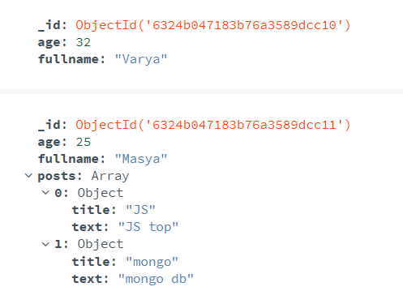

Через findOne() можно вывести только посты пользователя (если вторым параметром передать нужное нам свойство)

```shell
db.users.findOne(
    {fullname: 'Masya'},
    {posts: 1}
)
```
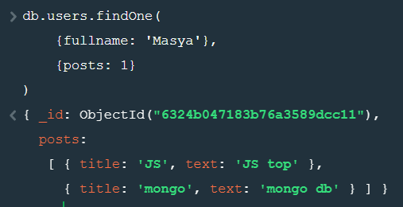

Тут мы ищем пользователя, у которого есть свойство posts, внутри которого есть свойство title. Провернуть такую операцию мы можем через $elemMatch

```JSON
db.users.find(
    {
        posts: {
            $elemMatch: {
                title: "JS"
            }
        }
    }
)
```


Так же есть модификатор $exists, который выведет нам пользователя, у которого существует свойство posts

```JSON
db.users.find({posts: {$exists: true}})
```
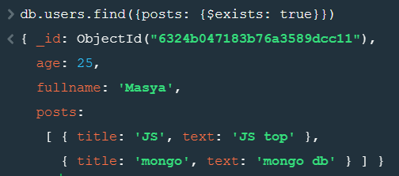

### Работа с MongoDB из Node

Установка зависимостей в проекте:

```shell
npm install -y // устанавливает все зависимости
npm install mongodb // устанавливает mongo в проекте
```

Далее нужно на удалённом сервере активировать этот сервер и взять с него ссылку (например, можно взять на том же mongodb atlas). 
Потом уже импортируем библиотеку монго в проект. Создаём нового клиента из МонгоКлиента. 
И далее мы можем описывать логику в том же синтаксисе, которым и пользовались в MongoShell 

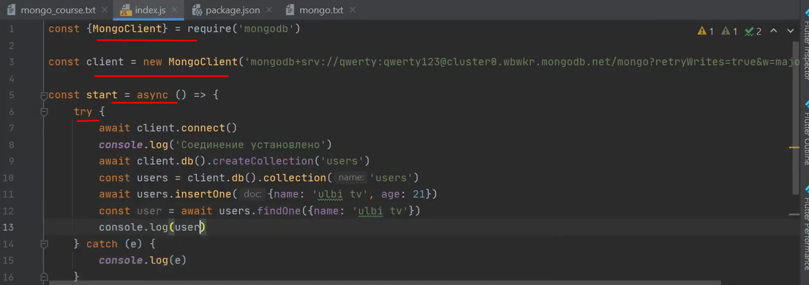