#Redis #DataBase #Cache

## Что такое Redis?

==Redis== - это база данных, которая хранит все свои данные в виде `ключ: значение`, но при этом не использует ни документный подход, как в ==MongoDB==, ни объектный подход, как в ==SQL== 

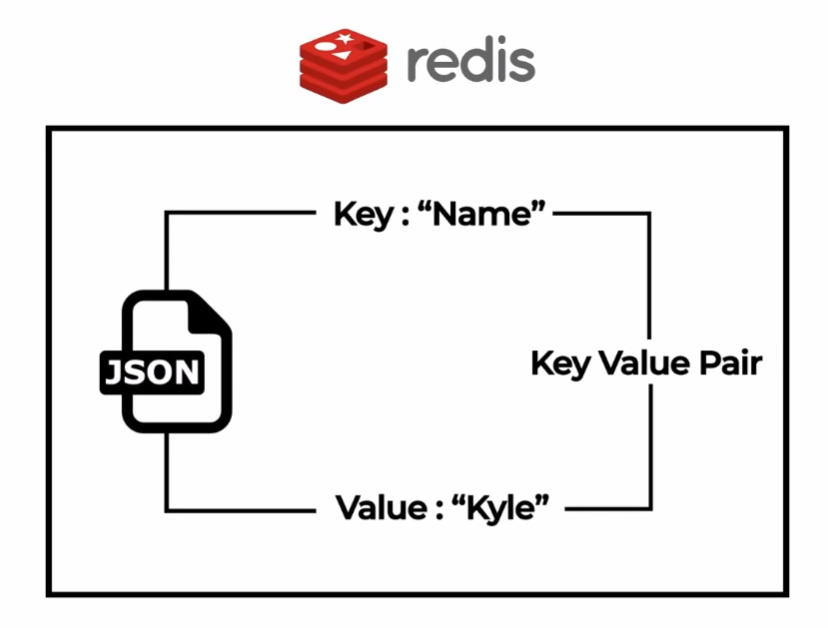

Redis, в отличие от других баз данных, не хранит свои данные на диске - он держит их в оперативной памяти. За счёт такого подхода он работает в разы более быстро, чем другие БД. Однако эти данные энергозависимы, и, если компьютер отключится, то все заполненные данные пропадут. Из-за этого Redis больше подходит для сохранения информации в виде кеша.

В Редисе мы можем хранить результаты выполнения определённых вычислений, которые долго считать заново.

Скорость получения информации из ОЗУ может занимать до нескольких миллисекунд, что в разы быстрее, чем при работе с полноценными БД, которые ищут и отдают информацию с диска.

## Установка Redis

Для установки Redis потребуется Mac или Linux. Конкретно для Windows потребуется подсистема WSL, в которой нужно выполнить данную команду:

```bash
sudo apt-get install redis
```

И потом нужно ввести пароль от своей учётной записи виртуальной Linux

Сейчас остаётся только запустить сервер редиса:

```bash
redis-server

// или таким способом: 

sudo service redis-server start
```

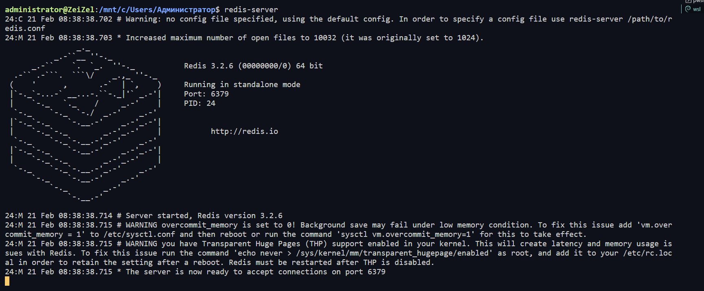

Чтобы отключить сервер, можно воспользоваться командой `shutdown`

```bash
redis-cli shutdown NOSAVE

// или...

sudo service redis-server stop
```

Далее открываем второй терминал WSL и переходим к CLI Редиса:

```bash
redis-cli
```

## Базовые команды Redis

После открытия CLI редиса можно начать ввод нужных нам данных. Самое первое, что мы можем сделать - записать `SET` значение `Valery` в ключ `name`

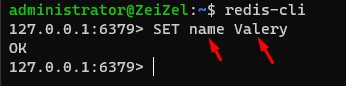

И далее через `GET` можно получить нужное значение

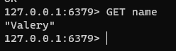

Так же мы можем удалить запись через `DEL`. Тут мы можем увидеть, что ==Redis== понимает, что конкретно в данном случае мы работали с числом (которое хранилось в базе в виде строки).

После попытки получить значение, мы видим, что на выходе будет нулевое значение

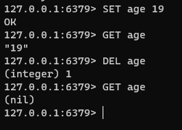

Через `Exists` можно проверить наличие ключа (0 или 1)

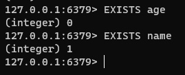

Используя `KEYS` мы можем вывести по определённому паттерну нужные нам ключи. Чтобы вывести все ключи, нужно воспользоваться паттерном `*`

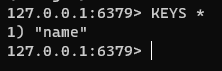

Если воспользоваться командой `flushall`, то она очистит весь кеш (все данные)

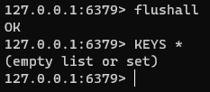

И так же мы можем очистить консоль, когда логов стало слишком много

```bash
clear
```

## Handling Expirations

Команда `TTL` позволяет нам получить время жизни определённого ключа. Если он возвращает `-1`, то время жизни объекта не ограничено

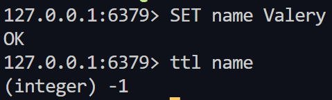

Чтобы указать время жизни ключа, можно воспользоваться командой `EXPIRE ключ время` и `ttl` нам будет показывать отсчёт времени существования ключа. Когда `ttl` покажет `-2`, то объект уже будет уничтожен

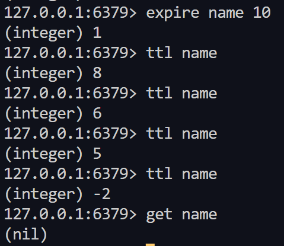

Так же командой `SETEX` мы можем сразу указать время жизни ключа

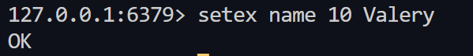

## Lists

Так же Redis имеет подобие массивов в виде списков. 

Команда `lpush имя_списка значение` добавляет запись в начало списка (список создаётся или выбирается при первом добавлении значения), а команда `rpush` добавляет запись в конец списка. 

Команда `lrange список откуда докуда` позволяет вывести нужные значения списка. Если конечным элементом выбрать `-1`, то выведется весь список.

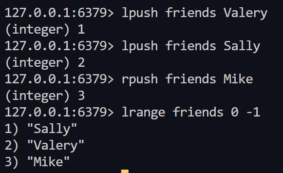

Команда `LPOP` удалит значение из начала списка, а `RPOP` из конца списка

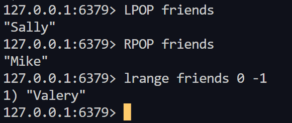

## Sets

Так же в ==Redis== есть подобие массивов, состоящих только из уникальных значений, как в ==JS==. 

Команда `SADD` позволяет добавить новое значение в список. Если повторно воспользоваться командой с тем же значением, то мы получим `0`, так как подобный список не даёт добавить повторяющиеся значения. `SMEMBERS имя_списка` позволяет вывести все значения списка.

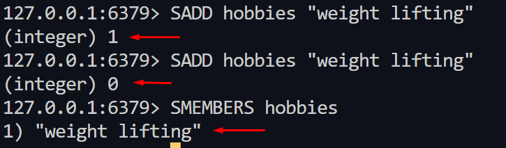

Команда `SREM` позволяет очистить список полностью 

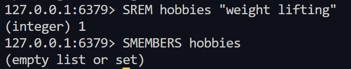

## Hashes

==Хэши Redis== - это типы записей, структурированные как коллекции пар поле-значение. Использовать хэши, среди прочего, для представления базовых объектов и хранения групп счетчиков.

- `HSET` - установка значения в хеш 
- `HGETALL` - получить все значения из хеша
- `HDEL` - удалить определённое значение из хеша
- `HEXISTS` - проверить существование ключа в хеше

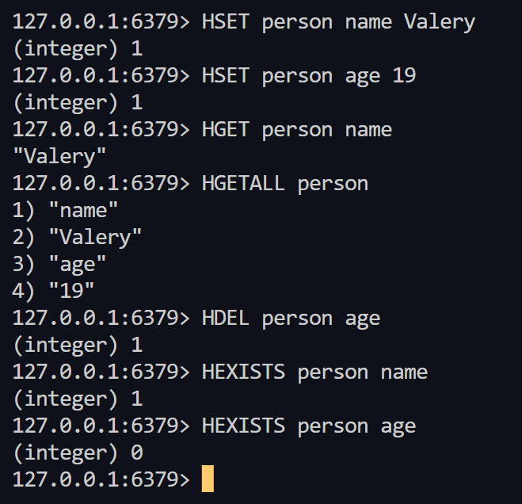