### 001 Что такое функция

Функция – это блок кода, который можно выполнять многократно. Она призвана истреблять повторяющийся код

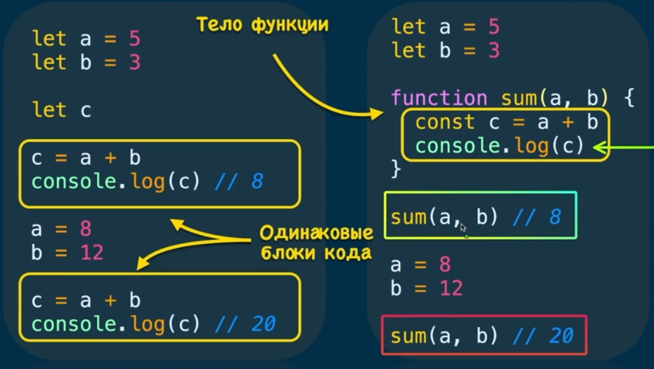

Функция так же может быть пяти видов

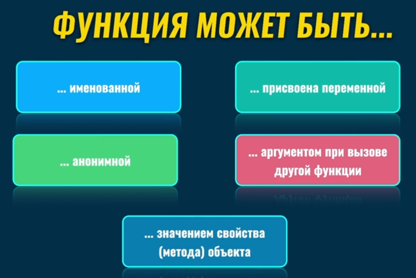

Так же функция является объектом

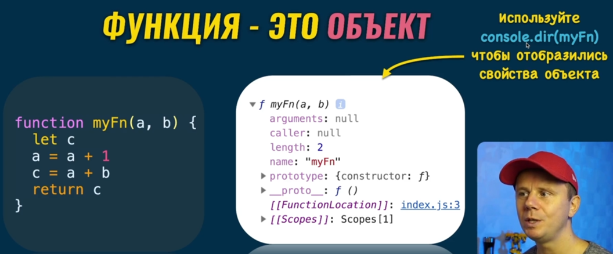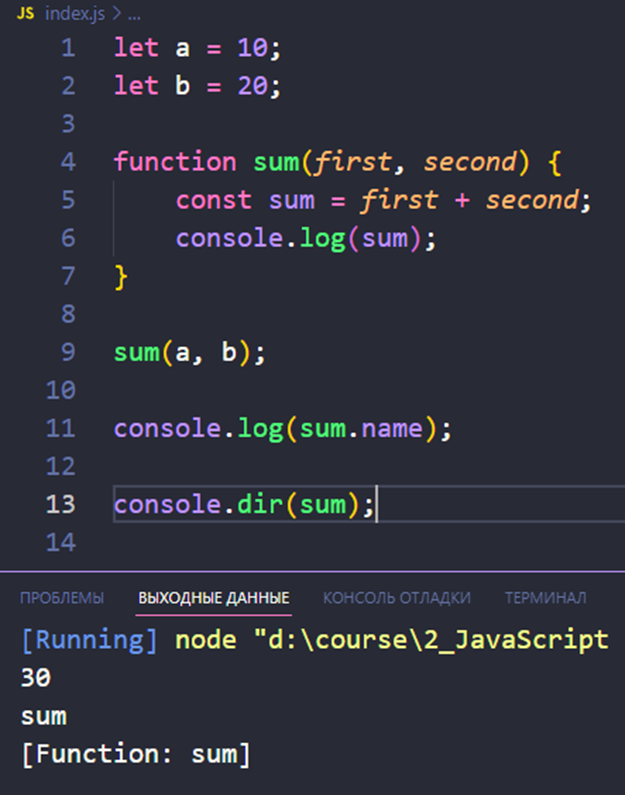

### 002 Объявление и вызов функции

Функция имеет имя, параметры (к которым доступ есть только внутри функции, а вне - нет), тело функции (вся та часть, что находится между скобками) и результат (`return значение`). Оператор `return` завершает выполнение функции и дальнейшая логика функции, которая описана после этого оператора, выполняться не будет

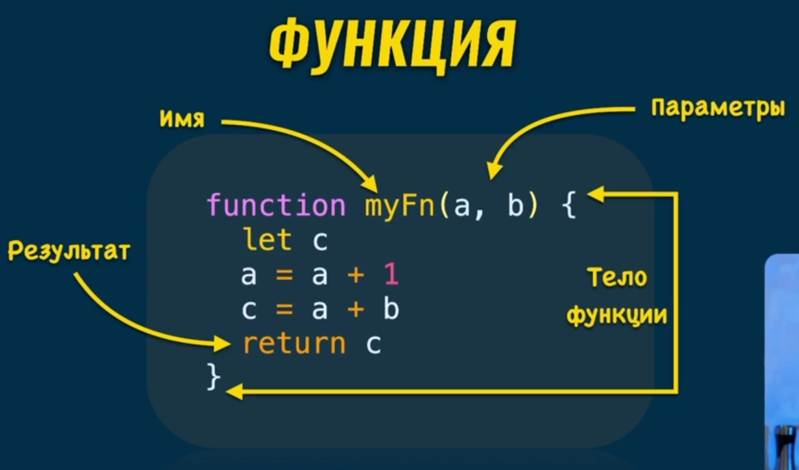

Непосредственно выходные данные покажет браузер. Если `return` отсутствует, то браузер нам отобразит `undefined`

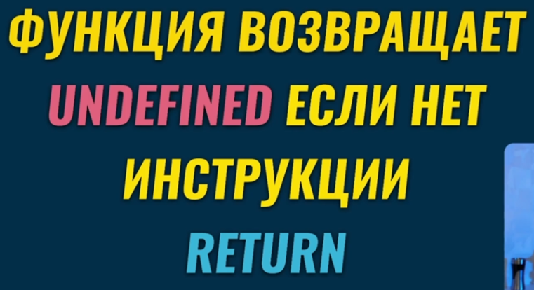
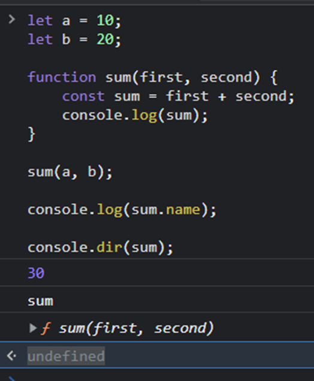
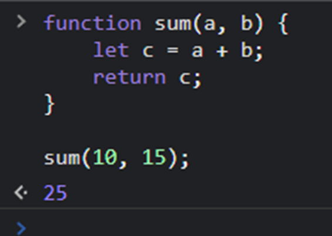

Вызов функции и операции по порядку

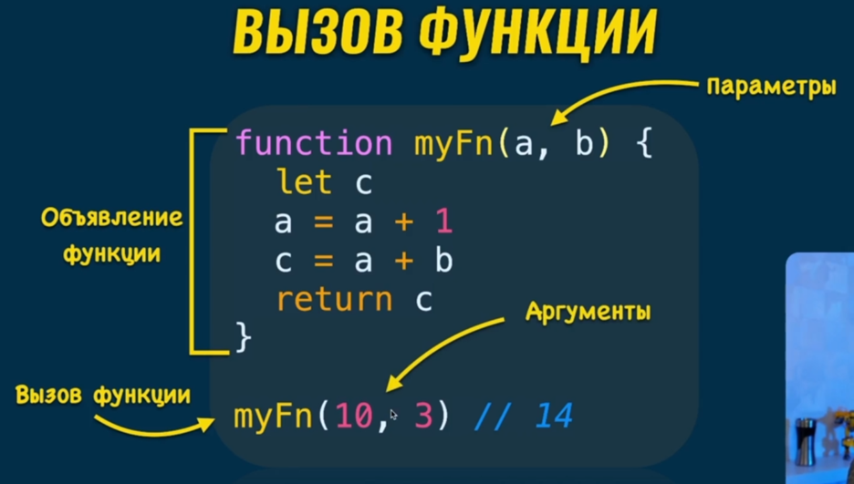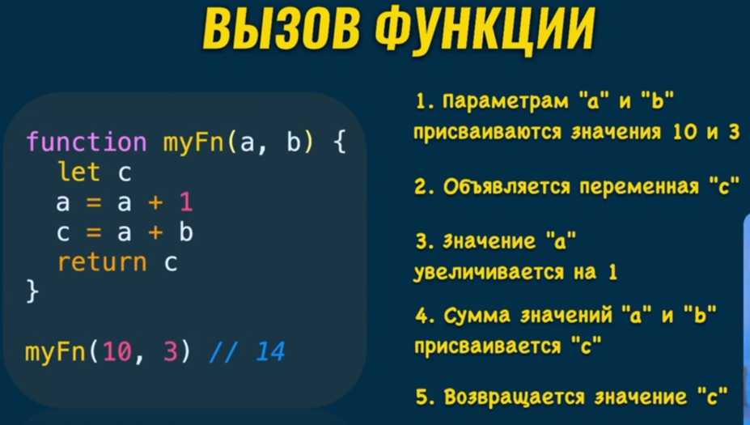

Так же функция может не иметь множество значений в ней присутствующих 

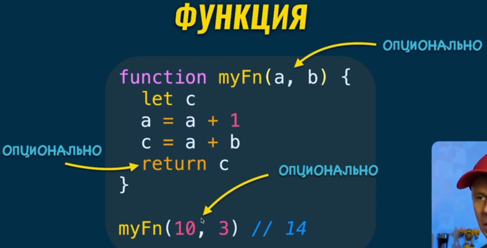

Самая короткая функция

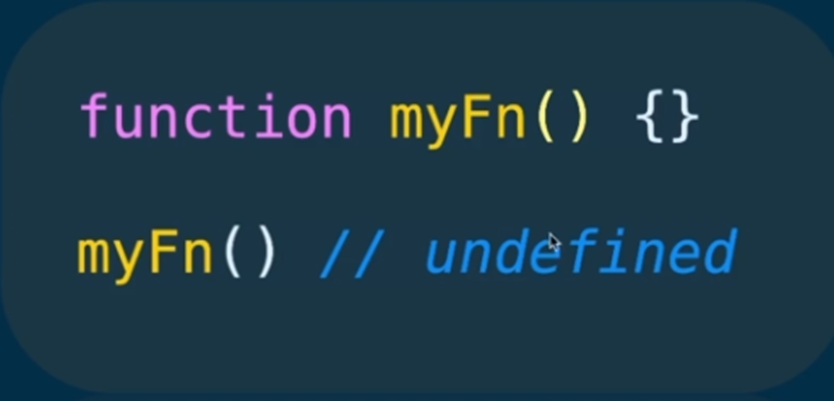

### 003 Передача значения по ссылке

Тут в примере мы видим, как наша функция, ссылаясь на одну и ту же область памяти, меняет внешний объект (при передаче объекта в функцию, в ней генерируется та же ссылка, что и в переменной)

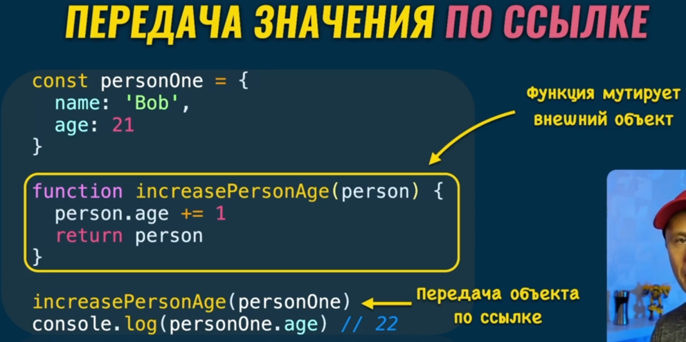

Так же желательно, чтобы функции не меняли внешние переменные и работали только с внутренними

Чтобы изменять объекты, рекоммендуется все изменения вносить в новый объект и внутри функции генерировать временный объект, над которым будут совершаться манипуляции

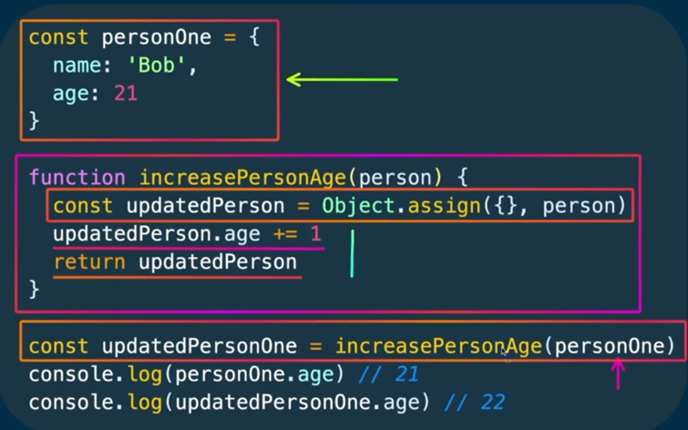

### 004 Колбэк функции

Колбэк функцией называется та функция, которую как аргумент передают в другую функцию

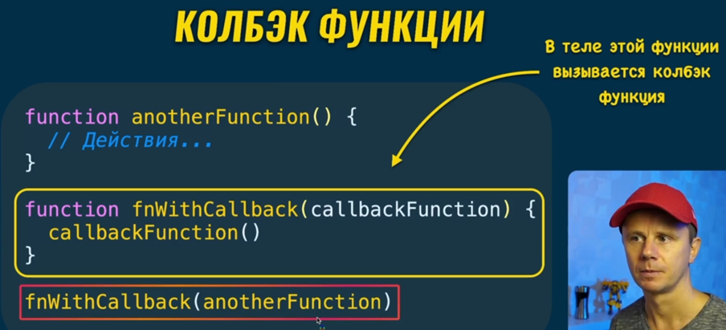

Самый частый пример использования колбэк-функции – это задержка вызова этой функции через `setTimeout(функция, время)`

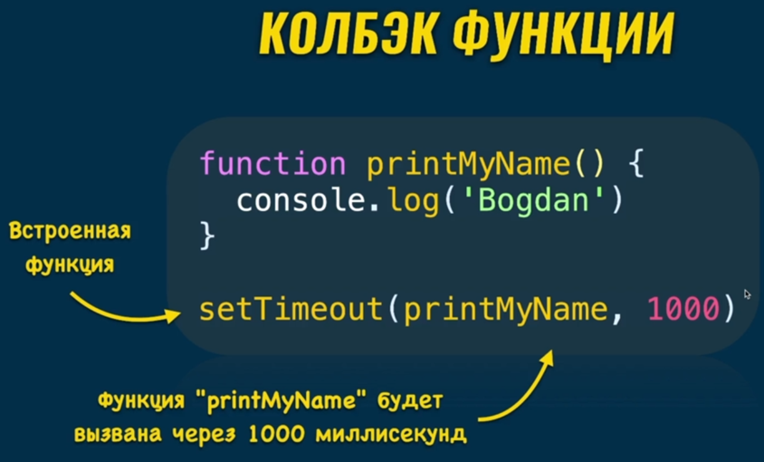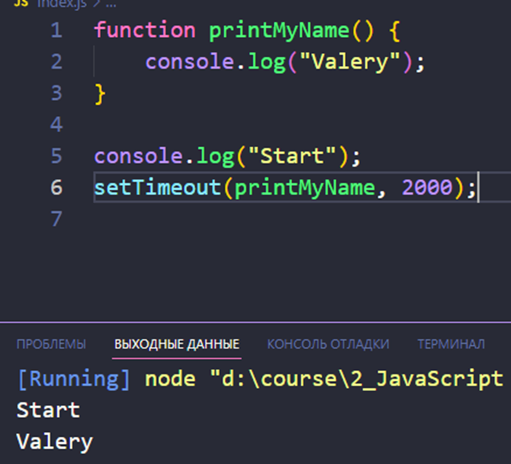

### 005 Правила работы с функциями

>[!info] Так же существуют общие правила по работе с функциями:
> - Называть функцию, как и переменные, нужно всегда исходя из выполняемых ею действий;
> - Одна функция должна выполнять только одну задачу (если нужно считать делимые числа на 2 и на 3, то лучше сделать для этого разные функции);
> - Функция не должна менять внешние переменные (она должна работать только с внутренними)
>
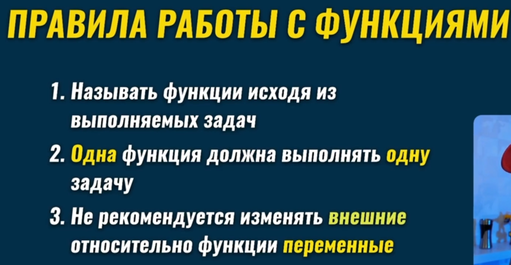