### 001 Операторы

Оператор – это встроенная функция. Есть огромное количество операторов

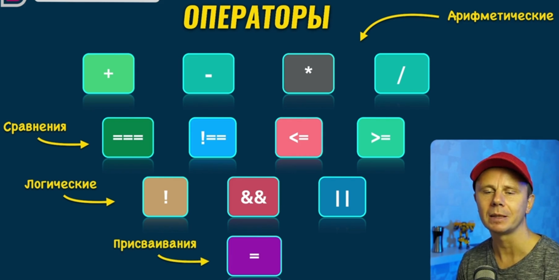

Так же есть операторы, которые выражаются текстом

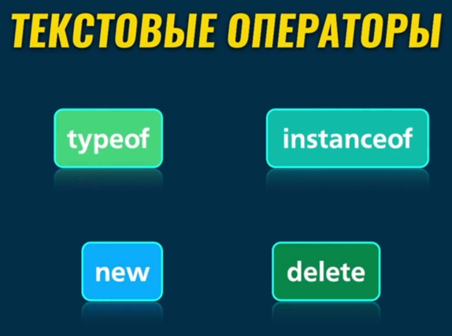

И эти операторы мы достаточно часто используем в нашей повседневной жизни

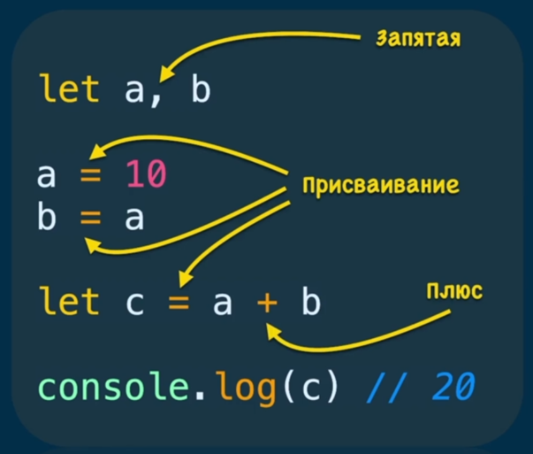

### 002 Оператор присваивания

И примерно так устроена функция «=» под капотом

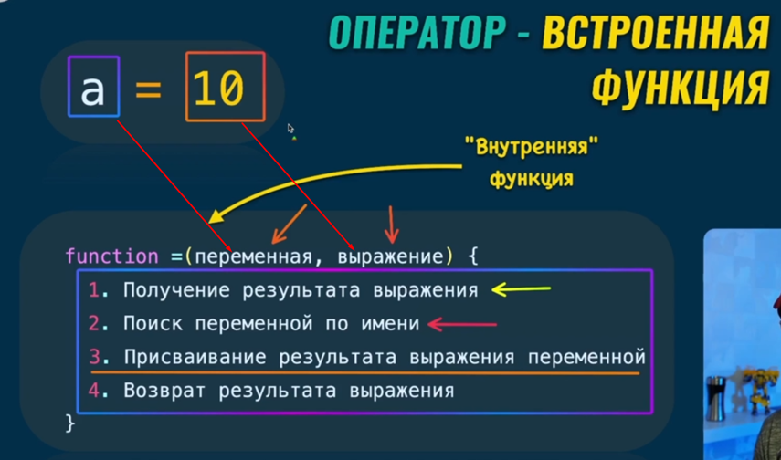

У оператора **=** есть два операнда, над которыми она оперирует

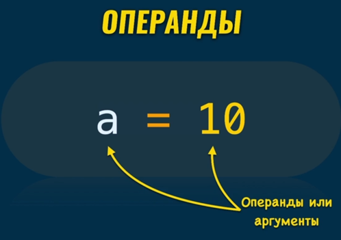

### 003 Унарные и бинарные операторы

Унарные операторы – это операторы, которые выполняют действие над одним операндом. 
1) Увеличивает переменную на 1; 
2) Переводит строку в число; 
3) Удаляет свойство из объекта; 
4) Выводит тип переменной; 
5) Создаёт новый объект

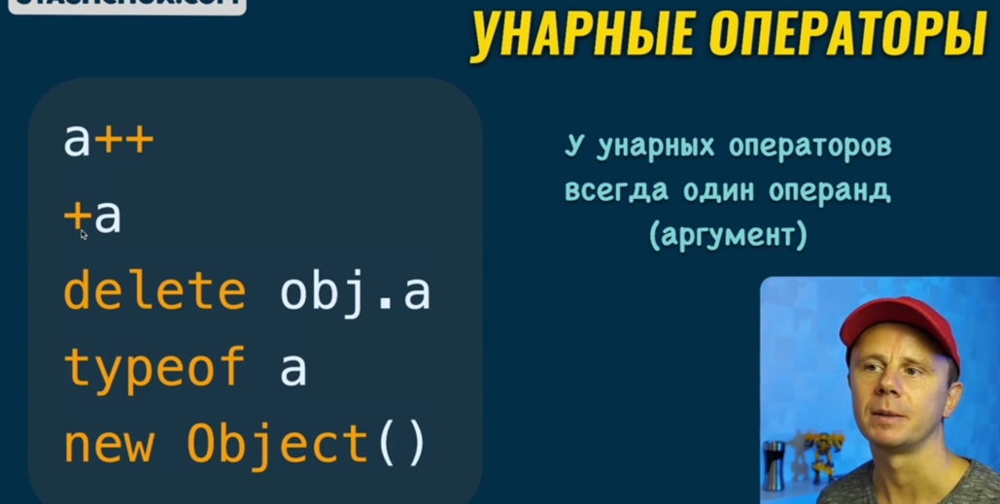

Бинарные операторы производят действия над двумя аргументами

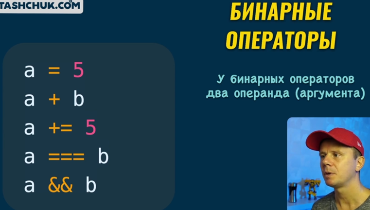

### 004 Форматы записи операторов

Есть три формы записи операторов:

P.S.: **()** – оператор вызова функции

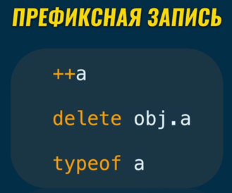
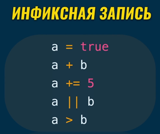 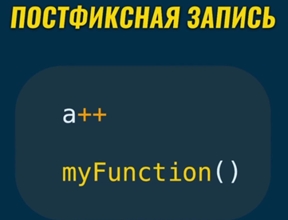

### 005 Приоритетность операторов

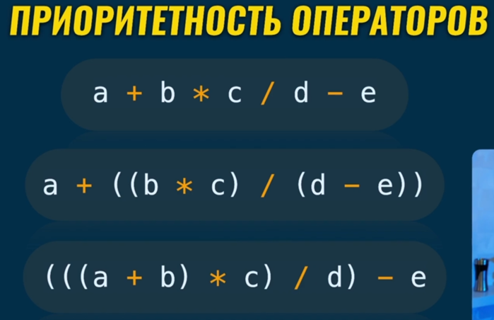

### 006 Логические операторы

У **!** только префиксная запись, у **&&** и **||** инфиксная

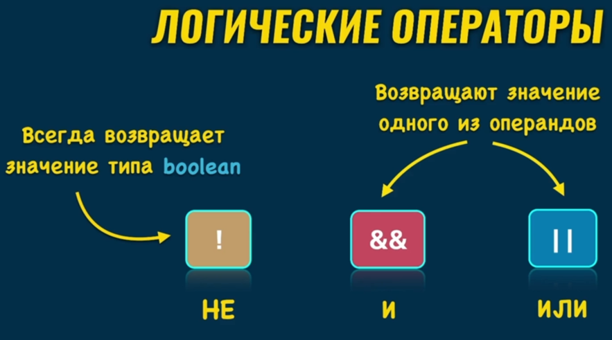

### 007 Ложные значения

При присваивании данных значении в качестве `boolean`, у нас будет выходить `false` (справа примеры). То есть, если та же функция возвращает `undefined` (забыли оператор `return`), то наш перевод значения в **Boolean** будет всегда иметь значение `false`

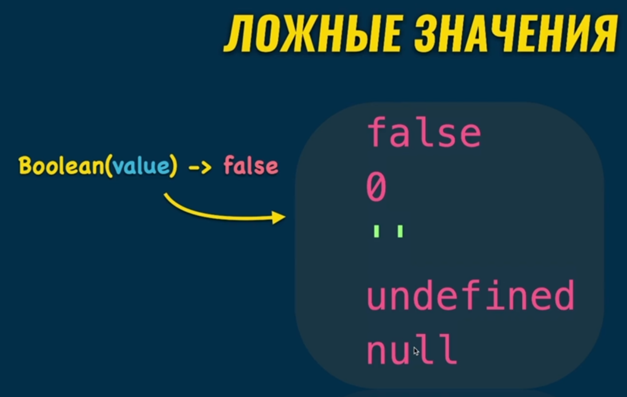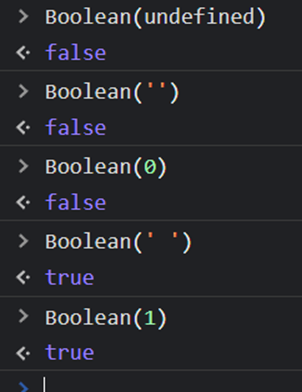

### 008 Практика с typeof оператором

Typeof возвращает нам тип введённого значения на проверку

Тут хочется показать прикольную особенность JS. Тип числа 10 – ==number==. Если мы сравним тип числа 10 со строкой числа, то получим `true`, потому что `typeof` вернёт нам сначала строку `‘number’`, а потом произойдёт сравнение строк и эти строки совпадут. Так же и с остальными типами

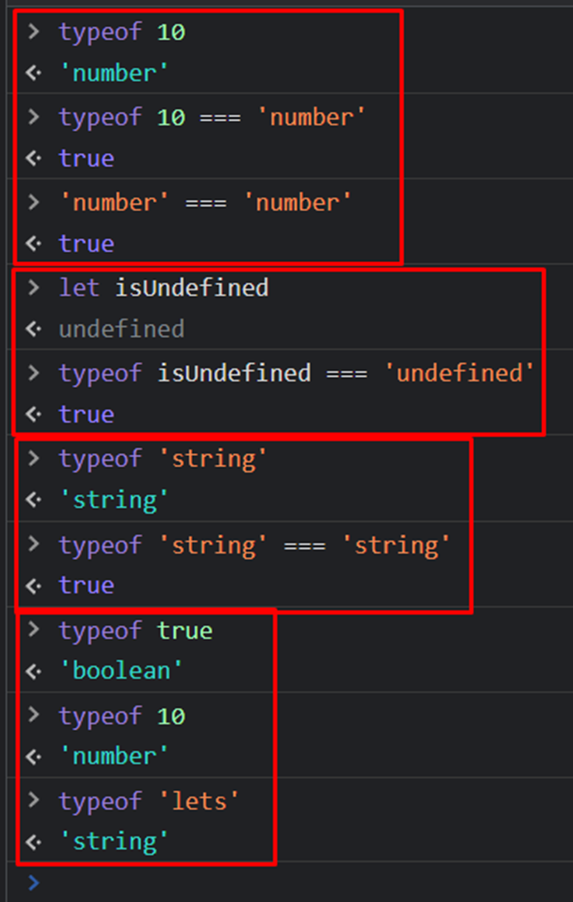