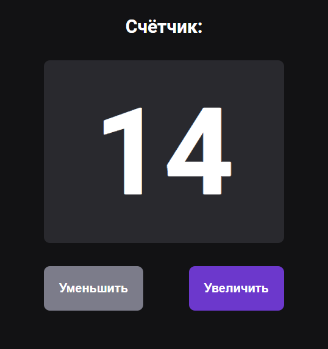
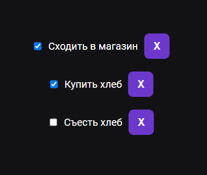
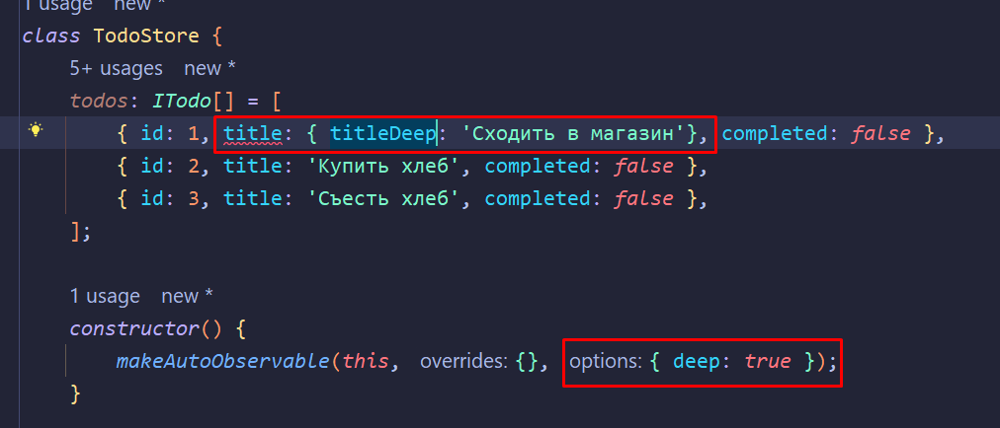
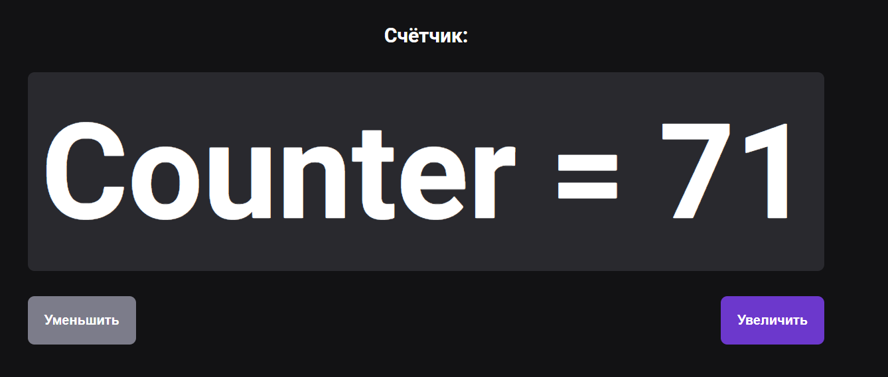
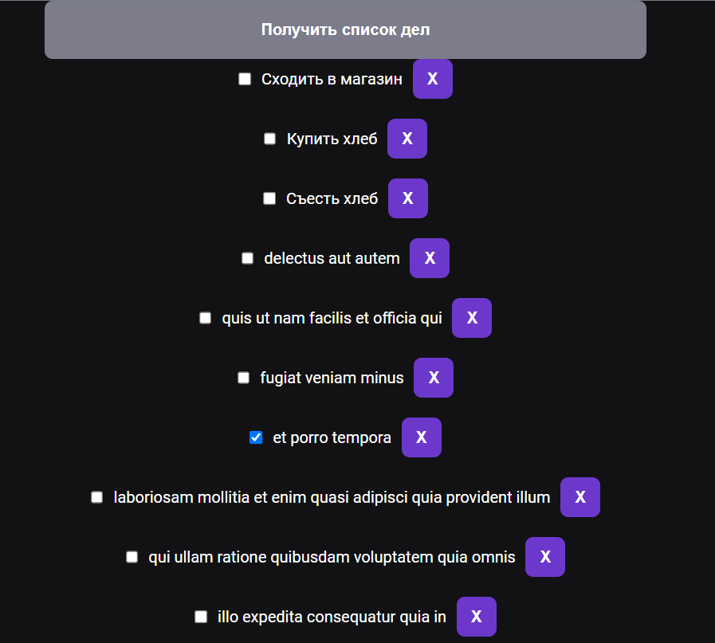

#MobX

Функция `makeObservable` делает класс отслеживаемым. Функция `makeAutoObservable` делает класс отслеживаемым по переданному контексту и самостоятельно производит нужные для неё настройки.

Любая созданная функция для ==MobX== - это экшен, который меняет состояние. В отличие от ==Redux==, состояние в данном менеджере можно мутировать. То есть, если мы изменим какое-либо значение, то MobX это заметит и запустит рендеринг компонента.

Сейчас нам нужно создать класс, который будет выполнять определённый функционал на странице (в виде методов). В конце нужно просто экспортировать один инстанс объекта класса.

`State / store / counter.ts`
```TS
import { makeAutoObservable } from 'mobx';  
  
class Counter {  
   // переменная, которая является состоянием  
   count = 0;  
  
   constructor() {  
      // настраивает работу с mobx  
      makeAutoObservable(this);  
   }  
  
   increment() {  
      this.count = this.count + 1;  
   }  
  
   decrement() {  
      this.count = this.count - 1;  
   }  
}  
  
export default new Counter();
```

Далее нам нужно импортировать наш классовый каунтер в компонент и вставить его функции.  
Теперь, чтобы использовать каунтер с функциями, описанными в ==MobX==, нужно обернуть весь компонент в функцию `observer`, которая отслеживает изменения состояний в компоненте и перерендеривает его.

`State / State.tsx`
```TSX
import React from 'react';  
import { useState } from 'react';  
import styles from './State.module.scss';  
import { Button } from '@/components';  
import counter from './store/counter';  
import { observer } from 'mobx-react-lite';  
  
export const State = observer((): JSX.Element => {  
   return (  
      <div className={styles.wrapper}>  
         <h2 className={styles.title}>Счётчик:</h2>  
         <h1 className={styles.num}>{counter.count}</h1>  
         <Button  
            buttonType={'gray'}  
            className={styles.reduce}  
            onClick={() => counter.decrement()}  
         >  
            Уменьшить  
         </Button>  
         <Button  
            buttonType={'purple'}  
            className={styles.increase}  
            onClick={() => counter.increment()}  
         >  
            Увеличить  
         </Button>  
      </div>  
   );  
});
```

И теперь наш счётчик работает и быстро отзывается на все действия



Далее приведём ещё один пример, где мы сразу добавим данные и реализуем список дел

`Todo / store / todo.store.ts`
```TS
import { makeAutoObservable } from 'mobx';  
  
interface ITodo {  
   id: number;  
   title: string;  
   completed: boolean;  
}  
  
class TodoStore {  
   todos: ITodo[] = [  
      { id: 1, title: 'Сходить в магазин', completed: false },  
      { id: 2, title: 'Купить хлеб', completed: false },  
      { id: 3, title: 'Съесть хлеб', completed: false },  
   ];  
  
   constructor() {  
      makeAutoObservable(this);  
   }  
  
   addTodo(todo: ITodo) {  
      this.todos.push(todo);  
   }  
  
   removeTodo(id: number) {  
      this.todos = this.todos.filter(todo => todo.id !== id);  
   }  
  
   completeTodo(id: number) {  
      this.todos = this.todos.map(todo =>  
         todo.id === id ? { ...todo, completed: !todo.completed } : todo,  
      );  
   }  
}  
  
export default new TodoStore();
```

Сейчас список дел реализуется почти так же, как и прошлый пример с каунтером. 
В ==MobX== очень важно, чтобы ключи элементов были уникальными, и чтобы они не являлись индексами массива

`TodoList / TodoList.tsx`
```TSX
import React from 'react';  
import { observer } from 'mobx-react-lite';  
import todo from './store/todo.store';  
import styles from './TodoList.module.scss';  
import { Button, Input } from '@/components';  
  
export const TodoList = observer(() => {  
   return (  
      <div className={styles.wrapper}>  
         {todo.todos.map(t => (  
            <div key={t.id} className={styles.todo}>  
               <Input  
                  type={'checkbox'}  
                  checked={t.completed}  
                  onChange={() => todo.completeTodo(t.id)}  
               />  
               <div>{t.title}</div>  
               <Button  
                  className={styles.button}  
                  buttonType={'purple'}  
                  onClick={() => todo.removeTodo(t.id)}  
               >  
                  X  
               </Button>  
            </div>  
         ))}  
      </div>  
   );  
});
```

И теперь наш список дел удаляет себя и может быть выполненным



Так же нужно сказать, что если нам нужно работать с более глубокими уровнями вложенности, что в моб нужно передать опцию `deep`



Так же мы можем уточнить внутри оверрайда (второй объект моба):
- что есть отслеживаемый объект `todos: observable`, 
- что есть экшены `addTodo: action`
- И что является вычисляемым значением `computed: значение`

```TS
constructor() {  
   makeAutoObservable(this, { todos: observable, addTodo: action, computed:  });  
}
```

Вычисляемые значения - это значения, которые мы считаем в методе, помеченном ключевым словом `get`. Этот метод обязательно должен вычислять результат каких-то вычислений. Основное преимущество в том, что метод вызывается только тогда, когда один из его параметров изменил своё значение. Такой подход оптимизирует выполнение значений.

```TS
get total() {  
   return `Counter = ${this.timer + this.count}`;  
}
```

Теперь тут применяем функцию

```TSX
<h1 className={styles.num}>{counter.total}</h1>
```



Асинхронные экшены. Они используются ровно так же, как и остальные экшены.
Тут представлен пример получения списка дел с сервера `jsonplaceholder`

`todo.store.ts`
```TS
fetchTodos() {  
   fetch('https://jsonplaceholder.typicode.com/todos/')  
      .then(response => response.json())  
      .then(json => {  
         this.todos = [...this.todos, ...json];  
      });  
}
```

Тут при нажатии кнопки мы получаем данный массив

`TodoList.tsx`
```TSX
<Button buttonType={'gray'} onClick={() => todo.fetchTodos()}>  
   Получить список дел  
</Button>
```

И видим огромный список дел

