#useContext

## 001 useContext

Контекст - это определённый посредник или контейнер, который позволяет передавать данные между компонентами в любом порядке, вызывая определённую функцию 

Когда стоит использовать контекст?
- Когда цепочка передачи становится слишком длинной
- Когда одни конкретные данные нужно передавать во все компоненты


Создаётся контекст подобным образом:


Далее идёт **провайдер**. 
==Провайдер== - это обёртка, которая позволяет оборачивать корень нашего компонента в нужный нам контекст.
Ниже приведён провайдер в качестве компонента. Такой провайдер позволяет нам использовать все стейты и эффекты для обработки события. Данный провайдер принимает в себя определённое значение + у него должны быть дочерние элементы (если будут вложены)

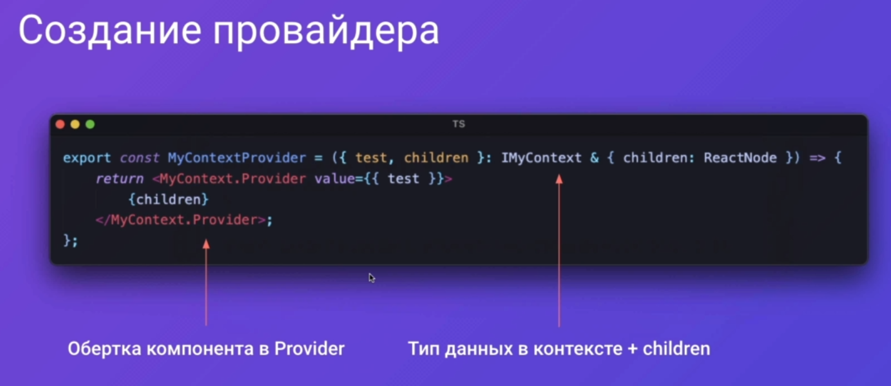

Чтобы получить контекст внутри другого компонента, то мы можем воспользоваться хуком
Функция `useContext` будет выполняться в `next`, но ровно до того момента, как она будет отдана на фронт. То есть переданные значения в `useContext` будут отображаться в пререндере


Дополнительно:
1) `MyContext.Consumer` позволяет динамически получать контекст и что-то отредерить. Используется редко, так как чаще используется хук `useContext`
2) Так же мы можем задать имя контексту, чтобы его можно было увидеть в ==devTools==


## 002 Пишем свой контекст

Далее нужно написать контекст, который позволит нам выводить данные по списку, полученные на главной странице, в компоненте меню, который выводится в сайдбаре.

После написания данного провайдера все те, кто будет подписан на контекст,  смогут получать новое меню, когда им это будет необходимо

`context / app.context.tsx`
```TSX
import { Children, createContext, ReactNode, use, useState } from 'react';
import { MenuItem } from '../interfaces/menu.interface';
import { TopLevelCategory } from '../interfaces/page.interface';

export interface IAppContext {
	menu: MenuItem[];
	firstCategory: TopLevelCategory;
	setMenu?: (newMenu: MenuItem[]) => void;
}

// Это сам контекст, который уже имеет дефолтное значение
export const AppContext = createContext<IAppContext>({
	menu: [],
	firstCategory: TopLevelCategory.Courses,
});

// тут описан провайдер, который управляет этим контекстом
// на вход он принимает контекст (IAppContext) и внутренние значения другого компонента (children)
export const AppContextProvider = ({
	menu,
	firstCategory,
	children,
}: IAppContext & { children: ReactNode }): JSX.Element => {
	// Чтобы поддерживать состояние меню, ему нужно состояние
	const [menuState, setMenuState] = useState<MenuItem[]>(menu);

	// функция для установки нового меню
	const setMenu = (newMenu: MenuItem[]) => {
		setMenuState(menu);
	};

	// Далее возвращаем провайдера с чилдрен значением и данными из интерфейса (меню категории и функция для установки меню)
	return (
		<AppContext.Provider value={{ menu: menuState, firstCategory, setMenu }}>
			{children}
		</AppContext.Provider>
	);
};
```

>[!info] Пометка
> Запись типа: `({menu, firstCategory, children}: IAppContext & {children: ReactNode})` говорит нам о том, что представленные параметры должны соответствовать типу `IAppContext`, и, одновременно, типу `{children: ReactNode}`
> Можно сократить эту запись до такой: `PropsWithChildren<IAppContext>`. Она скажет, что передаваемый в неё тип (`IAppContext`) должен так же в себя включать и `children`

И так будет выглядеть типизация получаемых пропсов, если мы используем более *элегантный* синтаксис

```TSX
export const AppContextProvider = ({ menu, firstCategory, children }: PropsWithChildren<IAppContext>): JSX.Element => {
	/// CODE ...
};
```

Далее нужно обернуть лейаут нашего приложения в провайдер контекста. Тип `T`, который был сделан через дженерик, нужно расширить и добавить к нему `IAppContext` через `&`, чтобы `props` имел значения `menu`, `firstCategory` и `setMenu` 

`Layout.tsx`
```TSX
export const withLayout = <T extends Record<string, unknown> & IAppContext>(
	Component: FunctionComponent<T>,
) => {
	return function withLayoutComponent(props: T): JSX.Element {
		return (
			<AppContextProvider menu={props.menu} firstCategory={props.firstCategory}>
				<Layout>
					<Component {...props} />
				</Layout>
			</AppContextProvider>
		);
	};
};
```

Так выглядит созданный компонент меню:

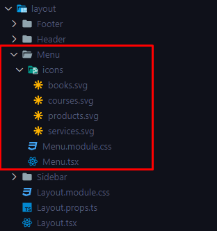

Этот компонент будет выводить список доступных категорий для выбора курса (через мапу будем выводить `<li>`)

`layout / Menu / Menu.tsx`
```TSX
import React, { useContext } from 'react';
import { AppContext } from '../../context/app.context';
import styles from 'Menu.module.css';
import cn from 'classnames';

export const Menu = (): JSX.Element => {
	// Получаем данные из глобального контекста
	const { menu, setMenu, firstCategory } = useContext(AppContext);

	return (
		<div>
			<ul>
				{menu.map((m) => (
					<li key={m._id.secondCategory}>{m._id.secondCategory}</li>
				))}
			</ul>
		</div>
	);
};
```

Далее нужно вывести меню в сайдбаре. Для этого вставим компонент менюшки в него.

`layout / Sidebar / Sidebar.tsx`
```TSX
export const Sidebar = ({ ...props }: SidebarProps): JSX.Element => {
	return (
		<div {...props}>
			<Menu />
		</div>
	);
};
```

И на выходе мы получили такой список меню на своей странице:

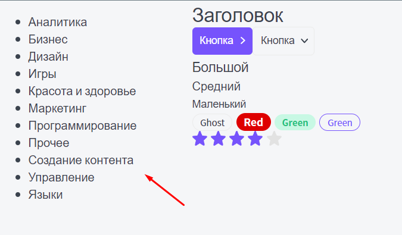


>[!faq] Как это работает?
> 1) На главной странице мы получаем через `getStaticProps` список категорий, который передаётся в компонент `Home`. Этот компонент обёрнут внутрь HOC `withLayout`
> 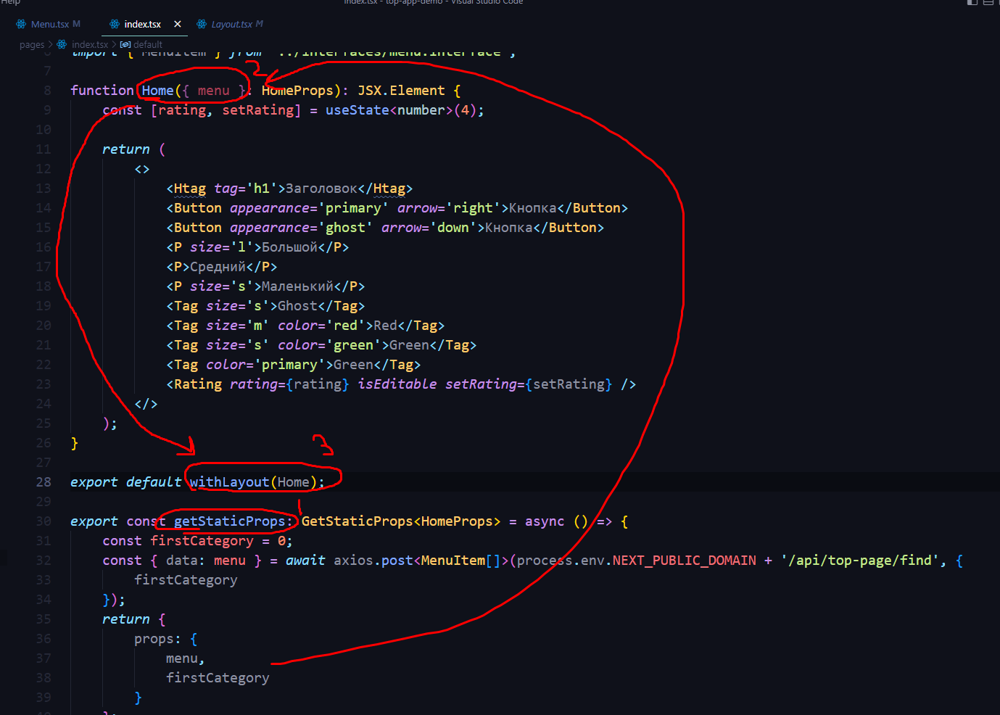
> 2) После чего эти пропсы попадают в `withLayout`, тип дженерика которого расширяется от интерфейса меню. Сам пропс, который попадёт в провайдер, уже будет иметь в себе нужные для нас значения меню (категория и массив значений меню)
> 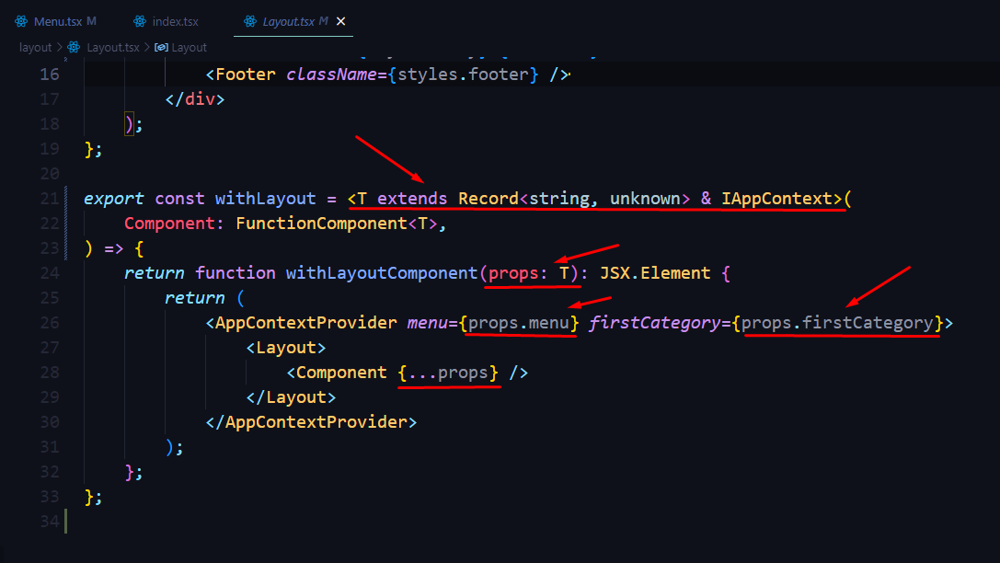
> 3) Эти данные, которые мы передали в провайдер, передаются в стейт и далее сохраняются в самом провайдере нашего контекста
> 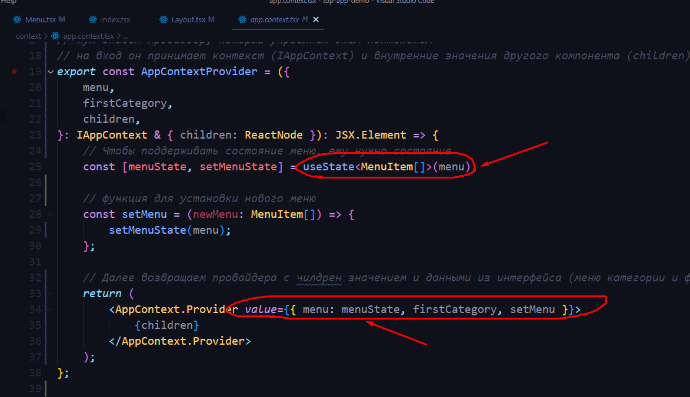
> 4) После чего, мы можем извлечь их путём использования `useContext`, где мы из контекста достаём категорию, меню и функцию установки меню
> 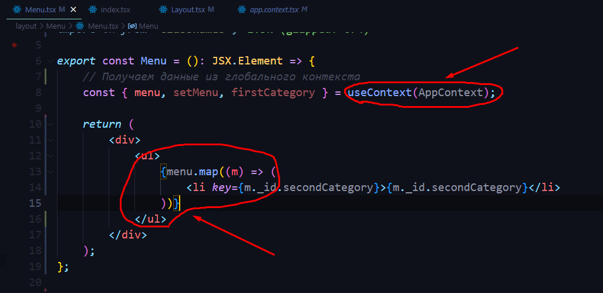

>[!info] Так же нужно внести дополнительные уточнения:
> Если мы добавим `useEffect`, то он сработает, но те данные, что мы отправили на клиент и были изменены эффектом - останутся в коде страницы. Дело в том, что данный хук срабатывает непосредственно на клиенте после гидратации. 
> 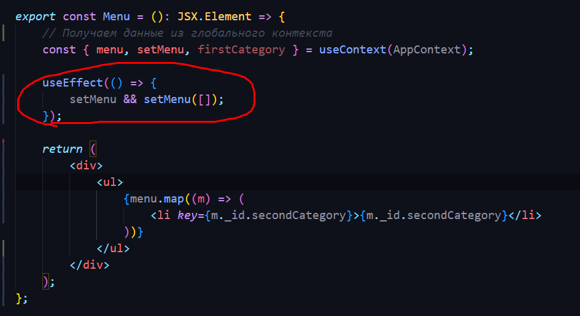
> 
> 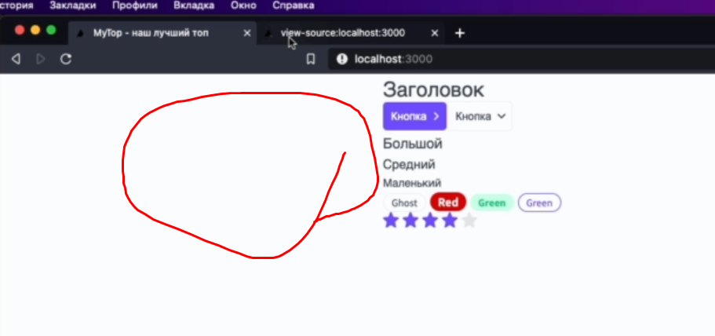

## 003 Вёрстка меню

Первым делом, нужно указать, что меню строится из трёх уровней: 
1) главный заголовок
2) заголовок подпункта
3) заголовок самого раздела


Тут будет представлен интерфейс для первого уровня записи меню.
Далее нужно будет добавить состояние в элемент меню как `isOpened`, который позволит нам проверить, открыто ли меню сейчас.

`interfaces / menu.interface.ts`
```TS
export interface FirstLevelMenuItem {
	route: string;
	name: string;
	icon: JSX.Element;
	id: TopLevelCategory;
}

export interface MenuItem {
	_id: {
		secondCategory: string;
	};
	isOpened?: boolean;
	pages: PageItem[];
}
```

В качестве источника информации для построение главных заголовков была выделена переменная `firstLevelMenu`, которая содержит данные соответственно по интерфейсу 

Чтобы не делать `return` большим было принято решение создать три функции, которые будут выводить свой уровень заголовков меню: `buildFirstLevel`, `buildSecondLevel`, `buildThirdLevel`.

Начиная с первой функции и до последней прокидывается переменная `menu`, которая позволит воспользоваться `route` определённого пункта меню

`layout / Menu / Menu.tsx`
```TSX
import styles from './Menu.module.css';
import cn from 'classnames';
import { format } from 'date-fns';
import { useContext, useEffect } from 'react';
import { AppContext } from '../../context/app.context';
import { FirstLevelMenuItem, PageItem } from '../../interfaces/menu.interface';
import CoursesIcon from './icons/courses.svg';
import ServicesIcon from './icons/services.svg';
import BooksIcon from './icons/books.svg';
import ProductsIcon from './icons/products.svg';
import { TopLevelCategory } from '../../interfaces/page.interface';
import { P } from '../../components';

// тут будут представлены статичные данные для заглавных пунктов меню
const firstLevelMenu: FirstLevelMenuItem[] = [
	{ route: 'courses', name: 'Курсы', icon: <CoursesIcon />, id: TopLevelCategory.Courses },
	{ route: 'services', name: 'Сервисы', icon: <ServicesIcon />, id: TopLevelCategory.Services },
	{ route: 'books', name: 'Книги', icon: <BooksIcon />, id: TopLevelCategory.Books },
	{ route: 'products', name: 'Продукты', icon: <ProductsIcon />, id: TopLevelCategory.Products },
];

export const Menu = (): JSX.Element => {
    // Получаем данные из глобального контекста
	const { menu, setMenu, firstCategory } = useContext(AppContext);

	// Тут мы строим первый уровень меню
	const buildFirstLevel = () => {
		return (
			<>
				{/* Проходимся по всем элементам меню */}
				{firstLevelMenu.map((m) => (
					// Будем создавать элементы по роуту
					<div key={m.route}>
						<a href={`/${m.route}`}>
							<div
								className={cn(styles.firstLevel, {
									[styles.firstLevelActive]: m.id == firstCategory,
								})}
							>
								{m.icon}
								<span>{m.name}</span>
							</div>
						</a>
						{/* Далее мы строим второй уровень, если id меню совпадает с id выбранной категории */}
						{m.id == firstCategory && buildSecondLevel(m)}
					</div>
				))}
			</>
		);
	};

	// функция построения второго уровня меню
	const buildSecondLevel = (menuItem: FirstLevelMenuItem) => {
		return (
			<div className={styles.secondBlock}>
				// переберём получившееся меню
				{menu.map((m) => (
					<div key={m._id.secondCategory}>
						<div className={styles.secondLevel}>{m._id.secondCategory}</div>
						<div
							className={cn(styles.secondLevelBlock, {
								// будем менять стиль отображения второуровнего заголовка
								[styles.secondLevelBlockOpened]: m.isOpened,
							})}
						>
							{buildThirdLevel(m.pages, menuItem.route)}
						</div>
					</div>
				))}
			</div>
		);
	};

	// функция для построения третьего уровня меню
	const buildThirdLevel = (pages: PageItem[], route: string) => {
		// на третьем уровне нужно будет просто вывести ссылки под вторым уровнем
		return pages.map((p) => (
			<a
				// тут мы указываем главный роут и алиас страницы
				href={`/${route}/${p.alias}`}
				className={cn(styles.thirdLevel, {
					// тут нужно проверить, активен ли элимент, который был нажат
					[styles.thirdLevelActive]: false,
				})}
			>
				{p.category}
			</a>
		));
	};

	return <div className={styles.menu}>{buildFirstLevel()}</div>;
};
```

Так выглядит получившийся список без стилей:

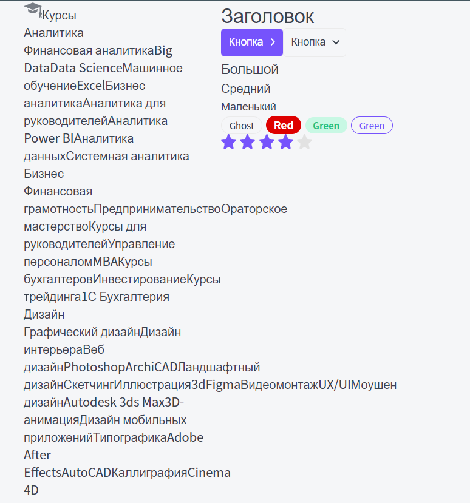

Стили для меню:

`layout / Menu / Menu.module.css`
```CSS
.menu {}

.firstLevel {
	display: grid;
	grid-template-columns: 24px 1fr;
	gap: 20px;
	align-items: center;
	margin-bottom: 20px;

	font-weight: 500;
	line-height: 25px;
	font-size: 18px;
}

/* активную строку и строку при наведении выделяем */
.firstLevelActive,
.firstLevel:hover {
	color: var(--primary);
}

/* активную svg и svg при наведении выделяем */
.firstLevelActive svg,
.firstLevelActive svg:hover {
	fill: var(--primary);
}

.secondBlock {
	margin: 15px 0 0 12px;
	padding-left: 32px;
	border-left: 1px solid #dfdfdf;
}

.secondLevel {
	cursor: pointer;
	margin-bottom: 10px;

	text-transform: uppercase;
	color: var(--gray-dark);

	font-weight: 300;
	line-height: 16px;
	font-size: 12px;
}

.secondLevelBlock {}

.secondLevelBlockOpened:last-child {
	margin-bottom: 20px;
}

.thirdLevel {
	/* чтобы ссылки выстроились в одну колонку отдельно друг от друга */
	display: block;
	margin-bottom: 10px;

	cursor: pointer;

	color: var(--gray-dark);

	font-weight: 500;
	line-height: 19px;
	font-size: 14px;
}

.thirdLevelActive,
.thirdLevel:hover {
	color: var(--primary);
	transition: all 0.05s;
}
```

Внешний вид с применёнными стилями:

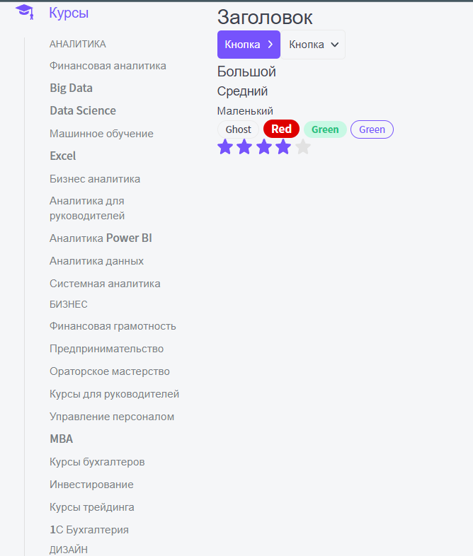
