## 001 Компонент отзыва

Сейчас нужно реализовать компонент отзыва. 
Он будет в себя принимать те же пропсы, что описаны в `ReviewModel`

`components / Review / Review.props.ts`
```TS
import { DetailedHTMLProps, HTMLAttributes } from 'react';  
import { ReviewModel } from '../../interfaces/product.interface';  
  
export interface ReviewProps  
   extends DetailedHTMLProps<HTMLAttributes<HTMLDivElement>, HTMLDivElement> {  
   review: ReviewModel;  
}
```

Сам компонент обзора:

`components / Review / Review.tsx`
```TSX
import React from 'react';
import cn from 'classnames';
import { format } from 'date-fns';
import { ru } from 'date-fns/locale';
import styles from './Review.module.css';
import UserIcon from './user.svg';
import { ReviewProps } from './Review.props';
import { Rating } from '../Rating/Rating';

export const Review = ({ review, className, ...props }: ReviewProps): JSX.Element => {
	const { name, title, rating, description, createdAt } = review;

	return (
		<div className={cn(styles.review, className)} {...props}>
			<UserIcon className={styles.user} />
			<div className={styles.title}>
				<span className={styles.name}>{name}:</span>&nbsp;&nbsp;
				<span>{title}</span>
			</div>
			<div className={styles.date}>
				{/*
				 * создаём новую дату из createdAt,
				 * далее указываем дату (заглавные - пропись)
				 * и потом указываем язык
				 */}
				{format(new Date(createdAt), 'dd MMMM yyyy', { locale: ru })}
			</div>
			<div className={styles.rating}>
				<Rating rating={rating} />
			</div>
			<div className={styles.description}>{description}</div>
		</div>
	);
};
```

Стили компонента обзора:

`components / Review / Review.module.css`
```CSS
.review {  
   display: grid;  
   grid-template-columns: [start] auto 1fr auto auto [end];  
   align-items: center;  
   gap: 10px;  
  
   font-size: 14px;  
   line-height: 24px;  
}  
  
.description {  
   grid-column: start / end;  
}  
  
.date {  
   margin-right: 10px;  
}  
  
.name {  
   font-weight: bold;  
}  
  
@media (max-width: 640px) {  
   .review {  
      grid-template-columns: [start] 30px [titlestart] auto [dateend] 1fr [end];  
   }  
  
   .title {  
      grid-column: titlestart / end;  
   }  
  
   .date {  
      grid-column: start / dateend;  
   }  
}  
  
@media (max-width: 480px) {  
  
   .rating {  
      grid-column: start / end;  
   }  
  
   .date {  
      grid-column: start / end;  
   }  
}
```

Сокращаем путь до компонента

`components / index.ts`
```TS
export * from './Review/Review';
```

Компонент отзыва будет выводить в отдельной карточке, которая будет изначально закрыта. Для открытия и закрытия будем использовать `useState`, который будет изменяться при нажатии на кнопку в первой карточке

`components / Product / Product.tsx`
```TSX
export const Product = ({ product }: ProductProps): JSX.Element => {  
   const [isReviewOpened, setIsReviewOpened] = useState<boolean>(false);  
  
   return (  
      <>  
         {/* обернём продукт в карточку */}  
         <Card className={styles.product}>  
            /// CODE ....
            
            {/* тут будут находиться кнопки */}
				<div className={styles.actions}>
					<Button appearance={'primary'}>Узнать подробнее</Button>
					<Button
						appearance={'ghost'}
						arrow={isReviewOpened ? 'down' : 'right'}
						className={styles.review}
						{/* меняем состояние отзывов */}
						onClick={() => setIsReviewOpened(!isReviewOpened)}
					>
						Читать отзывы
					</Button>
				</div>
         </Card>  
         <Card
				color={'blue'}
				className={cn(styles.reviews, {
					[styles.opened]: isReviewOpened,
					[styles.closed]: !isReviewOpened,
				})}
			>
				{product.reviews.map(r => (
					<>
						<Review key={r._id} review={r} />
						<Divider />
					</>
				))}
			</Card>
      </>  
   );  
};
```

Стили для открытого и закрытого меню с отзывами

`components / Product / Product.module.css`
```CSS
/*
	* Вторая карточка
*/

.opened {
	max-height: auto;
	padding: 30px;
}

/* чтобы нормально заанимировать изменение высоты, нам нельзя использовать display: none */
.closed {
	max-height: 0;
	padding: 0;
	overflow: hidden;
}
```

Итог:


## 002 Форма отзыва

Компонент формы будет на вход принимать в себя `id` продукта, к которому он относится

`components / ReviewForm / ReviewForm.props.ts`
```TS
import { DetailedHTMLProps, HTMLAttributes } from 'react';

export interface ReviewFormProps
	extends DetailedHTMLProps<HTMLAttributes<HTMLDivElement>, HTMLDivElement> {
	productId: string;
}
```

Сама форма добавления нового отзыва состоит из уже подготовленных компонентов ввода `Input` с `Textarea` и выглядит следующим образом:

`components / ReviewForm / ReviewForm.tsx`
```TSX
import React from 'react';
import cn from 'classnames';
import styles from './ReviewForm.module.css';
import { ReviewFormProps } from './ReviewForm.props';
import { Input } from '../Input/Input';
import { Rating } from '../Rating/Rating';
import { Textarea } from '../Textarea/Textarea';
import { Button } from '../Button/Button';
import CloseIcon from './close.svg';

export const ReviewForm = ({ productId, className, ...props }: ReviewFormProps): JSX.Element => {
	return (
		<>
			<div className={cn(styles.reviewForm, className)} {...props}>
				<Input placeholder={'Имя'} />
				<Input placeholder={'Заголовок'} className={styles.title} />
				<div className={styles.rating}>
					<span>Оценка:</span>
					<Rating isEditable={true} rating={0} />
				</div>
				<Textarea placeholder={'Текст отзыва'} className={styles.description} />
				<div className={styles.submit}>
					<Button className={styles.button} appearance={'primary'}>
						Отправить
					</Button>
					<span className={styles.info}>
						* Перед публикацией отзыв пройдет предварительную модерацию и проверку
					</span>
				</div>
			</div>

			{/* это оповещение, которое отправится после сабмита нового отзыва */}
			<div className={styles.success}>
				<div className={styles.successTitle}>Ваш отзыв отправлен!</div>
				<div className={styles.successDescription}>
					Спасибо, ваш отзыв будет опубликован после проверки.
				</div>
				<CloseIcon className={styles.close} />
			</div>
		</>
	);
};
```

Сокращаем путь до компонента

`components / index.ts`
```TS
export * from './ReviewForm/ReviewForm';
```

Стили компонента с адаптивом:

`components / ReviewForm / ReviewForm.module.css`
```CSS
.reviewForm {
	display: grid;
	grid-template-columns: [start] auto 1fr auto [end];
	align-items: center;
	gap: 20px 30px;

	margin-bottom: 20px; /* отбиваем снизу уведомление об отправке */

	font-size: 14px;
	line-height: 24px;
}

.description, .submit {
	grid-column: start / end;
}

.title {
	/* инпут с заголовком прибился к левому краю */
	justify-self: left;
}

.button {
	margin-right: 20px;
}

.rating {
	display: grid;
	grid-template-columns: auto 1fr;
	gap: 20px;
}

.success {
	position: relative;

	padding: 20px;

	border-radius: 5px;

	background: var(--green-light);
}

.successTitle {
	font-weight: bold;
}

.close {
	position: absolute;
	top: 20px;
	right: 20px;
	cursor: pointer;
}

@media (max-width: 1100px) {
	.reviewForm {
		grid-template-columns: [start] 1fr 1fr [end];
	}

	.title {
		/* чтобы инпут с заголовком не прибивался к левому краю */
		justify-self: normal;
	}

	.rating {
		grid-column: start / end;
	}
}

@media (max-width: 640px) {
	.reviewForm {
		grid-template-columns: [start] 1fr [end];
	}
}
```

И тут мы выводим форму  добавления обзора `ReviewForm`

`components / Product / Product.tsx`
```TSX
<Card
	color={'blue'}
	className={cn(styles.reviews, {
		[styles.opened]: isReviewOpened,
		[styles.closed]: !isReviewOpened,
	})}
>
	{product.reviews.map(r => (
		<>
			<Review key={r._id} review={r} />
			<Divider />
		</>
	))}
	
	{/* форма написания обзора */}
	<ReviewForm productId={product._id} />
</Card>
```

Итог:

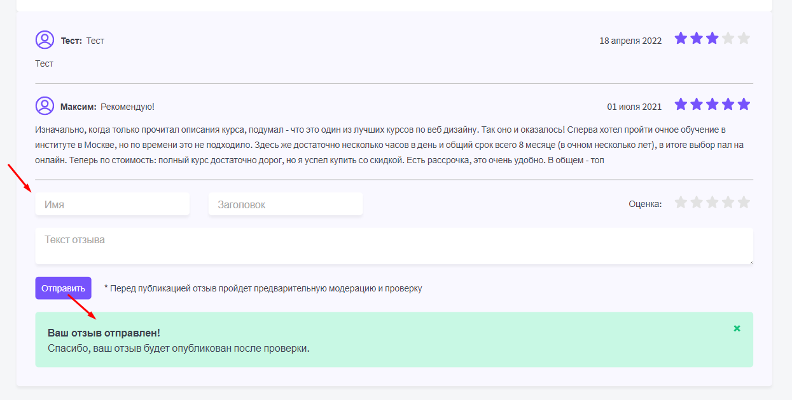


## 003 useForm

Первым делом нужно сказать, что события реакта и события в DOM - это отдельные вещи. Между обоими деревьями есть прослойка, которая проксирует их взаимодействия (ветка реакта / ветка html и между ними сравнение)  


При работе с формами внутри реакта, мы можем работать собственными силами или использовать готовые библиотеки, которые воспроизводят нужный нам функционал. Минусом второго подхода является то, что библиотека несёт за собой дополнительную зависимость и дополнительный вес на страницу, а так же эту зависимость нужно поддерживать и своевременно обновлять.

Если:
- Формы присутствуют только на регистрации или они простые, то самым оптимальным решением будет самому реализовать формы
- Формы используются в большом количестве (работа с паспортными данными или CRM-система), то тут уже можно использовать библиотеку 


Управляемый компонент - это компонент, значения которого управляются в стейте этого же компонента.

Если мы возьмём обычный `<input>`, то его значение хранится в DOM-дереве. Если мы берём тот же компонент `<Rating />`, то его состояние (значение рейтинга) хранится в самом компоненте рейтинга.

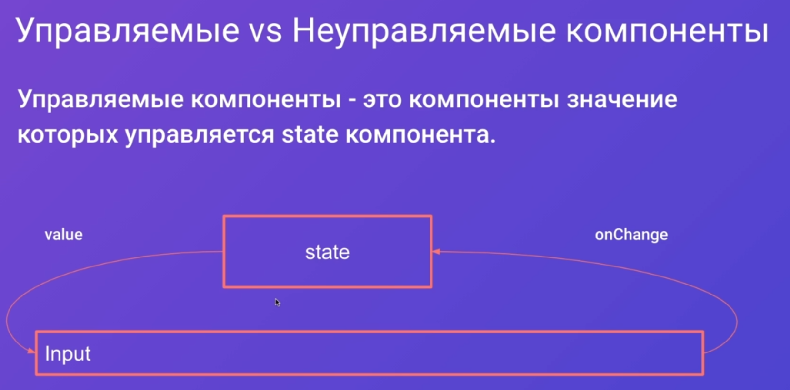

В проекте будет использоваться ==React Hook Form==


Параметры, которые возвращает хук формы `useForm`: 

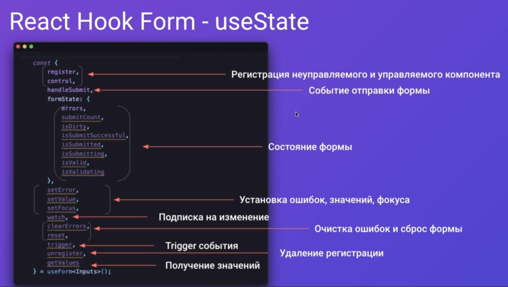

Оформление неуправляемых компонентов:


Пример оформления управляемого компонента: контроллер указывает на то, чем он будет управлять


## 004 Работа с формами

Прежде всего нужно поправить старые ошибки. Если мы используем списки и выводим повторяющиеся элементы, то нам нужно атрибут `key` переносить на самый внешний элемент

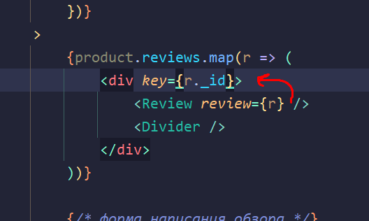

Далее нужно установить модуль работы с формами внутри реакта

```bash
npm i react-hook-form
```

Далее нужно определить, что будет получать форма. В неё будет попадать имя пользователя, заголовок, рейтинг и описание

`components / ReviewForm / ReviewForm.interface.ts`
```TS
export interface IReviewForm {  
   name: string;  
   title: string;  
   description: string;  
   rating: number;  
}
```

Далее мы создаём хук формы, который принимает в себя вышеописанный интерфейс, тем самым определяя, какие поля в форме будут 

Чтобы привязать неуправляемые компоненты к форме, придётся воспользоваться привязкой через `{...register('name')}` деструктуризацию объекта функции регистрации, куда мы передаём имя формы

Далее, чтобы сделать рейтинг управляемым, его нужно сложить в контроллер, который привязан к нашему `useForm`. Стейт хранить будет сам рейтинг, а управлять стейтом будет контроллер, в который вложен рейтинг.

`components / ReviewForm / ReviewForm.tsx`
```TSX  
export const ReviewForm = ({ productId, className, ...props }: ReviewFormProps): JSX.Element => {  
	// register - регистрирует форму  
	// control - регистрирует управляемые формы   
	// handleSubmit - функция хэндлинга сабмита   
   const { register, control, handleSubmit } = useForm<IReviewForm>();  
  
   const onSubmit = (data: IReviewForm) => {  
      console.log(data);  
   };  
  
   return (  
      // при отправке формы, нужно вложить функцию, которую мы получаем из useForm, и вложить в неё функцию, которая вызовется после сабмита  
      <form onSubmit={handleSubmit(onSubmit)}>  
         <div className={cn(styles.reviewForm, className)}  
            {...props}  
         >  
            <Input {...register('name')} placeholder='Имя' />  
            <Input {...register('title')} placeholder='Заголовок отзыва' className={styles.title} />  
            <div className={styles.rating}>  
               <span>Оценка:</span>  
               <Controller  
                  control={control}  
                  name='rating'  
                  render={({ field }) => (  
                     <Rating 
	                     isEditable 
	                     ref={field.ref} 
	                     rating={field.value} 
	                     setRating={field.onChange} 
					/>  
                  )}  
               />  
            </div>  
            <Textarea  {...register('description')} placeholder='Текст отзыва' className={styles.description} />  
            <div className={styles.submit}>  
               <Button appearance="primary">Отправить</Button>  
               <span className={styles.info}>* Перед публикацией отзыв пройдет предварительную модерацию и проверку</span>  
            </div>  
         </div>  

         {/* это оповещение, которое отправится после сабмита нового отзыва */}  
         <div className={styles.success}>  
            <div className={styles.successTitle}>Ваш отзыв отправлен</div>  
            <div>  
               Спасибо, ваш отзыв будет опубликован после проверки.  
            </div>  
            <CloseIcon className={styles.close} />  
         </div>  
      </form>  
   );  
};
```

Осталось только решить проблему с пробросом ref и мы будем получать все данные с форм

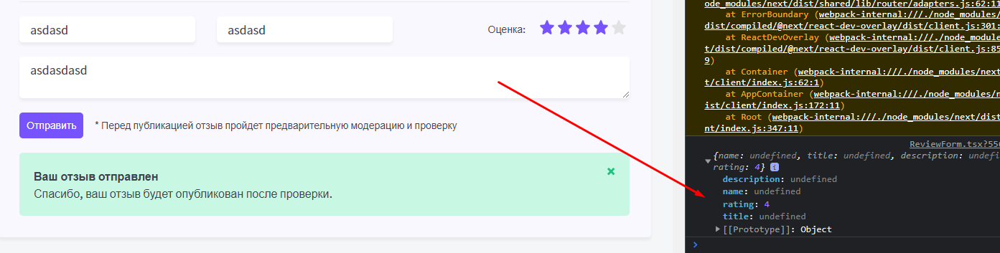

## 005 Проброс ref

reference определённого элемента позволяет нам:


Чтобы передать `ref` в компонент, нужно саму функцию компонента обернуть в функцию `forwardRef`, которая позволит передать ему этот пропс `ref` внутрь компонента в качестве атрибута


Прокидываем `ref` через `forwardRef` в `Textarea`

`components / Textarea / Textarea.tsx`
```TSX
export const Textarea = forwardRef(  
   (  
      { className, ...props }: TextareaProps,  
      ref: ForwardedRef<HTMLTextAreaElement>,  
   ): JSX.Element => {  
      return <textarea ref={ref} className={cn(className, styles.input)} {...props} />;  
   },  
);
```

Прокидываем `ref` через `forwardRef` в `Input`

`components / Input / Input.tsx`
```TSX
export const Input = forwardRef(  
   ({ className, ...props }: InputProps, 
	ref: ForwardedRef<HTMLInputElement>
   ): JSX.Element => {  
      return <input ref={ref} className={cn(className, styles.input)} {...props} />;  
   },  
);
```

Прокидываем `ref` через `forwardRef` в компонент рейтинга

`components / Rating / Rating.tsx`
```TSX
export const Rating = forwardRef(  
   (  
      { isEditable = false, rating, setRating, ...props }: RatingProps,  
      ref: ForwardedRef<HTMLDivElement>,  
   ): JSX.Element => {  
      const [ratingArray, setRatingArray] = useState<JSX.Element[]>(new Array(5).fill(<></>));  
  
      /// CODE ...
  
      return (  
         <div {...props} ref={ref}>  
            {ratingArray.map((r, i) => (  
               <span key={i}>{r}</span>  
            ))}  
         </div>  
      );  
   },  
);
```

И сейчас мы можем получить данные из неуправляемых компонентов 

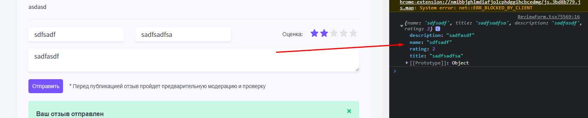

## 006 Обработка ошибок

Компонент `useForm` может вернуть нам состояние формы `formState`. Из этого состояния нам нужно только одно свойство `{ errors }`, которое мы получаем, когда формы встретились с поведением, которое приводит к ошибке (нам нужно, чтобы формы всегда были заполнены данными).

Конкретно в каждом неуправляемом компоненте формы мы добавляем в функцию `register` объект с опциями `{ required: { value: true, message: 'Заполните имя' } }`, в которой передаём требования данных формы `required`, где указываем обязательным, чтобы в формы обязательно попадало значение `value`. Если `value` нет, то выводим ошибку, которую укажем в `message`.
Если нам нужно накинуть данные требования внутрь компонента, который находится внутри `<Controller>`, то эти требования нужно внести в атрибут `rules`.

Далее нам нужно передать ошибки `errors`, которые мы получили из состояния `formState`, внутрь компонентов через атрибут `error`.

`components / ReviewForm / ReviewForm.tsx`
```TSX
export const ReviewForm = ({ productId, className, ...props }: ReviewFormProps): JSX.Element => {  
   const {  
      register,  
      control,  
      handleSubmit,  
      // тут получаем ошибки из состояния формы  
      formState: { errors },  
   } = useForm<IReviewForm>();  
  
   const onSubmit = (data: IReviewForm) => {  
      console.log(data);  
   };  
  
   return (  
      <form onSubmit={handleSubmit(onSubmit)}>  
         <div className={cn(styles.reviewForm, className)} {...props}>  
            <Input  
               {...register('name', 
	               { required: 
		               { value: true, message: 'Заполните имя' } 
		        })}  
               placeholder='Имя'  
               error={errors.name}  
            />  
            <Input  
               // Указываем требования по обязательным условиям полей  
               {...register('title', {  
                  required: { value: true, message: 'Заполните заголовок' },  
               })}  
               placeholder='Заголовок отзыва'  
               className={styles.title}  
               //передаём ошибку внутрь компонента  
               error={errors.title}  
            />  
            <div className={styles.rating}>  
               <span>Оценка:</span>  
               <Controller  
                  control={control}  
                  name='rating'  
                  // аналог атрибута опций функции register  
                  rules={{  
                     required: { value: true, message: 'Укажите рейтинг' },  
                  }}  
                  render={({ field }) => (  
                     <Rating  
                        isEditable  
                        ref={field.ref}  
                        rating={field.value}  
                        setRating={field.onChange}  
                        error={errors.rating}  
                     />  
                  )}  
               />  
            </div>  
            <Textarea  
               {...register('description', {  
                  required: { value: true, message: 'Заполните заголовок' },  
               })}  
               placeholder='Текст отзыва'  
               className={styles.description}  
               error={errors.description}  
            />  
            <div className={styles.submit}>  
               <Button appearance='primary'>Отправить</Button>  
               <span className={styles.info}>  
                  * Перед публикацией отзыв пройдет предварительную модерацию и проверку  
               </span>  
            </div>  
         </div>  
         <div className={styles.success}>  
            <div className={styles.successTitle}>Ваш отзыв отправлен</div>  
            <div>Спасибо, ваш отзыв будет опубликован после проверки.</div>  
            <CloseIcon className={styles.close} />  
         </div>  
      </form>  
   );  
};
```

Далее нужно в интерфейсах компонентов добавить пропс `error`, который мы передаём из родительского компонента, чтобы иметь возможность написать логику реагирования компонента на попадение в него ошибки

`components / Textarea / Textarea.props.ts`
```TS
import { DetailedHTMLProps, TextareaHTMLAttributes } from 'react';  
import { FieldError } from 'react-hook-form';  
  
export interface TextareaProps  
   extends DetailedHTMLProps<TextareaHTMLAttributes<HTMLTextAreaElement>, HTMLTextAreaElement> {  
   error?: FieldError;  
}
```

`components / Input / Input.props.ts`
```TS
export interface InputProps  
   extends DetailedHTMLProps<InputHTMLAttributes<HTMLInputElement>, HTMLInputElement> {  
   error?: FieldError;  
}
```

`components / Rating / Rating.props.ts`
```TS
export interface RatingProps  
   extends DetailedHTMLProps<HTMLAttributes<HTMLDivElement>, HTMLDivElement> {  
   isEditable?: boolean;  
   rating: number;  
   setRating?: (rating: number) => void;  
   error?: FieldError;  
}
```

Далее мы должны задать определённый стиль для самих `input`, `Rating` и `textarea`, если ошибка в принципе была передана, а так же вывести саму ошибку под компонентом формы

Инпут:

`components / Input / Input.tsx`
```TSX
export const Input = forwardRef(  
   (  
      { className, error, ...props }: InputProps,  
      ref: ForwardedRef<HTMLInputElement>,  
   ): JSX.Element => {  
      return (  
         <div className={cn(className, styles.inputWrapper)}>  
            <input  
               ref={ref}  
               className={cn(styles.input, {  
                  [styles.error]: error,  
               })}  
               {...props}  
            />  
            {error && <span className={styles.errorMessage}>{error.message}</span>}  
         </div>  
      );  
   },  
);
```

`components / Input / Input.module.css`
```CSS
.inputWrapper {  
   position: relative;  
}  
  
.input {  
   padding: 7px 15px;  
  
   color: var(--black);  
   border: none;  
   outline-color: var(--primary);  
   background: var(--white);  
   box-shadow: 0px 4px 4px rgba(0, 0, 0, 0.05);  
   border-radius: 5px;  
  
   font-size: 16px;  
   line-height: 22px;  
   font-family: var(--font-family);  
}  
  
.input::placeholder {  
   color: var(--gray);  
}  
  
.error {  
   border: 1px solid var(--red);  
}  
  
.errorMessage {  
   position: absolute;  
   bottom: -20px;  
   left: 12px;  
  
   color: var(--red);  
}
```

Текстареа:

`components / Textarea / Textarea.tsx`
```TSX
export const Textarea = forwardRef(  
   (  
      { error, className, ...props }: TextareaProps,  
      ref: ForwardedRef<HTMLTextAreaElement>,  
   ): JSX.Element => {  
      return (  
         <div className={cn(styles.textareaWrapper, className)}>  
            <textarea  
               ref={ref}  
               className={cn(styles.textarea, {  
                  [styles.error]: error,  
               })}  
               {...props}  
            />  
            {error && <span className={styles.errorMessage}>{error.message}</span>}  
         </div>  
      );  
   },  
);
```

`components / Textarea / Textarea.module.css`
```CSS
.textarea {  
   padding: 7px 15px;  
  
   width: 100%;  
  
   color: var(--black);  
   border: none;  
   outline-color: var(--primary);  
   background: var(--white);  
   box-shadow: 0px 4px 4px rgba(0, 0, 0, 0.05);  
   border-radius: 5px;  
  
   font-size: 16px;  
   line-height: 22px;  
   font-family: var(--font-family);  
}  
  
.textarea::placeholder {  
   color: var(--gray);  
}  
  
.textareaWrapper {  
   position: relative;  
}  
  
.error {  
   border: 1px solid var(--red);  
}  
  
.errorMessage {  
   position: absolute;  
   bottom: -15px;  
   left: 12px;  
  
   color: var(--red);  
}
```

Компонент рейтинга:

`components / Rating / Rating.tsx`
```TSX
export const Rating = forwardRef(  
   (  
      { isEditable = false, className, error, rating, setRating, ...props }: RatingProps,  
      ref: ForwardedRef<HTMLDivElement>,  
   ): JSX.Element => {  
      const [ratingArray, setRatingArray] = useState<JSX.Element[]>(new Array(5).fill(<></>));  
  
      /// CODE ...
  
      return (  
         <div  
            className={cn(className, styles.ratingWrapper, {  
               [styles.error]: error,  
            })}  
            {...props}  
            ref={ref}  
         >            {ratingArray.map((r, i) => (  
               <span key={i}>{r}</span>  
            ))}  
            {error && <span className={styles.errorMessage}>{error.message}</span>}  
         </div>  
      );  
   },  
);
```

`components / Rating / Rating.module.css`
```CSS
.filled svg {  
   fill: var(--primary);  
}  
  
.star svg {  
   margin-right: 5px;  
}  
  
.editable {  
   cursor: pointer;  
}  
  
.ratingWrapper {  
   position: relative;  
}  
  
.error {  
   border: 1px solid var(--red);  
   border-radius: 5px;  
}  
  
.errorMessage {  
   position: absolute;  
   bottom: -20px;  
   left: 5px;  
  
   color: var(--red);  
}
```

Итог: теперь при нажатии на кнопку отправки формы у нас появляются сообщения у пустых форм и указатель сразу попадает на первую пустую форму, чтобы пользователь смог сразу начать её вводить

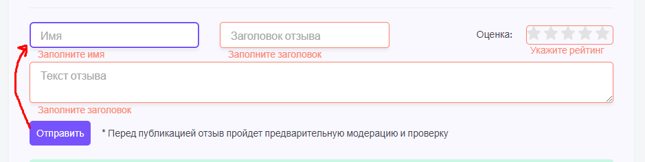

## 008 Отправка запроса со страницы

Чтобы упростить себе жизнь и не прописывать пути для запросов в `axios`, можно реализовать отдельный объект, который будет хранить все нужные пути для общения с сервером

`helpers / api.ts`
```TS
export const API = {  
   topPage: {  
      find: process.env.NEXT_PUBLIC_DOMAIN + '/api/top-page/find',  
      byAlias: process.env.NEXT_PUBLIC_DOMAIN + '/api/top-page/byAlias/',  
   },  
   product: {  
      find: process.env.NEXT_PUBLIC_DOMAIN + '/api/product/find/',  
   },  
   review: {  
      createDemo: process.env.NEXT_PUBLIC_DOMAIN + '/api/review/create-demo',  
   },  
};
```

Далее нам нужно заменить всю логику с хардкожеными путями запросов на наш `API` объект:

`pages / search.tsx`
```TSX
export const getStaticProps: GetStaticProps<HomeProps> = async () => {  
   const firstCategory = 0;  
   const { data: menu } = await axios.post<MenuItem[]>(API.topPage.find, {  
      firstCategory,  
   });  
   return {  
      props: {  
         menu,  
         firstCategory,  
      },  
   };  
};
```

`pages / index.tsx`
```TSX
export const getStaticProps: GetStaticProps<HomeProps> = async () => {  
   const firstCategory = 0;  
   const { data: menu } = await axios.post<MenuItem[]>(API.topPage.find, {  
      firstCategory,  
   });  
   return {  
      props: {  
         menu,  
         firstCategory,  
      },  
   };  
};
```

`pages / [type] / index.tsx`
```TSX
export const getStaticProps: GetStaticProps<TypeProps> = async ({  
   params,  
}: GetStaticPropsContext<ParsedUrlQuery>) => {  
   if (!params) {  
      return {  
         notFound: true,  
      };  
   }  
   const firstCategoryItem = firstLevelMenu.find(m => m.route == params.type);  
   if (!firstCategoryItem) {  
      return {  
         notFound: true,  
      };  
   }  
   const { data: menu } = await axios.post<MenuItem[]>(API.topPage.find, {  
      firstCategory: firstCategoryItem.id,  
   });  
   return {  
      props: {  
         menu,  
         firstCategory: firstCategoryItem.id,  
      },  
   };  
};
```

`pages / [type] / [alias].tsx`
```TSX
export const getStaticPaths: GetStaticPaths = async () => {  
   let paths: string[] = [];  
   for (const m of firstLevelMenu) {  
      const { data: menu } = await axios.post<MenuItem[]>(API.topPage.find, {  
         firstCategory: m.id,  
      });  
      paths = paths.concat(menu.flatMap(s => s.pages.map(p => `/${m.route}/${p.alias}`)));  
   }  
   return {  
      paths,  
      fallback: true,  
   };  
};  
  
export const getStaticProps: GetStaticProps<TopPageProps> = async ({  
   params,  
}: GetStaticPropsContext<ParsedUrlQuery>) => {  
   if (!params) {  
      return {  
         notFound: true,  
      };  
   }  
   const firstCategoryItem = firstLevelMenu.find(m => m.route == params.type);  
   if (!firstCategoryItem) {  
      return {  
         notFound: true,  
      };  
   }  
   try {  
      const { data: menu } = await axios.post<MenuItem[]>(API.topPage.find, {  
         firstCategory: firstCategoryItem.id,  
      });  
      if (menu.length == 0) {  
         return {  
            notFound: true,  
         };  
      }  
      const { data: page } = await axios.get<TopPageModel>(API.topPage.byAlias + params.alias);  
      const { data: products } = await axios.post<ProductModel[]>(API.product.find, {  
         category: page.category,  
         limit: 10,  
      });  
  
      return {  
         props: {  
            menu,  
            firstCategory: firstCategoryItem.id,  
            page,  
            products,  
         },  
      };  
   } catch {  
      return {  
         notFound: true,  
      };  
   }  
};
```

Далее опишем интерфейс, который определит получаемый ответ от сервера. Его мы будем использовать в `axios`

`components / ReviewForm / ReviewForm.interface.ts`
```TS
export interface IReviewSentResponse {  
   message: string;  
}
```

И сейчас мы реализуем логику отправки данных на сервер. Первым делом, расширим функционал `onSubmit`, которая сейчас принимает в себя объект данных с формы и через `axios` отправляет по нашей описанной апишке эти данные на сервер. 
Если сервер прислал ответ, что сообщение отправлено, то мы проверяем по условию наличие этого ответа. В зависимости от наличия ответа нужно либо очистить форму и уведомить пользователя об успешной отправке данных (через стейт успеха), либо записать ошибку в стейт ошибки и вывести её.

Из хука `useForm` мы так же можем получить функцию `reset`, которая очистит все поля формы

*Примечание*: сейчас кнопка закрытия уведомления так же работает

`components / ReviewForm / ReviewForm.tsx`
```TSX
export const ReviewForm = ({ productId, className, ...props }: ReviewFormProps): JSX.Element => {  
   const {  
      register,  
      control,  
      handleSubmit,  
      formState: { errors },  
      // функция очистки данных формы  
      reset,  
   } = useForm<IReviewForm>();  
  
   // состояние отправленности данных формы  
   const [isSuccess, setIsSuccess] = useState<boolean>();  
   // состояние наличия ошибки отправки данных  
   const [error, setError] = useState<string>();  

	// тут будет совершаться отправка данных с формы на сервер
   const onSubmit = async (formData: IReviewForm) => {  
      try {  
         // будем отправлять отзыв на сервер, обогащая запрос от форм данными об ID продукта  
         const { data } = await axios.post<IReviewSentResponse>(API.review.createDemo, {  
            ...formData,  
            productId,  
         });  
  
         // если мы получили ответ от сервера  
         if (data.message) {  
            setIsSuccess(true);  
            reset();  
         } else {  
            setError('Что-то пошло не так...');  
         }  
      } catch (e) {  
         setError(e.message);  
      }  
   };  
  
   return (  
      <form onSubmit={handleSubmit(onSubmit)}>  
            
		{/* CODE ... */}

         {isSuccess && (  
            <div className={cn(styles.panel, styles.success)}>  
               <div className={styles.successTitle}>Ваш отзыв отправлен</div>  
               <div>Спасибо, ваш отзыв будет опубликован после проверки.</div>  
               <CloseIcon className={styles.close} onClick={() => setIsSuccess(false)} />  
            </div>  
         )}  
         {error && (  
            <div className={cn(styles.panel, styles.error)}>  
               Что-то пошло не так. Пожалуйста, обновите страницу.  
               <CloseIcon className={styles.close} onClick={() => setError(undefined)} />  
            </div>  
         )}  
      </form>  
   );  
};
```

Стили для панелек уведомления и кнопок:

`components / ReviewForm / ReviewForm.module.css`
```CSS
.success {  
   background: var(--green-light);  
}  
  
.error {  
   background: var(--red-light);  
}  
  
.error .close path {  
   stroke: var(--red);  
}
```

Итог: теперь форма может вернуть ошибку пользователю

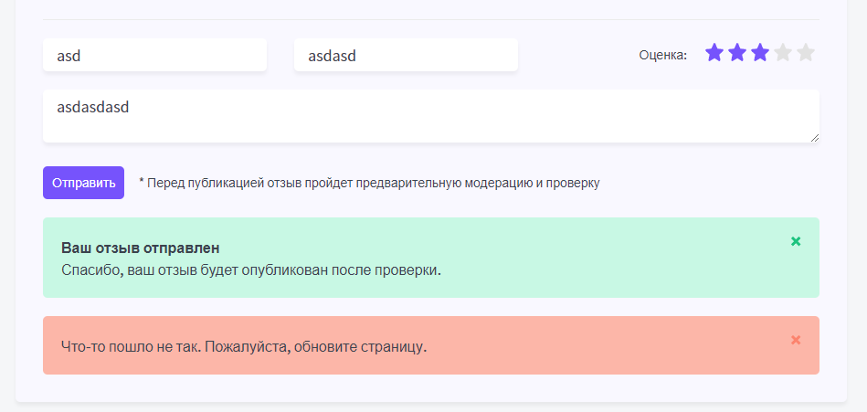

## 009 useRef

Хук `useRef` создаёт контейнер, который позволяет нам использовать все атрибуты элемента, который в нём находится

Если мы хотим навесить `ref` на стандартный элемент, то это можно сделать просто через атрибут `ref={refElement}`. Если нам нужно накинуть его на функциональный компонент, то нам уже будет нужно обернуть сам компонент внутри в `forwardRef()`

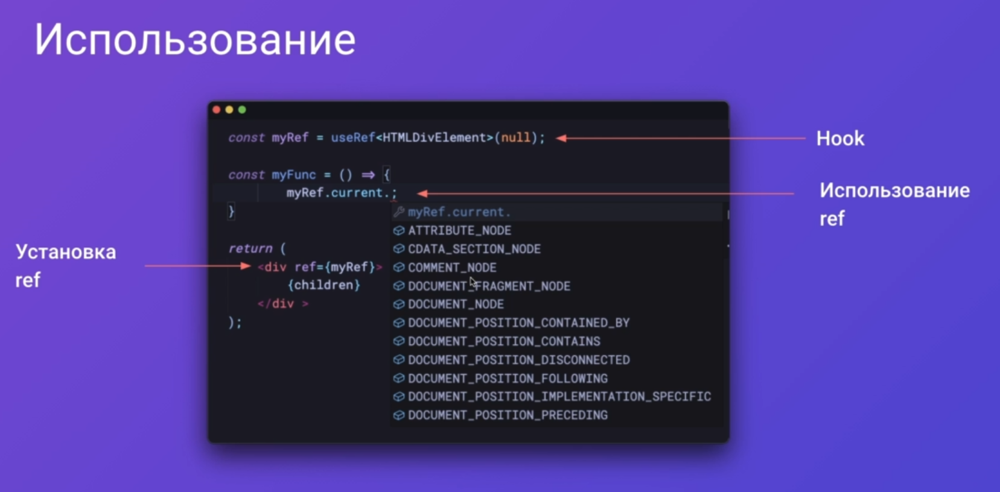

В компоненте продукта создадим `useRef`, в который присвоим нашу ссылку из отзывов. Далее реализуем функцию  `scrollToReview`, которая сначала откроет список отзывов, а затем вызовет скролл до этого элемента

`components / Product / Product.tsx`
```TSX
export const Product = ({ product, className, ...props }: ProductProps): JSX.Element => {  
   const [isReviewOpened, setIsReviewOpened] = useState<boolean>(false);  

	// создаём контейнер рефа
   const reviewRef = useRef<HTMLDivElement>(null);  
  
   const scrollToReview = () => {  
      setIsReviewOpened(true);  
  
      // вызываем АПИ-функцию, которая скроллит до элемента  
      reviewRef.current?.scrollIntoView({  
         behavior: 'smooth', // поведение  
         block: 'center', // докуда нужно скроллить  
      });  
   };  
  
   return (  
      <div className={className} {...props}>  
            
		{/* CODE ... */}

            <div className={styles.rateTitle}>  
               <a href='#ref' onClick={scrollToReview}>  
                  {product.reviewCount}{' '}  
                  {declOfNum(product.reviewCount, ['отзыв', 'отзыва', 'отзывов'])}  
               </a>  
            </div>  

		{/* CODE ... */}

      </div>  
   );  
};
```

Поменяем цвет ссылки 

`components / Product / Product.module.css`
```CSS
.rateTitle a {  
   color: var(--primary);  
}
```

Далее обернём карточку в `forwardRef`, чтобы прокинуть `ref`

`components / Card / Card.tsx`
```TSX
import { CardProps } from './Card.props';  
import styles from './Card.module.css';  
import cn from 'classnames';  
import { ForwardedRef, forwardRef } from 'react';  
  
export const Card = forwardRef(  
   (  
      { color = 'white', children, className, ...props }: CardProps,  
      ref: ForwardedRef<HTMLDivElement>,  
   ): JSX.Element => {  
      return (  
         <div  
            ref={ref}  
            className={cn(styles.card, className, {  
               [styles.blue]: color == 'blue',  
            })}  
            {...props}  
         >            {children}  
         </div>  
      );  
   },  
);
```

## 010 Упражнение - Исправление бага useReducer

И тут был замечен баг: при переходе на другую страницу у нас обновляется ссылка, но не обновляется список продуктов. Проблема сейчас заключается в том, что мы используем список продуктов из кеша сайта.


Некст на клиенте использует клиентский роутинг, да и работает как обычное реакт-приложение. Если посмотреть на страницу продуктов, то тут можно увидеть, что `useReducer` проинициализировался один раз и в нём были использованы значения одних продуктов, которые в него поступили - и больше он не обновлялся!

Поэтому нужно реализовать подписку на изменение продуктов (через экшен, который будет за этим следить), чтобы обновлять стейт у `useReducer`. Сейчас этого не происходит, так как у нас произошёл один ==Initial State== в рамках продуктов.  

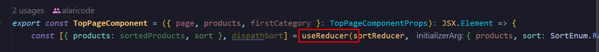

Чтобы добавить ещё один экшен, который будет выполняться под наши действия, нужно в `SortActions` добавить ещё один тайп, который будет принимать тип сброса и начальный массив объектов. Далее в `sortReducer` мы указываем действие под выбранный тайп, где указываем тип сортировки и обновлённый массив продуктов

`sort.reducer.ts`
```TS
export type SortActions =  
   | { type: SortEnum }  
   | { type: SortEnum.Rating }  
   | { type: 'reset'; initialState: ProductModel[] };  
  
export const sortReducer = (state: SortReducerState, action: SortActions): SortReducerState => {  
   switch (action.type) {  
      case SortEnum.Rating:  
         return {  
            sort: SortEnum.Rating,  
            products: state.products.sort((a, b) =>  
               a.initialRating > b.initialRating ? -1 : 1,  
            ),  
         };  
      case SortEnum.Price:  
         return {  
            sort: SortEnum.Price,  
            products: state.products.sort((a, b) => (a.price > b.price ? 1 : -1)),  
         };  
      case 'reset':  
         return {  
            sort: SortEnum.Price,  
            products: action.initialState,  
         };  
      default:  
         throw new Error('Неверный тип сортировки');  
   }  
};
```

Теперь нам нужно в компоненте страниц добавить `useEffect`, который будет сбрасывать диспетч при изменении пропса продукта 

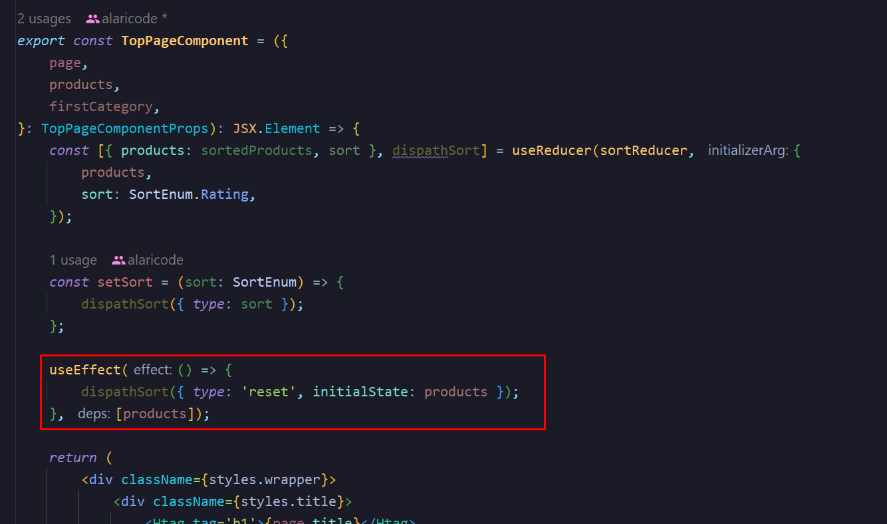


