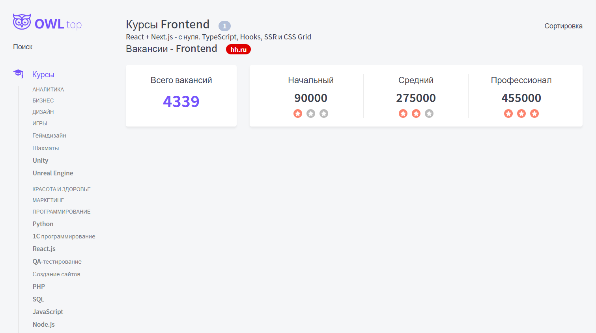
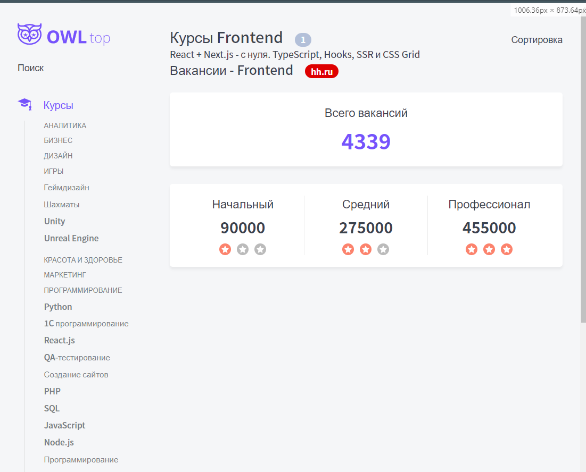
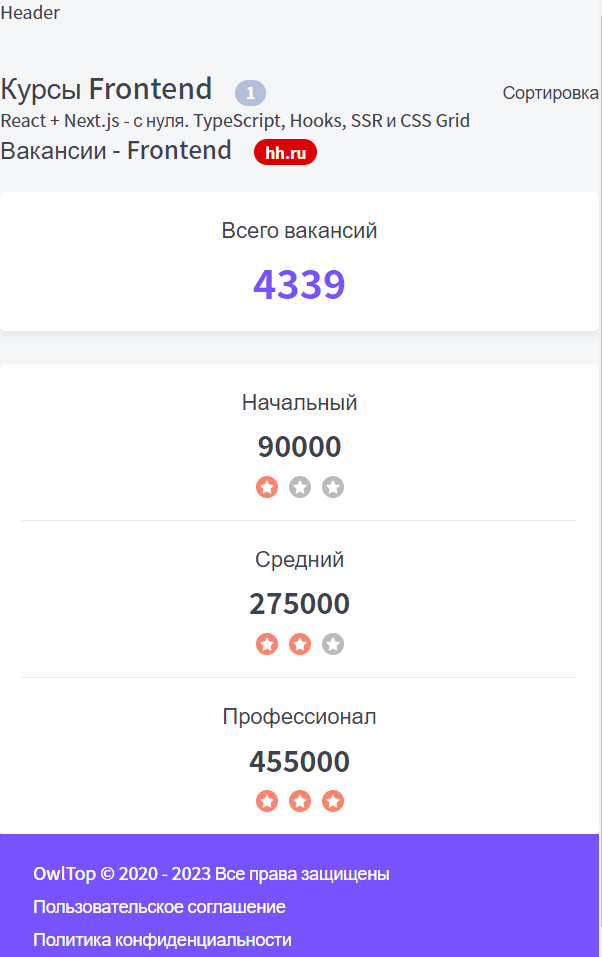
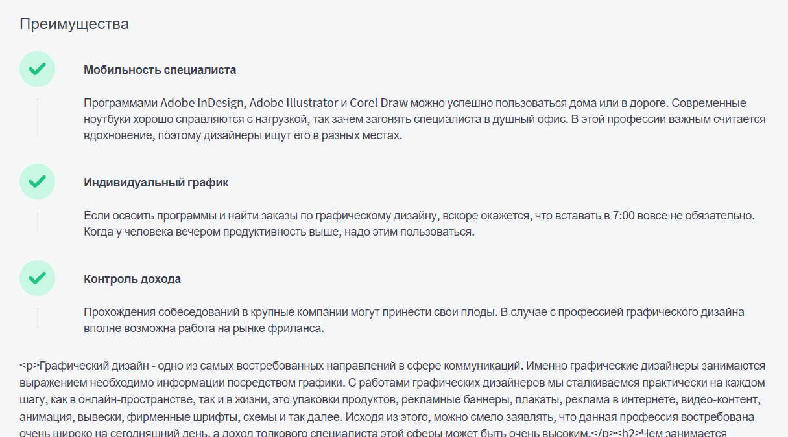
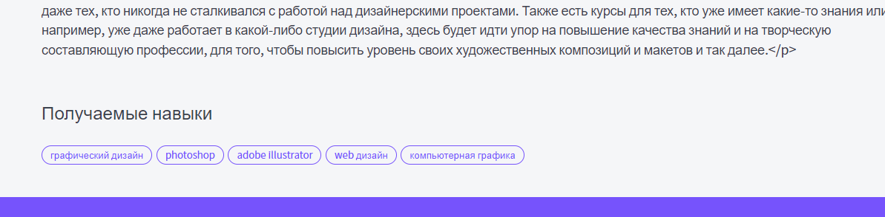

### Часть с карточками

Тут представлен компонент карточки, который может быть использован как под отзыв, так и под блок с `HH.ru`

`components / Card.tsx`
```TSX
import { CardProps } from './Card.props';
import styles from './Card.module.css';
import cn from 'classnames';

export const Card = ({
	color = 'white',
	children,
	className,
	...props
}: CardProps): JSX.Element => {
	return (
		<div
			className={cn(styles.card, className, {
				[styles.white]: color == 'white',
				[styles.blue]: color == 'blue',
			})}
			{...props}
		>
			{children}
		</div>
	);
};
```
Его стили:
```CSS
.card {
	background: var(--white);
	border-radius: 5px;
	box-shadow: 0px 4px 4px rgba(0, 0, 0, 0.05);
}

.white {}

.blue {
	background: #F9F8FF;
}
```
Его пропсы:
```TS
import { DetailedHTMLProps, HTMLAttributes, ReactNode } from 'react';

export interface CardProps
	extends DetailedHTMLProps<HTMLAttributes<HTMLDivElement>, HTMLDivElement> {
	color?: 'white' | 'blue';
	children: ReactNode;
}
```

Тут уже представлена сама вёрстка компонента блока `HH.ru`

`components / HhData / HhData.tsx`
```TSX
import { HhDataProps } from './HhData.props';
import styles from './HhData.module.css';
import cn from 'classnames';
import { Card } from '../Card/Card';
import RateIcon from './rate.svg';

export const HhData = ({
	count,
	juniorSalary,
	middleSalary,
	seniorSalary,
}: HhDataProps): JSX.Element => {
	return (
		<div className={styles.hh}>
			<Card className={styles.count}>
				<div className={styles.title}>Всего вакансий</div>
				<div className={styles.countValue}>{count}</div>
			</Card>
			<Card className={styles.salary}>
				<div>
					<div className={styles.title}>Начальный</div>
					<div className={styles.salaryValue}>{juniorSalary}</div>
					<div className={styles.rate}>
						<RateIcon className={styles.filled} />
						<RateIcon />
						<RateIcon />
					</div>
				</div>
				<div>
					<div className={styles.title}>Средний</div>
					<div className={styles.salaryValue}>{middleSalary}</div>
					<div className={styles.rate}>
						<RateIcon className={styles.filled} />
						<RateIcon className={styles.filled} />
						<RateIcon />
					</div>
				</div>
				<div>
					<div className={styles.title}>Профессионал</div>
					<div className={styles.salaryValue}>{seniorSalary}</div>
					<div className={styles.rate}>
						<RateIcon className={styles.filled} />
						<RateIcon className={styles.filled} />
						<RateIcon className={styles.filled} />
					</div>
				</div>
			</Card>
		</div>
	);
};
```
Его стили: тут уже представлен адаптив страницы
```CSS
.hh {
	display: grid;
	grid-template-columns: 1fr 3fr;
	gap: 30px;
}

.count {
	padding: 20px;
	text-align: center;
}

.title {
	margin-bottom: 10px;

	font-weight: 300;
	font-size: 20px;
	line-height: 27px;
}

.countValue {
	color: var(--primary);

	font-weight: bold;
	font-size: 36px;
	line-height: 49px;
}

.salaryValue {
	margin-bottom: 10px;

	font-weight: bold;
	font-size: 26px;
	line-height: 35px;
}

.salary {
	display: grid;
	grid-template-columns: repeat(3, 1fr);
	padding: 20px;
	text-align: center;
	gap: 20px 0;
}

.salary > div:not(:last-child) {
	border-right: 1px solid var(--gray-light);
}

.rate {
	display: grid;
	grid-template-columns: repeat(3, 20px);
	gap: 10px;
	justify-content: center;
}

/* покрасим кружок у svg-звёздочки */
.filled circle {
	fill: var(--red)
}

@media (max-width: 1200px) {
	.hh {
		grid-template-columns: 1fr;
	}
}

@media (max-width: 640px) {
	.salary {
		grid-template-columns: 1fr;
	}

	.salary > div:not(:last-child) {
		border-right: none;
		border-bottom: 1px solid var(--gray-light);

		padding-bottom: 20px;
	}

}
```
Его пропсы:  интерфейс пропсов будет просто расширяться от `HhData` из `page.interface.ts` (интерфейса страницы)
```TS
import { HhData } from '../../interfaces/page.interface';

export interface HhDataProps extends HhData {}
```

Тут были добавлены отступы от `h2` заголовков

`components / Htag / Htag.module.css`
```CSS
.h2 {
	font-weight: 500;
	font-size: 22px;
	line-height: 30px;

	margin-top: 0;
	margin-bottom: 25px;
}
```


Экспортируем компоненты, чтобы до них было ближе добираться

`components / index.ts`
```TS
export * from './Htag/Htag';
export * from './Button/Button';
export * from './P/P';
export * from './Tag/Tag';
export * from './Rating/Rating';
export * from './Card/Card';
export * from './HhData/HhData';
```

Тут был реализован вывод компонента блока `HH.ru` при условии, что пользователь находится на странице курсов

`page-components / TopPageComponent / TopPageComponent.tsx`
```TSX
export const TopPageComponent = ({
	page,
	products,
	firstCategory,
}: TopPageComponentProps): JSX.Element => {
	return (
		<div className={styles.wrapper}>
			<div className={styles.title}>
				<Htag tag={'h1'}>{page.title}</Htag>
				{products && (
					<Tag color='grey' size='m'>
						{products.length}
					</Tag>
				)}
				<span>Сортировка</span>
			</div>
			<div>{products && products.map(p => <div key={p._id}>{p.title}</div>)}</div>
			<div className={styles.hhTitle}>
				<Htag tag={'h2'}>Вакансии - {page.category}</Htag>
				<Tag color={'red'} size={'m'}>
					hh.ru
				</Tag>
			</div>

			{/* Выведем блок с hh только если мы находимся на категории с курсами */}
			{/* сюда можно не передавать отдельные параметры, а сразу передать все пропсы, которые имеются через спред */}
			{firstCategory == TopLevelCategory.Courses && <HhData {...page.hh} />}
		</div>
	);
};
```
Его стили:
```CSS
.wrapper {
	margin-top: 40px;
}

.title {
	display: grid;
	grid-template-columns: auto 1fr auto;

	align-items: baseline;
	justify-items: left;
	gap: 20px;
}

.hhTitle {
	display: grid;
	grid-template-columns: auto 1fr;

	align-items: baseline;
	justify-items: left;
	gap: 20px;
}

.hh {}
```

Так выглядит итоговая страница с адаптивом:





### Часть с преймуществами

Делаем отступ для `h2` тегов сверху

`Htag.module.css`
```CSS
.h2 {
	font-weight: 500;
	font-size: 22px;
	line-height: 30px;

	margin-top: 50px;
	margin-bottom: 25px;
}
```

Определяем необязательные параметры для модели основной страницы 

`page.interface.ts`
```TS
export interface TopPageModel {
	tags: string[];
	_id: string;
	secondCategory: string;
	alias: string;
	title: string;
	category: string;
	seoText?: string;
	tagsTitle: string;
	metaTitle: string;
	metaDescription: string;
	firstCategory: TopLevelCategory;
	advantages?: TopPageAdvantage[];
	createdAt: Date;
	updatedAt: Date;
	hh?: HhData;
}
```

Компонент преймуществ:

`Advantages.tsx`
```TSX
export const Advantages = ({ advantages }: AdvantagesProps): JSX.Element => {
	return (
		<>
			{advantages.map(a => (
				<div key={a._id} className={styles.advantage}>
					<CheckIcon />
					<div className={styles.title}>{a.title}</div>
					<hr className={styles.vline} />
					<div>{a.description}</div>
				</div>
			))}
		</>
	);
};
```
Интерфейс:
`Advantages.interface.ts`
```TS
import { TopPageAdvantage } from '../../interfaces/page.interface';

export interface AdvantagesProps {
	advantages: TopPageAdvantage[];
}
```
Стили:
`Advantages.module.css`
```CSS
.advantage {
	display: grid;
	/* тег hr сам повернётся, когда укажем размер колонок */
	grid-template-columns: 50px 1fr;
	gap: 10px 40px;
	margin-bottom: 30px;
}

.title {
	align-self: center;
	font-weight: bold;
}

.vline {
	border-left: 1px solid var(--gray-light);
}
```

Далее тут добавляем вывод преимуществ, сео-текст (сгенерированный HTML-код) и теги получаемых навыков 

`TopPageComponent.tsx`
```TSX
export const TopPageComponent = ({
	page,
	products,
	firstCategory,
}: TopPageComponentProps): JSX.Element => {
	return (
		<div className={styles.wrapper}>
			<div className={styles.title}>
				<Htag tag={'h1'}>{page.title}</Htag>
				{products && (
					<Tag color='grey' size='m'>
						{products.length}
					</Tag>
				)}
				<span>Сортировка</span>
			</div>
			<div>{products && products.map(p => <div key={p._id}>{p.title}</div>)}</div>
			<div className={styles.hhTitle}>
				<Htag tag={'h2'}>Вакансии - {page.category}</Htag>
				<Tag color={'red'} size={'m'}>
					hh.ru
				</Tag>
			</div>

			{/* Выведем блок с hh только если мы находимся на категории с курсами */}
			{/* сюда можно не передавать отдельные параметры, а сразу передать все пропсы, которые имеются через спред */}
			{firstCategory == TopLevelCategory.Courses && page.hh && (
				<HhData {...page.hh} />
			)}
			{/* тут мы уже выводим преимущества, если они у нас пришли */}
			{page.advantages && page.advantages.length > 0 && (
				<>
					<Htag tag={'h2'}>Преимущества</Htag>
					<Advantages advantages={page.advantages} />
				</>
			)}
			{/* тут уже будем выводить сео-текст */}
			{page.seoText && <P>{page.seoText}</P>}
			<Htag tag={'h2'}>Получаемые навыки</Htag>
			{/* выводим теги получаемых навыков */}
			{page.tags.map(t => (
				<Tag key={t} color={'primary'}>
					{t}
				</Tag>
			))}
		</div>
	);
};
```

Экспортируем преймущества

`index.ts`
```TSX
/// CODE ...
export * from './Advantages/Advantages';
```

Добавим отступ по всем сторонам в сайдбаре:

`Sidebar.module.css`
```CSS
.sidebar {
	display: grid;
	align-content: flex-start;
	gap: 20px;
}
```

При сжатии страницы до `765px` у `body` появится `padding`
 
`Layout.module.css`
```CSS
.wrapper {
	display: grid;
	grid-template-columns: auto 230px minmax(320px, 1200px) auto;
	grid-template-rows: auto 1fr auto;
	min-height: 100vh;
	gap: 40px 30px;
	grid-template-areas:
	". header header ."
	". sidebar body ."
	"footer footer footer footer";
}

.header {
	grid-area: header;
	display: none;
}

.sidebar {
	grid-area: sidebar;
}

.body {
	grid-area: body;
}

.footer {
	grid-area: footer;
}

@media (max-width: 765px) {
	.wrapper {
		grid-template-columns: minmax(320px, 1fr);
		grid-template-areas:
			"header"
			"body"
			"footer";
	}

	.sidebar {
		display: none !important;
	}

	.header {
		display: block;
	}

	.body {
		padding: 15px;
	}
}
```

Преймущества - сео-текст:



И получаемые навыки внизу страницы:

