#Vue

# Vue

## Теория

Во вью реализован компонентный подход для реализации приложения

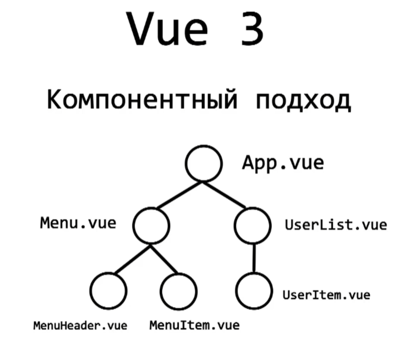

Так же вью решает проблему реактивности в веб-приложениях. При обычном подходе, страница не знает, что у неё изменилось значение какого-либо элемента

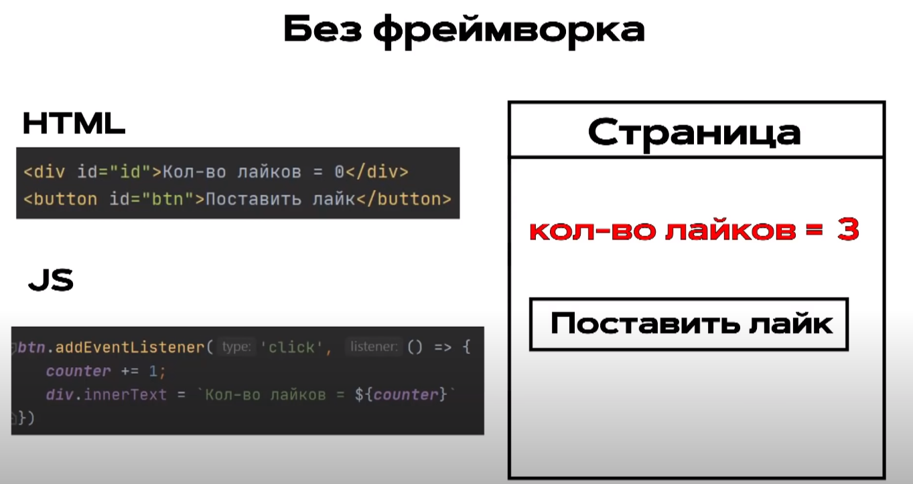

При использовании вью, мы создаём модели, которые представляют собой данные, которые мы можем изменять в шаблонах

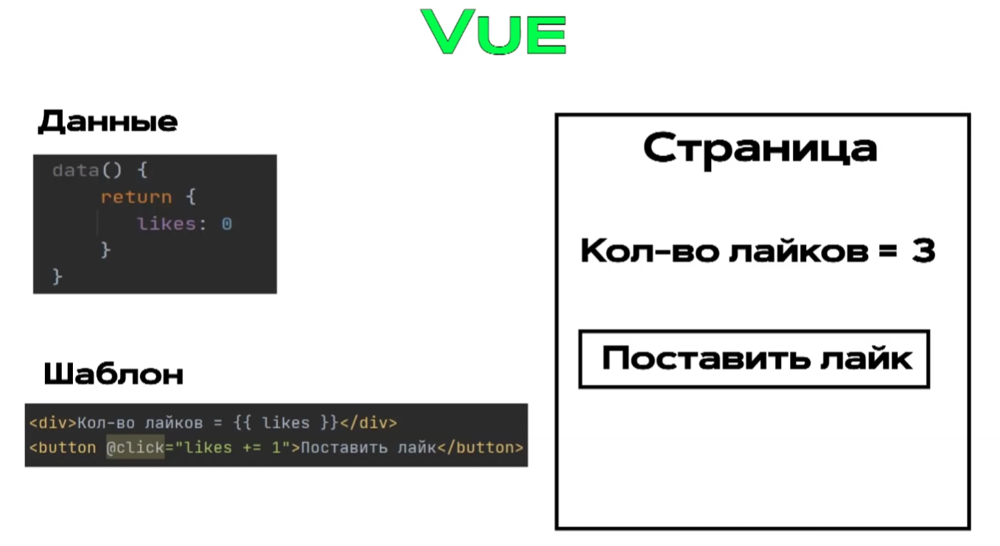

Те данные, которые мы описываем под изменения, называются моделями. Под капотом они оборачиваются в прокси, который срабатывает на получение и установку модели и тем самым срабатывает рендер

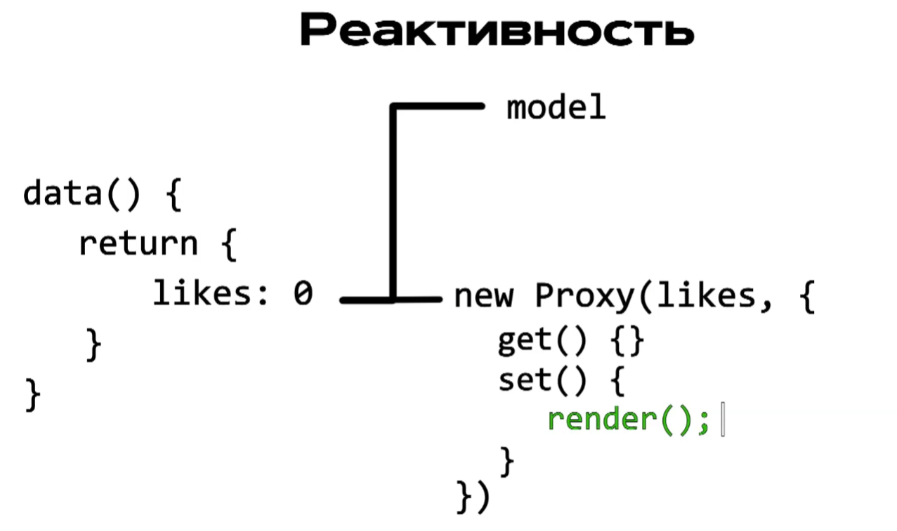

## Начало разработки. Создание проекта

Устанавливаем CLI от Vue и создаём с его помощью проект

```bash
npm i -g @vue/cli
vue create <project>
```

И таким образом будет выглядеть стоковый проект

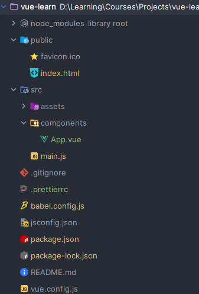

## Компонент App

В основном файле JS мы подключаем корневой компонент, в который и будут складываться все компоненты

`src > main.js`
```JS
import { createApp } from 'vue';
import App from './components/App.vue';

createApp(App).mount('#app');
```

И таким образом выглядит стоковый компонент vue:
- `template` - шаблон компонента
- `script` - скрипты компонента
- `style` - стили компонента

`src > components > App.vue`
```vue
// Single File Component

<template>
	<!-- HTML code -->
</template>

<script setup>
	// JS code
</script>

<style scoped>
	/* CSS code */
</style>
```

## Интерполяция

Внутрь двойных скобок `{{ переменная }}` мы можем помещать переменные из `this` скоупа

`src > components > App.vue`
```vue
<template>
	<div>
		<h2>Количество лайков {{ likes }}</h2>
		<button>+</button>
	</div>
</template>

<script>
export default {
	data() {
		return {
			likes: 0,
		};
	},
};
</script>

<style>
h1 {
	font-family: Montserrat, sans-serif;
}
</style>
```

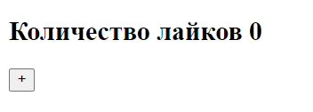

## Methods. V-ON. Слушатели событий

Из скрипта мы можем экспортировать методы, которые будем использовать внутри событий вёрстки. Чтобы подключить события вью, мы можем воспользоваться конструкцией `v-on:` или его аналогом `@`

`src > components > App.vue`
```vue
<template>
	<div>
		<h2>Лайки {{ likes }}</h2>
		<h2>Дизлайки {{ dislikes }}</h2>
		<div>
			<button v-on:click="addLike">+</button>
			<button @click="addDislike">-</button>
		</div>
	</div>
</template>

<script>
export default {
	data() {
		return {
			likes: 0,
			dislikes: 0,
		};
	},
	methods: {
		addLike() {
			this.likes += 1;
		},
		addDislike() {
			this.dislikes += 1;
		},
	},
};
</script>

<style>
h1 {
	font-family: Montserratm, sans-serif;
}
</style>
```

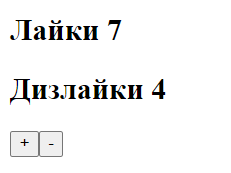

## Vue devtools. Инструменты разработчика

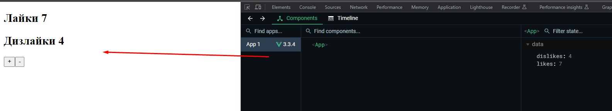

## Cтили

Флаг `scoped` говорит нам о том, что стили будут сохраняться в одном компоненте и не будут уходить в глобалку

```vue
<template>
	<div class="post">
		<div><strong>Название</strong> JavaScript</div>
		<div><strong>Описание</strong> JS - универсальный язык</div>
	</div>
	<div class="post">
		<div><strong>Название</strong> JavaScript</div>
		<div><strong>Описание</strong> JS - универсальный язык</div>
	</div>
</template>

<script>
export default {
	data() {
		return {
			likes: 0,
			dislikes: 0,
		};
	},
	methods: {
		addLike() {
			this.likes += 1;
		},
		addDislike() {
			this.dislikes += 1;
		},
	},
};
</script>

<style scoped>
* {
	margin: 0;
	padding: 0;
	box-sizing: border-box;
	font-family: Montserratm, sans-serif;
}

.post {
	padding: 15px;
	margin-top: 15px;

	border: 2px solid #8951fd;
}
</style>
```

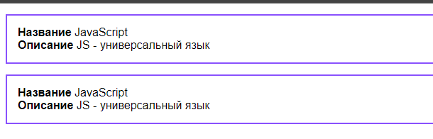

## Отрисовка в цикле. Директива V-FOR

Для создания итерируемой конструкции для перебора имеющихся данных во вью существует две директивы:
- `v-for` - в ней мы указываем, перебор какого массива будет
- `v-bind:key` - присваиваем ключ для каждого элемента перебора

```vue
<template>
	<div class="post" v-for="post in posts" v-bind:key="post.id">
		<div><strong>Название</strong> {{ post.title }}</div>
		<div><strong>Описание</strong> {{ post.body }}</div>
	</div>
</template>

<script>
export default {
	data() {
		return {
			posts: [
				{ id: 1, title: 'JavaScript', body: 'JS - is universal language' },
				{ id: 2, title: 'C#', body: 'C# - is beautiful language' },
				{ id: 3, title: 'Java', body: 'Java - is banking language' },
			],
		};
	},
	methods: {},
};
</script>

<style>
* {
	margin: 0;
	padding: 0;
	box-sizing: border-box;
	font-family: Montserratm, sans-serif;
}

.post {
	padding: 15px;
	margin-top: 15px;

	border: 2px solid #8951fd;
}
</style>
```

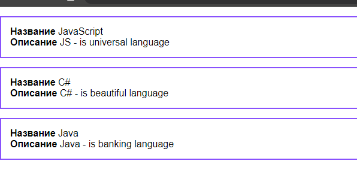

## Двустороннее связывание

Для реализации добавления поста на страницу, нужно сначала реализовать двусторонне связывание, которое позволит синхронизировать данные из инпутов с данными компонента

Конкретно для связывания данных во вью используется `v-bind`, который привязывает одни данные под другие

И так же нам нужен будет атрибут `@input`, который хранит в себе метод присвоения определённых данных из формы на странице к форме вью (он будет передавать наши введённые данные в данные компонента)

```vue
<template>
	<div class="app">
		<form action="">
			<h4>Создать пост</h4>
			<input
				v-bind:value="title"
				@input="inputTitle"
				type="text"
				class="input"
				placeholder="название"
			/>
			<input
				v-bind:value="body"
				@input="inputBody"
				type="text"
				class="input"
				placeholder="описание"
			/>
			<button @click="createPost">Добавить</button>
		</form>
		<div class="post" v-for="post in posts" v-bind:key="post.id">
			<div><strong>Название</strong> {{ post.title }}</div>
			<div><strong>Описание</strong> {{ post.body }}</div>
		</div>
	</div>
</template>

<script>
export default {
	data() {
		return {
			posts: [
				{ id: 1, title: 'JavaScript', body: 'JS - is universal language' },
				{ id: 2, title: 'C#', body: 'C# - is beautiful language' },
				{ id: 3, title: 'Java', body: 'Java - is banking language' },
			],
			title: '',
			body: '',
		};
	},
	methods: {
		createPost() {},
		inputTitle(event) {
			this.title = event.target.value;
		},
		inputBody(event) {
			this.body = event.target.value;
		},
	},
};
</script>
```

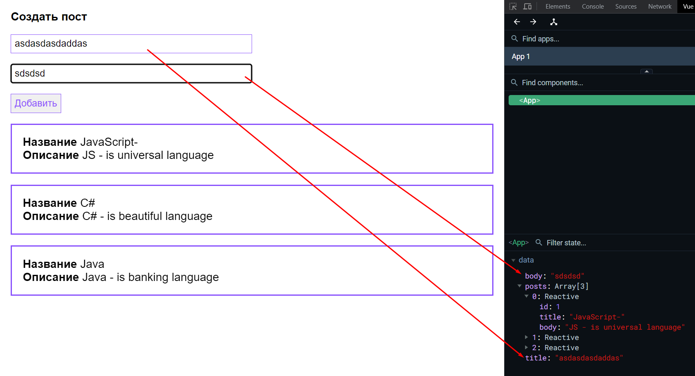

Так же можно сократить запись и вместо отдельного метода просто указать, что мы приравниваем нужное нам значение к зарезервированному ивенту `$event.target.value` 

```vue
<template>
	<div class="app">
		<form action="">
			<h4>Создать пост</h4>
			<input
				v-bind:value="title"
				@input="title = $event.target.value"
				type="text"
				class="input"
				placeholder="название"
			/>
			<input
				v-bind:value="body"
				@input="body = $event.target.value"
				type="text"
				class="input"
				placeholder="описание"
			/>
			<button @click="createPost">Добавить</button>
		</form>
		<div class="post" v-for="post in posts" v-bind:key="post.id">
			<div><strong>Название</strong> {{ post.title }}</div>
			<div><strong>Описание</strong> {{ post.body }}</div>
		</div>
	</div>
</template>

<script>
export default {
	data() {
		return {
			posts: [
				{ id: 1, title: 'JavaScript', body: 'JS - is universal language' },
				{ id: 2, title: 'C#', body: 'C# - is beautiful language' },
				{ id: 3, title: 'Java', body: 'Java - is banking language' },
			],
			title: '',
			body: '',
		};
	},
	methods: {
		createPost() {},
	},
};
</script>
```

## Модификаторы stop, prevent

Далее реализуем метод `createPost`, через который будем добавлять новые посты. Но тут встаёт проблема, что страница перезагружается при отправке формы. 

Чтобы исправить вышеописанную проблему, можно передать в функцию `event` и прописать `stopPropagation` или `preventDefault`, но вью предоставляет модификатор `@submit`, который в себе имеет `prevent`, останавливающий выполнение ивентов при сабмите формы

```vue
<template>
	<div class="app">
		<form action="" @submit.prevent>
			<h4>Создать пост</h4>
			<input
				v-bind:value="title"
				@input="title = $event.target.value"
				type="text"
				class="input"
				placeholder="название"
			/>
			<input
				v-bind:value="body"
				@input="body = $event.target.value"
				type="text"
				class="input"
				placeholder="описание"
			/>
			<button @click="createPost">Добавить</button>
		</form>
		<div class="post" v-for="post in posts" v-bind:key="post.id">
			<div><strong>Название</strong> {{ post.title }}</div>
			<div><strong>Описание</strong> {{ post.body }}</div>
		</div>
	</div>
</template>

<script>
export default {
	data() {
		return {
			posts: [
				{ id: 1, title: 'JavaScript', body: 'JS - is universal language' },
				{ id: 2, title: 'C#', body: 'C# - is beautiful language' },
				{ id: 3, title: 'Java', body: 'Java - is banking language' },
			],
			title: '',
			body: '',
		};
	},
	methods: {
		createPost(event) {
			const newPost = {
				id: Date.now(),
				title: this.title,
				body: this.body,
			};

			this.posts.push(newPost);

			this.title = '';
			this.body = '';
		},
	},
};
</script>
```

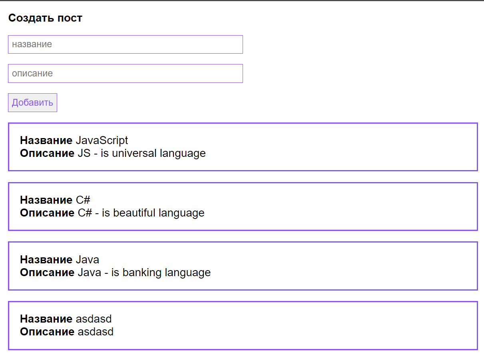

## Декомпозиция. Создаем переиспользуемые компоненты. Props. Передаем данные в компонент

Первым делом вынесем список постов. Он должен будет извне принимать список постов. Чтобы указать принимаемые пропсы в компонент, нужно указать внутрь `props` нужное значение, прописать его типы и указать обязателен ли этот пропс 

`PostList.vue`
```vue
<template>
	<div class="post" v-for="post in posts" v-bind:key="post.id">
		<div><strong>Название</strong> {{ post.title }}</div>
		<div><strong>Описание</strong> {{ post.body }}</div>
	</div>
</template>

<script>
export default {
	props: {
		posts: {
			type: Array,
			required: true,
		},
	},
};
</script>

<style scoped>
.post {
	padding: 15px;
	margin-top: 15px;

	border: 2px solid #8951fd;
}
</style>
```

Компонент формы, который пока не может создавать новые посты

`PostForm.vue`
```vue
<template>
	<form action="" @submit.prevent>
		<h4>Создать пост</h4>
		<input
			v-bind:value="post.title"
			@input="post.title = $event.target.value"
			type="text"
			class="input"
			placeholder="название"
		/>
		<input
			v-bind:value="post.body"
			@input="post.body = $event.target.value"
			type="text"
			class="input"
			placeholder="описание"
		/>
		<button>Добавить</button>
	</form>
</template>

<script>
export default {
	data() {
		return {
			post: {
				title: '',
				body: '',
			},
		};
	},
};
</script>

<style scoped>
.input {
	display: flex;

	width: 50%;

	padding: 5px;
	margin: 15px 0;

	border: 1px solid #8951fd;
}
</style>
```

И теперь, чтобы подключить дочерние компоненты в целевой, нужно:
1) Импортировать нужные компоненты в скриптах
2) Проинициализировать их в блоке `components`
3) Добавить их в в сам компонент в темплейте

Чтобы передать пропсы внутрь компонента, нужно через `v-bind` прописать те пропсы, которые принимает компонент и указать объект с пропсами.
Так же, чтобы кратко записать биндинг достаточно написать вместо `v-bind` просто "`:`"

`App.vue`
```vue
<template>
	<div class="app">
		<post-form />
		<post-list :posts="posts" />
	</div>
</template>

<script>
import PostList from '@/components/PostList.vue';
import PostForm from '@/components/PostForm.vue';

export default {
	components: {
		PostForm,
		PostList,
	},
	data() {
		return {
			posts: [
				{ id: 1, title: 'JavaScript', body: 'JS - is universal language' },
				{ id: 2, title: 'C#', body: 'C# - is beautiful language' },
				{ id: 3, title: 'Java', body: 'Java - is banking language' },
			],
		};
	},
};
</script>

<style>
* {
	margin: 0;
	padding: 0;
	box-sizing: border-box;
	font-family: Montserratm, sans-serif;
}

.app {
	padding: 15px;
}

button {
	padding: 5px;

	color: #8951fd;

	border: 1px solid #8951fd;
}
</style>
```

> [!warning] Пропсы изменять в дочернем компоненте нельзя. Нужно их изменять в родительском и передавать в готовом виде уже в дочерний!

## V-MODEL

Стандартное двусторонне связывание предусматривает под собой написание правильных событий и атрибутов и постоянное повторение данной записи. 

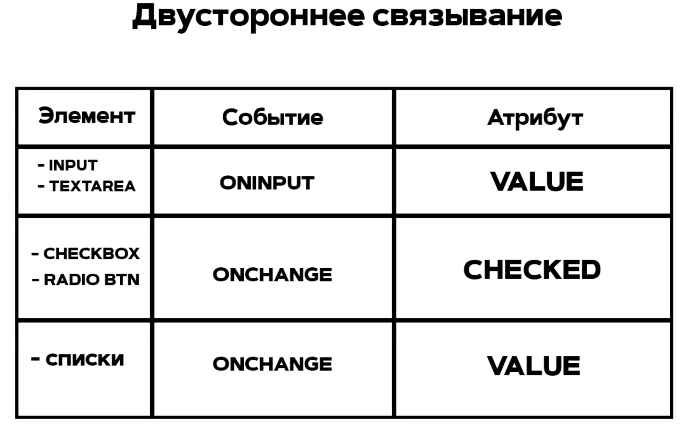

Можно упростить связывание через указание простого атрибута `v-model`, который за нас реализует указание правильных событий, атрибутов, функций присвоения значений.

Так же далее создадим заново функцию создания поста. 

Сейчас перед нами встаёт задача передачи данных для создания нового поста в компонент со списком постов

`PostList.vue`
```vue
<template>
	<form action="" @submit.prevent>
		<h4>Создать пост</h4>
		<input 
			v-model="post.title" 
			type="text" 
			class="input" 
			placeholder="название" 
		/>
		<input 
			v-model="post.body" 
			type="text" 
			class="input" 
			placeholder="описание" 
		/>
		<button @click="createPost">Добавить</button>
	</form>
</template>

<script>
export default {
	data() {
		return {
			post: {
				title: '',
				body: '',
			},
		};
	},
	methods: {
		createPost() {
			this.post.id = Date.now();

			this.posts.push(newPost);

			this.title = '';
			this.body = '';
		},
	},
};
</script>

<style scoped>
.input {
	display: flex;

	width: 50%;

	padding: 5px;
	margin: 15px 0;

	border: 1px solid #8951fd;
}
</style>
```

## $emit. Обмен данными между дочерним и родительским компонентом

Передать данные от ребёнка к родителю напрямую - не получится. Чтобы совершить данное действие придётся воспользоваться событием, на которое нужно будет подписать родителя, чтобы тот получил данные из ребёнка.

Для этого нужно будет воспользоваться `$emit`. В него мы передаём название события первым аргументом, а последующими передаём данные, которые попадут в функцию, которая будет подписана на данное событие

В форме постов мы создаём метод `createPost` внутри которого эмитим ивент, в который передаём новый пост, а так же ещё несколько пропсов для примера.

`PostForm.vue`
```vue
<template>
	<form action="" @submit.prevent>
		<h4>Создать пост</h4>
		<input v-model="post.title" type="text" class="input" placeholder="название" />
		<input v-model="post.body" type="text" class="input" placeholder="описание" />
		<button @click="createPost">Добавить</button>
	</form>
</template>

<script>
export default {
	data() {
		return {
			post: {
				title: '',
				body: '',
			},
		};
	},
	methods: {
		createPost() {
			this.post.id = Date.now();

			this.$emit('create', this.post, 'second', 'third');

			this.post = {
				title: '',
				body: '',
			};
		},
	},
};
</script>
```

Чтобы воспользоваться ивентом, нужно:
- На компонент, который эмитит событие, нужно навесить атрибут `@имя_события = функция_которая_примет_пропсы`
- В родительском компоненте создаём метод, который уже из описанного в темплейте события будет принимать пропсы

`App.vue`
```vue
<template>
	<div class="app">
		<post-form @create="createPost" />
		<post-list :posts="posts" />
	</div>
</template>

<script>
import PostList from '@/components/PostList.vue';
import PostForm from '@/components/PostForm.vue';

export default {
	components: {
		PostForm,
		PostList,
	},
	data() {
		return {
			posts: [
				{ id: 1, title: 'JavaScript', body: 'JS - is universal language' },
				{ id: 2, title: 'C#', body: 'C# - is beautiful language' },
				{ id: 3, title: 'Java', body: 'Java - is banking language' },
			],
		};
	},
	methods: {
		createPost(post, second, third) {
			console.log(second);
			console.log(third);
			this.posts.push(post);
		},
	},
};
</script>
```

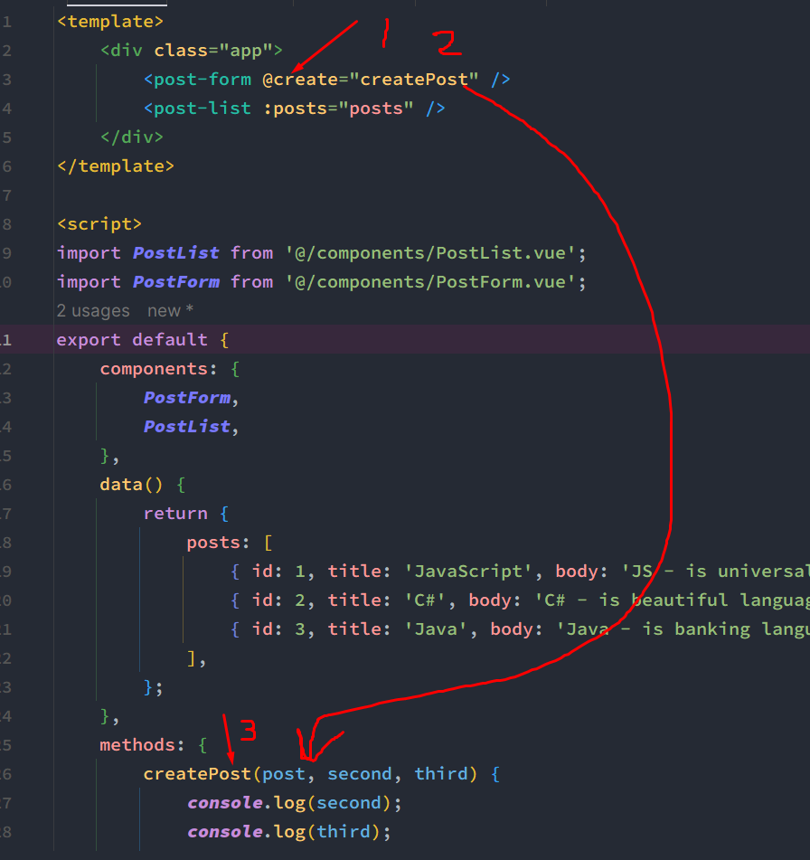

И далее стоит разбить пост в отдельный компонент, а список постов в другой

`PostItem.vue`
```vue
<template>
	<div class="post">
		<div>
			<div><strong>Название</strong> {{ post.title }}</div>
			<div><strong>Описание</strong> {{ post.body }}</div>
		</div>
		<div class="post__buttons">
			<button>Удалить</button>
		</div>
	</div>
</template>

<script>
export default {
	props: {
		post: {
			type: Object,
			required: true,
		},
	},
};
</script>

<style scoped>
.post {
	display: flex;
	align-items: center;
	justify-content: space-between;

	padding: 15px;
	margin-top: 15px;

	border: 2px solid #8951fd;
}
</style>
```
`PostList.vue`
```vue
<template>
	<div>
		<h2>Список постов</h2>
		<post-item v-for="post in posts" :key="post.id" :post="post" />
	</div>
</template>

<script>
import PostItem from '@/components/PostItem.vue';

export default {
	components: {
		PostItem,
	},
	props: {
		posts: {
			type: Array,
			required: true,
		},
	},
};
</script>

<style scoped></style>
```

## Библиотека UI компонентов

Если мы хотим создать компонент, внутрь которого можно будет поместить какой-либо текст, то нам нужно будет вложить в него тег `slot`, который означает, что все вложенные внутрь компонента элементы будут помещаться в данном месте

`components > ui > UiButton.vue`
```vue
<template>
	<button>
		<slot></slot>
	</button>
</template>

<script>
export default {};
</script>

<style scoped>
button {
	padding: 5px;

	color: #8951fd;

	border: 1px solid #8951fd;

	background: none;

	cursor: pointer;
}
</style>
```

Так же нужно упомянуть, что все стили и классы, которые мы помещаем в компонент, применяются на корневой элемент внутри компонента 

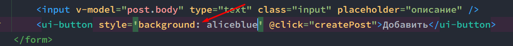

## Глобальная регистрация компонента

Чтобы не импортировать каждый раз компонент UI в другие компоненты, можно глобально зарегистрировать компонент

Для этого нужно сначала дать имя самому компоненту

`components > ui > UiButton.vue
```vue
<template>
	<button>
		<slot></slot>
	</button>
</template>

<script>
export default {
	name: 'ui-button',
};
</script>
```

Далее нужно экспортировать массив компонентов

`components > ui > index.js`
```JS
import UiButton from '@/components/ui/UiButton.vue';

export default [UiButton];
```

И уже затем нужно глобально к приложению эти компоненты подцепить через итерацию массива

`src > main.js`
```JS
import { createApp } from 'vue';
import App from './components/App.vue';
import components from '@/components/ui';

const app = createApp(App);

components.forEach((component) => {
	app.component(component.name, component);
});

app.mount('#app');
```

И теперь можно спокойно использовать компонент в приложении без импорта его во все файлы

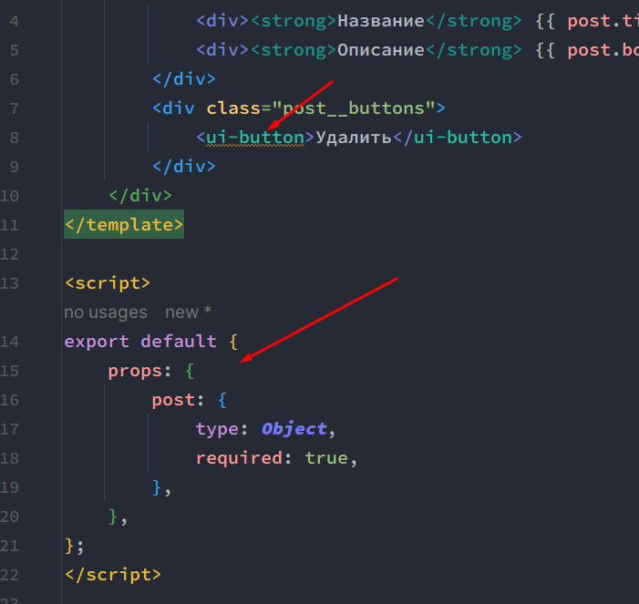

## Подробно о V-MODEL

Во второй версии Vue на весь компонент распространялся только один `v-model`. В третьей версии мы можем указать конкретно к чему мы хотим указать двусторонне связывание. Однако, если мы не укажем с чем мы хотим связать значения, то по умолчанию связывание будет с пропсом `modelValue` компонента

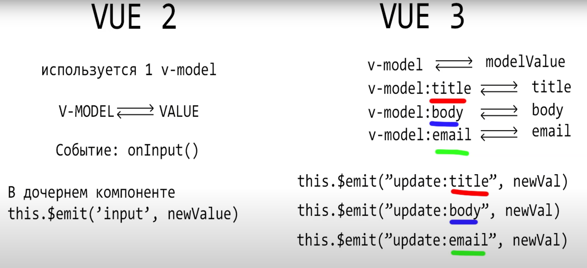
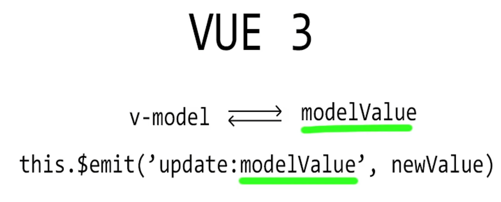

Чтобы реализовать связывание по стандартному `modelValue` без указания конкретного значения через атрибут, мы можем написать такой код и сбиндить значение инпута со значением модели через событие, которое будет срабатывать на `update`

`components > ui > UiInput.vue`
```vue
<template>
	<input 
		:value="modelValue" // 1
		@input="updateInput" // 2
		class="input" type="text" 
	/>
</template>

<script>
export default {
	name: 'ui-input',
	props: {
		modelValue: [String, Number], // 3
	},
	methods: {
		updateInput(event) {
			this.$emit('update:modelValue', event.target.value); // 4
		},
	},
};
</script>
```

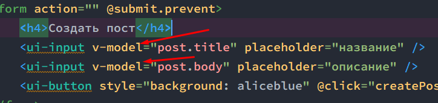

Если мы хотим своё кастомное значение, то мы можем указать своё кастомное значение для связывания нашего кастомного компонента инпута 

`components > ui > UiInput.vue
```vue
<template>
	<input :value="value" @input="updateInput" class="input" type="text" />
</template>

<script>
export default {
	name: 'ui-input',
	props: {
		value: [String, Number],
	},
	methods: {
		updateInput(event) {
			this.$emit('update:value', event.target.value);
		},
	},
};
</script>
```
И при указании модели, нужно будет дополнить связывание атрибутом `value` 
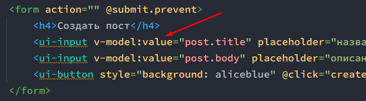

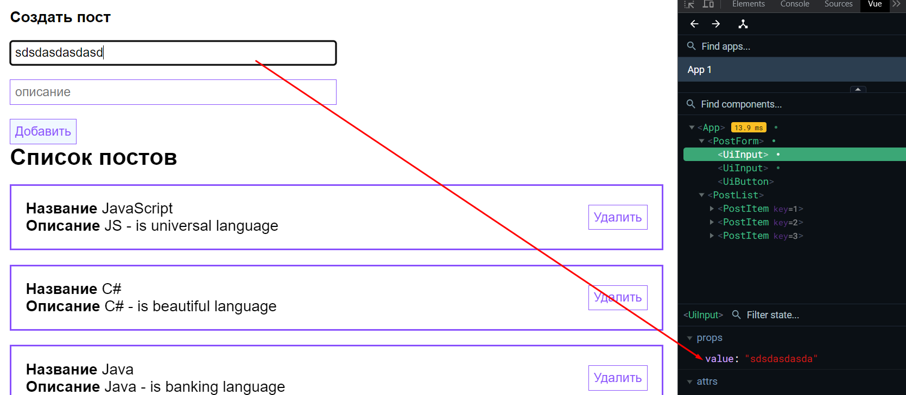

##  Удаление поста. Ключи KEY в цикле

Чтобы реализовать возможность удаления поста, нам нужно заэмиттить событие, которое будет возвращать пост наверх из самого элемента поста по клику на кнопку удаления поста

`PostItem.vue`
```vue
<template>
	<div class="post">
		<div>
			<div><strong>Название</strong> {{ post.title }}</div>
			<div><strong>Описание</strong> {{ post.body }}</div>
		</div>
		<div class="post__buttons">
			<ui-button @click="$emit('remove', post)">Удалить</ui-button>
		</div>
	</div>
</template>
```

И далее мы принимаем из события `remove` пост и заново его передаём вверх

`PostList.vue`
```vue
<template>
	<div>
		<h2>Список постов</h2>
		<post-item
			v-for="post in posts"
			:key="post.id"
			:post="post"
			@remove="$emit('remove', post)"
		/>
	</div>
</template>
```

Теперь мы можем в родительском компоненте затриггерить функцию удаления поста, в которую сразу попадёт пропс с постом и позволит отрисовать новый массив постов без поста с определённым `id` 

`App.vue`
```vue
<template>
	<div class="app">
		<post-form @create="createPost" />
		<post-list :posts="posts" @remove="removePost" />
	</div>
</template>

<script>
import PostList from '@/components/PostList.vue';
import PostForm from '@/components/PostForm.vue';
export default {
	components: {
		PostForm,
		PostList,
	},
	data() {
		return {
			posts: [
				{ id: 1, title: 'JavaScript', body: 'JS - is universal language' },
				{ id: 2, title: 'C#', body: 'C# - is beautiful language' },
				{ id: 3, title: 'Java', body: 'Java - is banking language' },
			],
		};
	},
	methods: {
		createPost(post, second, third) {
			console.log(second);
			console.log(third);
			this.posts.push(post);
		},
		removePost(post) {
			this.posts = this.posts.filter((p) => p.id !== post.id);
		},
	},
};
</script>
```

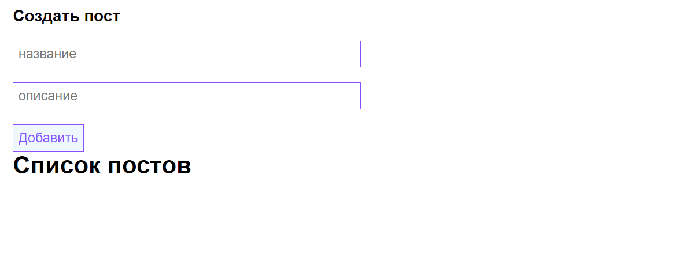

##  Отрисовка по условию

Для отрисовки определённых блоков по условию у нас есть три разных атрибута:
- `v-if `- отрендерит, если условие будет удовлетворено
- `v-else-if`
- `v-else` - отрендерит, если прошлое условие не будет удовлетворено

Эти атрибуты вставляют нужный код, если он будет соответствовать условию.

`PostList.vue`
```vue
<template>
	<div v-if="posts.length !== 0">
		<h2>Список постов</h2>
		<post-item
			v-for="post in posts"
			:key="post.id"
			:post="post"
			@remove="$emit('remove', post)"
		/>
	</div>
	<div v-else-if="posts.length === 0">
		<h2>Постов нет</h2>
	</div>
	<div v-else>
		<h2>Произошла ошибка</h2>
	</div>
</template>
```

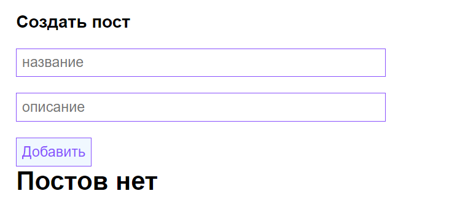

Так же у нас есть атрибут, который просто скрывает элемент, если он не соответствует условию - `v-show`

`PostList.vue`
```vue
<template>
	<div v-show="posts.length !== 0">
		<h2>Список постов</h2>
		<post-item
			v-for="post in posts"
			:key="post.id"
			:post="post"
			@remove="$emit('remove', post)"
		/>
	</div>
	<div v-show="posts.length === 0">
		<h2>Постов нет</h2>
	</div>
</template>
```

##  Модальное окно

Само модальное окно. Мы его отображаем, если пропс `show` будет `true`. Скрывать модальное окно мы будем через поднятие состояния вверх через эмиттер. 

`components > ui > ModalWindow.vue`
```vue
<template>
	<div class="modal" v-if="show" @click="hideDialog">
		<div class="modal__content" @click.stop>
			<slot></slot>
		</div>
	</div>
</template>

<script>
export default {
	name: 'modal-window',
	props: {
		show: {
			type: Boolean,
			default: false,
		},
	},
	methods: {
		hideDialog() {
			this.$emit('update:show', false);
		},
	},
};
</script>

<style scoped>
.modal {
	position: fixed;
	top: 0;
	bottom: 0;
	right: 0;
	left: 0;

	display: flex;

	background: rgba(0, 0, 0, 0.5);
}

.modal__content {
	min-height: 100px;
	min-width: 300px;

	margin: auto;
	padding: 20px;

	background: white;

	border-radius: 12px;
}
</style>
```

В родительском компоненте отображать модалку будем через использование функции `showDialog` и пропса `show`, который двусторонне связываем и передаём локальное значение `dialogVisible`

`App.vue`
```vue
<template>
	<div class="app">
		<ui-button @click="showDialog">Добавить пост</ui-button>
		<modal-window v-model:show="dialogVisible">
			<post-form @create="createPost" />
		</modal-window>
		<post-list :posts="posts" @remove="removePost" />
	</div>
</template>

<script>
import PostList from '@/components/PostList.vue';
import PostForm from '@/components/PostForm.vue';
import UiButton from '@/components/ui/UiButton.vue';
export default {
	components: {
		UiButton,
		PostForm,
		PostList,
	},
	data() {
		return {
			posts: [
				{ id: 1, title: 'JavaScript', body: 'JS - is universal language' },
				{ id: 2, title: 'C#', body: 'C# - is beautiful language' },
				{ id: 3, title: 'Java', body: 'Java - is banking language' },
			],
			dialogVisible: false,
		};
	},
	methods: {
		createPost(post, second, third) {
			console.log(second);
			console.log(third);
			this.posts.push(post);
		},
		removePost(post) {
			this.posts = this.posts.filter((p) => p.id !== post.id);
		},
		showDialog() {
			this.dialogVisible = true;
		},
	},
};
</script>
```

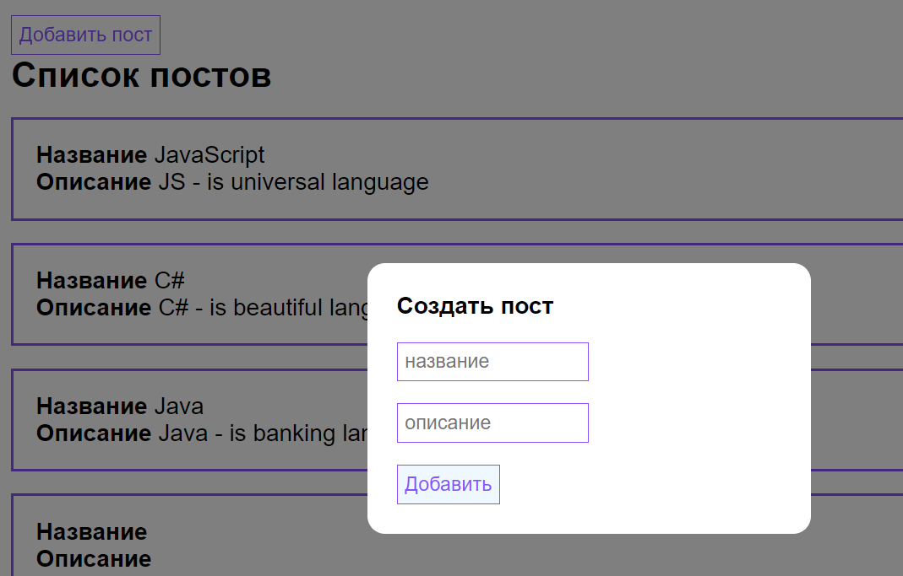

##  Модификаторы V-MODEL

Модификаторы добавляются через точку и модифицируют конечную функциональность `v-model.trim.number`. `trim` срезает пробелы, а `number` переводит значение сразу к числу

`App.vue`
```vue
<template>  
    <div class="app">  
       <h1>Страница с постами</h1>  
       <input type="text" v-model.trim.number="modificatorValue" />  
       <ui-button style="margin: 15px 0" @click="showDialog">Добавить пост</ui-button>  
       <modal-window v-model:show="dialogVisible">  
          <post-form @create="createPost" />  
       </modal-window>  
       <post-list :posts="posts" @remove="removePost" />  
    </div>  
</template>  
  
<script>  
import PostList from '@/components/PostList.vue';  
import PostForm from '@/components/PostForm.vue';  
import UiButton from '@/components/ui/UiButton.vue';  
export default {  
    components: {  
       UiButton,  
       PostForm,  
       PostList,  
    },  
    data() {  
       return {  
          posts: [  
             { id: 1, title: 'JavaScript', body: 'JS - is universal language' },  
             { id: 2, title: 'C#', body: 'C# - is beautiful language' },  
             { id: 3, title: 'Java', body: 'Java - is banking language' },  
          ],  
          dialogVisible: false,  
          modificatorValue: '',  
       };  
    },  
    methods: {  
       createPost(post, second, third) {  
          console.log(second);  
          console.log(third);  
          this.posts.push(post);  
       },  
       removePost(post) {  
          this.posts = this.posts.filter((p) => p.id !== post.id);  
       },  
       showDialog() {  
          this.dialogVisible = true;  
       },  
    },  
};  
</script>
```

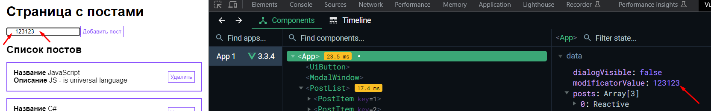


##  Работа с сервером. Получаем посты. Axios

Добавляем метод `fetchPosts`, который будет срабатывать при нажатии кнопки. Все полученные данные с сервера будут сразу заноситься в свойство `posts`

`App.vue`
```vue
<template>
	<div class="app">
		<h1>Страница с постами</h1>
		<ui-button @click="fetchPosts">Получить посты</ui-button>
		<ui-button style="margin: 15px 0" @click="showDialog">Добавить пост</ui-button>
		<modal-window v-model:show="dialogVisible">
			<post-form @create="createPost" />
		</modal-window>
		<post-list :posts="posts" @remove="removePost" />
	</div>
</template>

<script>
import PostList from '@/components/PostList.vue';
import PostForm from '@/components/PostForm.vue';
import UiButton from '@/components/ui/UiButton.vue';
import axios from 'axios';
export default {
	components: {
		UiButton,
		PostForm,
		PostList,
	},
	data() {
		return {
			posts: [],
			dialogVisible: false,
		};
	},
	methods: {
		createPost(post, second, third) {
			console.log(second);
			console.log(third);
			this.posts.push(post);
		},
		removePost(post) {
			this.posts = this.posts.filter((p) => p.id !== post.id);
		},
		showDialog() {
			this.dialogVisible = true;
		},
		async fetchPosts() {
			try {
				const { data } = await axios.get(
					'https://jsonplaceholder.typicode.com/posts?_limit=10',
				);
				this.posts = data;
			} catch (e) {
				throw new Error(e);
			}
		},
	},
};
</script>
```

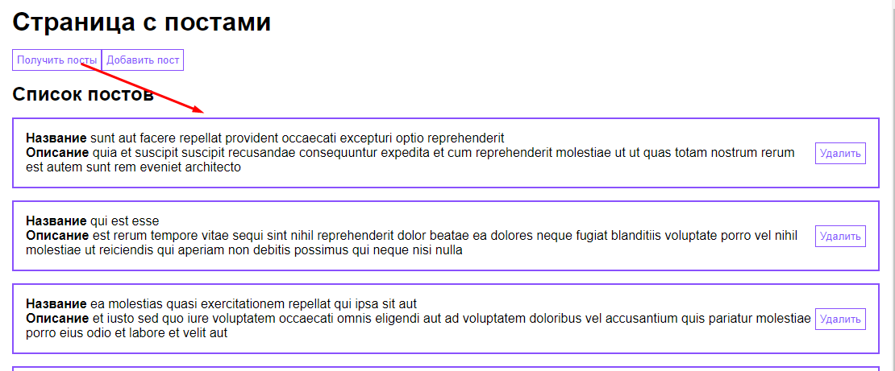

##  Жизненный цикл компонента

У нас есть достаточное количество различных хуков, которые работают на протяжении всего цикла существования vue-компонента:
- `beforeCreate` - вызывается перед созданием компонента. То есть тут ещё не инициализировались события и жизненный цикл
- `created` - тут уже стоит вызывать условия на проверки и что-то инициализировать. В этот момент в компонент добавляются инъекции и реактивность
- `beforeMount` - отрабатывает до того, как элемент встроится в дом-дерево
- `mounted` - отработает после встраивания
- `beforeUpdate` - до обновления
- `updated` - выполняется после обновления компонента
- `beforeDestroy` - до уничтожения компонента
- `destroyed` - после его уничтожения из дом-дерева

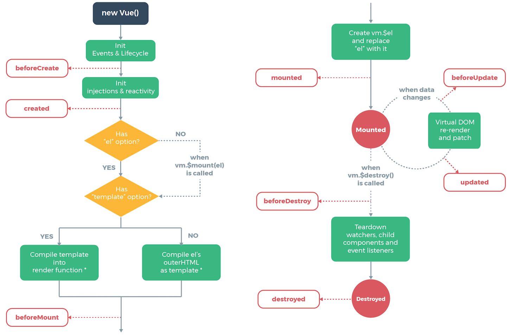

##  Индикатор загрузки данных

Первым делом нужно вызывать загрузку постов в хуке `mounted`, который при монтировке компонента подгрузит нужные данные

Далее зададим поле `isPostsLoading`, которое будем менять внутри функции `fetchPosts`. Данное поле будет использоваться для условия отображения 

`App.vue`
```vue
<template>
	<div class="app">
		<h1>Страница с постами</h1>
		<ui-button style="margin: 15px 0" @click="showDialog">Добавить пост</ui-button>
		<modal-window v-model:show="dialogVisible">
			<post-form @create="createPost" />
		</modal-window>
		<post-list :posts="posts" @remove="removePost" v-if="!isPostsLoading" />
		<div v-else>Идёт загрузка...</div>
	</div>
</template>

<script>
import PostList from '@/components/PostList.vue';
import PostForm from '@/components/PostForm.vue';
import axios from 'axios';
export default {
	components: {
		PostForm,
		PostList,
	},
	data() {
		return {
			posts: [],
			dialogVisible: false,
			isPostsLoading: false,
		};
	},
	methods: {
		createPost(post, second, third) {
			console.log(second);
			console.log(third);
			this.posts.push(post);
		},
		removePost(post) {
			this.posts = this.posts.filter((p) => p.id !== post.id);
		},
		showDialog() {
			this.dialogVisible = true;
		},
		async fetchPosts() {
			try {
				this.isPostsLoading = true;

				const { data } = await axios.get(
					'https://jsonplaceholder.typicode.com/posts?_limit=10',
				);
				this.posts = data;
			} catch (e) {
				throw new Error(e);
			} finally {
				this.isPostsLoading = false;
			}
		},
	},
	mounted() {
		this.fetchPosts();
	},
};
</script>
```

##  Выпадающий список. Сортировка постов


##  Наблюдаемые WATCH и вычисляемые COMPUTED свойства


##  Анимации transition group


##  Поиск постов. Фильтрация


##  Пагинация. Постраничный вывод


##  Динамический биндинг классов и стилей


##  Динамическая пагинация. Бесконечная лента. Intersection API


##  Refs. Доступ к DOM элементу


##  VUE-ROUTER. Постраничная навигация


##  Динамическая навигация


##  Создаем собственные директивы V-INTERSACTION и V-FOCUS


##  Mixins. Примеси


##  Vuex. Глобальное состояние приложения


##  Composition API


# Pina


# Nuxt


