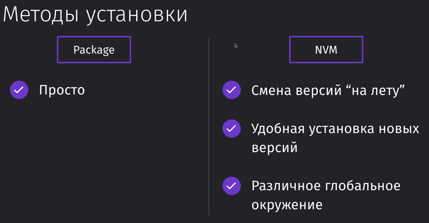

Node version manager - удобный менеджер контроля версий ноды. Поможет в любой момент заменить ноду и обновить её. 

Устанавливается [тут](https://github.com/nvm-sh/nvm?ysclid=m7jaemneke806087587).
 

После установки NVM:

`nvm install 16` – установка 16ой версии ноды
`nvm use 16` – использование 16ой версии
`node --version` – версия ноды

### Дополнительные ссылки

005 VSCode - https://code.visualstudio.com/
005 Fork - https://git-fork.com/
005 Warp - https://www.warp.dev/
005 iTerm - https://iterm2.com/
006 Node.js - https://nodejs.org/en/
006 Brew - https://brew.sh/index_ru
006 NVM-Linux-Mac - https://github.com/nvm-sh/nvm
006 NVM-Windows - https://github.com/coreybutler/nvm-windows