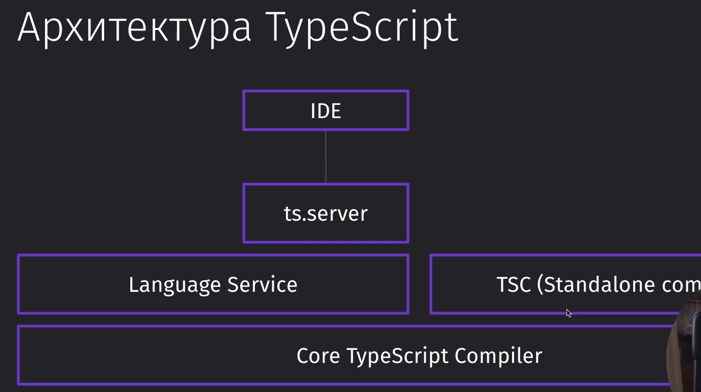
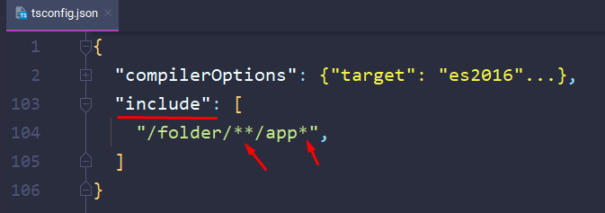
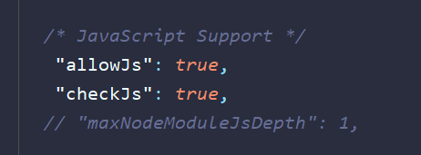
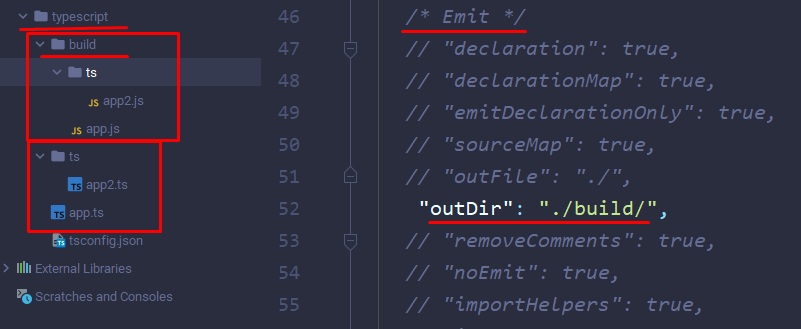
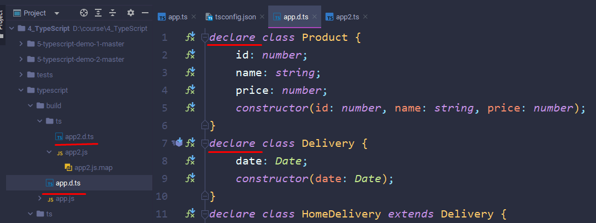
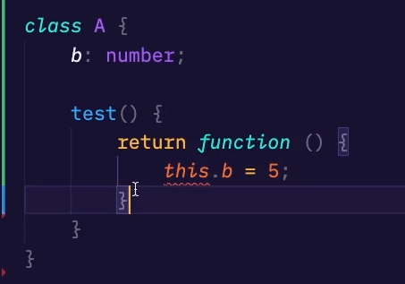
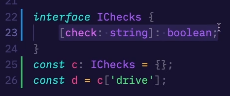

#tsconfig

### 051 Вводное видео

Сама архитектура ТС:



### 052 Включение и исключение файлов

Нужно упомянуть, что мы можем сами выбирать, какие файлы мы можем компилировать

```bash
tsc // скомпилирует весь проект
tsc имя_файла1 имя_файла2 // скомпилирует определённые файлы
```

Так же нужно упомянуть, что файл *tsconfig* - олицетворяет для ТС проект и его удаление приведёт к ошибке компиляции 

И тут уже стоит пойти про модификацию тсконфига. Первым делом нужно сказать, что внутри конфига (вне опций компилятора) мы можем определять, какие файлы будут подлежать компиляции. Свойство `files` принимает в себя массив значений, которые будем компилировать


Уже `include` поддерживает паттерны, через которые можно определить, какие файлы мы будем компилировать



`exclude` исключает из компиляции те указанные файлы в `include` и в `files`


Данный параметр позволяет нам дополнить наш основной конфиг другим *tsconfig* (дополнение и переопределение существующих параметров внешним)

```JSON
"extends": "",
```

Так же нужно упомянуть полезные параметры внутри опций компилятора. Они позволяют аккуратно переводить старый проект на нативном JS в TS и делать его проверки



### 053 Вывод компиляции

Первым делом нужно разобрать отдел `Emit` в настройках компиляции. Он отвечает за вывод компиляции

Первый параметр - `outDir`. Он определяет папку вывода компиляции. 
Уже `outFile` используют куда реже, так как те же модули не получится через него скомпилировать



```JSON
{
	"removeComments": true, // ремувнет комментарии в выводимом файле
	"noEmit": true, // позволяет проверить файлы, но не выводить их куда-либо
	"noEmitOnError": true, // запрещает компиляцию при ошибке в коде
	"importHelpers": true, // импортирует хелперы один раз для всего проекта. Позволяет уменьшить размер файла
	// Хелперы - это дополнительные функции из ТС-либы, которые выступают полифиллами между ТС и JS 
	"noEmitHelpers": true, // не компилирует хелперы ТС. 
	"importsNotUsedAsValues": "remove", // удаляет импорты типов из JS (будущая тема). Есть исключения, когда их нужно сохранить, но это бывает редко
	"sourceMap": true // связывает JS-файлы с TS файлами (генерирует вместе с обычным JS файлом ".map", который и реализует связь)
}
```


`"inlineSourceMap": true` - заменяет стоковый сурсмап на инлайновый, но уже внутри скомпилированного JS (использовать можно только прошлую настройку, либо эту - вместе они не работают)

```JS
"use strict";  
//# sourceMappingURL=data:application/json;base64,eyJ2ZXJzaW9uIjozLCJmaWxlIjoiYXBwMi5qcyIsInNvdXJjZVJvb3QiOiIiLCJzb3VyY2VzIjpbIi4uLy4uL3RzL2FwcDIudHMiXSwibmFtZXMiOltdLCJtYXBwaW5ncyI6IiJ9
```

```JSON
{
	"inlineSources": true, //  впишет вообще весь сурс-код ТС в компилируемый файл (в виде инлайн-строки). Эта настройка больше актуальна для бэка
	"sourceRoot": "",      // будет искать сурс по определённому пути
	"mapRoot": ""          // будет искать мапу по нужному пути
}
```

`"declaration": true` - создаёт файл, где будет показана декларация всех интерфейсов и классов (без определённой реализации)



`"emitDeclarationOnly": true` - компилирует только декларации ТС
`"declarationDir": "./types/"` - сохраняет декларации по определённому пути


`"stripInternal": true`- не компилирует модуль, который был помечен комментарием - `/ * @internal * / `

```TS
/* @internal */  
class Delivery {  
    constructor(  
        public date: Date  
    ) {  
    }
}
```

`"preserveConstEnums": true` - сохраняет отдельно код `enum` в виде объекта констант в JS

### 054 Язык и окружение

Блок настроек язык и окружение отвечает за общую внешнюю работу компилятора 

В таргете мы указываем в какую версию JS мы компилируем файл


Настройка `lib` хранит в себе массив тех библиотек, которые будут подключены к TS. Изначально библиотека с консолью или Math уже подключены к нашему файлу, но если нам нужно будет немного обособить среду или добавить свои полифиллы, то нам нужно будет самостоятельно подключить все нужные библиотеки к нашей среде


Ниже идут настройки непосредственно jsx компиляции ТС

```JSON
{
	"jsx": "preserve",
	"jsxFactory": "",                               
	"jsxFragmentFactory": "",                      
	"jsxImportSource": "",
	"noLib": true, // отключает все библиотеки в ТС
	"useDefineForClassFields": true // включение использования ECMAScript формата классов (эни компилируется в объект с defineProperty)
}
```

### **055 Модули**

Блок настроек *Modules* определяет как будет компилироваться проект из модулей относительно друг друга

```JSON
{
	"module": "commonjs", // способ модулирования (стандартный)
	"rootDir": "./", // расположение компиляции всего проекта
	"baseUrl": "./", // базовый url для резолва модулей. Часто комбинируется с путями
	"paths": {} // пути. Позволяют задать алиасы для путей в проектах, где используются модули и репозитории. Очень удобно использовать, чтобы не переписывать постоянно длинные пути
}
```

```JSON
"baseUrl": "./",
"paths": {  
	// ключ - алиас, значение - путь
	"@lib": ["./lib/lib-path"]  
},
```

```TS
import {} from "@lib/файл.js";
```

```JSON
{
	"rootDirs": [], //используется замен рутдира для объединения проекта в одну дирректорию
	"typeRoots": [], //ищет дополнительные типы для библиотек, которые будем устанавливать
	"resolveJsonModule": true // позволяет импортировать JSON в ТС, конвертировать его в объект и сразу с ним работать. Используется опция для работы с конфигурациями
}
```

### 056 Strict режим

```JSON
/* Type Checking */  
"strict": true, 
 "noImplicitAny": true,  
 "strictNullChecks": true, 
 "strictFunctionTypes": true,   
 "strictBindCallApply": true,  
 "strictPropertyInitialization": false,
```

```JSON
{
	"noImplicitAny": true, // запрещаем неявно задавать any (автоматическая подстановка any). Желательно  закомментировать в новых ТС проектах либо поставить true. Мы сможем как и прежде использовать any, но мы будем знать, что мы не смогли типизировать объект 
	"strictNullChecks": true // позволяет избегать неявного возвращения из функции null или undefined.
}
```


`"strictFunctionTypes": true` - проверяет вкладываемые типы в функцию
Вот пример, когда мы присваиваем функцию в определённый тайп с выключенной настройкой


А вот с включённой настройкой


`"strictBindCallApply": true` - отвечает за типизацию тех же тестов в ТС и их корректность

```TS
test.apply(undefined, [1, 3]); // Error
```

`"strictPropertyInitialization": false` - обязует инициализировать свойства классов. Обычно ставят false для использования контрактной системы и классов в качестве интерфейсов

`"noImplicitThis": true` - проверяет переменные контекста this
Конкретно в данном случае, запись функции через function() определяет контекст вызова внутри себя (свои переменные) \



`"useUnknownInCatchVariables": true` - определяет современное поведение error (он имеет тип unknown). Стоит всегда оставлять true, так как еррор приобретёт тип any. Данный тип, например, позволит обратиться error.massage, а тот, в свою очередь, не всегда будет содержать ошибку

`"alwaysStrict": true` - добавляет дирриктиву стрикта в JS  

### 057 Проверки кода

`"noUnusedLocals": true` - подсвечивает объявленные, но не прочитанные свойства (помогает избавиться от лишних переменных)
`"noUnusedParameters": true` - подсвечивает аргументы функции, которые мы не используем в самой функции

Так же у нас имеется `@ts-ignore`, который игнорирует ошибки в одной следующей строке после комментария

```TS
// @ts-ignore  
const defualtUser = new User("Defult");
```

Так же нужно упомянуть, что мы можем сократить запись конструктора и сразу создать внутреннее свойство - публичный нейм, добавить его в конструктор и присвоить при инициализации

```TS
class User {  
    name: string;  
  
    constructor(name: string) {  
        this.name = name;  
    }  
}
```

```TS
class User {  
    constructor(public name: string) {  
        this.name = name;  
    }  
}
```

Однако, если мы с настройкой `noUnusedParameters` попробуем записать приватное поле сразу в конструкторе, то опять получим ошибку (так как параметр не получится присвоить и он будет пустой)

```TS
class User {  
    constructor(private name: string) {  // Error
        this.name = name;  
    }  
}
```

`"exactOptionalPropertyTypes": true` - запрещает присваивать опциональным свойствам класса значение `undefined`


`"noFallthroughCasesInSwitch": true` - не выполняет следующий кейс, если мы не написали `break` или `return` (без настройки в данном примере выполнились бы сразу оба кейса)


`"allowUnreachableCode": true` - код, который не получится достичь и выполнить, будет подсвечиваться как недостижимый


`"noUncheckedIndexedAccess": true` - если мы будем обращаться к объекту, интерфейс которого нечётко задан, мы можем позволить себе вернуть undefined

В этот интерфейс попадает любой объект со свойством строка и значением булеан. Конкретно тут со включенной настройкой, мы получим юнион между `(boolean | undefined)`, что позволит нам избежать ошибок в коде (так как у нас нет свойства `drive` в константе `c`)



`"noPropertyAccessFromIndexSignature": true` - запрещает обращаться к несуществующему ключу объекта через точечную запись (не создаст новый ключ при обращении).
Требует использования обращения через 

```TS
c["имя_ключа"]
```

`"noImplicitOverride": true` - заставляет всегда явно задавать `override` при наследовании (стоит всегда включать)