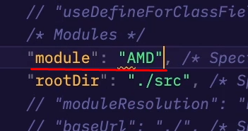
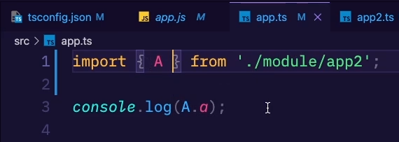
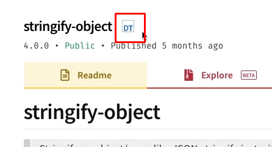
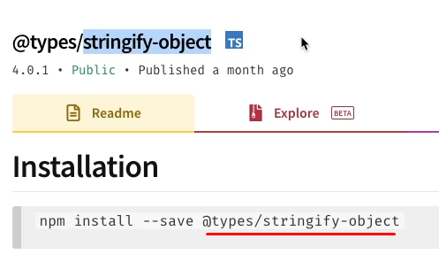

### 094 Вводное видео


### 095 Namespaces и reference

Сразу нужно сказать, что ==namespace== и ==reference== используются крайне редко. Первый могут использовать в тех же контрактах, а второй используется в том же NextJS во внутрянке фреймворка для реализации использования тайпов.
Однако пространство имён может не поддерживаться разными линтерами и паковщиками и от этого могут быть определённые проблемы.

```TS
namespace A {  
    export const a = 10;  
    export interface b {  
        c: number;  
    }  
}  
  
console.log(A.a); // 10
```

Так же есть альтернативный, старый вариант записи неймспейса (по смыслу он идентичен):

```TS
module A {  
    export const a = 10;  
    export interface b {  
        c: number;  
    }  
}  
```

Чтобы скомпилировать разные ТС файлы в один файл, нужно:




И сразу нужно сказать, что при таком подходе, мы можем писать разные модули где угодно и обращаться к ним откуда угодно, потому что мы пишем всё в "один файл" на выходе


Такой подход опасен тем, что компилятор сваливает всё в один файл и мы будем получать кашу, которая обязательно выдаст ошибку - **так делать нельзя**


Чтобы свалка не образовывалась, нужно явно указывать какой референс будет на что ссылаться. Референсы указываются в комментариях


### 096 Модульность на backend

> **Первый способ:** импорт commonjs

И вот так будет выглядеть любой импорт в ТС



Модульность CommonJS работает со стоковыми настройками:

```JSON
/* Modules */  
"module": "commonjs",

/* Emit */  
"outDir": "./build/",
```

Эта модульность генерирует старый код, который будет валиден для стандартов старее ES5


> **Второй способ**: импорт по стандарту ES6

Так же мы можем компилировать сразу в ES6 модули все наши файлы. Там уже будут работать идентичные импорты и экспорты


И вот так будет выглядеть скомпилированный JS


Так же нужно упомянуть, что мы можем написать в ТС префикс "`.js`" и ТС будет ссылаться на "`.ts`" файл, а не на JS. Сделано это для поддержки нормальной компиляции в нативный JS


### 097 Модульность на frontend

> **Первый способ:** импорт модульного файла

Базовые настройки tsconfig

```JSON
/* Modules */  
"module": "ES6",

/* Emit */  
"outDir": "./build/",
```


Далее нам нужен сервер, который запустит наш сайт (можно воспользоваться npm-пакетом)

```bash
npm i -g serve

serve .
```

И при подключении JS к HTML нам нужно будет указать не только сам файл, но и то, что он модульный 

```HTML
<script src="build/app.js" type="module"></script>
```

> **Второй способ:** импорт JS скомпилированного в один файл

При таком способе, нам нужно будет импортировать так же и инструменты, которые обеспечивают импорты

```JSON
/* Modules */  
"module": "AMD", // Или System

/* Emit */  
"outFile": "./", // outDir комментируем
```

> **Третий способ:** компиляция ТС и связка через ==WebPack/Rollup==

> **Четвёртый способ:** самый простой. При использовании различных фреймворков или библиотек (реакт, ангуляр), ТС уже настроен из коробки

### 098 Import и export

Экспортировать и импортировать мы можем любые объекты ТС

```TS
export interface G {  
    name: string;  
}   
export type T = string | number;  
  
export function run() {  
    console.log('run');  
}  
  
export const c: number = 10;

export class Test {  }
```

Совершать `export default` мы можем только с объектами, которые мы можем увидеть в нативном JS. Дефолтно экспортнуть те же типы - нельзя 
Так же можно совершить `export default` только с ==одним== объектом 

```TS
export default type T = string | number; // Error  
  
export default function run() { // Ok  
    console.log('run');  
}
```

Первое значение импортируется через обычный `export`, а функция run импортируется дефолтно, поэтому её можно вызывать без скобок


Основным отличием `export default` является не только то, что она экспортируется только одна, а ещё и то, что мы при импорте можем задать дефолтной функции любое имя

```TS
import running from './ts/app2.js';  
  
running();
```

Так же данный синтаксис позволит нам импортировать всё из прошлого файла

```TS
import * as all from './ts/app2.js';  

console.log(all.c);
```


Мы можем совершить вызов дефолтной функции и остальных обычных экспортов одной инструкцией

```TS
import run, {A, G} from './ts/app2.js';  
  
console.log(A.a);  
run();
```

1) Мы можем менять имена объектов при импорте через прокаст
2) Мы можем импортировать и JS объекты и типы ТС одной инструкцией

```TS
import { Test as TClass, G } from './ts/app2.js';  
  
const obj: G = {  
    name: 'test',  
}  
  
new TClass();
```

Так же в ТС присуствует возможность указывать явно, что мы импортируем тип, написав `import type { типы }`. Делается это для явного указания сборщикам и компиляторам, что это типы

```TS
import type { G, T } from './ts/app2.js';  
  
const obj: G = {  
    name: 'test',  
}  
  
const num: T = 10;
```

Либо мы можем обозначать, что мы импортируем тип прямо внутри деструктуризированного вызова, указывая `type` до написания импортируемого типа

```TS
import { Test as TClass, type G, type T } from './ts/app2.js';  
  
const obj: G = {  
    name: 'test',  
}  
  
const num: T = 10;  
  
new TClass();
```

### 099 Типизация сторонних библиотек

Сразу нужно сказать, что у нас есть деление библиотек на два лагеря: те, которые имеют типы и будут использоваться правильно в ТС и те, которые придётся немного дорабатывать из-за отсутствия типизации ТС


Если значок такой, то тайпсы есть для проекта, но они находятся в отдельном пакете. То есть нужно будет установить пакет дважды - ориг и отдельно тайпы




*И сейчас попробуем решить проблему с типизацией данной библиотеки*


```bash
npm i really-relaxed-json
```

> **Первый вариант:** мы можем использовать таблетку, которая снимет симптомы, но не устранит проблему  - `//@ts-ignore`. Этот комментарий заставит игнорировать ошибку ТС в следующей строке

```TS
//@ts-ignore  
import {toJson} from 'really-relaxed-json'  // Not typed
const rjson = '[ one two three {foo:bar} ]'  
const json = toJson(rjson)  
  
console.log(json);
```

> **Второй вариант:** мы можем в папке с нашим ТС файлом создать файл `types.d.ts` и внутри него продекларировать нужные нам функции из библиотеки самостоятельно


```TS
declare module 'really-relaxed-json' {  
    export function toJson(rjsonString: string, compact: boolean = true): string;  
}
```