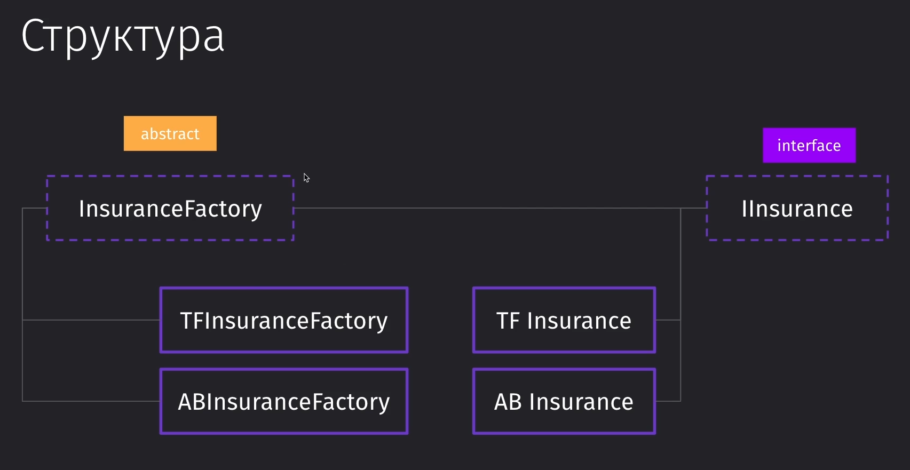
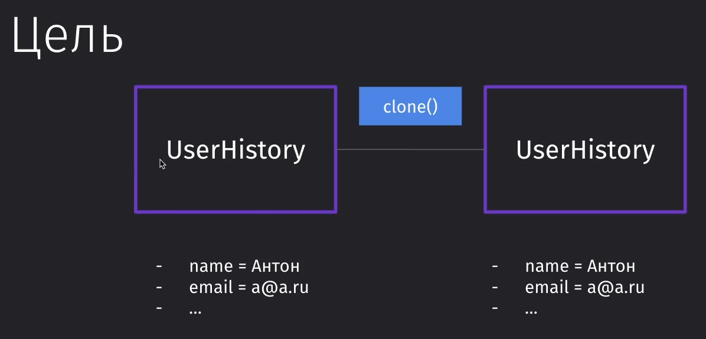
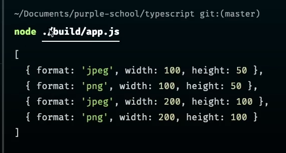

#Patterns #Factory #Singleton #Builder 

### 100 Сами порождающие паттерны

- ==Factory== - определяет какой-то суперкласс, который внутри позволяет порождать объекты разных классов, что удобно для переиспользования в огромных приложениях
- ==Singleton== - обеспечивает нам создание единственного класса и его инстанса на всё приложение, откуда бы мы к нему не обращались, что удобно для переиспользования данных внутри или переиспользования всего инстанса
- ==Prototype== - предлагает делать нам клонирование одного объекта в другой без вдавания во внутреннюю реализацию
- ==Builder== - говорит нам создавать сложные объекты поэтапно

### 101 Factory Method

В первую очередь - это универсальный паттерн, который позволяет разделять логику тех же выходных данных без перелапачивания всей системы

Пример: мы страховая компания, которая принимает определённые данные про пользователя и должны в определённом виде отдать эти данные определённым образом в API нашей компании. И тут перед нами встаёт задача реализовать передачу данных не только одной нашей страховой компании, но и другой организации, которая имеет другой формат получения данных


Правильная реализация фабрики выглядит следующим образом:
Мы создаём общий интерфейс, который хранит в себе интерфейс самой страховки. И создаём фабрику, которая хранит в себе логику под каждый вид отдаваемых данных



И вот представление реализации фабрики:

```TS
// Статус запроса
enum Status {  
    SUCCESS,
    EXPECTATION,  
    DENY
}  

// Базовая реализация страховки
interface IInsurance {  
    id: number;  
    status: Status;  
    setVehicle(vehicle: any): void;  
    submit(): Promise<boolean>;  
}  

// Реализация конкретной страховки
class TFInsurance implements IInsurance {  
    id: number;  
    status: Status;  
    private vehicle: any;  
  
    setVehicle(vehicle: any): void {  
        this.vehicle = vehicle;  
    }  
  
    async submit(): Promise<boolean> {  
        const res = await fetch('tf', {  
            method: 'POST',  
            body: JSON.stringify({ vehicle: this.vehicle }),  
        });  
  
        const data = await res.json();  
        return data.isSuccess;  
    }  
}  

// Реализация конкретной страховки
class ABInsurance implements IInsurance {  
    id: number;  
    status: Status;  
    private vehicle: any;  
  
    setVehicle(vehicle: any): void {  
        this.vehicle = vehicle;  
    }  
  
    async submit(): Promise<boolean> {  
        const res = await fetch('ab', {  
            method: 'POST',  
            body: JSON.stringify({ vehicle: this.vehicle }),  
        });  
  
        const data = await res.json();  
        return data.yes;  
    }  
}  
  
// Реализация фабрики  -------------
// Создаём абстрактный класс для отображения самой фабрики
abstract class InsuranceFactory {  
    db: any; // данные  

	// Создаём нужную страховку по интерфейсу
    abstract createInsurance(): IInsurance;  

	// Сохраняем данные страховки
    saveHistory(ins: IInsurance) {  
        this.db.save(ins.id, ins.status);  
    }  
}  

// Создаём класс для отделения фабрики одной страховки  
class TFInsuranceFactory extends InsuranceFactory {  
    createInsurance(): TFInsurance {  
        return new TFInsurance();  
    }  
}  

// И другой страховки
class ABInsuranceFactory extends InsuranceFactory {  
    createInsurance(): ABInsurance {  
        return new ABInsurance();  
    }  
}  

// Использование
const tfInsuranceFactory = new TFInsuranceFactory();  
const ins = tfInsuranceFactory.createInsurance();
tfInsuranceFactory.saveHistory(ins);
```

Либо мы можем сделать такую реализацию (немного не ООП):
Тут мы в класс createInsurance передаём один из ключей, которые представляют из себя типы страховок. Получая этот тип страховки по ключу, мы возвращаем этот тип и определяем его реализацию 
Хоть тут и гораздо более компактное представление фабрики, однако тут мы теряем возможность дописывать отдельно функциональность для каждого типа страховок

```TS
const INSURANCE_TYPE = {  
    tf: TFInsurance,  
    ab: ABInsurance  
}  
  
type IT = typeof INSURANCE_TYPE;  
  
class InsuranceFactoryAlt {  
    db: any;  
  
    createInsurance<T extends keyof IT>(type: T): IT[T] {  
        return INSURANCE_TYPE[type];  
    }  
  
    saveHistory(ins: IInsurance) {  
        this.db.save(ins.id, ins.status);  
    }  
}
```

### 102 Singleton

У нас есть одно хранилище и от него нам нужно создать только один инстанс класса - и не давать создавать другие. 


По итогу мы имеем сервисы, которые представляют из себя шину для работы с данными, которые находятся внутри хранилища данных

```TS
class MyMap {  
    // Тут храним инстанс, созданный один раз  
    private static instance: MyMap;  
  
    map: Map<number, string> = new Map();  
  
    // Запрещаем создание инстансов через конструктор  
    private constructor() {}  
  
    // Очистка мапы  
    clean() {  
        this.map = new Map();  
    }  
  
    public static get(): MyMap {  
        if (!MyMap.instance) {  
            MyMap.instance = new MyMap();  
        }        
        
        return MyMap.instance;  
    }  
}  
  
class Service1 {  
    // Добавляем значение в мапу  
    addMap(key: number, value: string): void {  
        const myMap = MyMap.get();  
        myMap.map.set(key, value); // сетим значения  
    }  
}  
  
class Service2 {  
    // Получаем значение из мапы  
    getKeys(key: number): void {  
        const myMap = MyMap.get();  
        console.log(myMap.map.get(key)); // выводим мапу  
        myMap.clean(); // очищаем мапу  
        console.log(myMap.map.get(key)); // выводим очищенную мапу  
    }  
}  
  
new Service1().addMap(1, 'Работает!'); // ввели значение  
new Service2().getKeys(1); // Работает - undefined
```

### 103 Prototype

Данный паттерн эксплуатирует возможности JS, а именно его прототипирование. 
Используется, когда нам нужно склонировать объект и все его данные, изменив внутри только небольшую часть данных

То есть обеспечением клонирования объекта занимается какой-то один метод ==clone()==



Вот пример, где мы создали копию одного и того же пользователя, но с разными почтами

```TS
interface Prototype<T> {  
    clone(): T;  
}  
  
class UserHistory implements Prototype<UserHistory> {  
    createdAt: Date;  
  
    constructor(public email: string, public name: string) {  
        this.createdAt = new Date();  
    }  
  
    clone(): UserHistory {  
        let target = new UserHistory(this.email, this.name);  
        target.createdAt = this.createdAt;  
        return target;  
    }  
}  
  
let user = new UserHistory('a@a.ru', 'Антон');  
console.log(user);  
  
let user2 = user.clone();  
user2.email = 'b@b.ru';  
console.log(user2);
```


### 104 Builder

Паттерн билдера часто используется, например, в контрактах, когда нам нужно передать от пользователя параметры на изображение (тип фото, высота, ширина) и получить от системы фотографию в нужном формате. 

Основным отличием метода билдера является то, что он чейнебл - его можно вызвать много раз друг за другом. То есть объект вызывает метод build и возвращает изменённого себя


И вот пример билдера, который всегда подгоняет данные под нужную структуру объекта. Это даёт нам возможность создать объект, который мы можем спокойно передавать через АПИ.

```TS
// Форматы изображений
enum ImageFormat {  
    PNG = 'png',  
    JPEG = 'jpeg',  
}  

// Параметры изображений
interface IResolution {  
    width: number,  
    height: number  
}  

// Объединение формата и разрешения изображений
interface IImageConversion extends IResolution {  
    format: ImageFormat  
}  

// Класс для создания объекта
class ImageBuilder {  
    // Создаём переменные, которые будут хранить параметры изображений и сразу присваиваем им массив, чтобы мы могли запушить в них данные извне
    private formats: ImageFormat[] = [];  
    private resolutions: IResolution[] = [];  

	// Реализация для PNG
    addPng() {  
        // includes - >ES2016  
        if (this.formats.includes(ImageFormat.PNG)) {  
            return this;  
        }        
        this.formats.push(ImageFormat.PNG);  
        return this;  
    }  

	// Реализация для JPEG
    addJpeg() {  
        if (this.formats.includes(ImageFormat.JPEG)) {  
            return this;  
        }        
        this.formats.push(ImageFormat.JPEG);  
        return this;  
    }  

	// Добавляет для изображений параметры размеров
    addResolution(width: number, height: number) {  
        this.resolutions.push({ width, height });  
        return this;  
    }  

	// Конечный метод, который преобразует наши данные в нужный формат
    build(): IImageConversion[] {  
        const res: IImageConversion[] = [];  
        for (const r of this.resolutions) {  
            for (const f of this.formats) {  
                res.push({  
                    format: f,  
                    height: r.height,  
                    width: r.width  
                });  
            }  
        }  
        return res;  
    }  
}  

// Вызов создания объекта
console.log(  
    new ImageBuilder()  
        .addJpeg()  
        .addPng()  
        .addResolution(100, 50)  
        .addResolution(200, 100)  
        .build()  
)
```



>[!info] Когда использовать паттерн?
>- Всегда, когда нам нужно создать сложный объект и не задумываться над его обязательными свойствами (чтобы, например, передать его через АПИ на бэк или фронт)
>- При тестировании приложения 