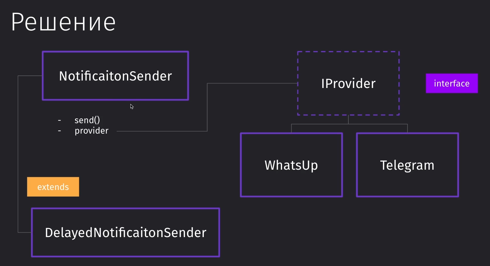
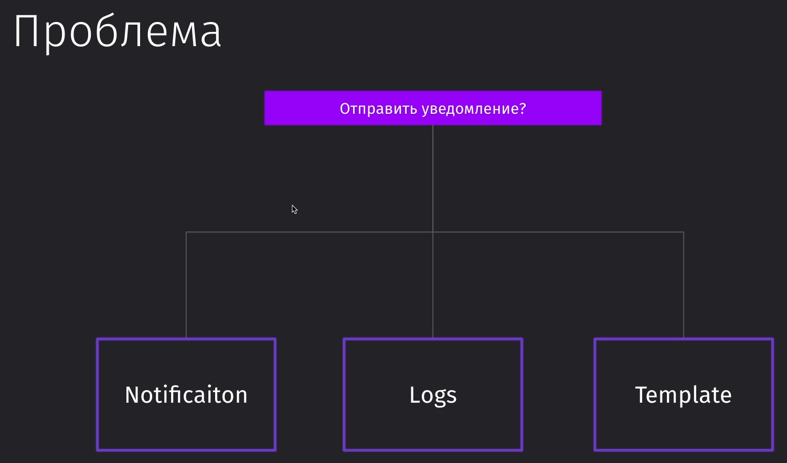
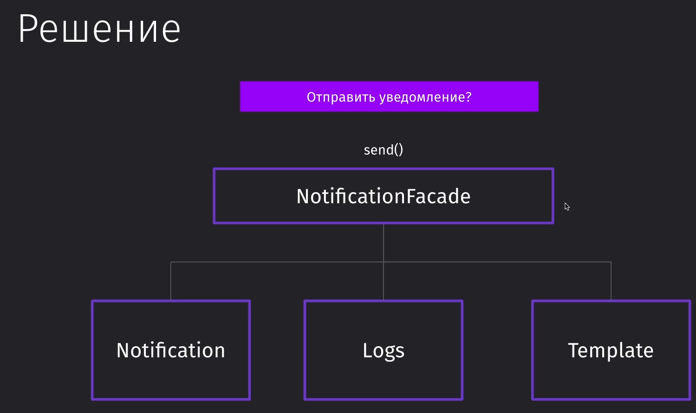
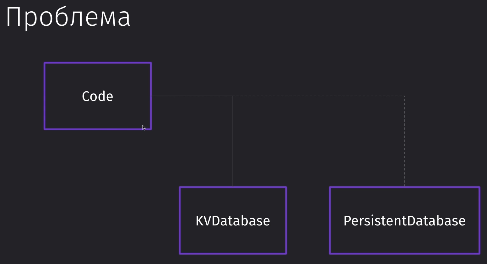
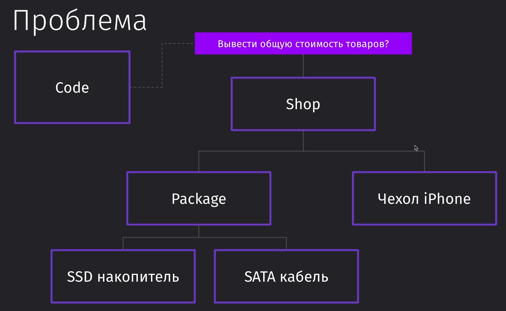

#Patterns #Bridge #Facade #Adapter #Proxy #Composite

### 105 Вводное видео

- ==Мост== - построение мостов между двумя различными типизациями классов
- ==Фасад== - скрывает реализацию за собой
- ==Адаптер== - позволяет вставить новый объект в существующий код
- ==Прокси== - позволяет добавить логику перед нашим классом
- ==Композит== - упрощает работу с древовидными структурами кода
- ==Декоратор==

### 106 Bridge

Проблема: 
Нам нужно реализовать уведомления, которые будут приходить либо в телегу, либо в whatsapp. Так же уведомления могут быть мгновенные, либо отложенные. Расширение логики приведёт к тому, что классов для реализации функционала придётся делать больше в геометрической прогрессии


Мы имеем основной класс `NotificationSender` и через метод `provider` взаимодействуем с интерфейсом `IProvider`, который уже влияет на провайдеров. Это позволяет через композицию решить проблему с реализацией взаимодействия



И вот пример реализации паттерна, где у нас в отправителе сообщений присутствует метод-мост, который опирается на интерфейс провадера. Мы можем обращаться к любому провайдеру ровно потому, что уже имеем определённый интерфейс, через который будет осуществляться взаимодействие

```TS
// Интерфейс провайдера, через который будет осуществляться взаимодействие между сендером и провайдерами
interface IProvider {  
    sendMessage(message: string): void;  
    connect(config: unknown): void;  
    disconnect(): void;  
}  
  
// Реализация двух провайдеров  
class TelegramProvider implements IProvider {  
    sendMessage(message: string): void {  
        console.log(message);  
    }  
  
    connect(config: string): void {  
        console.log(config);  
    }  
  
    disconnect(): void {  
        console.log('Disconnected TG');  
    }  
}  
  
class WhatsUpProvider implements IProvider {  
    sendMessage(message: string): void {  
        console.log(message);  
    }  
  
    connect(config: string): void {  
        console.log(config);  
    }  
  
    disconnect(): void {  
        console.log('Disconnected WU');  
    }  
}  
  
// Реализация класса по отравке сообщения  
class NotificationSender {  
    // Принимает определённого провайдера, которые реализованы выше  
    constructor(private provider: IProvider) {  
    }  
    send() {  
        // И пользуется методами этого провайдера  
        this.provider.connect('connect');  
        this.provider.sendMessage('message');  
        this.provider.disconnect();  
    }  
}  
  
// Реализация отложенного отправления сообщения  
class DelayNotificationSender extends NotificationSender {  
    constructor(provider: IProvider) {  
        super(provider);  
    }  

	// Отправка с задержкой
    sendDelayed() {  
    }
}  
  
// Вызов сендеров  
const senderTG = new NotificationSender(new TelegramProvider());  
senderTG.send();  
  
const senderWU = new NotificationSender(new WhatsUpProvider());  
senderWU.send();
```


### 107 Facade

У нас есть реализация большого количества действий при отправке того же сообщения: отправка сообщения на сервер, запись в БД, логирование сообщения, отправка уведомления пользователю



Чтобы легко реализовывать определённые задачи и каждый раз не прописывать все действия вручную, можно создать класс, который скроет всю реализацию и станет прослойкой для реализации быстрой отправки того же сообщения



Реализация паттерна фасада, где класс композиционирует все остальные класса, чтобы предоставить пользователю единый интерфейс для реализации нужной задачи

```TS
// Класс, который отвечает за оповещение
class Notify {  
    send(template: string, to: string) {  
        console.log(`Отправляю ${template} к ${to}`)  
    }  
}  

// Логирование
class Log {  
    log(message: string) {  
        console.log(message);  
    }  
}  

// Шаблонизатор  
class Template {  
	// Хранилище шаблонов (БД)
    private templates = [  
        {name: 'other', template: '<h1>Шаблон</h1>>'},  
    ];  

	
    getByName(name: string) {  
        return this.templates.find(t => t.name === name);  
    }  
}  

// И сам фасад, который скрывает все остальные методы, чтобы с ними не работать
class NotificationFacade {  
    private notify: Notify;  
    private logger: Log;  
    private template: Template;  
  
    constructor() {  
        this.notify = new Notify();  
        this.template = new Template();  
        this.logger = new Log();  
    }  
  
    send(to: string, templateName: string) {  
        const data = this.template.getByName(templateName);  
        if (!data) {  
            this.logger.log('Не найден шаблон');  
            return;  
        }        this.notify.send(data.template, to);  
        this.logger.log('Шаблон отправлен');  
    }  
}  

// Использование  
const s = new NotificationFacade();  
s.send('a@a.ru', 'other'); // Есть только этот метод
```


### 108 Adapter

Паттерн ==Адаптер== позволяет подготовить сходу неподходящий объект к использованию в нашем коде. 
Самый простой пример из жизни: нам нужно воткнуть USB 3.0 в Type-C. Сделать это просто так не получится и поэтому нам нужно использовать переходик - адаптер.

Пример:  нам нужно адаптировать все вызовы KVDatabase к персистентной БД



Решается проблема через адаптор, который расширяется от нашей БД и через конструктор прокидывается к нашей персистентной БД 


```TS
class KVDatabase {  
    private db: Map<string, string> = new Map();  
  
    save(key: string, value: string) {  
        this.db.set(key, value);  
    }  
}  
  
class PersistentDB {  
    savePersistent(data: Object) {  
        console.log(data);  
    }  
}  
  
// Сам адаптер  
class PersistentDBAdapter extends KVDatabase {  
    // Конструктор принимает в себя ту ДБ, под которую мы адаптируемся  
    constructor(public database: PersistentDB) {  
        super();  
    }  
  
    override save(key: string, value: string): void {  
        this.database.savePersistent({ key, value});  
    }  
}  
  
// Создаём функцию, которая умеет работать только с KVDatabase  
function run(base: KVDatabase) {  
    base.save('key', 'myValue')  
}  
  
// Код работает, так как PersistentDBAdapter экстендит PersistentDB  
run(new PersistentDBAdapter(new PersistentDB()));
```


>[!info] Этот паттерн используется для адаптации приложения к работе с другими, внешними, полезными библиотеками, которые приложение по умолчанию не сможет поддерживать

### 109 Proxy

Паттерн прокси позволяет нам настроить доступность к определённым участкам кода и к определённой функциональности.

У нас есть определённое АПИ для работы с платежами. Мы можем с ним работать из кода. Однако перед нами встаёт задача, что нам нужно ограничить возможность работы с АПИ, чтобы управлять доступом к нему.


Решить проблему мы можем через внедрение зависимости от PaymentAPIProxy и влиять на АПИ платежей через этот прокси. И в этом прокси мы можем кэшировать запросы, проверять доступ к этим запросам и т.д.


```TS
// Интерфейс АПИ оплаты
interface IPaymentAPI {  
    getPaymentDetail(id: number): IPaymentDetail | undefined;  
}  

// Интерфейс данных оплаты
interface IPaymentDetail {  
    id: number;  
    sum: number;  
}  
  
// АПИ оплаты  
class PaymentAPI implements IPaymentAPI {  
    private data = [{ id: 1, sum: 10000}];  
  
    // Кэширование  
    getPaymentDetail(id: number): IPaymentDetail | undefined {  
        return this.data.find(d => d.id === id);  
    }  
}  
  
// Это прокси, который ограничит получение данных  
class PaymentAccessProxy implements IPaymentAPI {  
    constructor(private api: PaymentAPI, private userId: number) {  
    }  
    // Получение данных о платеже  
    getPaymentDetail(id: number): IPaymentDetail | undefined {  
        if (this.userId === 1) {  
            return this.api.getPaymentDetail(id);  
        }        console.log('Попытка получить данные платежа!');  
        return undefined;  
    }  
}  
  
// Пользователь, который может получить данные  
const proxyAccess = new PaymentAccessProxy(new PaymentAPI(), 1);  
console.log(proxyAccess.getPaymentDetail(1));  
  
// И пользователь, которому уже не доступны данные  
const proxyUnaccess = new PaymentAccessProxy(new PaymentAPI(), 2);  
console.log(proxyUnaccess.getPaymentDetail(1));
```


>[!info] Этот паттерн может быть полезен, когда нам нужно добавить дополнительные настройки логики над существующим функционалом в программе

### 110 Composite

Паттерн композит позволяет нам объединить большие блоки кода в такую последовательность, где мы сможем от родителей элементов проводить воздействие на эти компоненты

Пример: нам нужно получить общую стоимость товаров. В магазине может быть как один небольшой товар, так и сразу группа товаров



Решить нашу проблему мы можем через создание отдельного интерфейса, который будет хранить в себе общие методы для получения информации из всех элементов. То есть он нам даст одинаковые функции получения стоимости для всех сущностей-родителей


```TS
// Наш абстрактный класс, который определяет методы всем его дочерним элементам  
abstract class DeliveryItem {  
    // Массив корзины  
    item: DeliveryItem[] = [];  
  
    // Добавить элемент в корзину   
addItem(item:DeliveryItem) {  
        this.item.push(item);  
    }  
  
    // Получение цены из корзины  
    getItemPrices(): number {  
        return this.item.reduce((acc: number, item: DeliveryItem) => {  
            return acc += item.getPrice()  
        }, 0);  
    }  
  
    // У каждого элемента своя реализация получения цены  
    abstract getPrice(): number;  
}  
  
// Магазин  
class DeliveryShop extends DeliveryItem {  
    constructor(private deliveryFee: number) {  
        super();  
    }  
  
    getPrice(): number {  
        return this.getItemPrices() + this.deliveryFee;  
    }  
}  
  
// Упаковка для товаров - корзина  
class Package extends DeliveryItem {  
    getPrice(): number {  
        return this.getItemPrices();  
    }  
}  
  
// Единичный продукт  
class Product extends DeliveryItem {  
    // В который передаём цену  
    constructor(private price: number) {  
        super();  
    }  
  
    // И который возвращает цену в родительский элемент  
    getPrice(): number {  
        return this.price;  
    }  
}  
  
// Создаём магазин товаров  
const shop = new DeliveryShop(100);  
shop.addItem(new Product(1000));  
  
// Создаём первую корзину товаров  
const pack1 = new Package();  
pack1.addItem(new Product(200));  
pack1.addItem(new Product(300));  
shop.addItem(pack1);  
  
// Создаём вторую корзину товаров const pack2 = new Package();  
pack2.addItem(new Product(30));  
shop.addItem(pack2);  
  
// И просто аккумулируем все цены в одном магазине  
console.log(shop.getPrice()); // 1630
```

>[!info] Данный паттерн используется тогда, когда нам нужно работать с древовидными структурами, вложенными друг в друга