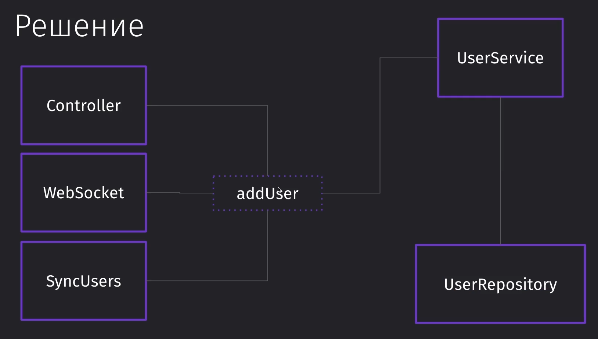
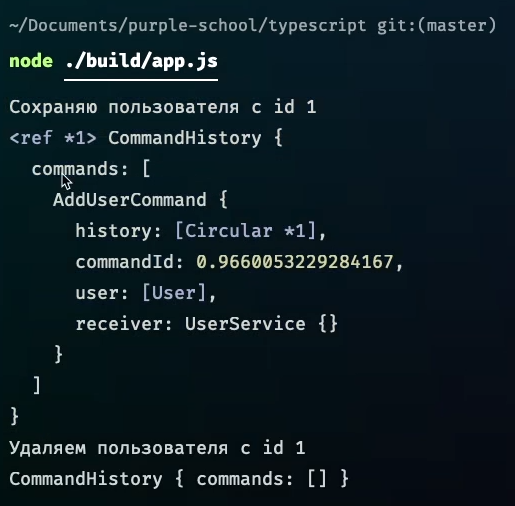
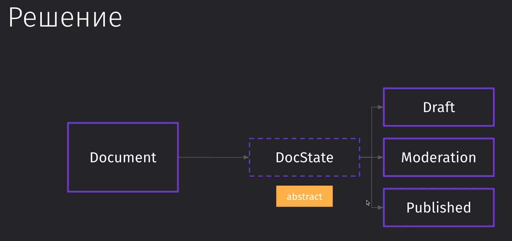
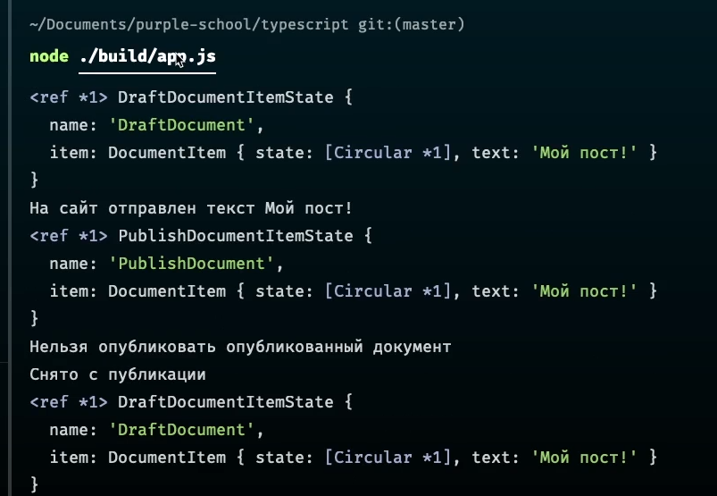
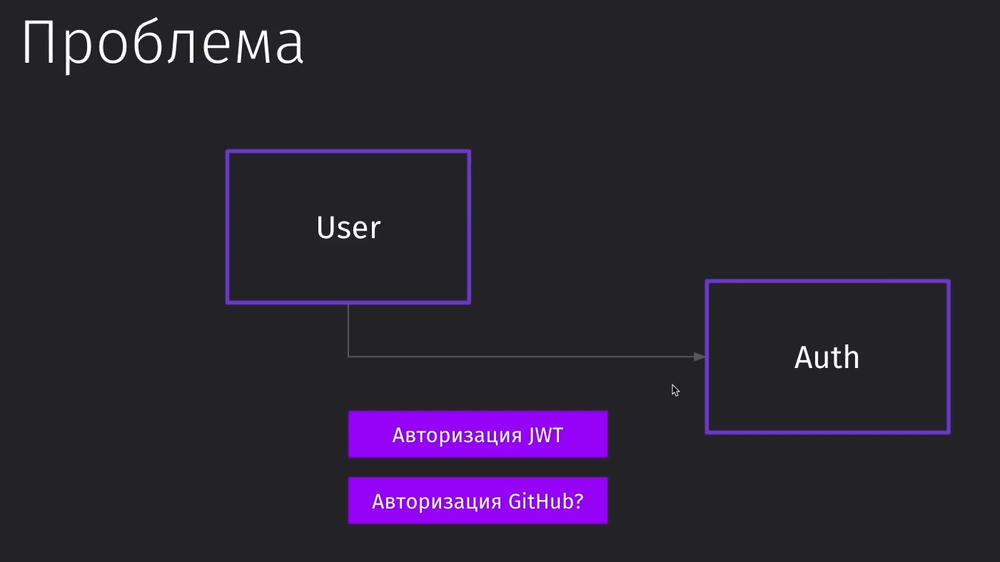
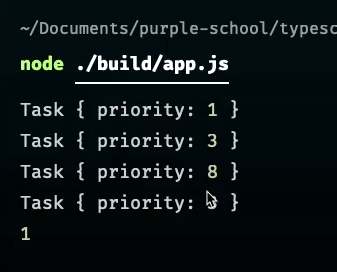

#Patterns #Mediator #ChainOfCommand #Command #Strategy #Iterator #TemplateMethod #Observer 

### 111 Вводное видео

Поведенческие паттерны решают проблемы взаимодействия элементов внутри системы

==Chain of Command== - построение цепочки команд, которые обрабатывают полученное значение и передают его друг за другом
==Mediator== - организация взаимодействия между несколькими компонентами, которые должны быть сильно связаны друг с другом и позволяет модерировать эти взаимодействия
==Command== - позволяет вывести часть логики в команды. Организует работу объектов не напрямую друг на другом, а в команде 
==State== - позволяет работать с состоянием объекта
==Strategy== - реализация наборов стратегий, которые взаимозаменяются на лету
==Iterator== - позволяет реализовать итерирование по древовидным структурам
==Template Method== - задание шаблонного метода с набором последовательных шагов, которые потом могут применяться к различным схожим системам
==Observer== - мы подписываемся на определённый элемент в коде и получаем уведомление об его изменении

### 112 Chain of Command

Это паттерн, который разбивает логику выполнения промежуточных и необязательных команд на отдельную функциональность. 

Мы внешний запрос, который приходит к нам в обработчик. Мы понимаем, что нам нужно произвести авторизацию данных, а затем ещё и валидацию получаемых данных


Решение представляет из себя реализацию middleware компонентов, которые будут обрабатывать получаемые данные


```TS
interface IMiddleware {  
    next(mid: IMiddleware): IMiddleware;  
    handle(request: any): any;  
}  
  
abstract class AbstractMiddleware implements IMiddleware {  
    private nextMiddleware: IMiddleware;  
  
    next(mid: IMiddleware): IMiddleware {  
        this.nextMiddleware = mid;  
        return mid;  
    }  
  
    handle(request: any): any {  
        if (this.nextMiddleware) {  
            return this.nextMiddleware.handle(request);  
        }        
        return;
    }  
}  
  
// Первый обработчик для авторизации  
class AuthMiddleware extends AbstractMiddleware {  
    override handle(request: any): any {  
        console.log('AuthMiddleware');  
        if (request.userId === 1) {  
            return super.handle(request);  
        }       
        return { error: 'Вы не авторизованы' };  
    }  
}  
  
// Второй обработчик для валидации  
class ValidateMiddleware extends AbstractMiddleware {  
    override handle(request: any): any {  
        console.log('ValidateMiddleware');  
        if (request.body) {  
            return super.handle(request);  
        }        
        return { error: 'Нет body' };  
    }  
}  
  
// Ну и сам контроллер, который будет возвращать сообщение об успешном запросе  
class Controller extends AbstractMiddleware {  
    override handle(request: any): any {  
        console.log('Controller');  
        return { success: request };  
    }  
}  
  
const controller = new Controller();  // Контроллер
const validate = new ValidateMiddleware();  // Валидация
const auth = new AuthMiddleware();  // Аутентификация

// Раздельный вызов нужных нам запросов
auth.next(validate).next(controller);  
  
console.log(auth.handle({  
    userId: 3 // Вы не авторизованы  
})); // Вызов без body  
  
console.log(auth.handle({  
    userId: 1,  
    body: 'I am OK!',  
})); // Успешный вызов
```


>[!info] Стоит такой подход использовать, если нам нужно сделать код более модульным и разделить обязанности выполнения внутри него (если нам будет не нужен определённый функционал)

### 113 Mediator

Данный паттерн встречается в основном на фронте, чтобы два разрозненных компонента могли знать друг о друге 

`EventHandler` должен знать о `Notification`. `Notification` должен уметь логировать и кешировать. В свою очередь, кэширование должно знать о логах.  


Медиатор (посредник) представляет из себя управляющего оркестром, при котором все элементы знают друг о друге


И вот реализация композиции медиатора:

```TS
// Представление медиатора  
interface Mediator {  
    notify(sender: string, event: string): void;  
}  
  
// Представление медиатора  
abstract class Mediated {  
    mediator: Mediator;  
    setMediator(mediator: Mediator) {  
        this.mediator = mediator;  
    }  
}  
  
// Уведомление  
class Notifications {  
    send() {  
        console.log('Отправляю уведомление')  
    }  
}  
  
// Логирование  
class Log {  
    log(message: string) {  
        console.log(message);  
    }  
}  
  
class EventHandler extends Mediated {  
    myEvent() {  
        this.mediator.notify('EventHandler', 'myEvent');  
    }  
}  
  
// Медиатор уведомления  
class NotificationMediator implements Mediator {  
    // Объединяет в композицию все остальные элементы  
    constructor(  
        public notifications: Notifications,  
        public logger: Log,  
        public handler: EventHandler  
    ) {  
    }
    
    notify(sender: string, event: string): void {  
        switch (event) {  
            case 'myEvent':  
                this.notifications.send(); // Отправляю уведомление  
                this.logger.log('Отправлено'); // Отправлено  
	            break;  
        }    
    }  
}  
  
const handler = new EventHandler(); // Инициализируем наш хэндлер  
const logger = new Log(); // Инициализируем логгер  
const notifications = new Notifications(); // Инициализируем уведомления  
  
// Создаём композицию медиатора со всеми компонентами  
const mediator = new NotificationMediator(  
    notifications,  
    logger,  
    handler  
);  
handler.setMediator(mediator); // Устанавливаем в хэндлер медиатор  
handler.myEvent(); // Уведомление
```

### 114 Command

Это один из самых частоиспользуемых паттернов в программировании как фронта (смена стейтов), так и в бэке (CQRS)

Мы имеем контроллер, сокеты и сихронизацию, которые каждый раз дёргают UserService. Однако нам нужно реализовать логирование, откат пользователей, очередь определённых задач или отложенное добавление данных (чтобы не перенагружать сервис). Чтобы сделать это, мы могли бы добавить часть этой реализации в каждый из классов


Однако можно воспользоваться более простым способом решения проблемы: создать один класс, который выполнял бы все задачи



И вот так реализуется паттерн команды

```TS
// Самый обычный пользователь - абстрактные данные  
class User {  
    constructor(public userId: number) {  
    }
}  
  
// Класс, который отвечает за сохранение команд в историю  
class CommandHistory {  
    // БД истории  
    public commands: Command[] = [];  
  
    // Пуш в историю  
    push(command: Command) {  
        this.commands.push(command);  
    }  
  
    // И удаление команды из истории  
    remove(command: Command) {  
        this.commands = this.commands.filter(
	        c => c.commandId !== c.commandId
	    );  
    }  
}  
  
// Абстрактная команда  
abstract class Command {  
    // Идентификатор команды  
    public commandId: number;  
  
    // Присвоение команды в историю для возможности отката  
    constructor(public history: CommandHistory) {  
        this.commandId = Math.random();  
    }  
  
    // Проводит операцию над пользователем  
    abstract execute(): void;  
}  
  
// Команда для добавления пользователей  
class AddUserCommand extends Command {  
    constructor(  
        private user: User, // Сам пользователь  
        private receiver: UserService, // Получатель  
        public history: CommandHistory // Хранилище истории  
    ) {  
        super(history);  
    }  
  
    execute(): void {  
        this.receiver.saveUser(this.user); // Сохранение пользователя  
        this.history.push(this); // Пуш в историю  
    }  
  
    // Отмена добавления пользователя  
    undo() {  
        this.receiver.deleteUser(this.user.userId);  
        this.history.remove(this);  
    }  
}  
  
class UserService {  
    saveUser(user: User): void {  
        console.log(`Сохраняю пользователя с ID ${user.userId}`);  
    }  
  
    deleteUser(userId: number): void {  
        console.log(`Удаляю пользователя с ID ${userId}`);  
    }  
}  
  
class Controller {  
    receiver: UserService;  
    history: CommandHistory = new CommandHistory();  
  
    // Добавление получателя отправляемых данных  
    addReceiver(receiver: UserService) {  
        this.receiver = receiver;  
    }  
  
    // Запуск контроллера передачи данных  
    run() {  
        const addUserCommand = new AddUserCommand(  
            new User(1),  
            this.receiver,  
            this.history  
        );  
        addUserCommand.execute(); // Выполнение команды  
        console.log(addUserCommand.history);  
        addUserCommand.undo(); // Откат только что выполненного действия  
        console.log(addUserCommand.history);  
    }  
}  
  
const controller = new Controller();  
controller.addReceiver(new UserService()); // Получатель данных  
controller.run(); // Запуск обработки команды
```



>[!info] Это самый рекомендуемый паттерн к использованию, так как его часто можно встретить в высоконагруженных сервисах.

### 115 State

Паттерн State определяет, как мы можем работать с состоянием определённой логики в приложении. 

Тут показан пример реализации состояний прямо внутри документа и подобное представление в CRM


Вместо того, чтобы хранить все состояния внутри нашего документа, мы можем в документ добавить ссылку на текущее состояние. Логика переходов между состояниями реализуется в самих классах состояния элемента



Так выглядит реализация состояний документа в процессе жизненного цикла статей

```TS
// Сам наш документ  
class DocumentItem {  
    public text: string; // Текст документа  
    private state: DocumentItemState; // Статус документа  
  
    // При создании документ попадает в драфт    
    constructor() {  
        this.setState(new DraftDocumentItemState());  
    }  
  
    // Получение статуса документа  
    getState() {  
        return this.state;  
    }  
  
    // Установка статуса документа  
    setState(state: DocumentItemState) {  
        this.state = state;  
    }  
  
    // Публикация документа  
    publishDoc() {  
        this.state.publish(); // Публикуем документ  
        // Нужно указать контекст для DocumentItem, чтобы оно нормально работало        
        this.state.setContext(this);  
    }  
  
    // Удаление документа  
    deleteDoc() {  
        this.state.delete();  
    }  
}  
  
// Абстрактное представление статуса документа  
abstract class DocumentItemState {  
    public name: string;  
    public item: DocumentItem;  
  
    public setContext(item: DocumentItem) {  
        this.item = item;  
    }  
  
    public abstract publish(): void;  
    public abstract delete(): void;  
}  
  
// Статус документа - драфт  
class DraftDocumentItemState extends DocumentItemState{  
    constructor() {  
        super();  
        this.name = "DraftDocument";  
    }  
  
    // Публикация переведёт документ в статус опубликованного  
    publish(): void {  
        console.log(`На сайт отправлен текст ${this.item.text}`);  
        this.item.setState(new PublishDocumentItemState());  
    }  
  
    // Удаление драфта  
    delete(): void {  
        console.log('Документ удалён');  
    }  
}  
  
// Статус документа - опубликовано  
class PublishDocumentItemState extends DocumentItemState{  
    constructor() {  
        super();  
        this.name = "PublishDocument";  
    }  
  
    // Нельзя опубликовать опубликованный документ  
    publish(): void {  
        console.log('Нельзя опубликовать дважды');  
    }  
  
    // Удаление переводит документ в драфт  
    delete(): void {  
        console.log('Снято с публикации');  
        this.item.setState(new DraftDocumentItemState());  
    }  
}  
  
const item = new DocumentItem(); // Создаём документ  
item.text = 'Мой пост'; // Заполняем текстом  
console.log(item.getState()); // Драфт  
item.publishDoc(); // Публикуем документ  
console.log(item.getState()); // Опубликован  
item.deleteDoc(); // Удаляем документ  
console.log(item.getState()); // Удалён (переведён в драфт)
```



### 116 Strategy

Стратегия подразумевает под собой поиск похожих алгоритмов внутри программы и выделение их в отдельные классы, взаимозаменяя друг друга

Конкретно тут в качестве примера для применения стратегии выделяется ситуация, когда нам нужно реализовать авторизацию. У нас была сначала регистрация через JWT, а потом нам сказали сделать через GitHub, а уже потом добавить через гугл и фэйсбук. Логика авторизации примерно похожа, поэтому нам её нужно собирать.



Решить проблему мы можем через создание интерфейса для определения стратегии и выбора стратегии в этой аутентификации


```TS
// Создаём пользователя с токенами от разных систем
class User {  
    githubToken: string;  
    jwtToken: string;  
}  

// Интерфейс определения стратегии
interface AuthStrategy {  
    auth(user: User): boolean;  
}  

// 
class Auth {  
    constructor(private strategy: AuthStrategy) {  
    }  
    
    // Определение атуентификации
    setStrategy(strategy: AuthStrategy) {  
        this.strategy = strategy;  
    }  

	// Аутентификация пользователя по стратегии
    public authUser(user: User): boolean {  
        return this.strategy.auth(user);  
    }  
}  

//   Стратегия для аутентификации через JSWT
class JSWTStrategy implements AuthStrategy {  
    auth(user: User): boolean {  
        if (user.jwtToken) {  
            return true;  
        }        return false;  
    }  
}  

// Стратегия для аутентификации через GitHub
class GithubStrategy implements AuthStrategy {  
    auth(user: User): boolean {  
        if (user.githubToken) {  
            return true;  
        }        return false;  
    }  
}  

//  
const user = new User();  // Создание пользователя
user.jwtToken = 'token';  // Определение токена
const auth = new Auth(new JSWTStrategy()); // Аутентификация по стратегии 
console.log(auth.authUser(user)); 
auth.setStrategy(new GithubStrategy());  // Меняем стратегию
console.log(auth.authUser(user));
```

### 117 Iterator

Паттерн итератор позволяет нам выполнять определённые задачи по определённому нами приоритету

Мы имеем систему, в которой мы имеем определённые задачи, которые нужно решать по степени их важности и, желательно, связанно друг с другом


Решить проблему мы можем через явное задание тасклиста, который содержит в себе таски. К тасклисту будет обращаться итератор и выполнять сначала приоритетные таски, а затем малоприоритетные (в позиции по убыванию)


```TS
// Отдельная задача  
class Task {  
    constructor(public priority: number) {  
    }
}  
  
// Список отдельных задач  
class TaskList {  
    private tasks: Task[] = [];  

	// Сортировка тасков по приоритету
    public sortByPriority() {  
        this.tasks = this.tasks.sort((a, b) => {  
             if (a.priority > b.priority) {  
                 return 1;  
             } else if (a.priority === b.priority) {  
                 return 0;  
             } else {  
                 return -1;  
             }  
        });  
    }  

	// Добавление таска
    public addTask(task: Task): void {  
        this.tasks.push(task);  
    }  

	// Получение таска
    public getTask(): Task[] {  
        return this.tasks;  
    }  

	// Количество тасков
    public count(task: Task): number {  
        return this.tasks.length;  
    }  

	// Создание итератора тасков
    public getIterator() {  
        return new PriorityTaskIterator(this);  
    }  
}  
  
// Интерфейс итератора с его методами  
interface IIterator<T> {  
    current(): T | undefined;  
    next(): T | undefined;  
    prev(): T | undefined;  
    index(): number;  
}  
  
// Итератор тасков по приоритету  
class PriorityTaskIterator implements IIterator<Task> {  
    private position: number = 0; // Индекс элемента  
    private taskList: TaskList; // Ссылка на тасклист  
  
    // Сортирует тасклист по приоритету и сохраняет его в свою логику    
    constructor(taskList: TaskList) {  
        taskList.sortByPriority();  
        this.taskList = taskList;  
    }  
  
    // Выводит нынешний таск  
    current(): Task | undefined {  
        return this.taskList.getTask()[this.position];  
    }  
  
    // Выводит индекс таска  
    index(): number {  
        return this.position;  
    }  
  
    // Выводит следующий таск  
    next(): Task | undefined {  
        this.position += 1;  
        return this.taskList.getTask()[this.position];  
    }  
  
    // Выводит предыдущий таск  
    prev(): Task | undefined {  
        this.position -= 1;  
        return this.taskList.getTask()[this.position];  
    }  
}  
  
// Создание тасклиста  
const taskList = new TaskList();  
// Добавление тасков в тасклист  
taskList.addTask(new Task(8));  
taskList.addTask(new Task(1));  
taskList.addTask(new Task(3));  
// Создание итератора  
const iterator = taskList.getIterator();  
// Результат работы итератора  
console.log(iterator.current());  
console.log(iterator.next());  
console.log(iterator.next());  
console.log(iterator.prev());  
console.log(iterator.index());
```


### 118 Template Method

Паттерн шаблона говорит нам об абстрагировании повторяющейся логики

Конкретно мы имеем такую проблему: нам из формы нужно отправить данные в два разных АПИ, логика которых схожа, но немного отличается


Чтобы не городить дублирование кода в самой форме, мы можем сделать отдельный абстрактный класс, который будет за нас хранить в себе логику отправки данных на разные АПИ. Единственное, что нужно будет сделать из формы - это вызвать SaveForm, что крайне удобно 


```TS
// Сама форма с данными  
class Form {  
    constructor(public name: string) {  
    }
}  
  
// Абстрактный класс, который опишет логику поведения работы с АПИ  
abstract class SaveForm<T> {  
    public save(form: Form) {  
        const res = this.fill(form);  
        this.log(res);  
        this.send(res);  
    }
    protected abstract fill(form: Form): T;  
    protected log(data: T): void {  
        console.log(data);  
    }  
    protected abstract send(data: T): void;  
}  
  
// Первое АПИ  
class FirstAPI extends SaveForm<string> {  
    protected fill(form: Form): string {  
        return form.name;  
    }  
  
    protected send(data: string): void {  
        console.log(`Отправляем ${data}`);  
    }  
}  
  
// Второе АПИ  
class SecondAPI extends SaveForm<{fio: string}> {  
    protected fill(form: Form): {fio: string} {  
        return { fio: form.name };  
    }  
  
    protected send(data: {fio: string}): void {  
        console.log(`Отправляем ${data}`);  
    }  
}  
  
const form1 = new FirstAPI(); // Создаём новую форму  
form1.save(new Form('Алек')); // Помещаем в неё данные  
  
const form2 = new SecondAPI(); // Инициализируем второе АПИ  
form2.save(new Form('Алек')); // Вкладываем в него форму
```


>[!info] Используем этот паттерн, когда мы имеем одинаковые шаги в логике, но они отличаются немного в реализации

### 119 Observer

Паттерн обсёрвера подразумевает под собой то, что мы создаём класс, который уведомляет другую логику о том, что ей нужно выполниться (например, выполнять функцию при срабатывании ивентлистенера) 

Конкретно тут нужно сделать так, чтобы лид сервис отправлял уведомления пользователю о новых действиях лида 


Решить проблему можно через создание отдельных обсёрверов со своим нотифаем под каждый сервис. А так же нужно задать нашего лида в качестве субъекта


```TS
// Это интерфейс объекта, который на что-то подписался  
interface Observer {  
    // Это метод, который срабатывает каждый раз, когда его дёрнули  
    update(subject: Subject): void;  
}  
  
// Субъект эммитит события и на него можно подписаться  
interface Subject {  
    // Подписка на событие  
    attach(observer: Observer): void;  
  
    // Отписка  
    detach(observer: Observer): void;  
  
    // Уведомление - его вызывает внешний код при срабатывании  
    notify(): void;  
}  
  
// Это новый пользователь  
class Lead {  
    constructor(public name: string, public phone: string) {  
    }
}  
  
// Это наш конкретный субъект  
class NewLead implements Subject {  
    private observers: Observer[] = []; // Подписчики  
    public state: Lead;
    
    attach(observer: Observer): void {  
        if (this.observers.includes(observer)) {  
            return;  
        }        
        this.observers.push(observer);  
    }  
  
    detach(observer: Observer): void {  
        const observerIndex = this.observers.indexOf(observer);  
        if (observerIndex !== -1) return;  
        this.observers.splice(observerIndex, 1);  
    }  
  
    notify(): void {  
        for (const observer of this.observers) {  
            // Передаём this, чтобы передать как стейт, так и сабджект  
            observer.update(this);  
        }    
    }  
}  
  
// Сервис уведомления пользователя  
class NotificationService implements Observer {  
    update(subject: Subject): void {  
        console.log(`NotificationService получил уведомление: ${subject}`);  
    }  
}  
  
// Уведомление сервиса  
class LeadService implements Observer {  
    update(subject: Subject): void {  
        console.log(`LeadService получил уведомление: ${subject}`);  
    }  
}  
  
const subject = new NewLead(); // Создание субъекта  
subject.state = new Lead('Антон', '00000'); // В него помещаем сам объект  
const sub1 = new NotificationService(); // Первый сервис уведомления  
const sub2 = new LeadService(); // Второй сервис уведомления  
  
subject.attach(sub1); // Подписка  
subject.attach(sub2); // Подписка  
  
subject.notify(); // Уведомление  
subject.detach(sub1); // Отписка  
subject.notify(); // Уведомление
```

