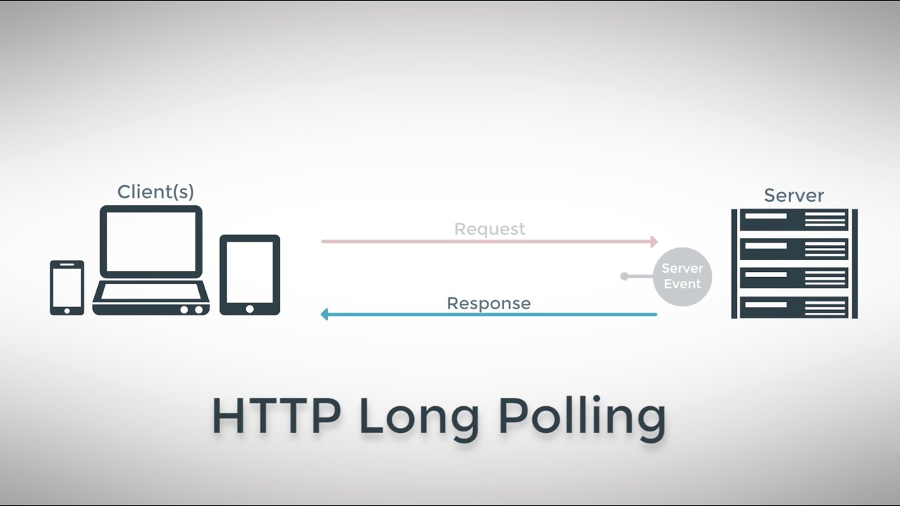
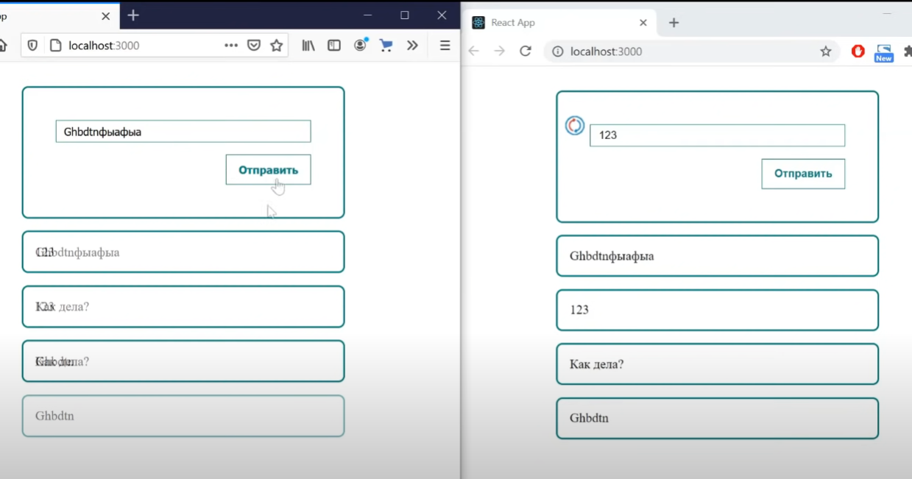
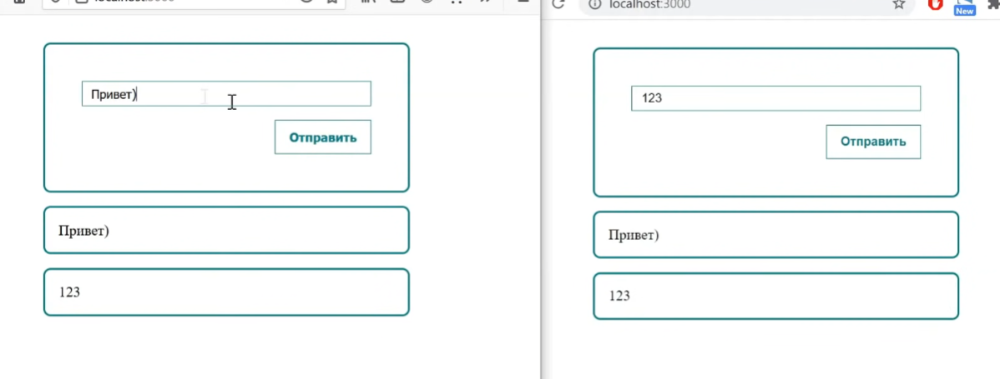
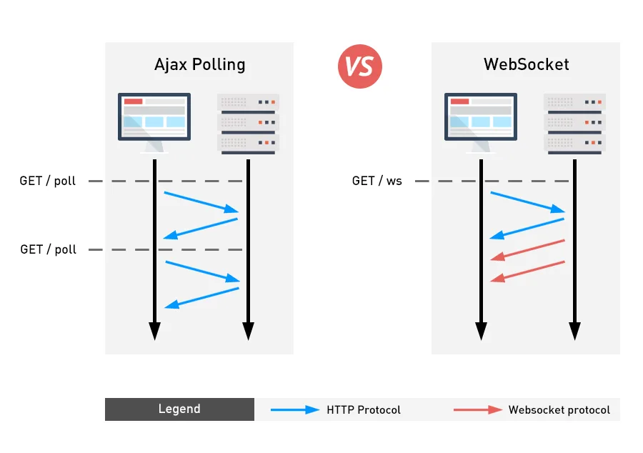
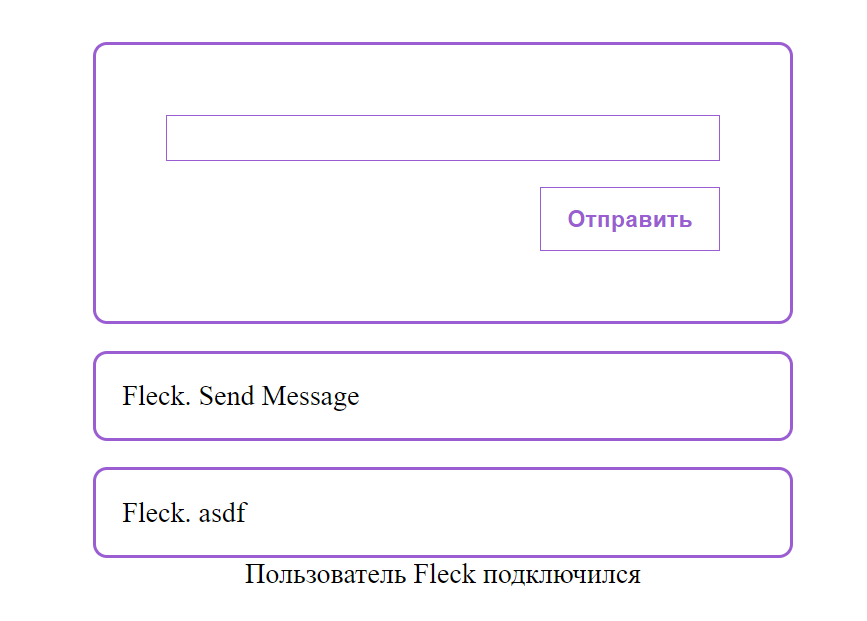

## Long polling

Это способ, при котором мы с клиента отправляем запрос на сервер, который висит ровно до тех пор, пока сервер не ответит на него. Если время ожидания закончилось, то мы с клиента отправляем запрос заново. 

Если сервер нам что-нибудь вернёт, то мы опять отправляем запрос на получение данных с сервера. 

Этот способ самый простой и требует от нас просто постоянно запрашивать данные с клиента на сервер



Тут пользователь отправляет get-запрос, но мы не возвращаем ему ответ (ответ мы забиндили в событие). Взамен мы ждём, когда другой участник чата отправит сообщение и уже только после этого событие в get-запросе вызываем, после чего всем участникам чата возвращается ответ 

На сервере мы имеем:
- пост-запрос, который вызывает функцию внутри гет-запроса
- гет-запрос, который хранит в себе ивент, срабатываемый, когда на сервер отправляют запрос с данными

```JS
const express = require('express');
const cors = require('cors');
const events = require('events');
const PORT = 5000;

// инициализируем эмиттер событий
const emitter = new events.EventEmitter();

const app = express();

app.use(cors());
app.use(express.json());

// будет возвращать новые сообшения
app.get('/get-messages', (req, res) => {
	// если пользователь отправил сообщение, то остальных пользователей чата нужно осведомить о доставке сообщения
	emitter.once('newMessage', (message) => {
		// всем пользователям, у кого висит подключение, отправяем сообщение
		res.json(message);
	});
});

// будет
app.post('/new-messages', (req, res) => {
	const message = req.body;
	// тут мы вывзаем событие из get, после того, как мы получили новое сообщение
	emitter.emit('newMessage', message);
	res.status(200);
});

// прослушиваем порт
app.listen(PORT, () => console.log(`server started on PORT ${PORT}`));
```

На клиенте нам нужно написать функцию, которая будет отправлять постоянно запрос на получение данных `subscribe()` и функцию, которая будет отправлять эти данные `sendMessage()`. Уже только тогда после отправки сообщения триггернётся гет на сервере и отдаст сообщения 

```JSX
import React, { useEffect, useState } from 'react';
import './styles.css';
import axios from 'axios';

const LongPulling = () => {
	const [messages, setMessages] = useState([]);
	const [value, setValue] = useState('');

	useEffect(() => {
		subscribe();
	}, []);

	const subscribe = async () => {
		try {
			// тут мы получаем ответ от сервера и связь пропадает
			const { data } = await axios.get('http://localhost:5000/get-messages');
			setMessages((prev) => [data, ...prev]);
			// тут мы переоформляем подписку, чтобы связь не пропадала
			await subscribe();
		} catch (e) {
			// если произойдёт ошибка, то нам нужно будет просто переоформить подписку
			setTimeout(() => {
				subscribe();
			}, 500);
		}
	};

	const sendMessage = async () => {
		await axios.post('http://localhost:5000/new-messages', {
			message: value,
			id: Date.now(),
		});
	};

	return (
		<div>
			<div>
				<h2>LongPulling</h2>

				<div className='form'>
					<input value={value} onChange={(e) => setValue(e.target.value)} type='text' />
					<button onClick={sendMessage}>Отправить</button>
				</div>
				<div className='messages'>
					{messages.map((mess) => (
						<div className='message' key={mess.id}>
							{mess.message}
						</div>
					))}
				</div>
			</div>
		</div>
	);
};

export default LongPulling;
```

И теперь в двух разных браузерах мы реализовали чат в реальном времени




## event soursing (server sent events)

Второй варинат взаимодействия - это event soursing, который подразумевает под собой, чтобы было установлено постоянно одностороннее соединение с сервера к клиенту. 

Клиент только получает ответы от сервера на изменённые данные и больше ничего не происходит. 

Строится данный подход на базе обычного https


На сервере мы создаём специальный заголовок, который определит, что наши запросы имеют постоянный характер и создаём многоповторный ивент, который будет записывать ответ специальным образом

```JS
const express = require('express');
const cors = require('cors');
const events = require('events');
const PORT = 5000;

const emitter = new events.EventEmitter();

const app = express();

app.use(cors());
app.use(express.json());

app.get('/connect', (req, res) => {
	// тут мы задаём заголовок, что связь у нас будет постоянная
	res.writeHead(200, {
		Connection: 'keep-alive',
		'Content-Type': 'text/event-stream',
		'Cache-Control': 'no-cache',
	});

	// этот же ивент может срабатывать множество раз, поэтому меняем once на on
	emitter.on('newMessage', (message) => {
		// тут мы обязательно оборачиваем строку в такой шаблон, чтобы она принялась классом EventSource
		res.write(`data: ${JSON.stringify(message)} \n\n`);
	});
});

app.post('/new-messages', (req, res) => {
	const message = req.body;
	emitter.emit('newMessage', message);
	res.status(200);
});

app.listen(PORT, () => console.log(`server started on PORT ${PORT}`));
```

На клиенте нужно поменять функцию `subscribe()`, которая будет работать с классом `EventSource`, который, в свою очередь, уже будет отслеживать получение сообщений 

```JSX
import React, { useEffect, useState } from 'react';
import './styles.css';
import axios from 'axios';

const EventSourcing = () => {
	const [messages, setMessages] = useState([]);
	const [value, setValue] = useState('');

	useEffect(() => {
		subscribe();
	}, []);

	const subscribe = async () => {
		// создаём ивентсурс с ссылкой на коннекшн-контроллер
		const eventSource = new EventSource(`http://localhost:5000/connect`);

		// тут мы каждый раз при получении сообщения выполняем действие
		eventSource.onmessage = function (event) {
			const message = JSON.parse(event.data);
			setMessages((prev) => [message, ...prev]);
		};
	};

	const sendMessage = async () => {
		await axios.post('http://localhost:5000/new-messages', {
			message: value,
			id: Date.now(),
		});
	};

	return (
		<div>
			<div>
				<h2>EventSourcing</h2>

				<div className='form'>
					<input value={value} onChange={(e) => setValue(e.target.value)} type='text' />
					<button onClick={sendMessage}>Отправить</button>
				</div>
				<div className='messages'>
					{messages.map((mess) => (
						<div className='message' key={mess.id}>
							{mess.message}
						</div>
					))}
				</div>
			</div>
		</div>
	);
};

export default EventSourcing;
```

И наш чат всё так же продолжает работать, но теперь посредством передачи сырых данных




## WebSockets

Вебсокеты - это технология, которая позволяет устанавливать между клиентом и сервером постоянную (дуплексную) связь для обмена данными

Вебсокеты используются, например, в чатах для того, чтобы сообщение приходило сразу без потребности в перезагрузке страницы. Или в новостях, чтобы их быстро обновлять.

Это самый мощный способ организовать взаимодействие между клиентом и сервером и требует поднятия отдельного вебсокет-сервера



Изначально нам нужно поднять отдельный сервер вебсокетов

Далее мы описываем события, при которых будут срабатывать сокеты. 

Изначально WebSocket создаётся для одного человека на одно подключение и сообщение по-умолчанию будет передаваться только самому пользователю. Чтобы оно отправлялось сразу обоим людям в чате, нужно создать широковещатель `broadcastMessage()`.

```JS
const ws = require('ws');

// запускаем сервер вебсокетов
const wss = new ws.Server(
	{
		port: 5000,
	},
	() => console.log(`Server started on 5000`)
);

// при подлючении сокета
wss.on('connection', function connection(ws) {
	// при отпрвке сообщения
	ws.on('message', function (message) {
		// мы получаем сообщение с клиента
		message = JSON.parse(message);
		
		// и при разных событиях в сообщении (есть событие подключения и просто отправки сообщения), будем выполнять "разные" действия
		switch (message.event) {
			case 'message':
				broadcastMessage(message);
				break;
			case 'connection':
				broadcastMessage(message);
				break;
		}
	});
});

// распространяем сообщение по пользователям
function broadcastMessage(message, id) {
	// перебираем всех клиентов
	wss.clients.forEach((client) => {
		// каждый клиент является вебсокетом и можно каждому отправить сообщение
		client.send(JSON.stringify(message));
	});
}
```

На клиенте нужно уже будет описать подключение к сокетам и описать реакции сокета на его разные состояния (ошибка, подключение и так далее)

```JSX
import React, { useEffect, useRef, useState } from 'react';
import axios from 'axios';

const WebSock = () => {
	const [messages, setMessages] = useState([]);
	const [value, setValue] = useState('');
	const [connected, setConnected] = useState(false);
	const [username, setUsername] = useState('');

	// чтобы не потерять сокет при перерендере, присваиваем его в реф
	const socket = useRef();

	function connect() {
		// присваиваем сюда сокет
		socket.current = new WebSocket('ws://localhost:5000');

		// при открытии сокета
		socket.current.onopen = () => {
			setConnected(true);

			// сообщение о подключении пользователя к сокетам
			const message = {
				event: 'connection',
				username,
				id: Date.now(),
			};

			// отправит сообщение на сервер
			socket.current.send(JSON.stringify(message));

			console.log('Socket подключен');
		};

		// при получении сообщения от сокета
		socket.current.onmessage = (event) => {
			const message = JSON.parse(event.data);
			setMessages((prev) => [message, ...prev]);
		};

		// при закрытии сокета
		socket.current.onclose = () => {
			console.log('Socket закрыт');
		};

		// при ошибке в сокете
		socket.current.onerror = () => {
			console.log('Socket произошла ошибка');
		};
	}

	const sendMessage = async () => {
		const message = {
			username,
			message: value,
			id: Date.now(),
			event: 'message',
		};
		socket.current.send(JSON.stringify(message));
		setValue('');
	};

	if (!connected) {
		return (
			<div className='center'>
				<div className='form'>
					<input
						value={username}
						onChange={(e) => setUsername(e.target.value)}
						type='text'
						placeholder='Введите ваше имя'
					/>
					<button onClick={connect}>Войти</button>
				</div>
			</div>
		);
	}

	return (
		<div className='center'>
			<div>
				<div className='form'>
					<input value={value} onChange={(e) => setValue(e.target.value)} type='text' />
					<button onClick={sendMessage}>Отправить</button>
				</div>
				<div className='messages'>
					{messages.map((mess) => (
						<div key={mess.id}>
							{mess.event === 'connection' ? (
								<div className='connection_message'>
									Пользователь {mess.username} подключился
								</div>
							) : (
								<div className='message'>
									{mess.username}. {mess.message}
								</div>
							)}
						</div>
					))}
				</div>
			</div>
		</div>
	);
};

export default WebSock;
```




