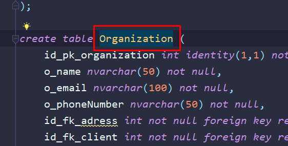
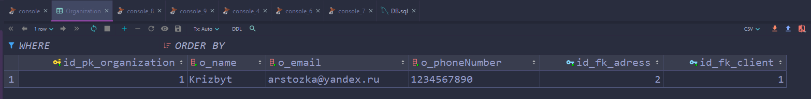
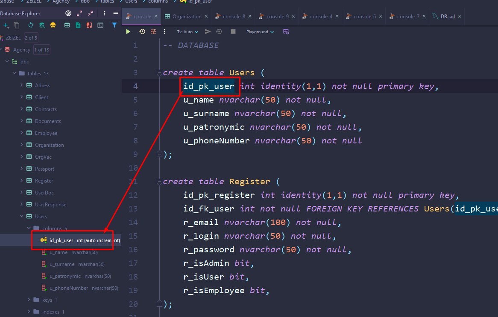
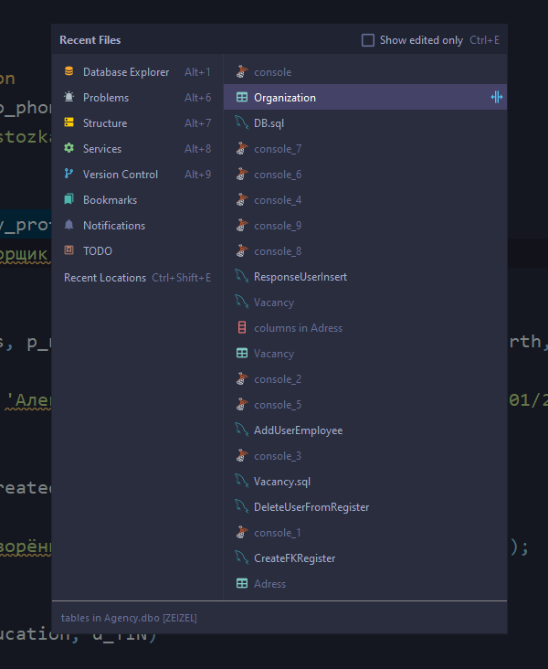

## Шорткаты

- `F4` - откроет содержимое объекта

- `Alt+Shift+B` - найдёт место из кода в эксплорере

- `Double Shift`- поиск по всему проекту
- `Ctrl+Shift+A` - быстрый поиск команды и запуск
- `Alt+Enter` - показывает контекстные подсказки
- `F2 / Shift+F2` - быстрое перемещение между проблемами в коде
- `Ctrl+E` - показывает недавно открытые файлы

