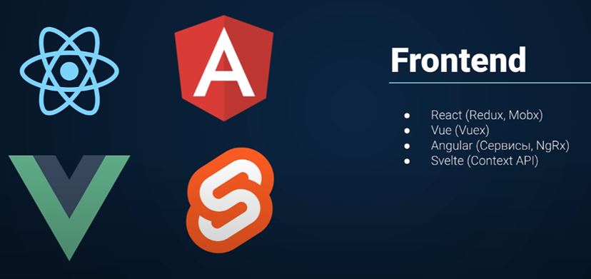

## **FrontEnd**
#React #Angular #Vue #Svelte #Redux #Mobx #Vuex #NgRx #ContextAPI #FrontEnd #Framework

Учить какой-либо из фреймворков - обязательно. Так же к ним в придачу учим технологию для определения состояний

Материал:
[Практический JS - часть по React (+Redux)](../../Development/FrontEnd/React/Практический%20JS.md)
[Типизация TypeScript в React, Redux Toolkit](../../Development/TypeScript/_lessons/Типизация%20TypeScript%20в%20React,%20Redux%20Toolkit.md)