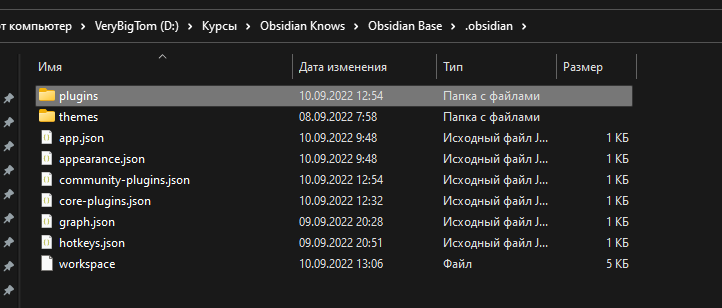

Тут нужно сразу сказать, что обсидиан крайне умная штуковина. Она хранит все темы, плагины и настройки для них прямо в самой базе и поэтому при коммите на гитахаб и загрузке из другого места интерфейс и возможности останутся ровно те же самые
