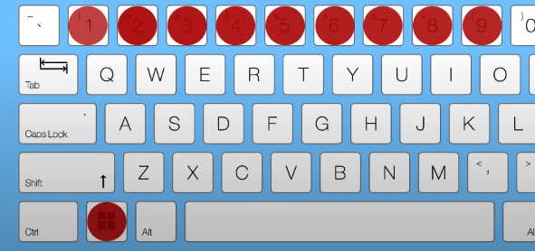
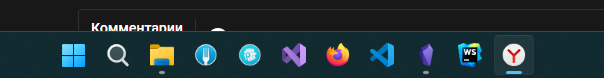
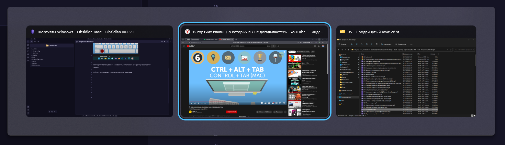

Самый имбовый способ поменять язык не через `Shift+Alt`, а через `Win+Space`. Такой способ позволяет не терять фокус с программы и не добавляет проблем по совместимости с другими шорткатами в программах

`Win+Ctrl+D` - быстро создаст новый виртуальный рабочий стол (если по-фасту нужно всё скрыть)
`Win+Tab `- покажет все рабочие столы
`Ctrl+Win+Стрелки` - перемещение по рабочим столам 
`Win+Ctrl+F4` - закрытие виртуального рабочего стола

`Win+M` - свернёт все окна 
`Win+,` - скроет все окна, но не на долго

`Win+цифра` - включит программу с панели задач по её порядковому номеру

`Win+стрелка влево/вправо` - позволяет расположить программу на половину экрана

`Ctr l+ Alt + Tab` - покажет список запущенных программ

`Win + Tab `- уже эта панель заставляет нас выбрать через таб нужное нам приложение

`Ctrl + Shift + Esc`

`Win + E`

`Win + "+/-"` - запустит лупу и приблизит нужную часть экрана

`Win + Shift + S`
`Win + PrntScrn`

`Win + A`
`Win + I`

`Win + L` - ==быстро заблокировать пользователя==

CTRL+X — вырезать выбранный элемент; 
CTRL+C либо CTRL+INSERT — скопировать выбранный элемент; 
CTRL+V либо SHIFT+INSERT — вставить выбранный элемент; 
CTRL+Z — отменить предыдущее действие; 
ALT+TAB — переключиться между открытыми приложениями; 
ALT+F4 — закрыть активный элемент или выйти из активного приложения; 
Windows+L — заблокировать ПК (появится окно, где надо ввести пароль, считать отпечаток пальца или лицо в зависимости от установленной у вас блокировки); 
Windows+D — показать либо скрыть рабочий стол; 
F2 — переименовать выбранный элемент; 
F3 — найти в "Проводнике"; 
F4 — показать список адресной строки в "Проводнике"; 
F5 — обновить окно; 
F6 — переключиться между элементами экрана в окне или на рабочем столе; 
F10 — активировать строку меню, если приложение активно; 
ALT+F8 — показать пароль в окне входа в систему; 
ALT+ESC — переключиться между элементами в порядке, в котором они открывались; 
ALT+подчеркнутая буква — выполнение команды, которая соответствует этой букве; 
ALT+Enter — показать меню со свойствами выделенного элемента; 
ALT+пробел — открыть контекстное меню окна; 
ALT+стрелка влево/вправо — назад/вперед; 
ALT+Page Up/Page Down — перейти на страницу вверх/вниз; 
CTRL+F4 — закрыть документ, в котором работаете, если он открыт на весь экран и приложение допускает одновременно открывать несколько документов; 
CTRL+A — выделить все элементы в окне или документе; 
CTRL+D (или Delete) — удалить выделенный элемент; 
CTRL+R (или F5) — обновить открытое окно; 
CTRL+Y —повторить последнее действие еще раз; 
CTRL+стрелка вправо/влево — передвинуть курсор в начало следующего/предыдущего слова; 
CTRL+стрелка вниз/вверх — передвинуть курсор в начало следующего/предыдущего абзаца; 
CTRL+ALT+TAB — перейти на клавиши со стрелками, чтобы переключаться между открытыми приложениями; 
ALT+SHIFT+клавиши со стрелками — переместить в заданном направлении группу или плитку в меню "Пуск", если они в фокусе; 
CTRL+SHIFT+клавиши со стрелками — переместить плитку на другую плитку в меню "Пуск" для создания папки, если первая в фокусе; 
CTRL+клавиши со стрелками — соответствующее изменение размеров меню "Пуск" (оно должно быть предварительно открыто); 
CTRL+клавиша со стрелкой+пробел — выделить несколько элементов в окне или на рабочем столе; 
CTRL+SHIFT+клавиша со стрелкой — выделить фрагмент текста; 
CTRL+Esc — открыть "Пуск"; 
CTRL+SHIFT+Esc — открыть диспетчер задач; 
CTRL+SHIFT — переключить языковую раскладку клавиатуры; 
CTRL+пробел — включить/отключить редактор метода ввода для китайского языка;
SHIFT+F10 — открыть контекстного меню для выделенного элемента; 
SHIFT+ клавиша со стрелкой — выделить несколько элементов в окне или на рабочем столе либо текст в документе; 
SHIFT+DELETE — удалить насовсем выделенный элемент; стрелка вправо/влево — открыть следующее меню справа/слева или открыть/закрыть подменю; 
ESC — остановить выполнение актуальной задачи или выйти.

