---
tags:
  - agile
  - scrum
  - kanban
  - lean
  - sbergile
  - less
aliases:
  - Agile
  - Scrum
---

# Agile (Scrum, Kanban, Lean)

---

## Введение

### Agile

Agile - это подход, который позволяет оптимизировать процессы работы над продуктом. Он сильно вжился в процессы больших команд разработки и положительно на него влияет.

- Влияние на бизнес: Agile способствует успешному ведению бизнеса благодаря улучшению командной работы.
- Личный опыт: Реальные примеры облегчения рабочих процессов и уменьшения ошибок с внедрением Agile.
- Примеры успеха: Успешное завершение крупных проектов, в том числе ФБР и Agile-трансформация Сбербанка под руководством Германа Грефа, подчеркнувшего важность скорости.

Agile включает в себя ежедневные встречи, спринты, ретроспективы, автоматические тесты приложения.

Agile внедряют для оптимизации процессов

### Модель Кеневин

Разработал модель Дэйв Сноуден, сотрудник IBM (1999) с целью анализа и принятия решений руководством.

> Сама модель предлагает разные способы решения задач на основе "среды обитания" (`Cynefin`)

#### Категории задач по модели Кеневин

Всего модель описывает 5 разных категорий задач, которые могут попасться нам как на работе, так и в целом в жизни:

1. Простые задачи
    - Четкие причинно-следственные связи. Есть конкретные инструкции к решению проблем.
    - Подход: Ощути, категоризируй, реагируй
    - Примеры: работа официанта, строителя
2. Сложные задачи
    - Скрытые причинно-следственные связи. Сразу неясно, как можно решить проблему.
    - Подход: Ощути, проанализируй, реагируй
    - Примеры: строительство дома, медицинское лечение
3. Запутанные задачи
    - Неоднозначные и непредсказуемые связи. Есть общая идея того, что нужно реализовать, но как и в какой последовательности сделать - сразу неясно.
    - Подход: Попробуй, ощути, реагируй
    - Примеры: стартапы, инновационные проекты
4. Хаотичные задачи
    - Отсутствие явных причинно-следственных связей. В данном случае пытаются выявить хоть какие-то связи.
    - Подход: Действуй, ощути, реагируй
    - Примеры: научные лаборатории
5. Неопределенность
    - Неясность принадлежности к категории. Нужно определить, в какой области ты находишься прямо сейчас.
    - Подход: Сначала определи область

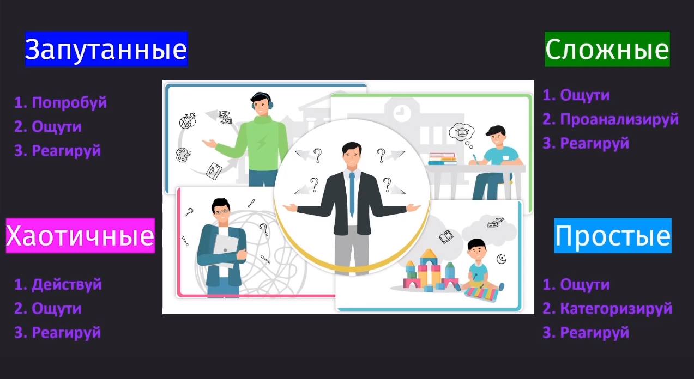

#### Применение модели

Данная модель позволяет определить нам, подходит ли Agile к данном проекту. Для различных проектов мы можем применять различные методы менеджмента команды:

- Запутанные проекты требуют наличия гиоптез и их проверки, что предоставляет нам Scrum внутри Agile
- Сложные проекты на зрелых стадиях не требуют сложных решений и проверки гипотез - им достаточно будет следить за задачами через Kanban
- Системы мотивации: OKR для запутанных, KPI для сложных проектов
- В простых проектах можно накладывать задачи по системе Waterfall (то есть друг за другом), а в более сложных раскидывать задачи по PMI, Prince2 и PMBook

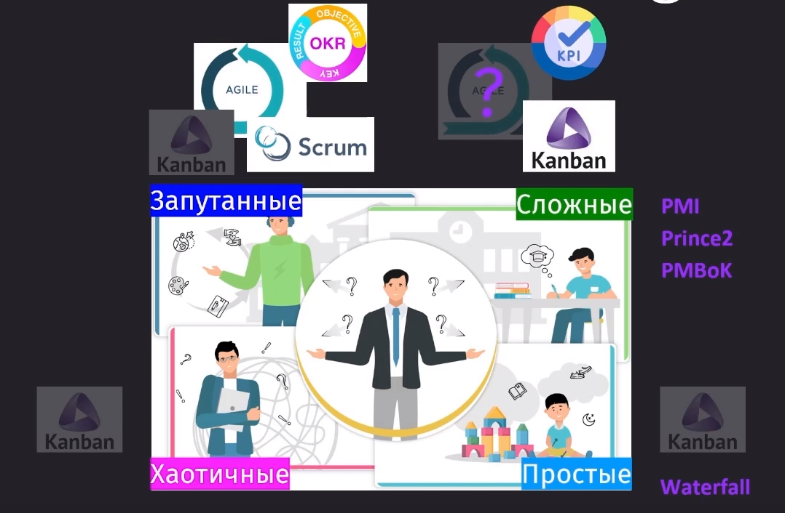

> [!info] Проекты могут менять свою область
>
> - Проекты могут менять категории в зависимости от изменения причинно-следственных связей
> - Пример: стартап переходит от запутанной к сложной области

#### Заключение

Модель Кеневин – ключевой инструмент для понимания и управления различными типами задач в Agile-практиках, позволяющий выбрать наиболее эффективный подход к решению задач и управлению проектами.

### Agile-манифест

Agile - это философия, основанная на Манифесте Agile, включающем в себя четыре ценности и двенадцать принципов.

11 февраля 2001 года: В штате Юта, семнадцать экспертов разработали Аджайл-манифест. Созданы четыре ценности и двенадцать принципов Agile.

Ценности Agile:

1. *Люди и взаимодействия* важнее процессов и инструментов.
2. *Работающий продукт* важнее исчерпывающей документации.
3. *Сотрудничество с заказчиком* важнее согласования условий контракта.
4. *Готовность к изменениям* важнее следования первоначальному плану.

12 Принципов Agile:

1. Удовлетворение требований заказчика через раннюю и регулярную поставку продукта.
2. Приветствие изменений требований, даже на поздних стадиях разработки.
3. Частая поставка работающего продукта.
4. Ежедневная работа разработчиков и бизнеса вместе.
5. Поддержка мотивированных профессионалов.
6. Непосредственное общение как эффективный способ обмена информацией.
7. Работающий продукт как основной показатель прогресса.
8. Поддержание устойчивого процесса разработки.
9. Внимание к техническому совершенству и качеству.
10. Простота и минимизация лишней работы.
11. Развитие требований и решений через самоорганизующиеся команды.
12. Регулярный анализ и улучшение эффективности.

Ключи к пониманию Agile:

1. **Коммуникация**: Центральная роль общения и командного взаимодействия. Примерно 10% из 80ичасового спринта отведено на общение разработчиков и менеджеров, чтобы понимать свои задачи. Очень важны фасилидация и коучинг коллег. Отвечает за принципы 4, 5, 6, 8, 11, 12.
2. **Эмпиризм**: Способность адаптироваться и изменять стратегию, основываясь на опыте. Отвечает за принципы 1, 2, 3, 4, 9, 12.
3. **Контроль качества**: Высокие стандарты качества и их поддержание. Отвечает за принципы 1, 4, 7.

Agile - это не только инструменты и методологии, но и философия, основанная на гибкости, адаптации и тесном взаимодействии команды для достижения лучших результатов.

### Эмпиризм

Эмпиризм - это философское направление, согласно которому знание или обоснование исходят только или главным образом из чувственного опыта.

Опыт - источник знания, единственный критерий истины и основание всякой науки.

Рационализм - это уже противоположное эмпиризму направление, когда за основу берётся автономность разума от чувств и приоритетом является разум в познании. Порядок и связь идей в разуме соответствует порядку и связи вещей в мире.

#### Эмпиризм в Agile

Эмпиризм (опыт) стоит в основе Agile, делая его подходы гибкими и позволяя быстро адаптироваться к изменениям, благодаря чему Agile и получает своё название — "гибкий".

В Agile значительное место занимает адаптация к изменениям, что предполагает пересмотр первоначальных планов в пользу нового опыта и требований.

Сам по себе план редко когда сбывается и поэтому главное - уметь подстраивать план под новую действительность, когда задачи и приоритеты меняются.

- **Принципы гибкого подхода**:
    1. Удовлетворение потребностей заказчика через регулярную и раннюю поставку.
    2. Поддержка изменения требований на любых этапах.
    3. Ежедневное сотрудничество между разработчиками и заказчиками.
    4. Внимание к техническому совершенству и качеству.
    5. Командная оценка эффективности работы и адаптация процессов.

#### Особенности каскадной модели (Waterfall)

Agile предлагает итеративную модель разработки, противопоставляясь каскадной модели (водопад), что позволяет быстрее реагировать на изменения и уменьшает бюрократизацию рабочего процесса.

Разработал данную модель Уинстон Ройс. Эта модель подходит для простых и быстрых проектов в заказной разработке. Но для сложных проектов она не подходит, потому как в них существует кратно большее количество неизвестных переменных.

По факту, мы получаем модель, в которой нам постоянно приходится возвращаться обратно и дорабатывать прошлые этапы.

Но у этой модели есть критические недостатки, которые не дают воспользоваться ей в больших проектах:

1. В конце у нас получается не то, что нужно, потому что все требования были приняты в самом начале пути
2. Слишком поздно идёт тестирование продукта
3. Очень тяжело попасть в сроки и бюджет (так как внести правки становится сложно)
4. Внесение самих изменений - это проблема, так как в начале такой функционал не предусматривался

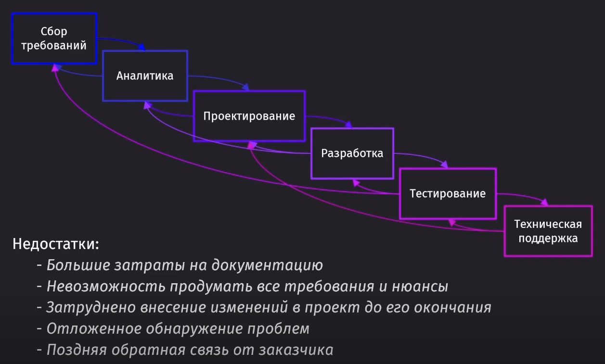

#### Цикл Деминга-Шухарта

Agile использует итерационные циклы, основанные на эмпирическом цикле Деминга-Шухарта (Plan-Do-Check-Act), улучшая гибкость и эффективность процессов.

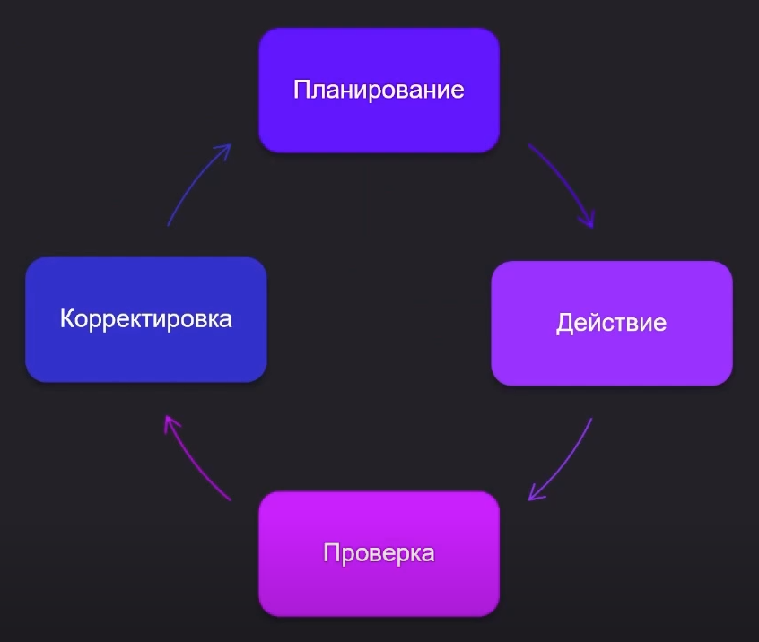

Сама по себе итеративная модель основана на цикле ДШ, но включает в каждом этапе те же самые этапы из вотерфола

Отличие в том, что весь путь разработки разбивается на короткие итерации, после которых уже идут нужные корректировки. Сам такой подход позволяет избавиться от большого количества бюрократии, что делает процесс гибким и эффективным.

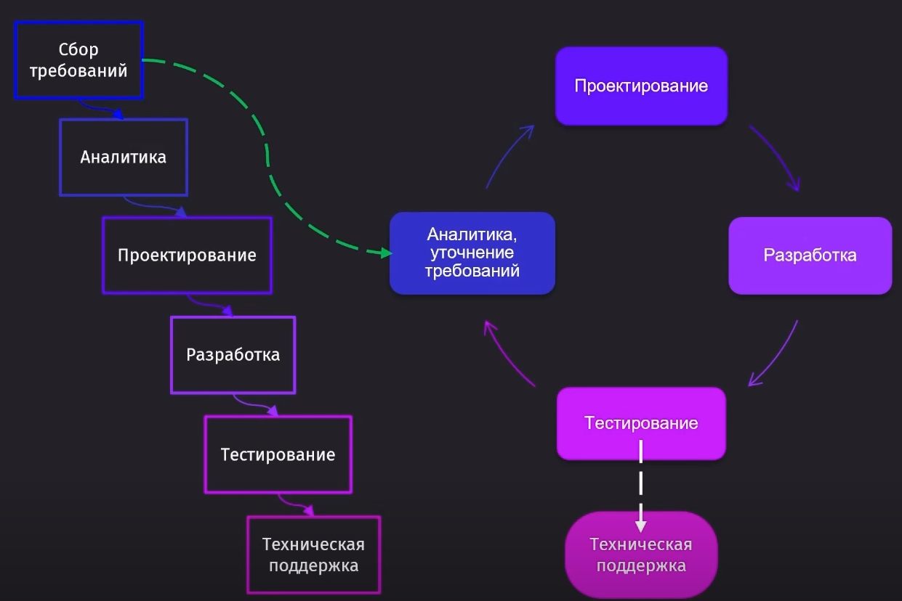

Во все эти этапы так же включены ==петли обратной связи== для своевременного взаимодействия и планирования дальнейших работ командой.

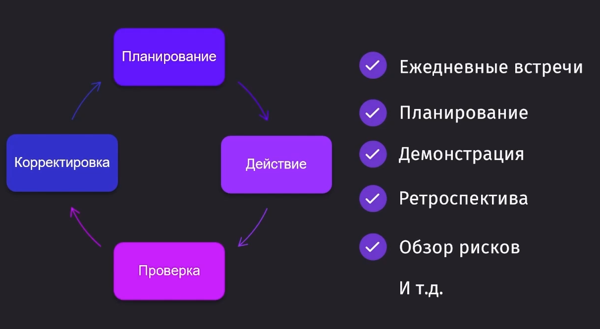

То есть после каждой итерации, в которой мы спланировали и сделали работу, у нас есть определённый результат, который можно откорректировать либо использовать уже для следующих этапов разработки продукта.

#### Столпы эмпиризма в Agile

Эти столпы - это минимальный набор требований, без которых эмпиризм, а в этом случае и Agile, не будут работать.

1. Прозрачность — делаем рабочий процесс видимым для всех участников.
    - Таблицы, графики, схемы, документация, честное и открытое общение, фиксация договорённостей
2. Инспекция — регулярная проверка прогресса и выявление отклонений.
    - Ежедневные встречи, планирование, демонстрация, ретроспектива, обзор рисков
3. Адаптация — корректировка процессов с целью минимизации отклонений.
    - По результатам инспекции будет произведён процесс адаптации с теми же методами из инспекции

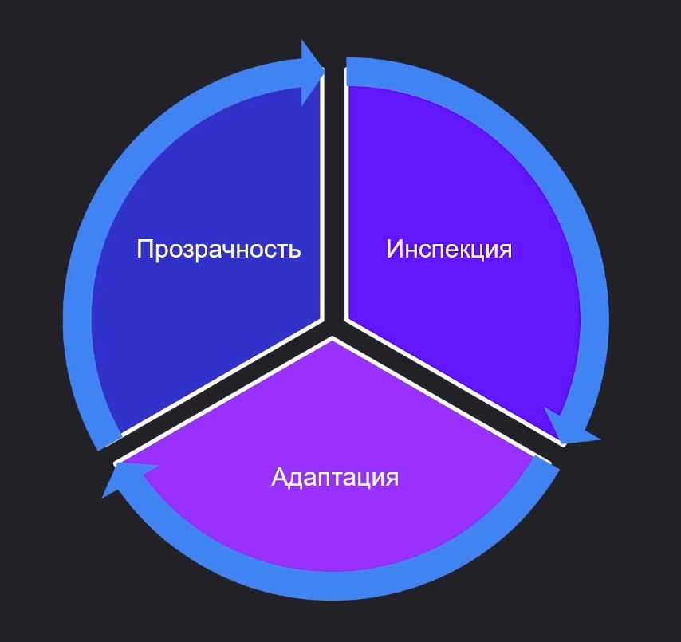

#### Заключение:

Эмпиризм в Agile служит фундаментом для создания гибких и эффективных рабочих процессов, позволяя командам быстро адаптироваться к изменяющимся требованиям и реализовывать проекты с оптимальными результатами.

#### Спиральная модель. Time to Market. Rational Unified Process

##### Спиральная модель

Данная модель опирается на потребность в изготовлении раннего прототипа, тестирования и выпуска в маркет. Здесь находится достаточно большое количество шагов, на которых мы просто проверяем прототипы и анализируем потребности в разработке фичей, что сильно замедляет процесс разработки.

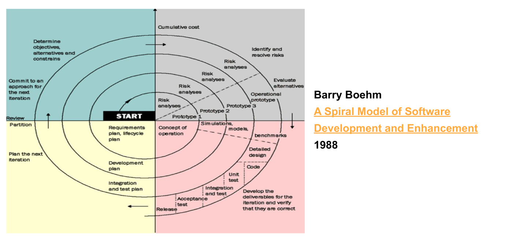

Но из основных недостатков можно выделить:

1. Тестирование реального продукта происходит на позднем этапе
2. Частые промахи по срокам и бюджету
3. Долгий Time to Market (TTM)

##### Rational Unified Process (RUP)

RUP использует итеративную модель разработки. В конце каждой итерации (в идеале продолжающейся от 2 до 6 недель) проектная команда должна достичь запланированных на данную итерацию целей, создать или доработать проектные артефакты и получить промежуточную, но функциональную версию конечного продукта.

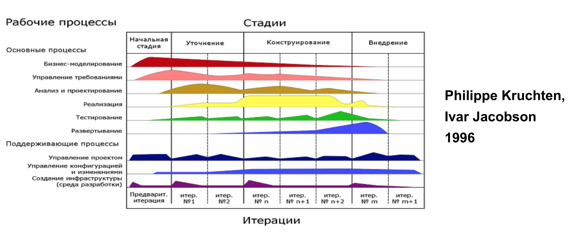

Плюсы:

1. Ранняя идентификация и устранение рисков
2. Концентрация на выполнении требований заказчика
3. Изменения в продукте от заказчика Ожидаются
4. Компонентная архитектура, которая реализуется и тестируется на ранних стадиях
5. Постоянное обеспечение качества на всех этапах разработки продукта
6. Работа в сплочённой команде с ключевой ролью у архитекторов

Из недостатков можн выделить:

1. Большой TTM
2. Срыв сроков и бюджета
3. Тяжеловесность фреймворка
4. Тестирование реального продукта происходит на позднем этапе

В последствии RUP IBM переименовала в OpenUP

#### Обзор Extreme Programming. Ценности

Экстремальное программирование - это сбор лучших практик из программирования и максимально частое их повторение.

Эту методологию разработал Кен Бек в 1999 году.

12 приёмов XP:

1. Разработка через тестирование (Test-driven development)
2. Игра в планирование (Planning game)
3. Заказчик всегда рядом (Onsite customer)
4. Парное программирование (Pair programming)
5. Непрерывная интеграция (Continuous integration)
6. Рефакторинг (Design improvement)
7. Частые небольшие релизы (Small releases)
8. Простота проектирования (Simple design)
9. Метафора системы
10. Коллективное владение кодом (Collective code ownership)
11. Стандарт оформления кода (Coding standard)
12. 40-часовая рабочая неделя (Sustainable pace)

Для применения практик самое важное - это понимать ценности данного подхода.

- **Общение** - это крайне важно на каждом этапе разработки продукта. Это самая важная ценность, которая дополняет все ценности.
- **Простота** - решения должны быть простыми и решать определённые проблемы без оверинджиниринга там, где это не нужно
- **Обратная связь** очень важна во время общения с заказчиком, потому что все его недовольства и пожелания нужно учитывать вовремя и эффективно
- **Смелость**. Не нужно откладывать решение какой-то видимой проблемы на потом, лучше всё сделать сейчас даже если менеджер не поставил таску на решение этой проблемы
- **Уважение** - нужно уважать опыт и мысли каждого члена команды

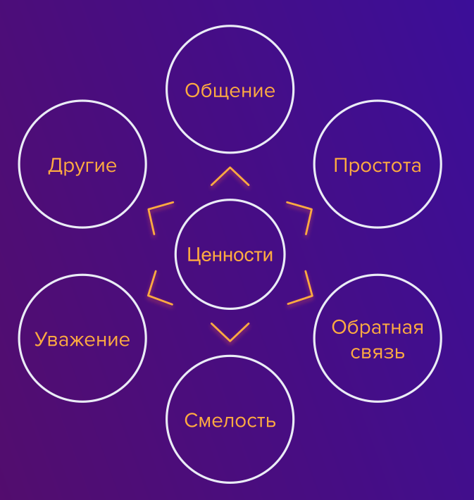

Самое важное - это понимать, для чего мы используем каждый из подходов, потому что сам по себе подход может быть не нужен для каждой конкретной ситуации.

---

## Оптимизиации рабочего процесса

Введение Agile-подходов и практик может быть тяжело введено в разработку из-за непонимания разработчиками сути данных практик.

Проблема распространения Agile заключается в том, что практики распространяют менеджерским языком, а не языком разработчика.

Можно достаточно легко разобраться с возможностью упростить свой рабочий процесс

У нас есть определённые критерии оптимизиации процессов разработки:

- Удобство для разработчиков
- Вовлечённость - уменьшает текучку кадров и поднимает имидж компании за счёт более интересной подачи задачи, описания её значимости и разнообразности задач
- Прибыльность бизнеса
- Лояльность клиентов
- Продуктивность разработчиков - создание условий, в которых разработчики предоставляют более ценные решения за счёт предоставления им бОльшего количества времени на разработку
- Time To Market - сокращение времени от идеи до выхода на рынок

Далее пойдут темы, которые опишут подходы оптимизации рабочего процесса:

### Автоматиизации

Автоматизация - ключ к повышению эффективности и качества работы разработчиков. Путем фиксации и анализа рутинных процессов, команды могут значительно ускорить свою работу, минимизировать ошибки и уделить больше времени творчеству и инновациям.

Часто разработчики автоматизируют множество действий клиента и упрощают ему жизнь, но не автоматизируют свои простые рутинные процессы, что увеличивает время разработки.

Самые простые пути автоматизации труда разработчиков:

- Применение линтеров и форматировщиков кода для обеспечения соответствия стандартам;
- Автоматическое тестирование вместо ручных тестов;
- Непрерывная интеграция и развертывание (CI/CD) для облегчения процесса сборки и развертывания (потому что если разработчик будет это делать сам, то процесс будет тратить много времени и компания завяжется на сотруднике);
- Планирование встреч для обсуждения сложных вопросов, минимизация общения через мессенджеры;
- Создание и поддержание актуальной документации для ускорения адаптации и работы сотрудников.

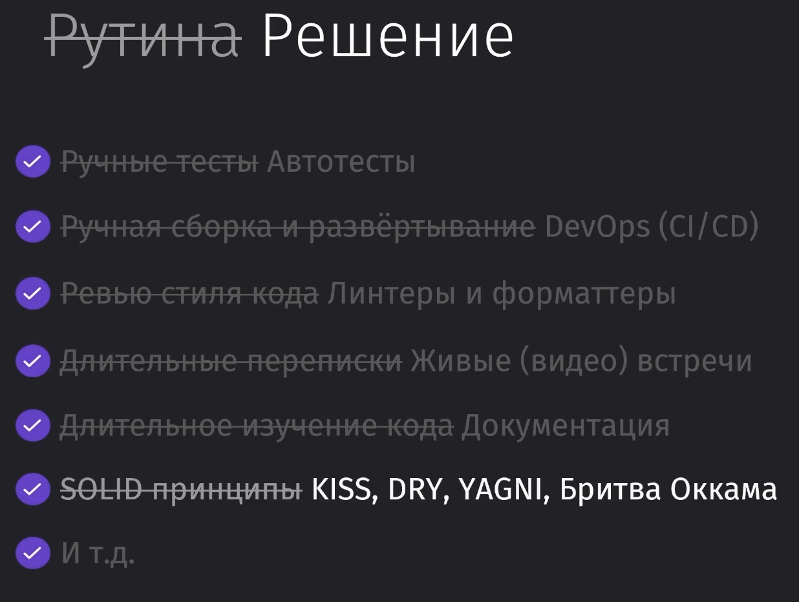

Так же нам нужно думать над предотвращением потери скорости разработки за счёт переусложнения кода различными подходами и методиками, которые увеличивают количество кода и сложность поддержки.

#### Практические шаги к автоматизации

1. Зафиксировать все рутинные действия в течение 1-2 недель.
2. Придумать до трех возможных автоматизированных решений для каждой обнаруженной рутинной задачи.
3. Выбрать и автоматизировать одну из рутин, уделяя внимание именно той, что вызывает наибольшие неудобства.

### Целеполагание

Целеполагание - это постановка и достижение целей.

Целеполагание важно для оптимизации рабочих процессов, особенно в командах разработчиков, где требуется совместная работа и обсуждение целей.

В идеальных условиях, все участники команды понимают конечную цель, которой нужно добиться во время создания приложения.

Эффективное формирование целей уменьшает срок и ветиеватость разработки.

Цели есть как индивидуальные под каждого разработчика, так и общие для всей команды. Общие цели помогают коммуницировать и взаимодействовать команде во время реализации продукта.

#### Принципы и методы

Для эффективной разработки продукта нужно сразу решить следующие вопросы:

- Определить критерии достижения цели (по этим критериям должно быть понятно, что заказчик получил полностью удовлетворяющий его продукт)
- Создание условий для качественной коммуникации (на коммуникацию зачастую выделяется очень мало времени на планирование, уточнение и поиск оптимального решения)
- Декомпозиция и эмпиризм (большие цели нужно делить на более маленькие и организовать эмпирический подход)
- Обсуждать сразу несколько вариантов решения
- Методика SMART - специфический, измеримый, амбициозный, релевантный, ограниченный во времени подход к постановке целей.

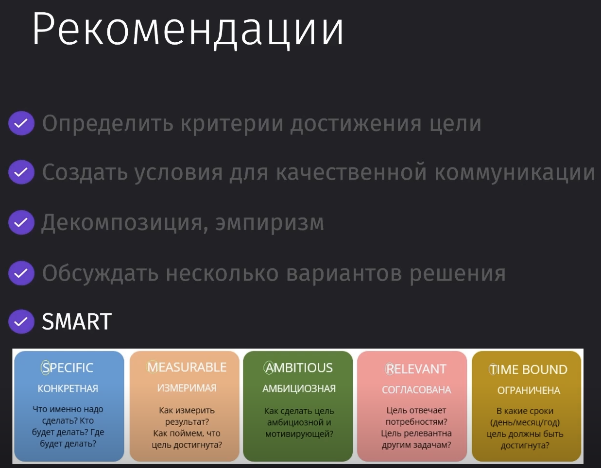

Так же можно воспользоваться хорошим подходом **4 вопроса планирования/коучинга**, на которые можно ответить в любом порядке и замкнуть круг потребностей - чего хочется достичь, почему это важно, критерии достижения, варианты решения.

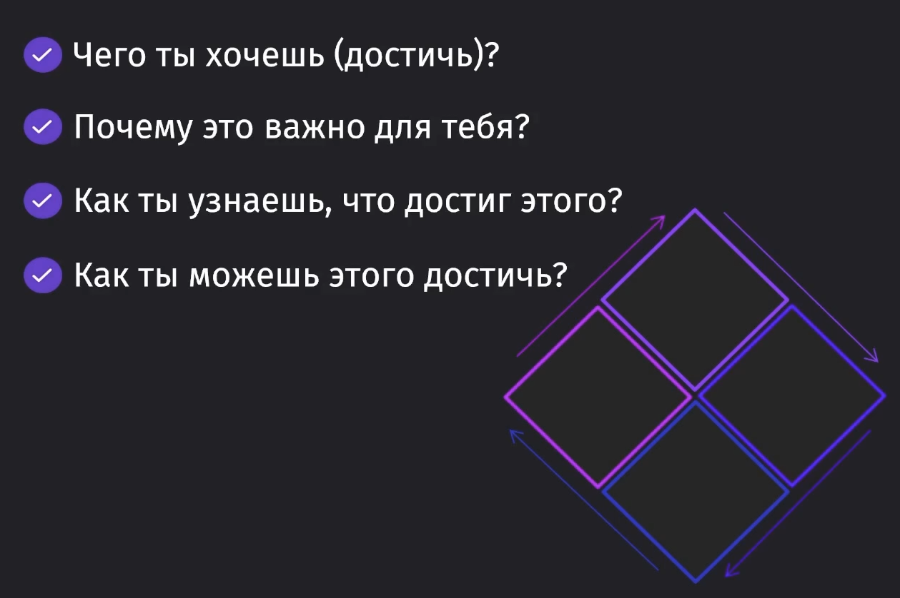

#### Самопомощь и Самокоучинг

Так же можно задать себе 8 вопросов, которые помогут разобраться с пониманием текущих задач, глубже понять свои цели и пути их достижения:

- Что ты хочешь сделать? (мы часто делаем то, что сами не можем назвать)
- Зачем ты хочешь это сделать?
- Какая личная выгода от того, что ты это сделаешь?
- Какие твои индивидуальные способности помогут сделать это с максимальным качеством и за минимальное время?
- Что ты будешь делать, чтобы сделать это с максимальным качеством и за минимальное время?
- Какими должны быть условия, чтобы сделать это с максимальным качеством и за минимальное время?
- В каком случае ты будешь максимально удовлетворён?
- Какие твои шаги ты видишь?

В практике можно попробовать сформулировать и определить личные и командные цели.

#### Заключение

Целеполагание важно для оптимизации рабочих процессов, особенно в командах разработчиков, где требуется совместная работа и обсуждение целей.

### Математический рассчёт

Самый банальный метод расчёта эффективности определённого выбора заключается в банальной математике.

Мы определяем, какие автомобили мы хотим производить, чтобы зарабатывать больше всего. Делим прибыль на время производства и получаем месячный результат по каждой машине. Самой выгодной является самая быстрая в производстве.

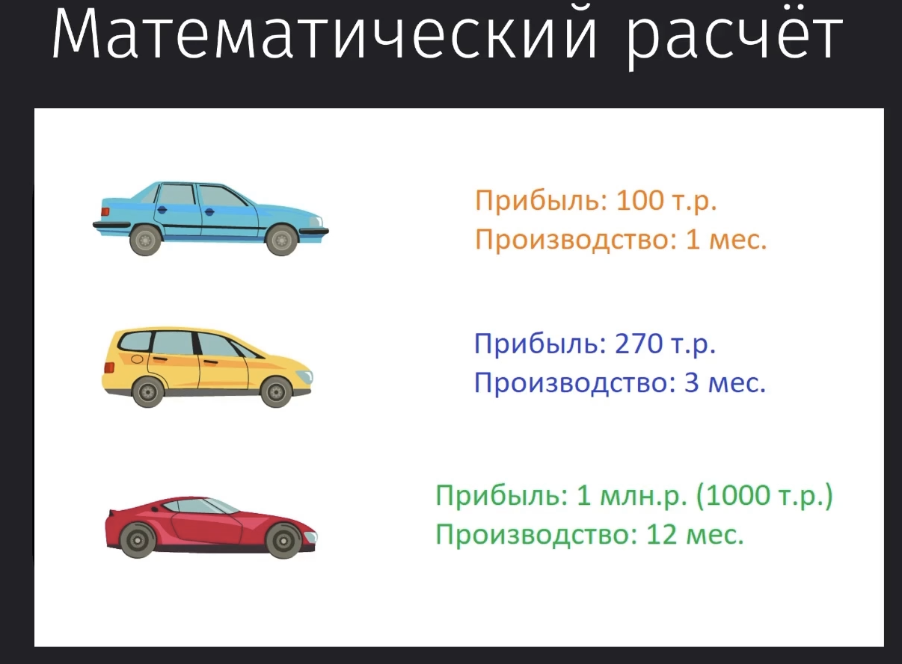

Из вышестоящей математики можно предположить, что в реальной жизни очень много переменных и для разработки большого продукта обычная математика подходить уже не будет в полной мере.

Использовать математический подход будет актуально в следующих случаях:

- `(доход - стоимость разработки) / время`
    - для маленьких проектов написать код расторопно есть смысл, но если сделать быстро, то такой код будет тяжелее поддерживать и ошибок может стать больше
    - стоит выделять время на поддержку инфраструктуры приложения
- Выгода от автотестов
    - стоит ли их писать, будут ли большими репутационные или денежные потери от ошибок
- Agile тренер / самостоятельное внедрение
    - выгодно ли внедрять самостоятельно или через тренера для большой команды
- Время на обсуждения или Время на исправления
    - нужно ли тратить много времени для реализации фичи, ведь если проект маленький или задачи маленькие, то выгоднее время потратить на доработки

#### Расширение применения расчетов

- Введение идеи о том, что подходы, основанные на математическом подсчете, могут быть применены для улучшения различных аспектов рабочего процесса:
    - Оптимизация времени и ресурсов на поддержку кода.
    - Рациональное распределение времени на автотесты.
    - Эффективность проведения встреч и управления временем.

#### Практические упражнения

- **Наблюдение и сбор информации:** Измерение времени, затраченного на разные типы встреч и активности в рамках рабочего процесса.
- **Анализ и оптимизация:** Анализ данных о времени и предложения по его оптимизации для увеличения эффективности.
- **Решение о внедрении автотестирования:** Расчет целесообразности внедрения автоматических тестов с учетом затраченного времени и ресурсов.

#### Заключение

Математический расчёт позволит эффективнее определять, на что стоит тратить время во время разработки продукта и сколько этого времени нужно уделять.

### Управление вниманием

Важно уметь управлять вниманием разработчика во время разработки продукта, потому что может быть тяжело сконцентрироваться на одной задаче и завершить её.

Множественные задачи и отвлекающие факторы снижают эффективность.

Сам по себе разработчик во время выполнения задачи должен учитывать множество факторов:

- Архитектура
- Множество способов решения задачи
- Критерии
- Оборудование
- Внутренние стандарты оформления кода
- Задач может быть множество
- Ошибки по разным задачам могут всплывать в разные моменты времени

Психолог Джордж Миллер сделал вывод в результате своих исследований, что внимание человека способно фокусироваться ограниченно, в среднем на 5-9 объектах.

Чтобы улучшить управление вниманием, мы можем:

1. Уменьшить количество объектов в поле нашего внимания:
    - Исключение лишних данных (иногда некоторые моменты не нужны нам для решения задачи)
    - Группировать данные и задачи
2. Реорганизовать работу:
    - Структурировать файлы и документацию
    - Разделение задач на подзадачи
    - Оптимизация работы в команде

Так как до 9 объектов может быть в поле зрения, поэтому и любая команда может быть до 9 человек (исключая вас).

По закону Брукса, если проект не укладывается в сроки, то добавление рабочей силы увеличивает общий объём затрат:

- Труд по перекраиванию задач, которое нарушает дальнейшую работу
- Обучение новых людей
- Дополнительное общение

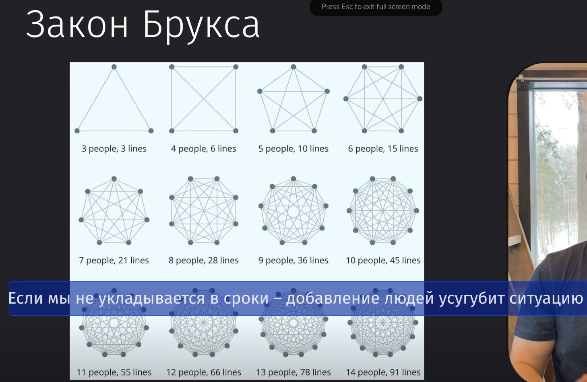

От увеличения количества человек в команде мы не выиграем сильно, потому что сильно увеличится количество возможных связей. _Сложность связей растёт нелинейно_.

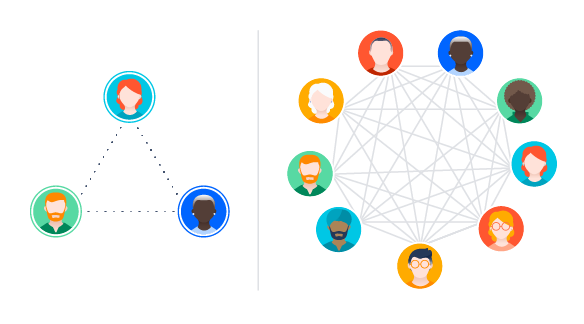

#### Вопросы для самоанализа:

1. Проанализировать размер команды и её коммуникации. И насколько комфортно при такоим количестве участников. Как можно реорганизовать команду. Сколько человек нужно для более качественных связей.
2. Оценить количество рабочих и личных чатов.
3. Осмыслить количество микро- и макрозадач.
4. Рефлексировать по желаемым изменениям в организации внимания.
5. От чего хочется избавиться или перегруппировать.

### Приоритизация

Очень важную роль в управлении командой так же забирает на себя приоритизация задач. У продукта есть множество различных интересантов в виде клиентов, которые хотят более удобный продукт, который решает их проблемы, есть бизнес, который хочет, чтобы приложение приносило деньги и есть комфорт сотрудников, которые выполняют задачи в той последовательности, в которой задачу будет решить эффективнее.

Например, нам нужно реализовать пуш-уведомления в браузерном приложении и для реализации этой задачи сначала стоит разобраться с Service Workers внутри браузера, чтобы в процессе не возникало конфликтов реализации.

Так же у бизнеса могут быть свои как тактические, так и стратегические интересы, которые могут не сходиться и противоречить друг другу.

> Между всеми этими интересами нужно балансировать. И мы должны чётко понять, что **не все задачи одинаково важны** и **выбирать задачи нужно по степени их вклада в результат**.

Чтобы приоритизировать задачи, можно:

- **Использование "козырей"**. Определить, где больше будет профита (тактика/стратегия).
- **Тушение пожаров**. Сохранять баланс между фундаментальными и прорывными задачами для предотвращения кризисных ситуаций.
    - _Фундаментальные задачи_ позволяют укрепить стойкость приложения и получить определённые ресурсы, на которое можно будет опереться
    - _Прорывные задачи_ добавляют новый функционал в приложение за счёт использования новых ресурсов, чтобы достичь новые высоты
    - Между этими задачами нужно балансировать, потому что без первого достичь второго будет становиться с каждым разом всё тяжелее и тяжелее
- **Карта зависимостей**. Определение связей и возможностей для их уменьшения или устранения.

#### Метод Эйзенхауэра

Как один из вариатов для определения срочных, важных и не очень задач, можно использовать метод Эйзенхауэра, в котором мы определяем, какие задачи можно сделать, отложить, делегировать или вовсе не делать.

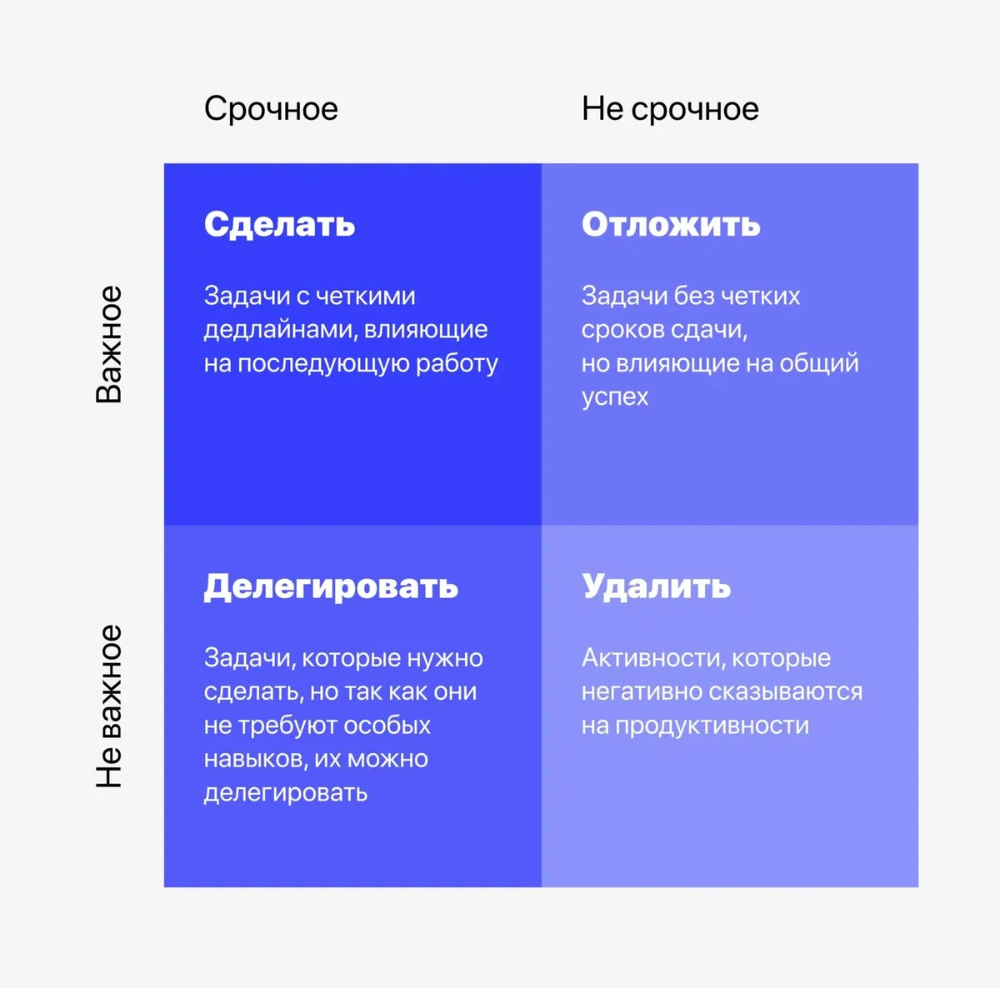

Мы можем сгруппировать задачи, описать их, оценить их срочность и важность в балловой системе, а только затем уже решать.

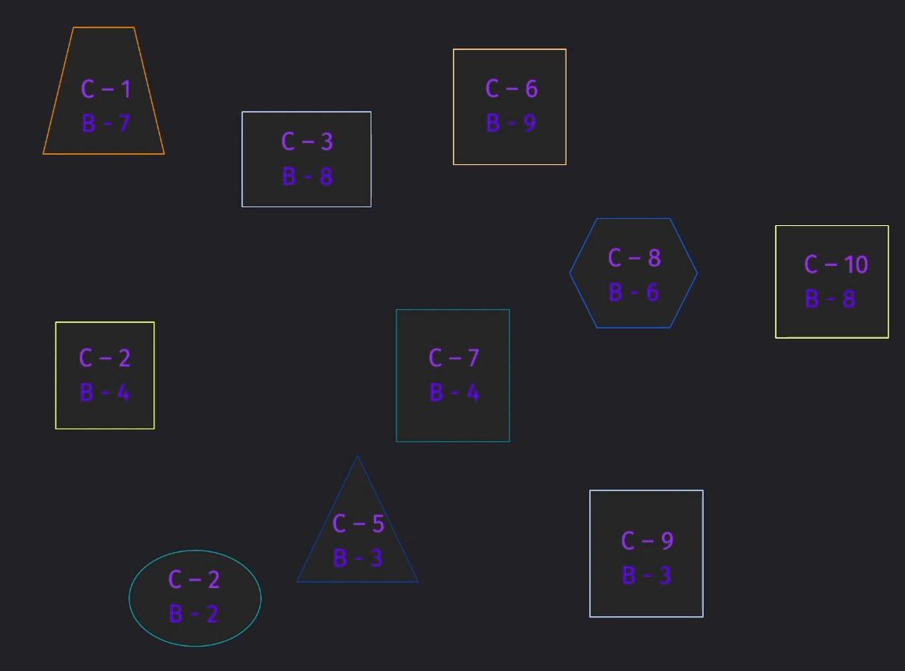

Далее нужно соотнести все задачи по срочности и важности на графике с данными координатами

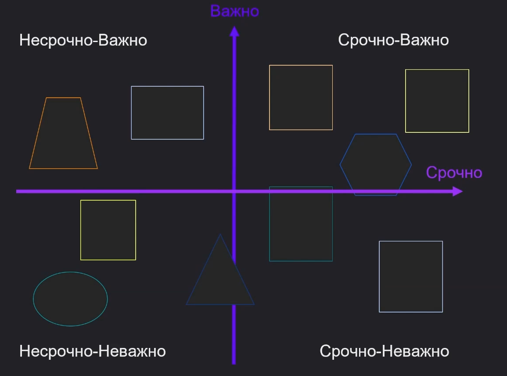

#### Что можно сделать для определения приоритетов

- Выборать ключевой проект
- Детализировать активности проекта
- Описать зависимости между активностями
- Применить матрицу Эйзенхауэра для организации приоритетов
- Спланировать реализацию по приоритетам

#### Заключение

Приоритизация задач очень важна в управлении проектами, потому что помогает фокусироваться на ключевых задачах, которые принесут максимум профита, и оптимизировать рабочие процессы.

### Инженерные практики

> [!info] **Инженерные практики** - это самый популярный подход к оптимизиации рабочего процесса. Это набор поведенческих и технических решений, которые направлены на разработку продукта.

---

Таковыми можно назвать практики **экстремального программирования (XP)** или написание low-level документации (LLD).

> LLD - это описание работы функций, классов, методов прямо рядом с кодом посредством комментариев (summary, json-doc) или README.

Очень часто ИП связывают с XP, но это не так. XP, как полнцоенный Agile-фреймворк, ссылается на определённые инженерные практики, но не является их олицитворением. Тот же LLD не входит в экстремальное программирование.

#### Ключевые Инженерные Практики

1. **Стандарты Кода**: Создание и поддержка единых стандартов оформления кода
    - Использовать linters и formatties
    - Уменьшить количество недопониманий в команде
2. **Коллективное Владение Кодом**: Ответственность всей команды за весь код проекта.
    - Это повышает качество кода и его поддерживаемость за счёт более компетентного ревью.
3. **Разработка Через Тестирование (TDD)**: Сначала пишутся тесты, затем код.
    - Позволяет сделать требования более прозрачными
    - Описывает всю будущую бизнес-логику до написания самого кода
4. **Непрерывная Интеграция (CI/CD)**: Автоматическая сборка, тестирование и развертывание кода.
5. **Частые и Небольшие Релизы**: Согласно agile принципам.
6. **Заказчик всегда рядом**: Важность ежедневной обратной связи от пользователей.
7. **Парное Программирование**: Работа над кодом в паре для повышения эффективности.

### Заключение

Инженерные практики очень важны при написании продукта, так как помогают более эффективно работать команде над большим проектом и поддерживать его эффективнее.

---

## Kanban

#agile #kanban

> [!info] **Kanban** (яп. сигнал, карточка, квитанция) - это метод, который является частью многих других фреймворков. Он описывает способ распределения задач и их ведения.

#### История Канбана

- Основа метода - опыт Toyota, начиная с 1926 года.
- Toyota перешла от производства ткацких станков к автомобилям, уделяя особенное внимание постоянному улучшению процессов.
- Важным этапом стало внедрение вытягивающей канбан-системы в 1948 году, ускоряющей производственный процесс за счёт изготовления по сигналу определённые детали для определённых моделей машин.
- Термин «бережливое производство» (Lean Manufacturing) был введён в 1988 году Джоном Крафчиком, описывающим подобные подходы.
- Дэвид Андерсон в 2006 году сформулировал Канбан-метод, вдохновляясь идеями бережливого производства и системой Toyota.

#### Ключевые принципы Канбана

- **Сервис**
    - Канбан сосредоточен на поставке результатов на основе услуг
- **Поток ценности**
    - Важно понимание потока ценностей от команды разработчиков
    - Важнее сосредоточение на доставке ценности, чем на выполнении задач
- **Уникальность каждого процесса**
    - Подход должен быть адаптирован под процессы в компании
    - Метод должен быть подогнан индивидуально для каждого случая
- **Методология эволюционного улучшения**
    - Вместо радикальных изменений, нужно делать прогресс маленькими шажками
    - Начните то, чем вы сейчас занимаетесь и улучшайте это
- **Вытягивающая канбан-система**
- **Договорённости**
    - На всех уровнях от разработки, менеджеров до заказчиков - все должны иметь определённые договорённости между собой по продукту

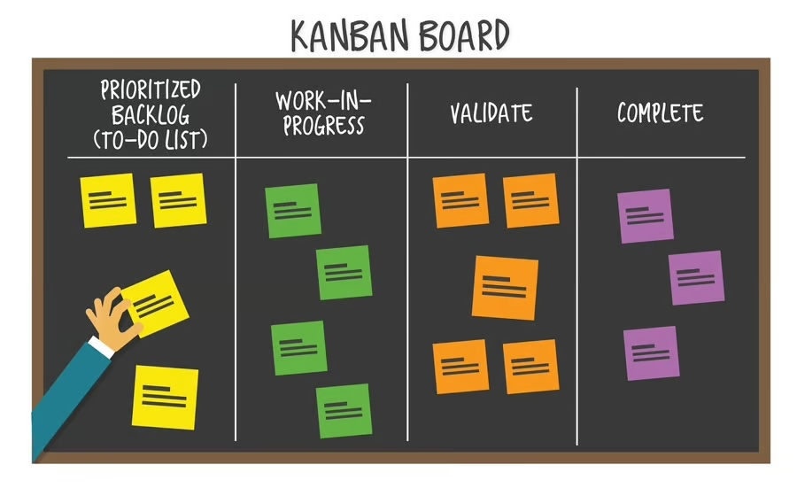

#### Канбан и Agile

Для того, чтобы определить сущность Kanban, нужно обратиться к терминологии. Методика, метод и методология - это научные термины, которыми описывают различные сущности.

> Методика - это рецепт, алгоритм. Чётка последовательность действий для достижения результата.

> Метод - способ достижения цели. Это группа возможных способов достижения результата.

> Методология - это учение о поиске подходящих методов.

> Фреймворк - это жёсткий набор определённых правил и методологий, которые мы применяем для достижения результата. То есть у нас есть определённый набор инструментов, из которого у нас получится определённый результат.

Kanban шире методов и принципов Agile, поэтому так же и не является Agile-методом или методологией. Его можно встроить и подстроить под эти принципы.

#### Заключение

Для более подробного изучения материала по Kanban и доступа к сертифицированным тренингам, можно воспользоваться [Kanban University](https://kanban.university/).

Так же можно почитать книги Дэвида Андерсона о Канбане и "Дао Тойота" Джеффри Лайкера для глубокого понимания метода и его истории.

### Ценности

Как и у любого другого метода, у Kanban есть свои ценности, которые определяют основы этой методологии:

1. **Прозрачность** - важность полной видимости всех процессов для всех участников.
2. **Баланс** - равновесие всех аспектов работы: требований, возможностей команды, нагрузки и т.д. Оптимизировать нужно не отдельные участки, а брать во внимание весь процесс.
3. **Сотрудничество** - основа успешного рабочего процесса, заключается в качественной командной работе.
4. **Ценность Клиента** - ориентированность на нужды и приоритеты заказчика, создание ценности для него.
5. **Поток** - понимание и управление потоком создания ценности, знание его этапов и влияющих на него факторов.
6. **Лидерство** - принятие ответственности, умение вдохновлять и вести за собой. _Это одна из важнейших ценностей kanban-метода._
7. **Понимание** - знание текущего состояния процесса и направления его развития, умение различать полезное и вредное.
8. **Согласие** - умение прийти к совместным договоренностям и соблюдать их.
9. **Уважение** - основа всех принципов и ценностей Канбан, взаимное уважение внутри команды.

#### Как определить ценность:

1. Что в команде понимают под ценностью, которую они производят?
2. Как эта ценность может проявляться?
3. Как эта ценность проявляется в вашей команде?
4. Как хотелось бы, чтобы она проявлялась?
5. Предложения по улучшению рабочего процесса.

### Модель зрелости

> [!info] **Модель зрелости Kanban** - это набор рисков, рекомендаций и практик в зависимости от текущего уровня зрелости компании.

Модель зрелости Kanban описывает эволюцию организационных процессов через семь уровней от нулевого до шестого. Эти уровни помогают компаниям ориентироваться в своем развитии и внедрении лучших практик.

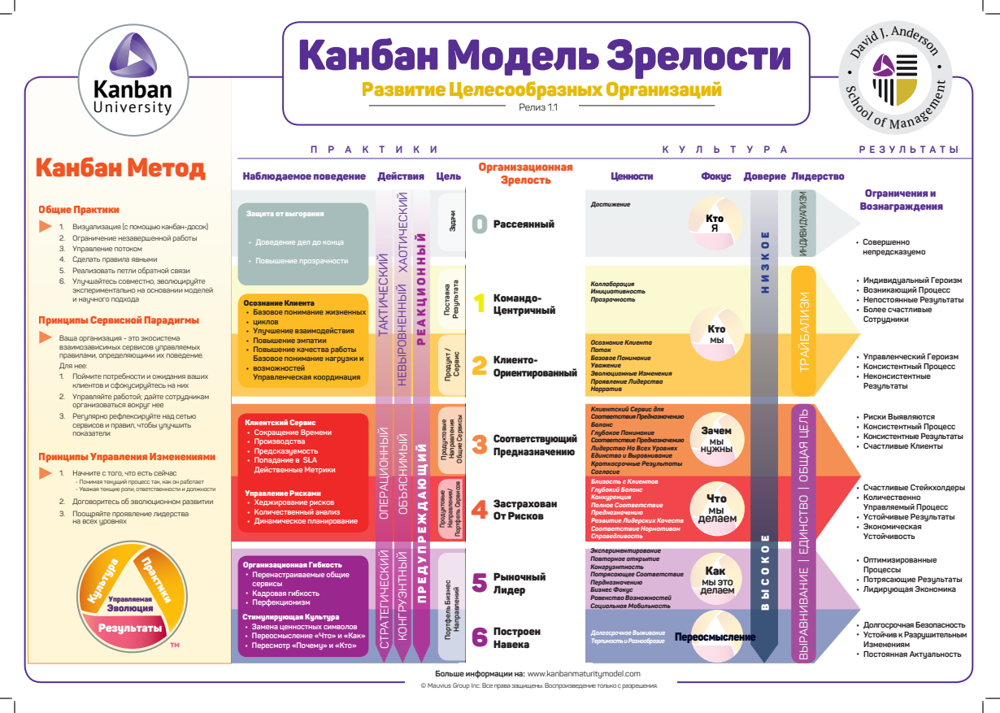
[ПДФ](https://files.kaiten.ru/d94fa916-2217-49b9-a621-8b86a2e0efee/97ecf6a7-7e95-4565-b8da-9552cc816b75.pdf?name=KMM-A3-CoBranding-V18-1_RUS_1.pdf)

Всего насчитывается **196 практик**, количество которых продолжает расти. Эти практики касаются различных аспектов работы компании, включая организацию, взаимодействие с клиентами, управление рисками и продуктами.

#### Уровни Зрелости

1. **Рассеянный** (0) — Отсутствие структурированных изменений и самоориентация сотрудников. Каждый сотрудник опирается на свои результаты относительно работы.
2. **Командно-центричный** (1) — Визуализация работы и командная синхронизация. Компания осознаёт ценность командной работы, а сотрудники согласовывают правила.
3. **Клиента-ориентированный** (2) — Фокус на ценности для клиента. Команды не участвуют в этом уровне и даже могут отсутствовать.
4. **Соответствующие предназначению** (3) — Глубокое понимание потребностей клиентов и предназначения компании. Все отношения с клиентами налажены, сотрудники понимают в чём предназначение команд и компании в целом.
5. **Застрахован от рисков** (4) — Стратегическое планирование, прогнозирование результатов, формированию бюджетов и снижение рисков.
6. **Рыночный лидер** (5) — Узнаваемый бренд с понятным качеством и оптимизация процессов (уменьшение затрат, увеличение скорости поставки).
7. **Построен на века** (антихрупкость) (6) — Гибкость и способность к быстрой адаптации.

Всю более подробную информацию можно черпнуть из книги Дэвида Андерсона и Теодора Божевой "Модель зрелости Канбан", сайт [kmm.plus](https://kmm.plus/en/).

#### Заключение

Модель зрелости Kanban - это мощный инструмент для развития и оптимизации рабочих процессов в компании, позволяющий более эффективно соответствовать потребностям клиентов и условиям рынка.

### Роли

> [!info] **Роль** - это набор функций, которые может выполнять один человек, группа людей или вся команда.

Нужно отметить, что не всегда отдельная роль - это отдельный человек с отдельной позицией. Роль могут выполнять разные люди в разные моменты времени. Однако в том же Scrum работу мастеринга выполняет отдельный Scrum-мастер.

В Сбербанке некоторые Kanban-роли совмещены и называются Service Delivery Lead.

В Kanban выделяют две ключевые роли: 

- Service Delivery Manager (SDM)
- Service Request Manager (SRM).

#### Service Delivery Manager (SDM)

> SDM - менеджер поставки сервиса. Он отвечает за предоставление сервиса.

Задачами SDM являются:

- **Ответственность за поставку:** Убедиться, что услуга или продукт доставлен заказчику.
- **Планирование, координация и контроль:** Назначать задачи, проводить ежедневные собрания, контролировать препятствия и выполнение задач.
- **Коммуникация с клиентами:** Строить контакты, выявлять потребности, уточнять детали.
- **Анализ рисков:** Управление рисками, разработка стратегий их снижения.
- **Бюджетирование:** Участие в планировании бюджета.
- **Развитие команды:** Организация обучения, проведение мастер-классов, составление карты компетенций.

Выполняет эту работу, как правило: Team Lead или менеджер продукта, в Scrum - вся команда.

#### Service Request Manager (SRM)

> SRM - менеджер запросов к сервису

Задачами SRM являются:

- **Выбор работы для команды:** Определение, над какими задачами должна работать команда.
- **Коммуникация с заказчиками:** Выявление потребностей, общение, установление приоритетов задач.
- **Работает с большими задачами**. Декомпозиция крупных задач, управление со-зависимыми задачами, решение вопросов.
- **Определяет приоритеты**. Различает степень потребности в определённых фишках от заказчиков.
- **Управляет зависимостями задач**. Определяет зависимости между задачами и выстраивает последовательность и приоритеты их выполнения.

Выполняет эту работу, обычно: Клиент-менеджер, менеджер-продукта, владелец-продукта.

#### Реализация:

1. Определить и записать, кто такие SDM и SRM в компании, какие их функции и задачи.
2. Рассмотреть, как распределяются эти роли в команде, и как это влияет на работу.
3. Как изменения в выполнении этих ролей могут улучшить рабочий процесс, командную работу и в итоге принести пользу компании.

#### Заключение

Рассмотрение этих ролей позволит более эффективно организовать рабочий процесс, улучшить взаимодействие между командой и заказчиками, а также способствовать лучшему пониманию и выполнению задач.

### Каденции

> Каденции - это очень близкое к эмпиризму из Agile понятие.

> [!info] Каденции - это регулярные встречи, на которых происходят озвучивание текущей ситуации, рефлексирование и планирование действий на основе известной инфомрации.

> Каденции = Петли обратной связи = Циклы обратной связи = События = Командные встречи

Качество зависит от высокого уровня прозрачности, инспекции и адаптации.

Если в scrum все события обязательны, то каденции в Kanban могут как проводиться, так и не проводиться.

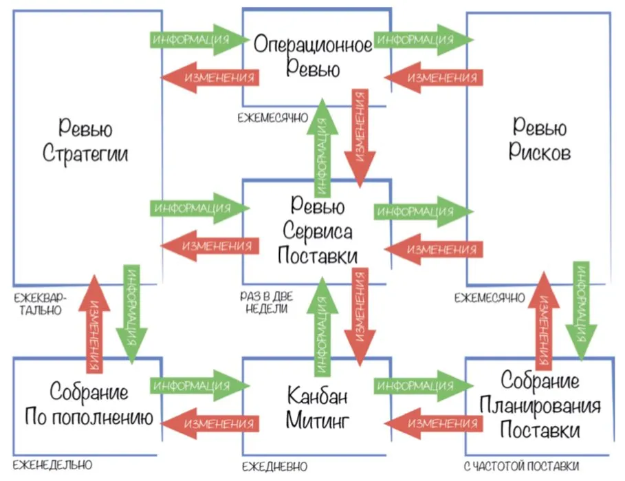

#### Виды Встреч

Типы встреч и их аналоги в Scrum:

1. **Ежедневный Канбан (Канбан митинг) (= Ежедневный Скрам)**
    - Формат: Ежедневная короткая встреча.
    - Задачи:
        - Анализ текущего потока
        - Устранение препятствий
        - Переставление задач на доске
2. **Собрание по Пополнению (Планирование Спринта)**
    - Периодичность: Рекомендуется еженедельно.
    - Задачи:
        - Определение списка задач, которые берут в работу (точка принятия обязательств)
3. **Обзор Сервиса Поставки (Ревью Спринта / ретроспектива)**
    - Участники: Включая конечных пользователей.
    - Цель:
        - Определить удовлетворенность клиентов
        - Определение способов улучшения сервиса.
        - В Kanban и Scrum: Анализ выполненной работы для улучшения процессов.
4. **Планирование Поставки**
    - Особенность Kanban: Собрание для определения готовых к поставке задач.
5. **Уточнение Бэклога** (это _upstream_ этап)
    - Цель: подготовка работ до пополнения.
6. **Ревью Стратегии**
    - Периодичность: Раз в квартал.
    - Цель: Сверка глобальных целей, адаптация дорожной карты.
    - Встречаются руководители разных уровней и «сверяют часы» по глобальным целям (верно ли идём, куда двинемся дальше), адаптируют дорожную карту
7. **Операционное Ревью**
    - Цель: Улучшение координации между командами, повышение эффективности.
    - Встречаются менеджеры разного уровня, чтобы способствовать лучшему взаимодействию команд, устранению препятствий, повышению эффективности компании в целом
8. **Ревью Рисков**
    - Задача: Выявляются риски и узкие места для своевременного противостояния им.

Последним трём пунктам нет аналогов в Scrum, так как Kanban распространяется не только на команду, но и на всю организацию, а Scrum только на одну команду.

#### Внедрение

1. **Ежедневные Встречи:** Оцените их проведение в команде.
2. **Собрание по Пополнению:** Как оно организовано?
3. **Обзор Сервиса Поставки:** Есть ли у вас демонстрации?
4. **Релизная Политика:** Кто и как её проводит?
5. **Предложения:** Ваши идеи по улучшению рабочего процесса, с учетом каденций.

#### Заключение

Каденции в Kanban так же важны, как и эмпиризм в Agile.

### Общие практики

Каждый этап модели зрелости соотносится с 6 основными практиками канбана, описанными в книге Дэвида Андерсона.

Практики модели зрелости - это частные случаи для каждой компании.

**Модель зрелости** включает в себя **196 практик**, организованных вокруг 6 основных практик канбана. Эти 6 практик служат основой, поверх которой развиваются более конкретные подходы для каждого уровня зрелости компании.

#### 6 Практик Канбана

1. Визуализация рабочего процесса
    - Использование канбан-досок для наглядного указания самой задачи и этапа её производства;
2. Ограничение количества работы в процессе (Work in Progress - WIP)
    - Мы должны ограничивать количество незавершённой работы, чтобы увеличить скорость разработки продукта и предотвратить перегрузки на определённом этапе;
    - Каждый столбец с этапом мы делим на две части (`doing|ready`) и от этого уже идём дальше
    - Ограничиваем максимальное количество задач в колонке. По достижению этого максимума - дальше уже перемещать в колонку задачи нельзя
    - На ежедневных встречах SDM просматривает задачи справа налево и пытается устраить перегрузы
    - Каждый перегруз - это явное препятствие
    - 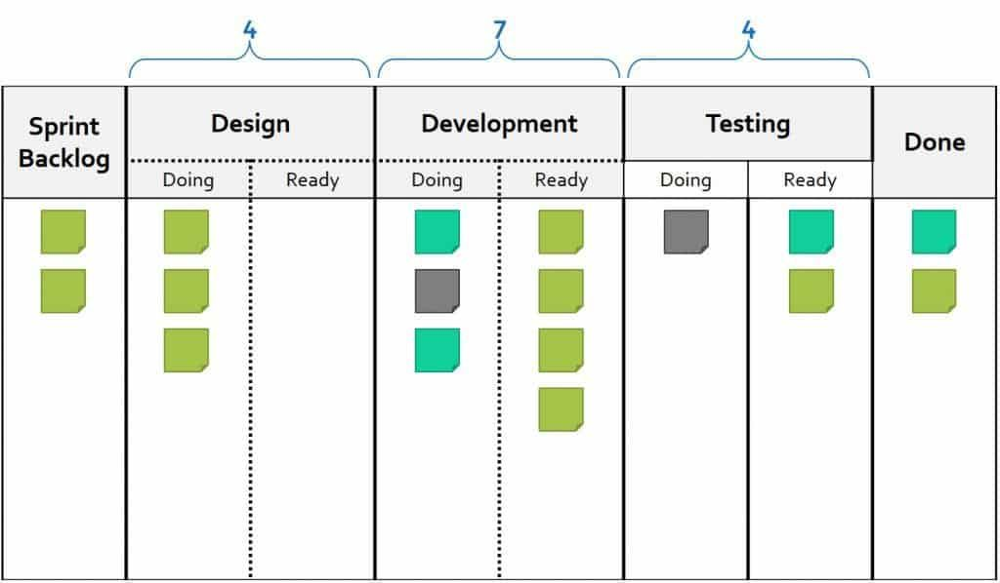
3. Управление потоком
    - Поток должен быть предсказуем
    - Проводите ежедневные встречи для оценки и оптимизации потока работы;
    - Используйте графики и диаграммы, в том числе накопительную диаграмму потока (CFD), для анализа эффективности; 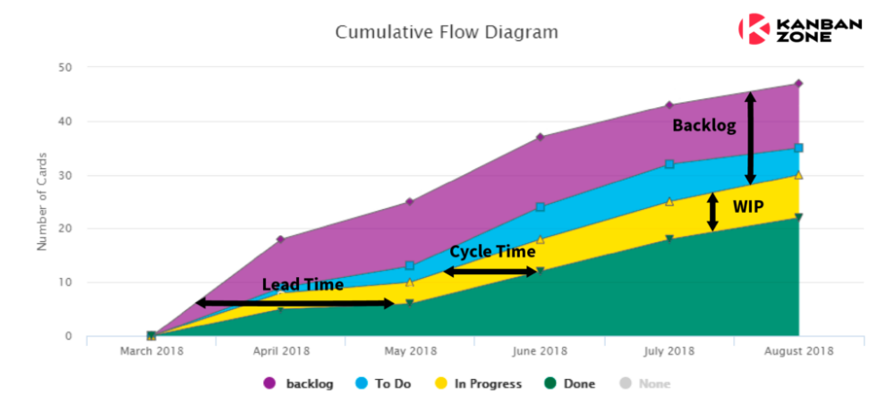
4. Ясные правила работы (договорённости)
    - Определите и сделайте явными правила и процедуры выполнения работы;
5. Циклы обратной связи (Каденции)
    - Внедряйте регулярные встречи для оценки рабочего процесса и выявления возможностей для улучшений;
6. Постоянное улучшение
    - Применяйте эмпиризм и цикл Дэминга Шухарта (PDCA) для постоянного анализа и улучшения процессов.

---

## Управление задачами

### Введение

У разработчиков достаточно большое количество разных задач. Уже эти задачи оцениваются, имеют статус и по ним можно прогнозировать релизы.

Очень важно хорошо офомлять задачи. Продуктивность команды зависит от понимания и приоритизации задач. Настройка трекера задач играет ключевую роль.

Структура хорошей задачи:

- Иерархичность: Проекты, крупные задачи и подзадачи. Задача может принадлежать проекту или более крупной задаче.
- Заголовок: Краткое описание сути задачи.
- Описание: Детализация требований. Это поле нужно обязательно заполнить, чтобы и сам разработчик понимал, в чём заключается задача и другие разработчики так же понимали в чём суть дела.
- Активность: Комментарии, изменения, коммиты, связанные с этой задачей.
- Статус: Этапы выполнения.
- Автор и исполнители: Ответственные лица.

Так же можно добавить произвольные поля в трекерах для удобства работы: приоритет, метки, эпики.

#### Управление задачами

Какие вопросы стоит проработать, когда вливаешься в задачи команды и какие вопросы нужно отрефлексировать, спросить, уточнить:

- Сколько задач в бэклоге?
- Сколько задач в спринте?
- Сколько задач назначено на одного разработчика?
- Какие этапы проходят задачи?
- Какие разновидности задач есть?
- Какие активности по оформлению задач лишние?
- Какие активности хочется добавить?

#### Заключение

Научиться эффективно работать с задачами критически важно для успеха проектов.

Понимание структуры и динамики задач поможет улучшить продуктивность и сократить время на реализацию.

### Трекеры задач

#Trello #Jira #Kaiten #YouTrack #YouGile #EvaProject

Трекер задач - это приложение, которое позволяет управлить, отслеживать и планировать задачи. Разработаны для регулирования нагрузки и планирования релизов.

> Каждое приложение продвигает свою философию управления компанией

#### Обзор популярных трекеров задач

1. **Trello**
    - Простой и с богатым функционалом.
    - Идеален для новичков, бесплатная основа с платными расширениями.
2. **Jira**
    - Широкий функционал и настройка под нужды компании.
    - Удобная интеграция с другими продуктами (confluence для документации и bitbucket).
    - Можно скачать пиратскую серверную версию для локального развёртывания.
3. **Kaiten**
    - Простой, удобный, и предлагает бесплатный тариф.
    - Ориентирован на канбан, включает разнообразные инструменты аналитики.
    - Недостаток: непривычный интерфейс для некоторых пользователей.
4. **Встроенные трекеры в системы контроля версий**
    - Например, GitLab и GitHub предлагают базовые функции трекера задач.
5. **Продукты для импортозамещения**
    - Яндекс.Трекер, EvaProject, YouGile предлагают разнообразные функции и импортозамещение.
6. **Другие инструменты**
    - YouTrack, Asana, ClickUp предлагают специфичный функционал и дизайн.

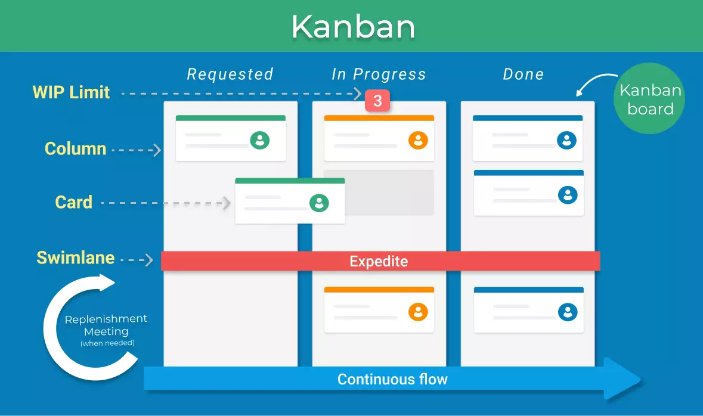

### STATIK

#kanban #STATIK

STATIK - это систематиизированный подход для внедрения канбана.

Статик (Systems Thinking Approach to Introducing Kanban) представляет собой систематизированный способ анализа и улучшения рабочих процессов, ориентированный на внедрение или оптимизацию Kanban. Это инструмент, который повышает прозрачность и улучшает процессы.

#### Основные Этапы СТАТИК

0. **Предназначение Сервиса**:
    - Определить ценность создаваемую командой или организацией.
    - Идентифицировать клиентов и их потребности.
    - Понять, как сервис влияет на клиентов.

1. **Анализ Источников Неудовлетворенности**:
    - Собрать обратную связь от пользователей, коллег и бизнеса. Что их всех не устраивает, а что нравится.
    - Классифицировать и визуализировать полученные данные.
    - Разделить причины на внутренние (внутри команды) и внешние.
2. **Анализ Потребностей**:
    - Исследовать запросы, выявить природу и условия задач.
    - Скорость поступления новых запросов
    - Какие ожидания клиентов?
3. **Анализ Возможностей**:
    - Оценить состав и возможности команды.
    - Визуализировать поток задач: сколько новых и решённых задач на единицу времени.
4. **Моделирование Рабочего Потока**:
    - Какие этапы проходят задачи?
    - Какие этапы стоит разбить на подэтапы?
    - Какие этапы нужно сгруппировать?
5. **Определение Классов Обслуживания**:
    - Классифицировать задачи по критериям стоимости задержки для эффективного распределения приоритетов.
    - Ускоренные - высокая стоимость задержки.
    - Фиксированная дата - задачи с дедлайном.
    - Стандартная - умеренная стоимость задержки.
    - Нематериальные - минимальная стоимость задержки.
6. **Проектирование Kanban-Системы**:
    - Дизайн доски и других средств визуализации
    - Правила выполнения списка задач
    - Каденции
    - Сбор статистики

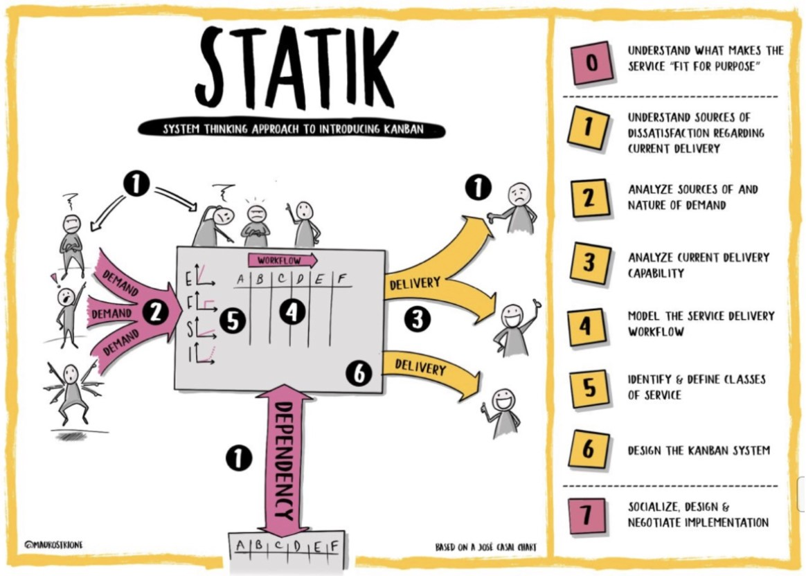

### Пользовательские истории

Epic - это глобальная задача, разбитая на множество подзадач.

Пользовательские истории - это краткое описание задач с точки зрения ценности для пользователя.

UserStory - это основной вид задач в Scrum.

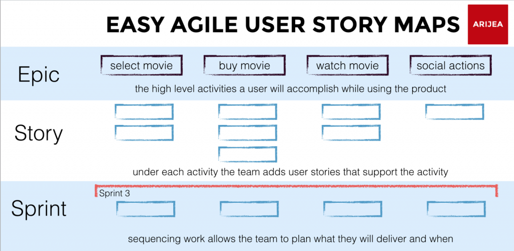

Все истории оформляются в простой формат, содержащий три части: роль, действие, ценность.

> [!abstract] Как **[роль или тип пользователя]**, я хочу/могу **[выполнить действие или получить результат]**, чтобы **[получить ценность]**

Примеры подобных историй:

1. Как **посетитель сайта**, я хочу **узнать программу тренинга**, чтобы **решить, идти на него или нет**.
2. Как сотрудник бара, я хочу налить кружку пива за 30 секунд, чтобы не скапливалась очередь.
3. Как **новый сотрудник компании**, я хочу **узнать что такое Scrum**, чтобы **лучше работать в команде**

Эти истории нам нужны, чтобы:

- улучшить понимание нужд пользователей.
- повысить эффективность работы команды за счёт фокуса на практической ценности, а не технических деталях.
- упростить формат, чтобы привести к экономии времени на планирование и реализацию.

Ключевые особенности историй заключаются в:

- Ориентированности на клиента.
- Атомарности, возможности независимой реализации.
- Интеграции в любую систему управления проектами (Scrum, Kanban).

Так же существуют критерии **INVEST** для хорошей пользовательской истории:

1. Independent (Независимая) - истории могут быть реализованы в любом порядке независимо друг от друга
2. Negotiable (Обсуждаемая) - отражает суть проблемы, а не детали
3. Valuable (Ценная) - ценная для клиентов
4. Estimable (Оцениваемая) - оцениваемая по сложности и трудозатратам
5. Small (Компактная) - компактная, может быть сделана командой за одну итерацию
6. Testable (Тестируемая) - имеет критерии приёмки

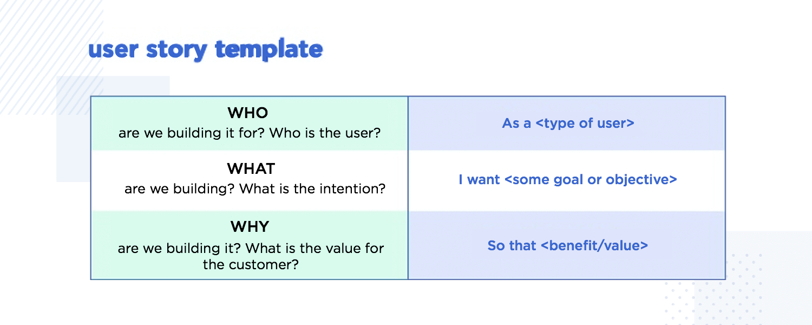

Можно попробовать адаптировать текущие задачи под пользовательские истории

1. Выбрать задачи из бэклога и оформить их в виде пользовательских историй.
2. Оценить время, затраченное на формулировку и выявить возможную экономию времени при планировании и реализации.

#### Заключение

Пользовательские истории представляют собой мощный инструмент для повышения эффективности работы команды, улучшения понимания пользовательских нужд и оптимизации процесса разработки.

### Сторипоинты

Стори-пойнты (story points) – метод оценки задач по их сложности, не прямо связанный со временем.

Используются, чтобы решить проблемы неточности оценок в человеко-часах и распределения работы в команде.

#### Проблемы оценки задач

1. **Неточности оценок**: Часто фактическое время, затраченное на задачу, значительно превышает запланированное.
2. **Неопределенность решений**: Существует много подходов к решению задач, каждый с разной временной сложностью.
3. **Неравномерная нагрузка**: Разработчики испытывают разную рабочую нагрузку, что ведет к неэффективности.
4. **Планирование итераций**: Неясно, какой объем работы брать на итерацию/спринт.
5. **Взаимодействие с заказчиками**: Трудности с оценкой сроков и бюджета могут вести к репутационным и финансовым потерям.
6. **Оценка продуктивности**: Сложно измерить и проследить эффективность работы команды.

#### Человеко-часы vs. Стори-пойнты

У нас есть базовый способ оценки затраченных ресурсов - это человеко-часы.

| Заголовок   | **Человек-часы**                                                                                                                                                                                                                                                                                                                  | **Стори-пойнты**                                                                                                                                                                                                                                                                                                                                         |
| ----------- | --------------------------------------------------------------------------------------------------------------------------------------------------------------------------------------------------------------------------------------------------------------------------------------------------------------------------------- | -------------------------------------------------------------------------------------------------------------------------------------------------------------------------------------------------------------------------------------------------------------------------------------------------------------------------------------------------------- |
| Определение | это оценка, привязанная к времени и индивидуальным способностям сотрудников, ведет к ряду проблем, таких как неравномерная нагрузка и риск, связанный с незаменимыми сотрудниками.                                                                                                                                                | это универсальная оценка сложности задач, которая работает внутри команды и для всей команды целиком                                                                                                                                                                                                                                                     |
| Особенности | Разные сотрудники работают с разной скоростью  Деление требуется на различные этапы  Нагрузка на разработчиков - неравномерна  Сотрудники могут стать незаменимыми (bus factor)  Оценка продуктивности команды  У сотрудников быстрее пропадает мотивация к росту профессиональному и эффективности | Не привязаны к времени  Не привязаны к отдельным сотрудникам (а к команде в целом)  Позволяют команде эффективнее планировать работу и видеть динамику продуктивности  Методы оценки: эталонная задача, покер-планирование, и другие подходы.  Велосити (Velocity): показатель скорости работы команды, помогает в планировании. |

**Рассчёт Velocity**. Команда выполнила задач на 99 сторипоинтов. Взяла на 101, выполнила. Взяла на 100, выполнила. В среднем арифметическом получаем 100 сторипоинтов - это средняя скорость работы команды за последние 3 спринта. Это и есть скорость работы команды.

**Оценку в сторипоинтах** для каждой задачи **выбирает вся команда**, а не один сотрудник. Команда внутри сама строит систему исчислений и оценок задач поинтами. Оценка сложности задачи может меняться за счёт поступления новой информации.

Способы оценки задач:

- Оценка по **эталонной задаче** делается следующим образом: команда находит самую простую задачу и оценивает сложность других задач оттакливаясь от неё. Так же стоит выделить самую сложную задачу и поставить ей максимальную оценку. Остальные задачи оценивать между выбранными.
- Так же есть подход **pocker planning**, когда каждому члену команды выдаются числа фиббоначи и они должны оценить задачи этими числами. Самые сложные и простые задачи по оценкам нужно будет аргументировать каждому члену команды.

#### Практика внедрения

Многие команды **встречаются с головной болью** при использовании сторипоинтов, потому что **есть условия**, при которых можно внедрить данный подход.

> [!important] Сторипоинты рассчитаны на команды со взаимозаменяемыми сотрудниками
> Потому что весь рабочий процесс будет упираться в перегруженных сотрудников. Если тестеры загружены, то им должны помочь разработчики, если загружены аналитики, то им должны помочь тестеры и так далее...
> В таком случае временная оценка теряет актуальность, а оценка сложности будет бесполезной.

Тут нам может сильно помочь карта компетенций каждого сотрудника (Star Map). Эта карта определяет уровень владения нужными для реализации проекта компетенциями от каждого сотрудника, чтобы можно было закрыть перегрузы в определённых областях.

- 0 - знания отсутствуют
- 1 - базовые знания
- 2 - средний уровень
- 3 - продвинутый уровень
- 4 - эксперт

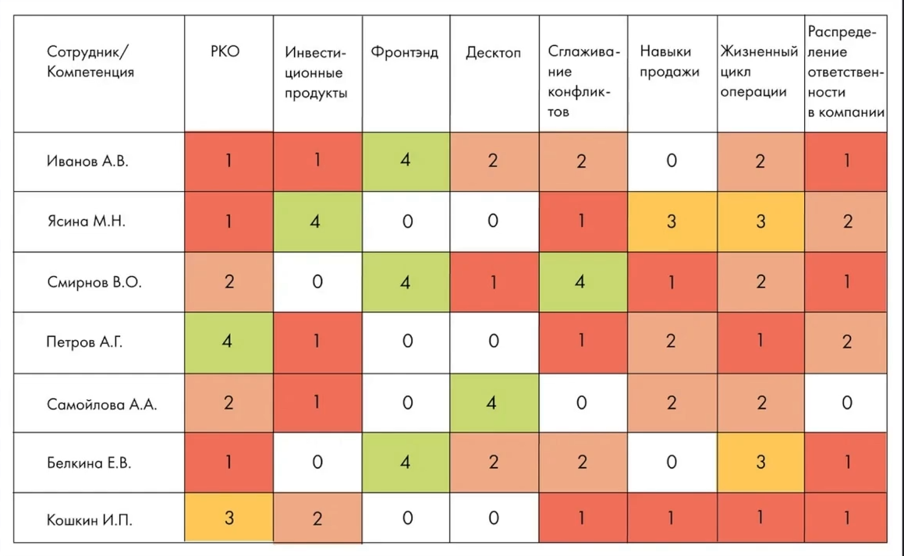

Так же эта карта поможет определить, какие компетенции нужно наращивать сотрудникам, чтобы нарастить высокий уровень взаимозаменяемости.

То есть нам нужно будет для внедрения сторипоинтов два момента:

- Необходимость культуры взаимозаменяемости в команде для успеха внедрения стори-пойнтов.
- Карта компетенций (Competence Map) как инструмент управления навыками и обучением в команде.

#### Внедрение

1. Нужно проанализировать текущий метод оценки задач.
2. Оценить текущие задачи в спринте в часах.
3. Затем переоценить их в стори-поинтах

#### Заключение

Понимание и внедрение стори-пойнтов может существенно улучшить процесс планирования и выполнения работы в командах разработки, обеспечивая более точное планирование и лучшую видимость продуктивности команды.

### Критерии DoR DoC и AC

**Definition of Ready (DoR)**, **Definition of Done (DoD)** и **Acceptance Criteria** – три фундаментальные практики, важные в Scrum и в разработке проектов в целом.

> [!info] Они важны для того, чтобы договориться с заказчиком на берегу о некоторых правилах работы над задачами.

Эти практики помогают оптимизировать рабочие процессы через прозрачность организации, фокусировку, целеустремленность и улучшение коммуникации.

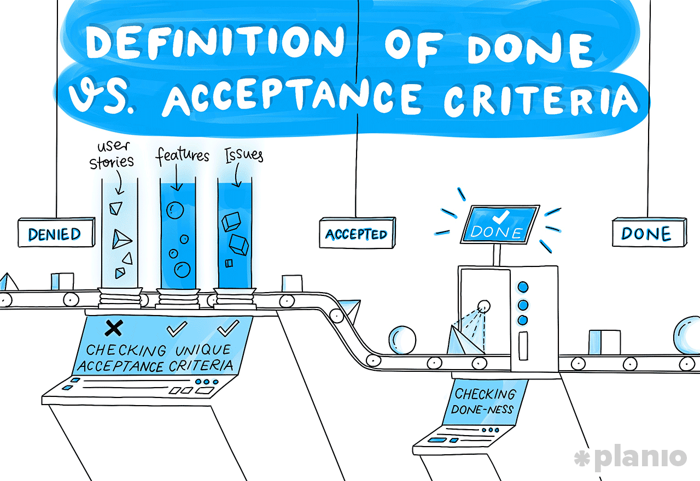

#### Практики и их отличия

| Практика       | **Definition of Ready**                            | **Definition of Done**                                                                                                               | **Acceptance Criteria**                                                        |
| -------------- | -------------------------------------------------- | ------------------------------------------------------------------------------------------------------------------------------------ | ------------------------------------------------------------------------------ |
| Определение    | Определяет готовность задачи к работе              | Критерии, определяющие завершенность задачи или продукта. Применяется в конце итерации и характеризует готовность продукта к релизу. | Индивидуальные критерии для каждой задачи, определяющие условия приемки работы |
| Кто формирует? | Формируется командой, часто с участием менеджмента | Формируются так же, как и DoR                                                                                                        | Формулируются заказчиком                                                       |

Примеры готовности этапа:

- **DoR:** (примеры требований, когда задача может быть готова к началу исполнения)
    - Задача четко определена
    - имеет измеримую бизнес-ценность
    - понятна команде
    - может быть выполнена за одну итерацию
    - готов дизайн и проведено UI/UX тестирование
- **DoD** (примерный список требований, когда задача готова к потенциальному релизу) 
    - Задачи реализованы и протестированы
    - Качество продукта проверено QA
    - документация обновлена и актуальна
    - окружение настроено и готово к использованию
    - есть план релиза.
- **Acceptance Criteria** могут включать функциональные требования:
    - Например, возможность установления цены с помощью слайдера
    - Результаты отсортированы по возрастанию цены
    - И так далее...

#### Внедрение

1. Определить, какие критерии DoR и DoD уже используются в команде.
2. Создать или дополнить существующие DoR, чтобы улучшить рабочий процесс.
3. Аналогично, сформулируйте новые или дополните имеющиеся DoD.
4. Для текущих задач сформулируйте или переосмыслите AC.

#### Заключение

Разработка четких критериев DoR, DoD и приемки – ключ к оптимизации рабочих процессов, повышению эффективности команды и удовлетворенности клиентов.

Практики приводят к созданию качественного продукта за счёт чётких договорённостей с заказчиком.

### Приоритизация бэклога

1. Матрица Эйзенхаура

- **Принцип**: задачи оцениваются по двум параметрам: срочность и важность.
- **Методика**: задачи распределяются на графике с осями срочности и важности. Наивысший приоритет имеют задачи в верхнем правом квадранте.

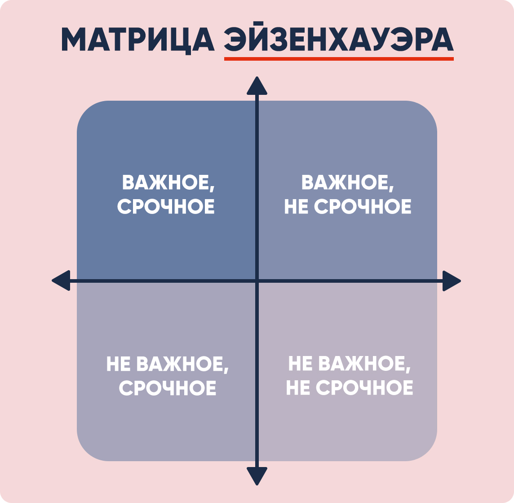

2. Value-Effort и Cost-Value

- **Принцип**: оценка задач по ценности (value) и сложности (effort) или стоимости (cost).
- **Методика**: задачи оцениваются и располагаются на графике, где приоритеты зависят от их положения – в идеале искать задачи с высокой ценностью и низкими затратами.

> [!summary] В этом методе самое главное искать максимальный профит от задачи при минимуме затрат и лишних действий

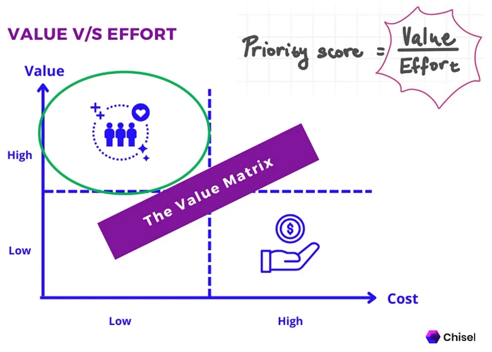

3. Карта влияния

- **Принцип**: фокус на достижении бизнес-целей, учет рисков и конфликтов.
- **Методика**: ответы на вопросы о цели, заинтересованных лицах, их влиянии и способах управления этим влиянием помогают выстроить карту влияния и приоритизировать задачи.

Нужно задать следующие 4 вопроса:

- Какую цель мы хотим достигнуть в проекте/продукте - **Зачем?**
- Кто может нам помочь/помешать достигнуть цели - **Кто?**
- Как они могут помочь/помешать достижению цели - **Как?**
- Что нам сделать, чтобы создать/снизить необходимое влияние - **Что?**

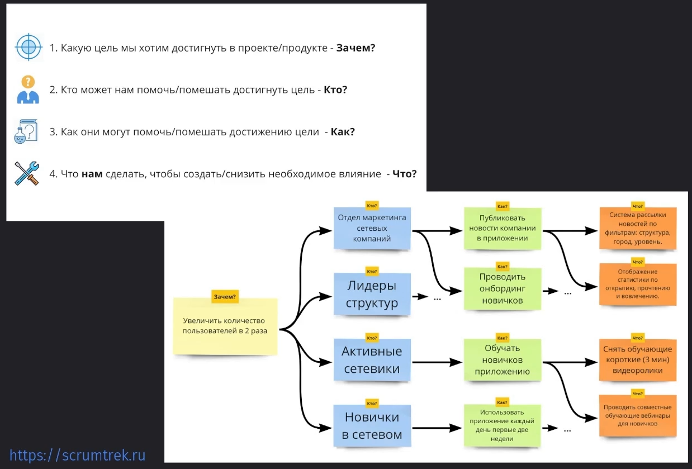

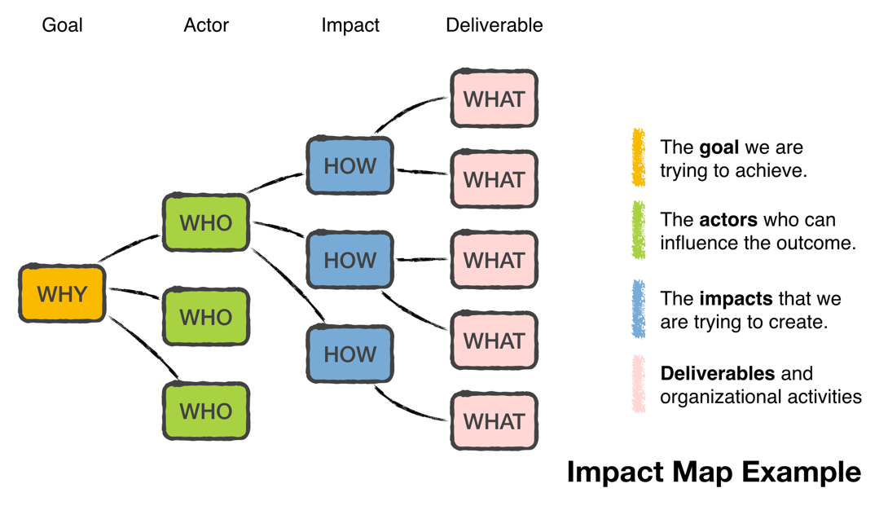

4. Карта пользовательских историй

- **Принцип**: визуализация пути пользователя и определение приоритетов в соответствии с этим путем.
- **Методика**: действия пользователя разделяются по этапам, идентифицируются потребности на каждом этапе, и задачи категоризируются по степени их важности и необходимости для реализации.

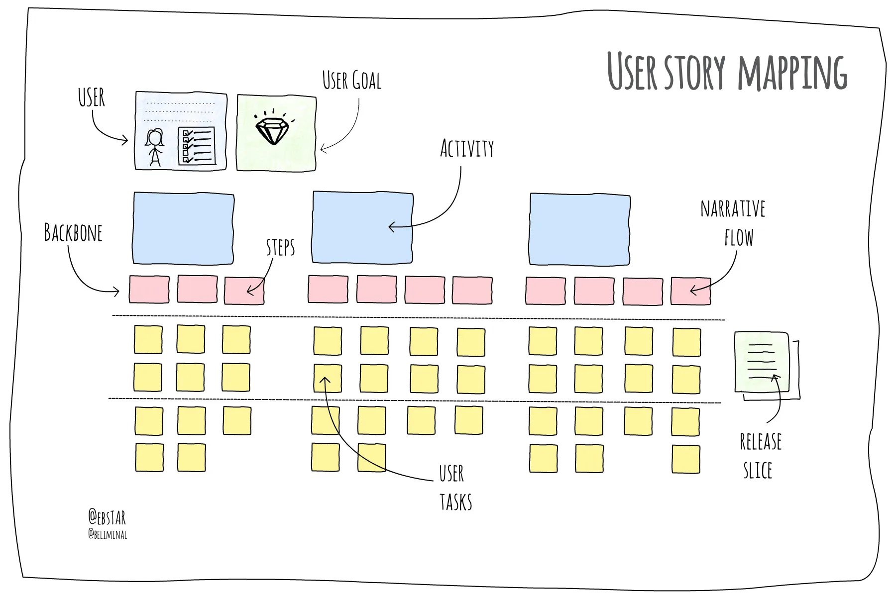

Представим, что мы хотим разработать интернет-магазин по заказу цветов.

Первое, что нам нужно сделать - это определить путь пользователя до заказа цветов

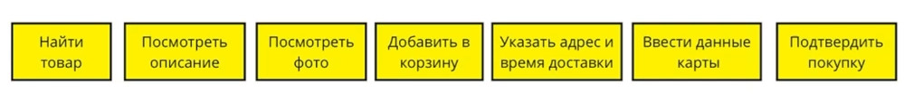

Далее нужно сгруппировать пользовательские операции (истории)

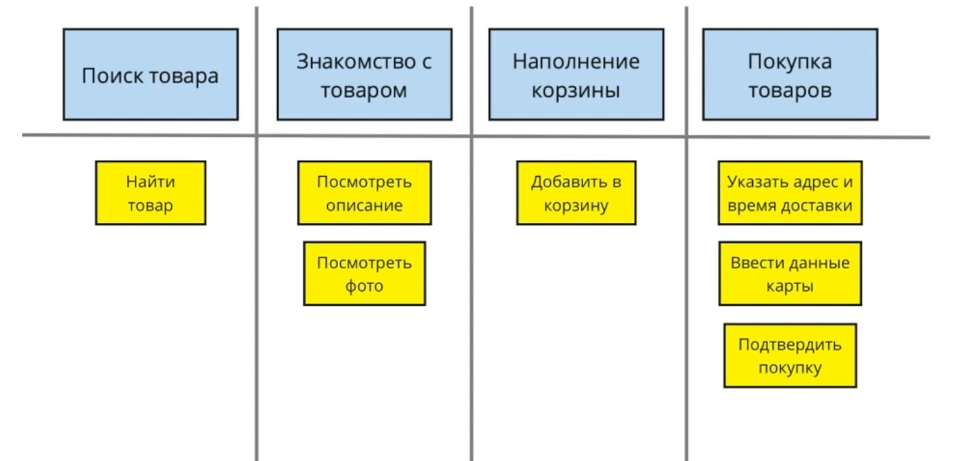

И дополнить каждую группу определёнными действиями, которые может выполнить пользователь на каждом этапе

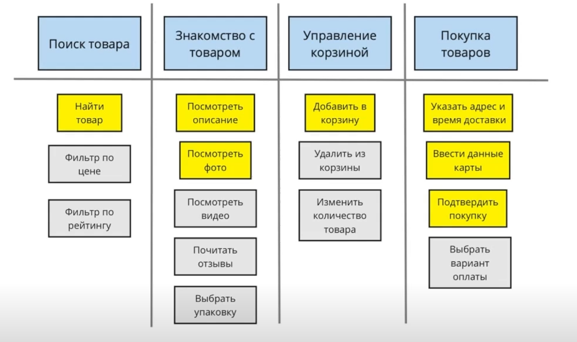

Далее категоризируем реализацию пользовательских историй по степени приоритетов

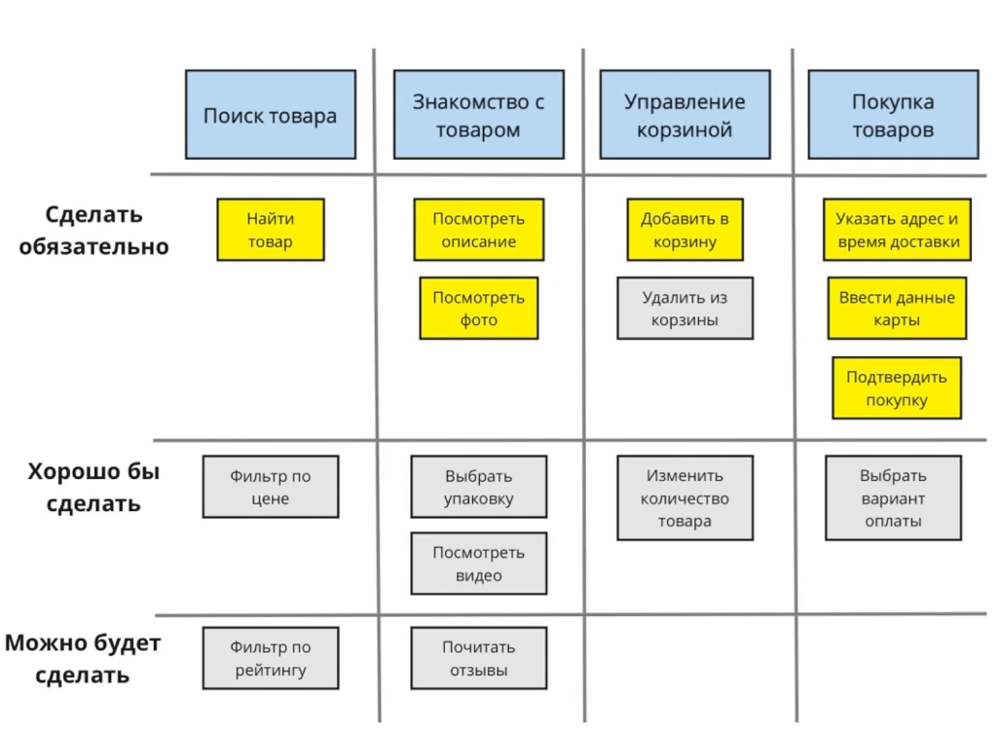

Далее выделяем релизы согласно категориям

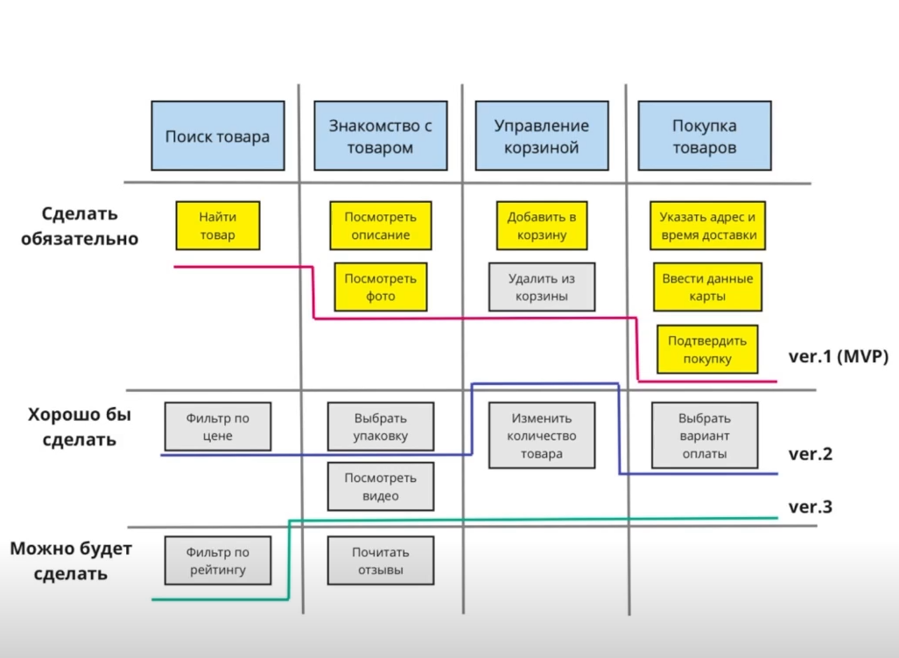

Далее описываем выполнение задач в бэклоге. Сначала истории из первой группы, из второй, а потом из третьей.

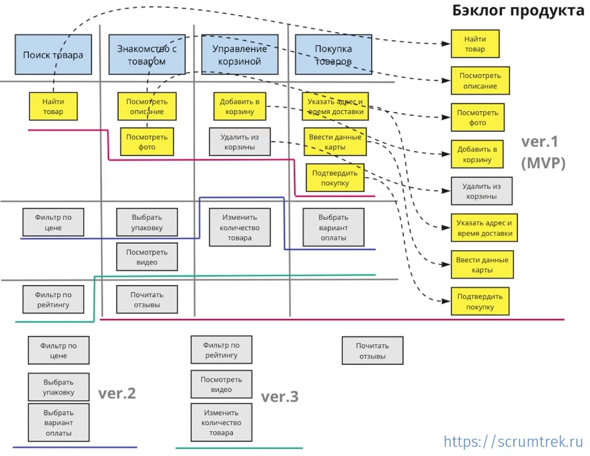

#### Внедрение

1. Выбрать из бэклога группу задач, связанных общей целью
2. Приоритизировать задачи с использованием **матрицы Эйзенхаура** и **Value-Effort**
3. Упорядочите задачи в зависимости от их влияния на достижение общей цели с помощью карты влияния.
4. Соотнесите выбранные задачи с этапами пользовательского пути на карте пользовательских историй.

---

## Scrum

#scrum #agile

### Введение

Scrum – мощный фреймворк, способствующий успеху многих компаний в IT-индустрии.

Появился из регби, переводится как схватка / толкотня, обозначает единство команды.

Сформулирован Джеффом Сазерландом и Кеном Швабером в 1995 году, основываясь на работах Хиротаки Токиучи и Икуджиро Нанака.

> Существует спор о том, является ли Scrum Agile фреймворком из-за отсутствия упоминания Agile в Scrum Guide, но создатели подчеркивают их взаимосвязь.

Scrum - это уже полноценный фреймворк, а не метод, как Kanban. Он предоставляет жёсткий набор правил и рамок для реализации всех своих подходов.

Agile-манифест создавался при непосредственном участии создателей Scrum (на основе опыта scrum-команд) и они сами говорят о том, что Scrum - это Agile-фреймворк.

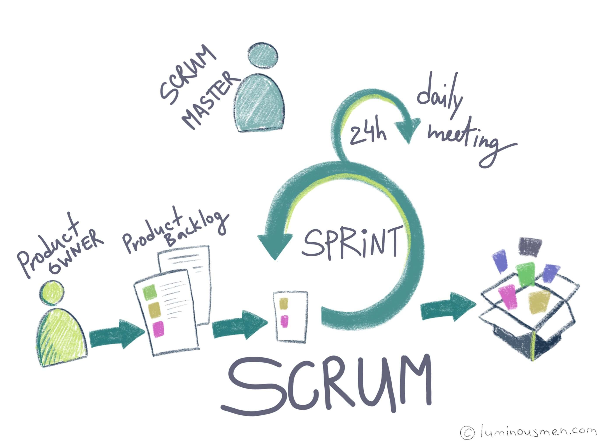

#### Характеристики Scrum:

- Легковесный, прост в описании, но сложен в понимании и реализации.
- Существует множество Scum Guide, которые от итерации к итерации меняются и требуют по-разному применять практики
- Сертификацию пройти крайне сложно, так как многие вопросы не описаны в гайде, а должны отвечаться "в духе Scum"
- Работает только при соблюдении всех условий. Scrum может потребовать сломать все устои, но принесёт ощутимый результат только при соблюдении всех практик.
- Требует развивать кросс-функциональность, взаимозаменяемость (сторипоинты, карты компетенций)
- Команда должна быть самоорганизующейся. Как решать и какие именно задачи, должна определять уже сама команда
- Так же существует множество разночтений гайдов по Scrum
    - Scrum-мастер - это лидер-слуга, который имеет или не имеет руководящих полномочий, но и является помощником команды
    - DoR описан в Scrum, но не полностью. Этот термин, скорее, пошёл из XP.

#### Принципы и Ценности Scrum:

- Обязательства (commitment) - договорённости, ответственность, разделение целей команды, компании, целей спринта
- Фокус (focus) - команда сфокусирована на небольшом скоупе задач, целях команды и особенностях её взаимодействия
- Открытость (openess) - про открытое общение между участниками и всеми заинтересованными личностями
- Уважение (respect) -
- Смелость (courage) - про решение сложных задач и поиск неочевидных решений

- Подчеркивает кросс-функциональность и самоорганизацию команд.
- Ответственность за результат лежит на Scrum Master и команде.

#### Сложности во Внедрении

- Необходимость изменения бизнес-процессов под Scrum.
- Вызовы в создании самоорганизующихся и мотивированных команд.
- Дискуссионные моменты по практикам и сертификациям.

#### Заключение

Значение Scrum в современном производственном и IT процессе сложно переоценить.

Однако важно глубоко изучить фреймворк и осознать его основные принципы и ценности для успешного применения, так как его нужно воспринять полностью.

Для более глубокого понимания можно прочитать официальное руководство по Scrum (на официальном сайте), пройти бесплатные тесты на [scrum.org](https://www.scrum.org/) для понимания сертификации и почитать книги основателей Scrum:

- [Scrum. Революционный метод управления проектами](../Books/Scrum.%20Революционный%20метод%20управления%20проектами.md)
- Путь Scrum-мастера.
- Коучинг Agile-команд

### Роли

Роли - это набор функций, которые могут соответствовать, а могут и не соответствовать определённой должности.

В Scrum-команде предполагается, что есть все сотрудники для разработки продукта.

В команду входят не только программисты, но и аналитики, дизайнеры, тестировщики и другие специалисты. Важен не статус, а компетенции.

В Scrum роли представляют собой набор функций, которые могут быть присвоены конкретным членам команды или разделяться между ними.

Scrum-мастером может быть отдельное лицо, а может быть и разработчик, который совмещает эту роль. В опытных командах, вся команда может выполнять эту роль.

Product Owner является связующим звеном между командой и заинтересованными сторонами (например, менеджментом, пользователями).

Все в scrum-команде (мастер, владелец продукта и разработчики) все ответственны за результат спринта.

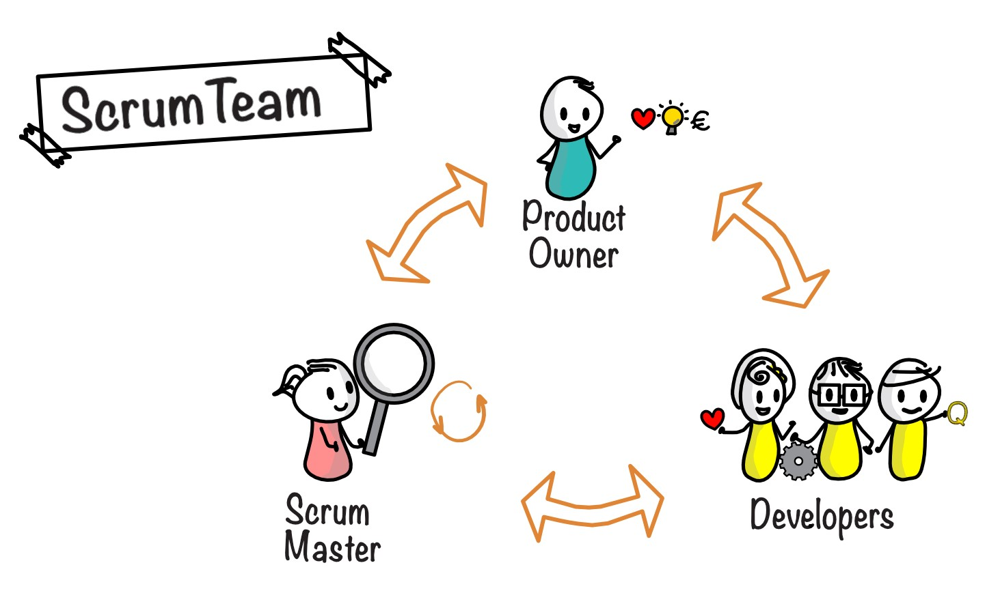

#### Основные роли в Scrum:

Scrum Master:

- развитие методологии Scrum в команде и компании,
- повышение продуктивности
- улучшение взаимодействия между участниками проекта, внутрик команд и между командами
- организация и облегчение проведения мероприятий Scrum
- устранение препятствий
- содействие в приоритизации и декомпозиции бэклога, помогает в планировании
- улучшение коммуникации
- коучит команду

> [!important] Роль SDM в Scrum выполняет вся команда. Она не принадлежит Scrum-мастеру.

Владелец продукта (Product Owner):

- работа с бэклогом - создаёт задачи, уточняет, приоритизирует, объясняет их
- формулировка целей продукта и спринта
- максимизация ценности продукта
- выполняет посреднические операции между заинтеерсованными лицами и командой
- прогнозирует и конструирует потребности клиента
- предлагает наивысшую экспертность по продукту

> [!important] Роль владельца и менеджера отличается. Владелец **сфокусирован на ценности продукта** в отличие от менеджера, который ответственен за сроки, бюджет и стратегическое планирование.

#### Командная работа:

- Размер команды. Команда должна быть достаточно большой, чтобы приносить за каждый спринт значимые результаты и достаточно маленькой, чтобы отставаться гибкой.
- Star Map. Командные участники могут замещать друг друга в случае необходимости, поощряется широкий набор навыков.

#### Внедрение

1. Нужно определить насколько команда соответствует Scum Team.
2. Определить, кто и как выполняет функции scrum-мастер.
3. Кто и как выполняет функции Владельца продукта.
4. Далее уже можно сформулировать предложения по возможным улучшениям.

### Спринт

Спринт является центральным элементом фреймворка Scrum, включая большинство активностей и событий Scrum. Он подразумевает комплексный подход с множеством ключевых деталей, делающих Scrum мощным и сложным инструментом для внедрения.

Спринт - это контейнер для всем scrum-активностей.

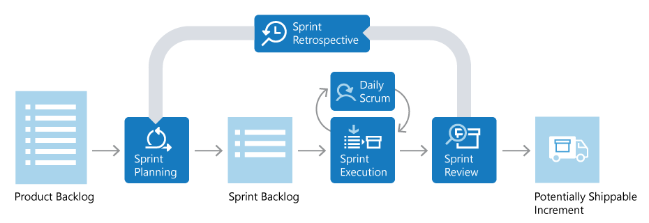

#### Основные События и Практики Спринта

1. **Планирование Спринта** - задачи из бэклога продукта выбираются для включения в бэклог спринта.
    - важен выбор задач, способствующих достижению цели спринта
2. **Ежедневные Встречи** - команда собирается для обсуждения прогресса и корректировки плана достижения цели спринта.
3. **Инкремент** - результат спринта, release candidate, который уже полностью оттестирован и готов к использованию.
    - станет ли инкремент релизом, будет зависеть от релизной политики
4. **Обзор Спринта** - демонстрация достигнутых результатов и обсуждение дальнейших планов с заинтересованными сторонами.
5. **Ретроспектива** - команда анализирует процесс работы и ищет пути его улучшения.
6. **Уточнение Бэклога** - обсуждение, оценка и приоритизация оставшихся задач бэклога продукта.

#### Ключевые Моменты

- **Длительность Спринта** - обычно от одной до четырех недель, классический выбор – две недели.
- **Цель Спринта** - фокус на достижение конкретной, значимой цели, а не просто выполнение задач.
- **Синергия** - все члены команды ответственны за реализацию этой цели, каждый должен вложиться в результат.
- **Инкремент** - конечный результат спринта – полностью готовый к использованию инкремент продукта.
- **Фича-тестирование** - выделенную в отдельную ветку фичу нужно оттестировать, а уже затем вливать в основную.
- **Инженерные практики** - автоматическое тестирование, непрерывная интеграция, непрерывная доставка.

#### Практические Советы

- **Выбор Длительности и Цели Спринта**. Выбор должен быть подкреплен стратегическими целями и возможностями команды.
- **Фокус на Инкремент**. Разработка ориентирована на достижение конечного, качественно протестированного продукта.
- **Адаптация Подхода**. В зависимости от этапа развития продукта и типа задач может быть рассмотрен переход к Kanban для более эффективного управления работой.

> [!important] Когда проект перестаёт быть запутанным, а синергировать команду уже не удаётся - можно уходить от Scrum.
> Когда **продукт перейдёт из запутанной стадии в сложную** и уже не нужно будет развивать так активно через Scrum - ставить задачи в большом количестве со сроками уже будет неактуально.
> Далее уже можно будет воспользоваться **Kanban**.

#### Заключение

Каждый спринт представляет собой итерацию на пути улучшения продукта и работы команды. Важно постоянно анализировать и адаптировать процессы для достижения наилучших результатов. Практика спринтов в Scrum поддерживает этот цикл непрерывного улучшения, предоставляя структуру для эффективного управления разработкой.

### Планирование спринта

| Этап                     | Задачи                                                                                                                                                                                                                                                                                                                                                                                                                                                                |
| ------------------------ | --------------------------------------------------------------------------------------------------------------------------------------------------------------------------------------------------------------------------------------------------------------------------------------------------------------------------------------------------------------------------------------------------------------------------------------------------------------------- |
| Начало спринта           | Планирование спринта - первое собрание в цикле спринта, где задачи из общего бэклога продукта выбираются и переносятся в бэклог спринта для выполнения.  В отличие от Kanban, где итерации мягкие, в Scrum каждый спринт имеет строго определенный временной лимит.  Время старта и окончания спринта не определено. Дорогого стоит начать спринт в понедельник утром и закончить в пятницу вечером, чтобы уйти с ясной головой и спокойной совестью.  |
| Длительность (Регламент) | Важность встречи подчёркивает так же её фиксированный регламент.  Не более 4 часов для двухнедельного спринта, адаптируется в зависимости от продолжительности спринта (от 2 до 8 часов).                                                                                                                                                                                                                                                                       |
| Участники                | Вся команда, включая разработчиков, скрам-мастера и владельца продукта. Можно приглашать и дополнительных участников для обсуждения.                                                                                                                                                                                                                                                                                                                                  |
| **Цель Спринта**         | Ключевой элемент, вокруг которого строится взаимодействие команды. Определяет конечный продукт спринта как готовый релиз-кандидат, предъявляемый заинтересованным сторонам.                                                                                                                                                                                                                                                                                           |
| Уточнение задач          | Проверка готовности задач к реализации с учетом внутренних критериев.  Нужно проверить по всем пунктам DoR, что задача готова к её исполнению.                                                                                                                                                                                                                                                                                                                  |
| Планирование Действий    | Формирование четкого плана работы на спринт, расчет велосити и капасити команды.                                                                                                                                                                                                                                                                                                                                                                                      |

> [! important] Все участники спринта собираются вокруг определённой цели
> Именно за счёт **синергии**, когда вся команда объединяется в одно, все цели и удаётся завершить в срок. Потому что вся команда нацелена на решение определённой задачи.

#### Внедрение

- Оцените и соотнести длительность ваших планирований с нормативами.
- Проанализировать состав участников
- Проанализировать то, как выглядит цель спринта.
- Оценить детализацию задач.
- Оцените методики формирования бэклога спринта.

#### Заключение

Планирование спринта - фундамент успешного спринта и продуктивной работы команды. Четкая цель и грамотно подобранные задачи, прозрачность процесса и эффективное общение являются залогами достижения высоких результатов.

### Ежедневные встречи

Ежедневные встречи - дейлик, стендап-встреча, ежедневный скрам, канбан-встреча.

Является самой частой петлёй в Scrum и представляет собой чистое проявление эмпиризма (поднимает прозрачность, проводит инспекцию и адаптацию).

| Подход               | Kanban                                                                                                         | Scum                                                                                                                                                                                                                           |
| -------------------- | -------------------------------------------------------------------------------------------------------------- | ------------------------------------------------------------------------------------------------------------------------------------------------------------------------------------------------------------------------------ |
| Фокус                | В Kanban основной приоритет на ускорении потока задач и создании максимальной ценности                         | Сосредоточение на достижении цели спринта через максимальную ценность инкремента                                                                                                                                               |
| Участники            | Присутствует менеджер поставки сервиса и ограничений на участников нет.                                        | Предназначены для разработчиков. Владелец продукта и скрам-мастер не обязательны к присутствию.  В Scrum нет SRM. Эту роль выполняет вся команда. Scrum-мастер нужен только для того, чтобы помочь команде договориться. |
| Длительность встречи | В Канбане встреча обычно длится дольше из-за обсуждения многих деталей по потоку задач                         | В Scrum время встречи ограничено 15и минутами - тут самое главное высказать свою позицию                                                                                                                                       |
| Порядок выступления  | Следует от доски задач                                                                                         | Участники могут самостоятельно выбрать способ передачи слова. Обычно высказывается желающий, а дальше все по кругу озвучивают статус своих задач.                                                                              |
| Количество встреч    | Нет ограничения на количество встреч - их можно проводить хоть несколько раз на дню, если того требует команда | Иногда команды пропускают дейлики перед окончанием скрама, ретроспективой или перед другими этапами, но это некорректный подход. Желательно всегда проводить дейлики, так как ценность создаётся каждый день.                  |

На усмотрение менеджера, стоит ответить на следующие три вопроса:

- Что делал?
- Что планирую делать?
- Какие препятствия?

Препятствия могут обсуждаться во время встречи, но детальное рассмотрение требует отдельного времени. Можно выделить это время через создание встречи в любое другое время.

#### Внедрение

1. Определить, кто сейчас присутствует на ежедневных встречах.
2. Сколько длится встреча и почему на неё может затрачиваться больше времени, чем нужно?
3. Определить принцип порядка выступления сотрудников.
4. На какие из трёх вопросов даются ответы?
5. Как выглядит процесс преодолевания препятствий?

#### Заключение

Ежедневные встречи играют ключевую роль в обеспечении прозрачности и адаптивности рабочих процессов в командах, работающих по методологиям Скрам и Канбан. Важно правильно организовать эти встречи, чтобы они были максимально эффективны и не отнимали много времени у команды.

### Обзор спринта

Обзор спринта является встречей, на которой демонстрируется инкремент - результаты работы команды за спринт. Он представляет из себя полноценный релиз-кандидат, готовый к деплою в продакшен.

Если инкрементов за спринт было несколько, то показывается последний, так как инкремент - это логическое продолжение друг друга.

В Kanban присутствует подобная встреча и называется она Delivery Service Review (Обзор сервиса поставки). Однако в Kanban нет чёткого инкремента и могут обсуждаться задачи даже неготовые.

1. Обзор спринта происходит в конце спринта, когда готов инкремент, перед ретроспективой, то есть почти в самом конце спринта.
2. Длительность до часа за неделю спринта (2ч - 2 недели).
3. Приглашаются:
    - вся команда, включая разработчиков.
    - стейкхолдеры - инвесторы, руководители, члены соседних команд. Очень ценно присутствие конечных пользователей.
    - владелец продукта.
4. Основным действующим лицом является владелец продукта, который
    - презентует нововведения продукта
    - рассказывает о целях спринта
    - проводит демо продукта
5. Сбор обратной связи. Важнейшая часть спринта. Это положительно вляиет на мотивацию внутри команды.
6. Корректировка бэклога. После обратной связи, бэклог можно дополнить новыми задачами.

#### Внедрение

1. Приглашение стейкхолдеров. Важно приглашение заинтересованных лиц помимо разработчиков для полноценного анализа и обратной связи.
2. Частота и длительность. Обсуждение периодичности и оптимальной продолжительности встреч.
3. Критерии приглашения. Подходы к выбору и приглашению стейкхолдеров для обеспечения максимальной пользы от встречи.
4. Сбор и использование обратной связи. Методы эффективного сбора обратной связи и дальнейшие шаги по её использованию для улучшения продукта.

#### Заключение

Эффективный обзор спринта создает платформу для демонстрации достижений, получения ценной обратной связи и принятия обоснованных решений о дальнейшем развитии продукта.

### Ретроспектива

Ретроспектива - ключевая встреча в Agile-методологиях (Скрам, Канбан), нацеленная на анализ работы команды за спринт с целью повышения эффективности.

В Kanban данная встреча называется Review Service Delivery.

На ретроспективе проводят:

- Обсуждение достижений и проблем прошедшего спринта.
- Поиск и реализация решений для повышения продуктивности.

> [!important] Самое важное - на ретроспективе нужно определить что хорошо, что плохо и что нужно улучшить, чтобы решить эти проблемы!

Встреча по структуре имеет следующий вид:

1. Проводится сразу после обзора спринта (обычно, с переменой в 15-30 минут). Продолжительность зависит от длительности спринта (для двухнедельного - до 1.5 часов). Часто так же проводят и третью встречу с планированием следующего спринта, но реже, так как это достаточно утомительно.
2. Участники. Вся команда включая владельца продукта и, иногда, scrum-мастер. Сторонних лиц не приглашают.
3. Формат. Есть множество различных форматов проведения ретро и их стоит иногда менять, чтобы не ржаветь. Можно провести встречу так:
    - Разминка. Творческое задание для расслабления и настройки на позитив.
    - Обсуждение. Каждый участник делится тем, что ему понравилось и не понравилось в спринте, используя стикеры или виртуальные доски.
    - Анализ проблем. Команда обсуждает волнующие вопросы, предлагает и выбирает решения.
4. Предложения, договорённости. Нужно определить те моменты, который должен будет выполнить определённый член команды, чтобы команда работала эффективнее.
5. Фиксация договорённостей. Часто договорённости забывают. Все договорённости фиксируются и контролируются на следующей ретроспективе. Можно создать определённый элемент бэклога на основе выработанных решений, чтобы контролировать происходящее все результаты.

> Для качественной ретроспективы очень нужен творческий настрой команды.

#### Заключение

Ретроспектива - неотъемлемый элемент Agile-практик, важный для непрерывного улучшения рабочего процесса и повышения эффективности команды.

### Уточнение бэклога

Уточнение бэклога - обычно это одна или несколько встреч, где команда, при участии владельца продукта, обсуждает оставшиеся в бэклоге задачи: оценивает их, знакомится с приоритетами и ближайшими планами по продукту. Этот подход готовит задачи к спринту.

> [! note] Это не одна встреча, а активность / процесс, в рамках которого происходит уточнение upstream-задач

В Kanban нет термина Backlog, но есть работа до принятия обязательств и после. Задачи до точки принятия обязательств называются **upstream**. И работа над ними, уточнения - это прямая аналогия с уточнением бэклога.

Официальное название - **Product Backlog Refinement (PBR)**. Раньше называли **грумингом**.

- Встречи происходят в течение спринта. Могут быть обязательной или необязательной встречей.
- До 2017 рекомендовалось посвящать процессу до 10% времени разработчиков, в редакции 2020 это ограничение снято
- Учавствует владелец продукта, команда разработки, скрам-мастер, но жёстких ограничений по составу участников - нет.
- Определяются задачи и цели. Бэклог - это живая сущность и её нужно постоянно пересматривать, уточнять и корректировать, потому что некоторые задачи можно исключать , а некоторые нужно добавлять.
- Определяются критерии DoR (готовности задачи) для задач из бэклога, чтобы их можно было взять в спринт.
- Определяются критерии AС (приёмки), которые уже формируют, скорее, владельцы продукта и стейкхолдеры

#### Заключение

Уточнение бэклога – это не одноразовое событие, а циклический процесс обеспечения готовности команды и задач к успешному спринту, требующий активного взаимодействия всех участников проекта.

---

## Масштабирование Agile

### Введение

В центре Agile - небольшая кросс-функциональная команда до 10 человек. Такие команды мотивированы, самоуправляемы и обладают всеми компетенциями для разработки продукта.

Однако Agile-подходы так же нужно использовать и в больших корпорациях, где не один продукт, а несколько и людей для развития и поддержки требуется больше.

#### Стандартная организация

Обычно большие компании разбиты на отделы/департаменты и так далее. Отделы могут содержать по несколько команд. Либо сам отдел может быть командой. Сами отделы могут делиться по направлениям: отдел разработки, отдел администрирования, аналитики, дизайна и так далее. За каждым отделом закреплён руководитель. Руководитель обладает высокие компетенции по специализации отдела.

Чтобы все команды и отделы разрабатывали продукт, есть ряд продуктовых и проектных менеджеров, которые раздают в каждый отдел задачи, следят за их исполнением и выставляют приоритеты.

Такая структура имеет ряд тяжёлых проблем, которые не позволят эффективно разрабатывать продукт:

- тяжело оркестрировать такое количество людей
- тяжело поддерживать коммуникацию между определёнными людьми
- растёт количество бюрократии
- недостаток компетенций
- распыление внимания сотрудников

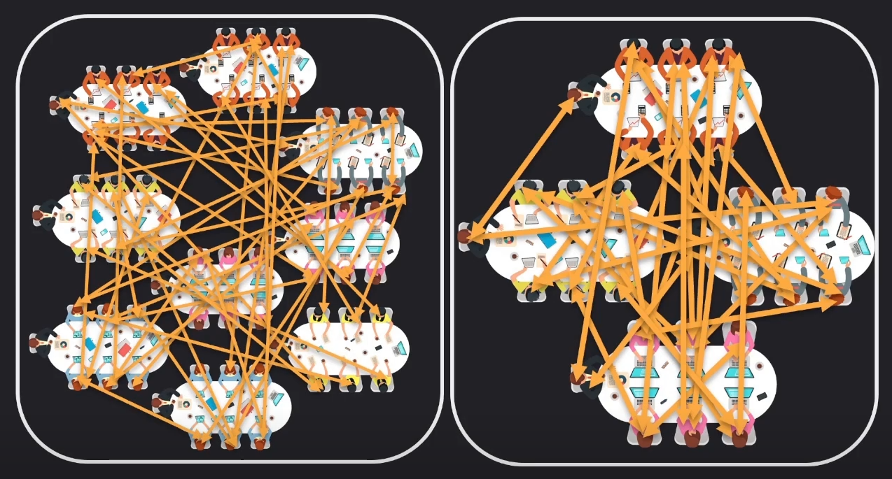

Кросс-функциональная организация команды позволяет закрыть львиную долю коммуникаций прямо внутри команды, потому что каждый человек знает к кому обратиться для быстрого решения проблем.

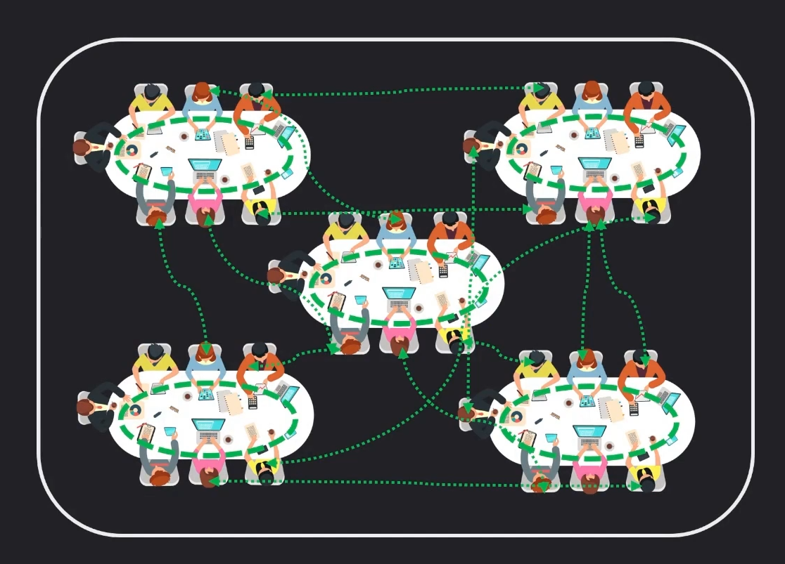

> [!important] Само по себе масштабирование Agile происходит за счёт периодической синхронизации команд.

#### Типы деления команд

| Тип команды     | Компонентные команды                                     | Фиче команды                                                                                                                                                              |
| --------------- | -------------------------------------------------------- | ------------------------------------------------------------------------------------------------------------------------------------------------------------------------- |
| Принцип деления | Команды делятся по типу: frontend, backend, iOS, Android | Независимо от платформы реализуют разный функционал: сервис видео, сервис музыки, сервис ленты новостей, сервис оплаты услуг, сервис сообщений                            |
| Где подходит    | Больше подходит для маленьких команд и бизнесов          | Больше подходит для крупных бизнесов с большим количеством команд, когда приложение стоит делить на микросервисы, объединяемые или нет, в одном приложении или экосситеме |

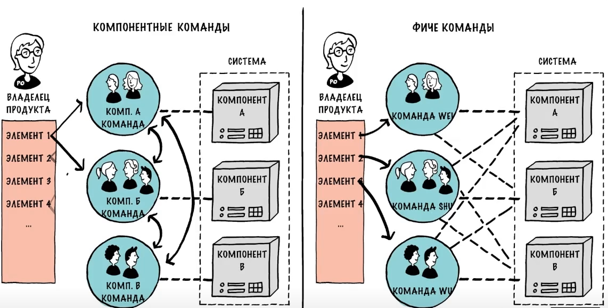

#### Преобразование к Agile

Для преобразования больших структур в Agile потребуется:

1. Нужно определить будущую структуру компании. То есть нужно определить, какие кросс-функциональные команды нужны для достижения поставленных целей и как они должны друг с другом взаимодействовать.
2. Уточнение необходимых компетенций в каждой команде.
3. Анализ существующих компетенций. Собрать карту компетенций и далее определиться с тем, что нам нужен добор или переквалификация имеющихся специалистов.
4. Собрать общую встречу с описанием реструктуризации компании и описать RoadMap.
5. Реорганизация коллектива в соответствии с новой структурой. Тут уже можно попробовать дать сотрудникам самоорганизоваться и предоставить им возможность самим выбрать команду с более интересным проектом.

#### Командные топологии

Можно перейти на качественно новый уровень конструирования и взамодействия команд.

> [!faq] Для уточнения топологий можно обратиться к книге Мэтью Скелтона и Мануэле Пайса

- Команды, ориентированные на поток - быстро и надёжно создавать ценности для пользователей, работая автономно от других команд
- Команды поддержки - помогают другим потоко-ориентированным командам заполнять пробелы
- Команды сложных подсистем - специализируются на поддержке и разработке специализированных частей системы с требованием углубленных знаний
- Команды платформы - предоставляет ресурсы для потоковых команд, чтобы те работали максимально автономно и эффективно

#### Внедрение

1. Нужно проанализировать работу больших коллективов и их организацию.
2. Реорганизовать команды по компонентному и фиче-принципу.
3. Синхронизировать работу команд для общей цели.

#### Заключение

Agile методология может быть адаптирована для крупных продуктов и команд. Для решения этой задачи важно организовывать кросс-функциональные команды, чтобы повысить скорость и эффективность разработки. Мы можем организовывать различные типы команд и определять их взаимодействие для достижения оптимальной производительности.

### Kanban

Kanban - это эволюционный метод, который применим ко всем этапам развития компании и не требует сильных перестроек.

#### Переиспользуемость

Kanban нацелен изначально не на одну команду, а на компанию целиком. Все приницы, роли и ценности применимы на любом масштабировании:

- STATIK
- модель зрелости и практики, характерные под уровень развития компании
- визуализация процессов
- ограничение количества работ
- управление потоком
- введение правил работы
- циклы обратной связи
- непрерывное улучшение

#### Каденции

Каденции, которые стоит применять для синхронизации команд:

- Ревью стратегии - квартальное совещание для синхронизации глобальных целей
    - Проводится ежеквартально
    - Определение целей и задач
    - Оценивается прогресс выполнения задач
    - Определяются проблемы и ищутся новые возможности
    - Определяются стратегические корректировки
    - Стратегические корректировки
    - Планирование следующих шагов на квартал
- Операционное ревью - ежемесячное совещание между менеджерами для улучшения взаимодействия между командами
    - проводится ежемесячно
    - оцениваются достижения каждой из команд
    - собираются данные (зависимости, препятствия)
    - генерируются новые идеи для решения проблем
    - принимаются решения по решеню выведенных проблем
    - определяются следующие шаги на месяц
- Ревью рисков - ежемесячное совещание для выявления и планирования действий по узким местам и рискам
    - проводится ежемесячно
    - устанавливаются правила проведения встречи
    - анализируются риски
    - все риски приоритизуют (вероятность - тяжесть)
    - планируют реакцию на эти риски (работа с рисками)
    - определяются следующие шаги на месяц

#### Концепция уровней полёта (Flight Levels)

Предлагается Клаусом Леопольдом как решение проблемы координации команд через создание надуровней управления.

Техника подразумевает создание менеджерского уровня над командами, которое контролирует выполнение задач и синхронизацию команд между разными уровнями. Необходимо выполнять 5 активностей для обеспечения эффективной работы на разных уровнях координации.

Для синхронизации команд предлагается команда уровнем выше, всего 3 уровня: операционный, координационный и стратегический.

Подробнее на [FlightLevels](https://www.flightlevels.io/)

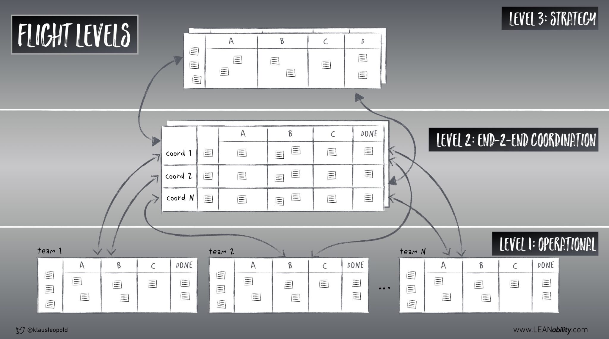

#### Заключение:

Kanban предоставляет гибкий и эффективный подход к управлению работой на уровне не только отдельных команд, но и всей организации. Понимание и применение каденций Kanban, а также концепции уровней полёта, помогает улучшить координацию между командами и повысить общую эффективность работы.

### Nexus

Nexus - это масштабируемый Agile-фреймворком, разработанный сообществом Scrum.org для работы нескольких команд над одним продуктом.

> [!important] Nexus напрямую связан со Scrum.

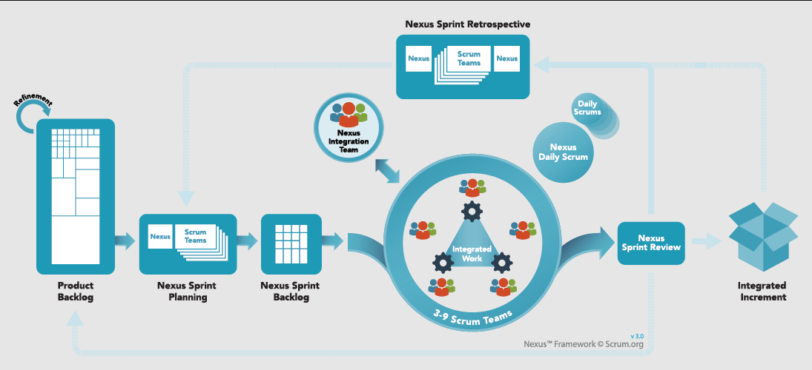

#### Характеристики Nexus

- Вводится команда интеграции, которая синхронизирует постоянно все команды.
- Количество команд: от 3 до 9, включая команду интеграции, которая помогает в координации между командами Scrum. Синхронизировать 2 команды - очень просто, а больше 9 - невероятно сложно.
- Единство продукта: один продукт, единый бэклог продукта и один владелец продукта для всех команд. Цель продукта так же будет являться одной для всех команд.
- Присутствует Nexus Sprint Backlog, который представляет из себя задачи на спринт сразу для всех команд.
- Единый спринт - единый инкремент.
    - Все встречи и тайминг взяты из оригинального Scrum как для одной команды (планирование до 4 часов, обзор спринта до 2 часов, ретро до 1,5 часов)
    - Общее планирование спринта определяет:
        - состояние, которое нужно достичь за итерацию;
        - уточняются взаимосвязи между командами;
        - добавляются задачи для команды интеграции;
    - Локальное планирование внутри команд
    - Обзор спринта общий без раздленения на локальные обзоры, так как инкремент общий и обратная связь так же общая
    - Ретро делится на 3 этапа:
        - Встречаются руководители команд, которые решают вопросы по совместному взаимодействию
        - Потом встречаются команды на обычное ретро
        - Далее снова встречаются представители и вырабатывают договрённости на следующий спринт
    - Ежедневные встречи (суммарно должны длиться 15 минут, но можно провести каждый по 15):
        - сначала встречаются представители команд
        - затем встречаются команды по отдельности
- Кросс-коммандное уточнение бэклога. Теперь оно является не активностью в течение спринта, а событием, которое должно иногда происходить. Оно не ограничено по времени.

> [!note] Спринт для трекера задач - это фильтр, в котором выставлен конкретный спринт.
> Это очень важно понимать, когда внутри каждой команды будет идти синхронизированный спринт и самих задач станет крайне много.
> Бэклог продукта это также набор задач, которые не сопоставлены с определённым спринтом.

#### Команда Интеграции (КИ)

- Представители Scrum-команд - это делегированные на конкретное мероприятие участники Scrum-команд, список которых может меняться
- Состав каждого события ситуативен и может меняться в зависимости от команды и возможностей каждого человека
- Команда интеграции - это Представители Scrum-команд и SM (scrum-master) / PO (project owner)
- Ключевая задача КИ - это способствование появлению общего инкремента

#### Внедрение

1. Ознакомиться с официальным [руководством по Nexus](https://www.scrum.org/resources/nexus-guide) - [PDF2021](https://scrumorg-website-prod.s3.amazonaws.com/drupal/2021-01/NexusGuide%202021_0.pdf?nexus-file=https%3A%2F%2Fscrumorg-website-prod.s3.amazonaws.com%2Fdrupal%2F2021-01%2FNexusGuide%25202021_0.pdf)
2. Собрать команду интеграции в контексте конкретного продукта

#### Заключение

Nexus является логичным и практичным расширением Scrum для масштабируемых проектов, что значимо для эффективной работы нескольких команд над единым продуктом.

### LeSS

LeSS (Large Scale Scrum) - это [крупномасштабный Srum](https://less.works/ru).

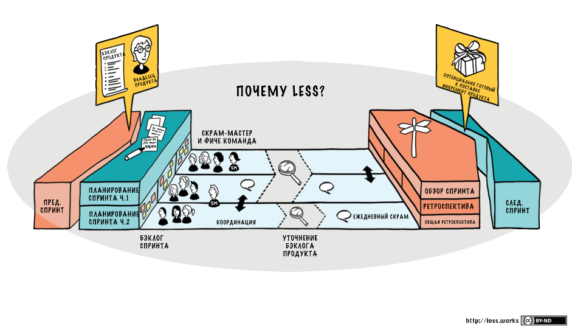

LeSS делится на:

1. **Стандартный LeSS:** Для до 8 команд, каждая из которых до 8 человек.
2. **LeSS Huge:** Для проектов с тысячами участников.

Основные аспекты LeSS:

1. Единство продукта - один продукт, один бэклог, один владелец продукта, единый итоговый инкремент и обзор спринта.
2. Планирование и ретроспективы проходят в несколько этапов:
    - Планирование в два этапа с участием всех членов команд. Сначала все команды, а потом внутри каждой.
    - Ретроспективы в два этапа: командная ретроспектива и менеджерская, на которой встречаются представители команд, сторонние менеджеры и СМ.
3. Ежедневные встречи. Схожи с традиционными скрам-встречами, с возможностью участия наблюдателей из других команд для координации.
4. Координация: просто говорите (любые члены команды могут общаться с другими членами команды), ревью кода, сообщества практик, многокомандные встречи.

Так же отдельно можно выделить:

1. Фокус на фича-команды. Предпочтение отдаётся мультидисциплинарным командам, способным полностью реализовывать функциональность.
2. Инженерные практики, бережливое и системное мышление. Важность технического совершенства и комплексного подхода к процессам.
3. [Внедрение](https://less.works/ru/less/adoption). LeSS решает проблему: большого количества людей, непрерывное улучшение на пути к совершенству.
4. [Коучинг](https://less.works/ru/less/adoption/coaching). Коучинг означает, что опытный тренер будет тесно работать вместе с организацией, чтобы улучшить её продуктовую разработку.

#### LeSS Huge

LeSS Huge - это несколько вложенных LeSS, где каждая LeSS-группа команд фомируется по принципу области требований к продукту.

- бэклог продукта делится на бэклоги области
- для каждой области есть свой владелец области продукта (Area Product Owner)
- сохраняется целиковый владелец продукта и его роль сводится к тому, чтобы распределить задачи по бэклогу продукта по независимым областям требований
- координация команд происходит на общих встречаях через координацию обычно с помощью Наблюдателей

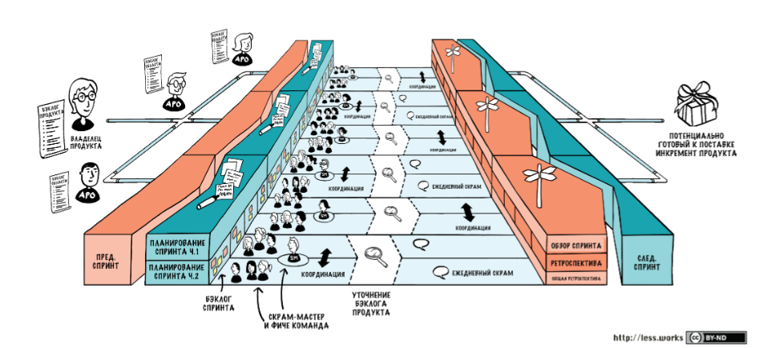

> [!hint] Практики LeSS сохраняются для каждой из областей.

#### Внедрение:

[Внедрение](https://less.works/ru/less/adoption) осуществляется через несколько принципов, которые нужно поддерживать даже в процессе существования LeSS:

- три принципа
    - глубоко и узко против широко и поверхностно (хорошее внедрение LeSS в одном продукте, чем плохое внедрение в нескольких)
    - поддержка сверху и снизу (успешное внедрение LeSS требует как энергии людей, которые делают Правильные Вещи, так и поддержки людей с организационной властью, чтобы помочь им делать Правильные Вещи)
    - привлекайте волонтёров (подключать членов команды для выполнения различных функций)
- коучинг
- карта внедрения
- постоянное улучшение (не существует постоянного состояния, когда продукт готов - продукт должен развиваться постоянно)

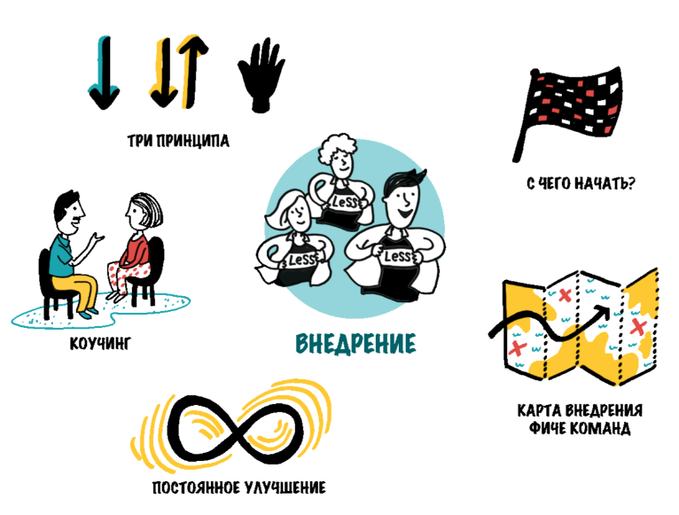

### Sbergile

Sbergile - это некоторая трансформация Agile, которая ориентируется на модель Spotify.
Греф Герман Оскарович сделал огромный вклад в популяризацию Agile в России. Agile-трансформация превратила Сбербанк из бюрократизированной структуры в IT-лидера с высоким уровнем сервиса.

#### Модель Spotify

- **Squad** (команда / отряд). 
- **Chapter** (части). Группы по компетенциям в рамках команд. В каждой команде есть, например, QA, DevOps, Backend, Frontend. Для каждой части есть свой руководитель.
- **Guild**. Объединяют сотрудников по интересам на уровне всей компании. Этот срез нужен для коммуникации людей на уровне интересов, чтобы взаимно задавать вопросы и обучать друг друга
- **Tribe** (Клан / Племя либо близкое департамент). Содержит до 150 человек и объединяет команды с общей миссией.
- **Pollination** (Опыление). Команды в Spotify достаточно автономны, но за счёт высокого уровня коммуникации, мы получаем повышение эффективности через обмен знаниями между командами.

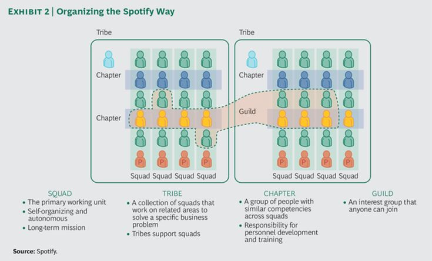

Но так же в Spotify важную роль играют:

- Релизные поезда - это процесс синхронизации релизов нескольких команд, которые взаимосвязаны друг с другом
- Feature toggle - переключатель для включения использования фичи в проекте или их отключения, если фича не готова полностью или что-то ломает.

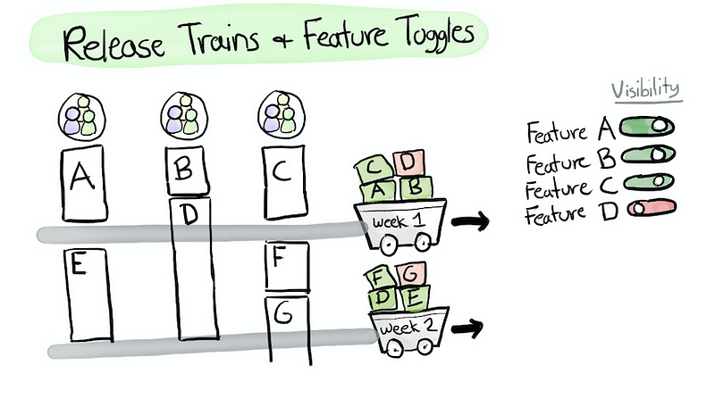

#### Особенности в Sbergile

В подходе от Сбербанка больше стандартов / предписаний и меньше автономности для команд.

Сбербанк адаптировал Agile под свои нужды, учитывая большие риски и важность дисциплины для государственно-важной финансовой организации.

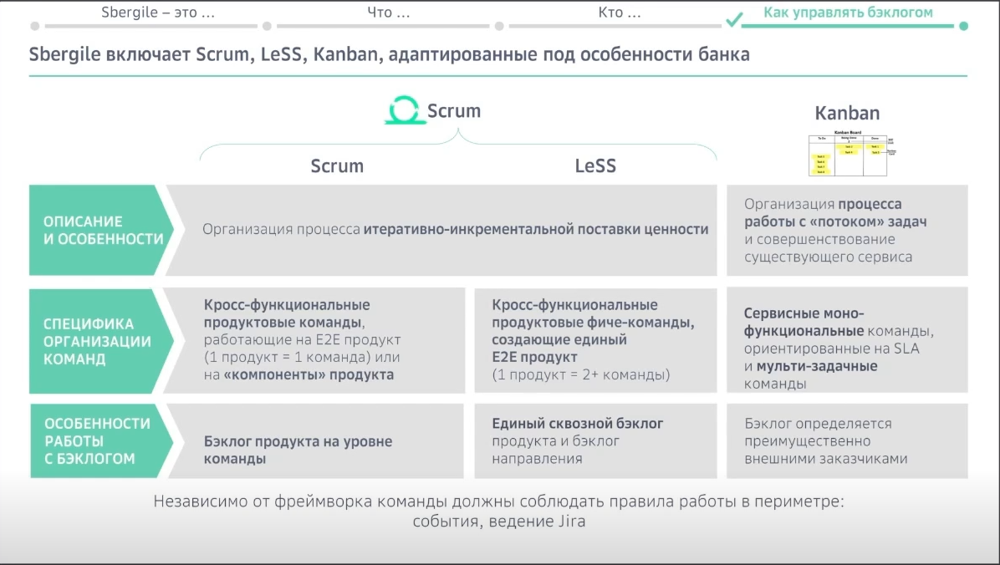

- Сервисная команда - разработка определённого сервиса - Kanban
- Продуктовая команда - разработка нового продукта - Scrum
- Несколько продуктовых команд - несколько команд для одного проудкта - LeSS

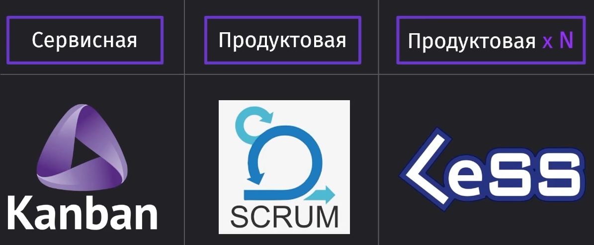

Под все команды детально описанные роли, которыйх около 20 типов, способствующих чёткому распределению ответственности.

#### Культура и Ценности

> Культура ест стратегию на завтрак - Дэйв Логан "Лидер и Племя"

> [!summary] Ценности -> Культура -> Стратегия
> Модель Зрелости Kanban, посвящённая Культуре - "Результаты следуют за Практиками. Практики следуют за Культурой. Культура следует за Ценностями. И поэтому, Развивайте Ценности!"

Сбербанк акцентирует внимание на пропаганде внутренних ценностей и на развитии коммуникации и взаимодействия между сотрудниками.

#### Заключение

Таким образом, Sberagile является примером адаптированного подхода к Agile, с акцентом на стандартизацию, детальное ролевое разделение и внедрение корпоративной культуры, стимулирующей эффективность и командное взаимодействие.

### SAFe

SAFe - Scale Agile Framework - это комплексная модель для обеспечения гибкости и масштабирования аджайл-практик в крупных организациях.

- SAFe интегрирует скрам и канбан в рамках большего, более организованного подхода к разработке
- Kanban адаптирован и используется в рамках Agile
- Team Coach = Scrum Master

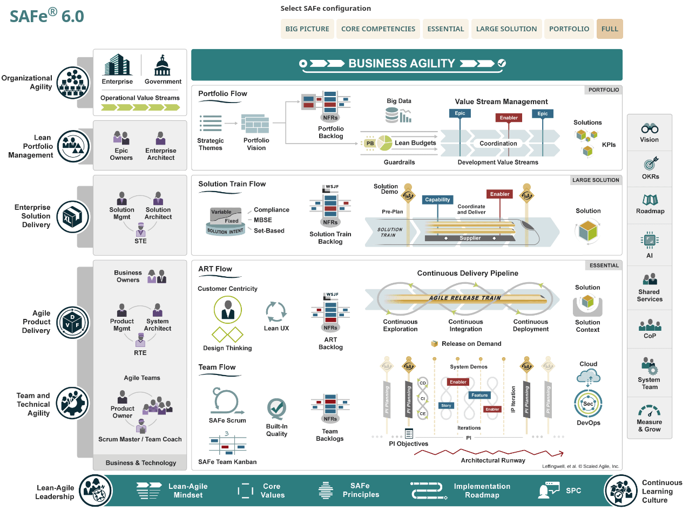

#### Сфера применения

- Разработан для больших компаний (от 50 до нескольких тысяч сотрудников) для перехода к аджайл на масштабном уровне.
- Часто используется в банках и крупных программных компаниях.

#### Основные компоненты SAFe

- **Фундамент:** Содержит информацию о мышлении Lean-Agile, принципах и подходах.
- **Essential SAFe:** Ядро фреймворка, сосредотачивающееся на командной работе и Agile Release Train (ART).
- **Large Solution:** Дополняет Essential, включает инструменты для координации нескольких ART.
- **Portfolio:** Управление стратегическими инициативами, ресурсами, рисками на уровне всей компании.

Так же на модели слева от уровней располагаются роли, которые фигурируют на разных уровнях SAFe.
Ещё левее находятся основные приниципы, которые позволяют сделать бизнес ещё более адаптивным и гибким.
Справа описаны практики, которые могут пригодиться на разных уровнях SAFe.

> [!important] Часто компании берут не Full конфигурацию, а только Essential, так как у них нет потребности полностью реализовывать всю схему

#### Ключевые элементы

- Agile Release Train (ART) - это средство для объединения релизов множества команд по единому потоку ценностей (применимо как для одного продукта, так и для множества других).
- Команды делятся на 5 - 12 agile-подкоманд, которые уже, в свою очередь, делятся на 50 - 150 человек.
- ART: менеджмент, RTE, архитектор, бэклог
- Комада: PO, SM/TC, участники, бэклог
- Все команды работают по интервалу планирования (PI).
- ART sync (Coach Sync + PO Sync), System Demos. Стратегические встречи для координации работы внутри ART.

RTE - это над-роль на уровне Поезда, похожая на Scrum-мастера, т.е. лидер-слуга, который фасилитирует общие встречи, консультирует, помогает наращивать продуктивность и так далее

Системный архитектор - это роль, ответственная за согласованность технической и системной составляющей на уровне Поезда

Интервалы планирования (PI) - это временной интервал, в рамках которого команды Agile-разработчиков непрерывно приносят пользу клиентам в соответствии с целями PI.

- Он включает планирование на 8-12 недель
- Делится на: итерации работы и по одной итерации для инноваций и планирования.

PI планирование - это длительный процесс, который длится два дня и все причастные к работе лица выстраивают план работ на следующую итерацию.

System Demos - это события, которые проходят в конце каждой итерации и позволяет получить обратную связь на результат всех участников поезда.

#### Заключение

SAFe — это мощный инструмент для масштабируемой Agile-трансформации в крупных компаниях, объединяющий лучшие практики Scrum, Kanban и Lean для достижения более высокой производительности и адаптивности бизнес-процессов.

- SAFe предлагает гибкость в применении с возможностью адаптации под нужды организации, от Essential до полной конфигурации.
- Включает практики для улучшения синхронизации между командами и обеспечения более эффективного управления проектами.

---

## Заключение

Текущий стек различных подходов уже подходит для разработчиков и позволяет свободно ощущать себя в Agile-методологиях

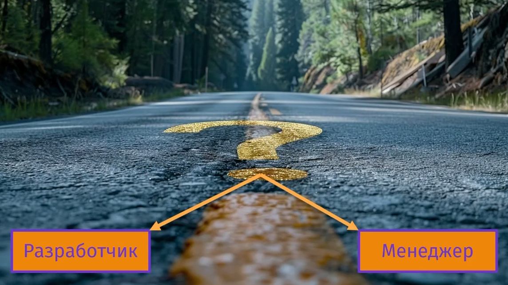

Для развития в сторону менеджера стоит изучить аспекты Agile через восемь компетенций Agile Coach / дополнительные тренинги.

### Менеджерство

Можно попробовать взглянуть на Agile-коучинг с точки зрения "Системы 8-и компетенций Agile-коуча" Лисы Адгенс.

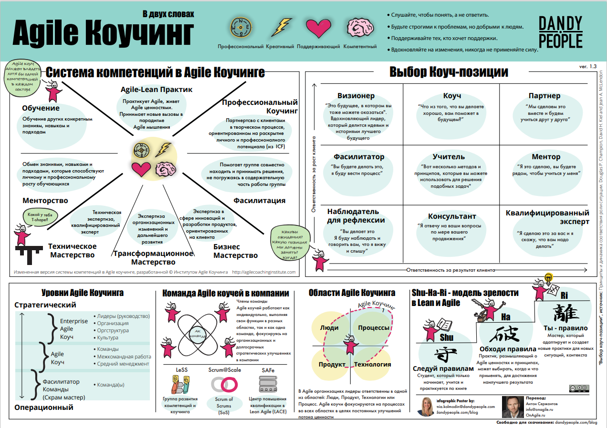

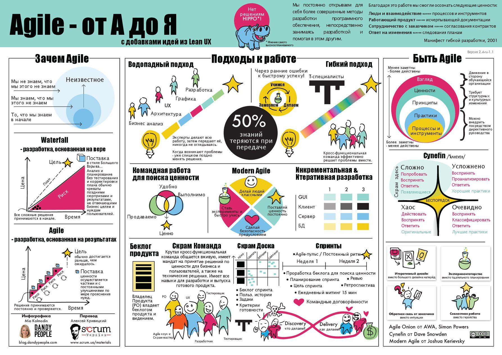

Популярные тренинговые центры по Agile:

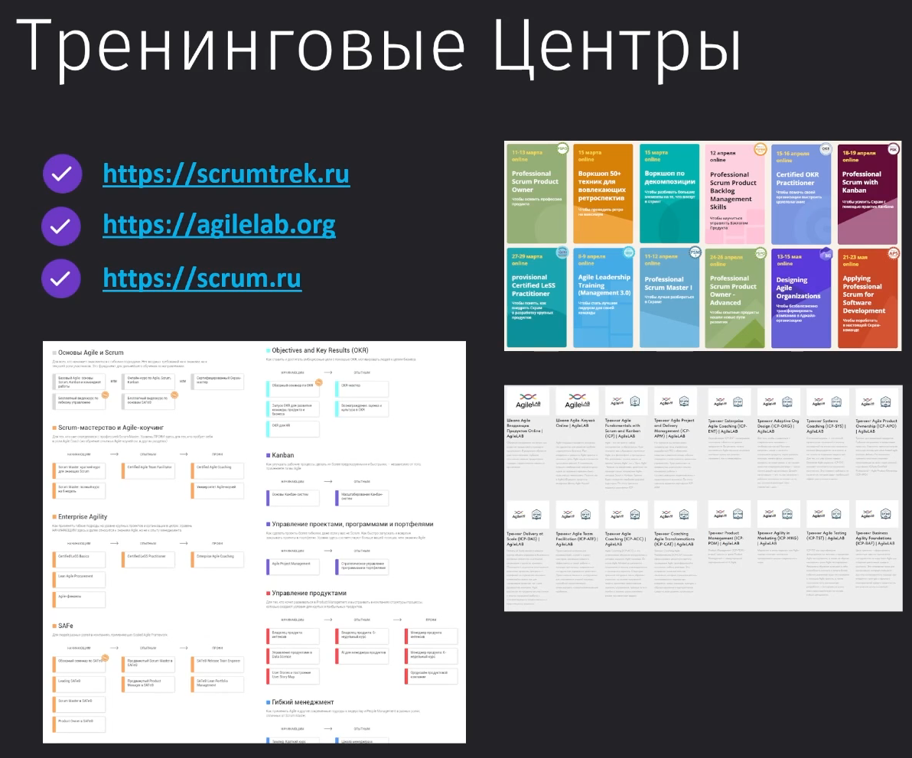

[CustDev](https://practicum.yandex.ru/blog/chto-takoe-custdev/)

# Дополнительно

## Waterfall vs Agile

Идейно Waterfall - это подход, который крайне актуален в **проектной** разработке. Тут нам нужно поделить чётно зоны ответственности, где каждый будет выполнять свою роль и быстро закрывать задачу. Никаких идей - только сухое решение проблем заказчика.

Agile - это обратная сторона, где постоянно ищутся идеи, поощряется инициатива, ведётся разработка ценности. Он актуален для **продуктового** подхода. Тут нам важно найти свой особенный подход для продукта. 

Waterfall стремится за производительностью, а Agile за результативностью.

### Особенности

| Метрика      | Проектный подход (Waterfall)                                     | Продуктовый подход (Agile)                                          |
| ------------ | ---------------------------------------------------------------- | ------------------------------------------------------------------- |
| Цель         | Выполнить в срок и бюджет                                        | Достичь целей и максимизировать ценность                            |
| Фокус        | Завершение проекта                                               | Удовлетворение потребности пользователя                             |
| Длительность | Явное начало и конец                                             | Продолжается, пока приносит ценность                                |
| Мера успеха  | Соблюдён бюджет, сдан в срок, воспроизведено заявленное качество | Метрики, удовлетворение пользователя, рыночная доля, рентабельность |

### Культура

| Проектный подход             | Продуктовый подход                                             |
| ---------------------------- | -------------------------------------------------------------- |
| Специализация (СРТ)          | Открытось к изменениям                                         |
| Иерархия                     | Сотрудничество                                                 |
| Аналитические навыки         | Самоорганизация                                                |
| Планирование и исполнение    | Прозрачность                                                   |
| Дисциплина и ответственность | Постоянно обучение и рефлексия                                 |
| Ориентация на процесс        | Постоянное улучшение продукта                                  |
| Исполнительность и терпение  | Высокая мотивация                                              |
|                              | Ценность-дривен мышление (основная цель - принесение ценности) |

В Agile методологии очень важно пропагадировать ценности продукта, лучшие практики и правильные подходы, чтобы у команды была цель реализовать лучшую версию продукта

### Сравнение

| Waterfall                                              | Agile                                                                                      |
| ------------------------------------------------------ | ------------------------------------------------------------------------------------------ |
| Очень прибылен                                         | Позволяет создавать сложные продукты, которые, возможно, ещё никто никогда не разрабатывал |
| Снижаются требования к разработчику                    | Очень способствует развитию                                                                |
| Легко масштабируется за счёт воспроизводимых процессов |                                                                                            |

>[!summary] Agile создаёт продукт, а Waterfall его воспроизводит

## Фреймворки и методологии

### GIST Framework

(G - Goals, I - Ideas, S - Step-projects, T - Tasks)  
Методика продуктового менеджмента и планирования работы, предложенная Itamar Gilad.

Методология старается уменьшить бюрократию и сделать планирование гибким.

Как работает:
- Goals — долгосрочные цели (например, "увеличить удержание пользователей").
- Ideas — гипотезы и инициативы, которые могут привести к достижению целей.
- Step-projects — короткие проекты (обычно ≤ 10 недель), чтобы проверить гипотезы.
- Tasks — конкретные задачи для реализации проекта.

Вместо фиксированного roadmap тут используется адаптивное управление через приоритизацию идей и быстрые эксперименты.

### Event Modeling

Способ проектирования информационных систем через описание событий, которые происходят во времени.

Как работает:
- Всё приложение описывается как **поток событий** (что произошло) и **состояний** (что изменилось).
- Используются **таймлайны**: "Событие → Команда → Проекция → UI".
- Помогает разработчикам и бизнесу говорить на одном языке.

Особенность: альтернатива UML/ER-диаграммам, ближе к Event Sourcing + CQRS. Отлично подходит для систем с высокой сложностью бизнес-логики.

### OMG Essence

Используется для сравнения методологий разработки.

Вместо жёсткого следования Scrum/XP/SAFe и т.д., есть "кирпичики" (альфы, активности, компетенции), из которых можно собирать свою методологию.

Особенность:
- Универсальный язык для описания практик.
- Позволяет "легализовать" кастомные процессы, а не только канонические Scrum/Kanban.
- Используется как фреймворк для методологий, а не методология сама по себе.

### Scrumfall

Гибрид **Scrum + Waterfall**.

Как выглядит:
- Вроде бы команды работают по Scrum (спринты, демо, стендапы).
- Но при этом сверху идёт классический waterfall-подход: фиксированные требования, долгие согласования, жёсткий roadmap.

> Спринты есть, но менять требования нельзя.

Зачастую встречается в корпорациях, где agile хотят внедрить, но полностью перестроить процессы не получилось.

### Crystal Clear

Из семейства Crystal Methods, автор — Alistair Cockburn

Минималистичный Agile-процесс для малых команд (≤ 8 человек).

Принципы:
- Частая доставка работающего ПО (каждые 2–3 месяца).
- Удобное взаимодействие в команде (лучше в одной комнате).
- Минимум артефактов и правил.
- Адаптивность к проекту и людям.

Основные понятия: 
1. Проектирование
2. Доставка
3. Итерации
4. Период интеграции
5. Собственно разработка

Особенность: одна из самых "лёгких" agile-методологий, где упор на общение и результат, а не на формальности.

### DSDM

Одна из первых Agile-методологий (1994, UK).

Идея: управление проектами с жёсткими ограничениями по срокам и бюджету.

Принципы:
- Timeboxing (фиксированные итерации).
- Приоритизация по правилу **MoSCoW** (Must, Should, Could, Won’t).
- Активное участие заказчика.
- Частая поставка работающего продукта.

Особенность: предшественник Scrum и XP, но до сих пор используется в Европе как более формализованный agile-подход.

### Итоги: 

| Методология    | Основное назначение                                  | Размер команды    | Уровень формализации | Сфера применения                                 | Особенности                                                  |
| -------------- | ---------------------------------------------------- | ----------------- | -------------------- | ------------------------------------------------ | ------------------------------------------------------------ |
| GIST Framework | Управление продуктом, приоритизация идей и гипотез   | Любой             | Низкий               | Продуктовый менеджмент, стартапы                 | Goals → Ideas → Step-projects → Tasks, быстрые эксперименты  |
| Event Modeling | Проектирование ИС через события                      | Средние и крупные | Средний              | Сложные бизнес-системы, event-driven             | Визуальные таймлайны событий, альтернатива UML               |
| OMG Essence    | Конструктор методологий, унификация процессов        | Любой             | Высокий (метамодель) | Организации, которые создают/адаптируют процессы | “Лего” из практик (альфы, активности, компетенции)           |
| Scrumerfall    | Компромисс Scrum + Waterfall                         | Средние и крупные | Средний              | Корпорации, госзаказы                            | Формально Scrum, фактически Waterfall сверху                 |
| Crystal Clear  | Лёгкий agile для маленьких команд                    | ≤ 8 человек       | Очень низкий         | Малые команды, пилоты, R&D                       | Минимум артефактов, упор на общение и быстрые поставки       |
| DSDM           | Управление проектами в жёстких рамках (время/бюджет) | Малые и средние   | Высокий              | Классические IT-проекты, Европа                  | Timeboxing, MoSCoW-приоритизация, активное участие заказчика |

- GIST — для продуктового управления и приоритизации идей.
- Event Modeling — для проектирования систем через события.
- Essence — конструктор методологий.
- Scrumerfall — "фейковый" Agile, смесь Scrum и Waterfall.
- Crystal Clear — лёгкая методология для маленьких команд.
- DSDM — ранний agile с timeboxing и MoSCoW.
