---
tags:
  - agile
  - scrum
  - kanban
  - lean
  - sbergile
  - less
aliases:
  - Agile
  - Scrum
---

# Agile (Scrum, Kanban, Lean)

**Связанные материалы:**
- [Kanban](kanban.md) -- метод управления потоком задач
- [Scrum](scrum.md) -- фреймворк итеративной разработки
- [Масштабирование Agile](scaling.md) -- Nexus, LeSS, SAFe, Spotify, Sbergile
- [Практики](practices.md) -- оптимизация рабочих процессов, инженерные практики
- [Метрики Agile](metrics.md) -- метрики потока, DORA, качества, команды
- [Teamlead Roadmap](Teamlead.md) -- компетенции технического лидера
- [Структура IT-команды](command.md) -- роли, грейды, иерархия
- [Как быть хорошим тимлидом](Как%20быть%20хорошим%20тимлидом.md) -- практические советы
- [DISC модель](DISC.md) -- типы личности в команде
- [Team](Team.md) -- командная работа

---

## Введение

### Agile

Agile -- это подход, который позволяет оптимизировать процессы работы над продуктом. Он глубоко укоренился в процессах больших команд разработки и положительно на них влияет.

- Влияние на бизнес: Agile способствует успешному ведению бизнеса благодаря улучшению командной работы.
- Личный опыт: Реальные примеры облегчения рабочих процессов и уменьшения ошибок с внедрением Agile.
- Примеры успеха: Успешное завершение крупных проектов, в том числе ФБР и Agile-трансформация Сбербанка под руководством Германа Грефа, подчеркнувшего важность скорости.

Agile включает в себя ежедневные встречи, спринты, ретроспективы, автоматические тесты приложения.

Agile внедряют для оптимизации процессов

### Модель Кеневин (Cynefin)

Разработал модель Дэйв Сноуден, сотрудник IBM (1999) с целью анализа и принятия решений руководством.

> Сама модель предлагает разные способы решения задач на основе "среды обитания" (`Cynefin`)

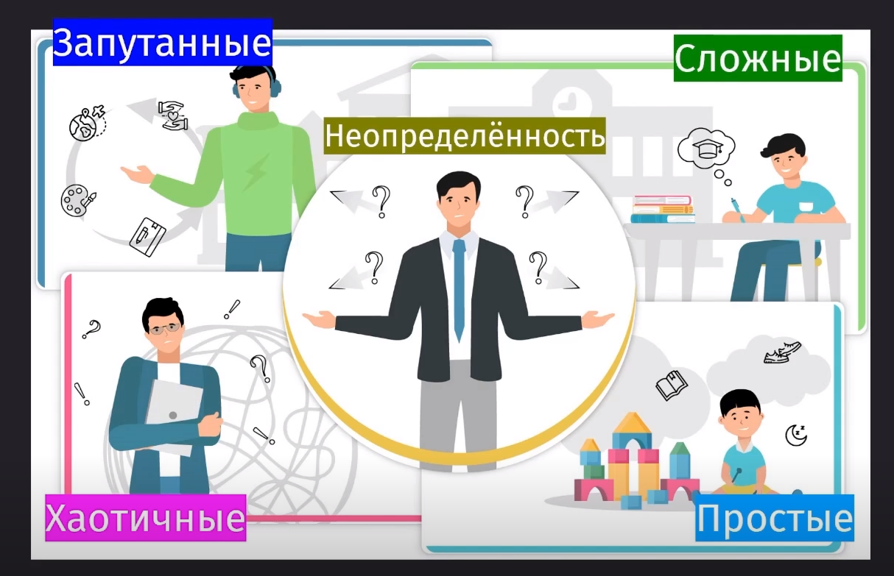

#### Категории задач по модели Кеневин

Всего модель описывает 5 разных категорий задач, которые могут попасться нам как на работе, так и в целом в жизни:

1. **Очевидные** (Clear / Simple) задачи
    - Четкие причинно-следственные связи. Есть конкретные инструкции к решению проблем.
    - Подход: Ощути, категоризируй, реагируй (Sense -- Categorize -- Respond)
    - Примеры: работа официанта, строителя по чертежу
2. **Сложные** (Complicated) задачи
    - Скрытые, но познаваемые причинно-следственные связи. Требуется экспертный анализ, чтобы найти решение.
    - Подход: Ощути, проанализируй, реагируй (Sense -- Analyze -- Respond)
    - Примеры: строительство дома, медицинское лечение, научные лаборатории, инженерные расчёты
3. **Запутанные** (Complex) задачи
    - Причинно-следственные связи обнаруживаются только ретроспективно. Нельзя предсказать результат заранее -- нужно экспериментировать.
    - Подход: Попробуй, ощути, реагируй (Probe -- Sense -- Respond)
    - Примеры: стартапы, инновационные проекты, разработка новых продуктов
4. **Хаотичные** (Chaotic) задачи
    - Отсутствие явных причинно-следственных связей. Нет времени на анализ -- нужно действовать немедленно, чтобы стабилизировать ситуацию.
    - Подход: Действуй, ощути, реагируй (Act -- Sense -- Respond)
    - Примеры: сбой в продакшене, кризис безопасности, стихийные бедствия
5. **Неопределённость** (Confusion / Disorder)
    - Неясность принадлежности к категории. Нужно определить, в какой области ты находишься прямо сейчас.
    - Подход: Сначала определи область

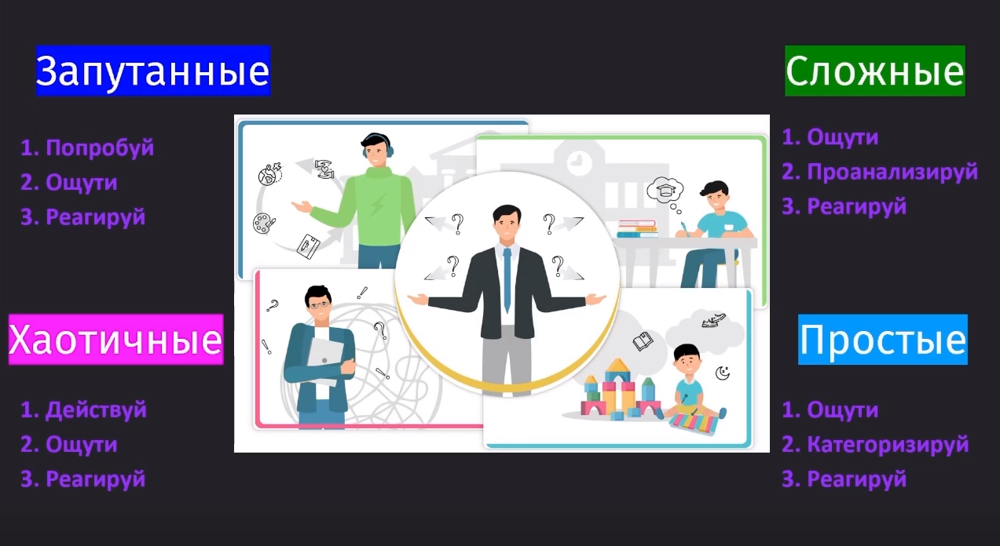

#### Применение модели

Данная модель позволяет определить, подходит ли Agile к данному проекту. Для различных проектов мы можем применять различные методы менеджмента команды:

- Запутанные (Complex) проекты требуют наличия гипотез и их проверки, что предоставляет нам Scrum внутри Agile
- Сложные (Complicated) проекты на зрелых стадиях не требуют сложных решений и проверки гипотез -- им достаточно будет следить за задачами через Kanban
- Системы мотивации: OKR для запутанных, KPI для сложных проектов
- В простых проектах можно накладывать задачи по системе Waterfall (то есть друг за другом), а в более сложных раскидывать задачи по PMI, Prince2 и PMBoK

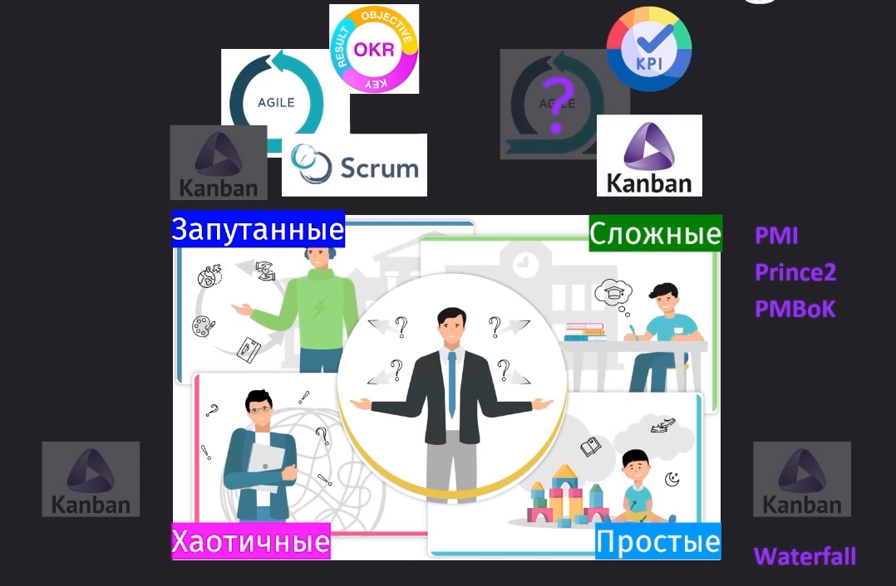

> [!info] Проекты могут менять свою область
>
> - Проекты могут менять категории в зависимости от изменения причинно-следственных связей
> - Пример: стартап переходит от запутанной к сложной области

#### Заключение

Модель Кеневин -- ключевой инструмент для понимания и управления различными типами задач в Agile-практиках, позволяющий выбрать наиболее эффективный подход к решению задач и управлению проектами.

### Agile-манифест

Agile -- это философия, основанная на Манифесте Agile, включающем в себя четыре ценности и двенадцать принципов.

11 февраля 2001 года: В штате Юта, семнадцать экспертов разработали Agile-манифест. Созданы четыре ценности и двенадцать принципов Agile.

Ценности Agile:

1. *Люди и взаимодействия* важнее процессов и инструментов.
2. *Работающий продукт* важнее исчерпывающей документации.
3. *Сотрудничество с заказчиком* важнее согласования условий контракта.
4. *Готовность к изменениям* важнее следования первоначальному плану.

12 Принципов Agile:

1. Удовлетворение требований заказчика через раннюю и регулярную поставку продукта.
2. Приветствие изменений требований, даже на поздних стадиях разработки.
3. Частая поставка работающего продукта.
4. Ежедневная работа разработчиков и бизнеса вместе.
5. Поддержка мотивированных профессионалов.
6. Непосредственное общение как эффективный способ обмена информацией.
7. Работающий продукт как основной показатель прогресса.
8. Поддержание устойчивого процесса разработки.
9. Внимание к техническому совершенству и качеству.
10. Простота и минимизация лишней работы.
11. Развитие требований и решений через самоорганизующиеся команды.
12. Регулярный анализ и улучшение эффективности.

Ключи к пониманию Agile:

1. **Коммуникация**: Центральная роль общения и командного взаимодействия. Примерно 10% из 80-часового спринта отведено на общение разработчиков и менеджеров, чтобы понимать свои задачи. Очень важны фасилитация и коучинг коллег. Отвечает за принципы 4, 5, 6, 8, 11, 12.
2. **Эмпиризм**: Способность адаптироваться и изменять стратегию, основываясь на опыте. Отвечает за принципы 1, 2, 3, 4, 9, 12.
3. **Контроль качества**: Высокие стандарты качества и их поддержание. Отвечает за принципы 1, 4, 7.

Agile -- это не только инструменты и методологии, но и философия, основанная на гибкости, адаптации и тесном взаимодействии команды для достижения лучших результатов.

### Эмпиризм

Эмпиризм -- это философское направление, согласно которому знание или обоснование исходят только или главным образом из чувственного опыта.

Опыт -- источник знания, единственный критерий истины и основание всякой науки.

Рационализм -- это уже противоположное эмпиризму направление, когда за основу берётся автономность разума от чувств и приоритетом является разум в познании. Порядок и связь идей в разуме соответствует порядку и связи вещей в мире.

#### Эмпиризм в Agile

Эмпиризм (опыт) стоит в основе Agile, делая его подходы гибкими и позволяя быстро адаптироваться к изменениям, благодаря чему Agile и получает своё название -- "гибкий".

В Agile значительное место занимает адаптация к изменениям, что предполагает пересмотр первоначальных планов в пользу нового опыта и требований.

Сам по себе план редко когда сбывается и поэтому главное -- уметь подстраивать план под новую действительность, когда задачи и приоритеты меняются.

- **Принципы гибкого подхода**:
    1. Удовлетворение потребностей заказчика через регулярную и раннюю поставку.
    2. Поддержка изменения требований на любых этапах.
    3. Ежедневное сотрудничество между разработчиками и заказчиками.
    4. Внимание к техническому совершенству и качеству.
    5. Командная оценка эффективности работы и адаптация процессов.

#### Особенности каскадной модели (Waterfall)

Agile предлагает итеративную модель разработки, противопоставляясь каскадной модели (водопад), что позволяет быстрее реагировать на изменения и уменьшает бюрократизацию рабочего процесса.

Разработал данную модель Уинстон Ройс. Эта модель подходит для простых и быстрых проектов в заказной разработке. Но для сложных проектов она не подходит, потому как в них существует кратно большее количество неизвестных переменных.

По факту, мы получаем модель, в которой нам постоянно приходится возвращаться обратно и дорабатывать прошлые этапы.

Но у этой модели есть критические недостатки, которые не дают воспользоваться ей в больших проектах:

1. В конце у нас получается не то, что нужно, потому что все требования были приняты в самом начале пути
2. Слишком поздно идёт тестирование продукта
3. Очень тяжело попасть в сроки и бюджет (так как внести правки становится сложно)
4. Внесение самих изменений -- это проблема, так как в начале такой функционал не предусматривался

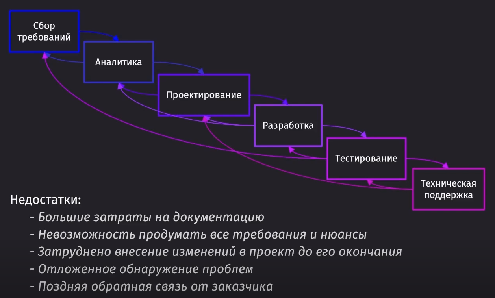

#### Цикл Деминга-Шухарта

Agile использует итерационные циклы, основанные на эмпирическом цикле Деминга-Шухарта (Plan-Do-Check-Act), улучшая гибкость и эффективность процессов.

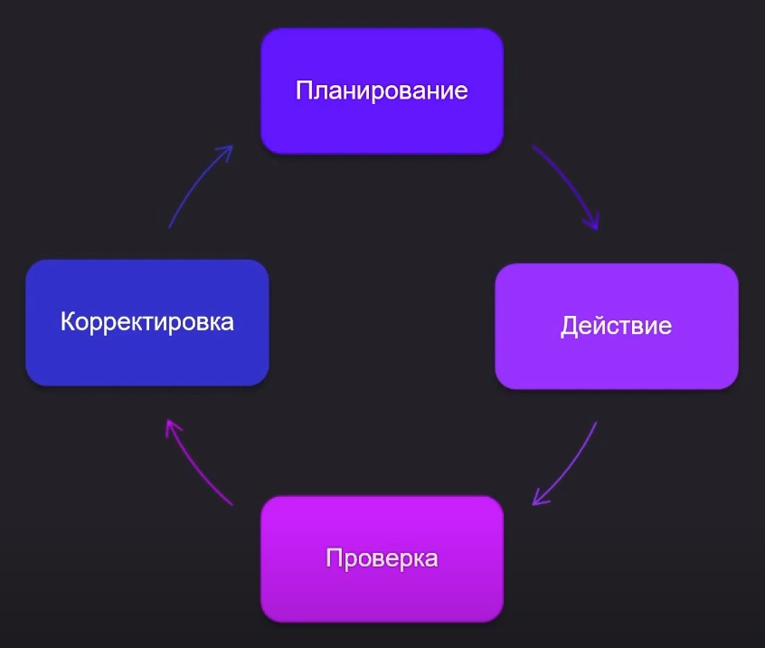

Сама по себе итеративная модель основана на цикле ДШ, но включает в каждом этапе те же самые этапы из вотерфола

Отличие в том, что весь путь разработки разбивается на короткие итерации, после которых уже идут нужные корректировки. Сам такой подход позволяет избавиться от большого количества бюрократии, что делает процесс гибким и эффективным.

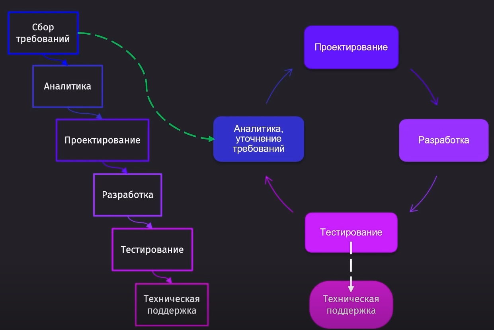

Во все эти этапы так же включены ==петли обратной связи== для своевременного взаимодействия и планирования дальнейших работ командой.

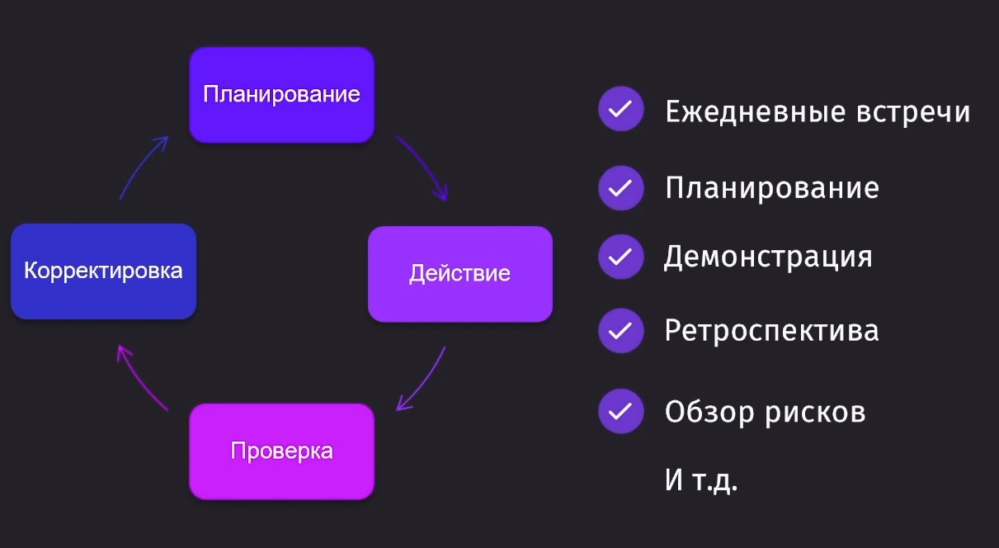

То есть после каждой итерации, в которой мы спланировали и сделали работу, у нас есть определённый результат, который можно откорректировать либо использовать уже для следующих этапов разработки продукта.

#### Столпы эмпиризма в Agile

Эти столпы -- это минимальный набор требований, без которых эмпиризм, а в этом случае и Agile, не будут работать.

1. Прозрачность -- делаем рабочий процесс видимым для всех участников.
    - Таблицы, графики, схемы, документация, честное и открытое общение, фиксация договорённостей
2. Инспекция -- регулярная проверка прогресса и выявление отклонений.
    - Ежедневные встречи, планирование, демонстрация, ретроспектива, обзор рисков
3. Адаптация -- корректировка процессов с целью минимизации отклонений.
    - По результатам инспекции будет произведён процесс адаптации с теми же методами из инспекции

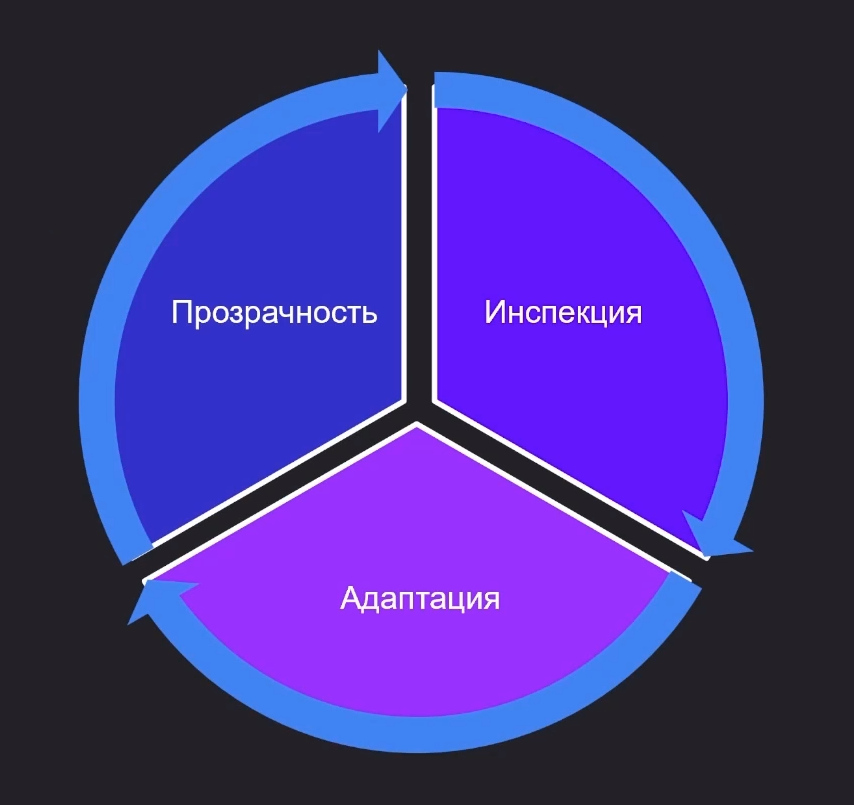

#### Заключение

Эмпиризм в Agile служит фундаментом для создания гибких и эффективных рабочих процессов, позволяя командам быстро адаптироваться к изменяющимся требованиям и реализовывать проекты с оптимальными результатами.

#### Спиральная модель. Time to Market. Rational Unified Process

##### Спиральная модель

Данная модель опирается на потребность в изготовлении раннего прототипа, тестирования и выпуска в маркет. Здесь находится достаточно большое количество шагов, на которых мы просто проверяем прототипы и анализируем потребности в разработке фичей, что сильно замедляет процесс разработки.

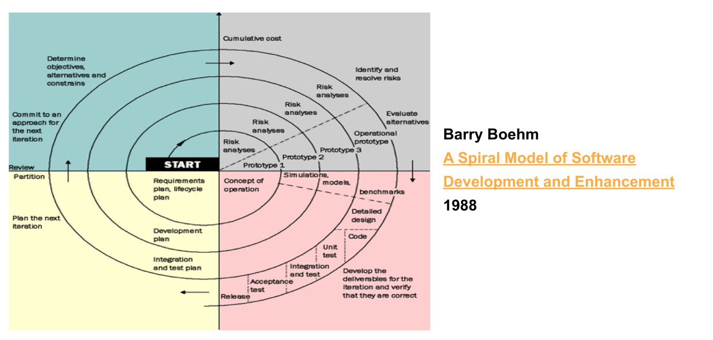

Но из основных недостатков можно выделить:

1. Тестирование реального продукта происходит на позднем этапе
2. Частые промахи по срокам и бюджету
3. Долгий Time to Market (TTM)

##### Rational Unified Process (RUP)

RUP использует итеративную модель разработки. В конце каждой итерации (в идеале продолжающейся от 2 до 6 недель) проектная команда должна достичь запланированных на данную итерацию целей, создать или доработать проектные артефакты и получить промежуточную, но функциональную версию конечного продукта.

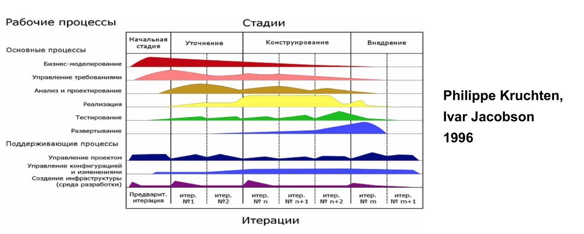

Плюсы:

1. Ранняя идентификация и устранение рисков
2. Концентрация на выполнении требований заказчика
3. Изменения в продукте от заказчика ожидаются
4. Компонентная архитектура, которая реализуется и тестируется на ранних стадиях
5. Постоянное обеспечение качества на всех этапах разработки продукта
6. Работа в сплочённой команде с ключевой ролью у архитекторов

Из недостатков можно выделить:

1. Большой TTM
2. Срыв сроков и бюджета
3. Тяжеловесность фреймворка
4. Тестирование реального продукта происходит на позднем этапе

В последствии RUP IBM переименовала в OpenUP

#### Обзор Extreme Programming. Ценности

Экстремальное программирование -- это сбор лучших практик из программирования и максимально частое их повторение.

Эту методологию разработал **Кент Бек** (Kent Beck) в 1999 году.

12 приёмов XP:

1. Разработка через тестирование (Test-driven development)
2. Игра в планирование (Planning game)
3. Заказчик всегда рядом (Onsite customer)
4. Парное программирование (Pair programming)
5. Непрерывная интеграция (Continuous integration)
6. Рефакторинг (Design improvement)
7. Частые небольшие релизы (Small releases)
8. Простота проектирования (Simple design)
9. Метафора системы
10. Коллективное владение кодом (Collective code ownership)
11. Стандарт оформления кода (Coding standard)
12. 40-часовая рабочая неделя (Sustainable pace)

Для применения практик самое важное -- это понимать ценности данного подхода.

- **Общение** -- это крайне важно на каждом этапе разработки продукта. Это самая важная ценность, которая дополняет все ценности.
- **Простота** -- решения должны быть простыми и решать определённые проблемы без оверинжиниринга там, где это не нужно
- **Обратная связь** очень важна во время общения с заказчиком, потому что все его недовольства и пожелания нужно учитывать вовремя и эффективно
- **Смелость**. Не нужно откладывать решение какой-то видимой проблемы на потом, лучше всё сделать сейчас даже если менеджер не поставил таску на решение этой проблемы
- **Уважение** -- нужно уважать опыт и мысли каждого члена команды

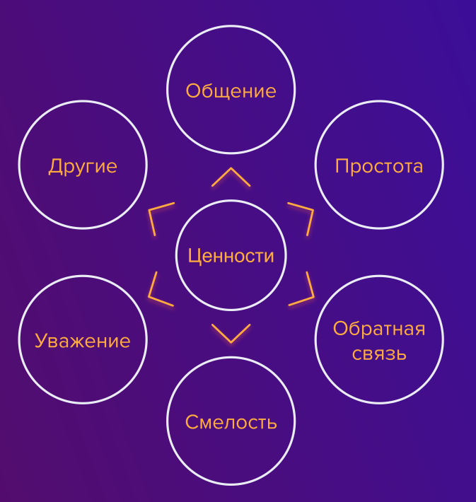

Самое важное -- это понимать, для чего мы используем каждый из подходов, потому что сам по себе подход может быть не нужен для каждой конкретной ситуации.

---

## Дополнительно

### Waterfall vs Agile

Идейно Waterfall -- это подход, который крайне актуален в **проектной** разработке. Тут нам нужно поделить чётко зоны ответственности, где каждый будет выполнять свою роль и быстро закрывать задачу. Никаких идей -- только сухое решение проблем заказчика.

Agile -- это обратная сторона, где постоянно ищутся идеи, поощряется инициатива, ведётся разработка ценности. Он актуален для **продуктового** подхода. Тут нам важно найти свой особенный подход для продукта.

Waterfall стремится за производительностью, а Agile за результативностью.

#### Особенности

| Метрика      | Проектный подход (Waterfall)                                     | Продуктовый подход (Agile)                                          |
| ------------ | ---------------------------------------------------------------- | ------------------------------------------------------------------- |
| Цель         | Выполнить в срок и бюджет                                        | Достичь целей и максимизировать ценность                            |
| Фокус        | Завершение проекта                                               | Удовлетворение потребности пользователя                             |
| Длительность | Явное начало и конец                                             | Продолжается, пока приносит ценность                                |
| Мера успеха  | Соблюдён бюджет, сдан в срок, воспроизведено заявленное качество | Метрики, удовлетворение пользователя, рыночная доля, рентабельность |

#### Культура

| Проектный подход             | Продуктовый подход                                             |
| ---------------------------- | -------------------------------------------------------------- |
| Специализация (СРТ)          | Открытость к изменениям                                        |
| Иерархия                     | Сотрудничество                                                 |
| Аналитические навыки         | Самоорганизация                                                |
| Планирование и исполнение    | Прозрачность                                                   |
| Дисциплина и ответственность | Постоянное обучение и рефлексия                                |
| Ориентация на процесс        | Постоянное улучшение продукта                                  |
| Исполнительность и терпение  | Высокая мотивация                                              |
|                              | Ценность-дривен мышление (основная цель -- принесение ценности) |

В Agile методологии очень важно пропагандировать ценности продукта, лучшие практики и правильные подходы, чтобы у команды была цель реализовать лучшую версию продукта

#### Сравнение

| Waterfall                                              | Agile                                                                                      |
| ------------------------------------------------------ | ------------------------------------------------------------------------------------------ |
| Очень прибылен                                         | Позволяет создавать сложные продукты, которые, возможно, ещё никто никогда не разрабатывал |
| Снижаются требования к разработчику                    | Очень способствует развитию                                                                |
| Легко масштабируется за счёт воспроизводимых процессов |                                                                                            |

> [!summary] Agile создаёт продукт, а Waterfall его воспроизводит

### Фреймворки и методологии

#### GIST Framework

(G -- Goals, I -- Ideas, S -- Step-projects, T -- Tasks)
Методика продуктового менеджмента и планирования работы, предложенная Itamar Gilad.

Методология старается уменьшить бюрократию и сделать планирование гибким.

Как работает:
- Goals -- долгосрочные цели (например, "увеличить удержание пользователей").
- Ideas -- гипотезы и инициативы, которые могут привести к достижению целей.
- Step-projects -- короткие проекты (обычно <= 10 недель), чтобы проверить гипотезы.
- Tasks -- конкретные задачи для реализации проекта.

Вместо фиксированного roadmap тут используется адаптивное управление через приоритизацию идей и быстрые эксперименты.

#### Event Modeling

Способ проектирования информационных систем через описание событий, которые происходят во времени.

Как работает:
- Всё приложение описывается как **поток событий** (что произошло) и **состояний** (что изменилось).
- Используются **таймлайны**: "Событие -> Команда -> Проекция -> UI".
- Помогает разработчикам и бизнесу говорить на одном языке.

Особенность: альтернатива UML/ER-диаграммам, ближе к Event Sourcing + CQRS. Отлично подходит для систем с высокой сложностью бизнес-логики.

#### OMG Essence

Используется для сравнения методологий разработки.

Вместо жёсткого следования Scrum/XP/SAFe и т.д., есть "кирпичики" (альфы, активности, компетенции), из которых можно собирать свою методологию.

Особенность:
- Универсальный язык для описания практик.
- Позволяет "легализовать" кастомные процессы, а не только канонические Scrum/Kanban.
- Используется как фреймворк для методологий, а не методология сама по себе.

#### Scrumfall

Гибрид **Scrum + Waterfall**.

Как выглядит:
- Вроде бы команды работают по Scrum (спринты, демо, стендапы).
- Но при этом сверху идёт классический waterfall-подход: фиксированные требования, долгие согласования, жёсткий roadmap.

> Спринты есть, но менять требования нельзя.

Зачастую встречается в корпорациях, где agile хотят внедрить, но полностью перестроить процессы не получилось.

#### Crystal Clear

Из семейства Crystal Methods, автор -- Alistair Cockburn

Минималистичный Agile-процесс для малых команд (<= 8 человек).

Принципы:
- Частая доставка работающего ПО (каждые 2-3 месяца).
- Удобное взаимодействие в команде (лучше в одной комнате).
- Минимум артефактов и правил.
- Адаптивность к проекту и людям.

Основные понятия:
1. Проектирование
2. Доставка
3. Итерации
4. Период интеграции
5. Собственно разработка

Особенность: одна из самых "лёгких" agile-методологий, где упор на общение и результат, а не на формальности.

#### DSDM

Одна из первых Agile-методологий (1994, UK).

Идея: управление проектами с жёсткими ограничениями по срокам и бюджету.

Принципы:
- Timeboxing (фиксированные итерации).
- Приоритизация по правилу **MoSCoW** (Must, Should, Could, Won't).
- Активное участие заказчика.
- Частая поставка работающего продукта.

Особенность: предшественник Scrum и XP, но до сих пор используется в Европе как более формализованный agile-подход.

#### Итоги

| Методология    | Основное назначение                                  | Размер команды    | Уровень формализации | Сфера применения                                 | Особенности                                                  |
| -------------- | ---------------------------------------------------- | ----------------- | -------------------- | ------------------------------------------------ | ------------------------------------------------------------ |
| GIST Framework | Управление продуктом, приоритизация идей и гипотез   | Любой             | Низкий               | Продуктовый менеджмент, стартапы                 | Goals -> Ideas -> Step-projects -> Tasks, быстрые эксперименты  |
| Event Modeling | Проектирование ИС через события                      | Средние и крупные | Средний              | Сложные бизнес-системы, event-driven             | Визуальные таймлайны событий, альтернатива UML               |
| OMG Essence    | Конструктор методологий, унификация процессов        | Любой             | Высокий (метамодель) | Организации, которые создают/адаптируют процессы | "Лего" из практик (альфы, активности, компетенции)           |
| Scrumfall      | Компромисс Scrum + Waterfall                         | Средние и крупные | Средний              | Корпорации, госзаказы                            | Формально Scrum, фактически Waterfall сверху                 |
| Crystal Clear  | Лёгкий agile для маленьких команд                    | <= 8 человек      | Очень низкий         | Малые команды, пилоты, R&D                       | Минимум артефактов, упор на общение и быстрые поставки       |
| DSDM           | Управление проектами в жёстких рамках (время/бюджет) | Малые и средние   | Высокий              | Классические IT-проекты, Европа                  | Timeboxing, MoSCoW-приоритизация, активное участие заказчика |

---

## Заключение

Текущий стек различных подходов уже подходит для разработчиков и позволяет свободно ощущать себя в Agile-методологиях

Для развития в сторону менеджера стоит изучить аспекты Agile через восемь компетенций Agile Coach / дополнительные тренинги.

### Менеджерство

Можно попробовать взглянуть на Agile-коучинг с точки зрения "Системы 8-и компетенций Agile-коуча" Лисы Адкинс.

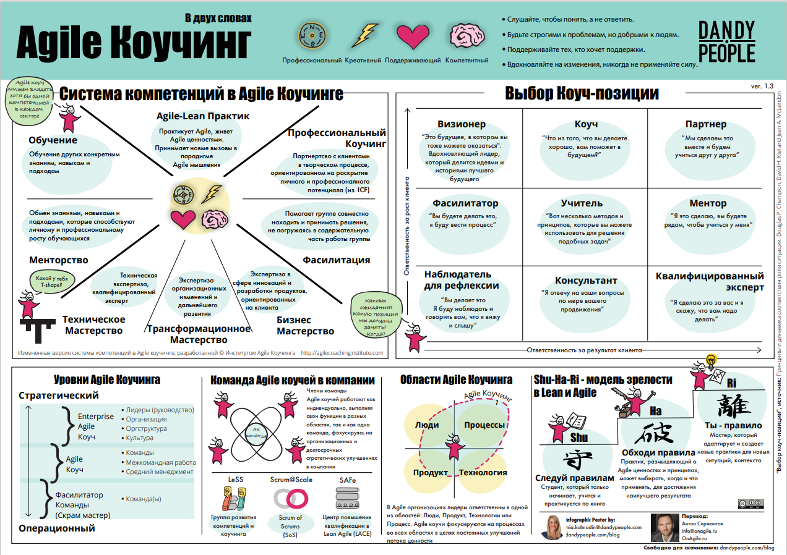

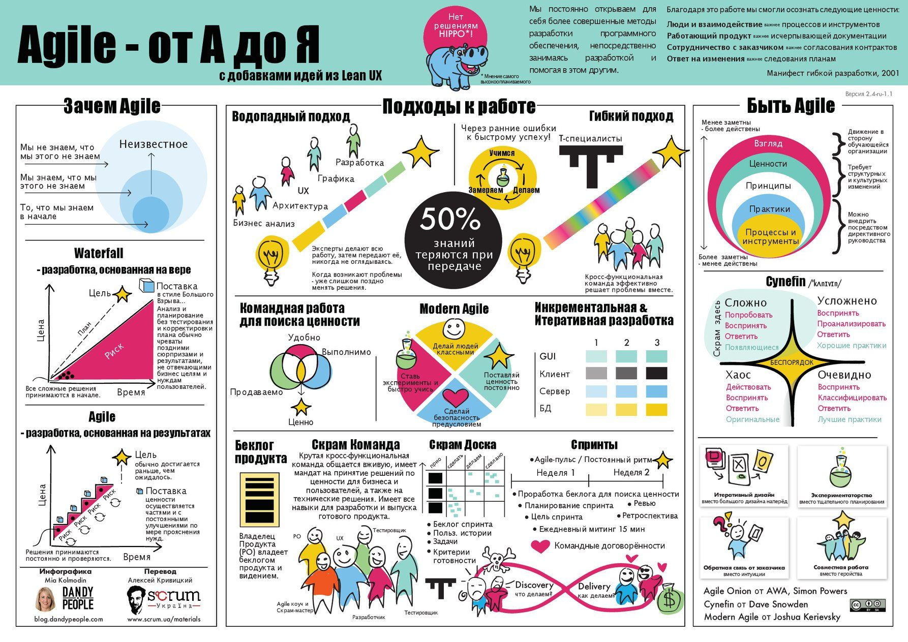

Популярные тренинговые центры по Agile:

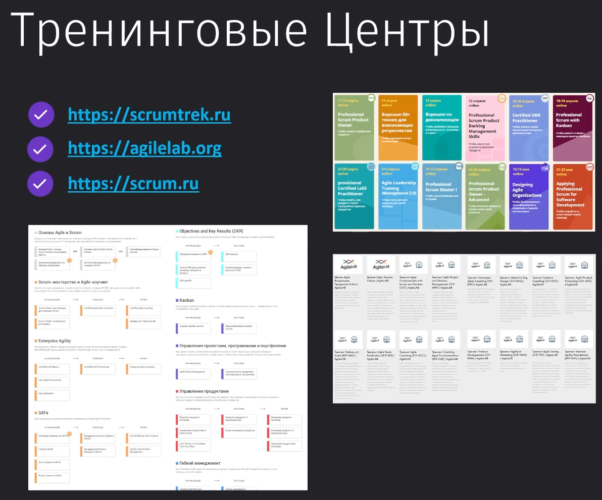

[CustDev](https://practicum.yandex.ru/blog/chto-takoe-custdev/)
