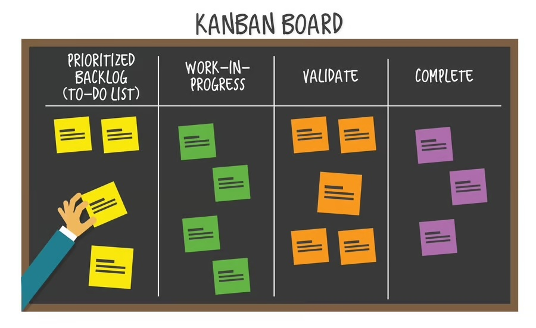
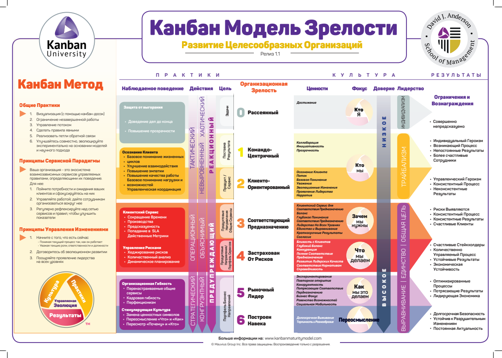
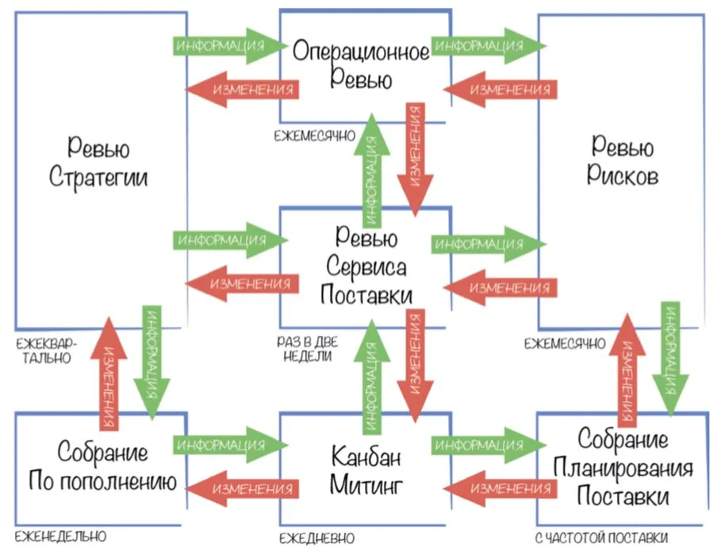
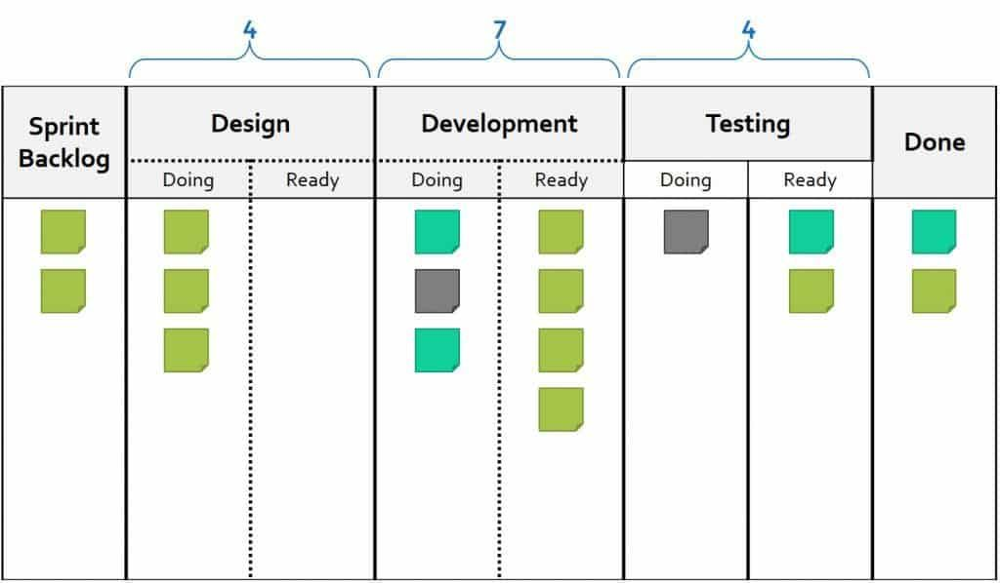
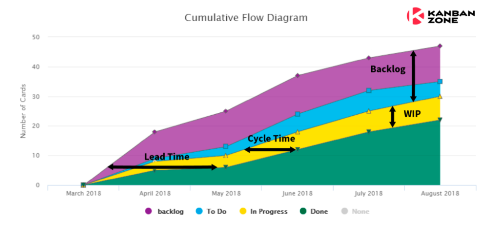
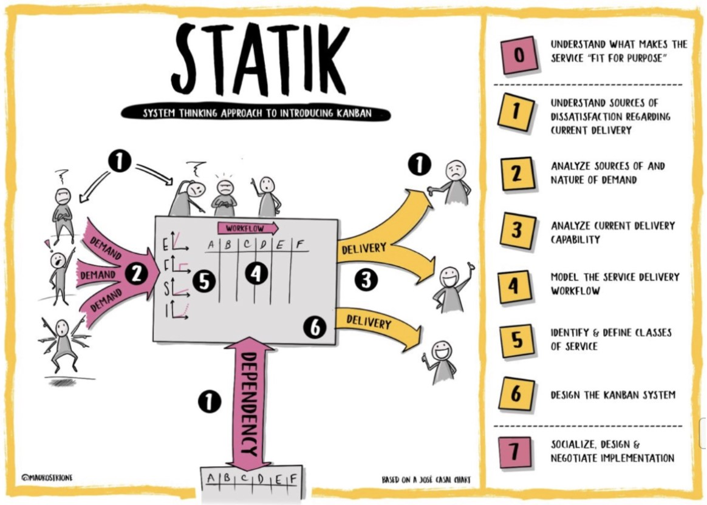

---
tags:
  - agile
  - kanban
  - lean
aliases:
  - Kanban
  - Канбан
---

# Kanban

## Введение

#agile #kanban

> [!info] Kanban (яп. сигнал, карточка, квитанция) - это метод, который является частью многих других фреймворков. Он описывает способ распределения задач и их ведения.

### История Канбана

- Основа метода - опыт Toyota, начиная с 1926 года.
- Toyota перешла от производства ткацких станков к автомобилям, уделяя особенное внимание постоянному улучшению процессов.
- Важным этапом стало внедрение вытягивающей канбан-системы в 1948 году, ускоряющей производственный процесс за счёт изготовления по сигналу определённых деталей для определённых моделей машин.
- Термин "бережливое производство" (Lean Manufacturing) был введён в 1988 году Джоном Крафчиком, описывающим подобные подходы.
- Дэвид Андерсон в 2006 году сформулировал Канбан-метод, вдохновляясь идеями бережливого производства и системой Toyota.

### Ключевые принципы Канбана

- Сервис
    - Канбан сосредоточен на поставке результатов на основе услуг
- Поток ценности
    - Важно понимание потока ценностей от команды разработчиков
    - Важнее сосредоточение на доставке ценности, чем на выполнении задач
- Уникальность каждого процесса
    - Подход должен быть адаптирован под процессы в компании
    - Метод должен быть подогнан индивидуально для каждого случая
- Методология эволюционного улучшения
    - Вместо радикальных изменений, нужно делать прогресс маленькими шажками
    - Начните то, чем вы сейчас занимаетесь и улучшайте это
- Вытягивающая канбан-система
- Договорённости
    - На всех уровнях от разработки, менеджеров до заказчиков - все должны иметь определённые договорённости между собой по продукту

### Канбан и Agile

Для того, чтобы определить сущность Kanban, нужно обратиться к терминологии. Методика, метод и методология - это научные термины, которыми описывают различные сущности.

> Методика - это рецепт, алгоритм. Чёткая последовательность действий для достижения результата.

> Метод - способ достижения цели. Это группа возможных способов достижения результата.

> Методология - это учение о поиске подходящих методов.

> Фреймворк - это жёсткий набор определённых правил и методологий, которые мы применяем для достижения результата. То есть у нас есть определённый набор инструментов, из которого у нас получится определённый результат.

Kanban шире методов и принципов Agile, поэтому так же и не является Agile-методом или методологией. Его можно встроить и подстроить под эти принципы.

### Заключение

Для более подробного изучения материала по Kanban и доступа к сертифицированным тренингам, можно воспользоваться [Kanban University](https://kanban.university/).

Так же можно почитать книги Дэвида Андерсона о Канбане и "Дао Тойота" Джеффри Лайкера для глубокого понимания метода и его истории.

---

## Ценности

Как и у любого другого метода, у Kanban есть свои ценности, которые определяют основы этой методологии:

1. Прозрачность - важность полной видимости всех процессов для всех участников.
2. Баланс - равновесие всех аспектов работы: требований, возможностей команды, нагрузки и т.д. Оптимизировать нужно не отдельные участки, а брать во внимание весь процесс.
3. Сотрудничество - основа успешного рабочего процесса, заключается в качественной командной работе.
4. Ценность Клиента - ориентированность на нужды и приоритеты заказчика, создание ценности для него.
5. Поток - понимание и управление потоком создания ценности, знание его этапов и влияющих на него факторов.
6. Лидерство - принятие ответственности, умение вдохновлять и вести за собой. _Это одна из важнейших ценностей kanban-метода._
7. Понимание - знание текущего состояния процесса и направления его развития, умение различать полезное и вредное.
8. Согласие - умение прийти к совместным договоренностям и соблюдать их.
9. Уважение - основа всех принципов и ценностей Канбан, взаимное уважение внутри команды.

### Как определить ценность

1. Что в команде понимают под ценностью, которую они производят?
2. Как эта ценность может проявляться?
3. Как эта ценность проявляется в вашей команде?
4. Как хотелось бы, чтобы она проявлялась?
5. Предложения по улучшению рабочего процесса.

---

## Модель зрелости

> [!info] **Модель зрелости Kanban** - это набор рисков, рекомендаций и практик в зависимости от текущего уровня зрелости компании.

Модель зрелости Kanban описывает эволюцию организационных процессов через семь уровней от нулевого до шестого. Эти уровни помогают компаниям ориентироваться в своем развитии и внедрении лучших практик.

[ПДФ](https://files.kaiten.ru/d94fa916-2217-49b9-a621-8b86a2e0efee/97ecf6a7-7e95-4565-b8da-9552cc816b75.pdf?name=KMM-A3-CoBranding-V18-1_RUS_1.pdf)

Всего насчитывается 196 практик, количество которых продолжает расти. Эти практики касаются различных аспектов работы компании, включая организацию, взаимодействие с клиентами, управление рисками и продуктами.

### Уровни Зрелости

1. Рассеянный (0) - Отсутствие структурированных изменений и самоориентация сотрудников. Каждый сотрудник опирается на свои результаты относительно работы.
2. Командно-центричный (1) - Визуализация работы и командная синхронизация. Компания осознаёт ценность командной работы, а сотрудники согласовывают правила.
3. Клиенто-ориентированный (2) - Фокус на ценности для клиента. Команды не участвуют в этом уровне и даже могут отсутствовать.
4. Соответствующие предназначению (3) - Глубокое понимание потребностей клиентов и предназначения компании. Все отношения с клиентами налажены, сотрудники понимают в чём предназначение команд и компании в целом.
5. Застрахован от рисков (4) - Стратегическое планирование, прогнозирование результатов, формирование бюджетов и снижение рисков.
6. Рыночный лидер (5) - Узнаваемый бренд с понятным качеством и оптимизация процессов (уменьшение затрат, увеличение скорости поставки).
7. Построен на века (антихрупкость) (6) - Гибкость и способность к быстрой адаптации.

Всю более подробную информацию можно черпнуть из книги Дэвида Андерсона и Теодора Божевой "Модель зрелости Канбан", сайт [kmm.plus](https://kmm.plus/en/).

### Заключение

Модель зрелости Kanban - это мощный инструмент для развития и оптимизации рабочих процессов в компании, позволяющий более эффективно соответствовать потребностям клиентов и условиям рынка.

---

## Роли

> [!info] Роль - это набор функций, которые может выполнять один человек, группа людей или вся команда.

Нужно отметить, что не всегда отдельная роль - это отдельный человек с отдельной позицией. Роль могут выполнять разные люди в разные моменты времени. Однако в том же Scrum работу мастеринга выполняет отдельный Scrum-мастер.

В Сбербанке некоторые Kanban-роли совмещены и называются Service Delivery Lead.

В Kanban выделяют две ключевые роли:

- Service Delivery Manager (SDM)
- Service Request Manager (SRM).

### Service Delivery Manager (SDM)

> SDM - менеджер поставки сервиса. Он отвечает за предоставление сервиса.

Задачами SDM являются:

- Ответственность за поставку: Убедиться, что услуга или продукт доставлен заказчику.
- Планирование, координация и контроль: Назначать задачи, проводить ежедневные собрания, контролировать препятствия и выполнение задач.
- Коммуникация с клиентами: Строить контакты, выявлять потребности, уточнять детали.
- Анализ рисков: Управление рисками, разработка стратегий их снижения.
- Бюджетирование: Участие в планировании бюджета.
- Развитие команды: Организация обучения, проведение мастер-классов, составление карты компетенций.

Выполняет эту работу, как правило: Team Lead или менеджер продукта, в Scrum - вся команда.

### Service Request Manager (SRM)

> SRM - менеджер запросов к сервису

Задачами SRM являются:

- Выбор работы для команды: Определение, над какими задачами должна работать команда.
- Коммуникация с заказчиками: Выявление потребностей, общение, установление приоритетов задач.
- Работает с большими задачами. Декомпозиция крупных задач, управление созависимыми задачами, решение вопросов.
- Определяет приоритеты. Различает степень потребности в определённых фичах от заказчиков.
- Управляет зависимостями задач. Определяет зависимости между задачами и выстраивает последовательность и приоритеты их выполнения.

Выполняет эту работу, обычно: Клиент-менеджер, менеджер продукта, владелец продукта.

### Реализация

1. Определить и записать, кто такие SDM и SRM в компании, какие их функции и задачи.
2. Рассмотреть, как распределяются эти роли в команде, и как это влияет на работу.
3. Как изменения в выполнении этих ролей могут улучшить рабочий процесс, командную работу и в итоге принести пользу компании.

### Заключение

Рассмотрение этих ролей позволит более эффективно организовать рабочий процесс, улучшить взаимодействие между командой и заказчиками, а также способствовать лучшему пониманию и выполнению задач.

---

## Каденции

> Каденции - это очень близкое к эмпиризму из [Agile](agile.md) понятие.

> [!info] Каденции - это регулярные встречи, на которых происходят озвучивание текущей ситуации, рефлексирование и планирование действий на основе известной информации.

> Каденции = Петли обратной связи = Циклы обратной связи = События = Командные встречи

Качество зависит от высокого уровня прозрачности, инспекции и адаптации.

Если в Scrum все события обязательны, то каденции в Kanban могут как проводиться, так и не проводиться.

### Виды Встреч

Типы встреч и их аналоги в Scrum:

1. Ежедневный Канбан (Канбан митинг) (= Ежедневный Скрам)
    - Формат: Ежедневная короткая встреча.
    - Задачи:
        - Анализ текущего потока
        - Устранение препятствий
        - Переставление задач на доске
2. Собрание по Пополнению (Планирование Спринта)
    - Периодичность: Рекомендуется еженедельно.
    - Задачи:
        - Определение списка задач, которые берут в работу (точка принятия обязательств)
3. Обзор Сервиса Поставки (Ревью Спринта / ретроспектива)
    - Участники: Включая конечных пользователей.
    - Цель:
        - Определить удовлетворенность клиентов
        - Определение способов улучшения сервиса.
        - В Kanban и Scrum: Анализ выполненной работы для улучшения процессов.
4. Планирование Поставки
    - Особенность Kanban: Собрание для определения готовых к поставке задач.
5. Уточнение Бэклога (это _upstream_ этап)
    - Цель: подготовка работ до пополнения.
6. Ревью Стратегии
    - Периодичность: Раз в квартал.
    - Цель: Сверка глобальных целей, адаптация дорожной карты.
    - Встречаются руководители разных уровней и "сверяют часы" по глобальным целям (верно ли идём, куда двинемся дальше), адаптируют дорожную карту
7. Операционное Ревью
    - Цель: Улучшение координации между командами, повышение эффективности.
    - Встречаются менеджеры разного уровня, чтобы способствовать лучшему взаимодействию команд, устранению препятствий, повышению эффективности компании в целом
8. Ревью Рисков
    - Задача: Выявляются риски и узкие места для своевременного противостояния им.

Последним трём пунктам нет аналогов в Scrum, так как Kanban распространяется не только на команду, но и на всю организацию, а Scrum только на одну команду.

### Внедрение

1. Ежедневные Встречи: Оцените их проведение в команде.
2. Собрание по Пополнению: Как оно организовано?
3. Обзор Сервиса Поставки: Есть ли у вас демонстрации?
4. Релизная Политика: Кто и как её проводит?
5. Предложения: Ваши идеи по улучшению рабочего процесса, с учетом каденций.

### Заключение

Каденции в Kanban так же важны, как и эмпиризм в Agile.

---

## Общие практики

Каждый этап модели зрелости соотносится с 6 основными практиками канбана, описанными в книге Дэвида Андерсона.

Практики модели зрелости - это частные случаи для каждой компании.

Модель зрелости включает в себя 196 практик, организованных вокруг 6 основных практик канбана. Эти 6 практик служат основой, поверх которой развиваются более конкретные подходы для каждого уровня зрелости компании.

### 6 Практик Канбана

1. Визуализация рабочего процесса
    - Использование канбан-досок для наглядного указания самой задачи и этапа её производства;
2. Ограничение количества работы в процессе (Work in Progress - WIP)
    - Мы должны ограничивать количество незавершённой работы, чтобы увеличить скорость разработки продукта и предотвратить перегрузки на определённом этапе;
    - Каждый столбец с этапом мы делим на две части (`doing|ready`) и от этого уже идём дальше
    - Ограничиваем максимальное количество задач в колонке. По достижению этого максимума - дальше уже перемещать в колонку задачи нельзя
    - На ежедневных встречах SDM просматривает задачи справа налево и пытается устранить перегрузы
    - Каждый перегруз - это явное препятствие
    - 
3. Управление потоком
    - Поток должен быть предсказуем
    - Проводите ежедневные встречи для оценки и оптимизации потока работы;
    - Используйте графики и диаграммы, в том числе накопительную диаграмму потока (CFD), для анализа эффективности; 
    - Подробнее о CFD см. [Метрики Agile - CFD](metrics.md#Cumulative%20Flow%20Diagram%20(CFD))
4. Ясные правила работы (договорённости)
    - Определите и сделайте явными правила и процедуры выполнения работы;
5. Циклы обратной связи (Каденции)
    - Внедряйте регулярные встречи для оценки рабочего процесса и выявления возможностей для улучшений;
6. Постоянное улучшение
    - Применяйте эмпиризм и цикл Деминга-Шухарта (PDCA) для постоянного анализа и улучшения процессов.

---

## STATIK

#kanban #STATIK

STATIK - это систематизированный подход для внедрения канбана.

STATIK (Systems Thinking Approach to Introducing Kanban) представляет собой систематизированный способ анализа и улучшения рабочих процессов, ориентированный на внедрение или оптимизацию Kanban. Это инструмент, который повышает прозрачность и улучшает процессы.

### Основные Этапы СТАТИК

0. Предназначение Сервиса:
    - Определить ценность создаваемую командой или организацией.
    - Идентифицировать клиентов и их потребности.
    - Понять, как сервис влияет на клиентов.

1. Анализ Источников Неудовлетворенности:
    - Собрать обратную связь от пользователей, коллег и бизнеса. Что их всех не устраивает, а что нравится.
    - Классифицировать и визуализировать полученные данные.
    - Разделить причины на внутренние (внутри команды) и внешние.
2. Анализ Потребностей:
    - Исследовать запросы, выявить природу и условия задач.
    - Скорость поступления новых запросов
    - Какие ожидания клиентов?
3. Анализ Возможностей:
    - Оценить состав и возможности команды.
    - Визуализировать поток задач: сколько новых и решённых задач на единицу времени.
4. Моделирование Рабочего Потока:
    - Какие этапы проходят задачи?
    - Какие этапы стоит разбить на подэтапы?
    - Какие этапы нужно сгруппировать?
5. Определение Классов Обслуживания:
    - Классифицировать задачи по критериям стоимости задержки для эффективного распределения приоритетов.
    - Ускоренные - высокая стоимость задержки.
    - Фиксированная дата - задачи с дедлайном.
    - Стандартная - умеренная стоимость задержки.
    - Нематериальные - минимальная стоимость задержки.
6. Проектирование Kanban-Системы:
    - Дизайн доски и других средств визуализации
    - Правила выполнения списка задач
    - Каденции
    - Сбор статистики

