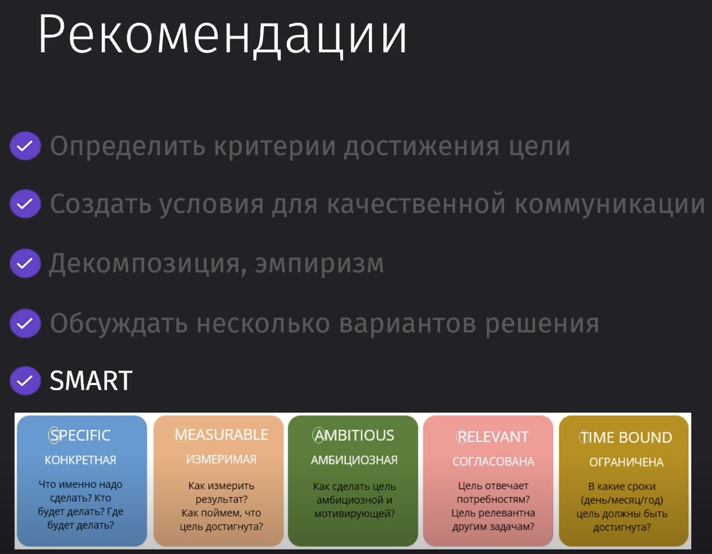
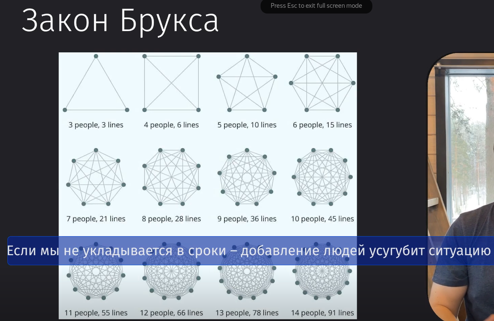
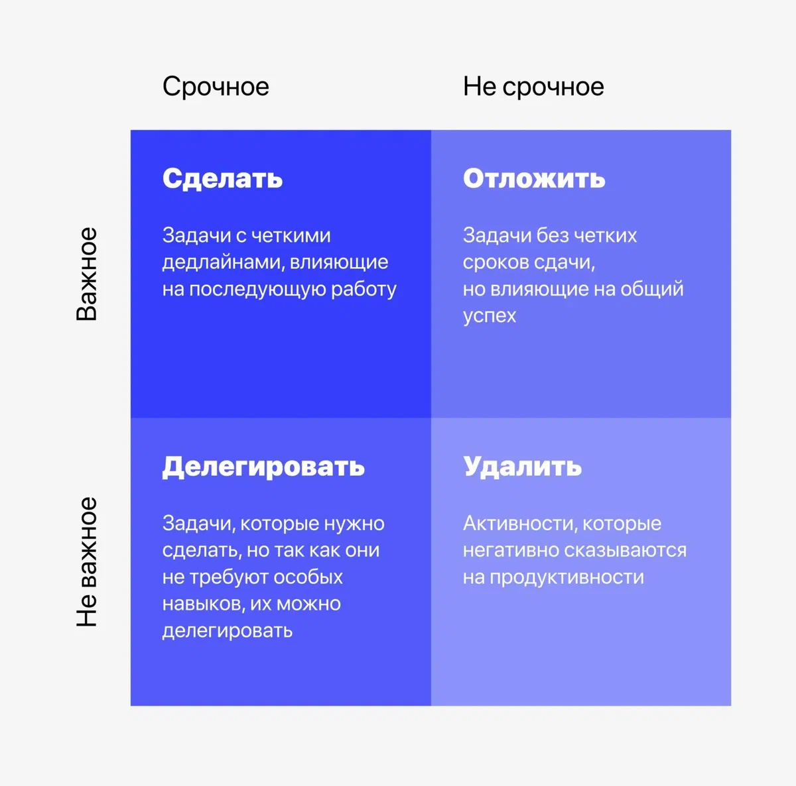
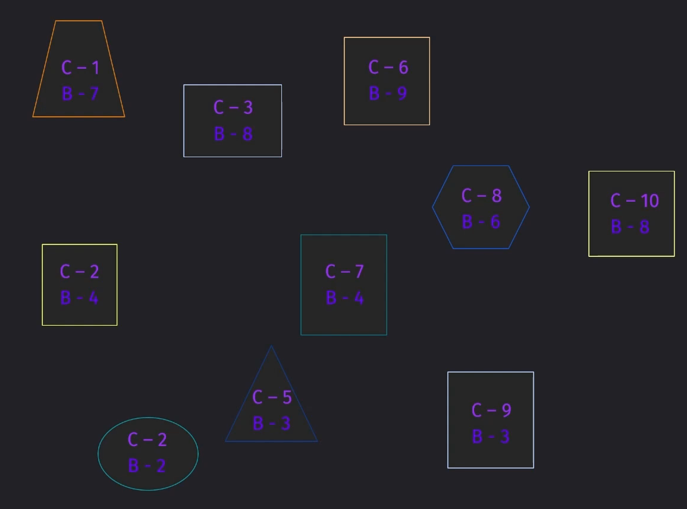
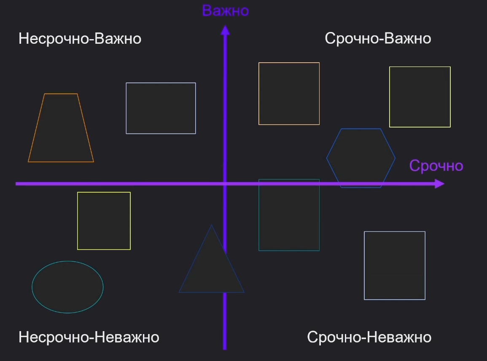

---
tags:
  - agile
  - practices
  - engineering
aliases:
  - Agile Practices
  - Практики Agile
---

# Практики и оптимизация рабочего процесса

**Связанные материалы:**
- [Agile](agile.md) -- обзор подходов и философии
- [Kanban](kanban.md) -- метод управления потоком задач
- [Scrum](scrum.md) -- фреймворк итеративной разработки
- [Метрики Agile](metrics.md) -- метрики потока, DORA, качества
- [Масштабирование Agile](scaling.md) -- Nexus, LeSS, SAFe

---

## Оптимизация рабочего процесса

Введение Agile-подходов и практик может быть тяжело введено в разработку из-за непонимания разработчиками сути данных практик.

Проблема распространения Agile заключается в том, что практики распространяют менеджерским языком, а не языком разработчика.

Можно достаточно легко разобраться с возможностью упростить свой рабочий процесс

У нас есть определённые критерии оптимизации процессов разработки:

- Удобство для разработчиков
- Вовлечённость -- уменьшает текучку кадров и поднимает имидж компании за счёт более интересной подачи задачи, описания её значимости и разнообразности задач
- Прибыльность бизнеса
- Лояльность клиентов
- Продуктивность разработчиков -- создание условий, в которых разработчики предоставляют более ценные решения за счёт предоставления им большего количества времени на разработку
- Time To Market -- сокращение времени от идеи до выхода на рынок

---

## Автоматизация

Автоматизация -- ключ к повышению эффективности и качества работы разработчиков. Путем фиксации и анализа рутинных процессов, команды могут значительно ускорить свою работу, минимизировать ошибки и уделить больше времени творчеству и инновациям.

Часто разработчики автоматизируют множество действий клиента и упрощают ему жизнь, но не автоматизируют свои простые рутинные процессы, что увеличивает время разработки.

Самые простые пути автоматизации труда разработчиков:

- Применение линтеров и форматировщиков кода (linters & formatters) для обеспечения соответствия стандартам;
- Автоматическое тестирование вместо ручных тестов;
- Непрерывная интеграция и развертывание (CI/CD) для облегчения процесса сборки и развертывания (потому что если разработчик будет это делать сам, то процесс будет тратить много времени и компания завяжется на сотруднике);
- Планирование встреч для обсуждения сложных вопросов, минимизация общения через мессенджеры;
- Создание и поддержание актуальной документации для ускорения адаптации и работы сотрудников.

Так же нам нужно думать над предотвращением потери скорости разработки за счёт переусложнения кода различными подходами и методиками, которые увеличивают количество кода и сложность поддержки.

### Практические шаги к автоматизации

1. Зафиксировать все рутинные действия в течение 1-2 недель.
2. Придумать до трех возможных автоматизированных решений для каждой обнаруженной рутинной задачи.
3. Выбрать и автоматизировать одну из рутин, уделяя внимание именно той, что вызывает наибольшие неудобства.

---

## Инженерные практики

> [!info] **Инженерные практики** -- это самый популярный подход к оптимизации рабочего процесса. Это набор поведенческих и технических решений, которые направлены на разработку продукта.

---

Таковыми можно назвать практики **экстремального программирования (XP)** или написание low-level документации (LLD).

> LLD -- это описание работы функций, классов, методов прямо рядом с кодом посредством комментариев (summary, json-doc) или README.

Очень часто ИП связывают с XP, но это не так. XP, как полноценный Agile-фреймворк, ссылается на определённые инженерные практики, но не является их олицетворением. Тот же LLD не входит в экстремальное программирование.

### Ключевые Инженерные Практики

1. **Стандарты Кода**: Создание и поддержка единых стандартов оформления кода
    - Использовать linters и formatters
    - Уменьшить количество недопониманий в команде
2. **Коллективное Владение Кодом**: Ответственность всей команды за весь код проекта.
    - Это повышает качество кода и его поддерживаемость за счёт более компетентного ревью.
3. **Разработка Через Тестирование (TDD)**: Сначала пишутся тесты, затем код.
    - Позволяет сделать требования более прозрачными
    - Описывает всю будущую бизнес-логику до написания самого кода
4. **Непрерывная Интеграция (CI/CD)**: Автоматическая сборка, тестирование и развертывание кода.
5. **Частые и Небольшие Релизы**: Согласно agile принципам.
6. **Заказчик всегда рядом**: Важность ежедневной обратной связи от пользователей.
7. **Парное Программирование**: Работа над кодом в паре для повышения эффективности.

### Заключение

Инженерные практики очень важны при написании продукта, так как помогают более эффективно работать команде над большим проектом и поддерживать его эффективнее.

---

## Целеполагание

Целеполагание -- это постановка и достижение целей.

Целеполагание важно для оптимизации рабочих процессов, особенно в командах разработчиков, где требуется совместная работа и обсуждение целей.

В идеальных условиях, все участники команды понимают конечную цель, которой нужно добиться во время создания приложения.

Эффективное формирование целей уменьшает срок и витиеватость разработки.

Цели есть как индивидуальные под каждого разработчика, так и общие для всей команды. Общие цели помогают коммуницировать и взаимодействовать команде во время реализации продукта.

### Принципы и методы

Для эффективной разработки продукта нужно сразу решить следующие вопросы:

- Определить критерии достижения цели (по этим критериям должно быть понятно, что заказчик получил полностью удовлетворяющий его продукт)
- Создание условий для качественной коммуникации (на коммуникацию зачастую выделяется очень мало времени на планирование, уточнение и поиск оптимального решения)
- Декомпозиция и эмпиризм (большие цели нужно делить на более маленькие и организовать эмпирический подход)
- Обсуждать сразу несколько вариантов решения
- Методика SMART -- специфический, измеримый, амбициозный, релевантный, ограниченный во времени подход к постановке целей.

Так же можно воспользоваться хорошим подходом **4 вопроса планирования/коучинга**, на которые можно ответить в любом порядке и замкнуть круг потребностей -- чего хочется достичь, почему это важно, критерии достижения, варианты решения.

### Самопомощь и Самокоучинг

Так же можно задать себе 8 вопросов, которые помогут разобраться с пониманием текущих задач, глубже понять свои цели и пути их достижения:

- Что ты хочешь сделать? (мы часто делаем то, что сами не можем назвать)
- Зачем ты хочешь это сделать?
- Какая личная выгода от того, что ты это сделаешь?
- Какие твои индивидуальные способности помогут сделать это с максимальным качеством и за минимальное время?
- Что ты будешь делать, чтобы сделать это с максимальным качеством и за минимальное время?
- Какими должны быть условия, чтобы сделать это с максимальным качеством и за минимальное время?
- В каком случае ты будешь максимально удовлетворён?
- Какие твои шаги ты видишь?

---

## Математический расчёт

Самый банальный метод расчёта эффективности определённого выбора заключается в банальной математике.

Мы определяем, какие автомобили мы хотим производить, чтобы зарабатывать больше всего. Делим прибыль на время производства и получаем месячный результат по каждой машине. Самой выгодной является самая быстрая в производстве.

Из вышестоящей математики можно предположить, что в реальной жизни очень много переменных и для разработки большого продукта обычная математика подходить уже не будет в полной мере.

Использовать математический подход будет актуально в следующих случаях:

- `(доход - стоимость разработки) / время`
    - для маленьких проектов написать код расторопно есть смысл, но если сделать быстро, то такой код будет тяжелее поддерживать и ошибок может стать больше
    - стоит выделять время на поддержку инфраструктуры приложения
- Выгода от автотестов
    - стоит ли их писать, будут ли большими репутационные или денежные потери от ошибок
- Agile тренер / самостоятельное внедрение
    - выгодно ли внедрять самостоятельно или через тренера для большой команды
- Время на обсуждения или Время на исправления
    - нужно ли тратить много времени для реализации фичи, ведь если проект маленький или задачи маленькие, то выгоднее время потратить на доработки

### Расширение применения расчетов

- Введение идеи о том, что подходы, основанные на математическом подсчете, могут быть применены для улучшения различных аспектов рабочего процесса:
    - Оптимизация времени и ресурсов на поддержку кода.
    - Рациональное распределение времени на автотесты.
    - Эффективность проведения встреч и управления временем.

---

## Управление вниманием

Важно уметь управлять вниманием разработчика во время разработки продукта, потому что может быть тяжело сконцентрироваться на одной задаче и завершить её.

Множественные задачи и отвлекающие факторы снижают эффективность.

Сам по себе разработчик во время выполнения задачи должен учитывать множество факторов:

- Архитектура
- Множество способов решения задачи
- Критерии
- Оборудование
- Внутренние стандарты оформления кода
- Задач может быть множество
- Ошибки по разным задачам могут всплывать в разные моменты времени

Психолог Джордж Миллер сделал вывод в результате своих исследований, что внимание человека способно фокусироваться ограниченно, в среднем на 5-9 объектах.

Чтобы улучшить управление вниманием, мы можем:

1. Уменьшить количество объектов в поле нашего внимания:
    - Исключение лишних данных (иногда некоторые моменты не нужны нам для решения задачи)
    - Группировать данные и задачи
2. Реорганизовать работу:
    - Структурировать файлы и документацию
    - Разделение задач на подзадачи
    - Оптимизация работы в команде

Так как до 9 объектов может быть в поле зрения, поэтому и любая команда может быть до 9 человек (исключая вас).

По закону Брукса, если проект не укладывается в сроки, то добавление рабочей силы увеличивает общий объём затрат:

- Труд по перекраиванию задач, которое нарушает дальнейшую работу
- Обучение новых людей
- Дополнительное общение

От увеличения количества человек в команде мы не выиграем сильно, потому что сильно увеличится количество возможных связей. _Сложность связей растёт нелинейно_.

---

## Приоритизация

Очень важную роль в управлении командой так же забирает на себя приоритизация задач. У продукта есть множество различных интересантов в виде клиентов, которые хотят более удобный продукт, который решает их проблемы, есть бизнес, который хочет, чтобы приложение приносило деньги и есть комфорт сотрудников, которые выполняют задачи в той последовательности, в которой задачу будет решить эффективнее.

> Между всеми этими интересами нужно балансировать. И мы должны чётко понять, что **не все задачи одинаково важны** и **выбирать задачи нужно по степени их вклада в результат**.

Чтобы приоритизировать задачи, можно:

- **Использование "козырей"**. Определить, где больше будет профита (тактика/стратегия).
- **Тушение пожаров**. Сохранять баланс между фундаментальными и прорывными задачами для предотвращения кризисных ситуаций.
    - _Фундаментальные задачи_ позволяют укрепить стойкость приложения и получить определённые ресурсы, на которые можно будет опереться
    - _Прорывные задачи_ добавляют новый функционал в приложение за счёт использования новых ресурсов, чтобы достичь новых высот
    - Между этими задачами нужно балансировать, потому что без первого достичь второго будет становиться с каждым разом всё тяжелее и тяжелее
- **Карта зависимостей**. Определение связей и возможностей для их уменьшения или устранения.

### Метод Эйзенхауэра

Как один из вариантов для определения срочных, важных и не очень задач, можно использовать метод Эйзенхауэра, в котором мы определяем, какие задачи можно сделать, отложить, делегировать или вовсе не делать.

Мы можем сгруппировать задачи, описать их, оценить их срочность и важность в балловой системе, а только затем уже решать.

Далее нужно соотнести все задачи по срочности и важности на графике с данными координатами

### Что можно сделать для определения приоритетов

- Выбрать ключевой проект
- Детализировать активности проекта
- Описать зависимости между активностями
- Применить матрицу Эйзенхауэра для организации приоритетов
- Спланировать реализацию по приоритетам

### Заключение

Приоритизация задач очень важна в управлении проектами, потому что помогает фокусироваться на ключевых задачах, которые принесут максимум профита, и оптимизировать рабочие процессы.
