---
tags:
  - agile
  - scrum
aliases:
  - Scrum
  - Скрам
---

# Scrum

## Введение

#scrum #agile

Scrum - мощный фреймворк, способствующий успеху многих компаний в IT-индустрии.

Появился из регби, переводится как схватка / толкотня, обозначает единство команды.

Сформулирован Джеффом Сазерландом и Кеном Швабером в 1995 году, основываясь на работах Хиротаки Такеучи и Икудзиро Нонака.

> Существует спор о том, является ли Scrum Agile фреймворком из-за отсутствия упоминания Agile в Scrum Guide, но создатели подчеркивают их взаимосвязь.

Scrum - это уже полноценный фреймворк, а не метод, как Kanban. Он предоставляет жёсткий набор правил и рамок для реализации всех своих подходов.

Agile-манифест создавался при непосредственном участии создателей Scrum (на основе опыта scrum-команд) и они сами говорят о том, что Scrum - это Agile-фреймворк.

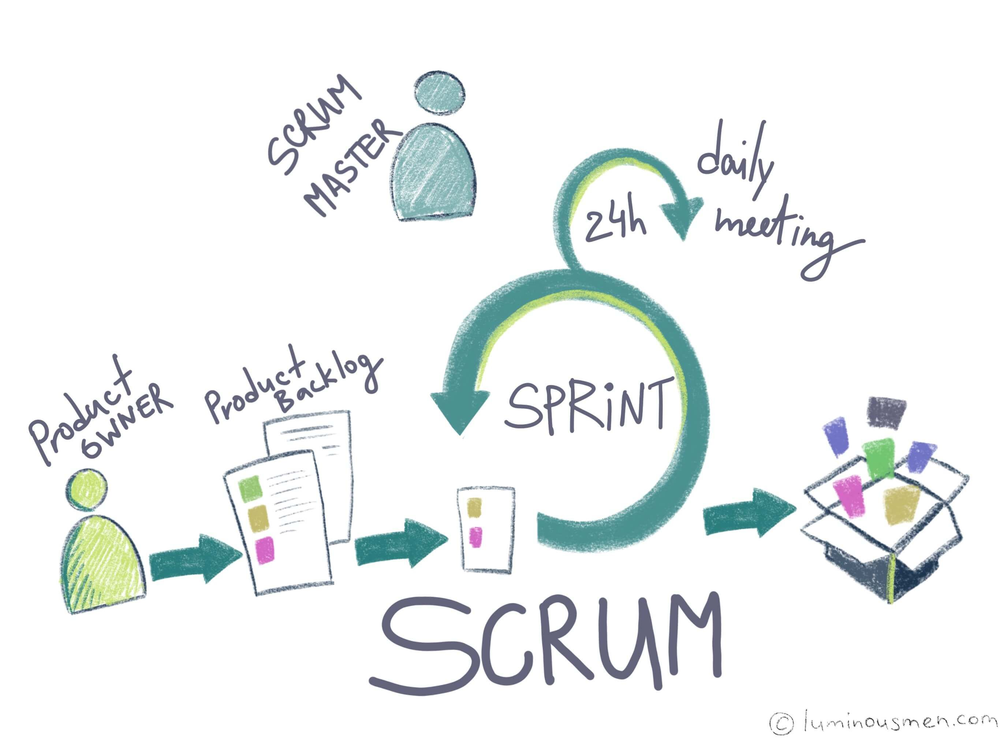

### Характеристики Scrum

- Легковесный, прост в описании, но сложен в понимании и реализации.
- Существует множество Scrum Guide, которые от итерации к итерации меняются и требуют по-разному применять практики
- Сертификацию пройти крайне сложно, так как многие вопросы не описаны в гайде, а должны отвечаться "в духе Scrum"
- Работает только при соблюдении всех условий. Scrum может потребовать сломать все устои, но принесёт ощутимый результат только при соблюдении всех практик.
- Требует развивать кросс-функциональность, взаимозаменяемость (сторипоинты, карты компетенций)
- Команда должна быть самоорганизующейся. Как решать и какие именно задачи, должна определять уже сама команда
- Так же существует множество разночтений гайдов по Scrum
    - Scrum-мастер - это лидер-слуга, который имеет или не имеет руководящих полномочий, но и является помощником команды
    - DoR описан в Scrum, но не полностью. Этот термин, скорее, пошёл из XP.

### Принципы и Ценности Scrum

- Обязательства (commitment) - договорённости, ответственность, разделение целей команды, компании, целей спринта
- Фокус (focus) - команда сфокусирована на небольшом скоупе задач, целях команды и особенностях её взаимодействия
- Открытость (openness) - про открытое общение между участниками и всеми заинтересованными личностями
- Уважение (respect) - уважение к опыту, мнению и вкладу каждого участника команды
- Смелость (courage) - про решение сложных задач и поиск неочевидных решений

- Подчеркивает кросс-функциональность и самоорганизацию команд.
- Ответственность за результат лежит на Scrum Master и команде.

### Сложности во Внедрении

- Необходимость изменения бизнес-процессов под Scrum.
- Вызовы в создании самоорганизующихся и мотивированных команд.
- Дискуссионные моменты по практикам и сертификациям.

### Заключение

Значение Scrum в современном производственном и IT процессе сложно переоценить.

Однако важно глубоко изучить фреймворк и осознать его основные принципы и ценности для успешного применения, так как его нужно воспринять полностью.

Для более глубокого понимания можно прочитать официальное руководство по Scrum (на официальном сайте), пройти бесплатные тесты на [scrum.org](https://www.scrum.org/) для понимания сертификации и почитать книги основателей Scrum:

- [Scrum. Революционный метод управления проектами](../Books/Scrum.%20Революционный%20метод%20управления%20проектами.md)
- Путь Scrum-мастера.
- Коучинг Agile-команд

---

## Роли

Роли - это набор функций, которые могут соответствовать, а могут и не соответствовать определённой должности.

В Scrum-команде предполагается, что есть все сотрудники для разработки продукта.

В команду входят не только программисты, но и аналитики, дизайнеры, тестировщики и другие специалисты. Важен не статус, а компетенции.

В Scrum роли представляют собой набор функций, которые могут быть присвоены конкретным членам команды или разделяться между ними.

Scrum-мастером может быть отдельное лицо, а может быть и разработчик, который совмещает эту роль. В опытных командах, вся команда может выполнять эту роль.

Product Owner является связующим звеном между командой и заинтересованными сторонами (например, менеджментом, пользователями).

Все в scrum-команде (мастер, владелец продукта и разработчики) все ответственны за результат спринта.

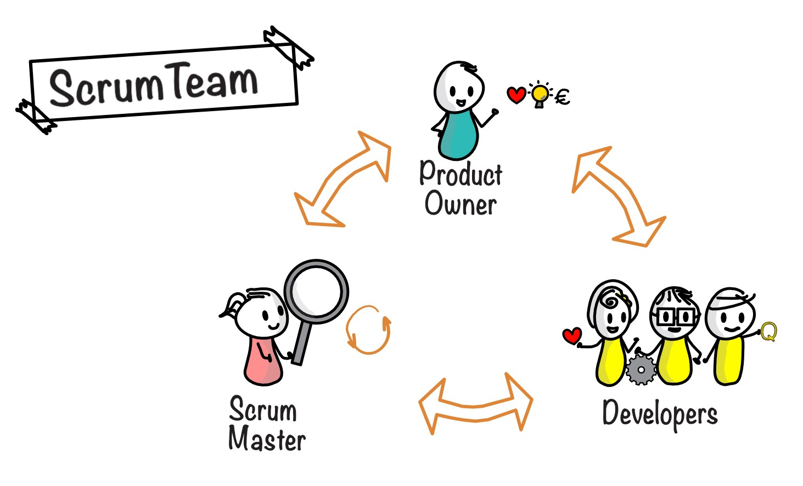

### Основные роли в Scrum

Scrum Master:

- развитие методологии Scrum в команде и компании,
- повышение продуктивности
- улучшение взаимодействия между участниками проекта, внутри команд и между командами
- организация и облегчение проведения мероприятий Scrum
- устранение препятствий
- содействие в приоритизации и декомпозиции бэклога, помогает в планировании
- улучшение коммуникации
- коучит команду

> [!important] Роль SDM в Scrum выполняет вся команда. Она не принадлежит Scrum-мастеру.

Владелец продукта (Product Owner):

- работа с бэклогом - создаёт задачи, уточняет, приоритизирует, объясняет их
- формулировка целей продукта и спринта
- максимизация ценности продукта
- выполняет посреднические операции между заинтересованными лицами и командой
- прогнозирует и конструирует потребности клиента
- предлагает наивысшую экспертность по продукту

> [!important] Роль владельца и менеджера отличается. Владелец сфокусирован на ценности продукта в отличие от менеджера, который ответственен за сроки, бюджет и стратегическое планирование.

### Командная работа

- Размер команды. Команда должна быть достаточно большой, чтобы приносить за каждый спринт значимые результаты и достаточно маленькой, чтобы оставаться гибкой.
- Star Map. Командные участники могут замещать друг друга в случае необходимости, поощряется широкий набор навыков.

### Внедрение

1. Нужно определить насколько команда соответствует Scrum Team.
2. Определить, кто и как выполняет функции scrum-мастера.
3. Кто и как выполняет функции Владельца продукта.
4. Далее уже можно сформулировать предложения по возможным улучшениям.

---

## Спринт

Спринт является центральным элементом фреймворка Scrum, включая большинство активностей и событий Scrum. Он подразумевает комплексный подход с множеством ключевых деталей, делающих Scrum мощным и сложным инструментом для внедрения.

Спринт - это контейнер для всех scrum-активностей.

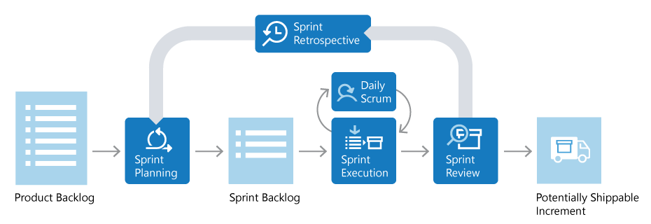

### Основные События и Практики Спринта

1. Планирование Спринта - задачи из бэклога продукта выбираются для включения в бэклог спринта.
    - важен выбор задач, способствующих достижению цели спринта
2. Ежедневные Встречи - команда собирается для обсуждения прогресса и корректировки плана достижения цели спринта.
3. Инкремент - результат спринта, release candidate, который уже полностью оттестирован и готов к использованию.
    - станет ли инкремент релизом, будет зависеть от релизной политики
4. Обзор Спринта - демонстрация достигнутых результатов и обсуждение дальнейших планов с заинтересованными сторонами.
5. Ретроспектива - команда анализирует процесс работы и ищет пути его улучшения.
6. Уточнение Бэклога - обсуждение, оценка и приоритизация оставшихся задач бэклога продукта.

### Ключевые Моменты

- Длительность Спринта - обычно от одной до четырех недель, классический выбор - две недели.
- Цель Спринта - фокус на достижение конкретной, значимой цели, а не просто выполнение задач.
- Синергия - все члены команды ответственны за реализацию этой цели, каждый должен вложиться в результат.
- Инкремент - конечный результат спринта - полностью готовый к использованию инкремент продукта.
- Фича-тестирование - выделенную в отдельную ветку фичу нужно оттестировать, а уже затем вливать в основную.
- Инженерные практики - автоматическое тестирование, непрерывная интеграция, непрерывная доставка.

### Практические Советы

- Выбор Длительности и Цели Спринта. Выбор должен быть подкреплен стратегическими целями и возможностями команды.
- Фокус на Инкремент. Разработка ориентирована на достижение конечного, качественно протестированного продукта.
- Адаптация Подхода. В зависимости от этапа развития продукта и типа задач может быть рассмотрен переход к Kanban для более эффективного управления работой.

> [!important] Когда проект перестаёт быть запутанным, а синергировать команду уже не удаётся - можно уходить от Scrum.
> Когда продукт перейдёт из запутанной стадии в сложную и уже не нужно будет развивать так активно через Scrum - ставить задачи в большом количестве со сроками уже будет неактуально.
> Далее уже можно будет воспользоваться [Kanban](kanban.md).

### Заключение

Каждый спринт представляет собой итерацию на пути улучшения продукта и работы команды. Важно постоянно анализировать и адаптировать процессы для достижения наилучших результатов. Практика спринтов в Scrum поддерживает этот цикл непрерывного улучшения, предоставляя структуру для эффективного управления разработкой.

---

## Планирование спринта

| Этап                     | Задачи |
| ------------------------ | ------ |
| Начало спринта           | Планирование спринта - первое собрание в цикле спринта, где задачи из общего бэклога продукта выбираются и переносятся в бэклог спринта для выполнения. В отличие от Kanban, где итерации мягкие, в Scrum каждый спринт имеет строго определенный временной лимит. Время старта и окончания спринта не определено. Дорогого стоит начать спринт в понедельник утром и закончить в пятницу вечером, чтобы уйти с ясной головой и спокойной совестью. |
| Длительность (Регламент) | Не более 4 часов для двухнедельного спринта, адаптируется в зависимости от продолжительности спринта (от 2 до 8 часов). |
| Участники                | Вся команда, включая разработчиков, скрам-мастера и владельца продукта. Можно приглашать и дополнительных участников для обсуждения. |
| Цель Спринта             | Ключевой элемент, вокруг которого строится взаимодействие команды. Определяет конечный продукт спринта как готовый релиз-кандидат, предъявляемый заинтересованным сторонам. |
| Уточнение задач          | Проверка готовности задач к реализации с учетом внутренних критериев. Нужно проверить по всем пунктам DoR, что задача готова к её исполнению. |
| Планирование Действий    | Формирование четкого плана работы на спринт, расчет велосити и капасити команды. |

> [!important] Все участники спринта собираются вокруг определённой цели
> Именно за счёт синергии, когда вся команда объединяется в одно, все цели и удаётся завершить в срок. Потому что вся команда нацелена на решение определённой задачи.

### Внедрение

- Оцените и соотнесите длительность ваших планирований с нормативами.
- Проанализировать состав участников
- Проанализировать то, как выглядит цель спринта.
- Оценить детализацию задач.
- Оцените методики формирования бэклога спринта.

### Заключение

Планирование спринта - фундамент успешного спринта и продуктивной работы команды. Чёткая цель и грамотно подобранные задачи, прозрачность процесса и эффективное общение являются залогами достижения высоких результатов.

---

## Ежедневные встречи

Ежедневные встречи - дейлик, стендап-встреча, ежедневный скрам, канбан-встреча.

Является самой частой петлёй в Scrum и представляет собой чистое проявление эмпиризма (поднимает прозрачность, проводит инспекцию и адаптацию).

| Подход               | Kanban                                                                                                         | Scrum                                                                                                                                                                                                                           |
| -------------------- | -------------------------------------------------------------------------------------------------------------- | ------------------------------------------------------------------------------------------------------------------------------------------------------------------------------------------------------------------------------ |
| Фокус                | В Kanban основной приоритет на ускорении потока задач и создании максимальной ценности                         | Сосредоточение на достижении цели спринта через максимальную ценность инкремента                                                                                                                                               |
| Участники            | Присутствует менеджер поставки сервиса и ограничений на участников нет.                                        | Предназначены для разработчиков. Владелец продукта и скрам-мастер не обязательны к присутствию. В Scrum нет SRM. Эту роль выполняет вся команда. Scrum-мастер нужен только для того, чтобы помочь команде договориться. |
| Длительность встречи | В Канбане встреча обычно длится дольше из-за обсуждения многих деталей по потоку задач                         | В Scrum время встречи ограничено 15 минутами - тут самое главное высказать свою позицию                                                                                                                                       |
| Порядок выступления  | Следует от доски задач                                                                                         | Участники могут самостоятельно выбрать способ передачи слова. Обычно высказывается желающий, а дальше все по кругу озвучивают статус своих задач.                                                                              |
| Количество встреч    | Нет ограничения на количество встреч - их можно проводить хоть несколько раз на дню, если того требует команда | Иногда команды пропускают дейлики перед окончанием скрама, ретроспективой или перед другими этапами, но это некорректный подход. Желательно всегда проводить дейлики, так как ценность создаётся каждый день.                  |

На усмотрение менеджера, стоит ответить на следующие три вопроса:

- Что делал?
- Что планирую делать?
- Какие препятствия?

Препятствия могут обсуждаться во время встречи, но детальное рассмотрение требует отдельного времени. Можно выделить это время через создание встречи в любое другое время.

---

## Обзор спринта

Обзор спринта является встречей, на которой демонстрируется инкремент - результаты работы команды за спринт. Он представляет из себя полноценный релиз-кандидат, готовый к деплою в продакшен.

Если инкрементов за спринт было несколько, то показывается последний, так как инкремент - это логическое продолжение друг друга.

В Kanban присутствует подобная встреча и называется она Delivery Service Review (Обзор сервиса поставки). Однако в Kanban нет чёткого инкремента и могут обсуждаться задачи даже неготовые.

1. Обзор спринта происходит в конце спринта, когда готов инкремент, перед ретроспективой, то есть почти в самом конце спринта.
2. Длительность до часа за неделю спринта (2ч - 2 недели).
3. Приглашаются:
    - вся команда, включая разработчиков.
    - стейкхолдеры - инвесторы, руководители, члены соседних команд. Очень ценно присутствие конечных пользователей.
    - владелец продукта.
4. Основным действующим лицом является владелец продукта, который
    - презентует нововведения продукта
    - рассказывает о целях спринта
    - проводит демо продукта
5. Сбор обратной связи. Важнейшая часть спринта. Это положительно влияет на мотивацию внутри команды.
6. Корректировка бэклога. После обратной связи, бэклог можно дополнить новыми задачами.

---

## Ретроспектива

Ретроспектива - ключевая встреча в Agile-методологиях (Скрам, Канбан), нацеленная на анализ работы команды за спринт с целью повышения эффективности.

В Kanban данная встреча называется Review Service Delivery.

На ретроспективе проводят:

- Обсуждение достижений и проблем прошедшего спринта.
- Поиск и реализация решений для повышения продуктивности.

> [!important] Самое важное - на ретроспективе нужно определить что хорошо, что плохо и что нужно улучшить, чтобы решить эти проблемы!

Встреча по структуре имеет следующий вид:

1. Проводится сразу после обзора спринта (обычно, с переменой в 15-30 минут). Продолжительность зависит от длительности спринта (для двухнедельного - до 1.5 часов). Часто так же проводят и третью встречу с планированием следующего спринта, но реже, так как это достаточно утомительно.
2. Участники. Вся команда включая владельца продукта и, иногда, scrum-мастер. Сторонних лиц не приглашают.
3. Формат. Есть множество различных форматов проведения ретро и их стоит иногда менять, чтобы не ржаветь. Можно провести встречу так:
    - Разминка. Творческое задание для расслабления и настройки на позитив.
    - Обсуждение. Каждый участник делится тем, что ему понравилось и не понравилось в спринте, используя стикеры или виртуальные доски.
    - Анализ проблем. Команда обсуждает волнующие вопросы, предлагает и выбирает решения.
4. Предложения, договорённости. Нужно определить те моменты, который должен будет выполнить определённый член команды, чтобы команда работала эффективнее.
5. Фиксация договорённостей. Часто договорённости забывают. Все договорённости фиксируются и контролируются на следующей ретроспективе. Можно создать определённый элемент бэклога на основе выработанных решений, чтобы контролировать происходящее все результаты.

> Для качественной ретроспективы очень нужен творческий настрой команды.

### Заключение

Ретроспектива - неотъемлемый элемент Agile-практик, важный для непрерывного улучшения рабочего процесса и повышения эффективности команды.

---

## Уточнение бэклога

Уточнение бэклога - обычно это одна или несколько встреч, где команда, при участии владельца продукта, обсуждает оставшиеся в бэклоге задачи: оценивает их, знакомится с приоритетами и ближайшими планами по продукту. Этот подход готовит задачи к спринту.

> [!note] Это не одна встреча, а активность / процесс, в рамках которого происходит уточнение upstream-задач

В Kanban нет термина Backlog, но есть работа до принятия обязательств и после. Задачи до точки принятия обязательств называются **upstream**. И работа над ними, уточнения - это прямая аналогия с уточнением бэклога.

Официальное название - **Product Backlog Refinement (PBR)**. Раньше называли грумингом.

- Встречи происходят в течение спринта. Могут быть обязательной или необязательной встречей.
- До 2017 рекомендовалось посвящать процессу до 10% времени разработчиков, в редакции 2020 это ограничение снято
- Участвует владелец продукта, команда разработки, скрам-мастер, но жёстких ограничений по составу участников - нет.
- Определяются задачи и цели. Бэклог - это живая сущность и её нужно постоянно пересматривать, уточнять и корректировать, потому что некоторые задачи можно исключать, а некоторые нужно добавлять.
- Определяются критерии DoR (готовности задачи) для задач из бэклога, чтобы их можно было взять в спринт.
- Определяются критерии AC (приёмки), которые уже формируют, скорее, владельцы продукта и стейкхолдеры

### Заключение

Уточнение бэклога - это не одноразовое событие, а циклический процесс обеспечения готовности команды и задач к успешному спринту, требующий активного взаимодействия всех участников проекта.

---

## Управление задачами

### Введение

У разработчиков достаточно большое количество разных задач. Уже эти задачи оцениваются, имеют статус и по ним можно прогнозировать релизы.

Очень важно хорошо оформлять задачи. Продуктивность команды зависит от понимания и приоритизации задач. Настройка трекера задач играет ключевую роль.

Структура хорошей задачи:

- Иерархичность: Проекты, крупные задачи и подзадачи. Задача может принадлежать проекту или более крупной задаче.
- Заголовок: Краткое описание сути задачи.
- Описание: Детализация требований. Это поле нужно обязательно заполнить, чтобы и сам разработчик понимал, в чём заключается задача и другие разработчики так же понимали в чём суть дела.
- Активность: Комментарии, изменения, коммиты, связанные с этой задачей.
- Статус: Этапы выполнения.
- Автор и исполнители: Ответственные лица.

Так же можно добавить произвольные поля в трекерах для удобства работы: приоритет, метки, эпики.

### Управление задачами

Какие вопросы стоит проработать, когда вливаешься в задачи команды и какие вопросы нужно отрефлексировать, спросить, уточнить:

- Сколько задач в бэклоге?
- Сколько задач в спринте?
- Сколько задач назначено на одного разработчика?
- Какие этапы проходят задачи?
- Какие разновидности задач есть?
- Какие активности по оформлению задач лишние?
- Какие активности хочется добавить?

### Трекеры задач

#Trello #Jira #Kaiten #YouTrack #YouGile #EvaProject

Трекер задач - это приложение, которое позволяет управлять, отслеживать и планировать задачи. Разработаны для регулирования нагрузки и планирования релизов.

> Каждое приложение продвигает свою философию управления компанией

#### Обзор популярных трекеров задач

1. Trello
    - Простой и с богатым функционалом.
    - Идеален для новичков, бесплатная основа с платными расширениями.
2. Jira
    - Широкий функционал и настройка под нужды компании.
    - Удобная интеграция с другими продуктами (Confluence для документации и Bitbucket).
    - Можно скачать пиратскую серверную версию для локального развёртывания.
3. Kaiten
    - Простой, удобный, и предлагает бесплатный тариф.
    - Ориентирован на канбан, включает разнообразные инструменты аналитики.
    - Недостаток: непривычный интерфейс для некоторых пользователей.
4. Встроенные трекеры в системы контроля версий
    - Например, GitLab и GitHub предлагают базовые функции трекера задач.
5. Продукты для импортозамещения
    - Яндекс.Трекер, EvaProject, YouGile предлагают разнообразные функции и импортозамещение.
6. Другие инструменты
    - YouTrack, Asana, ClickUp предлагают специфичный функционал и дизайн.

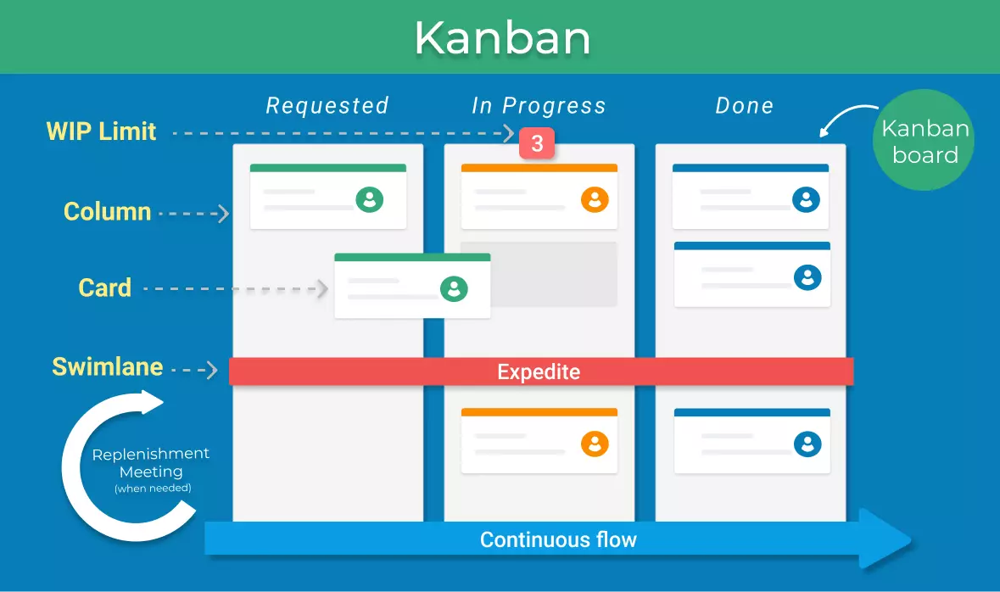

---

## Пользовательские истории

Epic - это глобальная задача, разбитая на множество подзадач.

Пользовательские истории - это краткое описание задач с точки зрения ценности для пользователя.

UserStory - это основной вид задач в Scrum.

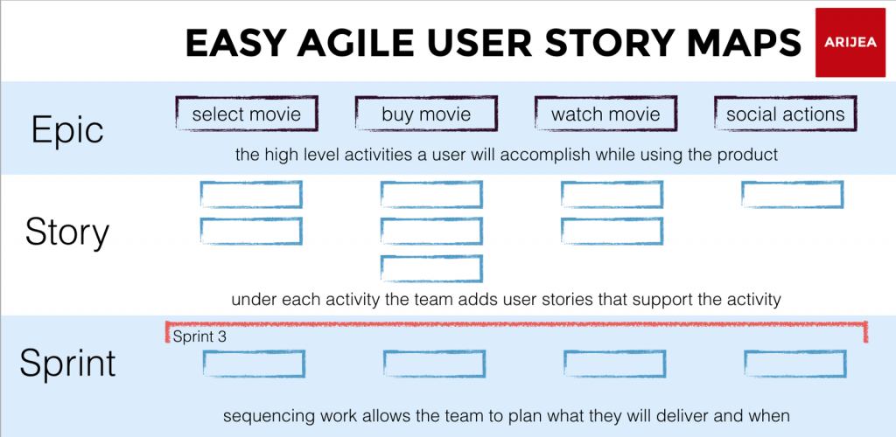

Все истории оформляются в простой формат, содержащий три части: роль, действие, ценность.

> [!abstract] Как **[роль или тип пользователя]**, я хочу/могу **[выполнить действие или получить результат]**, чтобы **[получить ценность]**

Примеры подобных историй:

1. Как посетитель сайта, я хочу узнать программу тренинга, чтобы решить, идти на него или нет.
2. Как сотрудник бара, я хочу налить кружку пива за 30 секунд, чтобы не скапливалась очередь.
3. Как новый сотрудник компании, я хочу узнать что такое Scrum, чтобы лучше работать в команде

Эти истории нам нужны, чтобы:

- улучшить понимание нужд пользователей.
- повысить эффективность работы команды за счёт фокуса на практической ценности, а не технических деталях.
- упростить формат, чтобы привести к экономии времени на планирование и реализацию.

Ключевые особенности историй заключаются в:

- Ориентированности на клиента.
- Атомарности, возможности независимой реализации.
- Интеграции в любую систему управления проектами (Scrum, Kanban).

Так же существуют критерии **INVEST** для хорошей пользовательской истории:

1. Independent (Независимая) - истории могут быть реализованы в любом порядке независимо друг от друга
2. Negotiable (Обсуждаемая) - отражает суть проблемы, а не детали
3. Valuable (Ценная) - ценная для клиентов
4. Estimable (Оцениваемая) - оцениваемая по сложности и трудозатратам
5. Small (Компактная) - компактная, может быть сделана командой за одну итерацию
6. Testable (Тестируемая) - имеет критерии приёмки

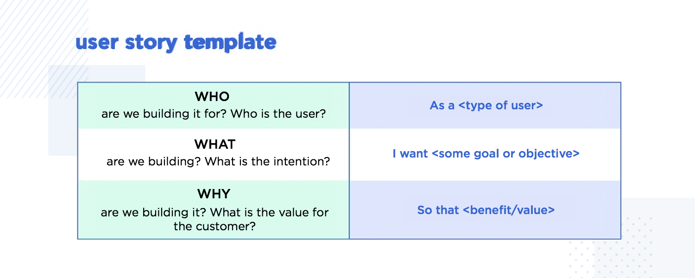

---

## Сторипоинты

Стори-пойнты (story points) - метод оценки задач по их сложности, не прямо связанный со временем.

Используются, чтобы решить проблемы неточности оценок в человеко-часах и распределения работы в команде.

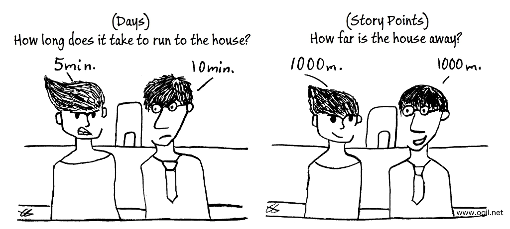

### Проблемы оценки задач

1. Неточности оценок: Часто фактическое время, затраченное на задачу, значительно превышает запланированное.
2. Неопределенность решений: Существует много подходов к решению задач, каждый с разной временной сложностью.
3. Неравномерная нагрузка: Разработчики испытывают разную рабочую нагрузку, что ведет к неэффективности.
4. Планирование итераций: Неясно, какой объем работы брать на итерацию/спринт.
5. Взаимодействие с заказчиками: Трудности с оценкой сроков и бюджета могут вести к репутационным и финансовым потерям.
6. Оценка продуктивности: Сложно измерить и проследить эффективность работы команды.

### Человеко-часы vs. Стори-пойнты

| Заголовок   | Человеко-часы | Стори-пойнты |
| ----------- | --- | --- |
| Определение | Оценка, привязанная к времени и индивидуальным способностям сотрудников, ведет к ряду проблем, таких как неравномерная нагрузка и риск, связанный с незаменимыми сотрудниками. | Универсальная оценка сложности задач, которая работает внутри команды и для всей команды целиком |
| Особенности | Разные сотрудники работают с разной скоростью. Деление требуется на различные этапы. Нагрузка на разработчиков - неравномерна. Сотрудники могут стать незаменимыми (bus factor). | Не привязаны к времени. Не привязаны к отдельным сотрудникам (а к команде в целом). Позволяют команде эффективнее планировать работу и видеть динамику продуктивности. Методы оценки: эталонная задача, покер-планирование и другие подходы. |

Расчёт Velocity. Команда выполнила задач на 99 сторипоинтов. Взяла на 101, выполнила. Взяла на 100, выполнила. В среднем арифметическом получаем 100 сторипоинтов - это средняя скорость работы команды за последние 3 спринта. Это и есть скорость работы команды.

Подробнее: [Метрики Agile - Velocity](metrics.md#Velocity%20(Скорость%20команды))

Оценку в сторипоинтах для каждой задачи выбирает вся команда, а не один сотрудник. Команда внутри сама строит систему исчислений и оценок задач поинтами. Оценка сложности задачи может меняться за счёт поступления новой информации.

Способы оценки задач:

- Оценка по эталонной задаче делается следующим образом: команда находит самую простую задачу и оценивает сложность других задач, отталкиваясь от неё. Так же стоит выделить самую сложную задачу и поставить ей максимальную оценку. Остальные задачи оценивать между выбранными.
- Так же есть подход poker planning (покер-планирование), когда каждому члену команды выдаются числа Фибоначчи и они должны оценить задачи этими числами. Самые сложные и простые задачи по оценкам нужно будет аргументировать каждому члену команды.

### Практика внедрения

Многие команды встречаются с головной болью при использовании сторипоинтов, потому что есть условия, при которых можно внедрить данный подход.

> [!important] Сторипоинты рассчитаны на команды со взаимозаменяемыми сотрудниками
> Потому что весь рабочий процесс будет упираться в перегруженных сотрудников. Если тестеры загружены, то им должны помочь разработчики, если загружены аналитики, то им должны помочь тестеры и так далее...
> В таком случае временная оценка теряет актуальность, а оценка сложности будет бесполезной.

Тут нам может сильно помочь карта компетенций каждого сотрудника (Star Map). Эта карта определяет уровень владения нужными для реализации проекта компетенциями от каждого сотрудника, чтобы можно было закрыть перегрузы в определённых областях.

- 0 - знания отсутствуют
- 1 - базовые знания
- 2 - средний уровень
- 3 - продвинутый уровень
- 4 - эксперт

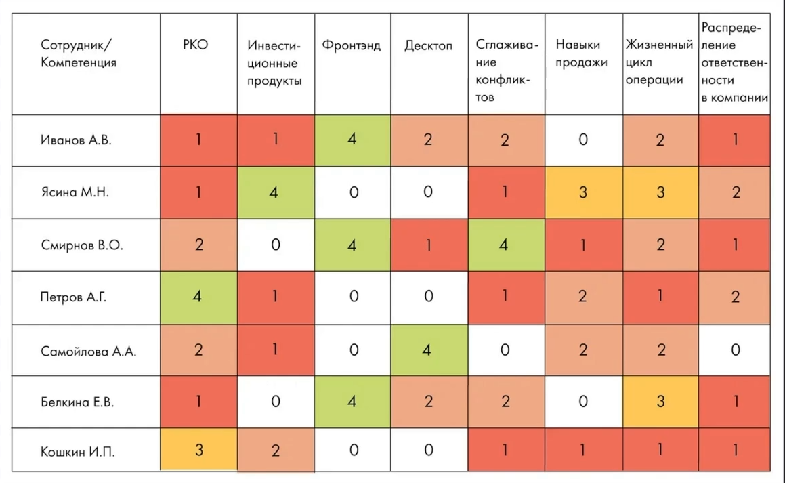

Подробнее: [Метрики Agile - Star Map](metrics.md#Star%20Map%20/%20Карта%20компетенций)

---

## Критерии DoR, DoD и AC

**Definition of Ready (DoR)**, **Definition of Done (DoD)** и **Acceptance Criteria** - три фундаментальные практики, важные в Scrum и в разработке проектов в целом.

> [!info] Они важны для того, чтобы договориться с заказчиком на берегу о некоторых правилах работы над задачами.

Эти практики помогают оптимизировать рабочие процессы через прозрачность организации, фокусировку, целеустремленность и улучшение коммуникации.

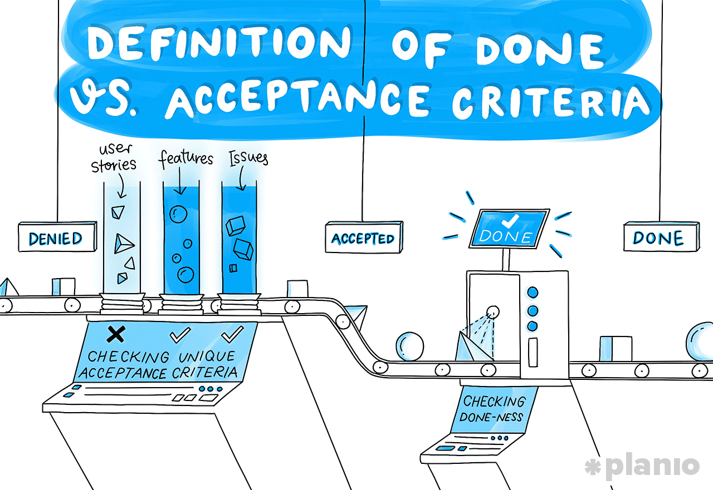

### Практики и их отличия

| Практика       | Definition of Ready                                | Definition of Done                                                                                                                   | Acceptance Criteria                                                            |
| -------------- | -------------------------------------------------- | ------------------------------------------------------------------------------------------------------------------------------------ | ------------------------------------------------------------------------------ |
| Определение    | Определяет готовность задачи к работе              | Критерии, определяющие завершенность задачи или продукта. Применяется в конце итерации и характеризует готовность продукта к релизу. | Индивидуальные критерии для каждой задачи, определяющие условия приемки работы |
| Кто формирует? | Формируется командой, часто с участием менеджмента | Формируются так же, как и DoR                                                                                                        | Формулируются заказчиком                                                       |

Примеры:

- DoR: (примеры требований, когда задача может быть готова к началу исполнения)
    - Задача четко определена
    - имеет измеримую бизнес-ценность
    - понятна команде
    - может быть выполнена за одну итерацию
    - готов дизайн и проведено UI/UX тестирование
- DoD (примерный список требований, когда задача готова к потенциальному релизу)
    - Задачи реализованы и протестированы
    - Качество продукта проверено QA
    - документация обновлена и актуальна
    - окружение настроено и готово к использованию
    - есть план релиза.
- Acceptance Criteria могут включать функциональные требования:
    - Например, возможность установления цены с помощью слайдера
    - Результаты отсортированы по возрастанию цены
    - И так далее...

---

## Приоритизация бэклога

1. Матрица Эйзенхауэра

- Принцип: задачи оцениваются по двум параметрам: срочность и важность.
- Методика: задачи распределяются на графике с осями срочности и важности. Наивысший приоритет имеют задачи в верхнем правом квадранте.

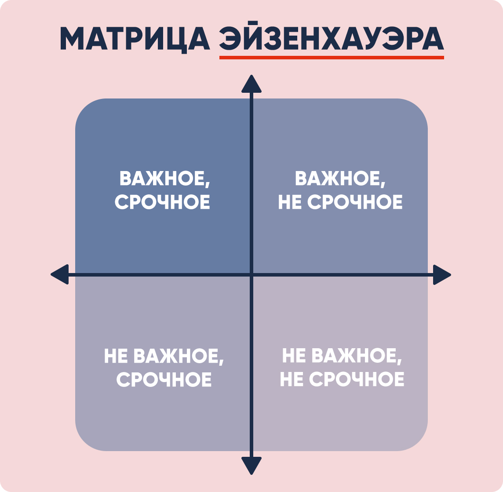

2. Value-Effort и Cost-Value

- Принцип: оценка задач по ценности (value) и сложности (effort) или стоимости (cost).
- Методика: задачи оцениваются и располагаются на графике, где приоритеты зависят от их положения - в идеале искать задачи с высокой ценностью и низкими затратами.

> [!summary] В этом методе самое главное искать максимальный профит от задачи при минимуме затрат и лишних действий

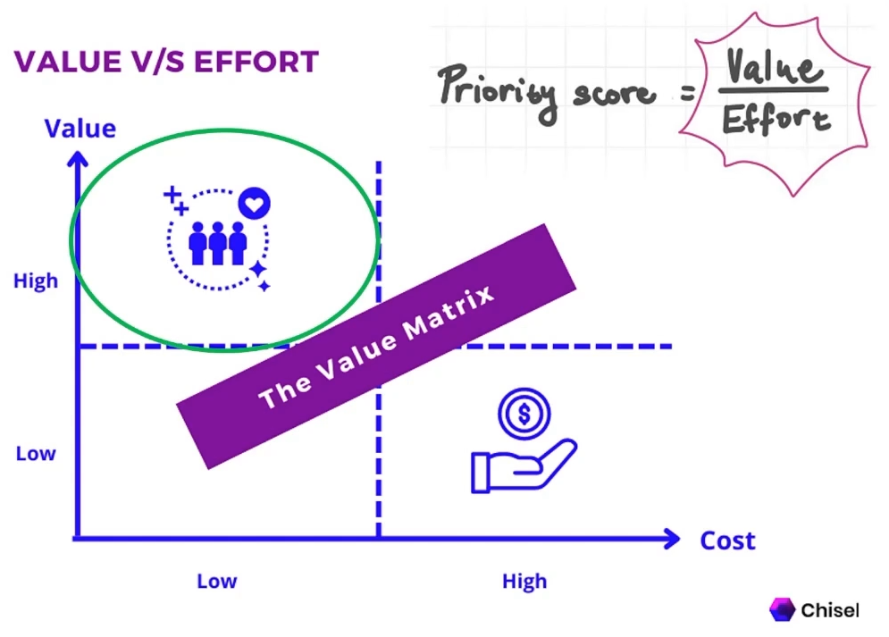

3. Карта влияния

- Принцип: фокус на достижении бизнес-целей, учет рисков и конфликтов.
- Методика: ответы на вопросы о цели, заинтересованных лицах, их влиянии и способах управления этим влиянием помогают выстроить карту влияния и приоритизировать задачи.

Нужно задать следующие 4 вопроса:

- Какую цель мы хотим достигнуть в проекте/продукте - Зачем?
- Кто может нам помочь/помешать достигнуть цели - Кто?
- Как они могут помочь/помешать достижению цели - Как?
- Что нам сделать, чтобы создать/снизить необходимое влияние - Что?

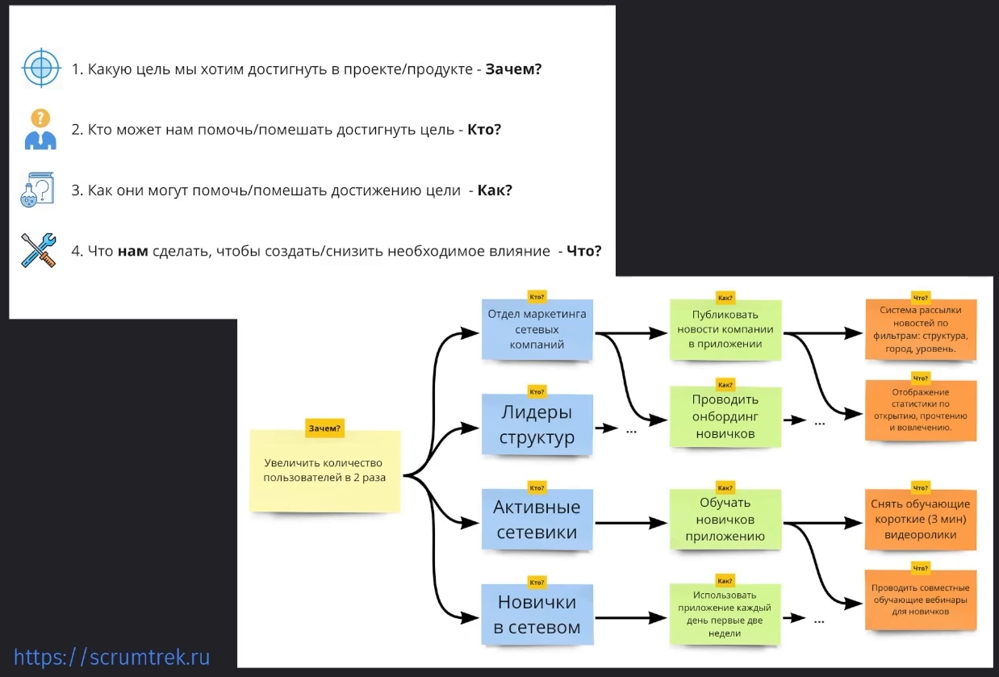

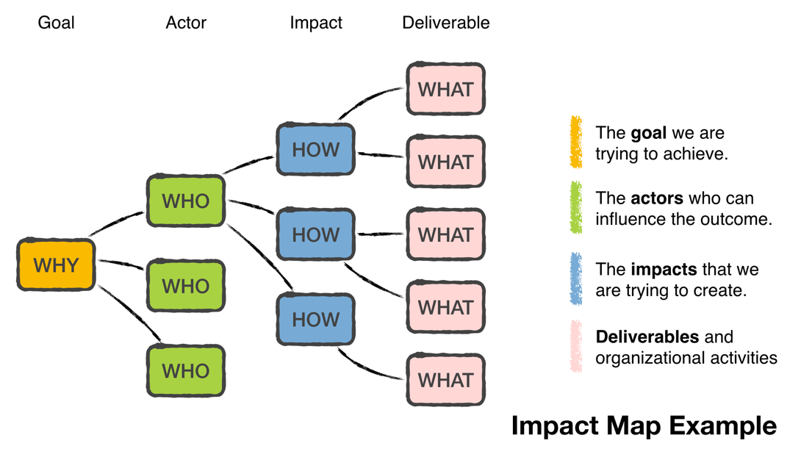

4. Карта пользовательских историй

- Принцип: визуализация пути пользователя и определение приоритетов в соответствии с этим путем.
- Методика: действия пользователя разделяются по этапам, идентифицируются потребности на каждом этапе, и задачи категоризируются по степени их важности и необходимости для реализации.

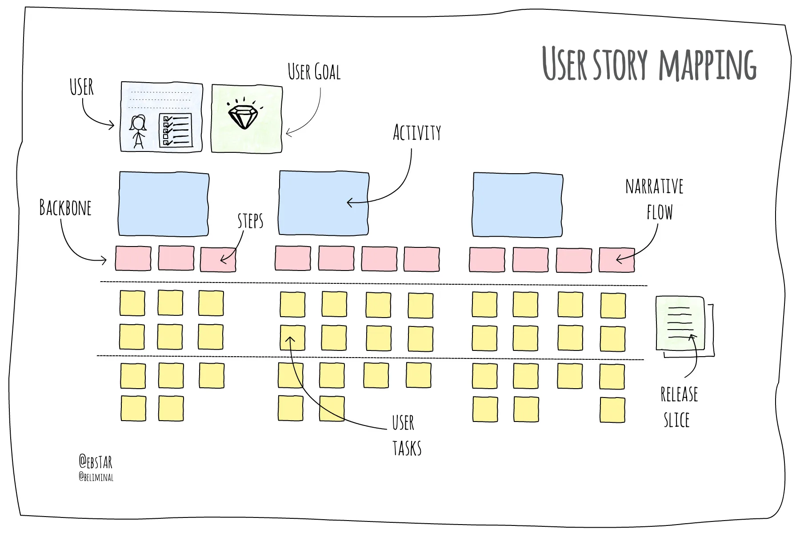

Представим, что мы хотим разработать интернет-магазин по заказу цветов.

Первое, что нам нужно сделать - это определить путь пользователя до заказа цветов

Далее нужно сгруппировать пользовательские операции (истории)

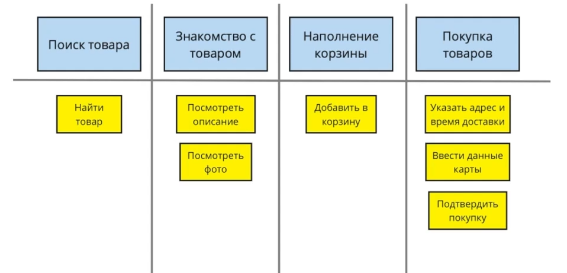

И дополнить каждую группу определёнными действиями, которые может выполнить пользователь на каждом этапе

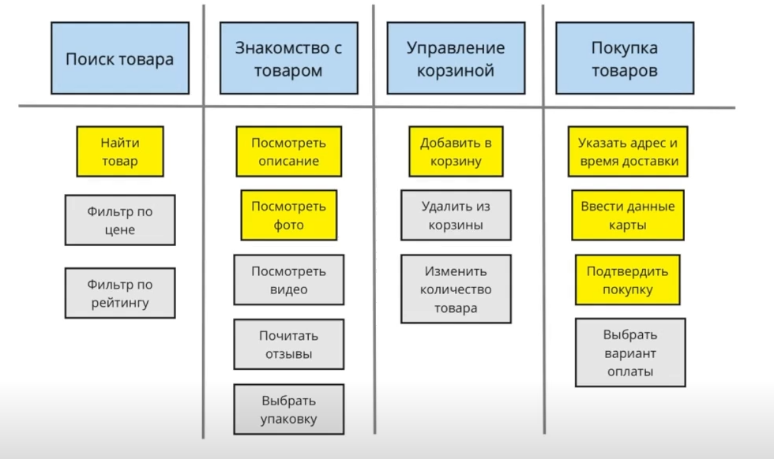

Далее категоризируем реализацию пользовательских историй по степени приоритетов

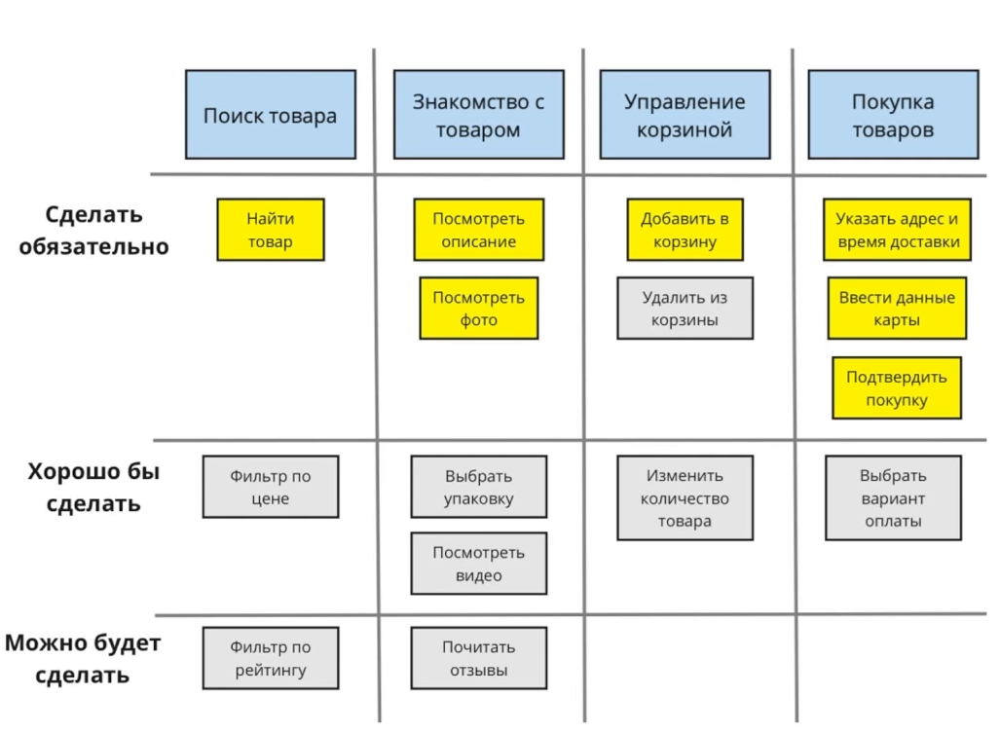

Далее выделяем релизы согласно категориям

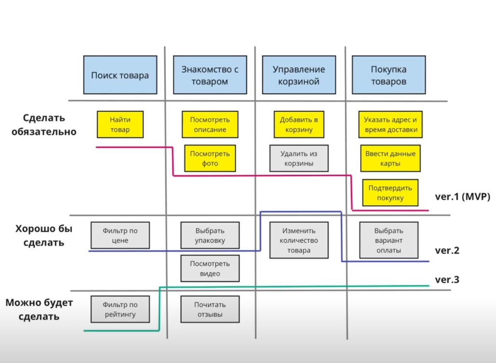

Далее описываем выполнение задач в бэклоге. Сначала истории из первой группы, из второй, а потом из третьей.

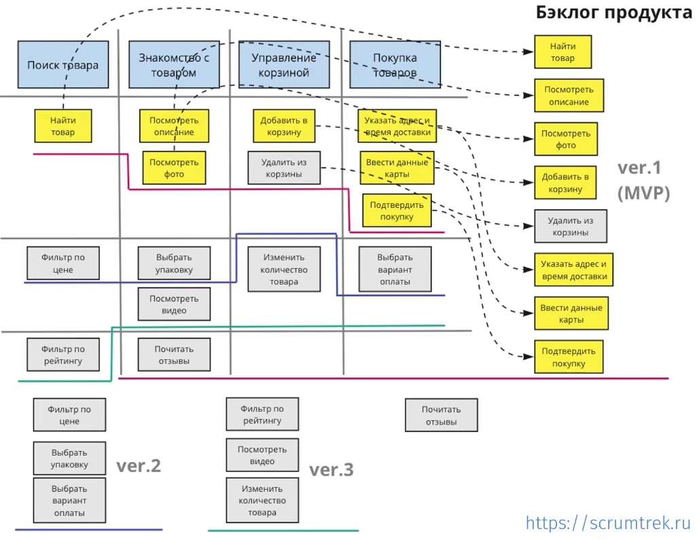
