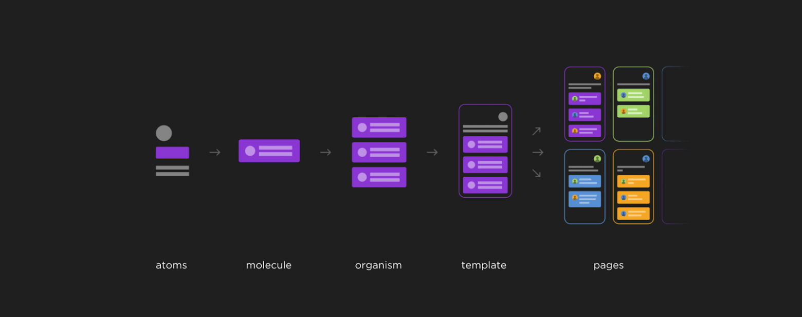

Atomic Design - это архитектура, которая подразумевает под собой деления элементов на сущности, которые собирают собой последующие по функциональному уровню сущности от плейсхолдеров кнопки до полноценной страницы с шаблонами.

