---
tags:
    - architecture
    - fsd
    - react
    - vue
    - angular
    - svelte
    - frontend
---

## Введение

Feature Slice Design — архитектурная методология для проектирования фронт-энд приложений

Является набором правил и соглашений для организации кода.

Этот подход очень удобен, так как призван:

- позволять легко масштабировать проект
- повысить качество кода
- упростить поддержку и погружение в код новых разработчиков
- коннектить код и бизнес-логику

Важным отличием от других подходов является то, что мы отталкиваемся не от вида или назначения компонента, а от доменной области, в рамках которой мы решаем проблемы.

В отличие от классического подхода, когда мы организуем код как: `components`, `pages`, `views`, `hooks` - тут мы применяем фиксированный набор слоёв (app, process, pages, widgets, features, entities, shared), поделённых на сегменты. Сегменты включают три уровня: слои (layers), слайсы (slices) и сегменты (segments).

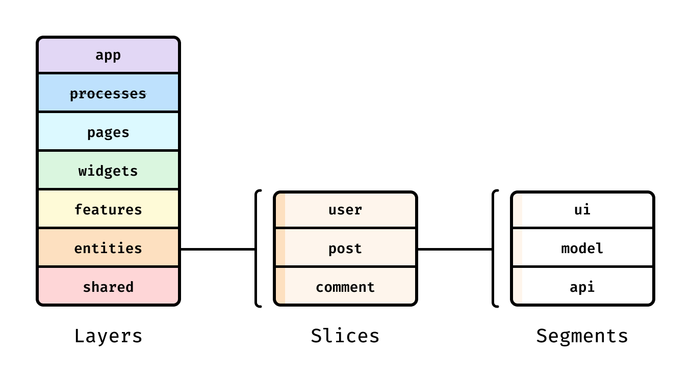

Проект: рейтинг сравнения компаний. В этом контексте будет разбиваться приложение на слайсы


Второй проект: страница курсов в LMS


### Компоненты

Для того, чтобы сразу определиться с компонентами без дизайн-системы, можно воспользоваться [набором компонентов](https://www.figma.com/design/m1vXQMlhor5GdTH48IBMDX/Feature-Slice-Design?node-id=0-1&t=niH3xeKjGQsC7WZs-1), с помощью которого разметить будущее приложение


## Введение в FSD

FSD позволяет следовать всем канонам ООП за счёт своей структуры.
Public API предоставляет доступ только к нужным файлам из нашей целевой папки


### Что такое FSD

FSD - это архитектурная **методология** для проектирования масштабируемых и поддерживаемых приложений. Представляет из себя набор правил и соглашений по организации кода.

Позволяет:

- Сделать код более понятным
- Сделать проект более стабильным с учётом частых изменений
- Иметь единую концепцию структурирования приложения

Обычная архитектура проекта, когда мы делим всё на компоненты, страницы и хуки - разрушительна. Когда мы стартуем приложение - всё выглядит аккуратно. По мере роста проекта, он начинает обрастать огромным количеством связной логики, которую со со временем уже не представляется возможность поддерживать, а любые изменения становятся крайне дорогими.


Когда мы переходим на FSD, совершается переход на некоторую архитектуру, которая задаёт свою концепцию работы. В рамках этой концепции, мы обязаны соблюдать правила, которые позволят нам чётко разбивать бизнес-процессы на правильные домены, что сильно упростит понимание проекта и его поддержку.


### Layers

Слой - это группа, которая хранит отведённую для неё часть логики

Части слоёв в проекте может не быть.

1. `app` — базовая структура проекта, содержащая роутинг, базовые стили и точки входа в приложение. Самая важная часть для запуска проекта.
2. `processes` (процессы, **устаревший слой**) — сложные сценарии, покрывающие несколько страниц (например, авторизация)
3. `pages` (страницы) — композиционный слой для сборки полноценных страниц из сущностей, фич и виджетов.
4. `widgets` (виджеты) — самодостаточные блоки интерфейса, которые могут использоваться на разных страницах, например, профиль пользователя.
5. `features` (фичи) — функциональные элементы, отвечающие на вопрос «что сделать?», например, лайкнуть пост или оставить комментарий.
6. `entities` (сущности) — бизнес-сущности, отвечающие на вопрос «что это?», например, аватар или комментарий.
7. `shared` — переиспользуемый код, не имеющий отношения к специфике приложения/бизнеса (например, UIKit (button, label, text), libs, API). Этот слой не содержит бизнес-логики, которую можно привязать только к определённому домену.

> [!warning]  Сейчас слой `process` - **deprecated**.
> Раньше этот слой хранил в себе определённые процессы приложения: добавление закладки или оплата товара. Мы сохраняли процесс - логику перехода между страницами.
> Проблема такого подхода заключалась в том, что огромное количество процессов переиспользовали страницы ещё по одному разу, что было бессмысленно и сильно увеличивало количество кода. Отслеживать процесс и оркестрировать состояние не имеет смысла, так как ту же логику редиректа или любого другого поведения можно реализовать и в фичах.

Примеры:

- Компонент `UserAvatar` может находиться как в `entities` (если он имеет логику получения аватара), так и в `shared`, если это просто кружок, который отображает картинку.
- Компонент `payAgency` отвечает на вопрос "что сделать?", поэтому его нужно хранить в `features`.

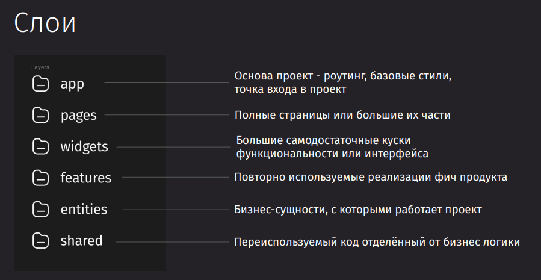

Модули на одном слое могут взаимодействовать лишь с модулями, находящимися на слоях строго ниже.  То есть мы можем использовать `shared` в `entities`, `features` и во всех остальных слоях. Но использовать `feature` в `entities` уже нельзя.

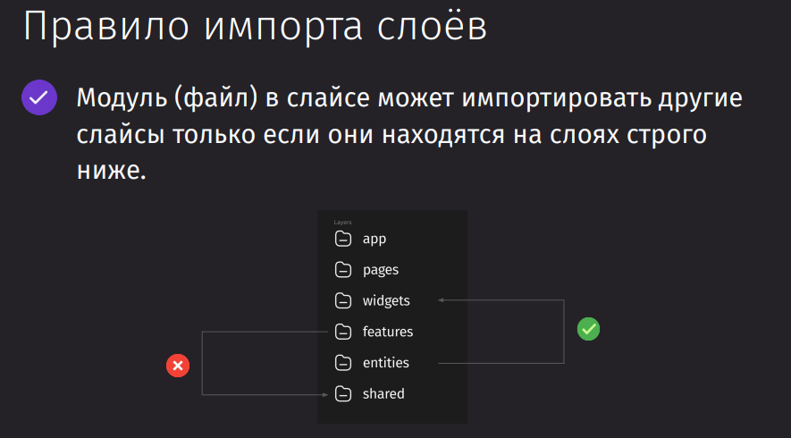

### Slices

Слайсы - это подразделения кода внутри слоев, организованные по доменным областям продукта

Название слайса - его название в бизнесе.

То есть слайс может отвечать за хранение данных и логики по пользователю, авторизации, корзине, посте, оплате, комментарии - и мы так и называем этот слайс.


Slice располагаются во всех Layers, кроме `app` и `shared`. Эти две группы слоёв не могут содержать слайсы по той причине, что они никак не относятся к бизнес-логике.

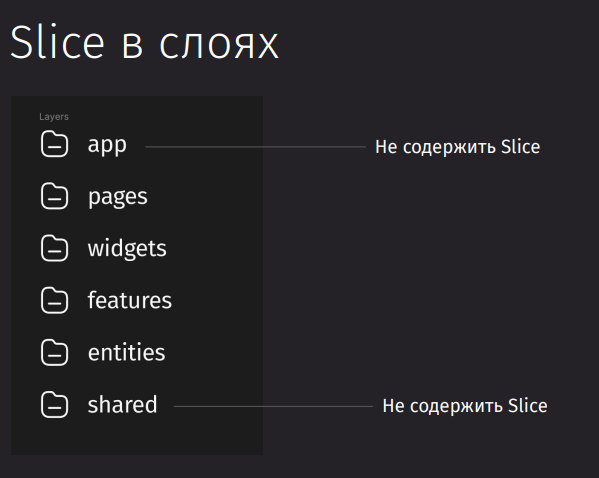

FSD решает проблемы декомпозиции функционала приложения и доменных зон, а так же упрощает упрощает поиск нужного сегмента кода:

- Аватар пользователя находится в entities. Эта часть отображает контент.
- Изменить наименование профиля в features. Эта часть отвечает за выполнение операции.
- Блок настроек аккаунта в widgets. Он хранит в себе группу фичей изменения аккаунта.
- Страница профиля с настройками -  pages. Она хранит в себе виджет с настройками аккаунта и аватар пользователя.

И очень важно делить наше приложение на доменные области правильно, так как некорректное выделение бизнес-сущностей может привести к нарушениям сцепленности и связности приложения.

У нас есть сущность оплаты, которая не должна иметь в себе интерфейс комментариев, который плотно врезан в первую. У нас должен быть низкий coupling (сцепленность). А так же эти сущности должны в себе хранить высокосвязанную между собой логику, но отделённую от других сущностей - высокий coupling (связность).

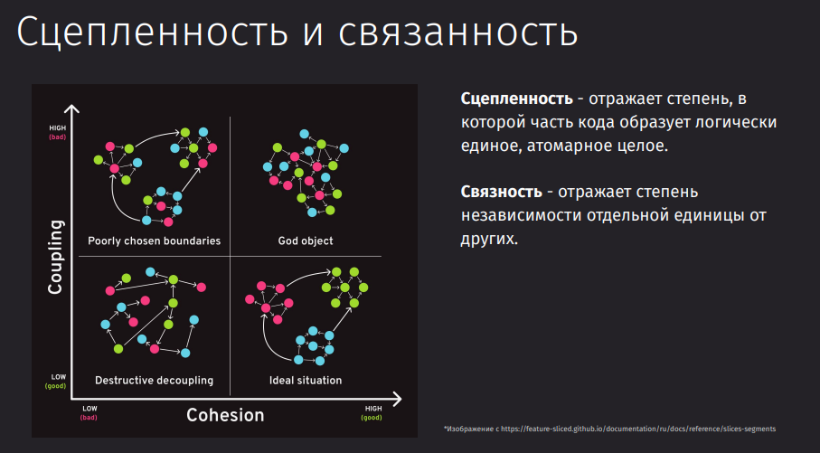

Так же как и с правилом импортов между слоями, тут есть правило общей точки для экспорта. Мы должны инкапсулировать нужные части внутри слайса и отдавать наружу только публичное API.

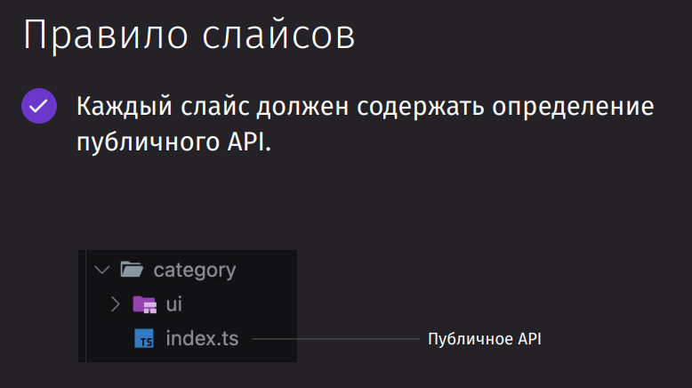

### Segments

Сегменты - группы кода по его назначению.
Название сегмента — описание кода, который там лежит
Сегменты должны отвечать на вопрос "для чего они", а не просто "что это"

Самые ходовые сегменты:

- ui - отображаемый интерфейс
- api - апи для работы с бэкэндом
- model - модель данного слайса
- lib - библиотека
- config - конфигурационные файлы

> [!warning] Слои `app` и `shared` сразу в себя включают сегменты без слайсов

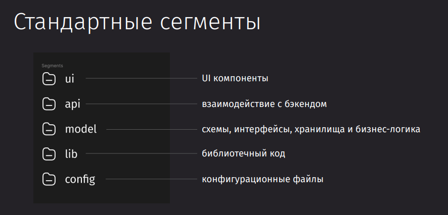

Как и в слайсах, каждый сегмент должен содержать в себе публичное API, которое должно возвращать хранящиеся в нём данные.

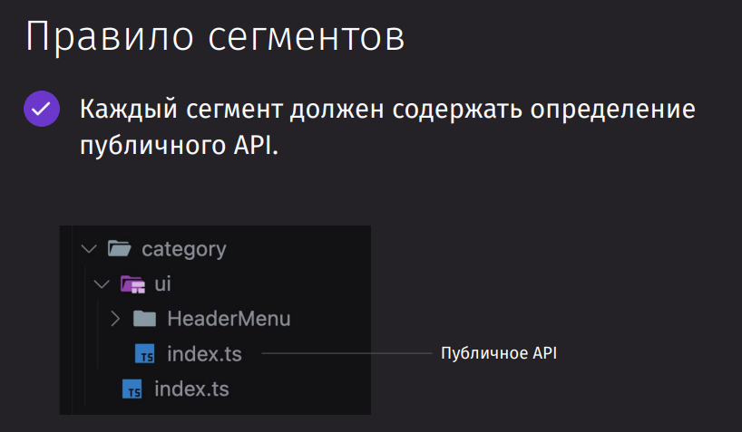

---

## Pages и App

В идеале, она должна состоять просто из виджетов, которые уже в своих рамках реализуют нужную функциональность для пользователя


Слой приложения хранит в себе чисто все нужные компоненты, которые отвечают за entry-point или входную точку приложения


### О слое App

Этот слой содержит всё, что касается приложения целиком, как в техническом смысле (провайдеры, контексты, роутинг), так и в бизнес-смысле (аналитика)

Не содержит слайсы

Тут находится не фиксированный набор сегментов, а только тот, что специфичен для данного типа приложений.

Базово тут располагаются:

- роутинг
- провайдеры
- входная точка в приложение
- глобальные стили


### Старт проекта

Создаём проект

```bash
npm create vite@latest
npm i react-router
```

Добавляем роутер

`src / main.tsx`

```TSX
import { StrictMode } from 'react'
import { createRoot } from 'react-dom/client'
import './index.css'
import { createBrowserRouter, RouterProvider } from 'react-router'

const router = createBrowserRouter([
	{
		path: '/',
		element: <div>Привет из FSD</div>
	}
])

createRoot(document.getElementById('root')!).render(
	<StrictMode>
		<RouterProvider router={router} />
	</StrictMode>,
)
```

### Подготовка слоя App

Создадим базовый лейаут, который будет оборачивать наши приложения. Его поместим в App в отдельный сегмент `layout`

`src / app / layout / Layout.tsx`

```TSX
import { Outlet } from "react-router";
import { Footer } from "@/shared/ui";
import { Icon } from "@/assets";
import { useUserStore } from "@/entities";

export function Layout() {
  const { profile } = useUserStore();

  return (
    <div>
      <div>Шапка</div>
      {profile?.name}
      <Icon.Check />
      <Outlet />
      <Footer />
    </div>
  );
}
```

Далее выделим сегмент `routes`, в который поместим роуты со всеми страницами

`src / app / routes / routes.tsx`

```TSX
import { createBrowserRouter } from "react-router";
import { MainPage } from "../../pages";
import { Layout } from "../layout/Layout";

export const router = createBrowserRouter([
    {
       path: "/",
       Component: Layout,
       children: [
          { index: true, Component: MainPage },
       ],
    },
]);
```

И явно экспортируем роуты, чтобы обозначить публичное апи сегмента

`src / app / routes / index.tsx`

```TS
export { router } from './routes'
```

И в конце определим `entrypoint` точку, в которой будет происходить инициализация приложения. Здесь мы используем `RouterProvider`, в который передали список роутов, которые мы явно экспортировали из директории с роутами.

> [!warning] В FSD мы можем импортировать только те элементы, которые мы явно экспортировали из сегмента, слайса или слоя. Иначе будет нарушена договорённость. Лезть куда-то глубже нам нельзя, чтобы не нарушать структуру.

`src / app / entrypoint / main.tsx`

```TSX
import { StrictMode } from 'react'
import { createRoot } from 'react-dom/client'
import '../styles/variables.css'
import '../styles/base.css'
import { RouterProvider } from 'react-router'
import { router } from '../routes'

createRoot(document.getElementById('root')!).render(
    <StrictMode>
       <RouterProvider router={router} />
    </StrictMode>,
)
```

И примерно так будет выглядеть наша структура


В базовом `index.html `нужно изменить путь до скрипта инициализации приложения прямо к энтрипоинту

`index.html`

```HTML
<body>
  <div id="root"></div>
  <script type="module" src="/src/app/entrypoint/main.tsx"></script>
</body>
```

### Обзор проекта

Сайт с рейтингами по разным категориям


### О слое Pages

Pages - страницы нашего приложения

Содержит внутри slices

Сегменты:

- ui - интерфейс страницы / состояние загрузки / ошибки
- api - данные, которые не относятся к сущностям
- store - допустим стор, если он используется только для страницы и никуда больше не уходит


### Структура роутинга

Разобьём страницы по макету:

1. главная
2. сообщество
3. отдельная страница категорий (с новостями)
4. страница отдельной новости
5. профиль
    1. Главная
    2. Редактировать профиль


И примерно так можем начально определить роутинг нашего приложения

`src / app / routes / routes.tsx`

```TSX
import { createBrowserRouter } from "react-router";
import { CategoryPage, MainPage } from "../../pages";
import { Layout } from "../layout/Layout";

export const router = createBrowserRouter([
    {
       path: "/",
       Component: Layout,
       children: [
		  // главная
          { index: true, Component: MainPage },
		  // сообщество
          { path: "community", element: <a>Comm</a> },
		  // категории
          { path: ":category", Component: CategoryPage },
		  // статьи
          {
             path: "article",
             children: [{ path: ":alias", element: <a>Article</a> }],
          },
		  // профиль
          {
             path: "profile",
             children: [
                { index: true, element: <a>Profile</a> },
                { path: "edit", element: <a>EditProfile</a> },
             ],
          },
       ],
    },
]);
```

### Выделение slice

Users


Category


Rating


Company


Review


Correction


### Создание первой страницы

Создаём базовую страницу с категориями

`src / pages / category / ui / CategoryPage / CategoryPage.tsx`

```TSX
export const CategoryPage = () => {
	return <div>Category</div>
}
```

Теперь создаём экспорт из `ui`

`src/pages/category/ui/index.ts`

```TSX
export { CategoryPage } from './CategoryPage/CategoryPage'
```

Для каждого слайса обязательно выделяем своё публичное АПИ, через которое предоставляем доступ к текущим элементам

`src / pages / category / index.ts`

```TSX
export { CategoryPage } from './ui'
```

И финальный экспорт - из самого слоя

`src/pages/index.ts`

```TSX
export { CategoryPage } from './category'
```

В итоге структура наших директорий выглядит подобным образом:


Хорошей практикой является создание ридмих с описанием модуля. Тут мы можем выделить слайсы с определёнными доменными сущностями приложения.

Преимущественно, у нас есть два способа выделения страниц:

- по назначению - ui-prefered - когда мы выделяем страницы по назначению, а не отталкиваясь от бизнес-сущностей
- по slices - entity-prefered - когда мы выделяем страницы вне бизнес-сущностей

`README.md`

```MD
# Slices

- User
- Category
- Rating
- Company
- Review
- Correction

## Строго по slices

1. /pages/user/ui/Profile
2. /pages/user/ui/ProfileEdit
3. /pages/user/ui/Community
4. /pages/main/ui/Index

## По назначению

1. /pages/profile/ui/Index
2. /pages/profile/ui/Edit
3. /pages/community/ui/Index
```

### Добавление стилей

Создаём базовые стили

`src / app / styles / base.css`

```CSS
:root {
  font-synthesis: none;
  text-rendering: optimizeLegibility;
  -webkit-font-smoothing: antialiased;
  -moz-osx-font-smoothing: grayscale;
}

body {
  font-family: var(--fontFamilyButton);
  margin: 0;
  display: flex;
  place-items: center;
  min-width: 320px;
  min-height: 100vh;
}
```

Глобальные переменные. В этом файле нам нужно описать глобальные значения цветов, которые мы используем в приложении.


`src / app / styles / variables.css`

```CSS
:root {
	--dominant-main: #ffffff;
	--dominant-dop: #f6f8fc;

	--content-dark: #373737;
	--content-medium: #787a7c;
	--content-light: #dddfe1;

	--blue-dark: #0f52c2;
	--blue-medium: #1f74e7;
	--blue-light: #6399f6;

	--orange: #f16600;

	--red-light: #f0776c;
	--red: #ea4335;

	--green-light: #53cc93;
	--green: #21ba72;

	--padding: 50px;

	--fontFamilyButton: "Inter", sans-serif;
}
```

Передаём стили во входную точку приложения

`src / app / entrypoint / main.tsx`

```TSX
import '../styles/variables.css'
import '../styles/base.css'
```

И добавляем шрифты для приложения в базовый

`index.html`

```HTML
<link rel="preconnect" href="https://fonts.googleapis.com" />
<link rel="preconnect" href="https://fonts.gstatic.com" crossorigin />
<link
  href="https://fonts.googleapis.com/css2?family=Inter:ital,opsz,wght@0,14..32,100..900;1,14..32,100..900&display=swap"
  rel="stylesheet"
/>
```

### Layout

После того, как мы задали стили, нам нужно определить, где будут идти шапка и футер

Тут проблема встаёт в том, что не понятно, куда мы можем деть Layout. Если бы шапка содержала только кнопки и навигацию, то лейаут можно было бы положить в shared (хоть это и не идеальный вариант, так как нам бы пришлось импортировать shared в shared).

На нашем макете, у нас в шапке располагаются элементы из entities, что усложняет задачу

Если мы решим положить Layout в widgets, то так получится, что мы положили просто UI в отдельную сущность, которая не является бизнесовым доменом. Условные `layout` и `user` слайсы не мэтчатся по логике, так как одно интерфейс, а другое уже бизнес-сущность


Чтобы решить проблему, мы можем пойти по третьему пути и, в нашем варианте, можно положить layout в `app`

`src / app / layout / Layout.tsx`

```TSX
import { Outlet } from 'react-router'

export function Layout() {
	return <div>
		<div>Шапка</div>
		{/** контент страницы из react-router */}
		<Outlet />
		<div>Футер</div>
	</div>
}
```

И добавить в нашу обёртку

`src/app/routes/routes.tsx`

```TSX
import { Layout } from '../layout/Layout'

export const router = createBrowserRouter([
	{
		path: '/',
		Component: Layout,
```

---

## Shared

Shared вмещает в себя весь переиспользуемый контент по приложению. В него стоит поместить конфиги, инстансы API, ассеты, утилиты, хуки, константы и разного вида кнопки, инпуты, свитчеры в ui

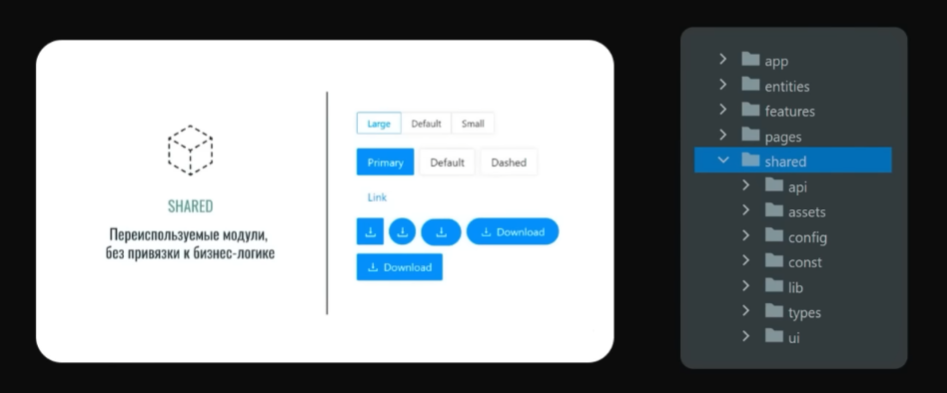

### О слое

Shared - это слой для общих частей приложения: библиотека компонентов, UI-kit, взаимодействие с API, среда выполнения. Оно не имеет конкретной бизнес-логики и может быть использовано в другом проекте в отрыве от текущего.

Не содержит slice

Частые сегменты:

- `api` - клиент запросов, префикс для запросов
- `ui` - кнопки, инпуты, карты, чекбоксы
- `lib` - хуки, хелперы, форматтеры
- `config` - переменные окружения, конфигурации и feature flags
- `routes` - роуты в приложении
- `i18n` - интернационализации

И многие другие. У нас нет ограничений на наименование сегментов.

> [!warning] Из-за проблем, связанных со сборщиками и их работой с реэкспортами файлов, класть в корень слоя `index.ts` может быть чревато раздутым бандлом и более медленной сборкой


### Константы маршрутов

В `shared` нам уже стоит расположить константы наших роутов, которые мы будем использовать во время навигации по приложению. Эти константы не являются частью бизнес-логики самого приложения и использоваться могут сразу во всех слоях, поэтому `shared` - это самый правильный вариант их расположения.

`src / shared / routes / routes.ts`

```TS
export const ROUTES = {
    main: '/',
    community: '/community',
    category: (alias: string) => `/${alias}`,
    article: (alias: string) => `/article/${alias}`,
    profile: {
       index: '/profile',
       edit: '/profile/edit'
    }
}
```

И провайдим их через публичное АПИ

`src / shared / routes / index.ts`

```TS
export { ROUTES } from './routes'
```

### Конфигурации

Создаём пример энвов, который будет сохранён в нашем репозитории

`.env.example`

```env
API_URL=https://ratingus.ru/api
```

Создаём сами энвы

`.env`

```env
API_URL=https://ratingus.ru/api
```

Игнорим энвы, чтобы не закидывать их в репозиторий в публичный доступ

`.gitignore`

```
.env
```

И описываем конфигурацию сбора переменных окружения

`src / shared / config / env.ts`

```TS
export type EnvConfig = {
    API_URL: string;
}

export const CONFIG: EnvConfig = {
    API_URL: import.meta.env.API_URL
}
```

Ну и тут же рядом мы можем расположить feature-флаги нашего приложения

`src / shared / config / flags.ts`

```TS

```

Теперь остаётся только создать для них публичное АПИ

`src / shared / config / index.ts`
```TS
export { CONFIG } from './env';
export type { EnvConfig } from './env';
```

### API клиент

Создаём едный инстанс клиента axios

`src / shared / api / client.ts`
```TS
import axios from 'axios';
import { CONFIG } from '../config';

export const http = axios.create({
    baseURL: CONFIG.API_URL,
    headers: {
       'Content-Type': 'application/json'
    }
});
```

Далее рядом кладём интерцептор авторизации

`src / shared / api / access-token.intecepter.ts`
```TS
import { http } from './client';

http.interceptors.request.use(request => {
    const accessToken = localStorage.getItem('accessToken');
    if (accessToken) {
       request.headers['Authorization'] = `Bearer ${accessToken}`
    }
    return request
}, error => {
    return Promise.reject(error)
});
```

И просто экспортируем из `shared` инстанс API

`src / shared / api / index.ts`
```TS
export { http } from './client'
```

Далее уже все запросы мы будем располагать в своих отдельных слоях, которые непосредственно будут отвечать за сущность

### Библиотека

`lib` хранит в себе всё то, что нам не удалось распределить по основным сегментам. 

Мы можем разбить этот сегмент **по типу** - `hooks`, `components`, `helpers`. Но это будет *плохой* вариант. 
Более *правильным* в данном контексте будет разбиение **по назначению** - `storybook`, `graphql`, `debounce`, `tests`. И уже внутри этих папок располагать хуки и хелперы, которые относятся к данной доменной области. 

Пример с первым типом разделения: 

`src / shared / lib / hooks / useDebounce.ts`
```TS
import { useState, useEffect } from 'react';

export function useDebounce<T>(value: T, delay: number) {
    const [debouncedValue, setDebouncedValue] = useState(value);

    useEffect(
       () => {
          const handler = setTimeout(() => {
             setDebouncedValue(value);
          }, delay);

          return () => {
             clearTimeout(handler);
          };
       },
       [delay, value]
    );

    return debouncedValue;
}
```

И далее экспортируем элементы:

`src / shared / lib / hooks / index.ts`
```TS
export { useDebounce } from './useDebounce'
```

`src / shared / lib / index.ts`
```TS
export { useDebounce } from './hooks'
```

>[!warning] В `lib` папки `shared` нельзя класть хелперы, которые относятся к определённой сущности! Хэлпер `divideNum` - в `shared`, а `calcCredit` - в сущность с кредитом.

### UI компоненты

Все ui-компоненты, которые мы используем в приложении (`Tag`, `Text`, `Heading`, `Card`) располагаются в сегменте `ui`

Добавляем элемент `Tag` в `shared > ui > Tag`

`src / shared / ui / Tag / Tag.module.css`
```CSS
.tag {
  display: flex;
  align-items: center;
}

.tag svg {
  color: var(--dominant-main);
}

.tag span {
  color: var(--dominant-main);
}

.s {
  gap: 6px;
  padding: 4px 8px;
  border-radius: 49px;
}

.m {
  gap: 4px;
  padding: 6px 8px;
  border-radius: 28px;
}

.s svg {
  width: 16px;
  height: 16px;
}

.m svg {
  width: 24px;
  height: 24px;
}

.s span {
  font-weight: 500;
  font-size: 14px;
  line-height: 1.42857;
}

.tagM span {
  font-weight: 400;
  font-size: 18px;
  line-height: 1.66667;
}

.orange {
  background-color: var(--orange);
}

.red {
  background-color: var(--red);
}

.green {
  background-color: var(--green);
}

.greenLight {
  background-color: var(--green-light);
}
```

`src / shared / ui / Tag / Tag.props.ts`
```TS
import type { DetailedHTMLProps, HTMLAttributes, ReactNode } from "react";
import type { IconType } from '../../../assets/Icon/Icon';


export interface TagProps
    extends DetailedHTMLProps<HTMLAttributes<HTMLDivElement>, HTMLDivElement> {
    size: "s" | "m";
    color: "orange" | "red" | "green" | "greenLight";
    icon: IconType;
    children: ReactNode;
}
```

`src / shared / ui / Tag / Tag.tsx`
```TS
import cn from "classnames";

import styles from "./Tag.module.css";
import type { TagProps } from "./Tag.props";
import { Icon } from "../../../assets/Icon/Icon";

export const Tag = ({ icon, size, color, children, className }: TagProps) => {
    const IconComponent = Icon[icon];

    const renderChildren = () => {
       if (typeof children === "string") {
          return <span>{children}</span>;
       }
       return children;
    };

    return (
       <div className={cn(styles.tag, styles[color], styles[size], className)}>
          <IconComponent />
          {renderChildren()}
       </div>
    );
};
```

Далее просто экспортируем все элементы из данного сегмента

`src / shared / ui / index.ts`
```TS
export { Footer } from './Footer/Footer'
export { Tag } from './Tag/Tag'
```

### Импорты в shared

Внутри `shared` разрешены импорты одних элементов в другие. Так же разрешено импортировать в один ui-элемент другие ui-элементы. 
Но такого подхода лучше избегать и использовать композицию (добавлять те же самые слоты для вкладывания иконки, а не вшивать её). 

Основная цель - делать максимально атомарные элементы.


### Что ниже shared

FSD - довольно гибкий инструмент. Нам не всегда может быть удобно располагать некоторые библиотеки в рамках чисто только наших слоёв. 

Некоторые элементы нужны везде, но они могут относиться напрямую в зависимости тех или иных компонентов. 

Например, иконки. Это элементы, которые удобно разместить в отдельной папке, чтобы избежать проблем с нарушением иерархии импорта или реализации композиции.
Все иконки можно легко перенести в слой `assets`, который можно легко применить для всех других слоёв.

`src / assets / Icon / Icon.tsx`
```TSX
import Check from './icons/check.svg?react'

export const Icon = {
	Check
};

export type IconType = keyof typeof Icon;
```

>[!success] Таким образом, иконки будут находится ниже shared слоя и не будут нарушать иерархию импортов


---

## Инструменты FSD

### Steiger

Плагин Steiger позволяет нам поддерживать правильную структуру папок в соответствии с заданными правилами

```bash
bun i -D steiger @feature-sliced/steiger-plugin
```

Далее нам нужно создать команду, в которой мы укажем штейгеру, где находится наш fsd-проект

```JSON
"fsd": "steiger ./src"
"fsd:fix": "steiger ./src --fix"
```

В итоге у нас выйдет список всех ошибок, которые нужно будет поправить, чтобы соответствовать правилам FSD


Теперь у нас всегда будут подсвечиваться ошибки в поддержании методологии.

### Path Alias

Крайне удобная вещь для того, чтобы оставлять импорты красивыми и сокращать их запись - это алиасы для путей.

Сначала их нужно указать в `tsconfig`

`tconfig.json`

```JSON
"paths": {
    "@/*": [
       "./src/*"
    ]
},
```

А затем указать их в нашем сборщике. Проще всего указать пути в Vite, так как он с помощью плагина позволяет стянуть пути из `tsconfig`.

`vite.config.ts`

```TS
import { defineConfig } from 'vite'
import react from '@vitejs/plugin-react'
import svgr from "vite-plugin-svgr";
import tsconfigPaths from 'vite-tsconfig-paths'

// https://vite.dev/config/
export default defineConfig({
    plugins: [react(), svgr(), tsconfigPaths()],
})
```

### Tree-shaking

Использование `index.ts` является антипаттерном. Такой подход вызывает более длительную сборку и не всегда работает tree-shaking, что приводит к более большому бандлу.

Мы можем не делать общие экспорты из слоёв, а оставить `shared/ui`, `entities/user`, `features/addComment`. То есть опустить некоторые `index.ts` и избавиться от проблемы с большим бадлом.

Чем новее сборщик, тем реже встречается эта проблема, но стоит всегда проверять размер бандла страницы при использовании такого подхода.

### CLI

Так же у команды FSD есть свой CLI для генерации новых частей приложения в соответствии с их методологией

```bash
bun i -g @feature-sliced/cli
```

Создаст сегмент `test` в `shared`: `shared/test`

```bash
fsd s test
```

Такая команда позволит нам создать shared компонент по пути `./shared/ui/componentTest`

```bash
fsd shared -c ui/componentTest
```

Флаг `-r` / `--root` позволяет нам создать сущность пользователя в директории `./src/lib`, которая является корнем другого FSD проекта.

```bash
fsd e user -r ./src/lib
```

Если нам нужно сгенерировать сразу несколько слайсов, то мы можем использовать перечисление. А если нам нужно добавить в слайсы сегменты, то это указывается через флаг `-s`.

Такая команда создаст слайсы `edit` и `main`, где каждый будет иметь сегменты `ui`, `api` и `model`

```bash
fsd p edit main -s ui, api, model
```

### Расширения

Для VSCode есть несколько удобных расширений для работы с данной методологией. Мы можем отдельно установить генератор слайсов.


После установки, мы получаем функциональность быстрой генерации отдельных слоёв, сегментов и слайсов


После создания отдельного слайса, мы сразу будем иметь готовый шаблон структуры


---

## Entities

### О слое

Entities - это слой концепицй из реального мира, которые отвечают на вопрос: "что это?".

Это бизнес-сущности, которые **представлены** в приложении. То есть мы не можем, как и в страницах, указать `main` и положить туда одну страницу. Тут мы должны определить домен в приложении и указать его.

Импортироваться сущности друг в друга - **не могут**. Они максимально изолированы друг от друга.

Содержит slice


Осноными сегментами слайсов тут будут являться:

- `model` - данные по текущей сущности. Например, интерфейс пользователя.
- `api` - запросы в рамках всей сущности. Например, получить профиль клиента.
- `ui` - интерфейсы, специфичные только для этой сущности. Например, `UserAvatar`.
  Именно они описывают максимально полно сущность.

Тут желательно не оставлять `config` и `lib`.


### Создание Slices

Выделение сущностей напрямую зависит от доменных областей, которые покрывает наше приложение

`src/entities/user/index.ts`
`src/entities/review/index.ts`
`src/entities/rating/index.ts`
`src/entities/correction/index.ts`
`src/entities/company/index.ts`
`src/entities/category/index.ts`

### State managment

Устанавливаем стейт-менеджер

```bash
npm i zustand
```

Описываем интерфейс пользователя

`src/entities/user/model/user.model.ts`
```TS
export interface User {
	email: string;
	name: string;
}
```

Описываем стейт пользователя

`src/entities/user/model/user.store.ts`
```TS
import type { StateCreator } from 'zustand';
import type { User } from '.';
import { createWithEqualityFn } from 'zustand/traditional';
import { devtools } from 'zustand/middleware';

export type UserState = {
	profile?: User;
}

export type UserActions = {
	getProfile: () => void
}

type createUserStoreType = StateCreator<UserState & UserActions>;


const userSlice: createUserStoreType = () => ({
	profile: undefined,
	getProfile: async () => {
		// ... получение  профиля
	}
})

export const useUserStore = createWithEqualityFn<UserState & UserActions>()(
	devtools(userSlice, {
		name: "userStore"
	})
)
```

Экспортируем хук для получения клиента и пользователя из модели

`src/entities/user/model/index.ts`
```TS
export type { User } from './user.model'
export { useUserStore } from './user.store'
```

Экспортируем сегмент модели из слайса

`src/entities/user/index.ts`
```TS
export * from './model'
```

Экспортируем слайс из слоя

`src/entities/index.ts`
```TS
export * from './user'
```

И теперь мы можем достать имя клиента на уровне лейаута страницы и отобразить его

`src/app/layout/Layout.tsx`
```TSX
import { Outlet } from 'react-router'
import { Footer } from '@/shared/ui'
import { Icon } from '@/assets'
import { useUserStore } from '@/entities'

export function Layout() {
	const { profile } = useUserStore()

	return <div>
		<div>Шапка</div>
		{profile?.name}
		<Icon.Check />
		<Outlet />
		<Footer />
	</div>
}
```

### API

Описываем базовые роуты для отдельной сущности. Тут будут находиться константы путей, куда должен полететь запрос

`src / entities / user / api / routes.ts`
```TS
import { CONFIG } from '@/shared/config';

export const USER_API = {
	profile: `${CONFIG.API_URL}/user/me`,
	byUsername: (username: string) => `${CONFIG.API_URL}/user/username/${username}`
}
```

Далее описываем отдельный запрос. Интерфейсы под Request и Response должны находиться вместе с запросом.

`src / entities / user / api / requests / get-profile.request.ts`
```TS
import { http } from '@/shared/api';
import { USER_API } from '../routes';
import type { User } from '../../model';

export async function getProfile() {
	// Обработка ошибки
	const { data } = await http.get<User>(USER_API.profile);
	return data;
}
```

Далее собираем публичное АПИ из сегмента АПИ

`src / entities / user / api / index.ts`
```TS
export { USER_API } from './routes';
export { getProfile } from './requests/get-profile.request'
```

Добавляем метод для получения клиента в машину состояний

`src / entities / user / model / user.store.ts`
```TS
import { getProfile } from '../api';

const userSlice: createUserStoreType = (set) => ({
	profile: undefined,
	getProfile: async () => {
		const user = await getProfile();
		set({ profile: user });
	}
})
```

Примерно так выглядит итоговая структура


### UI компоненты

Создаём ui-элемент аватара пользователя. Он будет находиться тут, так как под него будет свой запрос на получение аватара и этот компонент будет служить только для отображения аватара клиента. В приложении нет других мест, где мы мог примениться этот аватар, поэтому смысла выносить его в ui-компонент - мало. 

`src / entities / user / ui / Avatar / Avatar.tsx`
```TSX
import styles from './Avatar.module.css'

export function Avatar() {
	return <div className={styles.avatar}>
	</div>
}
```

`src / entities / user / ui / Avatar / Avatar.module.css`
```CSS
.avatar {
	border: 1px solid white;
	border-radius: 50px;
}
```

Публичное АПИ из сегмента

`src / entities / user / ui / index.ts`
```TS
export { Avatar } from './Avatar/Avatar'
```

Публичное АПИ из слайса

`src / entities / user / index.ts`
```TS
export * from './model'
export * from './ui'
```

### Выделение entities


### Кросс-импорты

Кросс-импорты в FSD реализуются через договорённость. Мы в сущности указываем особый public API, который располагается в `@x/` и в нём хранится наименование слайса, для которого предназначено это публичное API.

Условно: `entities/user/@x/auth`. Тут мы экспортируем из сущности `user` определённые элементы, которые нужны в сущности `auth`

Пример:
Экспортируем из сущности `user` интерфейс `User` для использования в сущности `review`

`src / entities / user / @x / review.ts`
```TS
export type { User } from '../model/user.model'
```


---

## Features

### О слое

Features - это все основные взаимодействия с приложением, которые отвечают на вопрос: "что сделать?". Это отдельная функциональность, которая приводит к определённому результату.

Features должно быть то, что переиспользуемыми!

Содержит slice

Примеры:

- кнопка, которая получает состояние подписки и позволяет отписаться или подписаться
- тугглер лайка, тугглер дизлайка
- тугглер темы
- свитчер языка

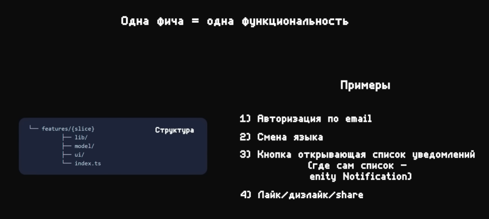

Основными сегментами выступают те же самые, что и в entities, так как тут хранится состояние этой сущности, запросы, интерфейс и конфигурации доступности / настройки:

- model - внутренее состояние, валидация
- api - запрос для взаимодействия (в основном, мутации)
- ui - интерфейс фичи
- config - тугглит поведение отдельной текущей фичи


### Применение feature

У нас есть слайс `Article`, который отвечает за статью.

Статью можно:
- лайкнуть
- распространить

Фича лайка статьи

`src / features / artice / ui / Like / Like.tsx`
```TSX
export function Like() {
	return <>
		Like
	</>
}
```

Фича распространения статьи

`src / features / artice / ui / Share / Share.tsx`
```TSX
export function Share() {
	return <>
		Поделиться
	</>
}
```

Далее делаем глобальный экспорт

`src/features/artice/index.ts`
```TS
export { Like } from './ui/Like/Like'
export { Share } from './ui/Share/Share'
```

### Специфичность CSS


`src/features/artice/ui/Like/Like.module.css`
```CSS
.like.like {
	height: 100px;
}
```


`src/features/artice/ui/Like/Like.tsx`
```TSX
import { Tag } from '@/shared/ui';
import styles from './Like.module.css';

export function Like() {
	return <>
		<Tag size='m' color='orange' icon='Check' className={styles.like}>Привет</Tag>
	</>
}
```


`src/shared/ui/index.ts`
```TS
export { Footer } from './Footer/Footer'
export { Tag } from './Tag/Tag'
```

Добавляем фичу лайка на главную

`src/pages/main/ui/MainPage/MainPage.tsx`
```TSX
import { Link } from 'react-router';
import { ROUTES } from '@/shared/routes';
import { Like } from '@/features/artice';

export function MainPage() {
	return <div>
		Главная
		<Link to={ROUTES.profile.index}>Профиль</Link>
		<Like />
	</div>
}
```

### Упражнение - выделение features


### Упражнение - разметка страниц


---

## Widgets

Они представляют собой отдельные части страницы - хедер, футер, сайдбар, отдельный пост

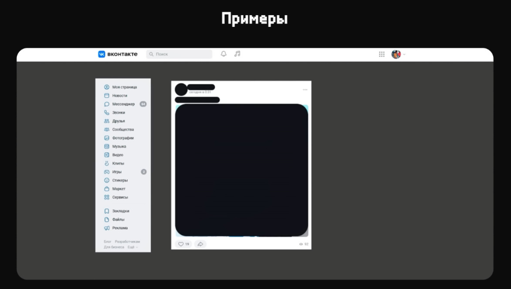

### О слое

Widgets - это большие самодостаточные блоки интерфейса.

Нужны, когда:

- Используются в нескольких частях приложения
- На странице несколько независимых блоков, которые можно вынести в виджеты


Делится на те же сегменты, что и сущности, но, преимущественно, будет состоять из ui-элементов, так как зачастую представляет из себя выеделенные блоки контента на странице


### Примеры Widget

Создаём виджет сетки категорий

`src / widgets / category / ui / CategoryGrid / CategoryGrid.tsx`
```TSX
export function CategoryGrid() {
	return <></>
}
```

Далее создаём так же публичное АПИ из слайса категорий

`src/widgets/category/index.ts`

### Processes


### Упражнение - выделение виджетов


### Упражнение - финал декомпозиции


---

## Работа с фреймворками

### Next

В nextjs есть особенность, что он отъедает папки `pages` и `app` и переопределяет их под свои нужды.
Чтобы полноценно поддержать FSD исправить эту проблему, мы должны пропустить создание `src` папки и хранить `app` в корне, а остальную часть кода, которая разделена по FSD - в `src`


Теперь то, что находится в `app` будет опеделять наш роутинг. В `src` мы будем создавать компонент-страницы и переиспользовать их в роутере.


- экспортируемые метаданные и настройки для страницы можно хранить в `src/pages/<page>/meta/meta.ts`
- лейауты так же можем помещать в `src/app/layouts/*`

> [!warning] Если с next не работает папка `src/`, то её можно переименовать в любое другое наименование (например, `fsd/`), чтобы не было конфликтов с внешними `app` и `pages`

### Vue

Реконфигурируем положение элементов в проекте:

- В качестве `entrypoint` у нас будет выходить `App.vue` и `main.ts`
- Выделяем туда же в `app` роутинг
- Выносим вьюшки страниц в `pages`. Оттуда нужно переэкспортировать дефолтные экспорты из Vue


Определяем входную точку в приложение через корневой HTML, в котором указываем путь до скрипта

`index.html`

```HTML
<!DOCTYPE html>
<html lang="">
  <head>
    <meta charset="UTF-8">
    <link rel="icon" href="/favicon.ico">
    <meta name="viewport" content="width=device-width, initial-scale=1.0">
    <title>Vite App</title>
  </head>
  <body>
    <div id="app"></div>
    <script type="module" src="/src/app/entrypoint/main.ts"></script>
  </body>
</html>
```

И проект теперь на FSD


### Nuxt

Немного меняем конфигурацию и добавляем `alias` с переопределением в `dir` директорий для расположения роутов и лейаутов

`nuxt.config.ts`

```TS
// https://nuxt.com/docs/api/configuration/nuxt-config
export default defineNuxtConfig({
  compatibilityDate: '2025-07-15',
  devtools: { enabled: true },

    alias: {
        '@': '../src'
    },
    dir: {
        pages: './src/app/routes',
        layouts: './src/app/layouts',
    },

  modules: [
    '@nuxt/eslint',
    '@nuxt/image',
    '@nuxt/scripts',
    '@nuxt/test-utils',
    '@nuxt/ui',
    '@nuxt/content'
  ]
})
```

В роутер передаём страницу, описанную в `pages`

`src / app / routes / index.vue`

```HTML
<script setup lang="ts">
import {HomePage} from "../../pages/home";
</script>

<template>
  <HomePage/>
</template>
```

Оставляем в корне проекта корневой vue-файл

`app.vue`

```HTML
<template>
  <div>
    <NuxtRouteAnnouncer />
    <NuxtPage/>
  </div>
</template>
```

И примерно так выглядит структура нашего проекта после переопределения проекта под FSD


### Angular

Так же легко реализуется поддержание FSD и в Angular:

- Перемещаем корневой app компонент в entrypoint
- выделяем configs и router в отдельные папки
- оставляем `main.ts`, глобальные стили `styles.scss` и входной `index.html` в корне проекта


### Sveltekit

Производим начальную конфигурацию кита:

- Перемещаем расположение папок роутинга в `app/routes`
- Переопределяем корневой шаблон на другое местоположение `src/app/index.html`

`svelte.config.js`

```JS
import adapter from '@sveltejs/adapter-auto';
import { vitePreprocess } from '@sveltejs/vite-plugin-svelte';

/** @type {import('@sveltejs/kit').Config} */
const config = {
  preprocess: vitePreprocess(),

  kit: {
   adapter: adapter(),
   alias: { '@/*': 'src/*' },
   files: {
    routes: 'src/app/routes',
    lib: 'src',
    appTemplate: 'src/app/index.html',
    assets: 'public'
   }
  },
};

export default config;
```

Примечание: страницы дефолтно экспортируются из файлов Svelte

`pages / home / ui / index.ts`

```TS
export { default as HomePage } from './Home.svelte'
```

Далее просто импортируем нашу страницу в роутер

`app / routes / +page.svelte`

```JS
<script lang="ts">
  import { HomePage } from '@/pages/home';
</script>

<HomePage />
```

### Миграция проектов

Миграция большого проекта в FSD - это достаточно долгий процесс. Чтобы снизить градус боли, можно следовать такой последовательности:

- создать отдельную папку под FSD (`src`, `fsd`)
- выделить сначала `pages` и `app`
- затем можно перетащить переиспользуемый функционал в `shared` (легко туда переедут `hook`, `interfaces` и `helpers`)
- потом постепенно перетаскивать во время рефакторинга или проивзодства новый фичи в `features` / `entities` / `widgets`

## Примечания

Так выглядит структура папок уже у конкретной сущности
Она хранит свои компоненты, константы, хелперы, которые нужны только ей и отдаёт наружу только компоненты, которые могут пригодиться в слоях выше
Мапперы подготавливают данные для отправки на сервер или для вывод на фронтенде

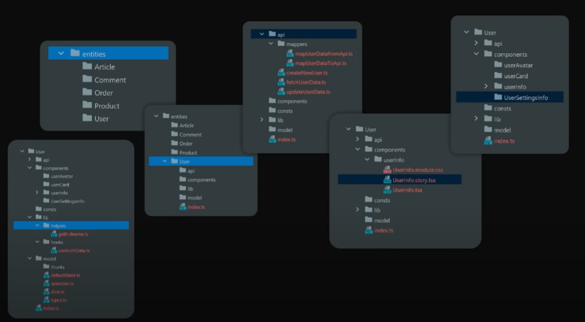

Как можно определить, к какому слою должен относиться компонент?

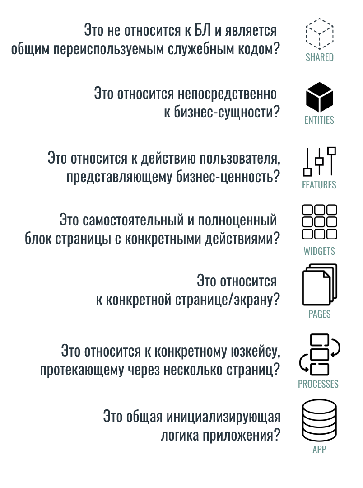

А тут уже располагаются примеры тех компонентов, которые могут находиться в определённых слоях:

- shared - переиспользуемые отдельные блоки, которые мы можем вынести в другое приложение
- entity - общий компонент пост, который подходит под посты пользователей, групп и который имеет место под текст, фавиконку и не имеет фичей (тех же лайков и пересылки сообщений), потому что они могут отличаться по реализации в зависимости от разных постов
- features - бизнес-действия пользователя - лайк, репост, удалить, изменить комментарий, добавить его
- widgets - блок с соединённой сущностью и фичёй
- pages - цельная страница, которая должна состоять из виджетов

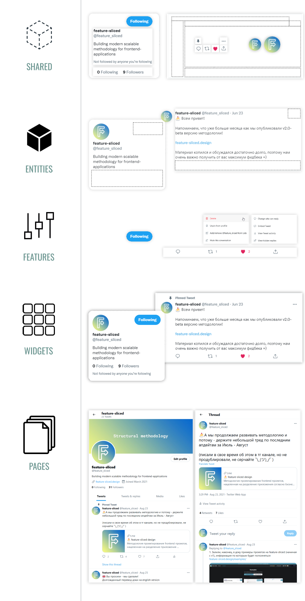
