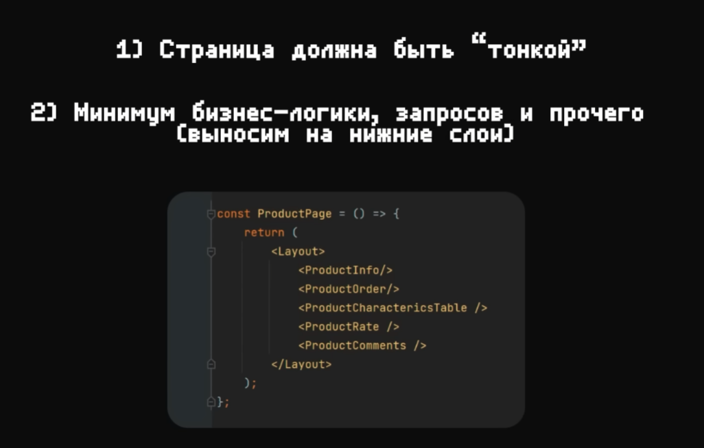

---
tags:
  - architecture
  - fsd
  - react
  - vue
  - angular
  - svelte
  - frontend
---


## Введение

Feature Slice Design — архитектурная методология для проектирования фронт-энд приложений

Является набором правил и соглашений для организации кода.

Этот подход очень удобен, так как призван: 
- позволять легко масштабировать проект
- повысить качество кода
- упростить поддержку и погружение в код новых разработчиков
- коннектить код и бизнес-логику

Важным отличием от других подходов является то, что мы отталкиваемся не от вида или назначения компонента, а от доменной области, в рамках которой мы решаем проблемы.

В отличие от классического подхода, когда мы организуем код как: `components`, `pages`, `views`, `hooks` - тут мы применяем фиксированный набор слоёв (app, process, pages, widgets, features, entities, shared), поделённых на сегменты. Сегменты включают три уровня: слои (layers), слайсы (slices) и сегменты (segments). 


Проект: рейтинг сравнения компаний. В этом контексте будет разбиваться приложение на слайсы


Второй проект: страница курсов в LMS


### Компоненты

Для того, чтобы сразу определиться с компонентами без дизайн-системы, можно воспользоваться [набором компонентов](https://www.figma.com/design/m1vXQMlhor5GdTH48IBMDX/Feature-Slice-Design?node-id=0-1&t=niH3xeKjGQsC7WZs-1), с помощью которого разметить будущее приложение


## Введение в FSD

FSD позволяет следовать всем канонам ООП за счёт своей структуры. 
Public API предоставляет доступ только к нужным файлам из нашей целевой папки


### Что такое FSD

FSD - это архитектурная **методология** для проектирования масштабируемых и поддерживаемых приложений. Представляет из себя набор правил и соглашений по организации кода.

Позволяет: 
- Сделать код более понятным
- Сделать проект более стабильным с учётом частых изменений
- Иметь единую концепцию структурирования приложения

Обычная архитектура проекта, когда мы делим всё на компоненты, страницы и хуки - разрушительна. Когда мы стартуем приложение - всё выглядит аккуратно. По мере роста проекта, он начинает обрастать огромным количеством связной логики, которую со со временем уже не представляется возможность поддерживать, а любые изменения становятся крайне дорогими. 


Когда мы переходим на FSD, совершается переход на некоторую архитектуру, которая задаёт свою концепцию работы. В рамках этой концепции, мы обязаны соблюдать правила, которые позволят нам чётко разбивать бизнес-процессы на правильные домены, что сильно упростит понимание проекта и его поддержку. 


### Layers

Слой - это группа, которая хранит отведённую для неё часть логики

Части слоёв в проекте может не быть.

1. `app` — базовая структура проекта, содержащая роутинг, базовые стили и точки входа в приложение. Самая важная часть для запуска проекта.
2. `processes` (процессы, **устаревший слой**) — сложные сценарии, покрывающие несколько страниц (например, авторизация)
3. `pages` (страницы) — композиционный слой для сборки полноценных страниц из сущностей, фич и виджетов.
4. `widgets` (виджеты) — самодостаточные блоки интерфейса, которые могут использоваться на разных страницах, например, профиль пользователя.
5. `features` (фичи) — функциональные элементы, отвечающие на вопрос «что сделать?», например, лайкнуть пост или оставить комментарий.
6. `entities` (сущности) — бизнес-сущности, отвечающие на вопрос «что это?», например, аватар или комментарий.
7. `shared` — переиспользуемый код, не имеющий отношения к специфике приложения/бизнеса (например, UIKit (button, label, text), libs, API). Этот слой не содержит бизнес-логики, которую можно привязать только к определённому домену.

>[!warning]  Сейчас слой `process` - **deprecated**. 
> Раньше этот слой хранил в себе определённые процессы приложения: добавление закладки или оплата товара. Мы сохраняли процесс - логику перехода между страницами. 
> Проблема такого подхода заключалась в том, что огромное количество процессов переиспользовали страницы ещё по одному разу, что было бессмысленно и сильно увеличивало количество кода. Отслеживать процесс и оркестрировать состояние не имеет смысла, так как ту же логику редиректа или любого другого поведения можно реализовать и в фичах. 
 
Примеры: 
- Компонент `UserAvatar` может находиться как в `entities` (если он имеет логику получения аватара), так и в `shared`, если это просто кружок, который отображает картинку.
- Компонент `payAgency` отвечает на вопрос "что сделать?", поэтому его нужно хранить в `features`.


Модули на одном слое могут взаимодействовать лишь с модулями, находящимися на слоях строго ниже.  То есть мы можем использовать `shared` в `entities`, `features` и во всех остальных слоях. Но использовать `feature` в `entities` уже нельзя. 


### Slices

Слайсы - это подразделения кода внутри слоев, организованные по доменным областям продукта

Название слайса - его название в бизнесе. 

То есть слайс может отвечать за хранение данных и логики по пользователю, авторизации, корзине, посте, оплате, комментарии - и мы так и называем этот слайс. 


Slice располагаются во всех Layers, кроме `app` и `shared`. Эти две группы слоёв не могут содержать слайсы по той причине, что они никак не относятся к бизнес-логике. 


FSD решает проблемы декомпозиции функционала приложения и доменных зон, а так же упрощает упрощает поиск нужного сегмента кода: 
- Аватар пользователя находится в entities. Эта часть отображает контент. 
- Изменить наименование профиля в features. Эта часть отвечает за выполнение операции. 
- Блок настроек аккаунта в widgets. Он хранит в себе группу фичей изменения аккаунта.
- Страница профиля с настройками -  pages. Она хранит в себе виджет с настройками аккаунта и аватар пользователя.  

И очень важно делить наше приложение на доменные области правильно, так как некорректное выделение бизнес-сущностей может привести к нарушениям сцепленности и связности приложения. 

У нас есть сущность оплаты, которая не должна иметь в себе интерфейс комментариев, который плотно врезан в первую. У нас должен быть низкий coupling (сцепленность). А так же эти сущности должны в себе хранить высокосвязанную между собой логику, но отделённую от других сущностей - высокий coupling (связность). 


Так же как и с правилом импортов между слоями, тут есть правило общей точки для экспорта. Мы должны инкапсулировать нужные части внутри слайса и отдавать наружу только публичное API.


### Segments

Сегменты - группы кода по его назначению.
Название сегмента — описание кода, который там лежит
Сегменты должны отвечать на вопрос "для чего они", а не просто "что это"

Самые ходовые сегменты:
- ui - отображаемый интерфейс
- api - апи для работы с бэкэндом
- model - модель данного слайса
- lib - библиотека
- config - конфигурационные файлы

>[!warning] Слои `app` и `shared` сразу в себя включают сегменты без слайсов
 


Как и в слайсах, каждый сегмент должен содержать в себе публичное API, которое должно возвращать хранящиеся в нём данные.


---
## Pages и App

В идеале, она должна состоять просто из виджетов, которые уже в своих рамках реализуют нужную функциональность для пользователя



Слой приложения хранит в себе чисто все нужные компоненты, которые отвечают за entry-point или входную точку приложения


### О слое App
### Старт проекта
### Подготовка слоя App
### Обзор проекта
### О слое Pages
### Структура роутинга
### Выделение slice
### Создание первой страницы
### Добавление стилей
### Layout


## Shared


Shared вмещает в себя весь переиспользуемый контент по приложению. В него стоит поместить конфиги, инстансы API, ассеты, утилиты, хуки, константы и разного вида кнопки, инпуты, свитчеры в ui


## Инструменты FSD

## Entities

## Features


Фича - это отдельная функциональность, которая приводит к определённому результату (кнопка, которая получает состояние подписки и позволяет отписаться или подписаться, лайк/убрать лайк, дизлайк/убрать дизлайк, тугглер темы или свитчер языка) 

Он так же может хранить те же самые сегменты, что и остальные модули


## Widgets

Они представляют собой отдельные части страницы - хедер, футер, сайдбар, отдельный пост


## Работа с фреймворками
### Next

В nextjs есть особенность, что он отъедает папки `pages` и `app` и переопределяет их под свои нужды. 
Чтобы полноценно поддержать FSD исправить эту проблему, мы должны пропустить создание `src` папки и хранить `app` в корне, а остальную часть кода, которая разделена по FSD - в `src`


Теперь то, что находится в `app` будет опеделять наш роутинг. В `src` мы будем создавать компонент-страницы и переиспользовать их в роутере. 


- экспортируемые метаданные и настройки для страницы можно хранить в `src/pages/<page>/meta/meta.ts`
- лейауты так же можем помещать в `src/app/layouts/*`

### Vue


### Nuxt


### Angular

Так же легко реализуется поддержание FSD и в Angular: 
- Перемещаем корневой app компонент в entrypoint
- выделяем configs и router в отдельные папки
- оставляем `main.ts`, глобальные стили `styles.scss` и входной `index.html` в корне проекта


### Sveltekit

Производим начальную конфигурацию кита: 
- Перемещаем расположение папок роутинга в `app/routes`
- Переопределяем корневой шаблон на другое местоположение `src/app/index.html`

`svelte.config.js`
```JS
import adapter from '@sveltejs/adapter-auto';  
import { vitePreprocess } from '@sveltejs/vite-plugin-svelte';  
  
/** @type {import('@sveltejs/kit').Config} */  
const config = {  
  preprocess: vitePreprocess(),  
  
  kit: {  
   adapter: adapter(),  
   alias: { '@/*': 'src/*' },  
   files: {  
    routes: 'src/app/routes',  
    lib: 'src',  
    appTemplate: 'src/app/index.html',  
    assets: 'public'  
   }  
  },  
};  
  
export default config;
```

Примечание: страницы дефолтно экспортируются из файлов Svelte

`pages / home / ui / index.ts`
```TS
export { default as HomePage } from './Home.svelte'
```

Далее просто импортируем нашу страницу в роутер

`app / routes / +page.svelte`
```JS
<script lang="ts">  
  import { HomePage } from '@/pages/home';  
</script>  
  
<HomePage />
```

### Миграция проектов

Миграция большого проекта в FSD - это достаточно долгий процесс. Чтобы снизить градус боли, можно следовать такой последовательности:
- создать отдельную папку под FSD (`src`, `fsd`)
- выделить сначала `pages` и `app`
- затем можно перетащить переиспользуемый функционал в `shared` (легко туда переедут `hook`, `interfaces` и `helpers`)
- потом постепенно перетаскивать во время рефакторинга или проивзодства новый фичи в `features` / `entities` / `widgets`

## Примечания

Так выглядит структура папок уже у конкретной сущности 
Она хранит свои компоненты, константы, хелперы, которые нужны только ей и отдаёт наружу только компоненты, которые могут пригодиться в слоях выше
Мапперы подготавливают данные для отправки на сервер или для вывод на фронтенде


Как можно определить, к какому слою должен относиться компонент?


А тут уже располагаются примеры тех компонентов, которые могут находиться в определённых слоях:
- shared - переиспользуемые отдельные блоки, которые мы можем вынести в другое приложение
- entity - общий компонент пост, который подходит под посты пользователей, групп и который имеет место под текст, фавиконку и не имеет фичей (тех же лайков и пересылки сообщений), потому что они могут отличаться по реализации в зависимости от разных постов
- features - бизнес-действия пользователя - лайк, репост, удалить, изменить комментарий, добавить его
- widgets - блок с соединённой сущностью и фичёй
- pages - цельная страница, которая должна состоять из виджетов


