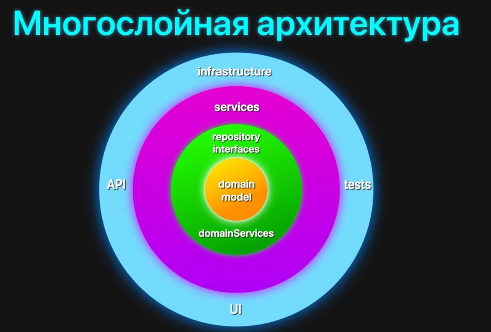
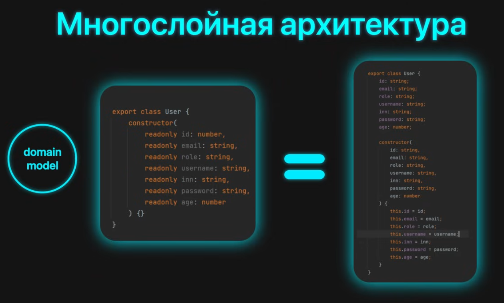

Что есть часть ПО?

1. Ядро - Бизнес-логика - это то, что придаёт ценность нашему продукту. Тут находятся все важные аспекты приложения, которые выполняют нужную пользователям функцию.
2. Инструменты - это другое ПО, которое мы используем для разработки нашего
3. UI - интерфейс, с которым взаимодействует пользователь
4. Фреймворки - это наш основной стек, который ограничивает архитектуру разработки нашего приложения (Spring, Angular)

Любая архитектура говорит нам, чтобы все части системы были независимы друг от друга. То есть предписывает, как мы можем устроить работу нашего приложения таким образом, чтобы отдельные элементы были легкозаменимыми и легко поддерживались.

## Введение

Многослойная архитектура - это архитектура, которая ...

## Части архитектуры
### Domain Model

Доменная модель - это описание бизнес-моделей, с которыми мы работаем.

Грубо говоря, это просто описание сущности, с которой будет работать бизнес-модель.

Сами эти модели просто описывают предметную область и не несут в себе никакой логики. Тут мы можем через декораторы описать сущности, добавить какие-то аннотации, но не реализовывать какую-то бизнес-логику.

### Repository Interfaces / Domain Services

Тут уже располагаются интерфейсы, с помощью которых мы осуществляем работу с доменной моделью.

Тут находится бизнес-логика, которая выполняет операции над нашими данными.

### Services

### API / Tests / UI / Infrastructure

