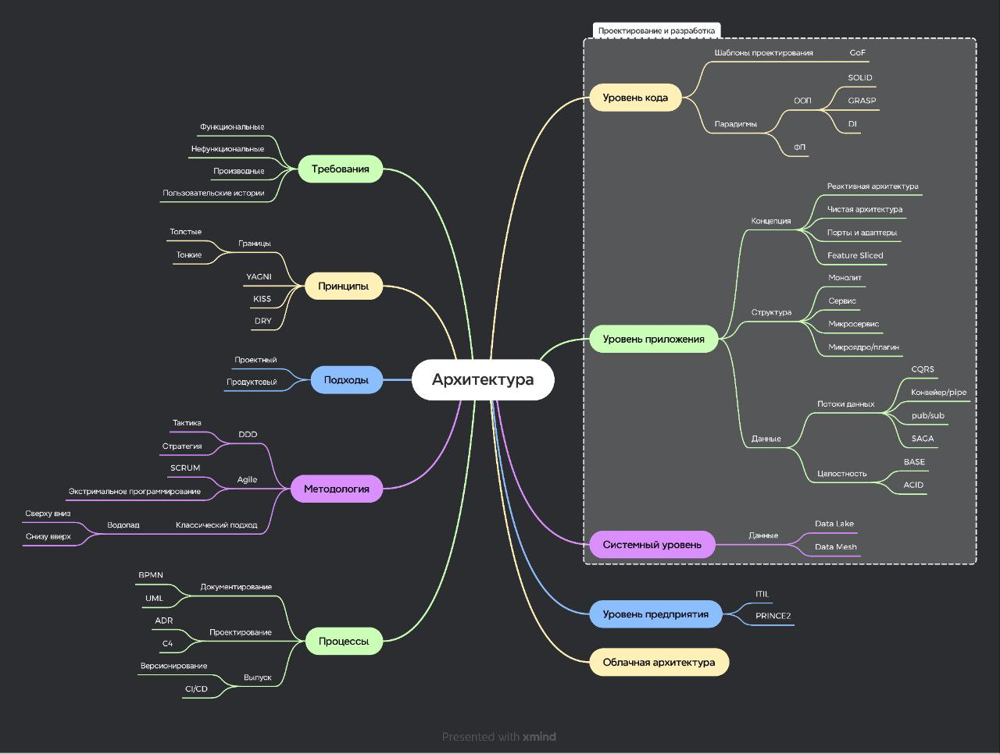

#architecture #app #environment

## Введение

Архитектура - это в целом наука, которая показывает нам, как строить, проектировать, организовывать взаимодействие нескольких сущностей с возведением организованной среды.

Архитектура в бизнесе так же делится на многие аспекты, которые непосрдественно связаны с разработкой ПО.

## Группы архитектур

- [ ] Требования
- [ ] Принципы
- [ ] Подходы
- [ ] Методология
- [ ] Процессы
- [ ] Проектирование и разработка
    - [ ] уровень кода
    - [ ] уровень приложения
    - [ ] системный уровень
    - [ ] уровень предприятия
- [ ] Облачная архитектура
