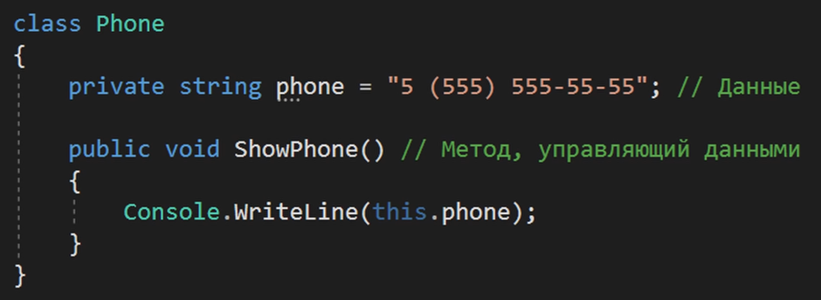
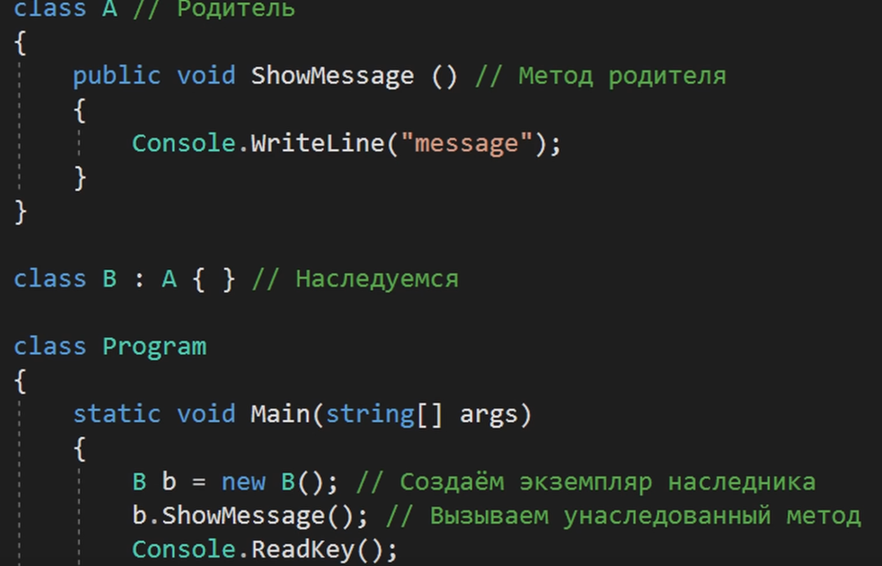
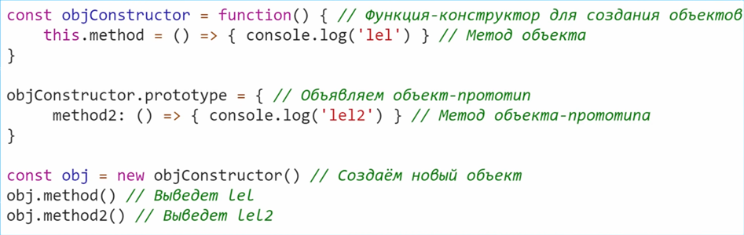
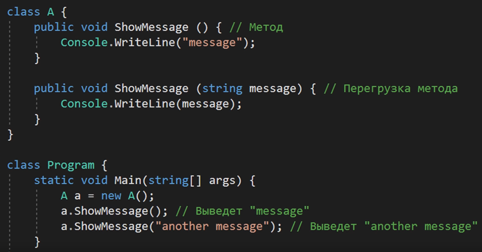
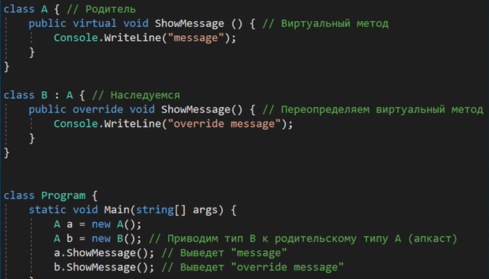
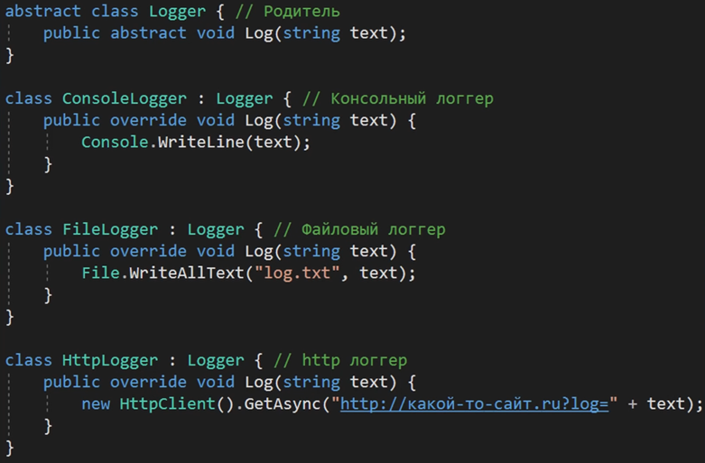
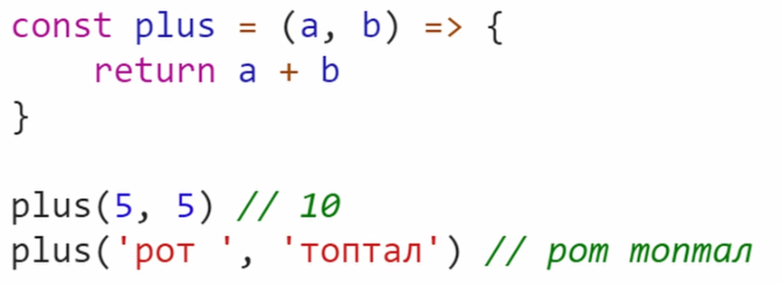
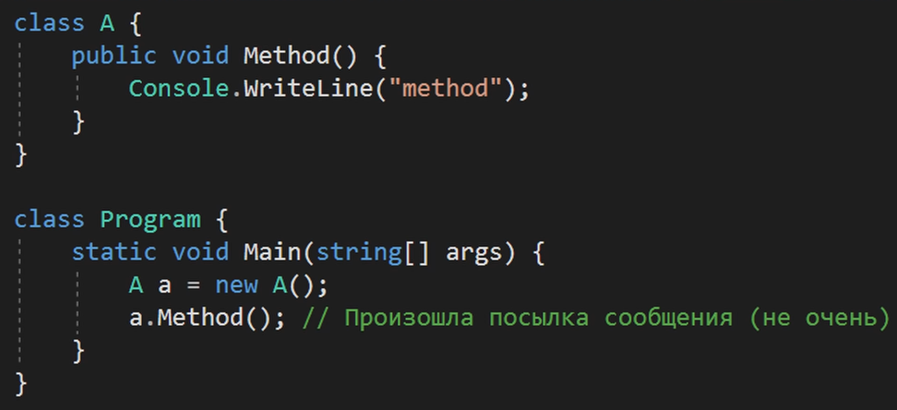
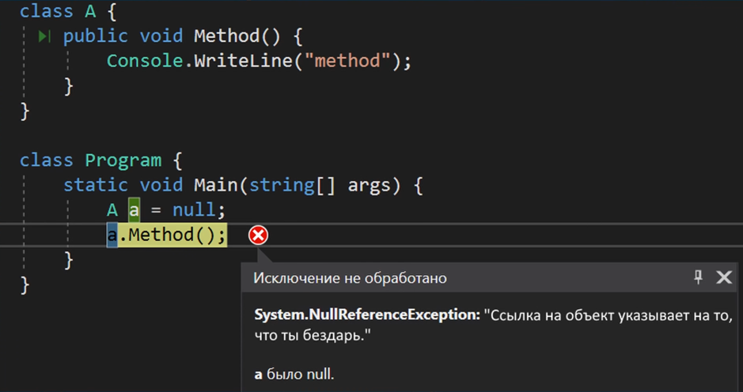

# Немного про ООП
#OOP #CSharp

### **Инкапсуляция**

- Инкапсуляция обеспечивает объединение данных и функции и в некоторых случая позволяет ограничить доступ одних объектов к другим.

Инкапсуляция обеспечивает сокрытие данных, но не является самим сокрытием данных. Она не всегда даёт такую возможность, так как некоторые языки представляют механизм рефлексии, который позволяет менять приватные данные

- Инкапсуляция по Герберту Шилдту

### **Наследование**

- Механизмы наследования можно заменить с помощью агрегации и композиции, однако эта парадигма нужна для формирования иерархии родственных объектов и создавать более благоприятные условия для реализации полиморфизма.

Однако тут стоит упомянуть, что наследование может быть даже вредно в реальных проектах, ведь можно поломать весь код из одного места и когда у родителя огромное множество наследников – вносить правки становится крайне сложно

- Идеальный пример наследования можно увидеть в прототипировании JS. Тут в качестве родителя выступает конкретно сформированный объект и объекты можно сотворять на ходу

### **Полиморфизм**

- Ad Hoc полиморфизм – который представлен перегрузкой методов

- Параметрический полиморфизм – который представлен в C# через Generics

- И полиморфизм подтипов, который мы достигаем через наследование и апкаст. Легче всего его понять, используя паттерн «Стратегия»

- Ещё один пример полиморфизма в логировании

- А таким образом можно показать полиморфизм в JS

- А тут пример, когда полиморфизм обеспечивает сокрытие. Тут представлен публичный метод Test, который при вызове в классе Program не позволит скомпилировать программу, так как теперь к нему нет доступа (он стал приватным и вызывается через метод Test2)

### **Абстракция**

- Инкапсуляция влияет на формирование интерфейса нашего будущего типа

### **Посылка сообщения**

- Объект вызывает метод у другого объекта

- Если в C такая парадигма может сработать, то уже в C# компилятор за такой подход надаёт по рукам

### **Повторное использование**

- Парадиигма, которая определяет повторное использование кода в проектах. Обычно и эту парадигму опускают в описании