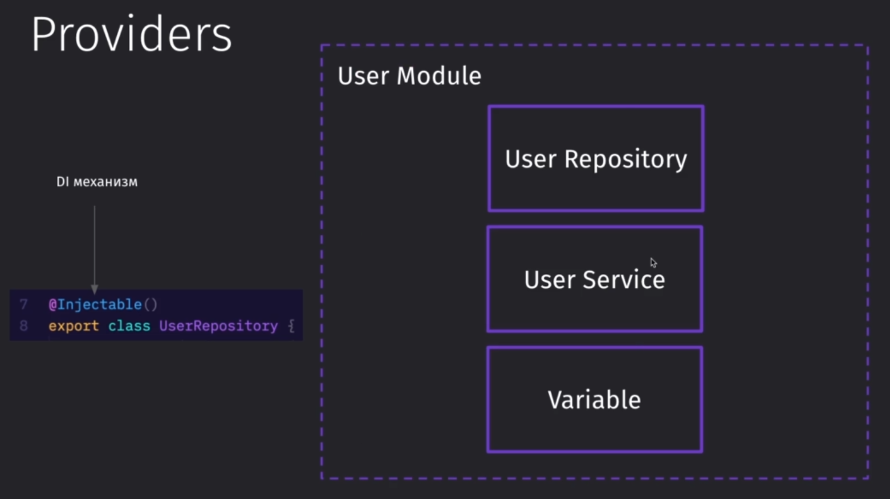
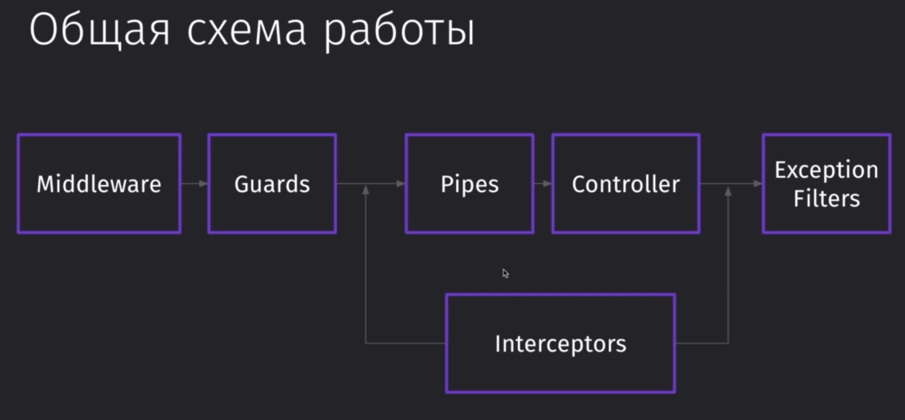
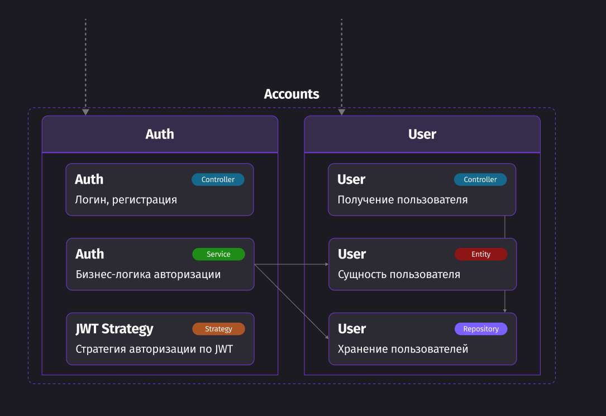
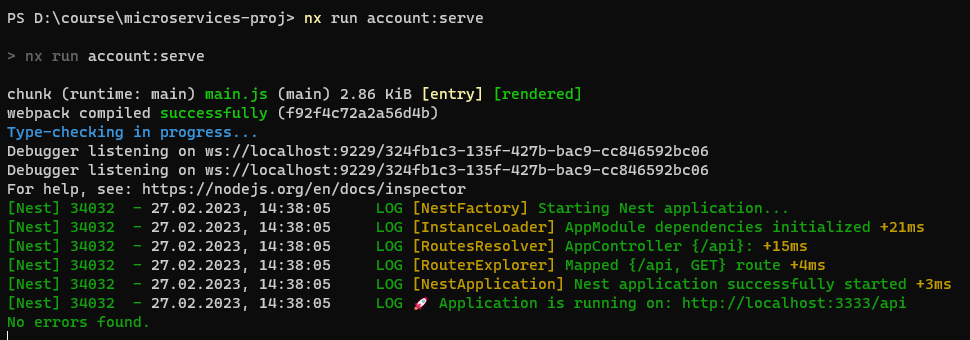
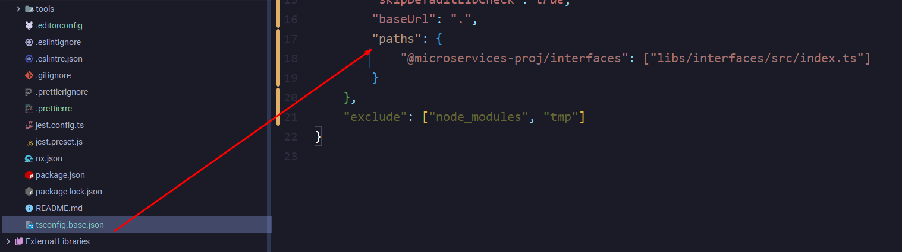
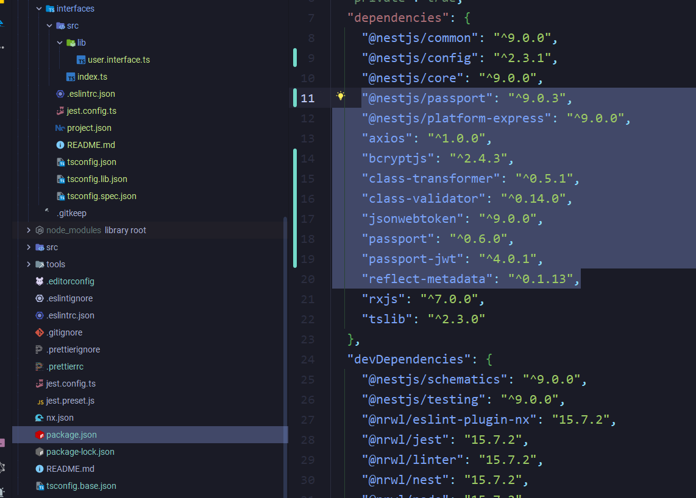

---
tags:
    - microservices
    - nextjs
    - rmq
    - nx
---

---

## Введение

### Когда нужны микросервисы?

Проблемы типичной монолитной системы:

- Добавление нового функционала со временем становится крайне тяжёлой задачей.
- Появляются малоиспользуемые модули
- Появляются несколько точек для выполнения одной и той же задачи (например, запись одних и тех же данных в БД)
  В реальных проектах заказчик присылает в качестве ТЗ не сразу весь проект, а только его часть. Поэтому и получается один большой клубок связей


Минусы монолита:

- сложный путь от commit до релиза
- медленная сборка приложения при разработке
- горизонтальное масштабирование требует ресурсов
- устаревший стек и повышение запутанности приложения

Что решают микросервисы:
Главная особенность заключается в том, что мы можем использовать разные стеки технологий для разных блоков сайта и мы можем спокойно переписать старый код, который представляет из себя небольшой блок логики

Микросервисы предоставляют:

- Быстрый путь от commit до релиза
- Быструю сборку приложения при разработке
- Горизонтальное масштабирование узких мест
- Возможности частичной смены / обновления стека
- Высокую отказоустойчивость
- Простую поддержку небольших сервисов
- Простую адаптацию к Agile

Микросервисная архитектура подразумевает под собой то, что мы разбиваем приложение на много различных сервисов, которые запускаются отдельно

Микросервисы подходят для:

- высоконагруженных приложений
- больших систем, которые требуют рефакторинг
- приложений, где нужно постоянно масштабировать часть функционала
- больших отделённых команд

---

## Нотация и описание архитектуры

### Вводное видео

Нотации для описания построения архитектуры программы:

1. ==Диаграмма классов==
    - Хорошо подходит для анализа существующего кода
    - Полезно при планировании небольших систем
2. ==c4model==
    - Хорошо отображает 3 и 4 уровень вложенности
    - Слабая стандартизация на третьем уровне

==C4model== подразумевает под собой подразделение диаграммы на 4 уровня абстракции:

- контекст
- контейнер
- компонент
- код


Общие требования к нотации кода:

- На верхнем уровне описывать отделимые части системы - ==Компоненты==
- Подходит для описания монолитов и микросервисов
- Связи описывают зависимости и поток вызовов, но сильно усложнены

### Разбор компонент

Структура диаграммы:

- Основные элементы представляют собой отдельные компоненты, которые и составляют собой систему
- Связи покажут нам, как эти компоненты взаимодействуют между друг другом
- Дополнительные элементы позволят уточнить детали в нашей схеме


Компонент - это отделимая сущность, которая является отдельной частью системы, которая внутри себя содержит всю нужную логику для её работы

Обычно, компоненты представляют из себя классы. Зачастую, это сервисы, контроллеры или репозитории или любая другая вещь с инкапсулированной логикой


Связь обозначает зависимость одного компонента от другого и вызов его (на изображении: контроллер пользователей вызывает сервис пользователей)

Двунаправленные стрелки могут быть, но они означают о циклической зависимости, что может приводить к определённым проблемам в архитектуре (это нарушает поток вызова компонентов)


Внешние связи говорят нам о том, что мы работаем с внешней базой данных, внешним АПИ или другими внешними элементами


Модуль - это замкнутая область, в которой хранится вся информация о компонентах и их взаимодействиях в пределах одной доменной области.

- Доменная область - это набор связанных понятий с одной бизнес-частью приложения.
- Между модулями должно быть минимальное количество связей и зависимостей, чтобы они оставались легкоотделимыми.


Приложение - это обёртка, которая инкапсулирует логику связанных между собой модулей

- Если в монолите этот элемент не так актуален, то в микросервисах это не так, так как нам требуется полное представление о всех сервисах в приложении и как они взаимодействуют.
- Стрелки связей между приложениями отмечаются пунктирной линией, так как запрос уже происходит извне (с помощью ==http==, ==rabbitmq== и так далее)


Передаваемый объект - это класс, который содержит данные и структуру того, какие данные должны быть (вызываем команду с какими-то данными и для этого создаём инстанс этой команды и передаём в неё данные).


Детализация - это специальный объект, который позволяет договориться о структуре передаваемых данных.

Например, мы можем:

- Указать список зависимостей библиотек приложения
- Указать структуру для занесения данных в базу данных
- Указать список команд, который принимает контроллер
- И так далее


### Использование Figma

Тут находится ссылка на [**макет с нужными компонентами**](https://www.figma.com/community/file/1076518826949849808/Software-Architecture-Components).

Правильный способ использования компонентов:

1. Все нужные элементы уже выделены в компоненты - их не нужно копировать
2. Во вкладке **Assets** показаны все имеющиеся компоненты
3. Из представленной вкладки просто перетаскиваем компонент, который может нам понадобиться


4. Так же нажав на `shift+I` можно вывести быстрый список компонентов


5. Так же компоненты могут иметь несколько стилей отображения, которые можно поменять через **properties** (конкретно в данном случае можно поменять стиль стрелки)


6. Чтобы погнуть стрелку, можно нажать на Ctrl+D и потянуть за один конец в нужную сторону


7. Если изменить свойства одного компонента, то они поменяются во всех


### Пример описания

Наше приложение имеет подобную структуру. Папку `app` мы не описываем, так как это фронт. Однако, если потребуется, то можно будет описать и его, но в представленном контексте мы будем только описывать получаемые с фронта запросы.


Так выглядит структура объектов в данных папках:

- Контроллер АПИ принимает в себя запросы с фронта, сервис `files` сохраняет сгенерированное изображение конвертером (второй модуль), а модуль управляет всеми процессами внури АПИ.
- Конвертер имеет свой контроллер, который получает запрос с АПИ на триггер сервиса по генерации изобаржений. Далее сгенерированное изобрежние возвращается обратно в АПИ, где сохраняется сервисом `files`.

 

И примерно так будет выглядеть структура приложения по заданным условиям:


---

## Переход к микросервисам

### Монолит VS Микросервисы

Монолит - это единое приложение, которое в себе инкапсулирует всю бизнес-логику, все зависимости, все связи с внешними системами и данное одно приложение разрабатывается всей командой и выкладывается в продакшн

Микросервис же - это наборы приложений, в рамках которых можно реализовать всю функциональность монолита, но разбитую на множество приложений, которые теми или иными образами связаны друг с другом


#### Монолит

Монолит представляет из себя одно приложение, с одной кодовой базой, которое работает по типу "Straight Forward" - все операции мы производим над одним проектом. Он прост с точки зрения восприятия и с точки зрения работы с ним.


Все плюсы монолита актуальны лишь на старте, когда приложение небольшое и не будет крайне сложным в разработке


Проблемы монолита:

- Со временем, когда приложение разрастается, появляется много проблем с тем, чтобы добавить в него новый функционал, так как приложение имеет огромное количество зависимостей.
- Приложение, построенное крайне давно и имеющее уже не поддерживаемый стек технологий, будет крайне сложно перевести на новый стек, потому как нужно будет соблюсти множество зависимостей и нюансов системы. Так же это экономически невыгодно.
- Так же нельзя выделить определённые ресурсы процессора под определённые модули. Например, для модуля пережатия изображений мы не можем выделить мало ОЗУ, но сильный процессор. Мы выделяем ресурсы под всё приложение сразу.
- Нужно очень много времени тратить на договорённости внутри команды, как переиспользовать отдельные кусочки кода


#### Микросервис

Микросервисная архитектура представляет собой большой набор отдельно работающих приложений, которые взаимосвязано работают друг с другом.


Микросервис позволяет нам:

- Быстро доводить отдельное приложение от первого коммита до релиза, так как мы можем быстро его собрать, протестировать и задеплоить
- Так же мы можем быстро обновить отдельное маленькое приложение, которое выполняет одну конкретную функцию, под новый стек или даже переписать его полностью


- Если упадёт одно определённое приложение, то не упадёт весь микросервис, так как он представляет из себя отдельные приложения (то есть пользователь может продолжать использовать приложение хотя бы частично)
- Очень просто поддерживать и обновлять те маленькие сервисы, что есть в проекте. Куда проще понять, как работает один сервис, чем понимать, как построена архитектура огромного монолита


Проблемы микросервисов:

- Если мы неправильно определили архитектуру микросервисного приложения и поделили неправильно сервисы, то стоимость, чтобы переделать всю систему сопоставима с переписыванием всей системы с нуля
- Чтобы выложить приложение, нужно понимать и работать с DevOps практиками: оркестрация, масштабирование, последовательная выкладка
- Наш код не вызывается другим кодом, как в монолите, и это создаёт другой подход к консистентности - нам нужно налаживать каналы связи внутри микросервиса (использовать тот же RabbitMQ).
- Мониторинг системы усложнён, так как между собой нужно связать огромное количество логов
- Мы должны жёстко задавать контракты на работу между сервисами, так как переписать их в дальнейшем будет очень сложно


В 90% случаев микросервисы - не нужны. Мы их выбираем только для того, чтобы можно было разрастать достаточно большой проект или проект, который станет достаточно большим. Так же можно изначально писать монолит, но в будущем разбить его на микросервисы.


### Вопросы масштабирования

Основная проблема разрастания монолита заключается в том, что предел роста ресурсов компьютера ограничен и мы не можем постоянно вставлять в него новые процессоры и ОЗУ - проще будет на ещё одном сервере поднять копию монолитного приложения и далее проводить балансировку нагрузки (с помощью того же NGINX) на сервера.


Так же мы можем производить балансировку по контенту, котрый запрашивает пользователь (если он перешёл на страницу генерации изображения, то переводить запрос на мощный сервер)


И теперь представим, что у нас микросервис. Тут уже мы не делаем копию всего приложения на каждом сервере - мы раскидываем отдельные функции по их степени нагрузки на отдельные сервера


А если нам нужно осилить возросшую нагрузку в 4 раза на определённый сервис, то мы можем просто натыкать 4 этих приложения на разные сервера, что не отъедает у нас столько же ресурсов, как работа с полноценным монолитом.

Так же можно настроить систему таким образом, что оно деплоило самостоятельно те сервисы, на которые возрастает сильно нагрузка (и всё в реальном времени!).

Микросервисы куда более производительны и просты в эксплуатации при работе с высокой нагрузкой на него.

Так же нужно упомянуть, что мы можем работать не с одной базой данных, а создать под определённые сервисы свои базы, чтобы ускорить работу с занесением информации.


### Декомпозиция функционала

Все представленные выше преимущества микросервисов будут работать только если мы правильно построили архитектуру и декомпозировали функционал по разным сервисам.


Все сервисы должны быть отделимы и максимально независимы друг от друга. Например, мы можем реализовать отдельный сервис по отправке уведомлений на почту.


- Сервисы должны быть максимально отделены друг от друга и выполнять определённый функционал. Если в монолите мы можем миновать какой-либо сервис и сразу отправить данные в базу, то в микросервисах мы должны обращаться к сервису по работе с базой.
- У нас не должно быть одного микросервиса, который управляет всеми остальными - все сервисы должны уметь жить отдельно.
- Все сервисы должны общаться между друг другом по средствам контрактов, что упростит общение между ними.


Взаимодействие с сервисом осуществляется через:

- Команды - это запрос с данными, который изменяет состояние сервиса (например, создать пост в блоге)
- Запрос так же отправляется в сервис, но не изменяет его состояние (получить 10 последних постов)

Все представленные способы позволяют получить ответ от сервиса в виде совершённого события

Все команды, запросы и события имеют определённые контракты, по которым они взаимодействуют


Делить сервис можно по определённым паттернам:

- По бизнес-задачам (например, программа может считать баланс)
- По доменной области (делится на продавцов и покупателей) - Domain-Driven Design
- По командам (по функционалу, который выполняет система)


Пример: мы имеем аналог Wildberries, в котором имеются пользователи и продавцы


Деление по бизнес-задачам:


Деление по доменным областям:


Так же не нужно перебарщивать с сервисами - выделять слишком много разных сервисов, которые относятся к одной доменной области не нужно. Это только осложнит работу с сервисом.


### Алгоритм декомпозиции

У нас есть всего 4 шага для декомпозиции задачи на реализацию микросервисного приложения.


**Первый шаг**. Выделение пользовательских потребностей от приложения


На этом этапе мы веделяем основные действия, которые клиент захочет сделать на нашем ресурсе. Таким образом, мы скомпонуем основной функционал приложения.

Здесь не описываются механики работы и устройства выполняемой операции - тут только конкретные действия, которые клиент может захотеть выполнить


Из всех сценариев мы можем выделить те моменты работы сервиса, которые мы должны реализовать.

Если преподавателю нужно загружать свои материалы, то нам нужно реализовать загрузчик. Если преподаватель хочет выкладывать материалы в блог, то нам нужно реализовать ленту новостей преподавателя.

Это и есть **второй шаг**, который представляет из себя представление нужной функциональности и взаимосвязей между ними.


Теперь приступаем к **третьему шагу**, в котором мы объединяем все сущности.

Первое, что мы должны понимать, что `каждая сущность - это одна доменная модель`.


И примерно так будут выглядеть наши доменные области по организации всего функционала из третьего шага


Третий шаг мы можем итерировать несколько раз и объединять сервисы, соединяя их в логические сервисы, что будет процессом **четвёртого шага**. На данном этапе мы имеем минимизированное количество сервисов приложения для реализации.

1. Разные профили были объеденены в единый домен - аккаунты. У них очень пересекаются возможности и методы.
2. В рамках данного проекта стоит оставить урок, курс и отзыв в одном доменном поле, так как отзывы тут оставляют только на курсы.
3. При подписке на блог будет отправляться сообщение в список рассылки, который уже будет следить за изменениями в блоге.


---

## Монорепозитории

### Монорепозиторий или нет

Монорепозиторий - это репозиторий сразу для нескольких проектов.
Зачастую, такой подход используется, когда у нас не более 12 микросервисов

Плюсы:

- Переиспользование уже написанного кода, так как все сервисы находятся в одном месте
- Удобная работа с контрактами
- Удобно можно настроить все пайплайны и зависимости сборки проекта (больше плюс для DevOps-инжинера)

Минусы:

- Огромные объёмы проекта, что тормозит работу IDE
- Централизует все зависимости, что при переходе на новую версию того же NextJS или другого модуля создаст проблемы с обновлением
- Ограничение используемых языков

Чтобы получить все преимущества микросервисов, пользоваться монорепозиторием нельзя, но если нужно быстро билдить приложение и проще им управляться, то можно хранить все сервисы в одном репозитории.

Однако монорепозитории хорошо использовать, когда у нас мало сервисов, они написаны на одном языке и у нас много различных контрактов, чтобы использовать их между микросервисами.


Самые популярные утилиты для работы с монорепозиториями:

- NX
- Lerna
- npm (выбираем по умолчанию, если проект не имеет сложной архитектуры и имеет один фронт)
- turborepo
- rush


`NX`:

- Очень легко с ним работать
- Очень удобные инструменты, которые позволяют локально запустить сразу несколько сервисов
- Имеет свой взгляд на работу с сервисами (имеет свои определённые модули для сборки определённых фреймворков и свои правила) - ==Webpack==
- Работает сугубо на базе ==TS==

`Lerna`:

- Позволяет работать с любым сборщиком, с которым мы хотим работать

`NX` не даст нам в монорепозитории использовать несколько разных версий того же `NextJS`. Если нам нужно поменяться на более новую версию, то тут уже нужно будет обновить весь проект. Другими словами, мы должны поддерживать единый скоуп зависимостей и поддерживать чистоту кода.


### Обзор NestJS

Компоненты, которые мы имеем в несте:

- `Modules` - это строительные блоки в приложении, которые агрегируют в себе определённую логику
- `Controllers` - это обработчики внешних событий
- `Providers` - это компонент, который обеспечивает доступ приложения к внешним источникам данных (БД)
- `Middleware` - это посредник, который внедряется в процесс запроса и обогащает функциональность
- `Exception filters`
- `Pipes`
- `Guards`
- `Interceptors`


Модули могут быть включены в другие модули

Модуль - это класс с декоратором модуля, который позволяет описать внутри этого декоратора все провайдеры, контроллеры, модули и другие зависимости, что он экспортирует


Все точки входа в приложение - это контроллеры, которые триггерят выполнение определённых операций

Так как контроллер - это входная точка в модуль, то его переиспользование в других модулях - невозможно

Декоратор `@Controller()` помечает класс как контроллер, а так же выполняет DI-функцию


Правильный подход к работе с БД заключается в описании работы с репозиторием через класс и подключение этого класса через декоратор в категорию провайдеров

Так же благодаря тому, что мы работаем с модулями, мы можем использовать репозитории и в других модулях просто экспортируя их

Декоратор `@Injectable()` обеспечит добавление класса в категорию провайдеров



Общая схема работы запроса выглядит подобным образом:

- `Middleware` - первый принимает в себя запрос и он может обрабатывать его, валидировать и так далее
- `Guards` - это ограничитель, который зачастую используется для авторизации всех запросов с клиента (проверка валидности JWT, делать проверку аутентификации и так далее). Так же в гуарде можно произвести проверку на наличие соответствующего доступа у пользователя. По сути они могут ограничивать те или иные роуты для пользователя
- `Interceptors` - внедряются до или после контроллеров, обрабатывая запросы
- `Pipes` - занимаются преобразованием запросов (например, может валидировать по декораторам то, что нам прислали)
- `Controller` - сама наша конечная точка, вокруг которой построена данная архитектура
- `Exception Filters` - обрабатывает все входящие ошибки из контроллера



Так же для реализации общения приложения с БД будет использоваться паттерн репозитория.

У неста имеется модуль `nestjs-mongoose`, который позволяет описать модели в виде классов с декораторами. Эту схему можно будет с помощью декоратора `@InjectModel` добавить в репозиторий и на выходе мы получим модель, с которой будет работать репозиторий

Паттерн же говорит нам, что для каждой такой модели должен быть свой репозиторий со своей входной точкой, с которой мы будем взаимодействовать. Мы не будем напрямую ходить в модель - мы будем ходить только в репозиторий этой модели


Паттерн `Entity` говорит нам, чтобы мы использовали для общения между контроллером и репозиторием не какой-то конкретный объект по интерфейсу, а отдельную сущность в виде класса. Эта сущность будет повторять модель репозитория и будет содержать в себе определённую бизнес-логику


И примерно так будет выглядеть наш микросервис по работе с аутентификацией:



### Код Настраиваем nx monorepo

Первым делом нужно установить сам nx и cli неста

```bash
npm i -g nx @nestjs/cli
```

Далее нужно создать проект с микросервисами. Ему сразу можно задать пресет той технологии, что мы будем использовать.

```bash
npx create-nx-workspace microservices-proj --preset=nest
```

И далее мы получаем структуру, где у нас в корне проекта находятся:

- все глобальные файлы стилей / базовый тсконфиг (от него экстендятся все остальные конфиги) / все тесты
- папка `apps`, которая хранит все микросервисы приложения
- папка `libs`, которая хранит переиспользуемые данные для приложения


Так же имеется плагин NX console, который позволит сразу запускать все команды из `nx.json`


И тут нужно сразу сказать, что при использовании nx'a мы не теряем возможность пользоваться CLI'ками других модулей (тем же нестовским cli) - всё это у нас остаётся


Так выглядит запуск сёрвинга проекта:



Всё, что мы можем переиспользовать должно находиться в библиотеках.

```bash
nx g @nx/nest:lib interfaces
```

`libs / interfaces / src / lib / user.interface.ts`

```TS
export interface IUser {
 name: string;
}
```

`libs / interfaces / src / index.ts`

```TS
export * from './lib/user.interface';
```

Так выглядит структура созданной библиотеки:


И теперь мы можем спокойно импортировать из библиотеки любой модуль в любой микросервис нашего приложения


Происходит это потому, что в нашем базовом тсконфиге добавляется автоматически строчка, которая создаёт алиасы для нашего пути



И далее нам нужно создать модули, сервисы и контроллеры для отдельных частей приложения аккаунтов:

```bash
nx g @nx/nest:module --name=user --directory=./apps/account/src/app
nx g @nx/nest:service --name=user --directory=./apps/account/src/app

nx g @nx/nest:module --name=auth --directory=./apps/account/src/app
nx g @nx/nest:controller --name=auth --directory=./apps/account/src/app
nx g @nx/nest:service --name=auth --directory=./apps/account/src/app
```


И установим зависимости для подключения аутентификации в проект и валидации:

```bash
npm i mongoose @nestjs/mongoose bcryptjs jsonwebtoken passport passport-jwt @nestjs/passport @nestjs/config class-transformer class-validator

npm i -D @types/bcryptjs
```

Все те зависимости, что мы указали выше - устанавливаются глобально для всего проекта



### Код Создаём модели

Для начала создадим папку с нашими `env` файлами `envs`. В ней нужно будет создать `envs/account.env`. Тут у нас будут храниться данные для подключения к базе.

Далее нам нужно написать конфиг для подключения к базе данных

`apps / account / src / app / configs / mongo.config.ts`

```TS
import { ConfigModule, ConfigService } from '@nestjs/config';
import { MongooseModuleAsyncOptions } from '@nestjs/mongoose';

/**
 * Конфигурация для асинхронного подключения монги к несту
 */
export const getMongoConfig = (): MongooseModuleAsyncOptions => {
    return {
       useFactory: (configService: ConfigService) => ({
          uri: getMongoString(configService),
       }),       inject: [ConfigService],
       imports: [ConfigModule],
    };
};

/** строка подключения к монге */
const getMongoString = (configService: ConfigService) =>
    'mongodb://' +
    configService.get('MONGO_LOGIN') +
    ':' +    configService.get('MONGO_PASSWORD') +
    '@' +    configService.get('MONGO_HOST') +
    ':' +    configService.get('MONGO_PORT') +
    '/' +    configService.get('MONGO_DATABASE') +
    '?authSource=' +    configService.get('MONGO_AUTHDATABASE');
```

Тут мы должны подключить наши модули и в частности `ConfigModule`, который должен прокидываться внутрь всех импортов (для доступа модулей к конфигу приложения) и `MongooseModule` для подключения монги

`apps / account / src / app / configs / mongo.config.ts`

```TS
import { Module } from '@nestjs/common';

import { AppController } from './app.controller';
import { AppService } from './app.service';
import { UserModule } from './user/user.module';
import { AuthModule } from './auth/auth.module';
import { ConfigModule } from '@nestjs/config';
import { MongooseModule } from '@nestjs/mongoose';
import { getMongoConfig } from './configs/mongo.config';

@Module({
	imports: [
       ConfigModule.forRoot({
          isGlobal: true,
          envFilePath: 'envs/account.env',
       }),
       MongooseModule.forRootAsync(getMongoConfig()),
       UserModule,
       AuthModule,
    ],
    controllers: [AppController],
    providers: [AppService],
})
export class AppModule {}
```

Интерфейсы пользователя, которые будут распространены по проекту благодаря их нахождению в папке `lib`

`lib / interfaces / src / lib / user.interface.ts`

```TS
export enum EUserRole {
    TEACHER = 'teacher',
    STUDENT = 'student',
}

export enum EPurchaseState {
    STARTED = 'started',
    WAITING_FOR_PAYMENT = 'waiting_for_payment',
    PURCHASED = 'purchased',
    CANCELED = 'canceled',
}

export interface IUser {
    _id?: string;
    displayName?: string;
    email: string;
    passwordHash: string;
    role: EUserRole;
    courses?: IUserCourses[];
}

export interface IUserCourses {
    courseId: string;
    purchaseState: EPurchaseState;
}
```

Тут находится класс, который представляет собой модель данных пользователя находящегося в базе монги

`apps / account / src / app / user / models / user.model.ts`

```TS
import { Document, Types } from 'mongoose';
import { Prop, Schema, SchemaFactory } from '@nestjs/mongoose';
import { IUser, IUserCourses, EPurchaseState, EUserRole } from '@/interfaces';

/**
 * Курс аккаунта * */
@Schema()
export class UserCourses extends Document implements IUserCourses {
    @Prop({ required: true })
    courseId: string;

    @Prop({ required: true, enum: EPurchaseState, type: String })
    purchaseState: EPurchaseState;
}

/**
 * Сгенерированная модель монгуза * */
export const UserCoursesSchema = SchemaFactory.createForClass(UserCourses);

/**
 * Модель аккаунта пользователя * */
@Schema()
export class User extends Document implements IUser {
    @Prop()
    displayName?: string;

    @Prop({ required: true })
    email: string;

    @Prop({ required: true })
    passwordHash: string;

    @Prop({
       /** требуется */
       required: true,
       /** тип данных */
       type: String,
       /** возможные значения */
       enum: EUserRole,
       /** дефолтное значение */
       default: EUserRole.STUDENT,
    })    role: EUserRole;

    @Prop({ type: [UserCoursesSchema], _id: false })
    courses: Types.Array<UserCourses>;
}

/**
 * Экспортируем схему монгуза * */export const UserSchema = SchemaFactory.createForClass(User);
```

Далее нужно создать сущность пользователя, которая сможет выполнять определённые действия над данными самого этого пользователя.

Сущность выполняет роль **хранилища основных операций над данными пользователя**

`apps / account / src / app / user / entities / user.entity.ts`

```TS
import { EUserRole, IUser, IUserCourses } from '@/interfaces';
import { compare, genSalt, hash } from 'bcryptjs';

/**
 * Класс сущности пользователя, который предоставляет методы манипуляции над аккаунтом * */
export class UserEntity implements IUser {
    _id?: string;
    displayName?: string;
    email: string;
    passwordHash: string;
    role: EUserRole;
    courses?: IUserCourses[];

    constructor({ _id, courses, displayName, role, email, passwordHash }: IUser) {
       this._id = _id;
       this.displayName = displayName;
       this.email = email;
       this.passwordHash = passwordHash;
       this.role = role;
       this.courses = courses;
    }

    public async setPassword(password: string) {
       const salt = await genSalt(10);
       this.passwordHash = await hash(password, salt);

       return this;
    }

    public validatePassword(password: string) {
       return compare(password, this.passwordHash);
    }
}
```

Далее нужно реализовать инжектируемый класс репозитория. Репозиторий работает чисто только с базой данных.

Так как это кастомная сущность, то впоследствии её нужно будет добавить в модуль пользователя.

`apps / account / src / app / user / repositories / user.repository.ts`

```TS
import { InjectModel } from '@nestjs/mongoose';
import { User } from '../models/user.model';
import { Model } from 'mongoose';
import { Injectable } from '@nestjs/common';
import { UserEntity } from '../entities/user.entity';

/**
 * Класс для работы с базой данных и манипуляции над пользователями *
 * */
@Injectable()
export class UserRepository {
    constructor(@InjectModel(User.name) private readonly userModel: Model<User>) {}

    async createUser(user: UserEntity) {
       const newUser = new this.userModel(user);
       return newUser.save();
    }

    async updateUser({ _id, ...rest }: UserEntity) {
       return (
          this.userModel
             .updateOne({ _id }, { $set: { ...rest } })
             /** exec нужен для формирования запроса - без него не всегда может вернуться результат из mongo */
             .exec()
       );
    }

    async findUser(email: string) {
       return this.userModel.findOne({ email }).exec();
    }

    async findUserById(id: string) {
       return this.userModel.findById(id).exec();
    }

    async deleteUser(email: string) {
       this.userModel.deleteOne({ email }).exec();
    }
}
```

И уже тут финально подключаем все сущности к модулю самого пользователя

`apps / account / src / app / user / user.module.ts`

```TS
import { Module } from '@nestjs/common';
import { UserService } from './user.service';
import { MongooseModule } from '@nestjs/mongoose';
import { User, UserSchema } from './models/user.model';
import { UserRepository } from './repositories/user.repository';

@Module({
    /**
     * Тут мы добавляем модели монги из папки models     * */    imports: [MongooseModule.forFeature([{ name: User.name, schema: UserSchema }])],
    providers: [UserService, UserRepository],
})
export class UserModule {}
```

### Код Реализуем авторизацию

Создаём контроллер авторизации. Пока он будет хранить две DTOшки и хэндлить два запроса на регистрацию и авторизацию. Регистрация будет заносить нового пользователя, а авторизация валидировать по пришедшим данным (сверять имеющиеся).

`apps / account / src / app / auth / auth.controller.ts`

```TS
import { Body, Controller, Post } from '@nestjs/common';
import { AuthService } from './auth.service';

export class RegisterDto {
	email: string;
	password: string;
	displayName?: string;
}

export class LoginDto {
	email: string;
	password: string;
}

@Controller('auth')
export class AuthController {
	constructor(
		private readonly authService: AuthService
	) {}

	@Post('register')
	async register(@Body() dto: RegisterDto) {
		return this.authService.register(dto);
	}

	@Post('login')
	async login(@Body() { email, password }: LoginDto) {
		const { id } = await this.authService.validateUser(email, password);
		return this.authService.login(id);
	}
}
```

Далее нам понадобится модуль репозитория пользователя, чтобы иметь доступ к созданию новых пользователей в сервисе авторизации. Чтобы это сделать, нужно добавить в `exports` модуль `UserRepository`.

`apps / account / src / app / user / user.module.ts`

```TS
import { Module } from '@nestjs/common';
import { MongooseModule } from '@nestjs/mongoose';
import { User, UserSchema } from './models/user.model';
import { UserRepository } from './repositories/user.repository';

@Module({
	imports: [MongooseModule.forFeature([
		{ name: User.name, schema: UserSchema }
	])],
	providers: [UserRepository],
	exports: [UserRepository]
})
export class UserModule {}
```

Сейчас нужно написать конфиг получения JWT, который передадим в модуль JWT авторизации

`apps / account / src / app / configs / jwt.config.ts`

```TS
import { ConfigModule, ConfigService } from '@nestjs/config';
import { JwtModuleAsyncOptions } from '@nestjs/jwt'

export const getJWTConfig = (): JwtModuleAsyncOptions => ({
	imports: [ConfigModule],
	inject: [ConfigService],
	useFactory: (configService: ConfigService) => ({
		secret: configService.get('JWT_SECRET')
	})
});
```

Далее подцепляем

- модуль JWT авторизации (и в него передаём `getJWTConfig`)
- пользователя в `imports` (так как используем эти модули в сервисе)
- контроллер и сервис авторизации

`apps / account / src / app / auth / auth.module.ts`

```TS
import { Module } from '@nestjs/common';
import { JwtModule } from '@nestjs/jwt';
import { getJWTConfig } from '../configs/jwt.config';
import { UserModule } from '../user/user.module';
import { AuthController } from './auth.controller';
import { AuthService } from './auth.service';

@Module({
	imports: [UserModule, JwtModule.registerAsync(getJWTConfig())],
	controllers: [AuthController],
	providers: [AuthService],
})
export class AuthModule {}

```

Теперь мы всё подготовили: JWT, прокинули репозиторий пользователя.

Сейчас нужно интегрировать логику авторизации, которую дёргаем в контроллере. Делаем это в сервисе. Заранее сюда мы прокинули `UserRepository` и `JwtService` в `AuthModule`.

Сервис будет создавать нового пользователя на этапе регистрации - `register`. И авторизовывать - `validateUser` + `login`.

`apps / account / src / app / auth / auth.service.ts`

```TS
import { Injectable } from '@nestjs/common';
import { JwtService } from '@nestjs/jwt';
import { UserRole } from '@purple/interfaces';
import { UserEntity } from '../user/entities/user.entity';
import { UserRepository } from '../user/repositories/user.repository';
import { RegisterDto } from './auth.controller';

@Injectable()
export class AuthService {
	constructor(
		private readonly userRepository: UserRepository,
		private readonly jwtService: JwtService
	) {}

	async register({ email, password, displayName }: RegisterDto) {
		const oldUser = await this.userRepository.findUser(email);

		if (oldUser) {
			throw new Error('Такой пользователь уже зарегистрирован');
		}

		const newUserEntity = await new UserEntity({
			displayName,
			email,
			passwordHash: '',
			role: UserRole.Student
		}).setPassword(password);

		const newUser = await this.userRepository.createUser(newUserEntity);

		return { email: newUser.email };
	}

	async validateUser(email: string, password: string) {
		const user = await this.userRepository.findUser(email);
		if (!user) {
			throw new Error('Неверный логин или пароль');
		}
		const userEntity = new UserEntity(user);
		const isCorrectPassword = await userEntity.validatePassword(password);
		if (!isCorrectPassword) {
			throw new Error('Неверный логин или пароль');
		}
		return { id: user._id };
	}

	async login(id: string) {
		return {
			access_token: await this.jwtService.signAsync({ id })
		}
	}
}
```

### Код Запускаем проект

Композ для поднятия монги:

```YAML
services:
  mongo:
    image: mongo:4.4.4
    container_name: mongo
    restart: always
    environment:
      - MONGO_INITDB_ROOT_USERNAME=admin
      - MONGO_INITDB_ROOT_PASSWORD=admin
    ports:
      - 27017:27017
    volumes:
      - ./mongo-data-4.4:/data/db
```

Поднимаем монгу и запускаем нужные сервисы:

```bash
docker compose up -d
nx serve account
```

---

## Обмен сообщениями

### Методы обмена

Типы обмена делятся на синхронные/асинхронные и по отношениям.

Синхронные процессы могут блокировать исполнение каких-либо дальнейших операций и замедлять работу сервиса.

Асинхронные методы обмена не стопорят работу сервиса, а просто продолжают работать и когда-нибудь ещё возвращают ответ на запрос либо принимают его и уже потом включают в работу.

Чтобы сделать сервисы максимально отвязанными друг от друга и постоянно работающими, мы должны использовать подписки на события, когда мы отправляем запрос в любой из инстансов одного сервиса или во многие сервисы, а уже затем получаем нужный нам результат в определённом будущем.
Однако если это событие с ожиданием, то мы можем заранее предполагать, что на наше прокинутое событие могут прийти ответы из разных источников с разной интерпретацией результата.

|             | 1 к 1                                           | 1 ко многим                                             |
| ----------- | ----------------------------------------------- | ------------------------------------------------------- |
| Синхронный  | Стандартный запрос / ответ                      |                                                         |
| Асинхронный | 1. Асинхронный запрос / ответ<br>2. Уведомление | 1. Подписка на событие<br>2. Событие с ожиданием ответа |


Так же у нас и есть разные форматы данных для разных случаев:

- Если у нас не высоконагруженный сервис и нам важна обратная совместимость, то мы используем просто текстовый формат, потому что его можно легко читать и добавление в запрос нового поля не поломает логику работы других сервисов
- Если у нас хайлод с огромным количеством передаваемой информации, то нам нужен движок, который будет кодировать и декодировать ответы. Например Protobuf от Google. Такой подход позволит быстрее обмениваться сообщениями за счёт их компактности.


Конракт - это договорённость, как должен выглядеть запрос и ответ определённого сервиса.


- HTTP (запрос/ответ) и gRPC (удалённый вызов процедур) - это группа синхронных запрос/ответов
- RabbitMQ - основан на протоколе AMQP и позволяет на огромных скоростях обмениваться сообщениями, хорошо сохраняет персистентность (если важные очереди упадут, то )
- Redis - ОЗУ БД, которая позволяет нам так же обмениваться сообщениями и работать с очередями. Но так как это БД, то он хоть и более быстрый, но паттернов поддерживает меньше, просто разбирает запросы и не заботится о персистентности данных
- Kafka - сохраняет максимум логов и информации для реплеев, восстановления очередей, их проекта. Самый надёжный и мощный сервис. Однако и самый медленный из представленных.

Можно использовать RabbitMQ + Kafka для разных целей и задач в одном проекте. Стандартное общение через кролика, а уже через кафку очень важные запросы, которые нужно уметь логировать, отсматривать и обязательно выполнять.


### Простая коммуникация

Пример простой коммуникации, где используется синхронный 1 к 1 запрос. Оба сервиса зависят друг от друга.


И обычно выглядит выполнение такого сервиса так:


#### Проблемы

1. Хрупкость

Отсутствует отказоустойчивость при падении одного из сервисов.

Если один из сервисов упал, то может упасть и всё остальное по каскаду, потому что ответа от зависимого сервиса нет.


2. Service Discovery

Мы точно должны понимать, на каком хосте и порту находится наш сервис. Каждый раз мы должны точно знать, куда должен полететь запрос.

3. Слабая доступность

Если у нас будет 10 сервисов с доступностью в 98%, то общая доступность будет в районе 80%

#### Решение проблем

1. На все запросы к определённому сервису у нас должен стоять таймаут по выполнению
2. При накоплении запросов, которые не обрабатываются вторым сервисом, нужно будет отрабатывать лимитером. Если запросы будут копиться бесконечно, то первый сервис будет расти по памяти до огромных размеров


3. Service Discovery

- Паттерн саморегистрации

Заносим сервис, при поднятии, в registry (аля DNS), который хранит в себе книгу с соотношением `домен - ip + port`, по которому можно будет достучаться до сервиса и получить нужные данные.

Для реализации можно воспользоваться: [Apache ZooKeeper](https://zookeeper.apache.org/), [Consul](https://www.consul.io/) (регистрирует сервисы, проводит healthcheck)


- Авторегистрация

Авторегистрация уже присуща ближе к Docker Swarm / Kubernetes. При поднятии сервиса, он получает виртуальный ip и к нему другие сервисы могут обращаться по имени, который был указан в конфиге оркестратора.

Инструменты уже сами с помощью своего Discovery сохраняют нужную информацию по соотношениям имён. При отправке запроса, он идёт на внутренний Router, который перенаправляет запрос в нужное место.


#### Когда использовать?

Используем синхронный метод обмена, когда:

- Небольшой набор сервисов со слабой связанностью
- Есть готовый Service Discovery
- Хочется использовать преимущества документации HTTP (Swagger)

### Коммуникация через брокера

Брокер - это посрденик выполнения задач.

Единственное, что знает определённый сервис это то, что ему нужно отправить в брокер задачу и он вернёт ему результат. Брокер сам разберётся куда нужно кинуть эту задачу и когда её вернуть.

Никакой прямой коммуникации между сервисами Нет.

Такой подход позволяет реализовать все 4 паттерна асинхронного обмена данными.


#### Асинхронный запрос/ответ

Подразумевают под собой не мгновенное получение ответа, а за какое-то разумное время, но не сею секунду.

Зачастую запрос представляет из себя:

- Header - метаданные, по которым определяем запрос / ответ
    - correlationId - идентификатор запроса, по которому отправим ответ и сопоставим задачи
    - replyChannel - канал, куда нужно ответить
    - другие параметры - куда отправить, одному или нескольким сервисам и так далее
- Body - данные запроса

Сам брокер зачастую делится на два канала: request (запрос) и reply (ответ) channel.


#### Уведомление

Уведомление - это запрос в одну сторону, когда мы просто сообщаем другому сервису, что произошла определённая операция.


#### Подписка на события

В отличе от уведомления, подписка распространяется сразу на несколько сервисов. В таком случае что-то сделают оба сервиса, а не один.

Например, у нас появился новый курс и сервис сообщает остальным, что нужно выделить место под оплату это курса и уведомить учащихся о появлении нового курса.


#### Событие с ожиданием ответа

Событие с ожиданием ответа уже включает подписку на событие и подразумевает ответ на это событие.


#### Что даёт использование брокеров?

- Слабую связанность сервисов
    - сервисы могут быть на разных языках и выполнять разные задачи, но самое главное - они не зависят друг от друга
- Буферизацию сообщений
    - сообщение летит не напрямую, а через посредника
- Разные паттерны коммуникаций
    - можно использовать не просто запрос из одного места в другое, а более гибко работать со всеми своими сервисами в сети
- Персистентность.
    - брокер будет держать у себя запрос до тех пор, пока конечный сервис не поднимется и не разберёт его
    - ну и так же сам брокер может восстановить историю запросов и продолжить работу

#### Проблемы брокеров

- Работа с несколькими инстансами сервиса. Нужно заранее определить для брокера, как он будет балансировать нагрузку и запросы на оба из этих сервисов, чтобы не дублировать запросы или не перенагружить один из сервисов.
- Повторные сообщения при падениях. Брокеры доставляют сообщения хотя бы один раз. Не всегда брокеры при падении успевают записать, что это сообщенние они уже отправили, поэтому могут два или более раз отправить один и тот же запрос.
- Отправка сообщения в транзакции. Если вместе с сообщением идёт запись в БД, то может появиться такая проблема, что данные могут быть неконсистентными, потому что запись будет, а сообщение доставлено не будет.

#### Решение проблем

1. Несколько инстансов

Множество брокеров имеет встроенный балансировщик, который работает с несколькими одинаковыми сервисами. Например, в RMQ мы можем каналу задать Round Robin балансировку, которая будет раскидывать запросы поровну между сервисами.


2. Повторные сообщения

Мы решаем эту проблему двумя способами:

- сам брокер просматривает acknowledge и notacknowledge статусы запросов и в первом случае удаляет этот запрос из очереди
- делать проверки в самом сервисе и чекать на исполнение уже этой операции (изменение статуса прилетело во второй раз и отбраковать его, если статус пришёл ровно такой же)


3. Отправка сообщения в транзакции

Когда нам нужно совершить запрос и записать что-то в БД, мы записываем данные транзакции сразу в Data и в Outbox. Outbox - это вспомогательная таблица, которая хранит список отправленных сообщений и их статус (отправлен / не отправлен).

Например, мы записываем статус платежа и записываем сразу данные в таблицы БД. Записываем данные по платежу и в табличку Outbox вносим состояние запроса: совершён / не совершён. Далее по этому Outbox сверяется наш брокер и отправляет сообщение.

> [!info] Этот паттерн нужен в крайних случаях, когда операция очень важна для исполнения и не повсеместно применяется


### Минимизация синхронности

Когда мы работаем с микросервисами, нашей основной задачей является маиксмальная асинхронность всех операций. То есть мы должны максимально избавляться от последовательных задач.

Представим ситуацию, когда пользователь хочет купить курс:

- API дёргает сначала проверяет не куплен ли у нас курс
- Потом получает цену курса
- А уже в конце получает ID платежа, который нужно исполнить.

Если какой-то из сервисов упал, то мы сразу вернём код ошибки и не будем дожидаться никаких перезапусков. Мы упадём в таймаут или сразу вернём ошибку. Можем попросить пользователя тыкнуть заново через 5 минут :)


Чтобы решить проблему, мы должны асинхронно запросить все данные и сразу отдать клиенту ID покупки, чтобы он не ждал выполнения всех операций. Уже затем мы вернём на фронт все нужные статусы и данные платежа по ID, который мы вернули ранее. То есть фронт или API сами будут спрашивать статус операции в процессе исполнения.

Так как операция не синхронная, то не будет ничего страшного, если один из сервисов упадёт - мы дождёмся, пока он не переподнимется и не вернёт нужные нам данные.

В этом случае, клиент имеет хоть какой-то промежуточный результат и уже потом получает то, за чем пришёл.


### Доработка схемы взаимодействия

Что нам нужно дополнить:

- После регистрации пользователя, ему отправляется приветственное письмо на почту
- Пользователь может загрузить своё изображение профиля при обновлении информации

Опишем запросы, которые летят к нам в Auth: команда логина и регистрации. В аккаунт к нам летит смена профиля и регистрация.

В сервис Email нам прилетает ивент регистрации, который будет триггерить отправку сообщения на почту клиента. Сам он состоит из модуля Email, который отправляет сообщения и сохраняет списки шаблонов в БД и модулем интеграции, который подключается к сторонним сервисам рассылок. Модуль интеграции дёргается модулем Email. Так же Модуль Email сохраняет данные в БД.

Сервис Files будет реализовывать команды загрузки видео и изображений. Это наш основной сервис, который хранит все медиаданные проекта. Он очень похож с Email. В качестве внешней интеграции меняется только то, что у нас появляется Bucket модуль, который принимает в себя наши изображения, которые раскидываются по CDN для быстрой загрузки из любой точки мира. Так же сервис Generate будет генерировать из загруженного изображения его уменьшенные версии, чтобы быстрее их загружать.

Сервис Payments в себя принимает команду на генерацию ссылки оплаты.

Сервис Courses принимает в себя запрос на получение курсов.


---

## RabbitMQ

### Устанавливаем RabbitMQ

Поднимаем композ с нужным образом

`docker-compose.yml`

```YML
---
services:
  rmq:
    image: rabbitmq:4-management
    restart: always
    ports:
      - 15672:15672  # админка
      - 5672:5672  # отправка сообщений
```

И, без заданных переменными пароля и логина, вводим для авторизации везде `guest`

### Устройство RabbitMQ

Наши микросервисы в схеме работы RMQ будут делиться на:

- Publisher - публикует сообщения (отправитель)
- Subscriber - тот, кто подписывается на получение сообщений (получатель). Он достаёт сообщения из очереди.
- Queue - очередь (почтовый ящик). Сюда перенаправляются сообщения.
- Exchange - обменный ящик (почтовое отделение). Решает, как доставить сообщение адресату и получает все сообщения.

- Routing Key - маршрут передачи сообщения. Это ключ, который указывает, куда отправить сообщение
- Binding - связь очереди с маршрутом. Помогает Exchange понимать, по какому Routing Key в какоую Queue нужно отправлять сообщение.
- Channel - канал передачи/приёма сообщения.
- Connection - соединение клиента RMQ


Тут у нас отображены все connections к нашему RMQ из всех сервисов.

Мы можем развернуть несколько инстансов RMQ и объединить их в кластер, чтобы поднять отказоустойчивость.


Все каналы для передачи сообщений


Тут отображены дефолтные очереди


Отображение, создание и управление очередьми


Создаём директовый Exchange с произвольным именем, который будет определять тип нашего сообщения.


Далее создаём очередь, которая будет классического типа (quorum - это более персистентная, а stream - поток), durable (сохраняется после падения) и не auto delete (не будет удаляться при отключении всех пользователей).


Теперь нам нужно подключить Exchange к созданной череди через биндинг. По ключу my-key, exchange будет класть сообщения в очередь my-queue


В самой очереди тоже появилась связь с передатчиком


- Headers - это доп информация, которая нужна для очередей, использующих эти данные
- Properties - свойства сообщений (идентификатор приложения, путь ответа)
- Payload - сами данные сообщения


Из Exchange мы можем передать сообщение по ключу роутинга в нашу очередь. Передать можно в любом виде


Передача сразу отобразится на графике


И теперь в самой очереди у нас появляется статистика о:

- Ready - сообщение пришло, но никем не разобрано. Если число стабильное, то что-то зависло.
- Unacked - необработанные сообщения
- Total - всего сообщений


Так как у нас нет потребителей, привязанных к очереди, то мы можем только сами получить сообщение из поля Get messages. Там мы можем указать, что делать дальше с этим сообщением.

- Ack mode - выбираем, что будет дальше при получении этих сообщений (накаем - возвращаем в очередь, акаем - убираем сообщение)
- Encoding - дефолтное преобразование
- Messages - количество сообщений


График очереди так эе отображает:

- количество текущих запросов, которые висят
- rate limit очереди


Свойства сообщения:

- Контент
    - `content_type` - тип контента (json, binary)
    - `content_encoding` - кодировка контента, чтобы правильно декодировать
    - `type` - тип контента (binary or not)
- Приоритизация
    - `priority` - приоритетность сообщения (чем выше, тем быстрее разбирают эти сообщения)
    - `expiration` - истечение запроса за определённое время
- Временная метка
    - `timestamp` - временной штамп
- Доставка сообщений
    - `correlation_id` - идентификатор сообщения, которое помогает понять сервису, что он получил ответ на определённое сообщение (связывает этот запрос с этим ответом)
    - `reply_to` - ожидает сообщение в определённой очереди
    - `message_id` - идентификатор конкретного сообщения, который понадобится для соотнесения `correlation_id`
- Адресат
    - `user_id` - от какого пользователя отправлено сообщение
    - `app_id` - идентификатор приложения (в логах можно сослаться на конкретное приложение)
    - `cluster_id` - идентификатор кластера RMQ

Свойства очереди:

- Durable - после перезагрузки очередь сохранится
- Exclusive - очередь может использоваться только в одном подключении и удалится после окончания
- Auto-delete - удаляется после потери последнего потребителя. Важно использовать эту опцию, чтобы не мусорить в RMQ и когда мы сами умеем создавать очереди
- Arguments - дополнительные аргументы (приоритеты, длина и прочее)

#### Реализация общения

Publisher кладёт в Exchange сообщение (с ключём роутинга, настройками (+ обязательным correlation_id) и пейлодом), которое через binding на определённый route кладётся в Queue, а оттуда разбирается подписчиком. Уже сам подписчик отправляет в ReplyQueue ответ с correlation_id (из запроса). Очередь ответов имеют эксклюзивный статус, чтобы к ней никто другой не мог подключиться - она существует конкретно для ответов этому паблишеру.

Этот паттерн с Exchange является более правильным, так как у нас есть возможность подключить ещё один МС, который сможет получать по определённому ключу значения. Этого нельзя будет сделать без подписок через Exchange.


Чтобы реализовать уведомление, нам сейчас нужно просто класть в Exchange наше сообщение с ключом, которое закинет в нужные очереди сообщение, откуда подписчики их заберут.


### Типы exchange

#### Direct

Это тип, который соотносит routing_key с наименованием биндинга и отправляет запросы только туда


#### Topic

Отправляет запрос по RegExp и ищет соответствия биндингов к ключу роутера

> [!important] Естественно, тут нужно определиться с конвенцией, по которой будут даваться имена

Например, можно давать имена по типу: `[domain].[action].[type]`. И выделить для себя из доменов МСы, из экшенов `[set, put, delete]`, а для type `[event, command]`

> [!example] courses.set.command

Это более предпочтительный вариант, чем Direct, потому что Topic ведёт себя ровно так же, но добавляет дополнительную логику задания сообщений


#### Fanout

Отправляет сообщение всем прибинженным очередям вне зависимости от того, что они хотят получать

Используется для массовой рассылки уведомлений по всем подписчикам вне зависимости от того, что они планируют получать


#### Headers

Он уже не смотрит на routing_key, а ориентируется на headers, который есть в сообщении. По этим заголовкам сообщение отправляется во все подписанные очереди, которые имеют такой же заголовок.

> Такой подход важен для сложных систем, где нужно сверять не только доменную область и тип сообщения, но и множество других параметров.


#### Default

Отправляет почти напрямую запрос в указанную в routing_key очередь


#### Dead Letter

Это очередь, которая собирает все мёртвые сообщения.

К этой очереди могут подключиться и попробовать разобрать оттуда неправильно отправленные или разобранные сообщения


#### Остальные

Trace - это трейсинг запросов. В этой очереди мы можем делать себе копии сообщений, которые были отправлены в процессе жизни другой очереди.


Match - это то же самое, что и Headers

Durability - это сохранение запросов после падения
Internal - это невозможность отправлять запросы напрямую от клиента, а только возможность биндингов с Exchange на Exchange


### Администрирование RabbitMQ

Queued Messages. Если он постоянно заполнен, то какие-то потребители не могут разобрать сообщения.

Обычно все метрики из RMQ выносят в Prometheus / Grafana

Nodes. Тут отображаются все инстансы RMQ в кластере.

- socket descriptors - количество занятых подключений к сокетам


Так же мы можем попасть в такую ситуацию, что нам нужно будет переместить RMQ на другой сервер.

Самый идеальный вариант - код сам создаёт нужные Queue и Exchange, с которыми он будет работать. Либо можно дёрнуть API нашего менеджмент-плагина и создать нужные очереди через код.

Но в крайнем случае мы можем сами забэкапить все нужные реквизиты, которые у нас уже есть и развернуть их в другом месте.


Иногда под каждый отдельный микросервис создают отдельного пользователя, чтобы из него выполнялись все операции.


Так же мы можем разделить группы микросервисов по виртуальным хостам, чтобы отделить их выполнение


Указание лимитов по группам


Изменение имени кластера


Так же мы можем получить доступ к [HTTP API](http://localhost:15672/api/index.html) нашего иснтанса RMQ и выполнять все операции менеджерской панели прямо из нашей конфигурации.

Обычно для этого выделяют отдельный сервис, который выполняет всю настройку по конфигурации, а всем остальным сервисам отключают возможность создавать очереди и посредников.


### Код - Простой обмен сообщении

За работу с RMQ в ноде отвечает библиотека amqplib.

Описываем работу первого сервиса - паблишера. Он должен:

1. Коннектиться к RMQ
2. Добавлять exchange для отправки запросов
3. Создавать канал ответа. Канал должен быть `exclusive`, чтобы к нему не могли подключиться левые сервисы и чтобы очередь была удалена при отпадании сервиса. Эта очередь должна быть уникальной и использоваться только этим сервисом.
4. Публиковать данные в канал через `publish`

`publisher.ts`

```TS
import { connect } from 'amqplib';

const run = async () => {
	try {
		// подключаемся к RMQ
		const connection = await connect('amqp://localhost');
		// создаём канал, через который будем коммуницировать
		const channel = await connection.createChannel();
		// добавляем exchange с именем test и по типу topic
		await channel.assertExchange(
			'test', // имя
			'topic', // тип
			{ durable: true } // персистентная
		);
		// создаём replyQueue (канал ответов)
		const replyQueue = await channel.assertQueue(
			// без имени, так как овтет летит по replyTo
			// и correlationId
			'',
			// удаляется с отключением МС
			// и не имеет сторонних подключений
			{ exclusive: true }
		);
		// отрабатываем потребление ответа из очереди ответов
		channel.consume(replyQueue.queue, (message) => {
			console.log(message?.content.toString());
			console.log(message?.properties.correlationId);
		})
		// отправляем в канал команду test с телом в виде буффера и хедером, в котором указаны путь ответа и correlationId
		channel.publish(
			'test', // имя exchange
			'my.command', // имя queue
			Buffer.from('Работает!'), // тело
			// параметры
			{
				// указываем, на какую очередь нужно отсылать ответ
				replyTo: replyQueue.queue,
				// уникализируем сообщение
				correlationId: '1'
			}
		);
	} catch (e) {
		console.error(e);
	}
};

run();
```

И описываем работу второго сервиса - подписчика. Он должен:

1. Так же коннектиться
2. Создавать очередь
3. Создавать Exchange
4. А так же подвязываться под нужную очередь
5. Брать из подвязанной очереди запросы `consume` и отвечать через `sendToQueue`

`subscriber.ts`

```TS
import { connect } from 'amqplib';

const run = async () => {
	try {
		// коннект к RMQ
		const connection = await connect('amqp://localhost');
		// создание канала
		const channel = await connection.createChannel();
		// добавление exchange
		await channel.assertExchange(
			'test',
			'topic',
			{ durable: true }
		);
		// добавление очереди
		const queue = await channel.assertQueue(
			'my-cool-queue',
			{ durable: true }
		);
		// привязка к очереди
		channel.bindQueue(queue.queue, 'test', 'my.command');
		// потребление очереди
		channel.consume(queue.queue, (message) => {
			if (!message) {
				return;
			}
			console.log(message.content.toString());
			if (message.properties.replyTo) {
				console.log(message.properties.replyTo);
				// отправка ответа на запрос тут мы напрямую указываем очередь, в которую полетит ответ, потому что нам не нужно чтобы exchange разруливал этот ответ
				channel.sendToQueue(
					message.properties.replyTo,
					Buffer.from('Ответ'),
					{
						// указываем в ответе correlationId сервиса, который отправил нам это сообщение
						correlationId:
							message.properties.correlationId
					}
				)
			}
		}, {
			// если true, то мы не будем автоматически признавать запрос
			noAck: true
		})
	} catch (e) {
		console.error(e);
	}
};

run();
```

> [!done] Теперь у нас реализован классический паттерн запрос/ответ RMQ

Мы использовали параметр `noAck`, чтобы сразу определять сообщения, как acknowledged или нет. Однако чтобы определить сообщение как опознанное, мы можем триггернуть команду `ack` канала и передать в него наше сообщение

`subscriber.ts`

```TS
channel.consume(queue.queue, (message) => {
	channel.ack(message)
	...
```

Сабскрайбер при поднятии паблишера получает сообщение


И теперь на графиках можно увидеть запрос / ответ между сервисами. Запрос будет висеть в ready, потому что мы не отработали запрос и не перевели его в acknowledge


Появился обменник test с нужным биндингом на очередь


И была сгенерирована сама очередь


---

## Реализация взаимодействия

#nestjs #rmq

### Код Разбор nestjsrmq

Для подключения к RMQ будет использоваться [nestjs-rmq](https://github.com/AlariCode/nestjs-rmq) - сторонняя либа, так как нестовая работает напрямую с очередями и без топиков.

Рассмотрим библиотеку:

1. Основной метод `init`

```TS
import { Inject, Injectable, LoggerService, OnModuleInit } from '@nestjs/common';
import {
	CONNECT_EVENT,
	CONNECTED_MESSAGE,
	DEFAULT_PREFETCH_COUNT,
	DEFAULT_RECONNECT_TIME,
	DEFAULT_TIMEOUT,
	DISCONNECT_EVENT,
	DISCONNECT_MESSAGE,
	ERROR_NO_ROUTE,
	ERROR_NONE_RPC,
	ERROR_TIMEOUT,
	ERROR_TYPE,
	REPLY_QUEUE,
	DEFAULT_HEARTBEAT_TIME,
	RMQ_MODULE_OPTIONS,
	INITIALIZATION_STEP_DELAY,
	ERROR_NO_QUEUE,
	RMQ_PROTOCOL,
	CONNECT_FAILED_MESSAGE,
	WRONG_CREDENTIALS_MESSAGE,
	CONNECT_FAILED,
} from './constants';
import { EventEmitter } from 'events';

// Дефолтная библиотека для работы с RMQ
import { Channel, Message } from 'amqplib';

// Библиотека, которая помогает автоматически реконнектиться, проверять на healthcheck
import * as amqp from 'amqp-connection-manager';

// tslint:disable-next-line:no-duplicate-imports
import { AmqpConnectionManager, ChannelWrapper } from 'amqp-connection-manager';
import { IRMQConnection, IRMQServiceOptions } from './interfaces/rmq-options.interface';
import { requestEmitter, responseEmitter, ResponseEmitterResult } from './emmiters/router.emmiter';
import { IPublishOptions } from './interfaces/rmq-publish-options.interface';
import { RMQError } from './classes/rmq-error.class';
import { RQMColorLogger } from './helpers/logger';
import { validateOptions } from './option.validator';
import { RMQMetadataAccessor } from './rmq-metadata.accessor';
import { RmqErrorService } from './rmq-error.service';
import { getUniqId } from './utils/get-uniq-id';
import { IRMQService } from './interfaces/rmq-service.interface';

@Injectable()
export class RMQService implements OnModuleInit, IRMQService {
	private server: AmqpConnectionManager = null;
	private clientChannel: ChannelWrapper = null;
	private subscriptionChannel: ChannelWrapper = null;
	private options: IRMQServiceOptions;
	private sendResponseEmitter: EventEmitter = new EventEmitter();
	private replyQueue: string = REPLY_QUEUE;
	private routes: string[];
	private logger: LoggerService;

	private isConnected = false;
	private isInitialized = false;

	constructor(
		@Inject(RMQ_MODULE_OPTIONS) options: IRMQServiceOptions,
		private readonly metadataAccessor: RMQMetadataAccessor,
		private readonly errorService: RmqErrorService
	) {
		this.options = options;
		this.logger = options.logger ? options.logger : new RQMColorLogger(this.options.logMessages);
		validateOptions(this.options, this.logger);
	}

	async onModuleInit() {
		await this.init();
		this.isInitialized = true;
	}

	public async init(): Promise<void> {
		return new Promise(async (resolve, reject) => {
			// генерация строк ссылок на опции, которые были переданы
			const connectionURLs: string[] =
				this.options.connections.map(
					(connection: IRMQConnection) => {
						return this.createConnectionUri(connection);
				});
			// передаём опции для подключения
			const AMQPConnectionOptions: amqp.AmqpConnectionManagerOptions
				= {
				reconnectTimeInSeconds:
					this.options.reconnectTimeInSeconds ?? DEFAULT_RECONNECT_TIME,
				heartbeatIntervalInSeconds:
					this.options.heartbeatIntervalInSeconds ?? DEFAULT_HEARTBEAT_TIME,
				connectionOptions:
					this.options.connectionOptions ?? {},
			};

			// коннектимся к серверу RMQ
			this.server =
				amqp.connect(connectionURLs, AMQPConnectionOptions);

			// отработка ивента на при подключении
			this.server.on(CONNECT_EVENT, (connection) => {
				this.isConnected = true;
				this.attachEmitters();
			});

			// отработка ивентов при отключении
			this.server.on(DISCONNECT_EVENT, (err) => {
				this.isConnected = false;
				this.detachEmitters();
				this.logger.error(DISCONNECT_MESSAGE);
				this.logger.error(err.err);
			});

			// ивенты при ошибке подключения
			this.server.on(CONNECT_FAILED, (err) => {
				this.logger.error(CONNECT_FAILED_MESSAGE);
				this.logger.error(err.err);
				if (
					err.err.message.includes('ACCESS-REFUSED')
					|| err.err.message.includes('403')
					) {
					this.logger.error(WRONG_CREDENTIALS_MESSAGE);
					reject(err);
				}
			});

			/**
			 * тут мы создаём два канала подключения к RMQ
			 * один client канал для отправки сообщений,
			 * а второй subscription для прослушивания ответов
			 */
			await Promise.all(
				[
					this.createClientChannel(),
					this.createSubscriptionChannel()
				]
			);

			resolve();
		});
	}

	// прочитали сообщение
	public ack(...params: Parameters<Channel['ack']>): ReturnType<Channel['ack']> {
		return this.subscriptionChannel.ack(...params);
	}

	// не прочитали
	public nack(...params: Parameters<Channel['nack']>): ReturnType<Channel['nack']> {
		return this.subscriptionChannel.nack(...params);
	}

	/**
	 * Отправка сообщений
	 * Основана отправка на event-emitt'ерах
	 *
	 */
	public async send<IMessage, IReply>(topic: string, message: IMessage, options?: IPublishOptions): Promise<IReply> {
		return new Promise<IReply>(async (resolve, reject) => {
			await this.initializationCheck();
			// генерируем correlation
			const correlationId = getUniqId();
			// таймаут запроса
			const timeout = options?.timeout
				?? this.options.messagesTimeout
				?? DEFAULT_TIMEOUT;

			// таймер, который выдаст ошибку при таймауте
			const timerId =
				setTimeout(() => {
					reject(
						new RMQError(
							`${ERROR_TIMEOUT}:
							${timeout} while sending to
							${topic}`,
							ERROR_TYPE.TRANSPORT
						)
					);
				}, timeout);
			// тут уже триггерим эмиттер, который сработает на отправку сообщения
			this.sendResponseEmitter.once(
				correlationId,
				(msg: Message) => {
					clearTimeout(timerId);
					if (msg.properties?.headers?.['-x-error']) {
						reject(this.errorService.errorHandler(msg));
					}
					const { content } = msg;
					if (content.toString()) {
						this.logger.debug(
							content,
							`Received ▼,${topic}`
						);
						resolve(JSON.parse(content.toString()));
					} else {
						reject(
							new RMQError(
								ERROR_NONE_RPC, ERROR_TYPE.TRANSPORT
							)
						);
					}
				}
			);

			await this.clientChannel.publish(
				this.options.exchangeName,
				topic,
				Buffer.from(JSON.stringify(message)),
				{
					replyTo: this.replyQueue,
					appId: this.options.serviceName,
					timestamp: new Date().getTime(),
					correlationId,
					...options,
				}
			);
			this.logger.debug(message, `Sent ▲,${topic}`);
		});
	}

	public async notify<IMessage>(topic: string, message: IMessage, options?: IPublishOptions): Promise<void> {
		await this.initializationCheck();
		await this.clientChannel.publish(this.options.exchangeName, topic, Buffer.from(JSON.stringify(message)), {
			appId: this.options.serviceName,
			timestamp: new Date().getTime(),
			...options,
		});
		this.logger.debug(message, `Notify ▲,${topic}`);
	}

	public healthCheck() {
		return this.isConnected;
	}

	public async disconnect() {
		this.detachEmitters();
		this.sendResponseEmitter.removeAllListeners();
		await this.clientChannel.close();
		await this.subscriptionChannel.close();
		await this.server.close();
	}

	private createConnectionUri(connection: IRMQConnection): string {
		let uri = `${connection.protocol ?? RMQ_PROTOCOL.AMQP}://${connection.login}:${connection.password}@${
			connection.host
		}`;
		if (connection.port) {
			uri += `:${connection.port}`;
		}
		if (connection.vhost) {
			uri += `/${connection.vhost}`;
		}
		return uri;
	}

	/**
	 * Создание канала для принятия сообщений
	 *
	 */
	private async createSubscriptionChannel() {
		return new Promise<void>((resolve) => {
			this.subscriptionChannel = this.server.createChannel({
				json: false,
				setup: async (channel: Channel) => {
					// вставляем exchange
					await channel.assertExchange(
						this.options.exchangeName,
						this.options.assertExchangeType ? this.options.assertExchangeType : 'topic',
						{
							durable: this.options.isExchangeDurable ?? true,
							...this.options.exchangeOptions,
						}
					);

					// префетчим возможное количество подключений
					// это важно сделать, чтобы проверить, забьётся ли наш канал от большого количества подключений
					// в хайлоде стоит указывать максмальное количество подключений
					await channel.prefetch(
						this.options.prefetchCount ?? DEFAULT_PREFETCH_COUNT,
						this.options.isGlobalPrefetchCount ?? false
					);

					// проверяем прослушку конкретной очереди
					// в микросервисах мы обычно не слушаем что-то конкретное
					if (typeof this.options.queueName === 'string') {
						this.listen(channel);
					}

					this.logConnected();

					resolve();
				},
			});
		});
	}

	/**
	 * Создание канала для отправки сообщений
	 * Тут сразу принимаются и ответы на сообщения
	 */
	private async createClientChannel() {
		return new Promise<void>((resolve) => {
			this.clientChannel = this.server.createChannel({
				json: false,
				setup: async (channel: Channel) => {
					// потребляем в этом канале очередь ответов
					await channel.consume(
						this.replyQueue,
						(msg: Message) => {
							this.sendResponseEmitter.emit(msg.properties.correlationId, msg);
						},
						{
							noAck: true,
						}
					);
					resolve();
				},
			});
		});
	}

	private async listen(channel: Channel) {
		const queue = await channel.assertQueue(this.options.queueName, {
			durable: this.options.isQueueDurable ?? true,
			arguments: this.options.queueArguments ?? {},
			...this.options.queueOptions,
		});
		this.options.queueName = queue.queue;
		this.routes = this.metadataAccessor.getAllRMQPaths();

		if (this.options.autoBindingRoutes ?? true) {
			await this.bindRMQRoutes(channel);
		}

		await channel.consume(
			this.options.queueName,
			async (msg: Message) => {
				this.logger.debug(msg.content, `Received ▼,${msg.fields.routingKey}`);
				const route = this.getRouteByTopic(msg.fields.routingKey);
				if (route) {
					msg = await this.useMiddleware(msg);
					requestEmitter.emit(route, msg);
				} else {
					this.reply('', msg, new RMQError(ERROR_NO_ROUTE, ERROR_TYPE.TRANSPORT));
					this.ack(msg);
				}
			},
			{ noAck: false }
		);
	}

	private async bindRMQRoutes(channel: Channel): Promise<void> {
		if (this.routes.length > 0) {
			this.routes.map(async (r) => {
				this.logger.log(`Mapped ${r}`, 'RMQRoute');
				await channel.bindQueue(this.options.queueName, this.options.exchangeName, r);
			});
		}
	}

	private detachEmitters(): void {
		responseEmitter.removeAllListeners();
	}

	private attachEmitters(): void {
		responseEmitter.on(ResponseEmitterResult.success, async (msg, result) => {
			this.reply(result, msg);
		});
		responseEmitter.on(ResponseEmitterResult.error, async (msg, err) => {
			this.reply('', msg, err);
		});
		responseEmitter.on(ResponseEmitterResult.ack, async (msg) => {
			this.ack(msg);
		});
	}

	private async reply(res: any, msg: Message, error: Error | RMQError = null) {
		try {
			res = await this.intercept(res, msg, error);
		} catch (e) {
			error = e
		}
		await this.subscriptionChannel.sendToQueue(msg.properties.replyTo, Buffer.from(JSON.stringify(res)), {
			correlationId: msg.properties.correlationId,
			headers: {
				...this.errorService.buildError(error),
			},
		});
		this.logger.debug(res, `Sent ▲,${msg.fields.routingKey}`);
	}

	private getRouteByTopic(topic: string): string {
		return this.routes.find((route) => {
			if (route === topic) {
				return true;
			}
			const regexString = '^' + route.replace(/\*/g, '([^.]+)').replace(/#/g, '([^.]+.?)+') + '$';
			return topic.search(regexString) !== -1;
		});
	}

	private async useMiddleware(msg: Message) {
		if (!this.options.middleware || this.options.middleware.length === 0) {
			return msg;
		}
		for (const middleware of this.options.middleware) {
			msg = await new middleware(this.logger).transform(msg);
		}
		return msg;
	}

	private async intercept(res: any, msg: Message, error?: Error) {
		if (!this.options.intercepters || this.options.intercepters.length === 0) {
			return res;
		}
		for (const intercepter of this.options.intercepters) {
			res = await new intercepter(this.logger).intercept(res, msg, error);
		}
		return res;
	}

	private async initializationCheck() {
		if (this.isInitialized) {
			return;
		}
		await new Promise<void>((resolve) => {
			setTimeout(() => {
				resolve();
			}, INITIALIZATION_STEP_DELAY);
		});
		await this.initializationCheck();
	}

	private logConnected() {
		this.logger.log(CONNECTED_MESSAGE, 'RMQModule');
		if (!this.options.queueName && this.metadataAccessor.getAllRMQPaths().length > 0) {
			this.logger.warn(ERROR_NO_QUEUE, 'RMQModule');
		}
	}
}
```

Для того, чтобы определённый роут начал смотреть на определённый топик, мы должны добавить декоратор `RMQRoute` и передать в него имя очереди.

`RMQValidate` выполняет валидацию через класс-трансформер и будет пропускать от RMQ только валидные ответы.

```TS
	@RMQRoute(SumContracts.topic)
	@RMQValidate()
	sumRpc({ arrayToSum }: SumContracts.Request): SumContracts.Response {
		const result = arrayToSum.reduce((prev, cur) => prev + cur);
		if (result === 0) {
			throw new Error('My error from method');
		}
		if (result < 0 && result >= -10) {
			throw new RMQError('My RMQError from method', ERROR_TYPE.RMQ, 0, 'data');
		}
		if (result < -10) {
			return;
		}
		return { result: arrayToSum.reduce((prev, cur) => prev + cur) };
	}
```

### Добавление библиотеки контрактов + Подключения rabbitmq к проекту + Валидация запросов

Наша цель - реализовать контракты между микросервисами. В них мы описываем: что отправлять, куда отправлять и что получать назад. Контракты мы переиспользуем в разных микросервисах.

Генерируем через nx либу контрактов специально для nest-проектов:

```bash
nx g @nx/nest:lib contracts
```

И в пространствах имён будем описывать сущности, которые понадобятся нам для описания интерфейсов операций.

Имя топика пишем по структуре:

> [!example] [микросервис].[комманда].[тип(command|event|request)]

Мы используем namespace потому что для валидации запрос/ответа нужно использовать декораторы + классы

`libs / contracts / src / lib / account / account.login.ts`

```TS
import { IsEmail, IsString } from 'class-validator';

export namespace AccountLogin {
	// имя топика RMQ
	export const topic = 'account.login.command';

	// запрос
	export class Request {
		@IsEmail() // почта
		email: string;

		@IsString() // строка
		password: string;
	}

	// ответ
	export class Response {
		access_token: string;
	}
}
```

Далее описываем топик, запрос / ответ для сервиса регистрации

`libs / contracts / src / lib / account / account.register.ts`

```TS
import { IsEmail, IsOptional, IsString } from 'class-validator';

export namespace AccountRegister {
	export const topic = 'account.register.command';

	export class Request {
		@IsEmail()
		email: string;

		@IsString()
		password: string;

		@IsOptional()
		@IsString()
		displayName?: string;
	}

	export class Response {
		email: string;
	}
}
```

Тепрь нам нужно описать конфиг, который позволит нашим модулям подключаться к RMQ. Для этого опишем следующий инжект:

`apps / account / src / app / configs / rmq.config.ts`

```TS
import { ConfigModule, ConfigService } from '@nestjs/config';
import { IRMQServiceAsyncOptions } from 'nestjs-rmq';

export const getRMQConfig = (): IRMQServiceAsyncOptions => ({
	inject: [ConfigService],
	imports: [ConfigModule],
	useFactory: (configService: ConfigService) => ({
		// имя посредника
		exchangeName: configService.get('AMQP_EXCHANGE') ?? '',
		// даные для подключения к RMQ
		connections: [
			{
				login: configService.get('AMQP_USER') ?? '',
				password: configService.get('AMQP_PASSWORD') ?? '',
				host: configService.get('AMQP_HOSTNAME') ?? ''
			}
		],
		// имя очереди
		queueName: configService.get('AMQP_QUEUE'),
		// максимальное количество возможных подключений
		prefetchCount: 32,
		// сервис
		serviceName: 'purple-account'
	})
})
```

Теперь добавляем модуль RMQ в наш модуль авторизации

`apps / account / src / app / auth.module.ts`

```TS
@Module({
	imports: [
		ConfigModule.forRoot({
			isGlobal: true,
			// путь до файла энвов, который относится к этому МС
			envFilePath: 'envs/.account.env'
		}),
		RMQModule.forRootAsync(getRMQConfig()),
		UserModule,
		AuthModule,
		MongooseModule.forRootAsync(getMongoConfig())
	],
})
export class AppModule {}
```

Далее:

- подключаем namespace в качестве типов того, что придёт и вернётся из нашего контроллера
- удаляем путь из контроллера, но оставляем контроллер
- добавляем валидацию запроса RMQ (чтобы контроллер возвращал ошибку на неправильно-прилетевшие данные). RMQValidate автоматически берёт описанные в `class-transformer` (из неймспейсов AccountRegister и AccountLogin) поля и триггерит валидацию прилетевших извне данных.
- определяем декоратор RMQRoute, в который передаём топик, с которого будут лететь запросы

`apps / account / src / app / auth / auth.controller.ts`

```TS
import { Body, Controller } from '@nestjs/common';
import { AccountLogin, AccountRegister } from '@purple/contracts';
import { RMQRoute, RMQValidate } from 'nestjs-rmq';
import { AuthService } from './auth.service';

// удаляем адрес контроллера
@Controller()
export class AuthController {
	constructor(
		private readonly authService: AuthService
	) {}

	@RMQValidate()
	@RMQRoute(AccountRegister.topic) // подключаемся к топику
	async register(@Body() dto: AccountRegister.Request): Promise<AccountRegister.Response> {
		return this.authService.register(dto);
	}

	@RMQValidate() // валидируеи
	@RMQRoute(AccountLogin.topic) // подключаемся к топику логина
	async login(@Body() { email, password }: AccountLogin.Request): Promise<AccountLogin.Response> {
		const { id } = await this.authService.validateUser(email, password);
		return this.authService.login(id);
	}
}
```

Добавляем в энвы новые ключи для подключения к RMQ

`envs / .account.env`

```ENV
JWT_SECRET=yellow

MONGO_LOGIN=admin
MONGO_PASSWORD=admin
MONGO_HOST=localhost
MONGO_PORT=27017
MONGO_DATABASE=purple
MONGO_AUTHDATABASE=admin

AMQP_EXCHANGE=purple
AMQP_USER=guest
AMQP_PASSWORD=guest
AMQP_QUEUE=purple.accounts
AMQP_HOSTNAME=localhost
```

У нас создался посредник, к которому прибинжено две очереди


Создались две очереди по паттерну


И у нас наконец-то появился первый канал консьюмера нашей очереди


---

## Реализация API

### Стратегии реализации API

#### Микросервис как точка API

Самый простой вариант - это реализовать каждый МС как отдельную точку для входа для получения данных

Плюсы:

- Это просто

Минусы:

- **Агрегация данных на клиенте**. Самая большая проблема данного подхода заключается в том, что агрегацией данных будет заниматься фронт. То есть на клиенте мы запрашиваем из разных источников разные данные и затем на нём же эти данные объединяем.
- **Повторение логики между приложениями**. Но и так же если у нас появится мобильное приложение, то такую агрегацию нужно будет делать и на этой мобилке.
- **Отсутствует сквозная авторизация**. Обрабатывать тот же авторизационный токен нужно будет в каждом из МС.


#### API - gateway

Второй маттерн - это реализация отдельный входной точки в приложение через сервис API.

В идеальом мире, API - это просто передатчик данных от фронта в МС и обратно. Нам НЕ нужно хранить бизнес-логику внутри API (очень желательно).

Что выносится в API:

- Валидация авторизации
- Ограничение числа запросов. Мы можем вынести немного логики ограничений в API, чтобы укрепить Anti-DDOS.
- Кэширование
- Сбор метрик (скорость ответов, просчёта, длину event loop). Grafana + Prometheus, ELK
- Логирование и пометка запросов

Плюсы:

- Единая входная точка
- Быстрая агрегация на бэке. В рамках ноды, большие процессы нужно выносить в отдельный Worker (процесс), чтобы не блокировать основной поток.
- Применим Query / Command паттерн

Минусы:

- **Сбор логики агрегации в одном месте**. Если мы преподготавливаем данные для определённых ответов через сбор всей нужной информации из разных МС, то мы волей-неволей придём к концентрации бизнес-логики в одном АПИ-монолите (разрозненный монолит). Это нужно минимизировать максимально, насколько это возможно.


#### BFF (Backend for frontend)

Для каждого приложения пишется своё API, чтобы взаимодействовать только с нужными частями сервисов и самим агрегировать из них нужные для нас данные.

Плюсы:

- Максимизация удобства для Frontend. Удобно, когда под каждый проект есть большие команды (бэкэнд, фронтенд, мобилка)
- Все плюсы API Gateway

Минусы:

- Частичное дублирование логики
- Все минусы API Gateway


#### GraphQL - Gateweay

Когда мы в качестве API устанавливаем GraphQL, мы получаем всё то же самое, что и API Gateway, но у нас больше договорённостей по данным.


#### GraphQL Federation

В этом паттерне каждый МС будет иметь свои схемы данных и все сервисы будут общаться по GQL.


### Паттерны получения данных

#### Композиция в API Gateway

У МС есть некоторые особенности работы с данными:
Каждый МС должен иметь свою БД. Иметь свою БД должен, потому что если все будут работать с единым источником, то данные будут неконсистентны (пока один читает данные, другой будет эти строки переписывать). Каждый сервис должен работать с данными из своей доменной области и оперировать только ими.

Представим ситуацию. Нам нужно получить обзоры на определённый курс. Данные, нужные для формирования ответа, лежат в разных участках. Получаем курс, к которому нужны review, получаем сами review, получаем отдельные данные из МС Users и далее объединяем поля курса (id курса), пользователей (имя, аватарка) и обзоров (контент) для цельного ответа на клиент.

Такая композиция данных должна, скорее, происходить прямо в БД, чтобы не занимать основной поток.

Особенно, когда мы говорим про


#### Композиция в микросервисах

Одним из подходов можно выделить композицию данных прямо в сервисах.

Однако тут мы тоже сталкиваемся с проблемами, что:

- у нас операции происходят не в БД и занимают поток
- ниже отказоустойчивость

> Однако реализовать такой подход достаточно просто


#### CQRS

CQRS (Command Query Responsibility Segregation) - это подход, при котором мы разделяем код на методы, которые изменяют состояние и просто читают это состояние.

| No CQRS                                                                                   | CQRS                                                                                                                                                      |
| ----------------------------------------------------------------------------------------- | --------------------------------------------------------------------------------------------------------------------------------------------------------- |
| Приходим сразу в апишку и сразу работаем с доменной областью через все возможные операции | Отправляем запрос в API и непосредственно с доменной областью работают только операции изменения данных, а операция на чтение вынесена в отдельный модуль |

В этом случае мы делим CRUD (create, read, update, delete) на две группы, где выносим чтение отдельно. Чтение выносится в отдельный модуль, где данные берутся из вьюшки, которая уже имеет читаемые поля и очищена от ненужных.

Сама View создаётся по ивенту. Когда мы отправляем один из CUD запросов на изменение данных, мы отправляем event в отдельный обработчик Query, который записывает данные в своё view.


> [!info] Почему это актуально?
> Мы не всегда хотим прочитать данные, как это представлено у нас в модели и как мы записываем эти данные. Иногда данные нужно вернуть в другом виде.

#### CQRS в микросервисах

Мы отправляем запрос в МС на получение определённых данных. Сам МС может хранить в себе модуль Query, а можно и вынести его отдельно в другой МС (но это реже).

В ситуации, когда мы сразу при триггере какого-либо ивента в других МС, отправляем данные в другой МС, который собирает все эти ивенты и создаёт из них View, мы ускоряем отправку ответа в нужном формате и без сложных агрегаций на клиент.

Плюсы:

- Эффективная реализация запросов
- Разделение отвественности между View и Domain model

Минусы:

- Временной лаг обновления данных
- Сложность системы


Сложности реализации:

- Обработка дублирующих событий (запросы нужно обрабатывать по идентификатору)
- Неконсистентность данных (может не быть финального состояния на момент запроса)
- Возрастающая сложность при нарастании числа событий (чем больше событий, тем дороже их создавать)
- Логирование и пометка запросов (логирование происходящих ивентов для чека стека событий)

### Авторизация на API + Взаимодействие с account

#### Инициализация проекта

Создаём новое приложение `api`, которое будет у нас агрегировать все данные из всех микросервисов и хэндлить авторизацию.

В корневом файле добавляем глобавльный префикс `api`, который нужен будет для запросов.

`apps / api / src / main.ts`

```TS
import { Logger } from '@nestjs/common';
import { NestFactory } from '@nestjs/core';

import { AppModule } from './app/app.module';

async function bootstrap() {
	const app = await NestFactory.create(AppModule);
	const globalPrefix = 'api';
	app.setGlobalPrefix(globalPrefix);
	const port = process.env.PORT || 3333;
	await app.listen(port);
	Logger.log(
		`🚀 API is running on: http://localhost:${port}/${globalPrefix}`
	);
}

bootstrap();
```

И заранее удаляем прослушивание порта из первого МС, потому что он вообще не взаимодействует с HTTP.

`apps / accounts / src / main.ts`

```TS
import { Logger } from '@nestjs/common';
import { NestFactory } from '@nestjs/core';
import { AppModule } from './app/app.module';

async function bootstrap() {
	const app = await NestFactory.create(AppModule);
	// заменяем listen на init
	await app.init();
	Logger.log(
		`🚀 Accounts is running`
	);
}

bootstrap();
```

#### Перенос конфигураций

Далее нужно перенести конфиги подключения RMQ и JWT-секрета из прошлых МС

Однако тут мы вырежем прослушивание определённой очереди, потому что тут не располагается никакой View-базы

`apps / api / src / app / configs / rmq.config.ts`

```TS
import { ConfigModule, ConfigService } from '@nestjs/config';
import { IRMQServiceAsyncOptions } from 'nestjs-rmq';

export const getRMQConfig = (): IRMQServiceAsyncOptions => ({
	inject: [ConfigService],
	imports: [ConfigModule],
	useFactory: (configService: ConfigService) => ({
		exchangeName: configService.get('AMQP_EXCHANGE') ?? '',
		connections: [
			{
				login: configService.get('AMQP_USER') ?? '',
				password: configService.get('AMQP_PASSWORD') ?? '',
				host: configService.get('AMQP_HOSTNAME') ?? ''
			}
		],
		// тут вырезали биндинг к очереди
		prefetchCount: 32,
		serviceName: 'purple-account'
	})
})
```

`apps / api / src / app / configs / jwt.config.ts`

```TS
import { ConfigModule, ConfigService } from '@nestjs/config';
import { JwtModuleAsyncOptions } from '@nestjs/jwt'

export const getJWTConfig = (): JwtModuleAsyncOptions => ({
	imports: [ConfigModule],
	inject: [ConfigService],
	useFactory: (configService: ConfigService) => ({
		secret: configService.get('JWT_SECRET')
	})
});
```

#### Перенос DTO аккаунтов

Так же копируем пейлоды (DTOшки из старых МС) авторизации и регистрации.

Сделано таким образом, потому что не всегда данные, которые прилетают извне, равны данным, которые нужно отправить в МС. Закладываем возможность некоторых преобразований. Такой подход будет более архитектурно-правильным.

`apps / api / src / app / dtos / login.dto.ts`

```TS
import { IsEmail, IsString } from 'class-validator';

export class LoginDto {
	@IsEmail()
	email: string;

	@IsString()
	password: string;
}
```

`apps / api / src / app / dtos / register.dto.ts`

```TS
import { IsEmail, IsString, IsOptional } from 'class-validator';

export class RegisterDto {
	@IsEmail()
	email: string;

	@IsString()
	password: string;

	@IsOptional()
	@IsString()
	displayName?: string;
}
```

#### JWT-авторизация

Далее нам нужно прокинуть энвы для подключения к RMQ и секрет JWT, который должен совпадать с секретом другого МС. Это нужно, чтобы не ходить никуда в другое место и быстро брать данные для авторизации.

То есть МС Accounts знает, как авторизовать и зарегистрировать клиента. API имеет только JWT-секрет, чтобы валидировать запрос и не отправлять никаких транзакций в МС Accounts.

`envs / .api.env`

```ENV
JWT_SECRET=yellow

AMQP_EXCHANGE=purple
AMQP_USER=guest
AMQP_PASSWORD=guest
AMQP_HOSTNAME=localhost
```

Опишем заранее ответ из нашего сервиса авторизации. Он нам возвращает id aka JWT

`libs / interfaces / src / lib / auth.interface.ts`

```TS
export interface IJWTPayload {
	id: string;
}
```

Описываем стратегию JWT-авторизации

`apps / api / src / app / strategies / jwt.strategy.ts`

```TS
import { Injectable } from '@nestjs/common';
import { ConfigService } from '@nestjs/config';
import { PassportStrategy } from '@nestjs/passport'
import { IJWTPayload } from '@purple/interfaces';
import { ExtractJwt, Strategy } from 'passport-jwt';

// Инжектим в DI, чтобы иметь доступ к ConfigService из дерева зависимостей
@Injectable()
export class JwtStratagy extends PassportStrategy(Strategy) {
	constructor(configService: ConfigService) {
		super({
			// использовать будем как Bearer токен
			jwtFromRequest: ExtractJwt.fromAuthHeaderAsBearerToken,
			// Непротухаемый
			ignoreExpiration: true,
			// передаём секрет из конфигсервиса
			secretOrKey: configService.get('JWT_SECRET')
		})
	}

	// мы будем дешифровать те данные, что возвращает login (его id)
	async validate({ id }: IJWTPayload) {
		return id;
	}
}
```

Добавляем гуард авторизации для запросов в контроллере. Он описывает, как мы хотим защитить наш роут.

`apps / api / src / app / guards / jwt.guard.ts`

```TS
import { AuthGuard } from '@nestjs/passport';

export class JWTAuthGuard extends AuthGuard('jwt') {}
```

#### Авторизация через createParamDecorator

Этот декторатор будет доставать нашего пользователя в виде его id.

`apps / api / src / app / guards / user.decorator.ts`

```TS
import { createParamDecorator, ExecutionContext } from '@nestjs/common';

export const UserId = createParamDecorator((data: unknown, ctx: ExecutionContext) => {
	return ctx.switchToHttp().getRequest()?.user;
})
```

Далее опишем контроллер пользователя:

- Этот контроллер будет доступен по роуту `/user` (`Controller`)
- Хэндлер информации по пользователю доступен по `/info` (`Post`)
- Гуардим запрос через декоратор `UseGuards` с использованием нашего гуарда `JWTAuthGuard`
- И получаем идентификатор пользователя из запроса через гуард идентификации `UserId`

`apps / api / src / app / controllers / user.controller.ts`

```TS
import { Controller, Post, UseGuards } from '@nestjs/common';
import { JWTAuthGuard } from '../guards/jwt.guard';
import { UserId } from '../guards/user.decorator';

@Controller('user')
export class UserController {
	constructor() {}

	@UseGuards(JWTAuthGuard)
	@Post('info')
	async info(@UserId() userId: string) {}
}
```

#### Авторизация через общение с Accounts

Сейчас в API нужно реализовать отправку запросов в МС Accounts по RMQ через метод `send`

Тут мы отдельно используем `RegisterDto` (для прилетевших данных) и `AccountRegister.Request` (для отправляемых), чтобы соблюдать контракты.

`apps / api / src / app / controllers / auth.controller.ts`

```TS
import { Body, Controller, Post, UnauthorizedException } from '@nestjs/common';
import { AccountLogin, AccountRegister } from '@purple/contracts';
import { RMQService } from 'nestjs-rmq';
import { LoginDto } from '../dtos/login.dto';
import { RegisterDto } from '../dtos/register.dto';

@Controller('auth')
export class AuthController {
	constructor(
		private readonly rmqService: RMQService
	) {}

	@Post('register')
	async register(@Body() dto: RegisterDto) {
		try {
			return await this.rmqService
				.send<
					AccountRegister.Request, // тип запроса
					AccountRegister.Response // тип ответа
				// топик очереди RMQ, данные запроса
				>(AccountRegister.topic, dto);
		} catch (e) {
			if (e instanceof Error) {
				throw new UnauthorizedException(e.message);
			}
		}
	}

	@Post('login')
	async login(@Body() dto: LoginDto) {
		try {
			return await this.rmqService.send<
				AccountLogin.Request,
				AccountLogin.Response
			>(AccountLogin.topic, dto);
		} catch (e) {
			if (e instanceof Error) {
				throw new UnauthorizedException(e.message);
			}
		}
	}
}
```

#### Связывание контроллеров

- подключаем в корневом модуле оба наших контроллера (авторизации и пользователя)
- подключаем JWT-авторизацию через `JwtModule` (асинхронно+конфиг)
- `RMQModule` (асинхронно+конфиг)
- импортируем `PassportModule` для JWT
- подключаем `ConfigModule` с указанием пути до энвов от корня проекта

`apps / api / src / app / app.module.ts`

```TS
import { Module } from '@nestjs/common';
import { ConfigModule } from '@nestjs/config';
import { JwtModule } from '@nestjs/jwt';
import { PassportModule } from '@nestjs/passport';
import { RMQModule } from 'nestjs-rmq';
import { getJWTConfig } from './configs/jwt.config';
import { getRMQConfig } from './configs/rmq.config';
import { AuthController } from './controllers/auth.controller';
import { UserController } from './controllers/user.controller';

@Module({
	imports: [
		ConfigModule.forRoot({
			// путь до энвов
			envFilePath: 'envs/.api.env',
			// энвы глобальны
			isGlobal: true
		}),
		RMQModule.forRootAsync(getRMQConfig()),
		JwtModule.registerAsync(getJWTConfig()),
		PassportModule
	],
	controllers: [AuthController, UserController]
})
export class AppModule {}
```

#### Запуск

Далее нам нужно поднять композ со всеми конфигами и триггернуть все сервисы

```bash
nx run-many --target=serve --all --parallel=10
```


Теперь отправляем запрос на регистрацию


В очереди проскочил этот запрос


Далее мы спокойно можем авторизоваться


В результате наше API отправляет RMQ запрос на внутренний МС и возвращает ожидаемый ответ на клиент.

---

## Реализация бизнес логики

### Бизнес логика и события

#### Слои архитектуры

Если монолите мы можем воспользоваться layer, гексогональной и другими архитектурами, то в МС нам нужно реализовыать её иначе. Тут мы должны переходить на Event Sourcing и доменные события.

Верхний слой сервиса:

- Event Handler - обрабатывает доменные события
- Command Handler - обрабатывает команды, изменяющие данные
- Query Handler - обработка запроса данных

Средний слой:

- Core Service - ключевой сервис бизнес-логики. С ним работает весь верхний слой. Сам он работает с публикацией ивентов (и уведомляет об изменении состояния) и моделью сущности.
- Event Publisher - отправка ивентов

Нижний слой:

- Entity Model - явялется представлением данных и кладётся в репозиторий
- Repository - получает данные и отправляет энтити в БД

База данных - конечная точка


#### Верхний слой архитектуры

У нас есть два подхода при работе с данными:

1. Использовать только Controller. Он будет в себя принимать ивенты, хэндлеры, запросы, а потом только получать какие-то данные
2. Event Handler + Command Handler + Query Handler. Использовать вместе разные хэндлеры для отдельных запросов в сервис. В таком случае, мы реализуем отдельно котроллеры либо МС, которые отвечают за свою область работы
    1. Event - обрабатывает ивенты из других МС
    2. Command - обрабатывает команды на изменение данных
    3. Query - будет обрабатывать только запросы на получение данных


#### Средний слой архитектуры

Core Service - ядро всей бизнес логики

Его функционал:

- Он напрямую работает с Entity
- Имеет бизнес-логику того, как работать с Entity
- Публикует события
- Обрабатывает запросы в него (запросы из event, command, query)


#### Нижний слой архитектуры

Entity Model

- **Это представление предметной обалсти домена** (например Mail, который хранит свои: шаблон, получателя и тд)
- **Вся работа с доменом происходит через Entity**. Работа для модификации себя самого. Мы не работаем с объектами, потому что мы можем подифицировать их как угодно, но нам это не нужно, поэтому нам нужно рабоать с сущностью её методами.
- **При чтении из базы мы восстанавливаем Entity**. Когда мы берём из Repository данные, мы переводим их в Entity.
- **В базу может быть записана только Entity**. Передаём обратно в Repository тоже так же Entity.

#### Доменные события

Доменные события (ДС/EventSourcing) - это ивенты с payload, в котором описано, что поменялось (либо включает полный слепок Entity), которое оповещает всех заинтересованных о произошедшем событии

Они создаются при создании либо изменении Entity и её сохранении.

- Для консистентности данных в других сервисах
- Для поддержки реплики View
- Для вызова бизнес-логики из другого сервиса
- Для перехвата и логирования изменений модели

> [!important] В рамках микросервисов нам обязательно работать больше не с коммандами, а с ивентами
> Все наши МС должны быть максимально независимы друг от друга и общаться друг с другом посредством ивентов, а не команд, потому что команда обязует дождаться результата и выполниться, а ивент мы можем отложить и когда-нибудь потом дождтаться его выполнения.

Примерно такой путь мы должны проходить, когда пишем микросервисы:

> Что-то произошло -> Мы всех уведомили -> Остальные как-то отреагировали и выполнили действие в зависимости от ивента

### Доработка архитектуры Accounts

Сейчас нам нужно добавить два новых юзерсториса, которые нам нужно будет отработать на схеме

> Я, как пользователь, хочу купить курс, чтобы его пройти

> Я, как пользователь, хочу получить список моих курсов, чтобы выбрать курс для прохождения

Определимся сначала с тем, куда мы запихнём факт приобретения курса в сервисе? Привязку клиента к курсу либо курса к клиенту можно осуществить там, где будет удобно с точки зрения бизнес-логики. Конкретно в данном случае, мы будем хранить факт приобритения курса в самом пользователе, а не в курсе.


В идеальном варианте мы отдельно добавляем таблицу с курсами пользователя и вьюшку курсов пользователя, чтобы быстро доставать их при запросе извне.

В качестве команд, у нас будет изменение профиля и покупка курса.
В качестве запросов, нам будут приходить запросы на получение информации по пользователю и по его курсам.
В качестве ивентов, будут прилетать обновления по курсам чисто для того, чтобы дёрнуть изменение вьюшки списка курсов пользователей и таблицы курсов пользователей.


### Код Структурируем сервис Accounts + Реализуем Commands

Первое, что нам нужно сделать - это описать интерфейсы возможных данных, которые нам понадобятся для описания таблиц.

`libs / interfaces / src / lib / user.interface.ts`

```TS
// Роли, которые могут быть у пользователя
export enum UserRole {
	Teacher = 'Teacher',
	Student = 'Student'
}

// состояние покупки курса
export enum PurchaseState {
	Started = 'Started',
	WaitingForPayment = 'WaitingForPayment',
	Purchased = 'Purchased',
	Cenceled = 'Cenceled'
}

// интерфейс курса пользователя
export interface IUserCourses {
	courseId: string; // идентификатор курса
	purchaseState: PurchaseState; // приобретён ли
}

// интерфейс пользователя
export interface IUser {
	_id?: string;
	displayName?: string;
	email: string;
	passwordHash: string;
	// роль пользователя
	role: UserRole;
	// массив курсов
	courses?: IUserCourses[];
}
```

Далее опишем неймспейсом запрос/ответ и топик данных по пользователю

`libs / contracts / src / lib / account / account.user-info.ts`

```TS
import { IUser } from '@purple/interfaces';
import { IsString } from 'class-validator';

export namespace AccountUserInfo {
	export const topic = 'account.user-info.query';

	export class Request {
		@IsString()
		id: string;
	}

	export class Response {
		// возвращаем по пользователю полные данные, кроме хэша пароля
		profile: Omit<IUser, 'passwordHash'>;
	}
}
```

То же самое делаем для запроса курсов пользователя

`libs / contracts / src / lib / account / account.user-courses.ts`

```TS
import { IUserCourses } from '@purple/interfaces';
import { IsString } from 'class-validator';

export namespace AccountUserCourses {
	export const topic = 'account.user-courses.query';

	export class Request {
		@IsString()
		id: string;
	}

	export class Response {
		// возвращаем массив курсов
		courses: IUserCourses[];
	}
}
```

И запрос на изменение профиля, а конкретно будем менять только отображаемое имя пользователя

`libs / contracts / src / lib / account / account.change-profile.ts`

```TS
import { IUser } from '@purple/interfaces';
import { IsString } from 'class-validator';

export namespace AccountChangeProfile {
	export const topic = 'account.change-profile.command';

	export class Request {
		@IsString()
		id: string;

		@IsString()
		user: Pick<IUser, 'displayName'>;
	}

	export class Response {}
}
```

Далее нам нужно описать модель пользователя. Применять эту модель мы будем для монги

В модель пользователя мы добавляем поле `courses`, которое будет из себя представлять массив сабдокументов `UserCourses`. Такой вариант валиден для работы с MongoDB, но для реляционных SQL стоит сделать отдельную таблицу

`apps / account / src / app / user / models / user.model.ts`

```TS
import { Prop, Schema, SchemaFactory } from '@nestjs/mongoose';
import { IUser, IUserCourses, PurchaseState, UserRole } from '@purple/interfaces';
import { Document, Types } from 'mongoose';

/**
 * схема
 * экстендится от документа монгуза
 * и имплементирует в себя интерфейс курса пользователя
 */
@Schema()
export class UserCourses extends Document implements IUserCourses {
	@Prop({ required: true })
	courseId: string;

	// описываем через Prop тип данных модели
	@Prop({ required: true, enum: PurchaseState, type: String })
	purchaseState: PurchaseState;
}

// генерируем схему пользователя
export const UserCoursesSchema = SchemaFactory.createForClass(UserCourses);


// Схема для БД самого пользователя
@Schema()
export class User extends Document implements IUser {
	@Prop()
	displayName?: string;

	@Prop({ required: true })
	email: string;

	@Prop({ required: true })
	passwordHash: string;

	// роль пользователя
	@Prop({ required: true, enum: UserRole, type: String, default: UserRole.Student })
	role: UserRole;

	// Сабдокументы курсов пользователя
	@Prop({ type: [UserCoursesSchema], _id: false })
	courses: Types.Array<UserCourses>
}

export const UserSchema = SchemaFactory.createForClass(User);
```

Создаём сущность пользователя, которая должна будет отвечать за доступные изменения пользователя и удобное взаимодействие с ним

`apps / account / src / app / user / entities / user.entity.ts`

```TS
import { IUser, IUserCourses, UserRole } from '@purple/interfaces';
import { compare, genSalt, hash } from 'bcryptjs';

export class UserEntity implements IUser {
	_id?: string;
	displayName?: string;
	email: string;
	passwordHash: string;
	role: UserRole;
	courses?: IUserCourses[];

	constructor(user: IUser) {
		this._id = user._id;
		this.passwordHash = user.passwordHash;
		this.displayName = user.displayName;
		this.email = user.email;
		this.role = user.role;
		this.courses = user.courses;
	}

	// получние публичной части профиля
	public getPublicProfile() {
		return {
			email: this.email,
			role: this.role,
			displayName: this.displayName
		}
	}

	// установка пароля
	public async setPassword(password: string) {
		const salt = await genSalt(10);
		this.passwordHash = await hash(password, salt);
		return this;
	}

	// валидация пароля
	public validatePassword(password: string) {
		return compare(password, this.passwordHash);
	}

	// обновление профиля (пока только отображаемое имя)
	public updateProfile(displayName: string) {
		this.displayName = displayName;
		return this;
	}
}
```

Репозиторий пользователя, в котором мы описываем работу с БД и все модификации нашего пользователя

`apps / account / src / app / user / repositories / user.repository.ts`

```TS
import { InjectModel } from '@nestjs/mongoose';
import { User } from '../models/user.model';
import { Model } from 'mongoose';
import { Injectable } from '@nestjs/common';
import { UserEntity } from '../entities/user.entity';

@Injectable()
export class UserRepository {
	constructor(
		@InjectModel(User.name) private readonly userModel: Model<User>
	) {}

	// создать пользователя
	async createUser(user: UserEntity) {
		const newUser = new this.userModel(user);
		return newUser.save();
	}

	// обновить пользователя по id
	async updateUser({ _id, ...rest }: UserEntity) {
		return this.userModel.updateOne({ _id }, { $set: { ...rest } }).exec();
	}

	// найти пользователя по email
	async findUser(email: string) {
		return this.userModel.findOne({ email }).exec();
	}

	// найти пользователя по id
	async findUserById(id: string) {
		return this.userModel.findById(id).exec();
	}

	// удалить пользователя
	async deleteUser(email: string) {
		this.userModel.deleteOne({ email }).exec();
	}
}
```

Контроллер запросов на сервис пользователя

Тут мы через запрос RMQ запрашиваем данные с информацией по пользователю и его курсам. Сам контроллер в своём конструкторе получает инстанс репозитория из которого напрямую тянет пользовательские данные

`apps / account / src / app / user / user.queries.ts`

```TS
import { Body, Controller } from '@nestjs/common';
import { AccountUserCourses, AccountUserInfo } from '@purple/contracts';
import { RMQValidate, RMQRoute } from 'nestjs-rmq';
import { UserEntity } from './entities/user.entity';
import { UserRepository } from './repositories/user.repository';

@Controller()
export class UserQueries {
	constructor(private readonly userRepository: UserRepository) {}

	@RMQValidate()
	@RMQRoute(AccountUserInfo.topic)
	async userInfo(@Body() { id }: AccountUserInfo.Request): Promise<AccountUserInfo.Response> {
		const user = await this.userRepository.findUserById(id);
		// собираем сущность пользоваетля
		const profile = new UserEntity(user).getPublicProfile();
		return {
			profile
		};
	}

	@RMQValidate()
	@RMQRoute(AccountUserCourses.topic)
	async userCourses(@Body() { id }: AccountUserCourses.Request): Promise<AccountUserCourses.Response> {
		const user = await this.userRepository.findUserById(id);
		return {
			courses: user.courses
		};
	}
}
```

Контроллер команд по пользователю. Тут мы расположим метод, который будет менять отображаемое имя пользователя.

Как и описывали ранее - мы работаем только через создание сущности `UserEntity`, которую помещаем в `UserRepository`

`apps / account / src / app / user / user.commands.ts`

```TS
import { Body, Controller } from '@nestjs/common';
import { AccountChangeProfile } from '@purple/contracts';
import { RMQRoute, RMQValidate } from 'nestjs-rmq';
import { UserEntity } from './entities/user.entity';
import { UserRepository } from './repositories/user.repository';

@Controller()
export class UserCommands {
	constructor(private readonly userRepository: UserRepository) {}

	@RMQValidate()
	@RMQRoute(AccountChangeProfile.topic)
	async userInfo(@Body() {
		user,
		id
	}: AccountChangeProfile.Request): Promise<
		AccountChangeProfile.Response
	> {
		const existedUser = await this.userRepository.findUserById(id);

		if (!existedUser) {
			throw new Error('Такого пользователя не существует');
		}

		const userEntity = new UserEntity(existedUser).updateProfile(user.displayName);

		await this.userRepository.updateUser(userEntity);

		return {};
	}
}
```

И далее имплементируем все репозитории, контроллеры и модули в наш основной модуль по работе с пользователем

`apps / account / src / app / user / user.module.ts`

```TS
import { Module } from '@nestjs/common';
import { MongooseModule } from '@nestjs/mongoose';
import { User, UserSchema } from './models/user.model';
import { UserRepository } from './repositories/user.repository';
import { UserCommands } from './user.commands';
import { UserQueries } from './user.queries';

@Module({
	// добавляем монго-схему пользователя
	imports: [MongooseModule.forFeature([
		{ name: User.name, schema: UserSchema }
	])],
	providers: [UserRepository],
	exports: [UserRepository],
	controllers: [UserCommands, UserQueries],
})
export class UserModule {}
```

---

## Консистентность данных

### Саги консистентность данных

#### Сохранение консистентности

Когда нам нужно выполнить операцию, которая затронет сразу несколько МС, и при этом сохранить состояния между всеми сервисами, стоит обратить внимание на саги.

Транзакция данных в монолите не ломает консистентность данных, так как она происходит в одном приложении и агрегирует данные внутри себя.

Мы можем откатить изменения, которые конфликтуют друг с другом через отмену коммита транзакции в БД.

 >[!example] Если человек попытался купить курс, которого нет на платформе, то мы просто не коммитим эту запись и оплата отменяется.


Но когда мы переходим в плоскость МС, у нас встаёт проблема с тем, что наша транзакция должна пройти по нескольким сервисам и вернуть свои определённые результаты.


#### Сага

Сага - это паттерн выполнения набора действий, при котором есть свои противодействия

Например, покупка курса:

1. В первом сервисе проверяем, что курса нет на аккаунте и добавляем процесс покупки сервиса
2. Запрашиваем покупку сервиса в курсах
3. Получаем ссылку на оплату из сервиса платежей
4. Отправляем ссылку пользователю, чтобы он совершил оплату


Во время выполнения операции, мы можем столкнуться с тем, что курс может быть недоступен, а в статус покупки мы уже перевели в первом сервисе


В таком случае, мы должны компенсировать запись в базу, отменив её


#### Как планировать саги

Во время составления саги, нам стоит вести таблицу, по которой мы будем сверяться, какие методы и из какого сервиса нам нужно вызывать. А так же обязательно указать возможные компенсации для отката ЭТОЙ операции.

Компенсации на провверки курсов и генерации ссылки на оплату нам не нужны, так как проверка и генерация ссылки не вызовут нигде никаких коллизий.
Если на этапе создания ссылки оплаты произошла ошибка, то нам так же придётся дёрнуть компенсацию на аккаунт.

Если у нас произошла ошибка во время добавления курса на аккаунт, то нам нужно будет компенсировать это действие удалением курса с аккаунта.


#### Типы саг

##### Хореографическая Сага

Для реализации саг есть несколько подходов, одним из которых является Хореографическая Сага.

Такой тип саг подразумевает, что каждый сервис знает, куда должно полететь продолжение операции. Всю логику по прокидыванию операции дальше, мы храним в этом сервисе.

Можно так же создавать и целевые команды, которые мы отправим в определённый сервис, но ивенты будут более мобильными, когда определённую команду мы будем обрабатывать несколькими сервисами. Например, как показано в приложении:

1. Сгенерировали ссылку для оплаты `link.generated.event`
2. Отправили обратно клиенту + отправили уведомление другим сервисом


| Плюсы              | Минусы                           |
| ------------------ | -------------------------------- |
| Прост в реализации | Сложны для восприятия            |
|                    | Возможны циклические зависимости |
|                    | Большая связность сервисов       |

##### Оркестрируемая сага

Но когда в нашей последовательности используется больше 2-3 сервисов, мы не сможем воспользоваться Хореографической сагой. В таком случае, нам стоит воспользоваться Оркестрируемой сагой.

В данном паттерне мы реализуем **оркестратор**, который сам будет отвечать за исполнение саги. Он хранит в себе информацию о ивентах, которые нужно будет вызывать, чтобы продолжить операцию, либо компенсировать её.

Такой метод лучше подходит под паттерн State.

Например:

1. В Account прилетел запрос на покупку курса. Он отправляет ивент на добавление курса
2. Сервис курсов среагировал на ивент:
    1. обработал его
    2. проверил, что курс существует и стоит он больше 0 рублей
    3. и отправил результат в отдельную **очередь саги**, на которую реагирует сервис Account
3. Затем account:
    1. обработал этот прилетевший ивент
    2. проверил, что ему прилетела не ошибка и компенсировать этот запрос не нужно
    3. и отправляет следующий ивент на оплату в Payments

И так далее происходит проходка по всем сервисам. Тут у нас получилось 4 основных сервиса, из которых 1 занимается оркестрацией запросов и собирает ответы на заэмиченные ивенты из одной централизованной очереди данной саги.

В отличие от Хореографичечской саги, мы тут добавили отдельный шаг для отправки уведомления о завершении операции.


| Плюсы                                                                                                                                             | Минусы                                                                                                       |
| ------------------------------------------------------------------------------------------------------------------------------------------------- | ------------------------------------------------------------------------------------------------------------ |
| Слабое связывание (за счёт того, что ни один из сервисов не знает друг о друге ничего, кроме потребности отправить ответ в очередь оркестратора ) | Централизация саги как части домена (сервис Accounts начал знать всё то, что должно происходить в других МС) |
| Простое восприятие и зависимости (легко прочитать сагу)                                                                                           |                                                                                                              |

По итогу мы получим некоторый недо-супер-сервис, который в себя вбирает свою доменную область и ещё немного от других. Но этот подход будет правильнее, так как уменьшает связывание между остальными сервисами.

#### Исполнение саг через команды

Так же все из саг мы можем выполнять через обычные команды, которые должны будут выполниться синхронно, но это снижает производительность работы сервисов.

На командах стоит строить ТОЛЬКО простые саги, когда мы отправили запрос на получение данных и генерацию чего-то простого и быстрого.

Более приоритетным всё равно остаётся взаимодействие через ивенты между сервисами.


#### Паттерн State

Любая сага представляет из себя state-машину, которую можно легко описать последовательностью:

1. Мы имеем входной параметр
2. Совершаем попытку добавления курса:
    1. Курс не проверифицирован
        1. Отменяем транзакцию добавления курса на аккаунт
    2. Курс проверифицирован
        1. Генерируем ссылку
        2. Отравляем уведомление


#### Сложности взаимодействия саг

- Обновление одной саги может перетирать другую
    - нам нужно лочить данные в моменте выполнения саги
        - один человек оформляет курс бесплатно по промо ссылке, а другой по ссылке платно, нужно проверять, чтобы не возникало коллизий от разных состояний одного элемента
- Данные, прочитанные одной сагой, меняются другой сагой
    - нужно повторно проверять данные перед завершением транзакции
        - Если цена на продукт изменилась в моменте и мы отправили запрос на покупку курса сразу перед повышением цены

### Паттерн State

У нас есть приложение, в котором вся бизнес логика поделена на определённые стейты и нам обязательно нужно менять состояние айтема из одного статуса в другой.

1. У нас есть пост, который мы можем отправить на модерацию
2. Модерацию пост может не пройти и обратно уйти в черновик, либо модератор может опубликовать пост
3. Из статуса "опубликован" можно скинуть пост обратно в черновик, чтобы его исправить

В обычном мире мы пишем достаточно большое количество стейтментов, чтобы проверить определённое состояние отдельного элемента и перевести его в другое состояние


Чтобы решить эту проблему, мы можем делегировать задачу для определения состояния отдельного айтема в надкласс, который и будет свитчить состояние айтема


У нас есть элемент `DocumentItem`, который представляет из себя документ.

Опишем для него абстрактный класс, который `DocumentItemState` имеет метод `setContext` для подцепления контекста статуса к данным из `DocumentItem` и два метода `publish` и `delete`, которые будут описывать поведение определённого состояния.

Далее мы опишем два класса с состояниями, которые будут выполнять сугубо предписанную логику для этого состояния. Эти два класса реализуют абстрактные методы `delete` и `publish`, но реализуют их согласно того состояния, к которому они относятся.

В самом `DocumentItem` нам нужно реализовать сохранение поля `state`, в котором хранится инстанс с состоянием, реализованным по описанию из абстрактного `DocumentItemState`. Для этого у нас реализованы `getState` и `setState`. А в методах `publishDoc` и `deleteDoc`, которые должны выполнять разные действия в зависимости от состояния объекта, мы исполняем действия, которые описали в стейтах.

Теперь при инстанциировании айтема документа и вызове методов, мы автоматически меняем стейты и, тем самым, триггерим методы этих стейтов, которые имеют разную логику.

```TS

// Наш отдельный элемент
class DocumentItem {
    public text: string;
    private state: DocumentItemState;

    constructor() {
      this.setState(new DraftDocumentItemState());
    }

    public getState() {
      return this.state;
    }
    public setState(state: DocumentItemState) {
      this.state = state;

      // Цепляем контекст исполнения, чтобы не было ошибки при передаче данных из текущего класса в методы состояния
      this.state.setContext(this);
    }

    public publishDoc() {
      this.state.publish();
    }
    public deleteDoc() {
      this.state.delete();
    }
}

abstract class DocumentItemState {
    public name: string;
    public item: DocumentItem;

    public setContext(item: DocumentItem) {
        this.item = item;
    }

    public abstract publish(): void;
    public abstract delete(): void;
}

class DraftDocumentItemState extends DocumentItemState {
    constructor() {
      super();
      this.name = 'DraftDocument';
    }

    public publish(): void {
      console.log(`Пост опубликован: ${this.item.text}`);
      this.item.setState(new PublishDocumentItemState());
    }

    public delete(): void {
      console.log(`Черновик очищен!`);
    }
}

class PublishDocumentItemState extends DocumentItemState {
    constructor() {
      super();
      this.name = 'PublishDocument';
    }

    public publish(): void {
      console.log(`Пост уже опубликован!`);
    }

    public delete(): void {
      console.log(`Пост перенесён в черновик!`);
      this.item.setState(new DraftDocumentItemState());
    }
}

const item = new DocumentItem();
item.text = 'Это мой новый пост!';
console.log(item.getState());
item.publishDoc();
console.log(item.getState());
item.publishDoc();
item.deleteDoc();
console.log(item.getState());
```

### Код Подготовка саги

Сначала нам нужно подготовить логику изменения состояния курсов. Добавляем в сущность пользователя методы на добавление, удаление и обновление статуса курсов.

Именно ЭТИ методы будет дёргать **сага** для изменения данных по клиенту.

`apps/ account / src / app / user / entity / user.entity.ts`

```TS
// добавление курса
public addCourse(courseId: string) {
	const exist = this.courses.find(c => c._id === courseId);
	if (exist) {
		throw new Error('Добавляемый курс уже существует');
	}
	this.courses.push({
		courseId,
		purchaseState: PurchaseState.Started
	});
}

// удаление курса
public deleteCourse(courseId: string) {
	this.courses = this.courses.filter(c => c._id !== courseId);
}

// обновление статуса курса
public updateCourseStatus(courseId: string, state: PurchaseState) {
	this.courses = this.courses.map(c => {
		if (c._id === courseId) {
			c.purchaseState = state;
			return c;
		}
		return c;
	})
}
```

Далее наконец реализуем саму сагу.

Эта сага будет отвечать за контроль состояния покупки курса.

Сама сага не является частью дерева зависимостей неста, поэтому нам самим придётся передавать все пропсы класса в конструктор.

Пока наша сага будет представлять из себя базу:

1. Передаём в неё сущность пользователя, чтобы изменять его состояние, идентификатор курса и сервис по работе с RMQ
2. Храним состояние, которое представляет из себя абстрактный класс, на котором базируется интерфейсы будущих состояний
3. Получаем стейт
4. Устанавливаем стейт через свитч. В будущем тут будут находиться классы с логикой для определённого состояния.

`rmqService` импортируется как публичная зависимость, так как понадобится её прямой вызов в наследуемых компонентах

`apps / account / src / app / user / sagas / buy-course.saga.ts`

```TS
import { PurchaseState } from '@purple/interfaces';
import { RMQService } from 'nestjs-rmq';
import { UserEntity } from '../entities/user.entity';
import { BuyCourseSagaState } from './buy-course.state';

export class BuyCourseSaga {
	private state: BuyCourseSagaState;

	constructor(private user: UserEntity, private courseId: string, public rmqService: RMQService) {}

	setState(state: PurchaseState, courseId: string) {
		switch (state) {
			case PurchaseState.Started:
				break;
			case PurchaseState.WaitingForPayment:
				break;
			case PurchaseState.Purchased:
				break;
			case PurchaseState.Canceled:
				break;
		}
		// установка контекста для стейта
		this.state.setContext(this);
		// связывание сущности и саги через обновление статуса курса
		this.user.updateCourseStatus(courseId, state);
	}

	getState() {
		return this.state;
	}
}
```

Базовый класс-стейт будет иметь методы для покупки, проверки платежа и отмены покупки курса

`apps / account / src / app / user / sagas / buy-course.state.ts`

```TS
import { PaymentStatus } from '@purple/contracts';
import { UserEntity } from '../entities/user.entity';
import { BuyCourseSaga } from './buy-course.saga';

export abstract class BuyCourseSagaState {
	public saga: BuyCourseSaga;

	public setContext(saga: BuyCourseSaga) {
		this.saga = saga;
	}

	public abstract pay(): Promise<{
		paymentLink: string,
		user: UserEntity
	}>;
	public abstract checkPayment(): Promise<{
		user: UserEntity,
		status: PaymentStatus
	}>;
	public abstract cancel(): Promise<{ user: UserEntity }>;
}
```

### Код Состояния саги

Теперь добавляется в систему два запроса:

1. Запрос на получение курса
2. Команда на генерацию ссылки для оплаты


Опишем простой интерфейс курса без каких-либо дополнительных данных. Нам просто нужна цена курса и его идентификатор, по которому мы его найдём

`libs / interfaces / src / lib / course.interface.ts`

```TS
export interface ICourse {
	_id: string;
	price: number;
}
```

Далее создаём контракт на получение курса. Здесь мы так же указываем топик для RMQ, запрос и ответ, который мы должны получить от сервиса. На выходе мы можем получить либо курс, либо ничего.

`libs / contracts / src / lib / course / course.get-course.ts`

```TS
import { ICourse } from '@purple/interfaces';
import { IsString } from 'class-validator';

export namespace CourseGetCourse {
	export const topic = 'course.get-course.query';

	export class Request {
		@IsString()
		id: string;
	}

	export class Response {
		course: ICourse | null;
	}
}
```

Далее опишем контракт на генерацию ссылки на оплату с указанием топика, запроса и ответа, которые нам нужны. Генерировать оплату мы будем по:

1. кастомной сумме, так как у курса может быть любая цена из-за промо-акций и изменений цен
2. идентификатору пользователя, которму нужно будет отдать курс
3. id курса, который нужно будет продать

`libs / contracts / src / lib / payment / payment.generate-link.ts`

```TS
import { IsNumber, IsString } from 'class-validator';

export namespace PaymentGenerateLink {
	export const topic = 'payment.generate-link.command';

	export class Request {
		@IsString()
		courseId: string;

		@IsString()
		userId: string;

		@IsNumber()
		sum: number;
	}

	export class Response {
		paymentLink: string;
	}
}
```

Далее опишем контракт на оплату курса, который вернёт ссылку для оплаты, уже сгенерированную ранее по определённому курсу для определённого клиента

`libs / contracts / src / lib / account / account.buy-course.ts`

```TS
import { IsString } from 'class-validator';

export namespace AccountBuyCourse {
	export const topic = 'account.buy-course.query';

	export class Request {
		@IsString()
		userId: string;

		@IsString()
		courseId: string;
	}

	export class Response {
		paymentLink: string;
	}
}
```

И query на запрос статуса проверки оплаты

`libs / contracts / src / lib / payment / payment.check.ts`

```TS
import { IsString } from 'class-validator';

export type PaymentStatus = 'canceled' | 'success' | 'progress';

export namespace PaymentCheck {
	export const topic = 'payment.check.query';

	export class Request {
		@IsString()
		courseId: string;

		@IsString()
		userId: string;
	}

	export class Response {
		status: PaymentStatus;
	}
}
```

Далее делаем контракт на проверку оплаты курса клиентом

`libs / contracts / src / lib / account / account.check-payment.ts`

```TS
import { IsString } from 'class-validator';
import { PaymentStatus } from '../payment/payment.check';

export namespace AccountCheckPayment {
	export const topic = 'account.check-payment.command';

	export class Request {
		@IsString()
		userId: string;

		@IsString()
		courseId: string;
	}

	export class Response {
		status: PaymentStatus;
	}
}

```

Описываем бизнес-логику на сагу покупки курса:

1. Старт покупки. Тут мы подробно описываем метод `pay`, генерим ссылку для оплаты или сразу отдаём курс, если он бесплатный
2. Ожидание оплаты. Тут мы проверяем оплату и переводим состояние в оплачено или отменено.
3. Покупка. Тут мы уже не можем выполнить никаких операций над курсом.
4. Отмена. Переводим курс опять в дефолтное состояние с генерацией ссылки.

Уже в самой саге мы должны менять состояние `saga.setState` и потом это состояние синхронизируется с тем, что у нас описано в классе-родителе.

`apps / account / src / app / user / sagas / buy-course.steps.ts`

```TS
import { CourseGetCourse, PaymentCheck, PaymentGenerateLink } from '@purple/contracts';
import { PurchaseState } from '@purple/interfaces';
import { UserEntity } from '../entities/user.entity';
import { BuyCourseSagaState } from './buy-course.state';

interface ICheckPayment {
	user: UserEntity;
	status: PaymentStatus;
}

export class BuyCourseSagaStateStarted extends BuyCourseSagaState {
	public async pay(): Promise<{ paymentLink: string; user: UserEntity; }> {
		// запрашиваем курс через rmq
		const { course } = await this.saga.rmqService.send<
			CourseGetCourse.Request,
			CourseGetCourse.Response
		>(CourseGetCourse.topic, { id: this.saga.courseId });

		if (!course) {
			throw new Error('Такого курса не существует');
		}

		// Если курс бесплатный, то сразу переводим его в статус оплаченного
		if (course.price == 0) {
			this.saga.setState(PurchaseState.Purchased, course._id);
			return { paymentLink: null, user: this.saga.user };
		}

		// если курс не бесплатный, то запрашиваем ссылку на оплату
		const { paymentLink } = await this.saga.rmqService.send<
			PaymentGenerateLink.Request,
			PaymentGenerateLink.Response
		>(PaymentGenerateLink.topic, {
			courseId: course._id,
			userId: this.saga.user._id,
			sum: course.price
		});

		// и задаём состояние на ожидание оплаты
		this.saga.setState(PurchaseState.WaitingForPayment, course._id);
		return { paymentLink, user: this.saga.user };
	}

	public checkPayment(): Promise<ICheckPayment> {
		throw new Error('Нельзя проверить платёж, который не начался');
	}

	public async cancel(): Promise<{ user: UserEntity; }> {
		this.saga.setState(PurchaseState.Cenceled, this.saga.courseId);
		return { user: this.saga.user };
	}
}

export class BuyCourseSagaStateWaitingForPayment extends BuyCourseSagaState {
	// нельзя создать ссылку на оплату, когда она уже в процессе
	public pay(): Promise<{ paymentLink: string; user: UserEntity; }> {
		throw new Error('Нельзя создать ссылку на оплату в процессе');
	}

	public async checkPayment(): Promise<ICheckPayment> {
		// запрашиваем статус покупки
		const { status } = await this.saga.rmqService.send<
			PaymentCheck.Request,
			PaymentCheck.Response
		>(PaymentCheck.topic, {
			userId: this.saga.user._id,
			courseId: this.saga.courseId
		});

		// если отменена, то переводим в отменённую
		if (status === 'canceled') {
			this.saga.setState(PurchaseState.Cenceled, this.saga.courseId);
			return { user: this.saga.user };
		}

		// если просто успешно, то возвращаем пользователя
		if (status === 'success') {
			return { user: this.saga.user, status: 'success' };
		}

		// если статус успешен, то переводим состояние операции в оплаченное
		this.saga.setState(PurchaseState.Purchased, this.saga.courseId);
		return { user: this.saga.user, status: 'progress' };
	}

	// и так же нельзя отменить платёж, когда он платится. Если клиент оплатит отменённый платёж, то произойдёт коллизия в данных
	public cancel(): Promise<{ user: UserEntity; }> {
		throw new Error('Нельзя отменить платёж в процессе');
	}
}

export class BuyCourseSagaStatePurchased extends BuyCourseSagaState {
	public pay(): Promise<{ paymentLink: string; user: UserEntity; }> {
		throw new Error('Нельзя оплатить купленный курс');
	}
	public checkPayment(): Promise<ICheckPayment> {
		throw new Error('Нельзя проверить платёж по купленному курсу');
	}
	public cancel(): Promise<{ user: UserEntity; }> {
		throw new Error('Нельзя отменить купленный курс');
	}
}

export class BuyCourseSagaStateCanceled extends BuyCourseSagaState {
	public pay(): Promise<{ paymentLink: string; user: UserEntity; }> {
		// возвращаем статус курса в начало оплаты
		this.saga.setState(PurchaseState.Started, this.saga.courseId);
		return this.saga.getState().pay();
	}

	public checkPayment(): Promise<ICheckPayment> {
		throw new Error('Нельзя проверить платёж по отменённому курсу');
	}

	public cancel(): Promise<{ user: UserEntity; }> {
		throw new Error('Нельзя отменить отменённый курс');
	}
}
```

Далее остаётся только добавить саги в основной класс через установку в `state`

`apps / account / src / app / user / sagas / buy-course.saga.ts`

```TS
import { PurchaseState } from '@purple/interfaces';
import { RMQService } from 'nestjs-rmq';
import { UserEntity } from '../entities/user.entity';
import { BuyCourseSagaState } from './buy-course.state';
import {
	BuyCourseSagaStateCanceled,
	BuyCourseSagaStatePurchased,
	BuyCourseSagaStateWaitingForPayment,
	BuyCourseSagaStateStarted
} from './buy-course.steps'; // <--

export class BuyCourseSaga {
	private state: BuyCourseSagaState;

	constructor(public user: UserEntity, public courseId: string, public rmqService: RMQService) {}

	setState(state: PurchaseState, courseId: string) {
		switch (state) {
			case PurchaseState.Started:
				this.state = new BuyCourseSagaStateStarted();
				break;
			case PurchaseState.WaitingForPayment:
				this.state = new BuyCourseSagaStateWaitingForPayment();
				break;
			case PurchaseState.Purchased:
				this.state = new BuyCourseSagaStatePurchased();
				break;
			case PurchaseState.Cenceled:
				this.state = new BuyCourseSagaStateCanceled();
				break;
		}
		this.state.setContext(this);
		this.user.setCourseStatus(courseId, state);
	}

	getState() {
		return this.state;
	}
}
```

### Код Реализация Commands

Вместо добавления курса через сущность пользователя и проникновения бизнес-логики в `UserEntity`, мы можем вынести эту логику в команду пользователя.

В команде обязательно нужно сохранять обновления, которые мы сделали над сущностью пользователя

`apps / account / src / app / user / user.commands.ts`

```TS
import { Body, Controller } from '@nestjs/common';
import { AccountBuyCourse, AccountChangeProfile, AccountCheckPayment } from '@purple/contracts';
import { RMQRoute, RMQService, RMQValidate } from 'nestjs-rmq';
import { UserEntity } from './entities/user.entity';
import { UserRepository } from './repositories/user.repository';
import { BuyCourseSaga } from './sagas/buy-course.saga';

@Controller()
export class UserCommands {
	constructor(private readonly userRepository: UserRepository, private readonly rmqService: RMQService) {}

	// получаем информацию по клиенту
	@RMQValidate()
	@RMQRoute(AccountChangeProfile.topic)
	async userInfo(@Body() { user, id }: AccountChangeProfile.Request): Promise<AccountChangeProfile.Response> {
		const existedUser = await this.userRepository.findUserById(id);
		if (!existedUser) {
			throw new Error('Такого пользователя не существует');
		}
		const userEntity = new UserEntity(existedUser).updateProfile(user.displayName);
		await this.userRepository.updateUser(userEntity);
		return {};
	}

	@RMQValidate()
	@RMQRoute(AccountBuyCourse.topic)
	async buyCourse(@Body() { userId, courseId }: AccountBuyCourse.Request): Promise<AccountBuyCourse.Response> {
		// нашли пользователя
		const existedUser = await this.userRepository.findUserById(userId);
		if (!existedUser) {
			throw new Error('Такого пользователя нет');
		}
		// собираем сущность из пользователя
		const userEntity = new UserEntity(existedUser);
		// запускаем сагу по сущности, id курса и сервису rmq
		const saga = new BuyCourseSaga(userEntity, courseId, this.rmqService);

		// стартуем оплату по одному из типу состояний текущего курса
		const { user, paymentLink } = await saga.getState().pay();

		// обновляем состояние в пользователе
		await this.userRepository.updateUser(user);

		// возвращаем ссылку на оплату курса
		return { paymentLink };
	}

	// Проверка статуса оплаты курса клиентом
	// Если тут нужен будет крон, то тело должно быть пустым, а вместо поиска конкретного пользователя, нужно будет искать всех со статусом "не оплачен"
	@RMQValidate()
	@RMQRoute(AccountCheckPayment.topic)
	async checkPayment(@Body() { userId, courseId }: AccountCheckPayment.Request): Promise<AccountCheckPayment.Response> {
		const existedUser = await this.userRepository.findUserById(userId);
		if (!existedUser) {
			throw new Error('Такого пользователя нет');
		}
		const userEntity = new UserEntity(existedUser);
		const saga = new BuyCourseSaga(userEntity, courseId, this.rmqService);
		const { user, status } = await saga.getState().checkPayment();
		await this.userRepository.updateUser(user);
		return { status };
	}
}
```

Далее нам нужно запустить все сервисы и проверить работу команд

```bash
nx run-many --target=serve --all --parallel=10
```

### Код Доменные события

Доменный ивент будет содержать в себе топик, в который должен полететь запрос и данные неизвестного типа, которые вместе с ним полетят в RabbitMQ

`libs / interfaces / src / lib / events.interface.ts`

```TS
export interface IDomainEvent {
	topic: string;
	data: unknown;
}
```

А теперь опишем контракт ивента. Мы отправляем по определённому топику ивент, в котором передаём идентификаторы курса и клиента, а так же состояние покупки. Далее нужный сервис отловит это состояние и поменяет статус на валидный.

`libs / contracts / src / lib / account / account.changed-course.ts`

```TS
import { PurchaseState } from '@purple/interfaces';
import { IsString } from 'class-validator';

export namespace AccountChangedCourse {
	export const topic = 'account.changed-course.event';

	export class Request {
		@IsString()
		userId: string;

		@IsString()
		courseId: string;

		@IsString()
		state: PurchaseState;
	}
}
```

Изменим немного сущность пользователя и вырежем методы `updateCourseStatus, deleteCourse` и `addCourse`. Вместо них можно создать один `setCourseStatus`, который будет из коробки делать все проверки на существование и заранее устанавливать нужный стейт на курс.

Так же в этом методе мы будем сохранять ивенты в массив `events`. Мы не будем отправлять их из сущности, так как это должна делать core-прослойка - тут мы просто сохраняем факт того, какие ивенты нам нужно будет отправить.

`apps / account / src / app / user / entities / user.entity.ts`

```TS
import { AccountChangedCourse } from '@purple/contracts';
import { IDomainEvent, IUser, IUserCourses, PurchaseState, UserRole } from '@purple/interfaces';
import { compare, genSalt, hash } from 'bcryptjs';

export class UserEntity implements IUser {
	_id?: string;
	displayName?: string;
	email: string;
	passwordHash: string;
	role: UserRole;
	courses?: IUserCourses[];
	events: IDomainEvent[] = []; // <--

	constructor(user: IUser) {
		this._id = user._id;
		this.passwordHash = user.passwordHash;
		this.displayName = user.displayName;
		this.email = user.email;
		this.role = user.role;
		this.courses = user.courses;
	}

	// Теперь это не updateStatus, а установка нового статуса
	public setCourseStatus(courseId: string, state: PurchaseState) {
		const exist = this.courses.find(c => c.courseId === courseId);

		// если курса не существует, то устанавливаем ему дефолтное состояние
		if (!exist) {
			this.courses.push({
				courseId,
				purchaseState: state
			});
			return this;
		}

		if (state === PurchaseState.Canceled) {
			this.courses = this.courses.filter(c => c.courseId !== courseId);
			return this;
		}

		this.courses = this.courses.map(c => {
			if (c.courseId === courseId) {
				c.purchaseState = state;
				return c;
			}
			return c;
		});

		// добавили эмиттер <--
		this.events.push({
			topic: AccountChangedCourse.topic,
			data: { courseId, userId: this._id, state }
		});

		return this;
	}

	public getPublicProfile() {
		return {
			email: this.email,
			role: this.role,
			displayName: this.displayName
		}
	}

	public async setPassword(password: string) {
		const salt = await genSalt(10);
		this.passwordHash = await hash(password, salt);
		return this;
	}

	public validatePassword(password: string) {
		return compare(password, this.passwordHash);
	}

	public updateProfile(displayName: string) {
		this.displayName = displayName;
		return this;
	}
}
```

Опишем, инжектируемый в дерево зависимостей NestJS, эмиттер ивентов. Его основной задачей будет отправлять уведомления с данными по указанному топику из списка ивентов, которые мы сохранили в UserEntity.

`apps / account / src / app / user / user.event-emmitter.ts`

```TS
import { Injectable } from '@nestjs/common';
import { RMQService } from 'nestjs-rmq';
import { UserEntity } from './entities/user.entity';

@Injectable()
export class UserEventEmitter {
	constructor(private readonly rmqService: RMQService) {}

	async handle(user: UserEntity) {
		for (const event of user.events) {
			await this.rmqService.notify(event.topic, event.data);
		}
	}
}
```

И отдельно реализуем сервис пользователя, в который перенесём бизнес-логику, которую недавно описали в контроллере `user.commands`.

Так же мы добавим сюда сущность `userEventEmmiter`, которая эмиттит ивенты и добавим её исполнение в методе `updateUser`. В этом методе мы будем вызывать все ивенты и записывать в базу обновлённого пользователя. Этот метод мы переиспользуем во всех остальных методах этого сервиса вместо `this.userRepository.updateUser`.

`apps / account / src / app / user / user.service.ts`

```TS
import { Injectable } from '@nestjs/common';
import { IUser } from '@purple/interfaces';
import { RMQService } from 'nestjs-rmq';
import { UserEntity } from './entities/user.entity';
import { UserRepository } from './repositories/user.repository';
import { BuyCourseSaga } from './sagas/buy-course.saga';
import { UserEventEmitter } from './user.event-emmitter';

@Injectable()
export class UserService {
	constructor(
		private readonly userRepository: UserRepository,
		private readonly rmqService: RMQService,
		private readonly userEventEmitter: UserEventEmitter
	) {}

	public async changeProfile(user: Pick<IUser, 'displayName'>, id: string) {
		const existedUser = await this.userRepository.findUserById(id);
		if (!existedUser) {
			throw new Error('Такого пользователя не существует');
		}
		const userEntity = new UserEntity(existedUser).updateProfile(user.displayName);
		await this.updateUser(userEntity);
		return {};
	}

	public async buyCourse(userId: string, courseId: string) {
		const existedUser = await this.userRepository.findUserById(userId);
		if (!existedUser) {
			throw new Error('Такого пользователя нет');
		}
		const userEntity = new UserEntity(existedUser);
		const saga = new BuyCourseSaga(userEntity, courseId, this.rmqService);
		const { user, paymentLink } = await saga.getState().pay();
		await this.updateUser(user);
		return { paymentLink };
	}

	public async checkPayments(userId: string, courseId: string) {
		const existedUser = await this.userRepository.findUserById(userId);
		if (!existedUser) {
			throw new Error('Такого пользователя нет');
		}
		const userEntity = new UserEntity(existedUser);
		const saga = new BuyCourseSaga(userEntity, courseId, this.rmqService);
		const { user, status } = await saga.getState().checkPayment();
		await this.updateUser(user);
		return { status };
	}

	// Обновляем пользователя
	private updateUser(user: UserEntity) {
		return Promise.all([
			this.userEventEmitter.handle(user),
			this.userRepository.updateUser(user)
		]);
	}
}
```

Далее объявляем в дереве зависимостей модули `UserEventEmitter` и `UserService`

`apps / account / src / app / user / user.module.ts`

```TS
import { Module } from '@nestjs/common';
import { MongooseModule } from '@nestjs/mongoose';
import { User, UserSchema } from './models/user.model';
import { UserRepository } from './repositories/user.repository';
import { UserCommands } from './user.commands';
import { UserEventEmitter } from './user.event-emitter';
import { UserQueries } from './user.queries';
import { UserService } from './user.service';

@Module({
	imports: [MongooseModule.forFeature([
		{ name: User.name, schema: UserSchema }
	])],
	providers: [UserRepository, UserEventEmitter, UserService],
	exports: [UserRepository],
	controllers: [UserCommands, UserQueries],
})
export class UserModule {}
```

И вызываем методы из сервиса в контроллере

`apps / account / src / app / user / user.commands.ts`

```TS
import { Body, Controller } from '@nestjs/common';
import { AccountBuyCourse, AccountChangeProfile, AccountCheckPayment } from '@purple/contracts';
import { RMQRoute, RMQValidate } from 'nestjs-rmq';
import { UserService } from './user.service';

@Controller()
export class UserCommands {
	constructor(private readonly userService: UserService) {}

	@RMQValidate()
	@RMQRoute(AccountChangeProfile.topic)
	async changeProfile(@Body() { user, id }: AccountChangeProfile.Request): Promise<AccountChangeProfile.Response> {
		return this.userService.changeProfile(user, id);
	}

	@RMQValidate()
	@RMQRoute(AccountBuyCourse.topic)
	async buyCourse(@Body() { userId, courseId }: AccountBuyCourse.Request): Promise<AccountBuyCourse.Response> {
		return this.userService.buyCourse(userId, courseId);
	}

	@RMQValidate()
	@RMQRoute(AccountCheckPayment.topic)
	async checkPayment(@Body() { userId, courseId }: AccountCheckPayment.Request): Promise<AccountCheckPayment.Response> {
		return this.userService.checkPayments(userId, courseId);
	}
}
```

Такой подход очень хорошо повлияет на проект, так как позволяет триггерить ивенты для определённой части сущности и не перезаписывать полностью эту сущность в базу, что будет достаточно ресурсоёмко.

---

## Тестирование микросервисов

### Виды тестирования

В общем случае, у нас есть 3 вида тестов:

- e2e
- integration
- unit

Однако в случае с микросервисами, у нас добавляются Service-тесты для отдельных микросервисов.


#### Unit

Тут они нам будут подходить в меньшей мере, потому что большая часть логики не будет представлять из себя чистых классов и методов - все будут тянуть какие-то данные и выполнять логику из других МС.

Чтобы эффективно писать тесты для юнитов, нужно будет часто мокать данные из других сервисов, чтобы покрывать изменения поведения логики в других сервисах и предвидеть их.

Эти тесты выгодно будет писать на методы с минимальными внешними зависимостями.

Эти тесты гоняются в изолированном окружении на сбилженном приложении. То есть не нужны ни RMQ, ни БД.

#### Integration

Эти тесты часто будут вызывать контроллеры для проверки взаимодействия окружения.

Все тесты запускаются в отдельном окружении, отдельно друг от друга и всегда на чистую базу и очередь брокера.
То есть мы делаем setup перед тестами и добавляем нужные данные, а после теста проводим teardown с очисткой окружения в дефолтное состояние перед следующим тестом.

#### Service / контрактное тестирование

Тут мы тестируем отдельный МС по описанным контрактам взаимодействия.

Тестирование сервиса может лежать над и под интеграционными тестами. Мы можем отправить в сервис данные по опрделённым параметрам и ождать от него получение определённых данных, НО этот сервис так же зависит от других сервисов.


Таким образом, можно организовать такие тесты двумя образами:

1. Внутренние 
	1. Не нужно поднимать связанные с ним сервисы
	2. Но нужно мокать отдельно их ответы
	3. Такой тип тестов ниже, чем интеграционный и ближе к юнитам.
2. Внешние
	1. Проводим тестирование с реальными ответами от других сервисов
	2. Понадобится реальное окружение (внешние сервисы + их зависимости)
	3. Эти тесты может писать тестировщик
	4. тесты будут ближе к E2E

Внешнее тестирование мы можем реализовать с помощью сообщений из RMQ.

#### E2E

Тут уже проводятся просто внешние запросы к API с ожиданием определённого возврата.

В качестве E2E теста может использоваться:
1. Фронтовое приложение с автоматизацией Cypress/Playwright, которое исполняет пользовательские сценарии и автоматически проверяет возвраты и ожидаемое поведение.
2. Реализацию запросов к API. Это менее ресурсоёмкий вариант, так как тут нам нужно просто кинуть запрос в сервис и получить ответ.


Пользовательский сценарий должен представлять из себя полностью покрытый путь клиента: 
1. Добавление товара из каталога
2. Переход в корзину
3. Оплата услуги

#### Pipeline

Последовательность выполнения тестов в пайплайне:
1. Lint - обязательная проверка кода и структуры проекта, которая не требует ничего для запуска (включая сборку)
2. Unit - проверка отдельных атомарных компонентов системы, которым не нужно окружение для исполнения
3. Integration + Service - тесты, которые мы можем запускать в ветке разработки во время добавления новой фичи
4. E2E - самые ресурсоёмкие тесты, запускаемые перед релизом, в рамках всей системы


### Код Тесты авторизации

Unit-тесты лучше всего располагать в том же месте, где у нас и находится определённый функционал
Intergration-тесты лучше располагать рядом с query / command функционалом (контроллером)

Теперь напишем внешние Service-тесты.

`apps / account / src / app / auth / auth.controller.spec.ts`
```TS
import { Test, TestingModule } from '@nestjs/testing';
import { ConfigModule } from '@nestjs/config';
import { RMQModule, RMQService, RMQTestService } from 'nestjs-rmq';
import { UserModule } from '../user/user.module';
import { AuthModule } from './auth.module';
import { MongooseModule } from '@nestjs/mongoose';
import { getMongoConfig } from '../configs/mongo.config'
import { INestApplication } from '@nestjs/common';
import { UserRepository } from '../user/repositories/user.repository';
import { AccountLogin, AccountRegister } from '@purple/contracts';

// данные для авторизации
const authLogin: AccountLogin.Request = {
	email: 'a@a.ru',
	password: '1'
}

// данные для регистрации
const authRegister: AccountRegister.Request = {
	...authLogin,
	displayName: 'Вася'
}

describe('AuthController', () => {
	// инстанс приложения
	let app: INestApplication;
	// репозиторий пользователя
	let userRepository: UserRepository;
	// брокер сообщений
	let rmqService: RMQTestService;

	// перед всеми тестами создаём модули для тестирования nestjs
	beforeAll(async () => {
		// компилируем окружение для тестирования
		const module: TestingModule = await Test.createTestingModule({
			imports: [
				ConfigModule.forRoot({ isGlobal: true, envFilePath: 'envs/.account.env' }),
				RMQModule.forTest({}),
				UserModule,
				AuthModule,
				MongooseModule.forRootAsync(getMongoConfig())
			]
		}).compile();

		// получаем приложение
		app = module.createNestApplication();
		// получаем репозиторий клиета из app
		userRepository = app.get<UserRepository>(UserRepository);
		// получаем RMQ сервис из app
		rmqService = app.get(RMQService);
		// стартуем приложение
		await app.init();
	})

	// проверяем регистрацию клиента
	it('Register', async () => {
		// используем кастомные методы тестового RMQ
		const res = await rmqService.triggerRoute<
			AccountRegister.Request,
			AccountRegister.Response
		>(
			AccountRegister.topic,
			// и сюда передаём мокнутые данные, которые потом вернутся нам обратно
			authRegister
		);
		
		// ожидаем в ответе получить почту клиента, которая будет равна моковым данным
		expect(res.email).toEqual(authRegister.email);
	});

	// проверяем авторизацию клиента
	it('Login', async () => {
		const res = await rmqService.triggerRoute<
			AccountLogin.Request,
			AccountLogin.Response
		>(
			AccountLogin.topic,
			authLogin
		);
		
		// тут нам нужно уже получить токен доступа после удачной авторизации
		expect(res.access_token).toBeDefined();
	});

	// после всех тестов, очищаем окружение
	afterAll(async () => {
		// удаляем тестового юзера
		await userRepository.deleteUser(authRegister.email);
		// закрываем приложение
		app.close();
	});
});
```

`RMQModule`, который предоставляет `nestjs-rmq`, будет более удобным вариантом для тестирования, так как у него есть модуль `forTest`, который позволяет сыммитировать работу модуля, как настоящего RMQ-сервиса без RMQ-сервиса, а так же имеет удобные методы для работы с тестированием.

Запуск тестов происходит вызовом команды:

```bash
nx run test account
# или для всех тестов
nx run-many --target=test --parallel=10
```


### Код Тесты для Саги + Проверка статуса платежа

Реализуем функцию для получения состояния курса в сущности пользователя

`apps / account / src / app / user / entities / user.entity.ts`
```TS
public getCourseState(courseId: string): PurchaseState {
	return this
		.courses
		.find(
			c => c.courseId === courseId
		)?.purchaseState ?? PurchaseState.Started;
}
```

Далее в конструкторе приобретения саги, нужно добавить начальное состояние этой саги, потому что может прилететь на запрос уже в процессе определённого этапа работы клиента с курсом.

Для этого используем метод `getCourseState` из сущности пользователя и устанавливаем дефолтное состояние по этому курсу

`apps / account / src / app / user / sagas / buy-course.saga.ts`
```TS
constructor(
	public user: UserEntity,
	public courseId: string,
	public rmqService: RMQService
) {
	this.setState(user.getCourseState(courseId), courseId);
}
```

Эти тесты будут достаточно похожи на тесты авторизации, потому что нам тут нужна будет регистрация клиента. 

Все тесты должны быть независимы друг от друга, поэтому на каждый тест сьют должен быть свой моковый клиент.

`apps / account / src / app / user / user.controller.spec.ts`
```TS
import { Test, TestingModule } from '@nestjs/testing';
import { ConfigModule, ConfigService } from '@nestjs/config';
import { RMQModule, RMQService, RMQTestService } from 'nestjs-rmq';
import { UserModule } from './user.module';
import { AuthModule } from '../auth/auth.module';
import { MongooseModule } from '@nestjs/mongoose';
import { getMongoConfig } from '../configs/mongo.config'
import { INestApplication } from '@nestjs/common';
import { UserRepository } from './repositories/user.repository';
import { AccountBuyCourse, AccountLogin, AccountRegister, AccountUserInfo, CourseGetCourse, PaymentGenerateLink } from '@purple/contracts';
import { verify } from 'jsonwebtoken';

const authLogin: AccountLogin.Request = {
	email: 'a2@a.ru',
	password: '1'
}

const authRegister: AccountRegister.Request = {
	...authLogin,
	displayName: 'Вася'
}

// идентификатор курса
const courseId = 'courseId';

describe('UserController', () => {
	let app: INestApplication;
	let userRepository: UserRepository;
	let rmqService: RMQTestService;
	// сервис конфигураций
	let configService: ConfigService;
	// токен клиента
	let token: string;
	// идентификатор пользователя
	let userId: string;

	beforeAll(async () => {
		// так же создаём базовый тестовый модуль
		const module: TestingModule = await Test.createTestingModule({
			imports: [
				ConfigModule.forRoot({ isGlobal: true, envFilePath: 'envs/.account.env' }),
				RMQModule.forTest({}),
				UserModule,
				AuthModule,
				MongooseModule.forRootAsync(getMongoConfig())
			]
		}).compile();
		app = module.createNestApplication();
		userRepository = app.get<UserRepository>(UserRepository);
		rmqService = app.get(RMQService);
		configService = app.get<ConfigService>(ConfigService);
		await app.init();

		// регистрируем клиента
		await rmqService.triggerRoute<
			AccountRegister.Request, AccountRegister.Response
		>(
			AccountRegister.topic,
			authRegister
		);

		// авторизуемся и забираем токен
		const { access_token } = await rmqService.triggerRoute<
			AccountLogin.Request, AccountLogin.Response
		>(
			AccountLogin.topic,
			authLogin
		);

		// сохраняем токен
		token = access_token;
		// расшифровываем этот токен через секрет, который мы получаем из сервиса конфигураций
		const data = verify(token, configService.get('JWT_SECRET'));
		// сохраняем id клиента
		userId = data['id'];
	})

	// тестируем получение информации о пользователе
	it('AccountUserInfo', async () => {
		const res = await rmqService.triggerRoute<
			AccountUserInfo.Request, AccountUserInfo.Response
		>(
			AccountUserInfo.topic,
			{ id: userId }
		);

		// профиль пользователя должен соответствовать данным при регистрации
		expect(res.profile.displayName).toEqual(authRegister.displayName);
	});

	// тестирование покупки курса
	it('BuyCourse', async () => {
		// ссылка на оплату
		const paymentLink = 'paymentLink';
		
		// тут мы заранее мокаем ответ от rmq в топик получения курса
		rmqService.mockReply<
			CourseGetCourse.Response
		>(CourseGetCourse.topic, {
			course: {
				_id: courseId,
				price: 1000
			}
		});

		// а тут мы мокаем платёжную ссылку
		rmqService.mockReply<
			PaymentGenerateLink.Response
		>(PaymentGenerateLink.topic, {
			paymentLink
		});

		// отправляем запрос в топик полкупки курса
		const res = await rmqService.triggerRoute<
			AccountBuyCourse.Request,
			AccountBuyCourse.Response
		>(
			AccountBuyCourse.topic,
			{ userId, courseId }
		);

		// и тут мы должны будем сверить полученную платёжную ссылку
		expect(res.paymentLink).toEqual(paymentLink);
		// и повторно кидаем запрос на оплату курса, чтобы проверить смену состояния в саге (она должна вернуть ошибку)
		await expect(
			rmqService.triggerRoute<
				AccountBuyCourse.Request,
				AccountBuyCourse.Response
			>(
				AccountBuyCourse.topic,
				{ userId, courseId }
			)
		).rejects.toThrowError();
	});

	// Проверка статуса платежа
	it('BuyCourse', async () => {
		// мок успешной оплаты курса
		rmqService.mockReply<PaymentCheck.Response>(
			PaymentCheck.topic,
			{
				status: 'success'
			}
		);

		// проверка оплаты курса
		const res = await rmqService.triggerRoute<
			AccountCheckPayment.Request,
			AccountCheckPayment.Response
		>(
			AccountCheckPayment.topic,
			{ userId, courseId }
		);

		// статус должен быть успешным
		expect(res.status).toEqual('success');
	});

	// после всех тестов так же закрываем приложение и удаляем пользователя из базы
	afterAll(async () => {
		await userRepository.deleteUser(authRegister.email);
		app.close();
	});
});
```


---

## Выкладка и эксплуатация

### Базы данных

#### Монолит

В монолитном приложении, у нас используется классический подход - один инстанс сервера отправляет запросы на один инстанс базы данных. 


В рамках монолита мы можем делить приложение на модули, каждый из которых работает со своей таблицей в базе данных. Такой подход позволяет не перезатирать данные друг друга


#### Микросервисы

##### SingleDB

Самый простой подход к работе микросервисов - это работа разных сервисов с одной базой данных.

Тут у нас резко встаёт вопрос разграничения зон ответственности между сервисами и может потребоваться разграничить права на запись/чтение различных сервисов относительно определённых таблиц:
- пользователь пишет только в таблицу пользователей и имеет доступ для чтения курсов
- Курсы не могут править таблицу пользователей, но могут их читать, а так же имеют полные права доступа к таблице курсов

Но даже так нам не нужно хранить данные о представлении в другой таблице. Оба этих сервиса должны общаться по API, а не читать напрямую данные из базы.


| Плюсы                                                                                                              | Минусы                                                                                                                             |
| ------------------------------------------------------------------------------------------------------------------ | ---------------------------------------------------------------------------------------------------------------------------------- |
| Возможен простой JOIN для аналитики (который должен происходить не в рамках базы, а через общение сервисов по API) | Ограничения масштабирования одного инстанса (сюда будут ходить все микросервисы)                                                   |
| Простая выкладка и экономия ресурсов (за счёт отсутствия потребности создавать кластер БД)                         | Нужно чётко ограничивать доступ (каждый МС должен иметь свой аккаунт в БД со своим уровнем доступа к своей таблице и только на RW) |
|                                                                                                                    | 1 тип базы (мы завязаны на возможностях одного продукта)                                                                           |

##### Multiple type DB

При таком подходе, мы поднимаем разные БД для разных сервисов

Обычно, при таком подходе, мы выносим в NoSQL БД производные данные от исходных: 
- аналитика на основе работы пользователя с курсами

Либо мы можем наоборот из хаотичных данных собирать структурированные для SQL БД: 
- На основе аналитики формировать записи с частыми используемыми пользователями фичами


| Плюсы                              | Минусы                          |
| ---------------------------------- | ------------------------------- |
| Все плюсы SingleDB                 | Масштабирование                 |
| Различные типы БД под разные нужды | Нужно чётко ограничивать доступ |

##### Multiple DB

В таком паттерне, мы стараемся максимально, по возможности, разграничить наши БД под отдельные сервисы. Кэширование, аналитика, курсы, пользователи - под каждый либо разделённые, либо, если не хватает ресурсов, одна БД


| Плюсы                                    | Минусы                          |
| ---------------------------------------- | ------------------------------- |
| Простое горизонтальное масштабирование   | Сложный JOIN для анализа данных |
| Можно гибко выделять нагруженные сервисы | Большая потребность в ресурсах  |

#### Сферы применения

| Тип      | Вариант                                                                                                       |
| -------- | ------------------------------------------------------------------------------------------------------------- |
| SingleDB | Подходит, когда мы работаем с маленькими приложениями                                                         |
| MTDB     | Когда не хватает прошлого варианта и требуется ещё один тип БД для решения существующих проблем               |
| MDB      | Нужен в огромных высоконагруженных приложениях, когда нужна мультипликация инстансов и распределение нагрузки |

Всегда лучше начинать для простоты с одной БД и продолжать работать в ней. Со временем, по мере развития проекта, уже можно выделять для себя некоторые потребности и подключать другие типы БД или поднимать кластеры из инстансов БД.

### Периодические задачи

Периодические задачи (ПЗ) - это неотъемлемая часть любого сервиса. Периодически нам нужно будет чистить базу от старых записей, обновлять статусы отдельных сущностей или просто формировать ночные отчёты на основе большого количества данных. 

ПЗ могут стать достаточно проблематичными в реализации, когда мы говорим про работу в рамках микросервисов.

#### Пример

Представим, что у нас есть задача, которая выполняется каждые 5 минут. В рамках одного сервиса проблем нет - мы выполнили задачу и завершили её с результатом


Но когда у нас несколько сервисов с различными крон-операциями, то мы можем встретиться с проблемами, когда оба крона могут в одно и то же время начать стучаться в одну БД


#### Варианты решения

##### Флаги

Первый и самый простой вариант - это задание флагов на мастер-сервис. Крон будет выполняться у того сервиса, который сейчас будет являться мастером. 

Этот вариант выглядит просто, но реализуется через хаки на стороне деплоя в кластере, что вызывает проблемы


##### Внешние флаги

Второй вариант - получение флага из сервиса-конфигуратора. 

Такой вариант так же не является самым лучшим, но реализуется проще. 

Один из минусов такого подхода - это высокая нагрузка ноды, на которой выполняется крон-операция в рамках сервиса, если у того исполняется ресурсоёмкая задача.


##### Cron как сервис

Такой вариант является самым предпочтительным, так как тут нам не нужно контролировать поведение различных сервисов. Тут мы сами реализуем вызов из крона и контролируем его в одном конкретном месте всех сервисов. 

Не обязательно выносить крон в отдельный МС. Его можно реализовать и в Gateway API точке. Но при условии, если у нас есть сервис, который всегда находится в единственном экземпляре. Если у нас все МС скейлятся от нагрузки, то самым приоритетным вариантом тут будет создание отдельного сервиса для крона.

В таком подходе, наш корневой сервис будет отправлять задачи в очередь брокера, откуда они будут раскидываться по нужным сервисам, исполняться и выдавать результат без коллизий


#### Реализация

Тут мы добавим крон в корневой API Gateway микросервисов

Установим пакет с кроном

```bash
npm i @nestjs/schedule
```

Инжектим в рутовый сервис модуль крона `ScheduleModule`

```TS
import { Module } from '@nestjs/common';
import { ConfigModule } from '@nestjs/config';
import { JwtModule } from '@nestjs/jwt';
import { PassportModule } from '@nestjs/passport';
import { ScheduleModule } from '@nestjs/schedule';
import { RMQModule } from 'nestjs-rmq';
import { getJWTConfig } from './configs/jwt.config';
import { getRMQConfig } from './configs/rmq.config';
import { AuthController } from './controllers/auth.controller';
import { UserController } from './controllers/user.controller';

@Module({
	imports: [
		ConfigModule.forRoot({ envFilePath: 'envs/.api.env', isGlobal: true }),
		RMQModule.forRootAsync(getRMQConfig()),
		JwtModule.registerAsync(getJWTConfig()),
		PassportModule,
		ScheduleModule.forRoot()
	],
	controllers: [AuthController, UserController]
})
export class AppModule {}
```

А потом просто в контроллере открываем роут, который будет выполнять этот рест раз в 5 секунд время

```TS
@Cron('*/5 * * * * *')
async cron() {
	Logger.log('Done')
}
```

>[!note] Так же для крона в МС стоит выделить отдельную очередь и описать его контракты

### Логирование и метрики

#### Проблема

Логи - это важная часть любого приложения, так как только они позволяют нормально понять, где у нас есть узкие горлышки, почему приложение упало или определить неочевидное поведение

В стандартном монолите, все операции происходят в одном сервисе и логи будут выходить последовательно друг за другом


В микросервисных приложениях всё обстоит намного сложнее. Тут у нас задачи происходят асинхронно через ивенты, ответы прилетают в разное время и последовательность операций построить сложнее. 


#### Решение

Первым делом, нам нужно будет повесить на запрос уникальный идентификатор.


Далее нужно будет повесить на каждый лог этот идентификатор


Далее логи нужно агрегировать в одном хранилище. Сделать это можно с помощью соответствующего экспортёра по типу Loki / Logstash


Далее в хранилище (на примере Loki) нам нужно будет найти эти логи по идентификатору


#### Системы мониторинга

Есть два популярных стека для организации хранилища мониторинга:
- GPL + Grafana (отображение) + Prometheus (БД) + Loki (хранилище)
- ELK + Elastiksearch (БД) + Logstash (хранилище) + kibana (отображение)


#### Реализация

`id` мы будем генерировать на этапе controller

В RMQ мы можем передать третьим параметром payload. Наш вариант - `headers`. В него мы можем положить наш идентификатор запроса - `requestId`.

Генерировать мы можем этот индентификатор прямо в обёртке над запросом RMQ

`apps / api / src / app / controllers / auth.controller.ts`
```TS
@Post('register')
async register(@Body() dto: RegisterDto) {
	try {
		return await this.rmqService.send<
			AccountRegister.Request, 
			AccountRegister.Response
		>(
			AccountRegister.topic, 
			dto, 
			{ 
				headers: { 
					requestId: 'adad' 
				} 
			}
		);
	} catch (e) {
		if (e instanceof Error) {
			throw new UnauthorizedException(e.message);
		}
	}
}
```

Вторым параметром тут с помощью декоратора `RMQMessage`, мы можем вытянуть оригинальное сообщение, которое сюда прилетело от RMQ. Из оригинального запроса мы вытянем нужный параметр `headers` с нужным нам идентификатором

`apps / account / src / app / auth / auth.controller.ts`
```TS
import { Body, Controller, Logger } from '@nestjs/common';
import { AccountLogin, AccountRegister } from '@purple/contracts';
import { Message, RMQMessage, RMQRoute, RMQValidate } from 'nestjs-rmq';
import { AuthService } from './auth.service';

@Controller()
export class AuthController {
	constructor(
		private readonly authService: AuthService
	) {}

	@RMQValidate()
	@RMQRoute(AccountRegister.topic)
	async register(dto: AccountRegister.Request, @RMQMessage msg: Message): Promise<AccountRegister.Response> {
		// достаём id
		const rid = msg.properties.headers['requestId'];
		
		// инициализируем logger с контекстом идентификатора
		const logger = new Logger(rid);
		logger.error('sdfsdf'); // выводим ошибку
		
		return this.authService.register(dto);
	}

	@RMQValidate()
	@RMQRoute(AccountLogin.topic)
	async login(@Body() { email, password }: AccountLogin.Request): Promise<AccountLogin.Response> {
		const { id } = await this.authService.validateUser(email, password);
		return this.authService.login(id);
	}
}
```

>[!note] Для упрощения реализации логирования, можно создать отдельный декоратор, который сам будет доставать id и логировать операцию по имени метода

### Особенности выкладки


### С чего начать переход


