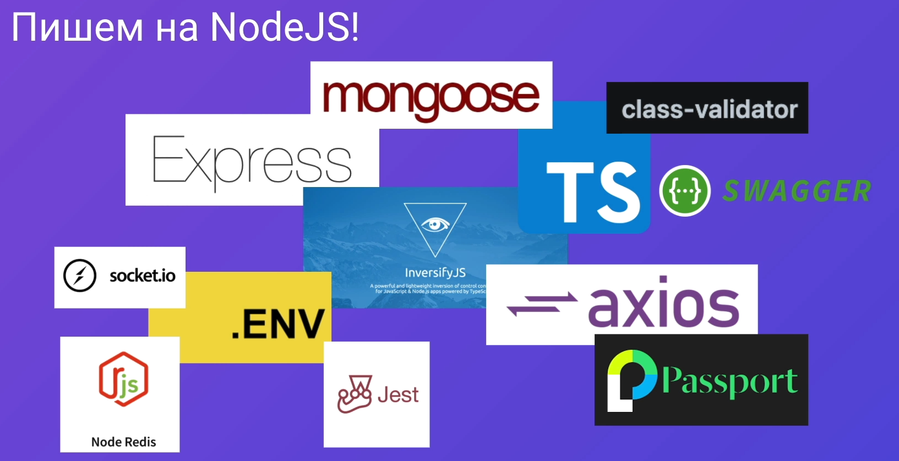
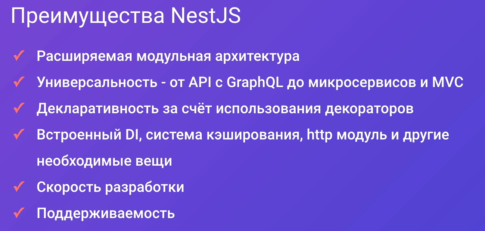
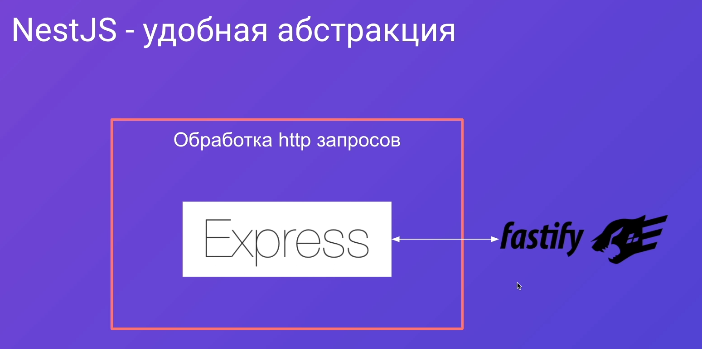
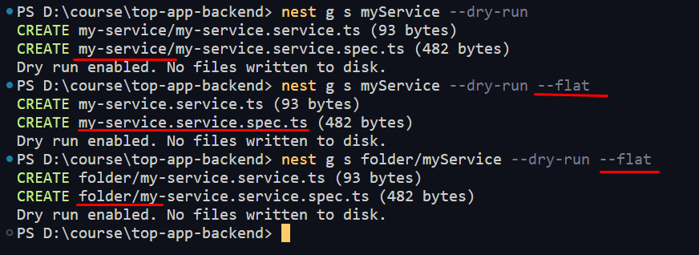
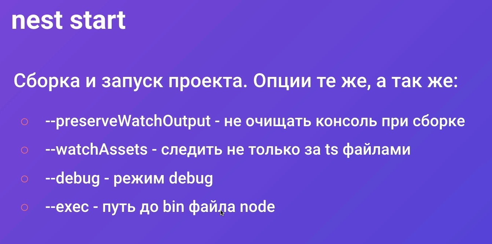
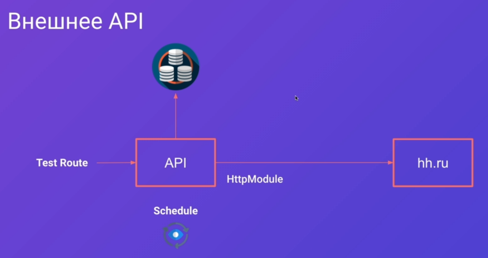
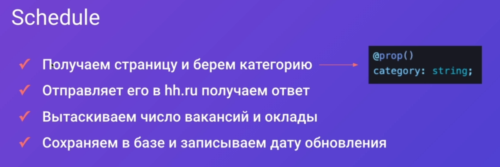
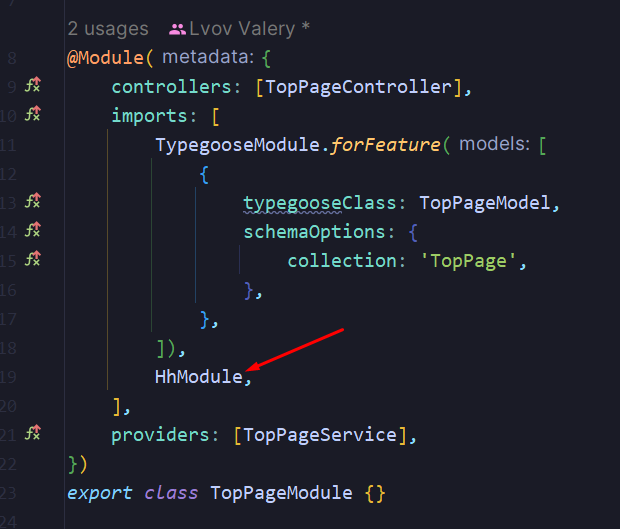
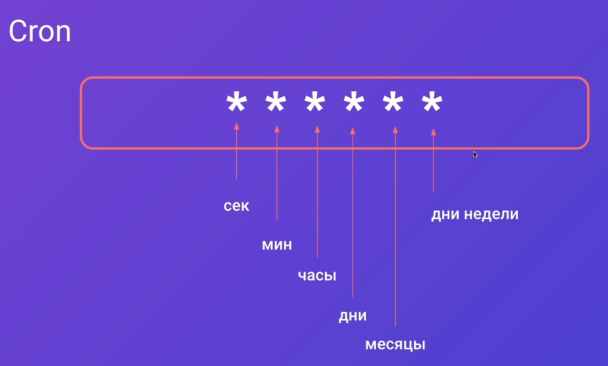
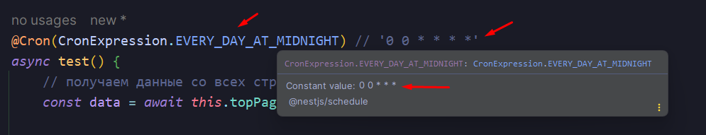

---
tags:
  - typescript
  - nestjs
  - nodejs
  - mongodb
  - backend
---

---
## Введение

В современном мире для построения большого и среднего бэкэнда под сайт требуется огромное количество библиотек и разных технологий:
- ==Typescript== для простого и быстрого рефакторинга кода
- ==Express== для минимального построения архитектуры приложения
- ==InversifyJs== для эффективного внедрения зависимостей и построения контейнера
- ==Mongoose== для подключения к монге
- ==Axios== для написания запросов на фронт
- ==Redis== для кеширования данных
- ==.env== для работы с переменными окружения
- ==Jest== для написания тестов на отдельные части приложения
- ==Socket.io== для построения приложения на сокетах
- ==class-validator== для проиведения валидации данных на сервере
- ==Passport== уже позволит нам прикрутить регистрацию и авторизацию пользователя в системе
- ==Swagger== позволит с фронта просмотреть список доступных API на бэке

И вот такой велосипед придётся собирать каждый раз под каждый проект



Преймущества, которые позволяют удерживать несту лидирующие места:



Нест используется уже во многих компаниях как фреймворк для бэкэнда, поэтому его спокойно можно использовать на проектах любого масштаба


- Модули в несте инкапсулируют определённые сервисы, которые занимаются своей задачей
- Модули могут быть связаны и зависеть друг от друга
- Хорошей практикой будет разделить разную логику на сервисы (сервис по работе с бизнес-логикой и для работы с базой данных)
- Контроллер отвечает только за то, какой сервис должен дёрнутся при запросе от клиента 


Так же некст позволяет нам абстрагироваться от конкретной реализации конкретной библиотеки. Мы можем написать собственную библиотеку, которая будет абстракцией уже над существующей библиотекой.



Далее по курсу будет разрабатываться API для сайта по топам курсов, где будутпредставлены:
- Сами курсы
- Цена курса
- Цена по кредиту
- Отзывы
- Оценки
- Различные вкладки сайта


---
## Настройка окружения

### Работа с NestCLI

Первым делом, нам нужно установить CLI от неста, чтобы с ним эффективно работать

```bash
npm i -g @nestjs/cli
```


Чтобы создать новый проект, нужно уже записать данную команду

```bash
nest new <name> [options]
```

Так же мы имеем дополнительные параметры, которые могут нам помочь в работе:
- `--dry-run` - покажет в консоли, что по идее должно было бы произойти при выполнении данной команды, но никаких реальных изменений в проекте не будет


Следующая команда создаёт компонент по определённой схеме, которую мы можем вызвать через `nest i`

```bash
nest generate <schematic> <name> [options]
```


*Пример*: данная команда сгенерирует сервис

```bash
nest g s myService
```

Тут уже можно увидеть, что флаг `--flat` генерирует файлы в той же папке, где и исполняется индексовый файл. Однако, если насильно указать в запросе папку перед названием файла, то она всё равно будет сгенерирована



Следующая команда уже используется для билда проекта на продакшен

```bash
nest build
```


Собирает и запускает проект

```bash
nest start
```




---
## Модули, контроллеры и провайдеры

### 001 Обзор структуры проекта

Конфиг для TS

`tsconfig.json`
```JSON
{
  "compilerOptions": {
    "strict": true,           /* активирует строгий режим */
    "strictNullChecks": true, /* если значение может быть null, то это нужно явно указать */
    "noImplicitAny": true,    /* обязательно нужно везде указывать типы */
    "strictPropertyInitialization": false,  /* разрешит использовать классы как интерфейсы*/
    "skipLibCheck": true,                   /* позволяет игнорировать проверку библиотек */
    "module": "commonjs",
    "declaration": true,
    "removeComments": true,
    "emitDecoratorMetadata": true,
    "experimentalDecorators": true,
    "allowSyntheticDefaultImports": true,
    "target": "es2017",
    "sourceMap": true,
    "outDir": "./dist",
    "baseUrl": "./",
    "incremental": true,
    "strictBindCallApply": false,
    "forceConsistentCasingInFileNames": false,
    "noFallthroughCasesInSwitch": false
  }
}
```

Пример старого конфига TSLint

`tslint.json`
```JSON
{
	"rules": {
		"no-var-requires": true,
		"no-any": true,
		"promise-function-async": true,
		"await-promise": true,
		"curly": true,
		"prefer-for-dcof": true,
		"forin": true,
		"no-console": [true, "log", "error"],
		"no-debugger": true,
		"no-duplicate-super": true,
		"no-duplicate-switch-case": true,
		"no-invalid-template-strings": true,
		"no-misused-new": true,
		"no-return-await": true,
		"no-shadowed-variable": true,
		"no-switch-case-fall-through": true,
		"no-tautology-expression": true,
		"no-unused-variable": true,
		"no-var-keyword": true,
		"static-this": true,
		"switch-default": true,
		"triple-equals": false,
		"no-require-imports": false,
		"prefer-const": true,
		"arrow-return-shorthand": true,
		"class-name": true,
		"file-name-casing": [true, "kebab-case"],
		"interface-name": [true, "always-prefix"],
		"prefer-switch": [true, { "min-cases": 3 }],
		"switch-final-break": true,
		"import-spacing": true,
		"max-line-length": [true, 120],
		"no-trailing-whitespace": false,
		"quotemark": [true, "single"],
		"semicolon": [true, "always"],
		"trailing-comma": false,
		"indent": [true, "tabs", 4],
		"linterOptions": {
			"exclude": ["./src/**/*.d.ts"]
		}
	}
}
```

Пример нового конфига ESLint

`eslint.js`
```JS
module.exports = {
  parser: '@typescript-eslint/parser',
  parserOptions: {
    project: 'tsconfig.json',
    tsconfigRootDir : __dirname, 
    sourceType: 'module',
  },
  plugins: ['@typescript-eslint/eslint-plugin'],
  extends: [
    'plugin:@typescript-eslint/recommended',
    'plugin:prettier/recommended',
  ],
  root: true,
  env: {
    node: true,
    jest: true,
  },
  ignorePatterns: ['.eslintrc.js'],
  rules: {
    "no-empty-function": "off",
    "no-empty-pattern": "off",
    "prettier/prettier": ["error",
        {
            "singleQuote": true,
            "useTabs": true,
            "semi": true,
            "trailingComma": "all",
            "bracketSpacing": true,
            "printWidth": 100,
            "endOfLine": "auto"
        }
    ],
    "react-hooks/exhaustive-deps": "off",
    "@typescript-eslint/no-empty-function": [
        "off"
    ],
    "@typescript-eslint/interface-name-prefix": "off",
    "@typescript-eslint/explicit-function-return-type": "off",
    "@typescript-eslint/explicit-module-boundary-types": "off",
    "@typescript-eslint/no-explicit-any": "off",
    "@typescript-eslint/no-namespace": "off",
    "@typescript-eslint/ban-ts-comment": "off",
    "@typescript-eslint/no-empty-interface": "off",
    "@typescript-eslint/ban-types": "off"
  },
};
```

Данная команда запустит сервер в режиме просмотра (перекомпиляции при изменениях)

```bash
npm run start:dev
```


### 002 Введение в модули

Модули - это строительные блоки, из которых состоит приложение. 

У всех приложений на NestJS должен быть хотя бы один модуль (например, `AppModule` для главного модуля неста)

Зачастую, на больших проектах вложенность по модулям не составляет больше трёх (первый - второй - третий уровни модулей)

Модули позволяют разделять приложения на разные кусочки, что упрощает вынесение нужного функционала в отдельный микросервис


Модуль объединяет в себе различные зависимости одной области практического применения. 

Декоратор модуля (`@Module`) принимает в себя данные значения:
- `imports: []` - импортируемые модули в данный сервис
- `controllers: []` - контроллеры данного модуля для взаимодействия с приложением
- `providers: []` - сервисы, репозитории (базы данных)
- `exports: []` - экспортируемые модули

Идя от корневого модуля до конечных вложенностей, фреймворк собирает все импорты, контроллеры, провайдеры, которые мы описали в модулях, и строит дерево зависимостей. 

Если модуль нигде не используется или не импортирован в дерево зависимостей, то он не будет задействован в приложении. 


Если модуль используется в нескольких других модулях, то такая практика приемлема


Импортированные модули можно повторно переэкспортировать


Если нам нужно использовать модуль глобально (во всех модулях приложения), то мы можем объявить его как `@Global()`. 

Например, если нам нужно использовать модуль по работе с базой данных в нескольких местах, то мы можем сделать его глобальным, что нам позволит им пользоваться без дополнительного импорта. *Однако глобальный модуль должен быть импортирован в корневой модуль*.


Часто, при подключении определённых модулей (например БД), нам нужно не просто импортировать определённый модуль, но и так же нужно передать определённую информацию (например, строку подключения к базе данных). Обычно для таких вещей используют динамические модули. 

Динамический модуль - это статический метод, который возвращает модули, провайдеры, экспорты и импорты.

Метод именуется `forRoot()`, если он используется глобально (`@Global`) или `forFeauture()`, если он используется только в определённом скоупе модулей

Так же можно в `return` указать `global: true`, чтобы модуль был глобальным

То есть, мы реализовали модуль работы с базой данных и нам нужно в него передавать строку подключения. Для этого реализуется метод `forRoot` внутри этого модуля (работы с БД), чтобы мы могли внутрь него передать строку подключения или любые другие параметры


### 003 Деление на модули

Так выглядит наша страница в итоге:
- Мы должны иметь возможность зайти на сайт, чтобы получить доступ к административным возможностям (удаление комментариев)
- Мы имеем топ продуктов (курсов), с оценками о них 
- Мы имеем определённое количество отзывов, которые относятся к определённым курсам
- Боковое меню должно получать данные для заполнения с сервера


По итогу мы имеем:
- Модуль авторизации
- Модуль продукта
- Модуль отзыва
- Модуль страницы (пункты меню и так далее)
- Модуль приложения, который объединяет все представленные модули


Для генерации модулей воспользуемся встроенным ==CLI== неста

```bash
nest g module auth
nest g module product
nest g module review
nest g module top-page
```

По итогу нест нам сам сгенерирует нужные модули, создаст для них директории и сам обновит импорты в корневом модуле `AppModule`, добавив в него сгенерированные модули


### 004 Создание моделей

В качестве моделей данных будут использоваться классы, которые опишут те данные, с которыми будет работать модуль

Описываем модели данных с помощью классов, а не интерфейсов по следующим причинам:
- на них можно навесить декораторы для валидации
- использовать сразу в БД
- так же можно добавлять полезные методы для самой сущности с данными

(`--no-spec` позволяет не создавать тесты)

```bash
nest g class product/product.model --no-spec
nest g class auth/auth.model --no-spec
nest g class review/review.model --no-spec
nest g class top-page/top-page.model --no-spec
```


И примерно так выглядят логи:


В моделях нам нужно описать все те базовые значения, которые в себе будут хранить определённые сущности. Здесь главное описать базовую модель, которую в будущем можно будет дополнять.

Первым делом опишем продукты, которые в себе будут содержать: изображение, заголовок, цену (которая может иметь скидку и для этого мы можем указать цену без скидки, а так же стоимость в кредит), рейтинг курса, описание курса, преимущества, недостатки, категории (под которое попадает курс), теги и характеристики курса (сложность, длительность и так далее, где будет неограниченное количество ключей-строк и значений-строк).  

`src / product / product.model.ts`
```TS
export class ProductModel {
  	_id: string;
	image: string;
	title: string;
	price: number;
	oldPrice: number;
	credit: number;
	calculatedRating: number;
	description: string;
	advantages: string;
	disAdvantages: string;
	categories: string[];
	tags: string;
	characteristics: {
		[key: string]: string;
	};
}
```


Аутентификация пригодится только для администрации (отзывы может оставлять любой пользователь сайта). Для входа будет нужна только почта и пароль. 

`src / auth / auth.model.ts`
```TS
export class AuthModel {
	email: string;
	passwordHash: string;
}
```

Модель комментария. Как описывалось выше, комментарий может оставить любой пользователь.

`src / review / review.model.ts`
```TS
export class ReviewModel {
	_id: string;
	name: string;
	title: string;
	description: string;
	rating: number;
	createdAt: Date;
}
```


И далее будет представлена модель страницы. Она будет:
- Подстраиваться под выбранную категорию товара
- Подстраиваться под выбранную подкатегорию
- Будет иметь свой заголовок
- Будет иметь выбранную категорию
- Иметь возможность получать доступ к данным `hh.ru` и возвращать от него нужные данные
- Иметь сео-текст
- Иметь теги

`src / top-page / top-page.model.ts`
```TS
// верхнии категории списка
export enum TopLevelCategory {
	Courses,
	Services,
	Books,
	Products
}

export class TopPageModel {
	_id: string;
	// категория, в которой мы сейчас располагаемся
	firstCategory: TopPageModel;
	secondCategory: string;
	title: string;
	category: string;
	// Этот блок будет появляться только для курсов
	hh?: {
		count: number; // количество вакансий
		juniorSalary: number;
		middleSalary: number;
		seniorSalary: number;
	};
	advantages: {title: string; description: string}[];
	seoText: string;
	tagsTitle: string;
	tags: string[];
}
```


### 005 Введение в контроллеры

Контроллер - это входная точка в приложение, куда приходят запросы


Через метод `setGlobalPrfix` мы можем установить, по какому порту мы сможем получить доступ к приложению на сервере (у нас установлено `'api'`). 

При использовании декоратора `@Controller('название_роута')` мы сможем обращаться к методам, к которым имеет доступ контроллер (к методам его класса).

Далее через декораторы `@Get()`, `@Post()` и так далее мы можем указать вызываемые методы, которые и будут определять вызваемый метод по типу запроса (когда мы с клиента будем выбирать тип вызываемого запроса). 

Конкретно `'add/:id'` позволяет нам определить тот роут в контроллере, по которому мы выполняем метод. `:id` - это некоторый строковый параметр, по которому мы будем определять, что нам нужно. 

Всё то, что вернёт данный метод - это то, что уйдёт нашему клиенту в виде JSON-объекта (nest автоматом под капотом преобразует данные).


Основные декораторы аргументов - это `@Req()` и `@Res()`. Всё, что находится ниже черты - это дополнительные декораторы, которые входят в первые два основных.
- `@Params()` - позволяет вытащить параметр из запроса (тот же `id`, что представлен выше)
- `@Body()` - тут мы получаем тело запроса, которое приходит нам с фронта (если пришёл пост-запрос, то из него уже можем вытащить определённые данные)
- `@Query()` - если у нас есть `query`-параметры в строке запроса
- `@Headers()` - выдаёт заголовки (всё, что связано с авторизацией, контент-тайпом и т.д.)
- `@Session()` - возвращает сессиюпользователя


И тут показан пример того, что мы получим при переданной ссылке:
- `@Params` вернёт нам `1`
- `@Query` вернёт нам всё то, что идёт после `?`
- `@Body` - вернёт нам тело запроса на АПИ
- `@Headers` - вернёт нам тот же `Bearer` токена


Так же дополнительные возможности контроллеров:
- Мы можем знаком `*` обозначить, что тут может быть любой символ `_, - и так далее` (конкретно тут будут выполняться методы по пути `product`/`products`)
- Так же мы можем прописать кастомный HTTP код, который вернётся пользователю
- Мы можем вставить кастомный хедер ответа
- Так же мы можем перенаправить запрос пользователя на другое место (если у нас не MVC приложение, то тот же реакт может выдать ошибку и отказаться перенаправить на другую страницу)
- Так же мы можем очень большое АПИ разграничить по поддоменам
- Вернуть промис или вернуть отслеживаемый объект (то есть нест сам разрезолвит данные методы или получит первое значение из observable и вернёт как ответ)


- Так же мы можем вернуть ответ объектом типа `Response` (однако нам обязательно нужно импортировать данный тип из модуля `express`)


### 006 Создание контроллеров

Первым делом определим префикс, который предоставит доступ к АПИ

`src / main.ts`
```TS
import { NestFactory } from '@nestjs/core';
import { AppModule } from './app.module';

async function bootstrap() {
	const app = await NestFactory.create(AppModule);

	// Устанавливаем глобальный префикс для доступа к АПИ
	app.setGlobalPrefix('api');

	await app.listen(3000);
}
bootstrap();
```

Все контроллеры, которые мы создадим создадут файл самого контроллера и файл `.module`, в котором будут описаны связи контроллеров и определённого модуля.
Нам нужно сгенерировать контроллеры под все созданные модули.

```bash
nest g controller auth --no-spec
nest g controller product --no-spec
nest g controller review --no-spec
nest g controller top-page --no-spec
```

И тут CLIка сама создаст шаблонный код контроллера и обновит зависимости в модуле данного функционала


Далее опишем модель данных, которую принимает в себя контроллер аутентификации. 
Описывать модель будем с помощью классов.

==DTO== (*Data Transfer Object*) - это модель, при которой класс описывает тело (`body`) запроса. Конкретно в несте мы будем описывать ту модель данных, которая будет попадать в контроллер.

В системе будет использоваться логин и регистрация. Они будут принимать в себя одинаковый набор данных, поэтому файл можно использовать один 

Такой подход позволит описать Swagger-нотацию для АПИ

`src / auth / dto / auth.dto.ts`
```TS
export class AuthDto {
	login: string;

	// тут мы принимаем от клиента не хеш пароля, а сам пароль от пользователя
	password: string;
}
```

Контроллер аутентификации должен уметь принимать данные на регистрацию и на логин пользователя в системе.

Конкретно при регистрации мы создаём нового пользователя в базе данных и сохраняем его. Уже при логине пользователь должен получать уведомление об успешном входе, что можно отобразить через статускод успеха (`200`). *Данный код можно добавлять для всех методов, когда мы ничего не создаём, а просто получаем с сервера*.

`src / auth / auth.controller.ts`
```TS
import { Body, Controller, HttpCode, Post } from '@nestjs/common';
import { AuthDto } from './dto/auth.dto';

@Controller('auth')
export class AuthController {
	@Post('register')
	async register(@Body() dto: AuthDto) {}

	@HttpCode(200)
	@Post('register')
	async login(@Body() dto: AuthDto) {}
}
```

Далее мы реализуем контроллер для продукта, который сможет принимать новые посты и создавать их, удалять их, искать, отдавать найденные и обновлять.

Данная утилита типа `Omit<ProductModel, '_id'>` позволит нам получить все данные по модели продукта исключая поле `_id`, которое нам не требуется на данный момент (метод `create` будет только создавать продукт).

`src / product / product.controller.ts`
```TS
import { Body, Controller, Delete, Get, HttpCode, Param, Patch, Post } from '@nestjs/common';
import { ProductModel } from './product.model';
import { FindProductDto } from './dto/find-product.dto';

@Controller('product')
export class ProductController {
	// метод получения продукта на сервере и создания
	@Post('create')
	async create(@Body() dto: Omit<ProductModel, '_id'>) {}

	// метод отправки продукта клиенту
	@Get(':id')
	async get(@Param('id') id: string) {}

	// метод удаления продукта
	@Delete(':id')
	async delete(@Param('id') id: string) {}

	// метод обновления продукта
	@Patch(':id')
	async patch(@Param('id') id: string, @Body() dto: ProductModel) {}

	// метод поиска продуктов
	@HttpCode(200)
	@Post()
	async find(@Body() dto: FindProductDto) {}
}
```

Так же реализуем DTO, которая будет определять лимит выведенных продуктов для пользователя, который их ищет и категорию поиска.

`src / product / dto / fint-product.dto.ts`
```TS
export class FindProductDto {
	category: number;
	limit: number;
}
```

Контроллер обзора имеет в себе методы для отправки обзора на сервер, удаление обзора и получение обзора по продукту, к которому относится данный обзор (получаем обзор по `id` продукта).

`src / review / review.controller.ts`
```TS
import { Body, Controller, Delete, Get, Param, Post } from '@nestjs/common';
import { ReviewModel } from './review.model';

@Controller('review')
export class ReviewController {
	// метод получения обзора сервером
	@Post('create')
	async create(@Body() dto: Omit<ReviewModel, '_id'>) {}

	// метод удаления обзора
	@Delete(':id')
	async delete(@Param('id') id: string) {}

	// получение обзора по продукту (заходим в продукт и видим его обзоры)
	@Get('byProduct:productId')
	async getByProduct(@Param('productId') productId: string) {}
}
```

Далее идёт контроллер главной страницы, который позволяет делать почти всё то же самое, что и контроллер продукта.

`src / top-page / dto / top-page.controller.ts`
```TS
import { Body, Controller, Delete, Get, HttpCode, Param, Patch, Post } from '@nestjs/common';
import { TopPageModel } from './top-page.model';
import { FindTopPageDto } from './dto/find-top-page.dto';

@Controller('top-page')
export class TopPageController {
	@Post('create')
	async create(@Body() dto: Omit<TopPageModel, '_id'>) {}

	@Get(':id')
	async get(@Param('id') id: string) {}

	@Delete(':id')
	async delete(@Param('id') id: string) {}

	@Patch(':id')
	async patch(@Param('id') id: string, @Body() dto: TopPageModel) {}

	@HttpCode(200)
	@Post()
	async find(@Body() dto: FindTopPageDto) {}
}
```

Модель DTO позволяет нам определить какие данные нам нужны для вывода определённой страницы по нужной нам категории. 

`src / top-page / dto / find-top-page.ts`
```TS
import { TopLevelCategory } from '../top-page.model';

export class FindTopPageDto {
	firstCategory: TopLevelCategory;
}
```

Так выглядит структура проекта в итоге:


### 007 Введение в провайдеры

Провайдер - это класс, значение, фабрика, которая позволяет использовать модель неста по внедрению зависимостей и встраиваться друг в друга (в контроллеры, сервисы) и выполнять те или иные функции (чтение из БД, запросы к другим сервисам, величина, которую мы хотим шерить между сервисами и так далее) 


`@Injectable()` позволяет указать, что данный класс используется в качестве провайдера и находится в дереве зависимостей.


Чтобы использовать, указанный выше провайдер, нужно просто вставить его в зависимости модуля (`providers: [имя_провайдера]`) и вставить в контроллер в качестве зависимости (внутрь конструктора). 
Чтобы использовать провайдер в другом модуле, нужно его экспортировать.

Если обе зависимости ссылаются друг на друга, то они формируют циклические зависимости. Это приводит к использованию `forwardRef` в зависимостях, что говорит нам о том, что архитектура приложения построена не оптимально и выбранный подход является неоптимальным.


Провайдеры делятся на 4 основных типа:
- Провайдер класса
- Значение (которые мы хотим шерить между другими модулями)
- Фэктори, который генерирует другие провайдеры 
- Использовать существующий провайдер, но с псевдонимом


Это стандартная запись провайдера класса. Она автоматически сокращена до записи одного элемента массива с наименованием класса.
Полная запись представляет из себя массив объектов:
- `provide` говорит нам, как будет называться представленная зависимость
- `useClass` позволяет нам указать какой класс будет провайдиться


Так же мы можем через `useValue` распространять готовую величину, которую мы укажем сами между другими модулями.

Это может быть полезно, когда нам нужно написать тест: например, нам нужно сделать вместо настоящего обращения к базе и провайдера искусственное, при котором мы используем уже готовые данные для возврата.


Так же мы можем использовать `useValue` не с классом, а просто распространять как отдельное значение.


Провайдер `useFactory` позволяет нам инициализировать класс с уже готовыми конфигами (возвращаем новый инстанс класса с выбранными нами параметрами). Удобнее всего использовать для инициализации базы данных внося некоторые настройки.


Когда мы имеем уже существующий сервис в качестве провайдера, мы можем дать ему другое имя через `useExisting` и переиспользовать его.


В NestJS есть несколько скоупов выполнения:
- ==default== - если записываем любой сервис с пустыми параметрами декоратора `@Injectable()`. 
- ==request== - этот скоуп будет на каждый запрос к серверу создавать новый инстанс сервиса.
- ==transient== - каждое новое внедрение данного сервиса возвращает новый инстанс данного сервиса.


На всё приложение будет 1 инстанс данного сервиса. Это приводит к использованию паттерна ==Singleton==.


При одном запросе будет каждый раз генериться новый инстанс `GenerateSrvice`. При этом, если два сервиса используют данный сервис, то они получат один инстанс.


Сколько раз будет внедряться `GenerateSrvice` в другие сервисы, столько разных `GenerateSrvice` они и получат - всем своё, отдельное


---
## Работа с базой данных

### 001 Работа с переменными окружения

Установим средство NestJS для работы с конфигом

```bash
npm i @nestjs/config
```

Далее добавим зависимость `ConfigModule.forRoot()` в корневой модуль, которая позволит нам во всём проекте использовать один и тот же файл конфигурации (глобализирует модуль `forRoot`). Она позволит нам работать с переменными окружения.

`src / app.module.ts`
```TS
@Module({
	imports: [ConfigModule.forRoot(), AuthModule, TopPageModule, ProductModule, ReviewModule],
	controllers: [AppController],
	providers: [AppService],
})
export class AppModule {}
```

Записываем какое-либо значение в переменные окружения.

`.env`
```env
TEST=1
```

И уже в любом другом нужном нам модуле мы можем заинжектить этот сервис по работе с переменными окружения и воспользоваться его функционалом: получить значение переменной можно с помощью функции `get()`, которая принимает в себя наименование переменной.

`src / top-page / top-page.controller.ts`
```TS
@Controller('top-page')
export class TopPageController {
	constructor(private readonly configService: ConfigService) {}

	@Get(':id')
	async get(@Param('id') id: string) {
		return this.configService.get('TEST');
	}

	/// CODE ...
}
```


### 002 Подготовка окружения

Первым делом нужно установить на ПК [Docker](https://www.docker.com/products/docker-desktop/)

После установки докера, нужно настроить его окружение под наш проект:
- `version` - минимальная версия докера
- `services` - сервисы, которые используются в данном контейнере
- `image` - образ, который запускает контейнер
- `container_name` - имя контейнера
- `restart` - перезапуск каждый раз, когда у нас перезагрузился сервер
- `environment` - переменные окружения (логин и пароль администратора)
- `ports` - позволяет прокинуть порт изнутри контейнера наружу (без них не получится подключиться к БД)
- `volumes` - позволяет подключить часть дискового пространства внутри контейнера к диску на сервере (компьютере)
- `command` -  команды (ограничение кеша для БД)

`docker-compose.yml`
```yml
version: '3'  
services:  
  mongo:  
    image: mongo:4.4.4  
    container_name: mongo  
    restart: always  
    environment:  
      - MONGO_INITDB_ROOT_USERNAME=admin  
      - MONGO_INITDB_ROOT_PASSWORD=admin  
    ports:  
      - 27017:27017  
    volumes:  
      - ./mongo-data-4.4:/data/db  
    command: --wiredTigerCacheSizeGB 1.5
```

Позволяет поднять контейнер по заданным параметрам (по файлу `docker-compose.yml` в папке, где запускается команда):

```bash
docker-compose up -d
```


Позволяет посмотреть контейнеры | выбираем отдельный контейнер монги:

```bash
docker ps | grep mongo
```

*Примечание: `grep` работает только на unix-системах*


Так же посмотреть на статус контейнера можно через десктопное приложение докера


Остановить и запустить контейнер мы можем следующими комадами:

```bash
docker stop <имя_контейнера>
docker start <имя_контейнера>
```


### 003 Подключение Mongo

Сейчас нам нужно установить данные модули:
- `mongoose` - удобная ORM для монги
- `typegoose` - позволяет проще описать модели для `mongoose`
-  `nestjs-typegoose` - позволяет использовать `typegoose` в несте более нативно (приближенно к основным подходам фреймворка)

```bash
// тут может потребоваться --legacy-peer-deps
npm i @typegoose/typegoose mongoose nestjs-typegoose 

npm i -D @types/mongoose 
```

Записываем переменные для подключения к монге в окружение

`.env`
```env
MONGO_LOGIN=admin  
MONGO_PASSWORD=admin  
MONGO_HOST=localhost  
MONGO_PORT=27017  
MONGO_AUTHDATABASE=admin
```

Далее, в основном модуле приложения, подключим модуль провайдера монги `TypegooseModule`

Тут мы используем вместо `forRoot` метод `forRootAsync`, который позволит асинхронно инициализировать модуль вместе с его зависимостями. Это делается для того, чтобы иметь возможность использовать `ConfigModule` в зависимостях модуля тайпгуза

Для того, чтобы использовать любой провайдер, нужно использовать модуль, который содержит этот провайдер, поэтому вставляем в `import` модуль `ConfigModule`

В `inject` мы вставляем зависимость из `ConfigModule`, а именно тут это представляет `ConfigService`, который позволит нам получить данные из `.env`

Внутрь `useFactory` будет помещать функцию, которая сгенерирует строку подключения к БД монги `getMongoConfig`.

`src / app.module.ts`
```TS
@Module({  
   imports: [  
      ConfigModule.forRoot(),  
      // асинхронно подключаем конфигурацию  
      TypegooseModule.forRootAsync({  
         // тут мы импортируем модули провайдеров  
         imports: [ConfigModule],  
         // тут мы вставляем зависимость в фэктори из модуля, который в него импортировали  
         inject: [ConfigService],  
         // сюда мы передаём конфиг подключения к монге  
         useFactory: getMongoConfig,  
      }),  
      AuthModule,  
      TopPageModule,  
      ProductModule,  
      ReviewModule,  
   ],  
   controllers: [AppController],  
   providers: [AppService],  
})  
export class AppModule {}
```

Сейчас нам нужно написать саму функцию `getMongoConfig`, которая сгенерирует параметры подключения. 

Таким образом должен выглядеть объект подключения по типам:


Все конфиги, которые мы передаём в модули, лучше складировать в папку `configs`.

- `getMongoConfig` - эта функция возвращает объект, который содержит в себе строку подключения к монге и деструктурированный объект, возвращаемый из функции, которая возвращает опции монги
- `getMongoString` - возвращает строку подключения к монге через обращение к `configService`
- `getMongoOptions` - возвращает опции для подключения к монге

`src / configs / mongo.config.ts`
```TS
import { ConfigService } from '@nestjs/config';  
import { TypegooseModuleOptions } from 'nestjs-typegoose';  
  
// получаем строку подключения к монге  
const getMongoString = (configService: ConfigService) =>  
   'mongodb://' +  
   configService.get('MONGO_LOGIN') +  
   ':' +  
   configService.get('MONGO_PASSWORD') +  
   '@' +  
   configService.get('MONGO_HOST') + // хост
   ':' +  
   configService.get('MONGO_PORT') + // порт
   '/' +  
   configService.get('MONGO_AUTHDATABASE'); // база, к которой подключаемся
  
// получение опций для подключения к монге  
const getMongoOptions = () => ({ });  
  
// это функция получения конфига для подключения к монге  
export const getMongoConfig = async (  
   configService: ConfigService,  
): Promise<TypegooseModuleOptions> => {  
   // возвращаем объект, который вызывает две функции, которые вернут нам - строку и опции для подключения  
   return {  
      uri: getMongoString(configService),  
      ...getMongoOptions(),  
   };  
};
```

И теперь `npm start` запустит наш сервер с подключением к монге


### 004 Подключение моделей

Далее нам нужно подготовить наши модели данных и навесить на них декораторы, чтобы `typegoose` понял, как работать с этими данными

В модуль нужно импортировать `TypegooseModule`, из которого буде использовать локальную функциональность (`forFeature`), в которой опишем модель данных, которую будет иметь данный модуль

`src > auth > auth.module.ts`
```TS
import { Module } from '@nestjs/common';
import { AuthController } from './auth.controller';
import { TypegooseModule } from 'nestjs-typegoose';
import { AuthModel } from './auth.model';

@Module({
	controllers: [AuthController],
	// добавляем импорт модуля
	imports: [
		// подключаем локально для модуля модели
		TypegooseModule.forFeature([
			{
				typegooseClass: AuthModel, // класс модели
				// опции схемы данных
				schemaOptions: {
					collection: 'Auth', // имя коллекции
				},
			},
		]),
	],
})
export class AuthModule {}
```

Далее нам нужно описать свойства (а именно, их характеристики), которые будут попадать в монгу через декораторы

`@prop` - описывает данные как отдельные свойства, которые будут класться в базу. Данный декоратор стоит добавлять на все свойства, которые мы отправляем в монгу.

Ну и так же далее нам нужно сделать *TimeStamps*, который будет помечать время создания объекта. Можно создать его отдельным свойством (`createdAt`), а можно сделать правильно и расширить ДТОшку от тайпгуза через `extends TimeStamp`


Вместе с этим нужно добавить ещё и `_id` в нашу модель. Это можно сделать ещё более красивым способом - заэкстендить интерфейс с именем класса модели данных от класса `Base`. И тут нужно будет сказать, что в наши модели данных теперь нельзя добавлять поле `_id`, так как оно присутствует в `Base`. Сам интерфейс обязательно нужно экспортировать, чтобы TS смог смёрджить класс и интерфейс

`src > auth > auth.model.ts`
```TS
import { prop } from '@typegoose/typegoose';
import { Base, TimeStamps } from '@typegoose/typegoose/lib/defaultClasses';

export interface AuthModel extends Base {}

export class AuthModel extends TimeStamps {
	@prop({
		// index: true, // это поле будет являться индексом в БД
		unique: true, // сделает поле уникальным и так же индексом записи
	})
	email: string;

	@prop()
	passwordHash: string;
}
```

Чтобы пустые интерфейсы не подсвечивались, нужно их оффнуть в еслинте


Добавляем ровно то же самое подключение `Typegoose` модуля для подключение модели к модулю продукта

`src > product > product.module.ts`
```TS
import { Module } from '@nestjs/common';
import { ProductController } from './product.controller';
import { TypegooseModule } from 'nestjs-typegoose';
import { AuthModel } from '../auth/auth.model';

@Module({
	controllers: [ProductController],
	imports: [
		TypegooseModule.forFeature([
			{
				typegooseClass: ProductModel, 
				schemaOptions: {
					collection: 'Product', 
				},
			},
		]),
	],
})
export class ProductModule {}
```

Если мы хотим в `@prop` указать тип, то нам придётся указать такую конструкцию:

Между `[]` попадает не тип `TypeScript`, а конструктор типа `Typegoose` 

```TS
@prop({ type: () => [String] })  
tags: string[];
```

Типизация модели продукта:

`src > product > product.model.ts`
```TS
import { Base, TimeStamps } from '@typegoose/typegoose/lib/defaultClasses';
import { prop } from '@typegoose/typegoose';

class ProductCharacteristic {
	@prop()
	name: string;

	@prop()
	value: string;
}

export interface ProductModel extends Base {}

export class ProductModel extends TimeStamps {
	@prop()
	image: string;

	@prop()
	title: string;

	@prop()
	price: number;

	@prop()
	oldPrice: number;

	@prop()
	credit: number;

	@prop()
	calculatedRating: number;

	@prop()
	description: string;

	@prop()
	advantages: string;

	@prop()
	disAdvantages: string;

	@prop({ type: () => [String] })
	categories: string[];

	@prop({ type: () => [String] })
	tags: string[];

	@prop({
		type: () => [ProductCharacteristic], // типизируем запрос
		_id: false, // отключаем автоматическую генерацию id в массиве
	})
	characteristics: ProductCharacteristic[];
}
```

Подключение модуля тайпгуза к обзору:

`src > review > review.module.ts`
```TS
import { Module } from '@nestjs/common';
import { ReviewController } from './review.controller';
import { ReviewModel } from './review.model';
import { TypegooseModule } from 'nestjs-typegoose';

@Module({
	controllers: [ReviewController],
	imports: [
		TypegooseModule.forFeature([
			{
				typegooseClass: ReviewModel,
				schemaOptions: {
					collection: 'Review',
				},
			},
		]),
	],
})
export class ReviewModule {}
```

Типизация модели обзора:

`src > review > review.model.ts`
```TS
import { Base, TimeStamps } from '@typegoose/typegoose/lib/defaultClasses';
import { prop } from '@typegoose/typegoose';

export interface ReviewModel extends Base {}

export class ReviewModel extends TimeStamps {
	@prop()
	name: string;

	@prop()
	title: string;

	@prop()
	description: string;

	@prop()
	rating: number;

	// удаляем, так как экстендим от TimeStamps
	// @prop()
	// createdAt: Date;
}
```

Подключение модуля главной страницы:

`src > top-page > top-page.module.ts`
```TS
import { Module } from '@nestjs/common';
import { TopPageController } from './top-page.controller';
import { TypegooseModule } from 'nestjs-typegoose';
import { TopPageModel } from './top-page.model';

@Module({
	controllers: [TopPageController],
	imports: [
		TypegooseModule.forFeature([
			{
				typegooseClass: TopPageModel,
				schemaOptions: {
					collection: 'TopPage',
				},
			},
		]),
	],
})
export class TopPageModule {}
```

Типизация модели главной страницы:

`src > top-page > top-page.model.ts`
```TS
import { Base, TimeStamps } from '@typegoose/typegoose/lib/defaultClasses';
import { prop } from '@typegoose/typegoose';

export enum TopLevelCategory {
	Courses,
	Services,
	Books,
	Products,
}

export class HhData {
	@prop()
	count: number; // количество вакансий

	@prop()
	juniorSalary: number;

	@prop()
	middleSalary: number;

	@prop()
	seniorSalary: number;
}

export class TopPageAdvantages {
	@prop()
	title: string;

	@prop()
	description: string;
}

export interface TopPageModel extends Base {}

export class TopPageModel extends TimeStamps {
	@prop({ enum: TopLevelCategory })
	firstCategory: TopLevelCategory;

	@prop()
	secondCategory: string;

	@prop({ unique: true })
	alias: string;

	@prop()
	title: string;

	@prop()
	category: string;

	@prop({ type: () => HhData }) // возвращается тип модели HhData
	hh?: HhData;

	@prop({ type: () => [TopPageAdvantages] })
	advantages: TopPageAdvantages[];

	@prop()
	seoText: string;

	@prop()
	tagsTitle: string;

	@prop({ type: () => [String] })
	tags: string[];
}
```

Если бы мы присвоили значения для свойства енама, то можно было бы указать и возвращаемый тип 


И теперь тут отображены после кор-модуля все 4 модуля `forFeature`, которые мы подключили к модулям приложения


### 005 Сервис отзывов

Добавляем новый сервис через CLI неста

```bash
nest g service review
```

Далее добавляется в модуль зависимость от данного сервиса в провайдерах


Далее переходим в сервис и первым делом в конструкторе инжектим `ReviewModel`, который предоставит доступ к редактированию данных внутри данной модели (предоставит доступ к методам изменения, создания и так далее)

`src > review > review.service.ts`
```TS
import { Inject, Injectable } from '@nestjs/common';  
import { ReviewModel } from './review.model';  
import { ModelType } from '@typegoose/typegoose/lib/types';  
  
@Injectable()  
export class ReviewService {  
   // инжектим модель в сервис  
   constructor(@InjectModel(ReviewModel) private readonly reviewModel: ModelType<ReviewModel>) {}  
}
```

Так же нам нужно добавить в модель обзора `id` продукта, к которому будет присвоен комментарий

`src > review > review.model.ts`


Далее нам нужно описать ДТОшку модели данных, которую нужно соблюдать для создании нового обзора на продукт

`src > review > dto > create-review.dto.ts`
```TS
export class CreateReviewDto {
	name: string;
	title: string;
	description: string;
	rating: number;
	productId: string;
}
```

И далее подставим для контроллера создания новую ДТОшку, которая будет отвечать за модель принимаемых данных для добавления обзора

`src > review > review.controller.ts`


Приступаем к описанию сервиса, который будет напрямую взаимодействовать с провайдером (хранить методы для модификации и изменения данных):
- `create` - метод создания нового обзора
- `findByProductId` - метод поиска обзора по продукту (для вывода обзоров по продукту)
- `delete` - удаление обзора
- `deleteByProductId` - удаление обзоров по `id` продукта (например, если удалится продукт, то вместе с ним и обзор)

Конкретно `reviewModel` предоставляет нам методы для работы с данными внутри `Mongo`:
- `find` - найти запись по query, которая принимает в себя объект с полями `{}`
- `create` - создание нового объекта по модели данных
- `findByIdAndDelete` - поиск и удаление записи по `id`
- `deleteMany` - удаление нескольких записей по query

В некоторых операциях используется метод `exec`, который запускает операцию

Когда мы пишем в query `productId: new Types.ObjectId(productId)`, то тут мы вызываем поиск по новому созданному типу, который является уникальным идентификатором для записи 

`src > review > review.service.ts`
```TS
import { Injectable } from '@nestjs/common';
import { ReviewModel } from './review.model';
import { ModelType, DocumentType } from '@typegoose/typegoose/lib/types';
import { CreateReviewDto } from './dto/create-review.dto';
import { Types } from 'mongoose';
import { InjectModel } from 'nestjs-typegoose';

@Injectable()
export class ReviewService {
	// инжектим модель, которая содержит методы mongoose
	constructor(
		@InjectModel(ReviewModel) 
		private readonly reviewModel: ModelType<ReviewModel>
	) {}

	// метод создания нового обзора по продукту
	async create(dto: CreateReviewDto): Promise<DocumentType<ReviewModel>> {
		// возвращает созданный обзор
		return this.reviewModel.create(dto);
	}

	// метод удаления обзора
	async delete(id: string): Promise<DocumentType<ReviewModel> | null> {
		// findByIdAndDelete - найти по id и удалить
		// exec - запрашивает выполнение данной операции
		return this.reviewModel.findByIdAndDelete(id).exec();
	}

	// метод удаления всех обзоров по продукту (нужно, если удаляем продукт)
	async deleteByProductId(productId: string) {
		return this.reviewModel.deleteMany({ 
			productId: new Types.ObjectId(productId) 
		}).exec();
	}

	// метод поиска обзора по продукту (если переходим на просмотр продукта)
	async findByProduct(
		productId: string
	): Promise<DocumentType<ReviewModel>[]> {
		return this.reviewModel.find({ 
			productId: new Types.ObjectId(productId) 
		}).exec();
	}
}
```

И далее в контроллере (который принимает в себя запросы с фронта) вызываем методы сервиса, который уже и производит изменения в базе данных

Сюда в конструктор вставляем `ReviewService` из `review.service.ts`. 
Далее нам остаётся только добавить методы из сервиса `ReviewService`. 
Наименования методов ровно такие же, как и в сервисе.

Сам контроллер работает только с `http`-запросами. Ответы на ошибки приходят тоже из него (тот же нестовский `HttpException`, который отправляет на фронт ответ со сгенерированной ошибкой)

`src > review > review.controller.ts`
```TS
import { Controller, Delete, Get, HttpException, HttpStatus, Param, Post } from '@nestjs/common';
import { Body } from '@nestjs/common/decorators';
import { CreateReviewDto } from './dto/create-review.dto';
import { ReviewService } from './review.service';
import { REVIEW_NOT_FOUND } from './review.constants';

@Controller('review')
export class ReviewController {
	// тут мы принимаем инстанс сервиса обзоров
	constructor(private readonly reviewService: ReviewService) {}

	@Post('create')
	async create(@Body() dto: CreateReviewDto) {
		return this.reviewService.create(dto); // создаём новый DTO
	}

	@Delete(':id')
	async delete(@Param('id') id: string) {
		// удаляем нужную запись получаем удалённый документ
		const deletedDoc = await this.reviewService.delete(id);

		// если мы ничего не удалили, то
		if (!deletedDoc) {
			// выкенем нестовскую http-ошибку
			// 1арг - строка с сообщением ошибки, 2арг - статус ошибки
			throw new HttpException(REVIEW_NOT_FOUND, HttpStatus.NOT_FOUND);
		}
	}

	@Get('getByProduct/:productId')
	async getByProduct(@Param('productId') productId: string) {
		return this.reviewService.findByProductId(productId);
	}
}
```

Тут же мы храним константы, которые используются в модуле. Конкретно здесь хранится текстовый ответ, который придёт на фронт с ошибкой

`src > review > review.constants.ts`
```TS
export const REVIEW_NOT_FOUND = 'Отзыв по такому id не найден';
```


---
## Тесты

### 001 Типы тестирования


e2e тесты можно проводить как на АПИ, так и через браузер (фронт-приложение)

Тестирование АПИ:
- Jest
- Mocha
- Chai

Тестирование фронта:
- Cypress
- Protractor
- Selenium


Для интеграционного тестирования нам не обязательно поднимать всё приложение. Тут достаточно поднять два инстанса 


Для юнита нужно лишь вписать тесты под отдельный модуль


### 002 Тесты отзывов

e2e тесты хранятся в папке `test`. Там же находится файл настроек, где и указано, какие тесты должен запускать `Jest`


Далее уже в той же папке лежит и сам e2e тест приложения.

- `describe` - описывает запускаемую группу тестов
- `beforeEach` - функция, которая выполняется до каждого отдельного теста
- `beforeAll` - выполняется один раз перед всеми тестами
- `afterAll` - выполняется один раз после всех тестов
- `it` - описывает действия на каждом отдельном тесте

- `app` - переменная, которая получает из moduleFixture (переменная с модулями для теста) всё целиковое приложение
- `Test.createTestingModule` - фиксирует ровно те модули в приложении, которые нам нужно запустить (конкретно тут вызвается всё приложение)
- `request` - маленькая библиотечка из supertest, которая позволяет удобно общаться с локальным АПИ

`test > review.e2e-spec.ts`
```TS
import { Test, TestingModule } from '@nestjs/testing';
import { INestApplication } from '@nestjs/common';
import * as request from 'supertest';
import { AppModule } from './../src/app.module';

// describe описывает группу тестов
describe('AppController (e2e)', () => {
	// это всё приложение неста
	let app: INestApplication;

	// данный код будет выполняться перед каждым запуском выполнения следующего теста
	beforeEach(async () => {
		// создаёт отдельный тестовый модуль
		const moduleFixture: TestingModule = await Test.createTestingModule({
			// конкретно тут собирается и импортируется всё приложение
			imports: [AppModule],
		}).compile(); // компиляция

		// создаём уже само приложение неста
		app = moduleFixture.createNestApplication();

		// инициализация приложения
		await app.init();
	});

	// выполняет отдельный кейс теста
	it('/ (GET)', () => {
		return request(app.getHttpServer()) // получаем http-сервер приложения
			.get('/') // отправляем запрос на индекс-роут
			.expect(200) // ожидаем 200
			.expect('Hello World!'); // ожидаем приветствие
	});
});
```

Далее напишем несколько тестов. Хорошей практикой будет писать тесты как на успешное выполнение операции, так и на выполнение с ошибкой.

Внутри `it`:
- пишем имя теста по определённой нотации
- если мы будем использовать внутри ответа `then`, то функция должна быть `async`
- первым делом, мы через `request(app.getHttpServer())` получаем доступ к нашему локальному хосту для запросов
- далее у нас идёт сам запрос (`post`, `get`, `delete` и так далее). В него всталяем роут запроса (без использования пути относительно глобального префикса через `app.setGlobalPrefix()`, так как будет ошибка) 
- дальше мы можем вписать `send()`, если нам нужно что-то отправить на сервер
- дальше вписать `expect()`, в котором находится ожидаемый ответ от сервера
- дальше уже можно поместить `then((res: request.Respone) => {})`, в котором нужно провести определённые операции проверки (`expect()`)

`test > review.e2e-spec.ts`
```TS
import { Test, TestingModule } from '@nestjs/testing';
import { INestApplication } from '@nestjs/common';
import * as request from 'supertest';
import { AppModule } from './../src/app.module';
import { CreateReviewDto } from '../src/review/dto/create-review.dto';
import { disconnect, Types } from 'mongoose';
import { REVIEW_NOT_FOUND } from '../src/review/review.constants';

const productId = new Types.ObjectId().toHexString();

const testDto: CreateReviewDto = {
	name: 'Olek',
	rating: 3.5,
	title: '',
	description: '',
	productId,
};

describe('AppController (e2e)', () => {
	let app: INestApplication;
	let createdId: string; // id созданного объекта

	beforeEach(async () => {
		const moduleFixture: TestingModule = await Test.createTestingModule({
			imports: [AppModule],
		}).compile();

		app = moduleFixture.createNestApplication();
		await app.init();
	});

	// передаём запрос на создание нового обзора
	it('/review/create (POST) - success', async () => {
		return request(app.getHttpServer())
			.post('/review/create')
			.send(testDto) // отправляем объект на сервер
			.expect(201)
			.then(({ body }: request.Response) => {
				// присваиваем id ответа
				createdId = body._id;

				// описываем, что мы ожидаем наличие значения
				expect(createdId).toBeDefined();
			});
	});

	// передаём запрос на получение нового обзора - успешный запрос
	it('/review/getByProduct/:productId (GET) - success', async () => {
		return request(app.getHttpServer())
			.get('/review/getByProduct/' + productId)
			.expect(200)
			.then(({ body }: request.Response) => {
				// так как нам приходит массив из одного элемента, то длина должна быть = 1
				expect(body.length).toBe(1);
			});
	});

	// передаём запрос на получение нового обзора, но ответ будет с ошибкой
	it('/review/getByProduct/:productId (GET) - fail', async () => {
		return request(app.getHttpServer())
			.get('/review/getByProduct/' + new Types.ObjectId().toHexString())
			.expect(200)
			.then(({ body }: request.Response) => {
				// тут нам уже должен прийти пустой массив
				expect(body.length).toBe(0);
			});
	});

	// передаём запрос на удаление нового обзора
	it('/review/:id (DELETE) - success', () => {
		return request(app.getHttpServer())
			.delete('/review/' + createdId)
			.expect(200);
	});

	// передаём запрос на удаление нового обзора, но с ошибкой
	it('/review/:id (DELETE) - fail', () => {
		return (
			request(app.getHttpServer())
				.delete('/review/' + new Types.ObjectId().toHexString())
				// ожидаем получить 404 NOT_FOUND
				.expect(404, {
					statusCode: 404,
					message: REVIEW_NOT_FOUND,
				})
		);
	});

	// после всех тестов
	afterAll(() => {
		// отключаемся от БД
		disconnect();
	});
});
```


### 003 Unit тесты

И изначально при создании любого объекта через нест, у нас создаются начальные тесты

`src > review > review.service.spec.ts`
```TS
import { Test, TestingModule } from '@nestjs/testing';
import { ReviewService } from './review.service';

describe('ReviewService', () => {
	let service: ReviewService;

	beforeEach(async () => {
		const module: TestingModule = await Test.createTestingModule({
			providers: [ReviewService],
		}).compile();

		service = module.get<ReviewService>(ReviewService);
	});

	it('should be defined', () => {
		expect(service).toBeDefined();
	});
});
```

Однако они работать не будут, так как в тесты нужно ещё будет вложить все зависимости, которые инжектятся в сервис


Для исправления вышеописанной проблемы нужно будет замокать все зависимости

Через `getModelToken('ReviewModel')` мы просим тайпгуз, чтобы он от зависимости `ReviewModel` нашёл её токен и по нему нужно будет заинжектить некоторую новую фабрику


Далее нам нужно описать работу `reviewRepositoryFactory`. Он возвращает объект с функциями. Чтобы работал чейн, как в оригинальных функциях, нужно, чтобы его функции возвращали `exec`. Сам `exec` представляет из себя объект, который хранит функцию-заглушку `jest.fn()`


Теперь мы можем воспользоваться большим количеством моковых данных


И примерно так выглядит реализация unit-теста с с фабрикой, которая генерирует нам моковые методы:

`src > review > review.service.spec.ts`
```TS
import { Test, TestingModule } from '@nestjs/testing';
import { ReviewService } from './review.service';
import { getModelToken } from 'nestjs-typegoose';
import { Types } from 'mongoose';

describe('ReviewService', () => {
	let service: ReviewService;

	const exec = { exec: jest.fn() };
	const reviewRepositoryFactory = () => ({ find: () => exec });

	beforeEach(async () => {
		const module: TestingModule = await Test.createTestingModule({
			providers: [
				ReviewService,
				{
				// эта функция будет возвращать моковые зависимости для тестов
					useFactory: reviewRepositoryFactory,
					// здесь мы провайдим токен, который вставляем в модель
					provide: getModelToken('ReviewModel'), // получаем токен указанной модели
				},
			],
		}).compile();

		service = module.get<ReviewService>(ReviewService);
	});

	it('should be defined', () => {
		expect(service).toBeDefined();
	});

	it('findByProduct working', async () => {
		// генерируем id
		const id = new Types.ObjectId().toHexString();

		// создаём моковые данные
		reviewRepositoryFactory()
			.find()
			// возвращаем единоразово моковые данные с id продукта
			.exec.mockReturnValueOnce([{ productId: id }]);

		// ищем продукт по id в моковых данных
		const res = await service.findByProductId(id);

		// мы ожидаем, что свойство id продукта нулевого элемента будет = id
		expect(res[0].productId).toBe(id);
	});
});
```

Запуск unit- и screenshot-тестов:

```bash
npm run test
```


---
## Валидация данных

### 001 Exception filters и pipes

Когда с клиента приходят данные в API, эти данные могут быть провалидированы через Pipes

Когда мы отправляем данные на фронт, мы можем провалидировать эти данные через Exception Filters


Сами http-ошибки в несте создаются через `HttpException`, который под капотом преобразуется в JSON


Для реализации ==Exception filter==:
- создаём класс, который экстендится от ExceptionFilter
- Далее нужно класс обвесить декоратором `@Catch()`, в котором указать, какие ошибки будет обрабатывать фильтр
- далее будет описываться метод `catch()`, который принимает саму ошибку и контекст запроса
- далее в переменную `ctx` мы помещаем контекст запроса и из этой переменной дополнительно достаём `response` и `request`
- впоследствии мы можем модифицировать полученный `response` и обогатить его статусом и нужными данными по ошибке

Чтобы применить созданный фильтр, нужно навесить его на нужный роут через декоратор `@UseFilters()`, куда мы помещаем созданный инстанс нашего фильтра ошибок

Это приведёт к тому, что все ошибки, которые произойдут в роуте, будут попадать в наш фильтр


В несте уже есть набор готовых пайпов 

Чтобы навесить на роут пайп, нужно использовать декоратор `@UsePipe()` и передать в него нужный инстанс пайпа

Так же мы можем валидировать не полностью целые роуты, а ещё пайпить отдельные значения, просто передавая пайп вторым аргументом в декоратор параметра

Конкретно мы имеем несколько пайпов, которые позволяют преобразовать полученный с клиента ответ в нужный нам тип данных:
- `ParseIntPipe` - трансформирует полученное значение с клиента в число (на примере полученный `id` в `number`)
- `ParseBoolPipe`
- `ParseArrayPipe`
- `ParseUUIDPipe`
- `DefaultValuePipe`


Сам `ValidationPipe` использует внутри себя библиотеки `class-validator` и `class-transformer`, которые позволяют перевести объект в класс и валидировать свойства данного класса


Для реализации своего пайпа, нужно будет создать класс, который будет имплементироваться от интерфейса `PipeTransform` и реализовывать метод `transform()`, который принимает первым аргументом значение, а вторым метаданные (они хранят данные о месте применения пайпа, его изначальный тип и аргумент декоратора) 


Но зачастую нам нужно использовать пайпы или фильтры по всему приложению. Это можно сделать в основной функции запуска приложения неста


### 002 Реализация ValidationPipe

Установим две зависимости, которые позволят нам проводить валидацию данных

```bash
npm i class-transformer class-validator
```

Далее нам нужно будет взять декораторы из `class-validator`, которые позволят нам валидировать значение с клиента и задекорировать все поля класса

Во все данные декораторы мы можем поместить опции, которые позволят заменить стандартные ошибки на те, что нужны нам

`src > review > create-review.dto.ts`
```TS
import { IsString, IsNumber, Min, Max } from 'class-validator';

export class CreateReviewDto {
	@IsString()
	name: string;

	@IsString()
	title: string;

	@IsString({ message: 'Описание должно быть строкой' })
	description: string;

	@Max(5, { message: 'Рейтинг не может быть больше 5' })
	@Min(1, { message: 'Рейтинг не может быть меньше 1' })
	@IsNumber()
	rating: number;

	@IsString()
	productId: string;
}
```

Далее нам нужно навесить пайп, который будет валидировать приходящие данные относиельной той DTOшки, которая должна прийти по типу в данный роут (тут `dto: CreateReviewDto`)

`src > review > review.controller.ts`


И далее для примера напишем в e2e тесте ещё один кейс для ошибки по типу входящих данных

`test > review.e2e-spec.ts`
```TS
it('/review/create (POST) - fail', async () => {
	return request(app.getHttpServer())
		.post('/review/create')
		.send({ ...testDto, rating: 0 })
		.expect(400)
		.then(({ body }: request.Response) => {
			console.log(body);
		});
});
```

Мы получаем при ошибке тело с ответом заданной нами ошибки, статускод и `error`


---
## Отладка приложений

### 001 Debug

Команда дебага

```bash
npm run start:debug
```

Самое важное тут - это строка прослушивания, которая позволит подключиться другим инструментам к дебагу


### 002 Анализ памяти

Создадим искусственную утечку памяти (при каждом запросе на поиск обзора будет создаваться новый класс, который не удаляется)


Далее можно в хромовском инспекте запустить девтулз по порту `9229` 


И далее во вкладке *Memory* можно сделать снепшот приложения на данный момент времени, который покажет все инстансы нашего приложения. На данный момент времени занято не так много ОЗУ, так как в приложение не поступало запросов


Далее нам нужно будет произвести искусственную нагрузку на наше приложение отправляя на него искусственные запросы в большом количестве. Можно, конечно, отправлять самостоятельно запросы через *insomnia*, но лучше автоматизировать данный подход через модуль `autocannon`

```bash
npm i -g autocannon
```

В автокэннон нужно передать ссылку, которая отправит большое количество запросов на данный роут сервера


И при повтором запуске скриншота будет отображено количество созданных классов


Профайлер позволяет сделать проверки нагрузки на ЦП


### 003 Анализ производительности

Устанавливаем глобально клинику

```bash
npm i -g clinic
```

Далее нужно будет сбилдить проект

```bash
npm run build
```

Дефолтная строка подключения:

```bash
clinic doctor --on-port 'autocannon localhost:$PORT' -- node slow-event-loop
```

Строка подключения для проекта (стоит обратиться к документации):

```bash
clinic doctor --on-port 'autocannon localhost:$PORT/api/review/byProduct/8123864918273189237sad23' -- node dist/main.js
```

Далее у нас запускается проект


И формируется данная страница, которая показывает 4 показателя с частой утечкой памяти по ним (нагрузка на ЦПУ, использование памяти, задуржки ивент лупа, количество активных хэндлеров)


---
## Авторизация

### 001 Регистрация пользователя

Установим библиотеку для работы с шифрованием паролей (чтобы не хранить в базе пароли в открытом виде)

```bash
npm i bcryptjs
npm i -D @types/bcryptjs
```

Заменим имя модели на `UserModel` вместо `AuthModel`, чтобы точнее указать, что мы тут работаем с моделью пользователя

`src > auth > user.model.ts`
```TS
import { prop } from '@typegoose/typegoose';
import { Base, TimeStamps } from '@typegoose/typegoose/lib/defaultClasses';

export interface UserModel extends Base {}

export class UserModel extends TimeStamps {
	@prop({
		unique: true,
	})
	email: string;

	@prop()
	passwordHash: string;
}
```

Заменим `UserModel` на `AuthModel` в зависимостях модуля

`src > auth > auth.module.ts`
```TS
import { Module } from '@nestjs/common';
import { AuthController } from './auth.controller';
import { TypegooseModule } from 'nestjs-typegoose';
import { UserModel } from './user.model';
import { AuthService } from './auth.service';

@Module({
	controllers: [AuthController],
	imports: [
		TypegooseModule.forFeature([
			{
				typegooseClass: UserModel,
				schemaOptions: {
					collection: 'User',
				},
			},
		]),
	],
	providers: [AuthService],
})
export class AuthModule {}
```

Далее нужно провалидировать ДТОшку того объекта для регистрации и аутентификации, который приходит к нам с клиента

`src > auth > dto > auth.dto.ts`
```TS
import { IsString } from 'class-validator';

export class AuthDto {
	@IsString()
	login: string;

	@IsString()
	password: string;
}
```

Далее реализуем логику сервиса:
- Инжектим модель `UserModel` 
- добавляем методы `createUser` для создания нового пользователя (в `return` возвращается созданный пользователь + вызывается функция для сохранения его в базе через функцию `save()`) и `findUser` для поиска уже существующего пользователя в базе

`src > auth > auth.service.ts`
```TS
import { Injectable } from '@nestjs/common';
import { AuthDto } from './dto/auth.dto';
import { InjectModel } from 'nestjs-typegoose';
import { UserModel } from './user.model';
import { ModelType } from '@typegoose/typegoose/lib/types';
import { genSaltSync, hashSync } from 'bcryptjs';

@Injectable()
export class AuthService {
	constructor(@InjectModel(UserModel) private readonly userModel: ModelType<UserModel>) {}

	async createUser(dto: AuthDto) {
		// генерируем соль в 10 круток
		const salt = genSaltSync(10);

		// создаём нового пользователя
		const newUser = new this.userModel({
			email: dto.login,
			passwordHash: hashSync(dto.password, salt), // хеширование пароля
		});

		// возвращаем пользователя и сохраняем его в базу
		return newUser.save();
	}

	async findUser(email: string) {
		return this.userModel.findOne({ email }).exec();
	}
}
```

Далее уже опишем контроллер:
- Сюда мы вставляем зависимость от сервиса `AuthService`
- Далее реализуем метод `register`, который будет сначала искать старого пользователя, если он его найдёт, то вернёт ошибку неверного запроса, а если не найдёт, то отправит запрос в сервис на создание пользователя
- сам метод регистрации оборачиваем в декоратор `@UsePipes(new ValidationPipe())`, чтобы работала валидация по ДТОшке (в ней работает `class-validator`)

`src > auth > auth.controller.ts`
```TS
import {
	BadRequestException,
	Controller,
	HttpException,
	Post,
	UsePipes,
	ValidationPipe,
} from '@nestjs/common';
import { Body, HttpCode } from '@nestjs/common/decorators';
import { AuthDto } from './dto/auth.dto';
import { AuthService } from './auth.service';
import { ALREADY_REGISTERED_ERROR } from './auth.constants';

@Controller('auth')
export class AuthController {
	constructor(private readonly authService: AuthService) {}

	@UsePipes(new ValidationPipe())
	@Post('register')
	async register(@Body() dto: AuthDto) {
		const oldUser = await this.authService.findUser(dto.login);

		if (oldUser) {
			throw new BadRequestException(ALREADY_REGISTERED_ERROR);
		}

		return this.authService.createUser(dto);
	}

	@HttpCode(200)
	@Post('login')
	async login(@Body() dto: AuthDto) {}
}
```

Тут мы сохраним строковую константу с ошибкой

`src > auth > auth.constants.ts`
```TS
export const ALREADY_REGISTERED_ERROR = 'Данный пользователь уже существует';
```

При первом запросе на регистрацию мы получим полные данные по пользователю


При повторной попытке на те же данные мы получим ошибку


### 002 Как работает JWT

Основные причины появления JWT:
- Приход SPA, которые не использовали куки
- Потребность разделять авторизацию и сервер, который имеет приватные роуты

Схема работы с JWT:
- Клиент делает запрос к серверу авторизации и передаёт в него данные авторизации
- Далее сервис логина выпускает клиенту JWT-токен. Сервис подписывает JWT некоторым секретом, который знает только сервер
- Далее, когда пользователь обращается к приватным роутам, guard на бэке проверяет, что у клиента используется валидный JWT-токен


Токен разбит на 3 части:
- `HEADER` - хранит в себе тип (`typ`) и алгоритм(`alg`) шифрования.
- `PAYLOAD` - сами передаваемые данные на сервер (почту, пароль, `iat` - время создания токена).
- `SIGNATURE` - подпись, по которой идёт проверка. Так же она хранит секрет, по которому будет происходить дешифровка данных на сервере.


На сайте [JWT](https://jwt.io/) можно посмотреть пример работы JWT-токена

/_lessons/_png/Pasted%20image%2020221210200618.png)

Если мы злоумышленник и хотим что-то изменить в передаваемых данных, то у нас это не получится, так как изменение данных не работает без перекодировки от секрета


### 003 Авторизация и генерация JWT

Устанавливаем модуль для работы с JWT внутри неста

```bash
npm i @nestjs/jwt
```

Добавляем переменную секрета в конфиг окружения

`.env`


Добавляем функцию для генерации конфига JWT. Конкретно тут нам нужен будет только секрет

`src > configs > jwt.config.ts`
```TS
import { ConfigService } from '@nestjs/config';
import { JwtModuleOptions } from '@nestjs/jwt';

export const getJWTConfig = async (configService: ConfigService): Promise<JwtModuleOptions> => {
	return {
		secret: configService.get('JWT_SECRET'),
	};
};
```

Добавляем в модуль аутентификации зависимость от `JwtModule`.
Эта зависимость будет в себя принимать нестовские `ConfigModule` и `ConfigService` и фектори, который в себя принимает функцию-генератор конфига для формирования JWT 

`src > auth > auth.module.ts`
```TS
import { Module } from '@nestjs/common';
import { AuthController } from './auth.controller';
import { TypegooseModule } from 'nestjs-typegoose';
import { UserModel } from './user.model';
import { AuthService } from './auth.service';
import { JwtModule } from '@nestjs/jwt';
import { ConfigModule, ConfigService } from '@nestjs/config';
import { getJWTConfig } from '../configs/jwt.config';

@Module({
	controllers: [AuthController],
	imports: [
		TypegooseModule.forFeature([
			{
				typegooseClass: UserModel,
				schemaOptions: {
					collection: 'User',
				},
			},
		]),
		JwtModule.registerAsync({
			imports: [ConfigModule],
			inject: [ConfigService],
			useFactory: getJWTConfig,
		}),
	],
	providers: [AuthService],
})
export class AuthModule {}
```

В сервис добавляем два метода:
- `validateUser` - метод валидации пользователья, который 
	- сначала ищет пользователя в базе по почте с помощью метода `findUser` (если не найдёт, то выкинет ошибку почты), 
	- затем проверяет пароль пользователя через сравнение с зашифрованной версией в базе (если не сходятся, то выведет ошибку пароля) 
	- и уже в конце возвращает почту пользователя
- `login` - этот метод формирует JWT, который зашифрует в себе объект `payload` (почту пользователя)

`src > auth > auth.service.ts`
```TS
import { Injectable, UnauthorizedException } from '@nestjs/common';
import { AuthDto } from './dto/auth.dto';
import { InjectModel } from 'nestjs-typegoose';
import { UserModel } from './user.model';
import { ModelType } from '@typegoose/typegoose/lib/types';
import { genSalt, hash, compare } from 'bcryptjs';
import { USER_NOT_FOUND_ERROR, WRONG_PASSWORD_ERROR } from './auth.constants';
import { JwtService } from '@nestjs/jwt';

@Injectable()
export class AuthService {
	constructor(
		@InjectModel(UserModel) private readonly userModel: ModelType<UserModel>,
		private readonly jwtService: JwtService,
	) {}

	async createUser(dto: AuthDto) {
		const salt = await genSalt(10);

		const newUser = new this.userModel({
			email: dto.login,
			passwordHash: await hash(dto.password, salt),
		});

		return newUser.save();
	}

	async findUser(email: string) {
		return this.userModel.findOne({ email }).exec();
	}

	// метод валидации пользователя, из которого мы возвращаем только почту
	async validateUser(email: string, password: string): Promise<Pick<UserModel, 'email'>> {
		// ищем пользователя
		const user = await this.findUser(email);

		// если пользователь не был найден, то выкинем ошибку
		if (!user) {
			throw new UnauthorizedException(USER_NOT_FOUND_ERROR);
		}

		// сравниваем полученный с сервера пароль с хешем пароля пользователя из базы
		const isCorrectPassword = await compare(password, user.passwordHash);

		// если пароль неверный, то выкидываем ошибку
		if (!isCorrectPassword) {
			throw new UnauthorizedException(WRONG_PASSWORD_ERROR);
		}

		return { email: user.email };
	}

	// эта функция присвоит JWT пользователю
	async login(email: string) {
		// передаём сюда все данные, которые мы хотим зашифровать
		const payload = { email };

		// возвращаем сгенерированный JWT-токен доступа
		return {
			access_token: await this.jwtService.signAsync(payload),
		};
	}
}
```

Сейчас добавим две константы с текстом ошибки, которые будут возвращаться на фронт из нашего контроллера

`src > auth > auth.constants.ts`
```TS
export const ALREADY_REGISTERED_ERROR = 'Данный пользователь уже существует';
export const USER_NOT_FOUND_ERROR = 'Пользователь с таким email не найден';
export const WRONG_PASSWORD_ERROR = 'Пароль был введён неверно';
```

Далее добавляем в контроллер метод логина, который
- получает на вход логин и пароль по модели аутентификации
- из метода валидации пользователя `validateUser` получает почту
- возвращает на фронт JWT-токен с помощью метода `login` (внутрь которого как `payload` передаём почту) из сервиса 

`src > auth > auth.controller.ts`
```TS
import {
	BadRequestException,
	Controller,
	HttpException,
	Post,
	UsePipes,
	ValidationPipe,
} from '@nestjs/common';
import { Body, HttpCode } from '@nestjs/common/decorators';
import { AuthDto } from './dto/auth.dto';
import { AuthService } from './auth.service';
import { ALREADY_REGISTERED_ERROR } from './auth.constants';

@Controller('auth')
export class AuthController {
	constructor(private readonly authService: AuthService) {}

	@UsePipes(new ValidationPipe())
	@Post('register')
	async register(@Body() dto: AuthDto) {
		const oldUser = await this.authService.findUser(dto.login);

		if (oldUser) {
			throw new BadRequestException(ALREADY_REGISTERED_ERROR);
		}

		return this.authService.createUser(dto);
	}

	@UsePipes(new ValidationPipe())
	@HttpCode(200)
	@Post('login')
	async login(@Body() { login, password }: AuthDto) {
		// сохраняем почту провалидированного пользователя
		const { email } = await this.authService.validateUser(login, password);

		return this.authService.login(email);
	}
}
```

При логине мы получаем токен для доступа:


Если ввели неверную почту


Если ввели неверный пароль:


### 004 JWT стратегия и Guard

Существует огромное количество стратегий для защиты входа


Установим зависимости:
- паспорт неста
- паспорт
- стратегию для паспорта (аутентификация через JWT)
- типы для стратегии

```bash
npm i @nestjs/passport passport passport-jwt
npm i -D @types/passport-jwt 
```

Далее нам нужно реализовать конфиг стратегии, который будет
- возвращать класс с функциональностью `PassportStrategy`, 
- конфиг стратегии, который передаём в `super()` 
- и дополнительные методы (например, наша валидация, которая возвращает почту в силу того, что валидация у нас уже прошла ранее)

`src > auth > strategies > jwt.strategy.ts`
```TS
// пишем провайдер, который экстендится от паспортной стратегии
import { PassportStrategy } from '@nestjs/passport';
import { Injectable } from '@nestjs/common';
import { ExtractJwt, Strategy } from 'passport-jwt';
import { ConfigService } from '@nestjs/config';
import { UserModel } from '../user.model';

@Injectable()
export class JwtStrategy extends PassportStrategy(Strategy) {
	constructor(private readonly configService: ConfigService) {
		super({
			// откуда мы получаем JWT (из хедера запроса по Bearer)
			jwtFromRequest: ExtractJwt.fromAuthHeaderAsBearerToken(),
			// игнорируем завершаемость
			ignoreExpiration: true,
			// получаем секрет
			secretOrKey: configService.get('JWT_SECRET'),
		});
	}

	// тут мы опишем дополнительную валидацию (так как валидация прошла до этого момента)
	// в методе login сервиса аутентификации мы зашифровали только emailс помощью JWT
	async validate({ email }: Pick<UserModel, 'email'>) {
		// тут можно просто вернуть email, так как вся валидация пройдёт уже тогда, когда эти данные попадут в стратегию
		return email;
	}
}
```

Далее нам нужно будет:
- добавить `ConfigModule` в модуль аутентификации, чтобы мы могли добавить в провайдера нашу `JwtStrategy`, которая использует `ConfigService`
- добавить `PassportModule` для подключения работы паспорта
- и добавить в провайдеры `JwtStrategy`

`src > auth > auth.module.ts`


Тут мы уже описываем наш гуард

Создаём класс `JwtAuthGuard`, который будет являться просто алиасом (будет повторять функционал оригинального класса из неста, но имея другое имя) для класса `AuthGuard` с типом `jwt`. Такой подход будет удобнее для дальнейшего использования в декораторах

`src > auth > guards > jwt.guard.ts`
```TS
import { AuthGuard } from '@nestjs/passport';

export class JwtAuthGuard extends AuthGuard('jwt') {}
```

Далее очень просто через декоратор `@UseGuards(имя_гуарда)` мы можем добавить любой наш гуард на запрос по роуту. Конкретно мы добавим `JwtAuthGuard`, который будет сверять JWT из хедера запроса у пользователя

`src > review > review.controller.ts`


Получает клиент JWT при авторизации


Если у нас не будет JWT, то все запросы по закрытым роутам будут неавторизованными


Если же мы добавим JWT в Bearer, то наш запрос уже будет авторизован и мы сможем получить данные с сервера (только для правильной работы запроса нужно использовать строку подобной сгенерированной с помощью `new Types.ObjectId().toHexString()`) 


### 005 Декоратор для получения пользователя

Далее напишем собственный декоратор для получения данных из запроса (аналог `@Param` или `@Body` для вытаскивания значений из нужных частей запроса на сервер)

Для реализации данной цели сильно помогает встроенная в нест функция `createParamDecorator` для создания декораторов из параметров запроса. Конкретно эта функция помогает нам работать с получаемым контекстом и данными.

Тут мы создали декоратор для получения почты пользователя из запроса

`src > decorators > user-email.decorator.ts`
```TS
import { createParamDecorator, ExecutionContext } from '@nestjs/common';

// декоратор для получения почты из запроса
export const UserEmail = createParamDecorator((data: unknown, ctx: ExecutionContext) => {
	// тут мы получаем тот запрос, который прилетел в роут
	const request = ctx.switchToHttp().getRequest();

	// далее возвращаем пользователя, который состоит из чистого нашего email
	return request.user;
});
```

Получаем с помощью декоратора почту пользователя и выводим в консоль

`src > review > review.controller.ts`


И при запросе на сервер мы получили почту пользователя


### 006 Тесты с авторизацией

Сейчас наши тесты проходят с ошибкой, так как запросы на удаление постов не проходят по гуардам (в запросе нет JWT-токена)


Чтобы добавить токен в тесты:
- добавим данные для входа пользователя `loginDto`
- далее создадим `res`, который будет хранить в себе `body` ответа от сервера с токеном
- далее сохраняем токен в переменную, получая его из `body.access_token`
- далее в тестах, где нужен JWT, добавляем в чейн метод `set()`, который позволяет установить заголовок запрос
- в запросе устанавливаем имя `Authorization` и в его значение кладём `Bearer` с токеном

`test > review.e2e-spec.ts`
```TS
import { Test, TestingModule } from '@nestjs/testing';
import { INestApplication } from '@nestjs/common';
import * as request from 'supertest';
import { AppModule } from './../src/app.module';
import { CreateReviewDto } from '../src/review/dto/create-review.dto';
import { disconnect, Types } from 'mongoose';
import { REVIEW_NOT_FOUND } from '../src/review/review.constants';
import { AuthDto } from '../src/auth/dto/auth.dto';

const productId = new Types.ObjectId().toHexString();

const testDto: CreateReviewDto = {
	name: 'Olek',
	rating: 3.5,
	title: '',
	description: '',
	productId,
};

// захардкоженые данные для логина
const loginDto: AuthDto = {
	login: 'genady@yandex.ru',
	password: 'gennnady',
};

describe('AppController (e2e)', () => {
	let app: INestApplication;
	let createdId: string;
	let token: string; // токен, получаемый из тела запроса

	beforeEach(async () => {
		const moduleFixture: TestingModule = await Test.createTestingModule({
			imports: [AppModule],
		}).compile();

		app = moduleFixture.createNestApplication();
		await app.init();

		// пишем запрос на получение с учётом логина пользователя
		const { body } = await request(app.getHttpServer())
			.post('/auth/login') // отправляем запрос на логин
			.send(loginDto); // отправляем объект с данными для логина

		// получаем токен
		token = body.access_token;
	});

	it('/review/create (POST) - success', async () => {
		return request(app.getHttpServer())
			.post('/review/create')
			.send(testDto)
			.expect(201)
			.then(({ body }: request.Response) => {
				createdId = body._id;
				expect(createdId).toBeDefined();
			});
	});

	it('/review/create (POST) - fail', async () => {
		return request(app.getHttpServer())
			.post('/review/create')
			.send({ ...testDto, rating: 0 })
			.expect(400);
	});

	it('/review/getByProduct/:productId (GET) - success', async () => {
		return request(app.getHttpServer())
			.get('/review/getByProduct/' + productId)
			.expect(200)
			.then(({ body }: request.Response) => {
				expect(body.length).toBe(1);
			});
	});

	it('/review/getByProduct/:productId (GET) - fail', async () => {
		return request(app.getHttpServer())
			.get('/review/getByProduct/' + new Types.ObjectId().toHexString())
			.expect(200)
			.then(({ body }: request.Response) => {
				expect(body.length).toBe(0);
			});
	});

	it('/review/:id (DELETE) - success', () => {
		return (
			request(app.getHttpServer())
				.delete('/review/' + createdId)
				// далее устанавливаем сюда заголовок запроса
				.set('Authorization', 'Bearer ' + token)
				.expect(200)
		);
	});

	it('/review/:id (DELETE) - fail', () => {
		return request(app.getHttpServer())
			.delete('/review/' + new Types.ObjectId().toHexString())
			.set('Authorization', 'Bearer ' + token)
			.expect(404, {
				statusCode: 404,
				message: REVIEW_NOT_FOUND,
			});
	});

	afterAll(() => {
		disconnect();
	});
});
```

И далее все тесты проходят успешно


### 007 Упражнение 3 - Тесты логина

Далее нам нужно будет создать отдельные e2e тесты для проверки логина пользователя

Делаем проверку на
- удачный логин
- ошибку в пароле
- ошибку в логине

В методе `expect()` в ошибках мы можем передать не только статускод, но и ответ от сервера, который нами ожидается

`test > auth.e2e-spec.ts`
```TS
import { Test, TestingModule } from '@nestjs/testing';
import { INestApplication } from '@nestjs/common';
import { AppModule } from './../src/app.module';
import { disconnect } from 'mongoose';
import { AuthDto } from '../src/auth/dto/auth.dto';
import * as request from 'supertest';

const loginDto: AuthDto = {
	login: 'genady@yandex.ru',
	password: 'gennnady',
};

describe('AppController (e2e)', () => {
	let app: INestApplication;

	beforeEach(async () => {
		const moduleFixture: TestingModule = await Test.createTestingModule({
			imports: [AppModule],
		}).compile();

		app = moduleFixture.createNestApplication();
		await app.init();
	});

	it('/auth/login (POST) - success', async () => {
		return request(app.getHttpServer())
			.post('/auth/login')
			.send(loginDto)
			.expect(200)
			.then(({ body }: request.Response) => {
				// проверяем, что токен доступа в теле запроса задан
				expect(body.access_token).toBeDefined();
			});
	});

	it('/auth/login (POST) - fail password', async () => {
		return request(app.getHttpServer())
			.post('/auth/login')
			.send({ ...loginDto, password: '' })
			// в ожидание мы вставляем тот http-статус, который должен нам прийти и весь ответ от сервера
			.expect(401, {
				statusCode: 401,
				message: 'Пароль был введён неверно',
				error: 'Unauthorized',
			});
	});

	it('/auth/login (POST) - fail login', async () => {
		return request(app.getHttpServer())
			.post('/auth/login')
			.send({ ...loginDto, login: 'gena@mail.ru' })
			.expect(401, {
				statusCode: 401,
				message: 'Пользователь с таким email не найден',
				error: 'Unauthorized',
			});
	});

	afterAll(() => {
		disconnect();
	});
});
```


---
## Продвинутые темы

### Работа с Mongo через GUI

Studio 3T -специализированный GUI для работы с монгой. Крайне функциональный и специально под него заточенный. Тут можно совершать агрегации в синтаксисе монги, править живые данные и совершать SQL запросы. 


[DataGrip](../../database/DataGrip.md) - более универсальный и мощный вариант. Он в меньшей степени подходит для Mongo, но имеет интеграции с огромным количеством других баз данных.

Подключаемся к базе и скачиваем коннектор


Ну и тут так же можно перейти в консоль, которая позволяет отправлять запросы в синтаксисе Mongo напрямую в базу


### Агрегации в Mongo

Добавим в модуль продуткта сервис, который будет модифицировать данные в базе

```bash
nest g service product --no-spec
```

Создадим модель, которая опишет создание нового продукта

Тут так же работают декораторы:
- `@IsArray` - проверяет, является ли значение массивом
- `@IsOptional` - обозначает, что поле опциональное и не обязательное
- `@ValidateNested` - говорит, что нужно проводить сдвоенную проверку (самого поля и вложенного в него объекта)

`src > product > dto > create-product.dto.ts`
```TS
import { IsArray, IsNumber, IsOptional, IsString, ValidateNested } from 'class-validator';
import { Type } from 'class-transformer';

class ProductCharacteristicDto {
	@IsString()
	name: string;

	@IsString()
	value: string;
}

export class CreateProductDto {
	@IsString()
	image: string;

	@IsString()
	title: string;

	@IsNumber()
	price: number;

	@IsOptional()
	@IsNumber()
	oldPrice?: number;

	@IsNumber()
	credit: number;

	@IsString()
	description: string;

	@IsString()
	advantages: string;

	@IsString()
	disAdvantages: string;

	@IsArray()
	@IsString({ each: true }) // ожидаем массив, внутри которого каждый элемент является строкой
	categories: string[];

	@IsArray()
	@IsString({ each: true })
	tags: string[];

	@IsArray()
	@ValidateNested() // тут мы указываем, что декоратор должен протипизировать и  объект ProductCharacteristicDto
	@Type(() => ProductCharacteristicDto)
	characteristics: ProductCharacteristicDto[];
}
```

Типизируем модель поиска продукта по категории (категория продукта и лимит выведенных продуктов за раз)

`src > product > dto > find-product.dto.ts`
```TS
import { IsNumber, IsString } from 'class-validator';

export class FindProductDto {
	@IsString()
	category: string;

	@IsNumber()
	limit: number;
}
```

Далее модифицируем модель продукта и указываем, что `oldPrice` является опциональным полем (так как старой цены может и не быть)

`src > product > product.model.ts`
```TS
import { Base, TimeStamps } from '@typegoose/typegoose/lib/defaultClasses';
import { prop } from '@typegoose/typegoose';

class ProductCharacteristicDto {
	@prop()
	name: string;

	@prop()
	value: string;
}

export interface ProductModel extends Base {}

export class ProductModel extends TimeStamps {
	@prop()
	image: string;

	@prop()
	title: string;

	@prop()
	price: number;

	@prop()
	oldPrice?: number;

	@prop()
	credit: number;

	@prop()
	description: string;

	@prop()
	advantages: string;

	@prop()
	disAdvantages: string;

	@prop({ type: () => [String] })
	categories: string[];

	@prop({ type: () => [String] })
	tags: string[];

	@prop({
		type: () => [ProductCharacteristicDto], // типизируем запрос
		_id: false, // отключаем автоматическую генерацию id в массиве
	})
	characteristics: ProductCharacteristicDto[];
}
```

Далее в сервисе реализуем 4 метода:
- `create` - создание нового продукта
- `findById` - найти продукт по `id`
- `deleteById` - удаление продукта по `id`
- `patchById` - обновление продукта по `id`
- `findWithReviews` - найти продукт с обзорами (тут мы пишем агрегатную функцию для вывода продукта вместе с его обзорами)

Агрегация в Mongo нам нужна для тех целей, чтобы вывести сразу нужные нам продукты и обзоры, которые им принадлежат

Агрегация в Mongo представляет из себя пайплайны, которые содержат в себе наборы последовательных шагов для поиска данных 

Функции агрегации:
- `$addFields` - добавляем поля
- `$count` - рассчитываем что-либо
- `$limit` - ограничение поиска агрегации
- `$lookup` - подтягивание из одной коллекции в другую
- `$match` - позволяет ограничить выборку по сравниваемым полям (ищет совпадения)
- `$group` - позволяет сгруппировать поля
- `$project` - позволяет нам перегруппировать данные из одной проекции в другую (когда нам нужно будет поменять все поля)
- `$replaceWith` - замена полей
- `$skip` - позволяет пропустить ненужные данные
- `$sort` - сортировка
- `$sortByCount` - сортировка по числу
- `$unwind` - позволяет разбить массив элементов JSON на отдельные документы

`src > product > product.service.ts`
```TS
import { Injectable } from '@nestjs/common';
import { InjectModel } from 'nestjs-typegoose';
import { ProductModel } from './product.model';
import { ModelType } from '@typegoose/typegoose/lib/types';
import { CreateProductDto } from './dto/create-product.dto';
import { FindProductDto } from './dto/find-product.dto';
import { ReviewModel } from '../review/review.model';

@Injectable()
export class ProductService {
	constructor(
		@InjectModel(ProductModel) private readonly productModel: ModelType<ProductModel>,
	) {}

	async create(dto: CreateProductDto) {
		return this.productModel.create(dto);
	}

	async findById(id: string) {
		return this.productModel.findById(id).exec();
	}

	async deleteById(id: string) {
		return this.productModel.findByIdAndDelete(id).exec();
	}

	async patchById(id: string, dto: CreateProductDto) {
		return this.productModel
			.findByIdAndUpdate(id, dto, {
				new: true, // запрашиваем возврат не нового, а старого документа
			})
			.exec();
	}

	// это функция поиска нескольких продуктов вместе с его обзорами
	async findWithReviews(dto: FindProductDto) {
		return this.productModel
			.aggregate([
				// ищем только по подходящей категории
				{ $match: { categories: dto.category } },
				// устанавливаем стабильную сортировку, чтобы всегда возвращался список в одинаковой последовательности
				{ $sort: { _id: 1 } },
				// ограничиваем выборку товаров определённым лимитом
				{ $limit: dto.limit },
				// дальше нужно подтянуть данные из документа review
				{
					$lookup: {
						// откуда
						from: 'Review',
						// локальное поле для поиска (наш id)
						localField: '_id',
						// поле, в котором и будем искать (связанное поле id с нашим id)
						foreignField: 'productId',
						// псевдоним для поля, который выйдет в результате
						as: 'reviews',
					},
				},
				// далее добавляем недостающие поля
				{
					$addFields: {
						// число обзоров у продукта
						reviewCount: {
							// размер массива
							$size: '$reviews', // ссылаемся на сгенерированное поле через $lookup
						},
						// считаем средний рейтинг
						reviewAvg: {
							// считаем среднее значение
							$avg: '$reviews.rating', // обращаемся к полю, описанному в ReviewModel
						},
					},
				},
			])
			.exec();
	}
}
```

Далее в контроллере вызываем функции из сервиса:
- `get` - получение продукта по `id`
- `create` - создание нового продукта
- `delete` - удаление продукта
- `patch` - обновление продукта
- `find` - поиск продуктов по категориям

`src > product > product.controller.ts`
```TS
import {
	Controller,
	Delete,
	Get,
	NotFoundException,
	Param,
	Patch,
	Post,
	UsePipes,
	ValidationPipe,
} from '@nestjs/common';
import { Body, HttpCode } from '@nestjs/common/decorators';
import { ProductModel } from './product.model';
import { FindProductDto } from './dto/find-product.dto';
import { CreateProductDto } from './dto/create-product.dto';
import { ProductService } from './product.service';
import { PRODUCT_NOT_FOUND_ERROR } from './product.constants';
import { DocumentType } from '@typegoose/typegoose/lib/types';

@Controller('product')
export class ProductController {
	constructor(private readonly productService: ProductService) {}

	@Post('create')
	async create(@Body() dto: CreateProductDto) {
		return this.productService.create(dto);
	}

	@Get(':id')
	async get(@Param('id') id: string): Promise<DocumentType<ProductModel>> {
		// ищем продукт
		const product = await this.productService.findById(id);

		// Если не нашли
		if (!product) {
			// выкидываем ошибку "не найдено"
			throw new NotFoundException(PRODUCT_NOT_FOUND_ERROR);
		}

		return product;
	}

	@Delete(':id')
	async delete(@Param('id') id: string) {
		const deletedProduct = await this.productService.deleteById(id);

		if (!deletedProduct) {
			throw new NotFoundException(PRODUCT_NOT_FOUND_ERROR);
		}

		return deletedProduct;
	}

	@Patch(':id')
	async patch(@Param('id') id: string, @Body() dto: ProductModel) {
		const updatedProduct = await this.productService.patchById(id, dto);

		if (!updatedProduct) {
			throw new NotFoundException(PRODUCT_NOT_FOUND_ERROR);
		}

		return updatedProduct;
	}

	// это функция вывода сразу нескольких продуктов с обзорами
	@UsePipes(new ValidationPipe())
	@HttpCode(200)
	@Post('find')
	async find(@Body() dto: FindProductDto) {
		return this.productService.findWithReviews(dto);
	}
}
```

Константа сообщения ошибок продуктов

`src > product > product.constants.ts`
```TS
export const PRODUCT_NOT_FOUND_ERROR = 'Такого товара нет';
```

Создаём новый продукт


Обновление продукта


Удаление продукта по `id`


Обновление продукта с отсутствующим `id`


Добавление нового обзора


Поиск максимум трёх продуктов по тестовой категории


### Пишем свой Pipe

Изначально, при отправке запроса на изменение данных (`PATCH`), мы получаем ошибку сервера, так как он пытается кастануть фейковую строку под реальный тип данных id монги 


Для исправления данной ситуации напишем Pipe, который будет экстендится от `PipeTransform` и возвращать нам значение только тогда, когда оно будет соответствовать `Types.ObjectId`, который и является типом `id` монги. В противном случае мы должны будем выкинуть ошибку.

Конкретно id в контроллер попадает в виде `@Param` (есть ещё `@Body`, `@Query` и кастомный тип), поэтому запрос мы обрабатываем только в том случае, если данные пришли к нам в `param` 

`id-validation.pipe.ts`
```TS
import { ArgumentMetadata, BadRequestException, Injectable, PipeTransform } from '@nestjs/common';
import { Types } from 'mongoose';
import { ID_VALIDATION_ERROR } from './id-validation.constants';

// создадим класс, который будет экстендится от трансформа пайпа
@Injectable() // для попадения в дерево зависимостей
export class IdValidationPipe implements PipeTransform {
	// далее реализуем метод трансформации
	// 1арг - сами данные, 2 - метаданные о том, где располагаются эти данные
	transform(value: string, metadata: ArgumentMetadata) {
		// данные обязательно должны приходить к нам из param
		if (metadata.type != 'param') {
			return value;
		}

		// далее нужно проверить значения на валидность
		// если значение не подходит под ObjectID
		if (!Types.ObjectId.isValid(value)) {
			throw new BadRequestException(ID_VALIDATION_ERROR);
		}

		return value;
	}
}
```

Тут будет храниться константа с ошибкой

`id-validation.constants.ts`
```TS
export const ID_VALIDATION_ERROR = 'Неверный формат id';
```

Далее нам остаётся просто передать Pipe вторым аргументом в декораторы, которые оборачивают нужный нам параметр

`src > product > product.controller.ts`


И так во всех файлах, где есть `id`, который требуется для передачу в монгу

`src > review > review.controller.ts`


И теперь на неверный формат записи `ObjectId` сервер будет возвращать правильную ошибку 


### Функции в Mongo 4.4

Далее нужно реализовать функцию, которая будет сортировать обзоры внутри продукта

Функции работают в монге 4.4+. Проверить версию можно данной командой:


Напишем функцию, которая будет замещать столбец с продуктами новыми данными, которые будут представлять этот же массив, но отсортированный с помощью функции JS

`src > product > product.service.ts`
```TS
async findWithReviews(dto: FindProductDto) {
	return this.productModel
		.aggregate([
			{ $match: { categories: dto.category } },
			{ $sort: { _id: 1 } },
			{ $limit: dto.limit },
			{
				$lookup: {
					from: 'Review',
					localField: '_id',
					foreignField: 'productId',
					as: 'reviews',
				},
			},
			{
				$addFields: {
					reviewCount: {
						$size: '$reviews',
					},
					reviewAvg: {
						$avg: '$reviews.rating',
					},
					// перезапишем вышеописанное поле обзора
					reviews: {
						// вставим сюда функцию
						$function: {
							// тело функции
							body: `function (reviews) {
								reviews.sort(
									(a, b) => new Date(b.createdAt) - new Date(b.createdAt),
								);
								return reviews;
							}`,
							// описываем массив аргументов функции
							args: ['$reviews'],
							// язык, на котором написана функция
							lang: 'js',
						},
					},
				},
			},
		])
		.exec();
}
```


### Сервис страниц

Типизируем модель, по которой мы будем создавать нашу новую страницу с курсом

`src > top-page > dto > create-top-page.dto.ts`
```TS
import { TopLevelCategory } from '../top-page.model';
import { IsArray, IsEnum, IsNumber, IsOptional, IsString, ValidateNested } from 'class-validator';
import { Type } from 'class-transformer';

export class HhDataDto {
	@IsNumber()
	count: number;

	@IsNumber()
	juniorSalary: number;

	@IsNumber()
	middleSalary: number;

	@IsNumber()
	seniorSalary: number;
}

export class TopPageAdvantagesDto {
	@IsString()
	title: string;

	@IsString()
	description: string;
}

export class CreateTopPageDto {
	@IsEnum(TopLevelCategory)
	firstCategory: TopLevelCategory;

	@IsString()
	secondCategory: string;

	@IsString()
	alias: string;

	@IsString()
	title: string;

	@IsString()
	category: string;

	@IsOptional()
	@ValidateNested()
	@Type(() => HhDataDto)
	hh?: HhDataDto;

	@IsArray()
	@ValidateNested()
	@Type(() => TopPageAdvantagesDto)
	advantages: TopPageAdvantagesDto[];

	@IsString()
	seoText: string;

	@IsString()
	tagsTitle: string;

	@IsArray()
	@IsString({ each: true })
	tags: string[];
}
```

Типизируем модель, по которой мы будем искать наши курсы (будет использоваться для поиска оглавлений курсов по категориям и выводу в менюшке поиска слева)

`src > top-page > dto > find-top-page.dto.ts`
```TS
import { TopLevelCategory } from '../top-page.model';
import { IsEnum } from 'class-validator';

export class FindTopPageDto {
	@IsEnum(TopLevelCategory)
	firstCategory: TopLevelCategory;
}
```

Далее создаём сервис, который будет реализовывать логику взаимодействия с данными из базы данных

`src > top-page > top-page.service.ts`
```TS
import { Injectable } from '@nestjs/common';
import { TopLevelCategory, TopPageModel } from './top-page.model';
import { InjectModel } from 'nestjs-typegoose';
import { ModelType } from '@typegoose/typegoose/lib/types';
import { CreateTopPageDto } from './dto/create-top-page.dto';

@Injectable()
export class TopPageService {
	constructor(
		@InjectModel(TopPageModel) private readonly topPageModel: ModelType<TopPageModel>,
	) {}

	async create(dto: CreateTopPageDto) {
		return this.topPageModel.create(dto);
	}

	async findById(id: string) {
		return this.topPageModel.findById(id).exec();
	}

	async findByAlias(alias: string) {
		return this.topPageModel.findOne({ alias }).exec();
	}

	// тут мы ищем страницы, которые подпадают под нужную категорию
	async findByCategory(firstCategory: TopLevelCategory) {
		return this.topPageModel
			.find(
				// указываем, по какому полю искать
				{ firstCategory },
				// указываем, какие поля хотим достать из базы (1 - это достать)
				{ alias: 1, secondCategory: 1, title: 1 },
			)
			.exec();
	}

	async deleteById(id: string) {
		return this.topPageModel.findByIdAndDelete(id).exec();
	}

	async updateById(id: string, dto: CreateTopPageDto) {
		return this.topPageModel.findByIdAndUpdate(id, dto, { new: true }).exec();
	}
}
```

Тут описываем логику получения данных с клиента и вызываем методы из сервиса

`src > top-page > top-page.controller.ts`
```TS
import {
	Controller,
	Delete,
	Get,
	NotFoundException,
	Param,
	Patch,
	Post,
	UseGuards,
	UsePipes,
	ValidationPipe,
} from '@nestjs/common';
import { Body, HttpCode } from '@nestjs/common/decorators';
import { FindTopPageDto } from './dto/find-top-page.dto';
import { TopPageService } from './top-page.service';
import { CreateTopPageDto } from './dto/create-top-page.dto';
import { IdValidationPipe } from '../pipes/id-validation.pipe';
import { NOT_FOUND_TOP_PAGE_ERROR } from './top-page.constants';
import { JwtAuthGuard } from '../auth/guards/jwt.guard';

@Controller('top-page')
export class TopPageController {
	constructor(private readonly topPageService: TopPageService) {}

	@UseGuards(JwtAuthGuard)
	@Post('create')
	async create(@Body() dto: CreateTopPageDto) {
		return this.topPageService.create(dto);
	}

	@UseGuards(JwtAuthGuard)
	@Get(':id')
	async get(@Param('id', IdValidationPipe) id: string) {
		const page = this.topPageService.findById(id);

		if (!page) {
			throw new NotFoundException(NOT_FOUND_TOP_PAGE_ERROR);
		}

		return page;
	}

	@Get('byAlias/:alias')
	async getByAlias(@Param('alias') alias: string) {
		const page = this.topPageService.findByAlias(alias);

		if (!page) {
			throw new NotFoundException(NOT_FOUND_TOP_PAGE_ERROR);
		}

		return page;
	}

	@UseGuards(JwtAuthGuard)
	@Delete(':id')
	async delete(@Param('id', IdValidationPipe) id: string) {
		const deletedPage = this.topPageService.deleteById(id);

		if (!deletedPage) {
			throw new NotFoundException(NOT_FOUND_TOP_PAGE_ERROR);
		}

		// можно опустить return и тут будет возвращаться просто 200
	}

	@UseGuards(JwtAuthGuard)
	@Patch(':id')
	async patch(@Param('id', IdValidationPipe) id: string, @Body() dto: CreateTopPageDto) {
		const updatedPage = this.topPageService.updateById(id, dto);

		if (!updatedPage) {
			throw new NotFoundException(NOT_FOUND_TOP_PAGE_ERROR);
		}

		return updatedPage;
	}

	@UsePipes(new ValidationPipe())
	@HttpCode(200)
	@Post('find')
	async find(@Body() dto: FindTopPageDto) {
		return this.topPageService.findByCategory(dto.firstCategory);
	}
}
```

Константа с ошибкой при не найденной странице

`src > top-page > top-page.constants.ts`
```TS
export const NOT_FOUND_TOP_PAGE_ERROR = 'Страница с таким id не найдена';
```

Тут мы создаём новый курс


Тут мы получаем курс по `id`


Тут мы получаем курс по его алиасу


Тут мы создаём новый продукт с курсами


При поиске по категории, мы получаем массив с объектами наших страничек (данные для списка меню слева, которые будут вести на страницы с продуктами)


При удалении мы получаем статус ОК


> Обычно после теста работы АПИ уже можно будет и добавить гуард (`@UseGuards(JwtAuthGuard)`) на авторизацию для запросов

И теперь наши запросы на приватные роуты без авторизации недоступны


Поэтому сейчас получаем токен при логине. Далее можно добавить в хедер токен нашего залогиненого пользователя 


А с токеном в запросе доступны


### Текстовый индекс Mongo

Представим, что нам понадобится реализовать поиск по страницам в нашем приложении. А именно, нам нужно реализовать поиск по всем данным в приложении (заголовки, разделы, преимущества). 

Реализовать мы это можем и на фронте, но куда эффективнее будет такой подход реализовать на бэке. 

Искать через `find` будет неудобно и достаточно медленно. Чтобы решить проблемы с поиском, в MongoDB есть механизм текстового индекса.  


Текстовый индекс - это механизм MongoDB, после добавления которого у нас появляется возможность искать с помощью команды `$text`. 
Это команда превращает наши строки в токены, по которым потом происходит поиск.

Сначала в модель нам нужно добавить декоратор `@index`, который будет разбивать все данные в модели на токены. 

В этот декоратор мы можем передать:
- Отдельные поля `@index({ title: 'text', seoText: 'text' })` в качестве индексов для токенизации поиска. В таком случае, мы НЕ сможем индексировать объекты массивов и искать по ним. 
- Либо указать сразу все поля `@index({ '$**': 'text' })` через указание шаблона `$**`. В таком случае мы будем искать уже по Всей модели. 

Из параметров этого декоратора у нас только: 
- `'text'`, что отвечает за текстовый 
- либо `1` текстовый+числовой индексы

`src / top-page / top-page.model.ts`
```TS
import { prop, index } from '@typegoose/typegoose';

@index({ '$**': 'text' })
export class TopPageModel extends TimeStamps {
	@prop({ enum: TopLevelCategory })
	firstCategory: TopLevelCategory;
```

Либо мы можем отдельный пропс перевести в текстовый индекс, но это нужно будет только в случае потребности поиска по одному полю

```TS
@prop({ text: true })
alias: string;
```

Дальше в сервисе главной страницы реализуем метод `findByText`, который будет осуществлять `find`, но с командой `$text`

`src / top-page / top-page.service.ts`
```TS
async findByText(text: string) {
	return this.topPageModel.find({ 
		$text: { 
			$search: text, 
			$caseSensitive: false 
		} 
	}).exec();
}
```

И описываем контроллер, который в параметре будет принимать в себя запрос строки

`src / top-page / top-page.controller.ts`
```TS
@Get('textSearch/:text')
async textSearch(@Param('text') text: string) {
	return this.topPageService.findByText(text);
}
```

Теперь у нас работает поиск по всем курсам в приложении


>[!warning] Это не очень эффективный метод поиска
>Такой подход может сломать высоконагруженное приложение.
>Более правильным вариантом будет реализация поиска через elastiksearch.

### Group and push

Сейчас при поиске группы в списке, мы на фронт возвращаем плоский список, который потребует агрегаций на клиенте. 


А список мы должны вывести с подгруппами и вложениями.


Чтобы исправить ситуацию, вместо обычного поиска по категории с параметрами, мы можем кастомно сагрегировать этот участок кода и воспользоваться `agregate`.

`src / top-page / top-page.service.ts`
```TS
async findByCategory(firstCategory: TopLevelCategory) {
	// старый подход
	// return this.topPageModel.find({ firstCategory }, { alias: 1, secondCategory: 1, title: 1, category: 1 }).exec();

	// новый подход
	return this.topPageModel
		.aggregate()
		.match({
			firstCategory
		})
		.group({
			_id: { secondCategory: '$secondCategory' },
			pages: { $push: { alias: '$alias', title: '$title' } }
		}).exec();
}
```


---
## Выкладка в production

### 001 Сборка Docker

Файл `Dockerfile` описывает то, какие шаги нужно сделать, чтобы успешно собрать проект внутри образа докера

Конкретно тут будет запрос написан так, чтобы сборка была быстрее, когда мы меняем просто код без изменения зависимостей

Список всех версий ноды на алпайн линкусе можно глянуть [тут](https://hub.docker.com/_/node)

Первый вариант для создания нового образа (не самый оптимальный):
- берём ОС на базе алпайна с нодой 19 версии
- выбираем рабочую директорию
- добавляем все файлы из нашей папки
- запускаем установку зависимостей
- запускаем сборку
- запускаем основной файл сервера

`Dockerfile`
```Dockerfile
FROM node:19-alpine
WORKDIR /opt/app
ADD . .
RUN npm install
RUN npm run build
CMD ["node", "./dist/main.js"]
```

Уже более оптимальная версия выглядит так:
- сначала добавляем пакейдж и запускаем установку его зависимостей
- затем уже копируем проект в образ
- потом удаляем все зависимости кроме тех, что нужны для продакшена
- далее запускаем сервер

`Dockerfile`
```Dockerfile
FROM node:19-alpine
WORKDIR /opt/app
ADD package.json package.json
RUN npm install
ADD . .
RUN npm run build
RUN npm prune --production
CMD ["node", "./dist/main.js"]
```

Далее нужно на сервере запустить данную команду:
- `build` - собрать
- `-t top-api` - добавляем тег, чтобы прочитать название нашего билда
- `.` - `Dockerfile` находится в одной папке с проектом

```bash
docker build -t top-api .
```

### 002 Docker-compose

Тут мы описываем тот композ, который нужно будет развернуть на сервере, где мы запускали прошлый билд, описанный через `Dockerfile`

`docker-compose.yml`
```YML
version: '3'
services:
  top.api:
    image: top-api:latest
    container_name: top-api
    restart: always
    ports:
      - 3000:3000
    volumes:
      - ./.env:/opt/app/.env
```

Далее запускаем отдельным процессом наш контейнер

```bash
docker-compose up -d 
```

### 003 GitHub actions

Тут мы описываем действия гита при пуше в него

`.github > workflows > main.yml`
```YML
name: Publish Docker

on:
  push:
    branches: [main]

jobs:
  build:
    runs-on: ubuntu-latest
    steps:
      - uses: actions/checkout@main
      - name: Publish to registy
        uses: elgohr/Publish-Docker-Github-Action@main
        with:
          registry: docker.pkg.github.com
          name: docker.pkg.github.com/ZeiZel/nest-api/nest-api
          username: ${{ secrets.DOCKER_USERNAME }}
          password: ${{ secrets.DOCKER_PASSWORD }}
          tags: "develop"
```

А уже в образе нашего приложения в `image` указываем ссылку до сформированного образа гитом

`docker-compose.yml`
```YML
version: '3'
services:
  top.api:
    image: docker.pkg.github.com/zeizel/nest-api/nest-api:develop
    container_name: top-api
    restart: always
    ports:
      - 3000:3000
    volumes:
      - ./.env:/opt/app/.env
```


---
## Работа с файлами


### 001 Загрузка файлов

Очень хорошей практикой будет реализовать сервер, который примет изображения и будет сам на фронт отправлять их в формат webp

Тут мы так же сохраняем архитектуру классического сервера:
- контроллер хранит логику принятия и отправки результатов запросов посредством использования методов из сервиса
- сервис же выполняет конкретную логику для выполнения задачи

```bash
nest g module files
nest g controller files --no-spec
nest g service files --no-spec
```

Данный модуль позволит нам типизировать файлы

```bash
npm i -D @types/multer
```

Данный модуль позволит нам упростить работу с встроенным в ноду функционалом `fs` (например, не писать проверки на существование папки)

```bash
npm i fs-extra
npm i -D @types/fs-extra
```

Данный модуль позволит нам вне зависимости от ОС определять корневую папку корректно

```bash
npm i app-root-path
npm i -D @types/app-root-path
```

Далее нам нужно будет реализовать функционал для генерации папки с именем дня, чтобы складывать в неё изображения 

```bash
npm i date-fns
```

Первым делом нужно описать тот ответ, который мы должны отправить на клиент. Он будет содержать ссылку до изображения и его имя

`src > files > dto > file-element.response.ts`
```TS
export class FileElementResponse {
	url: string;
	name: string;
}
```

Interceptor - это декторатор в несте, который позволяет перехватить запрос и (например) воспользоваться напрямую функцией для работы с файлами

Конкретно можно обернуть контроллер в `@UseInterceptors()`, в который вложим `FileInterceptor('files')` (`'files'` - это имя мультиплатформы, в которой лежит файл), который уже и предоставит нам возможность работать с методами файлов

Метод `uploadFiles` будет принимать в себя файлы-изображения и сохранять их на сервере

`src > files > files.controller.ts`
```TS
import { Controller, Post, UploadedFile, UseGuards, UseInterceptors } from '@nestjs/common';
import { HttpCode } from '@nestjs/common/decorators';
import { JwtAuthGuard } from '../auth/guards/jwt.guard';
import { FileInterceptor } from '@nestjs/platform-express';
import { FileElementResponse } from './dto/file-element.response';
import { FilesService } from './files.service';

@Controller('files')
export class FilesController {
	constructor(private readonly filesService: FilesService) {}

	// загружаем файлы на сервер и сохраняем их
	@Post('upload')
	@HttpCode(200)
	@UseGuards(JwtAuthGuard)
	@UseInterceptors(FileInterceptor('files'))
	async uploadFiles(@UploadedFile() file: Express.Multer.File): Promise<FileElementResponse[]> {
		return this.filesService.saveFiles([file]);
	}
}
```

Далее нам нужно реализовать сервис:
- генерируем текущую дату с помощью `format`
- создаём строку папки, которая будет использоваться для генерации папки с изображениями
- `ensureDir` - данная функция обеспечивает создания дирректории (если папка есть, то хорошо, а если нет, то она будет создана)
- далее нам нужно будет перебрать полученный массив файлов и записать их все на диск, а так же запушить все пути в массив 

`src > files > files.service.ts`
```TS
import { Injectable } from '@nestjs/common';
import { FileElementResponse } from './dto/file-element.response';
import { format } from 'date-fns';
import { path } from 'app-root-path';
import { ensureDir, writeFile } from 'fs-extra';

@Injectable()
export class FilesService {
	async saveFiles(files: Express.Multer.File[]): Promise<FileElementResponse[]> {
		// генерируем текущую дату
		const dateFolder = format(new Date(), 'yyyy-MM-dd');

		// папка, куда будем загружать изображения
		const uploadFolder = `${path}/uploads/${dateFolder}`;

		// обеспечиваем создание папки
		await ensureDir(uploadFolder);

		// это тот ответ с ссылками, который нужно вернуть из метода
		const res: FileElementResponse[] = [];

		// проходимся по массиву полученных файлов
		for (const file of files) {
			// записываем файлы в нужную нам папку
			await writeFile(`${uploadFolder}/${file.originalname}`, file.buffer);
			// пушим ссылки до файлов в массив ответа из метода
			res.push({
				url: `/uploads/${dateFolder}/${file.originalname}`,
				name: file.originalname,
			});
		}

		return res;
	}
}
```

Далее совершаем запрос с представленными параетрами:


И получаем в ответ массив ссылок на изображения:


###### Пометка

Данные строки в запросах должны быть равны при отправке файла


### 002 Конвертация изображений

Данная библиотечка очень оптимальная для использования в оверлоаде, так как она крайне быстро может оптимизировать и выдать нужное нам сконвертированное изображение

```bash
npm i sharp
npm i -D @types/sharp
```

Далее мы должны реализовать наш мини-тип, который поможет нам удобнее пользоваться типизацией файлов (внутренним экспрессовским и нашим классом). 

Работает это потому, что наши используемые поля из обоих типов пересекаются 

`src > files > mfile.class.ts`
```TS
export class MFile {
	originalname: string;
	buffer: Buffer;

	constructor(file: Express.Multer.File | MFile) {
		this.originalname = file.originalname;
		this.buffer = file.buffer;
	}
}
```

Далее добавляем метод `convertToWebP`, который будет нам конвертировать изображения в WebP

`src > files > files.service.ts`
```TS
import { Injectable } from '@nestjs/common';
import { FileElementResponse } from './dto/file-element.response';
import { format } from 'date-fns';
import { path } from 'app-root-path';
import { ensureDir, writeFile } from 'fs-extra';
import * as sharp from 'sharp';
import { MFile } from './mfile.class';

@Injectable()
export class FilesService {
	// меняем тип принимаемого файла
	async saveFiles(files: MFile[]): Promise<FileElementResponse[]> {
		const dateFolder = format(new Date(), 'yyyy-MM-dd');
		const uploadFolder = `${path}/uploads/${dateFolder}`;
		await ensureDir(uploadFolder);
		const res: FileElementResponse[] = [];
		for (const file of files) {
			await writeFile(`${uploadFolder}/${file.originalname}`, file.buffer);
			res.push({
				url: `/uploads/${dateFolder}/${file.originalname}`,
				name: file.originalname,
			});
		}
		return res;
	}

	// функция конвертации
	convertToWebP(file: Buffer): Promise<Buffer> {
		return sharp(file).webp().toBuffer();
	}
}
```

Далее нам нужно положить файлы в массив и проверить, приходит ли нам изображение или нет. Если пришло изображение, то добавляем его в массив с использованием нашей типизации через `MFile`

`src > files > files.controller.ts`
```TS
import {
	Controller,
	HttpCode,
	Post,
	UploadedFile,
	UseGuards,
	UseInterceptors,
} from '@nestjs/common';
import { FileInterceptor } from '@nestjs/platform-express';
import { JwtAuthGuard } from 'src/auth/guards/jwt.guard';
import { FileElementResponse } from './dto/file-element.response';
import { FilesService } from './files.service';
import { MFile } from './mfile.class';

@Controller('files')
export class FilesController {
	constructor(private readonly filesService: FilesService) {}

	@Post('upload')
	@HttpCode(200)
	@UseGuards(JwtAuthGuard)
	@UseInterceptors(FileInterceptor('files'))
	async uploadFiles(@UploadedFile() file: Express.Multer.File): Promise<FileElementResponse[]> {
		// сохраняем в контроллер массив изображений
		const saveArray: MFile[] = [new MFile(file)];

		// проверяем, является ли файл изображением
		if (file.mimetype.includes('image')) {
			const webp = await this.filesService.convertToWebP(file.buffer);
			saveArray.push(
				new MFile({
					originalname: `${file.originalname.split('.')[0]}.webp`,
					buffer: webp,
				}),
			);
		}

		// возвращаем ссылки на сохранённые файлы на клиент
		return this.filesService.saveFiles(saveArray);
	}
}
```


Так же у нас на сервере сохраняются изображения (ещё с прошлого урока) в двойном экземпляре


### 003 Serve файлов

Для сёрва наших файлов на клиент нам потребуется один модуль из неста:

```bash
npm i @nestjs/serve-static
```

Далее просто импортируем данный модуль и указываем корневую папку, из которой мы сможем получать нужные нам данные

`src > files > files.module.ts`
```TS
import { Module } from '@nestjs/common';
import { FilesController } from './files.controller';
import { FilesService } from './files.service';
import { ServeStaticModule } from '@nestjs/serve-static';
import { path } from 'app-root-path';

@Module({
	imports: [
		ServeStaticModule.forRoot({
			rootPath: `${path}/uploads`,
		}),
	],
	controllers: [FilesController],
	providers: [FilesService],
})
export class FilesModule {}
```

И по такому запросу (без `api/upload`) мы можем получить нужные нам данные


Так же мы можем указать кастомный корень для получения наших изображений (например, если у нас несколько модулей для раздачи файлов)

`src > files > files.module.ts`
```TS
@Module({  
   imports: [  
      ServeStaticModule.forRoot({  
         rootPath: `${path}/uploads`,  
         serveRoot: '/static',  
      }),  
   ],  
   controllers: [FilesController],  
   providers: [FilesService],  
})  
export class FilesModule {}
```

И теперь мы можем по нему получать данные с сервера


---
## Telegram Bot уведомлений

### Подготовка бота

Взаимодействие с телеграмом можно осуществлять как через обычные запросы по их АПИ, так и через модуль `Telegraf`, который реализует у себя всю нужную функциональность 


Для начала работы от самого телеграма нам понадобится токен нашего бота и id чата


Чтобы получить id чата, нужно добавить в чат бота, который по полученному сообщению будет доставать id 


Для генерации id бота нужно будет обратиться к [@BotFather](https://t.me/BotFather) 


### Интеграция Telegraf

Первым делом нужно установить библиотеку, которая будет осуществлять взаимодействие с телегой

```bash
npm i telegraf
```

Контроллер тут нам не понадобится, так как мы будем пользоваться уже существующим

```bash
nest g module telegram
nest g service telegram --no-spec
```

Добавляем в среду окружения полученные id 

`.env`
```env
CHAT_ID=-100... 
TELEGRAM_TOKEN=6052658640:AAG...
```

Создадим интерфейс `ITelegramOptions`, который опишет ту конфигурацию, которую мы будем передавать в телеграф и `ITelegramModuleAsyncOptions`, который опишет те данные, которые должны будут принимать в себя опции для создания нашей собственной реализации интеграции модуля `forRootAsync` (как это работает в `Typegoose`)

`src > telegram > telegram.interface.ts`
```TS
import { ModuleMetadata } from '@nestjs/common';

export interface ITelegramOptions {
	chatId: string;
	token: string;
}

export interface ITelegramModuleAsyncOptions extends Pick<ModuleMetadata, 'imports'> {
	useFactory: (...args: any[]) => Promise<ITelegramOptions> | ITelegramOptions;
	inject?: any[];
}
```

Далее нам нужно сюда заинжектить `ConfigService` (инжектится он сюда, потому что мы подключим его через `app.module.ts` дальше), который предоставляет возможность взаимодействовать с `.env`

`src > configs > telegram.config.ts`
```TS
import { ConfigService } from '@nestjs/config';
import { ITelegramOptions } from 'src/telegram/telegram.interface';

export const getTelegramConfig = (configService: ConfigService): ITelegramOptions => {
	const token = configService.get('TELEGRAM_TOKEN');
	if (!token) {
		throw new Error('TELEGRAM_TOKEN не задан');
	}
	return {
		token,
		chatId: configService.get('CHAT_ID') ?? '',
	};
};
```

Далее создадим константу, по которой мы сможем получать опции для нашего модуля телеграма по всему приложению через инжект

`src > telegram > telegram.constants.ts`
```TS
export const TELEGRAM_MODULE_OPTIONS = 'TELEGRAM_MODULE_OPTIONS';
```

Дальше в модуле мы должны описать две функции, которые мы будем использовать при внедрении данного модуля в `app.module.ts`:
- `forRootAsync()` - создаст конфиг для подключения данного модуля
- `createAsyncOptionsProvider()` - соберёт опции для подключения

`src > telegram > telegram.module.ts`
```TS
import { DynamicModule, Global, Module, Provider } from '@nestjs/common';
import { TelegramService } from './telegram.service';
import { ITelegramModuleAsyncOptions } from './telegram.interface';
import { TELEGRAM_MODULE_OPTIONS } from './telegram.constants';

@Global()
@Module({})
export class TelegramModule {
	// тут мы создаём асинхронно наш модуль
	static forRootAsync(options: ITelegramModuleAsyncOptions): DynamicModule {
		// создаём асинхронные опции в качестве провайдера
		// в качестве провайдера для того, чтобы в любом месте его можно было достать по токену TELEGRAM_MODULE_OPTIONS
		const asyncOptions = this.createAsyncOptionsProvider(options);
		return {
			module: TelegramModule,
			imports: options.imports,
			providers: [TelegramService, asyncOptions],
			exports: [TelegramService],
		};
	}

	// эта функция будет возвращать готовый провайдер, в который будет внедрены useFactory и опции
	private static createAsyncOptionsProvider(options: ITelegramModuleAsyncOptions): Provider {
		return {
			// провайдим опции по токену
			provide: TELEGRAM_MODULE_OPTIONS,
			// используем фэктори
			useFactory: async (...args: any[]) => {
				// тут мы вызываем фэктори, который передали уже внутри options для формирования конфигурации
				const config = await options.useFactory(...args);
				return config;
			},
			// инжектим внутрь провайдера необходимые зависимости (например, если нам нужен будет ConfigService)
			inject: options.inject || [],
		};
	}
}
```

В сервисе уже реализуем работу с телеграмом через сам телеграф

`src > telegram > telegram.service.ts`
```TS
import { Inject, Injectable } from '@nestjs/common';
import { Telegraf } from 'telegraf';
import { TELEGRAM_MODULE_OPTIONS } from './telegram.constants';
import { ITelegramOptions } from './telegram.interface';

@Injectable()
export class TelegramService {
	bot: Telegraf;
	options: ITelegramOptions;

	constructor(@Inject(TELEGRAM_MODULE_OPTIONS) options: ITelegramOptions) {
		this.bot = new Telegraf(options.token);
		this.options = options;
	}

	async sendMessage(message: string, chatId: string = this.options.chatId) {
		// отправляем сообщение, написав id чата и само сообщение для отправки
		await this.bot.telegram.sendMessage(chatId, message);
	}
}
```

Далее нам нужно глобально подключить наш `TelegramModule` и добавить ему `ConfigService`, а так же для `useFactory` назначить функцию сборки конфига `getTelegramConfig`

`src > app.module.ts`
```TS
@Module({  
   imports: [  
      ConfigModule.forRoot(),  
      TypegooseModule.forRootAsync({  
         imports: [ConfigModule],  
         inject: [ConfigService],  
         useFactory: getMongoConfig,  
      }),  
      AuthModule,  
      ProductModule,  
      ReviewModule,  
      TopPageModule,  
      FilesModule,  
      TelegramModule.forRootAsync({  
         // импортируем ConfigModule, потому что в нём находится ConfigService  
         imports: [ConfigModule],  
         // инжектим ConfigService, чтобы фектори мог его использовать  
         inject: [ConfigService],  
         useFactory: getTelegramConfig,  
      }),  
   ],  
   controllers: [AppController],  
   providers: [AppService],  
})  
export class AppModule {}
```

Далее подключаем `TelegramModule` в модуль для создания обзоров

`src > review > review.module.ts`
```TS
@Module({
	controllers: [ReviewController],
	imports: [
		TypegooseModule.forFeature([
			{
				typegooseClass: ReviewModel,
				schemaOptions: {
					collection: 'Review',
				},
			},
		]),
		TelegramModule,
	],
	providers: [ReviewService],
})
export class ReviewModule {}
```

Далее нам нужно инжектнуть `TelegramService` в контроллер обзоров и тут же вызвать отправку сообщения через метод `notify`

`src > review > review.controller.ts`


Далее нам остаётся дать запрос на роут нотифая


И мы получаем имя нашего бота


---
## Интеграция с внешним Api

### Обзор модуля

Нам нужно будет подключить два внешних API для работы с данными, которые мы можем получить с *hh.ru*:
- `HttpModule` - позволяет отправлять Htttp-запросы
- `Schedule` - позволяет выполнять запросы по определённому расписанию

Такая связка часто используется, чтобы доставать и загружать определённые данные по расписанию



Порядок действий:

[Тут](https://github.com/hhru/api) находится документация по АПИ *hh.ru* 



### Подготовка моделей

По полученной выше документации запрос на вакансии по запросу `typescript`, мы получаем такой ответ:


Добавляем модуль и сервис **hh**

```bash
nest g module hh
nest g service hh --no-spec
```

Модель описана интерфейсами по той причине, что нам нет нужды валидировать её (сторонний АПИ как-никак).

Тут мы описываем ответ по тем данным, которые приходят к нам с *hh.ru*

`src > hh > hh.model.ts`
```TS
// ответ от hh.ru
export interface HhResponse {
	items: Vacancy[];
	found: number;
	pages: number;
	per_page: number;
	page: number;
	clusters: Cluster[];
	arguments?: any;
	alternate_url: string;
}

// это отдельный кластер
export interface Cluster {
	name: string;
	id: string;
	items: ClusterElement[];
}

// отдельный элемент кластера
export interface ClusterElement {
	name: string;
	url: string;
	count: number;
}

// вакансия
export interface Vacancy {
	id: string;
	premium: boolean;
	name: string;
	department?: any;
	has_test: boolean;
	response_letter_required: boolean;
	area: Area;
	salary?: Salary;
	type: Type;
	address?: Address;
	response_url?: any;
	sort_point_distance?: any;
	published_at: string;
	created_at: string;
	archived: boolean;
	apply_alternate_url: string;
	insider_interview?: any;
	url: string;
	alternate_url: string;
	relations: any[];
	employer: Employer;
	snippet: Snippet;
	contacts?: Contact;
	schedule: Type;
	working_days: any[];
	working_time_intervals: any[];
	working_time_modes: any[];
	accept_temporary: boolean;
}

// контакты в вакансии
export interface Contact {
	name: string;
	email: string;
	phones: Phone[];
}

// телефон
export interface Phone {
	comment?: any;
	city: string;
	number: string;
	country: string;
}

//
export interface Snippet {
	requirement?: string;
	responsibility?: string;
}

// сотрудник
export interface Employer {
	id: string;
	name: string;
	url: string;
	alternate_url: string;
	logo_urls?: Logourl;
	vacancies_url: string;
	trusted: boolean;
}

//
export interface Logourl {
	'90': string;
	'240': string;
	original: string;
}

//
export interface Address {
	city?: string;
	street?: string;
	building?: string;
	description?: any;
	lat?: number;
	lng?: number;
	raw?: string;
	metro?: Metro;
	metro_stations: Metro[];
	id: string;
}

//
export interface Metro {
	station_name: string;
	line_name: string;
	station_id: string;
	line_id: string;
	lat: number;
	lng: number;
}

//
export interface Type {
	id: string;
	name: string;
}

//
export interface Salary {
	from: number;
	to?: number;
	currency: string;
	gross: boolean;
}

//
export interface Area {
	id: string;
	name: string;
	url: string;
}
```

Первым делом мы экспортируем наш сервис топ-пейджа, чтобы воспользоваться им в `HhModule`

`src > top-page > top-page.module.ts`
```TS
@Module({  
   controllers: [TopPageController],  
   imports: [  
      TypegooseModule.forFeature([  
         {  
            typegooseClass: TopPageModel,  
            schemaOptions: {  
               collection: 'TopPage',  
            },  
         },  
      ]),  
   ],  
   providers: [TopPageService],  
   exports: [TopPageService],  
})  
export class TopPageModule {}
```

Импортируем в `HhModule` сервис топ-пейджа, методы которого будем вызвать в данном модуле

`src > hh > hh.module.ts`
```TS
import { Module } from '@nestjs/common';
import { HhService } from './hh.service';
import { TopPageService } from '../top-page/top-page.service';

@Module({
	providers: [HhService],
	imports: [TopPageService],
})
export class HhModule {}
```

В сервисе топ-пейджа нужно будет добавить метод `findForHhUpdate()`, который будет искать **Курсы** для обновления данных **hh** (будем обновлять зарплаты в них)

`src > top-page > top-page.service.ts`
```TS
// метод, который будет искать все те записи, которые нужно обновить
async findForHhUpdate(date: Date) {
	return this.topPageModel
		.find({
			firstCategory: 0,
			// обращаемся к вложенному свойству
			'hh.updatedAt': {
				// ищем дату старше, чем текущая дата -1 день
				$lt: addDays(date, -1),
			},
		})
		.exec();
}
```

Так же нам нужно будет добавить дату обновления в модель топ-пейджа

`src > top-page > top-page.model.ts`
```TS
export class HhData {
	@prop()
	count: number; // количество вакансий

	@prop()
	juniorSalary: number;

	@prop()
	middleSalary: number;

	@prop()
	seniorSalary: number;

	@prop()
	updatedAt: Date; // дата
}
```

Так же добавляем дату в модель создания топ-пейджа

`src > top-page > create-top-page.model.ts`
```TS
export class HhDataDto {  
   @IsNumber()  
   count: number;  
  
   @IsNumber()  
   juniorSalary: number;  
  
   @IsNumber()  
   middleSalary: number;  
  
   @IsNumber()  
   seniorSalary: number;  
  
   @IsDate()  
   updatedAt: Date; // дата  
}
```

### HttpModule

Устанавливаем нестовский `axios` и чистый модуль `axios` для запросов

```bash
npm i @nestjs/axios axios
```

Экспортируем сервис `HhService` из модуля **hh**, чтобы использовать его в топ-пейдже

`src > hh > hh.module.ts`
```TS
import { Module } from '@nestjs/common';
import { HhService } from './hh.service';
import { ConfigModule } from '@nestjs/config';
import { HttpModule } from '@nestjs/axios';

@Module({
	providers: [HhService],
	imports: [ConfigModule, HttpModule],
	exports: [HhService],
})
export class HhModule {}
```

Реализуем в `HhService`:
- `getData` - отправляет запрос на сервер на получение данных
- `parseData` - парсит полученные данные и достаёт нужное из ответа
- `getSalaryFromString` - получает только зарплаты из полученных строк с зарплатами

`src > hh > hh.service.ts`
```TS
import { Injectable, Logger } from '@nestjs/common';
import { ConfigService } from '@nestjs/config';
import { HttpService } from '@nestjs/axios';
import { API_URL, CLUSTER_FIND_ERROR, SALARY_CLUSTER_ID } from './hh.constants';
import { HhResponse } from './hh.models';
import { HhData } from '../top-page/top-page.model';
import { lastValueFrom } from 'rxjs';

@Injectable()
export class HhService {
	private readonly token: string;

	constructor(
		// просто инжектим сервис конфигурации без реализации forRootAsync
		private readonly configService: ConfigService,
		// Инжектим сервис для http-запросов
		private readonly httpService: HttpService,
	) {
		// получаем токен из env
		this.token = this.configService.get('HH_TOKEN') ?? '';
	}

	// тут мы будем получать данные с АПИ хх.ру
	async getData(text: string) {
		try {
			// lastValueFrom кастует вложенный в него код в Observable и ждёт получения от него данных
			const { data } = await lastValueFrom(
				// тут мы отправляем запрос на получение ответа от hh.ru
				this.httpService.get<HhResponse>(API_URL.vacancies, {
					// параметры запроса
					params: {
						// текст запроса ровно тот, который пришёл
						text,
						// информацию мы хотим получать по кластерам
						clusters: true,
					},
					// заголовки
					headers: {
						// пользователь, который запрашивает данные
						'User-Agent': 'GainTop/2.3 (smoli@gmail.com)',
						// авторизация запроса
						Authorization: 'Bearer ' + this.token,
					},
				}),
			);

			// возвращаем отпаршенные даныне
			return this.parseData(data);
		} catch (e) {
			// если получим ошибку, то нужно будет её вывести
			Logger.error(e);
		}
	}

	// тут мы будем парсить полученные данные
	private parseData(data: HhResponse): HhData {
		// ищем кластер, id которого = salary
		const salaryCluster = data.clusters.find((c) => c.id === SALARY_CLUSTER_ID);

		// если кластер не найден, то нужно будет выкинуть ошибку
		if (!salaryCluster) {
			throw new Error(CLUSTER_FIND_ERROR);
		}

		// зарплата джуна
		// выбираем вторую запись из полученного массива зарплат
		const juniorSalary = this.getSalaryFromString(salaryCluster.items[1].name);

		// зарплата мидла
		const middleSalary = this.getSalaryFromString(
			// берём зарплату из середины списка
			salaryCluster.items[Math.ceil(salaryCluster.items.length / 2)].name,
		);

		// зарплата сеньора
		const seniorSalary = this.getSalaryFromString(
			// выбираем из списка самую высокую зарплату
			salaryCluster.items[salaryCluster.items.length - 1].name,
		);

		return {
			// количество вакансий
			count: data.found,
			// зарплаты
			juniorSalary,
			middleSalary,
			seniorSalary,
			// дата обновления
			updatedAt: new Date(),
		};
	}

	// тут мы будем получать зарплату цифрой из полученного ответа
	private getSalaryFromString(s: string): number {
		// выбираем несколько подряд идущих чисел
		const numberRegExp = /(\d+)/g;

		// сохраняем все совпадения по regexp
		const res = s.match(numberRegExp);

		// если результата нет
		if (!res) {
			return 0;
		}

		// если всё ок, то вернём число
		return Number(res[0]);
	}
}
```

Выносим все возможные для переиспользования строки в отдельный файл с константами

`src > hh > hh.constants.ts`
```TS
// ссылка на корень АПИ хх
const API_ROOT_API = 'https://api.hh.ru';

// тут находится объект с разными роутами хх
export const API_URL = {
	vacancies: API_ROOT_API + '/vacancies',
};

// id кластера зарплат
export const SALARY_CLUSTER_ID = 'salary';

// ошибка ненайденного кластера
export const CLUSTER_FIND_ERROR = 'Не найден кластер Salary';
```

Добавляем в зависимости топ-пейджа модуль `HhModule`

`src > top-page > top-page.module.ts`


Добавляем в сервис главной страницы `findForHhUpdate`, который будет искать данные для обновления в сервисе **hh**  

`src > top-page > top-page.service.ts`
```TS
import { Injectable } from '@nestjs/common';
import { TopLevelCategory, TopPageModel } from './top-page.model';
import { InjectModel } from 'nestjs-typegoose';
import { ModelType } from '@typegoose/typegoose/lib/types';
import { CreateTopPageDto } from './dto/create-top-page.dto';
import { addDays } from 'date-fns';
import { Types } from 'mongoose';

@Injectable()
export class TopPageService {
	constructor(
		@InjectModel(TopPageModel) private readonly topPageModel: ModelType<TopPageModel>,
	) {}

	async create(dto: CreateTopPageDto) {
		return this.topPageModel.create(dto);
	}

	async findById(id: string) {
		return this.topPageModel.findById(id).exec();
	}

	async findByAlias(alias: string) {
		return this.topPageModel.findOne({ alias }).exec();
	}

	async findAll() {
		return this.topPageModel.find({}).exec();
	}

	async findByCategory(firstCategory: TopLevelCategory) {
		return this.topPageModel
			.aggregate()
			.match({
				firstCategory,
			})
			.group({
				_id: { secondCategory: '$secondCategory' },
				pages: {
					$push: { alias: '$alias', title: '$title', _id: '$_id', category: '$category' },
				},
			})
			.exec();
	}

	async findByText(text: string) {
		return this.topPageModel.find({ $text: { $search: text, $caseSensitive: false } }).exec();
	}

	async deleteById(id: string) {
		return this.topPageModel.findByIdAndRemove(id).exec();
	}

	// так же сюда может прилететь не только строка, но и Types.ObjectId
	async updateById(id: string | Types.ObjectId, dto: CreateTopPageDto) {
		return this.topPageModel.findByIdAndUpdate(id, dto, { new: true }).exec();
	}

	// метод, который будет искать все те записи, нужные для обновления
	async findForHhUpdate(date: Date) {
		return this.topPageModel
			.find({
				firstCategory: 0,
				// условие на выборку даты
				$or: [
					// если есть запись даты обновления, то выполняем поиск
					{ 'hh.updatedAt': { $lt: addDays(date, -1) } },
					// если даты обновления нет
					{ 'hh.updatedAt': { $exists: false } },
				],
			})
			.exec();
	}
}
```

В контроллер топ-пейджа добавляем два метода, которые будут искать данные по запросу (`textSearch`) и обновлять данные по зарплатам (`test`)

`src > top-page > top-page.controller.ts`
```TS
@Get('textSearch/:text')
async textSearch(@Param('text') text: string) {
	return this.topPageService.findByText(text);
}

// @Cron(CronExpression.EVERY_DAY_AT_MIDNIGHT)
@Post('test')
async test() {
	// получаем данные со всех страниц, которые нужно обновить
	const data = await this.topPageService.findForHhUpdate(new Date());

	//
	for (let page of data) {
		page.hh = await this.hhService.getData(page.category);
		await this.topPageService.updateById(page._id, page);
	}
}
```

### ScheduleModule

Устанавливаем нужные зависимости в проект:

```bash
npm i @nestjs/schedule
npm i -D @types/cron
```

После установки зависимости, у нас появится доступ к трём декораторам:
- `Cron` - позволяет запускать функцию в определённое время
- `Timeout` - запускает один раз через определённый промежуток
- `Interval` - запускает по заданному интервалу


Нотация крона:
- `0 0 0 0 2 5` - запуск каждую пятницу февраля



Далее запускаем задачу выполнения контроллера в определённое время.

Так же мы можем через `SchedulerRegistry` получать доступ к выполняемой кроном задаче. Это может пригодиться, если мы каждые несколько минут запускаем выполнение задачи и она может не успеть выполниться 

`src > top-page > top-page.controller.ts`
```TS
constructor(
	private readonly topPageService: TopPageService,
	private readonly hhService: HhService,
	private readonly schedulerRegistry: SchedulerRegistry,
) {}

/// CODE ...

@Cron(CronExpression.EVERY_DAY_AT_MIDNIGHT, { name: 'test' }) // '0 0 * * * *'
async test() {
	// получаем задачу крона 
	const job = this.schedulerRegistry.getCronJob('test');

	const data = await this.topPageService.findForHhUpdate(new Date());

	for (let page of data) {
		page.hh = await this.hhService.getData(page.category);
		await this.topPageService.updateById(page._id, page);
	}
}
```



> [!info] Рекомендации по использованию `Cron`:
> - Не нужно использовать его на целиковых сервисах. Это затруднит поиск триггера определённых задач
> - Если у нас большой микросервис, то стоит вынести все запуски крона в отдельный микросервис


## Остальное

### Добавление CORS

Чтобы подключить CORS, достаточно просто вызвать на инстансе приложения`app` метод `enableCors()`

`src > main.ts`
```TS
import { NestFactory } from '@nestjs/core';
import { AppModule } from './app.module';

async function bootstrap() {
	const app = await NestFactory.create(AppModule);

	app.setGlobalPrefix('api');

	app.enableCors();

	await app.listen(3000);
}

bootstrap();
```

### SiteMap

### Миграция на NestJS 8
