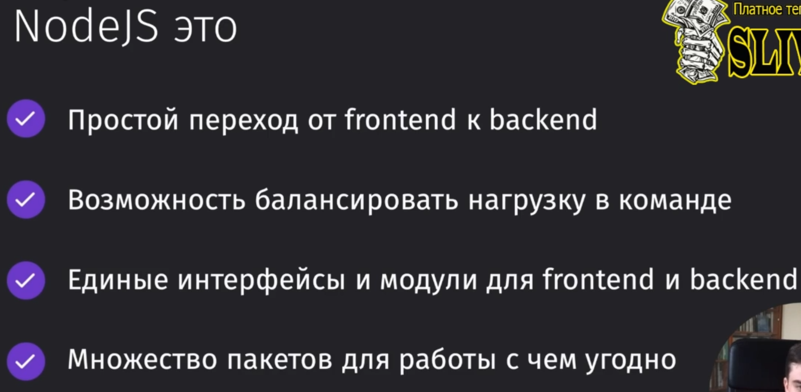
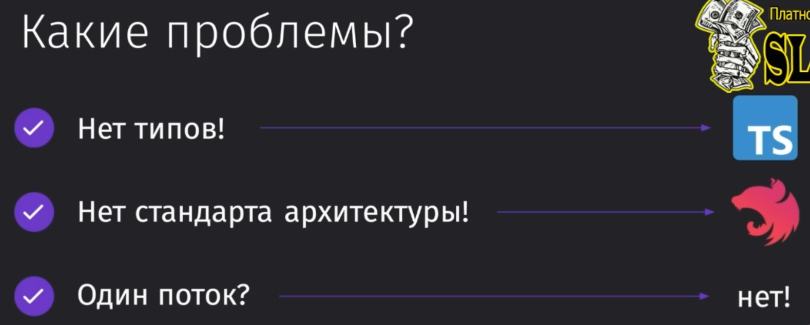

## 01 Введение

### 001 Почему NodeJS для backend

Преимущества в использовании ноды на проектах:

- Для чего используется нода?
	- Backend for fronend (написание фронтендерами полноценных запросов, которые можно встретить на бэке)
	- Rest API
	- Backend (Написание полноценного бэка для сайта)
	- Document generators (перевод HTML-страницы в тот же pdf)
	- Microservices (реализация микросервисной архитектуры)
	- Test automation (самая удобная автоматизация тестов - cypress)
	- Graph QL
	- Web-sraping (парсинг HTML-страниц)
	- SSR (рендер страницы на сервере)
- Где ноду не стоит использовать?
	- Низкоуровневые приложения (работать непосредственно с компьютером достаточно сложно)
	- Сложные многопоточные приложения (очень сложная реализация нагруженного многопоточного приложения)
	- Программирование микроконтроллеров (выгоднее использовать C/C++, Rust)

Какие проблемы у ноды и чем их решить:
- ==Однопоточность==. Основной поток в ноде всего один, но у нас есть Red Pool, биндинги, распределение через libuv.
- ==Типизация==. TypeScript исправляет эту проблему.
- ==Архитектура==. Структурируем через NestJS.

