## 027 Устройство V8

Представление JS выглядит следующим образом:

- ==Javascript code== - это тот код, который мы пишем
- ==Abstract Syntaxis Tree== - это дерево, в которое уже интерпретируется весь наш код
- ==Byte code== - это следующий этап превращения кода, когда всё описывается 1-байтовыми величинами
- ==Машинный код== - код, который воспринимает машина

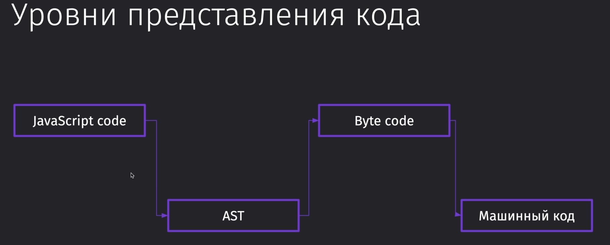

Само дерево выглядит примерно таким образом:
Мы видим функцию, что в ней находится в качестве экспрешшенов, операторы, отдельно связывание переменной и значения.

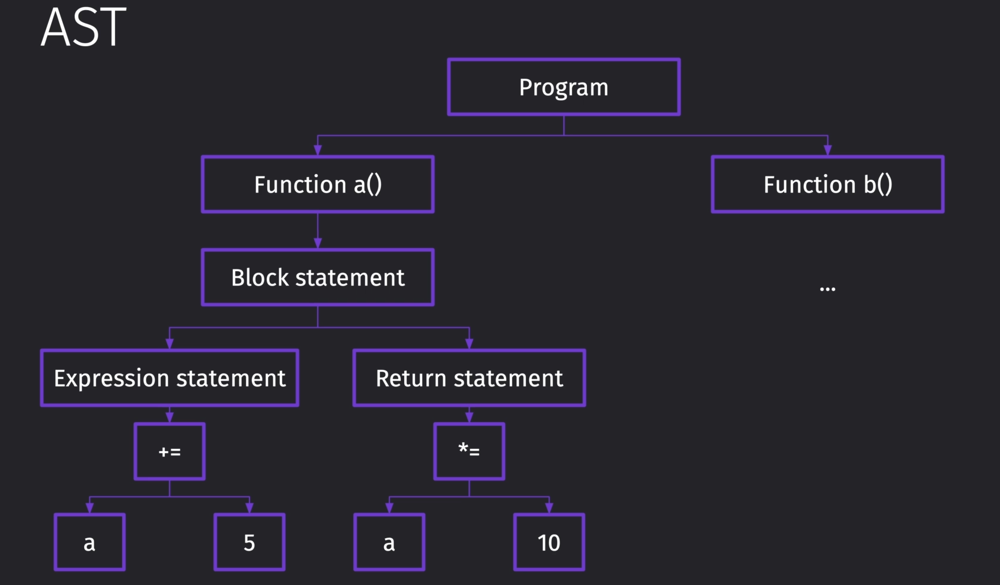

Дальше у нас идёт байткод. Это набор инструкций, который конкретно по регистрам говорит, что и куда класть, чтобы получить определённый результат.

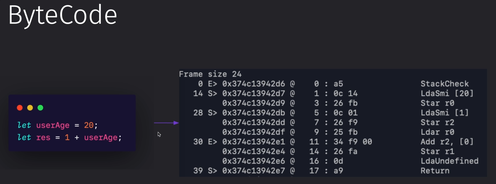

Ну и так же мы можем вывести непосредственно байткод нашего приложения, если на то будет потребность

```bash
node --print-bytecode byte.js
```

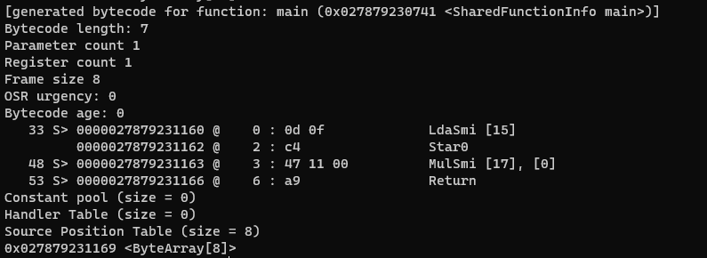

Как выглядит компиляция кода в нашем движке `V8`:

1. Мы имеем наш исходный ==Javascript code==
2. Дальше он проходит через парсер и преобразуется в ==AST==
3. После он преобразуется в ==байт код== интерпретатором
4. После чего выбираются два основных пути:
    1. Используем компилятор `Turbofan`, если наш написанный код можно оптимизировать (например, если у нас постоянно повторяется операция умножения в коде, то её можно заоптимизировать)
    2. Используем компилятор `Sparkplug`, если наш написанный код нельзя оптимизировать

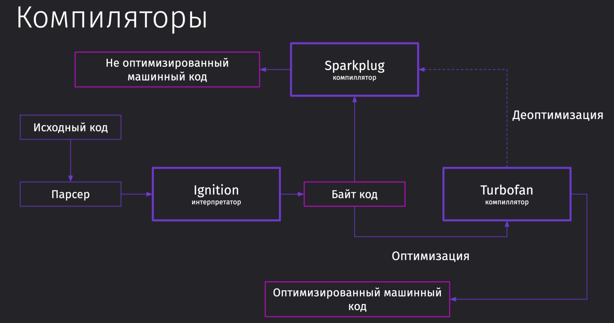

Пример:
Если мы создаём инстанс какого-либо объекта, то нужно сохранять порядок его свойств и количество свойств, чтобы код обрабатывался через оптимизированный компилятор

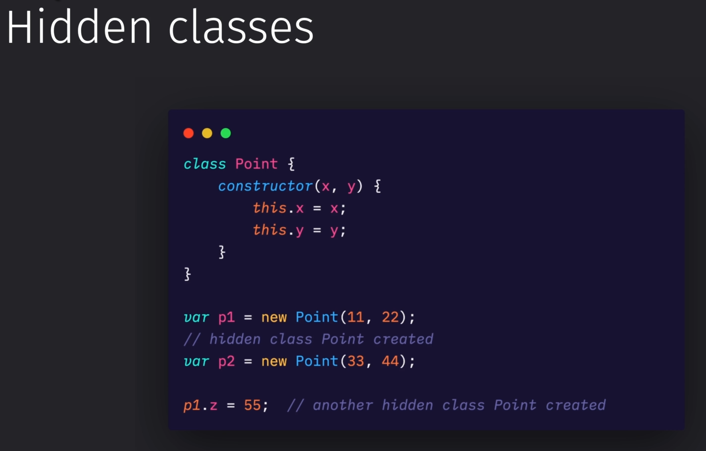

Используя TS такую оптимизацию будет поддерживать куда проще

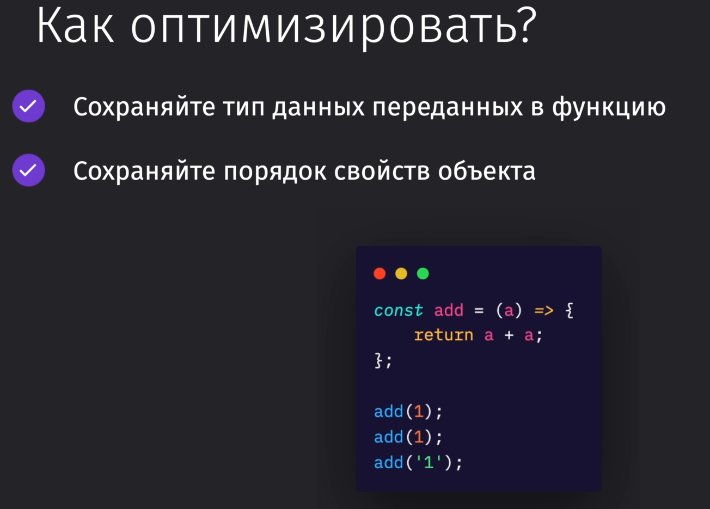

## 028 Работа с памятью


Данные очищаются ровно тогда, когда ни них не остаётся ссылок

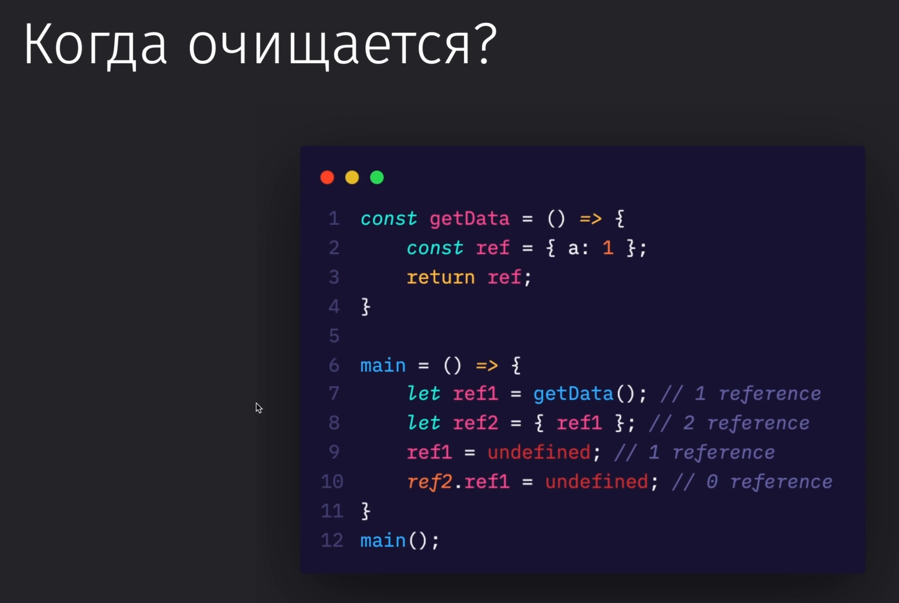

Если в этом дереве у нас пропадёт ссылка на другой объект и он окажется отвязанным от общего дерева, то этот объект удалится

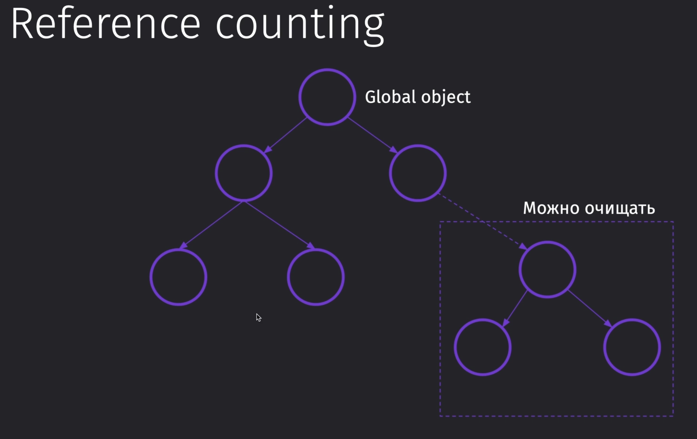

Проблема может оказаться в том, что объекты на удаление могут ссылаться друг на друга и тогда они не удалятся

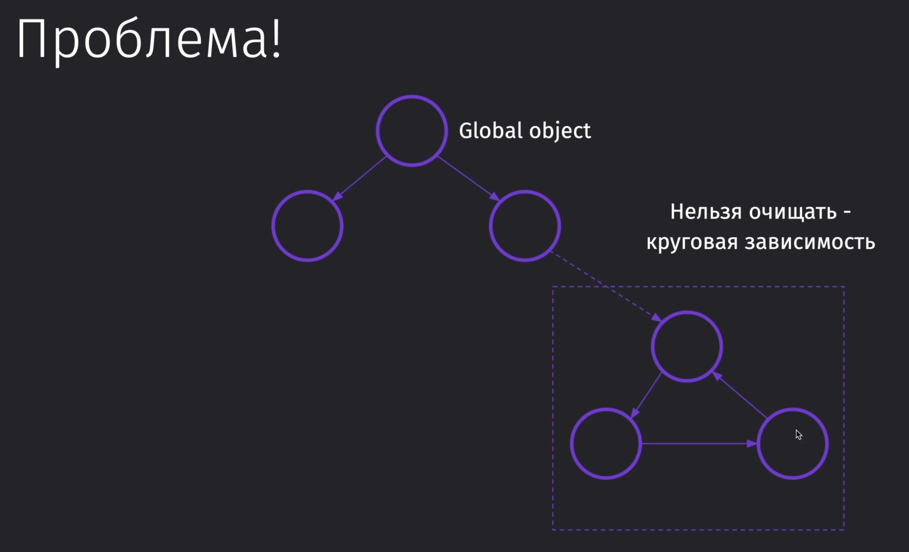

Тогда была придумана технология, которая помечала бы все объекты и очищала те, до которых она не может добраться.
Однако такая технология в реально работающем приложении очень сильно его стопорит и на каждое действие придётся вести пересчёт, что ведёт к потере ресурсов.

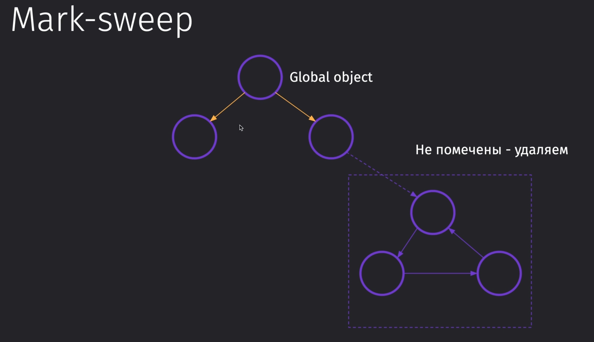

Тут уже представлен более продвинутый алгоритм, который используется в современных движках.
Основная идея трёхцветной маркировки заключается в том, что мы красим сначала самые ближние объекты к глобальному (прямая связь) в чёрный цвет, связанные с ними объекты - в серый. Дальше все связанные объекты, до которых мы можем достучаться, красим в чёрный. Все, до которых мы не достучались, являются у нас белыми, то есть никак от изначального не помеченными. Их мы удаляем.
Этот подход отличается тем, что мы запоминаем состояние связей и мы помечаем после каждого действия в программе по одному дополнительному уровню связей

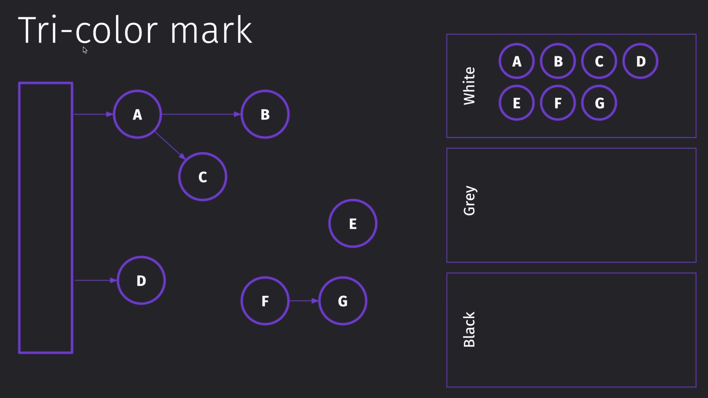
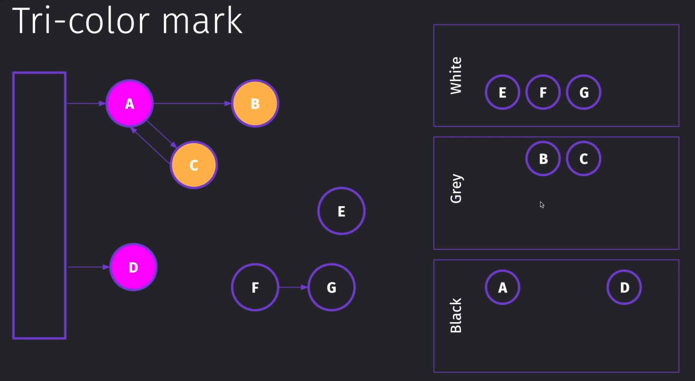
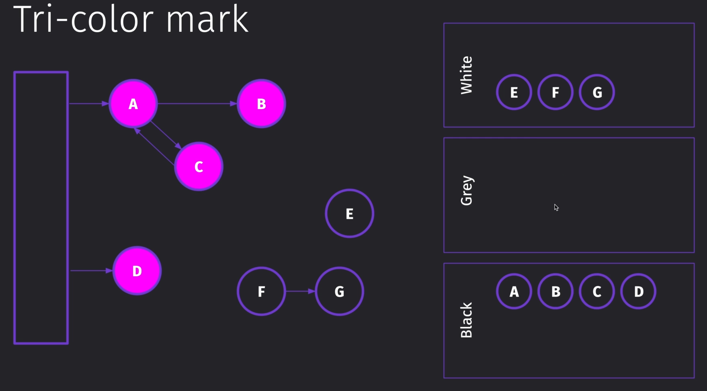

Ещё одна проблема, которая может образоваться, когда мы пользуемся нашим приложением - это фрагментация памяти, которая появляется тогда, когда мы попользовались объектом (1), а потом после этого объекта появились ещё объекты. Впоследствии объект (1) был удалён из-за чего образовалась дырка

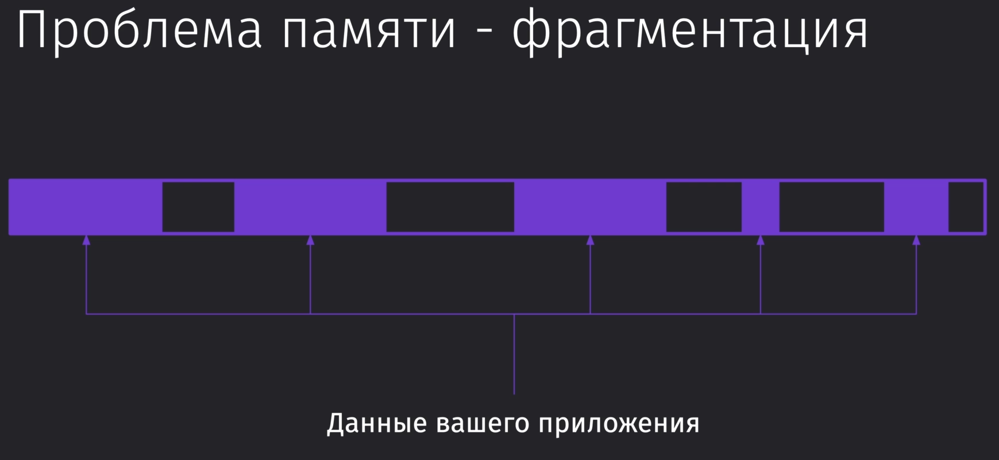

Для решения этой проблемы используется технология `from > to`, при которой мы копируем из области `from` наши оставшиеся объекты в область `to`, чтобы память осталась дефрагментированной

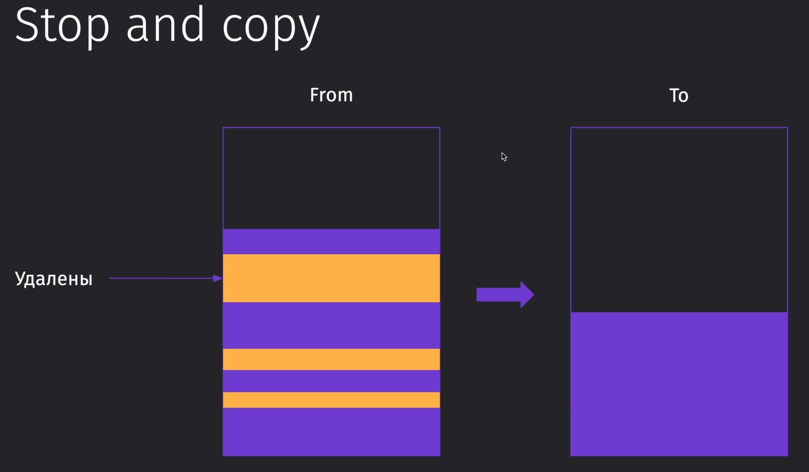

Идеально в нашем случае было бы иметь Reference counting, который бы производился инкрементально и периодически прогонять стопорящие технологии

(`Copying CG = Stop and Copy`)


Поколения памяти в движке `V8` делятся на три вида:

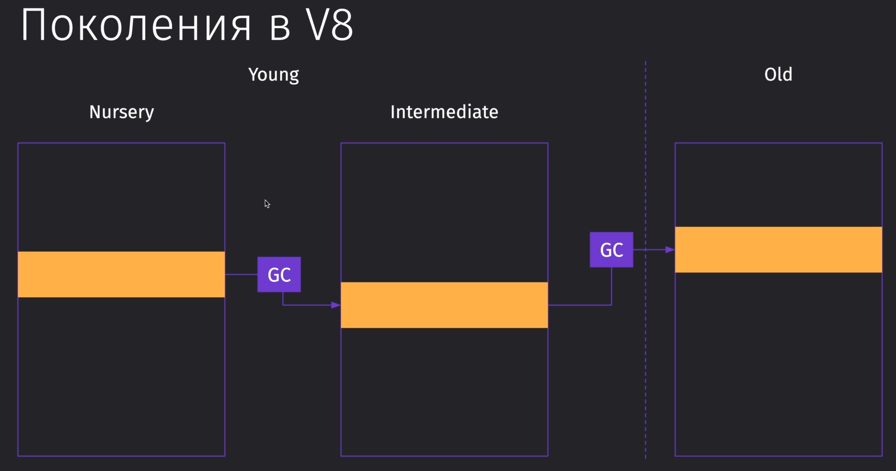

Что компилятор делает с молодой памятью и что со старой:


Так выглядит график потребляемой памяти приложением и на падения пиков работает сборщик мусора

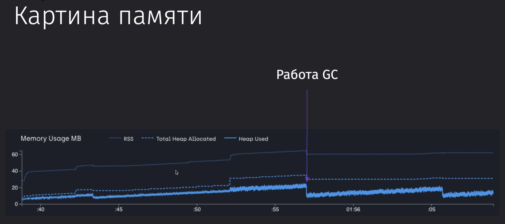

Данный код, представленный ниже, раньше вызывал сильные утечки данных в браузере. Сейчас эта проблема уже решена.

```JS
let outer = null;
let run = function () {
	let inner = outer;
	let unused = function () {
		if (inner) console.log("hi");
	};
	outer = {
		longStr: new Array(1000000).join("*"),
	};
};
setInterval(run, 1000);
```

Если нам нужно запустить этот код и посмотреть, как он отработает:

```bash
node --expose-gc --trace_gc_verbose app.js
```

`survival rate` определяет, сколько из нашего приложения осталось объектов после очистки. Далее мы можем увидеть все наши пространства и сколько они занимают места. Пространств больше, чем два (наше `old | new`), но описанные выше являются самыми основными

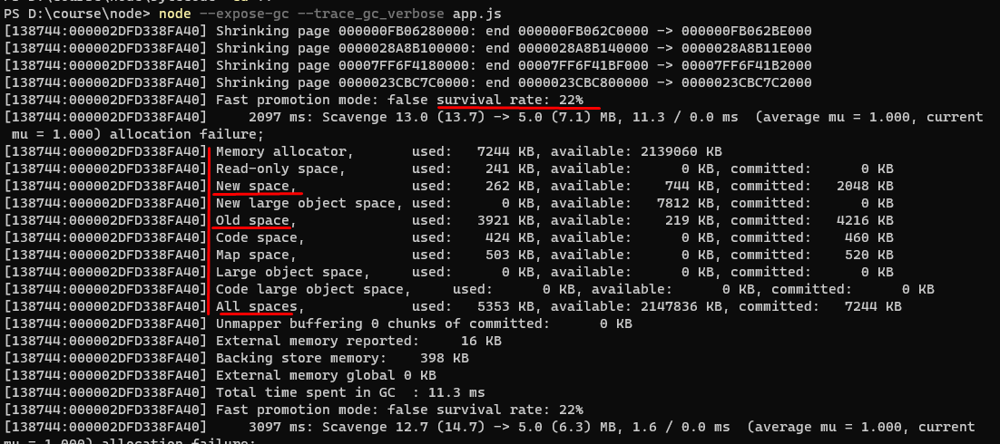
