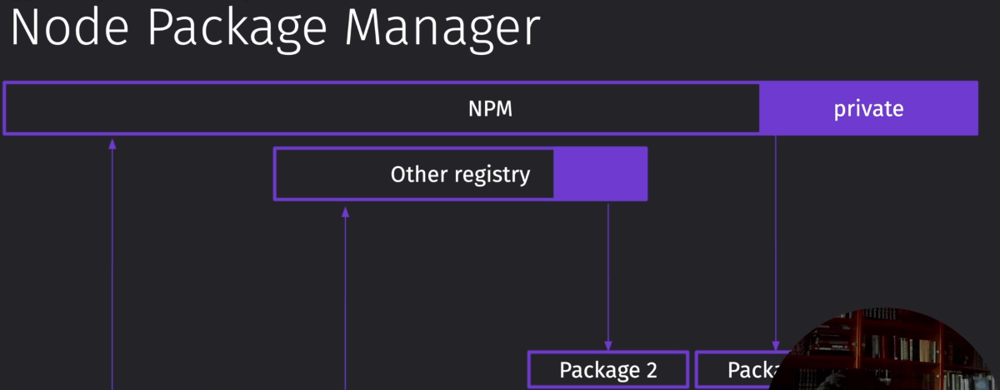
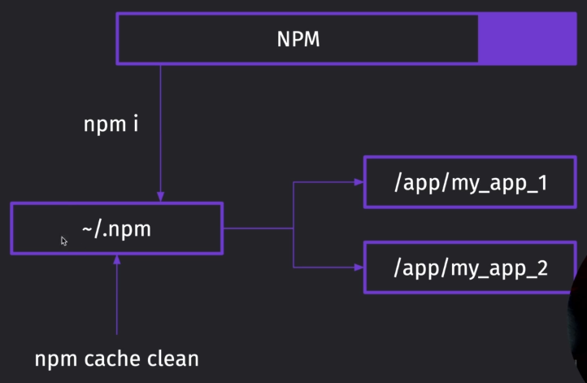
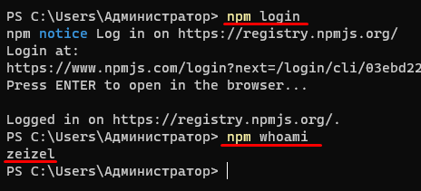
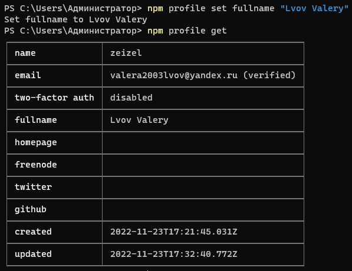
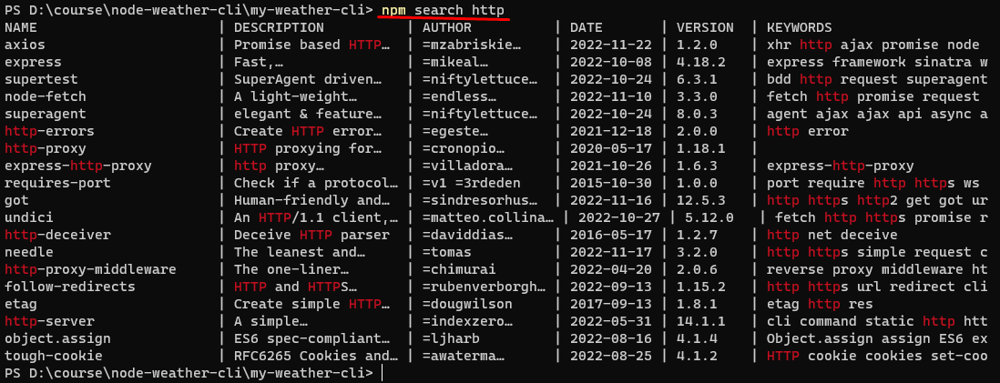
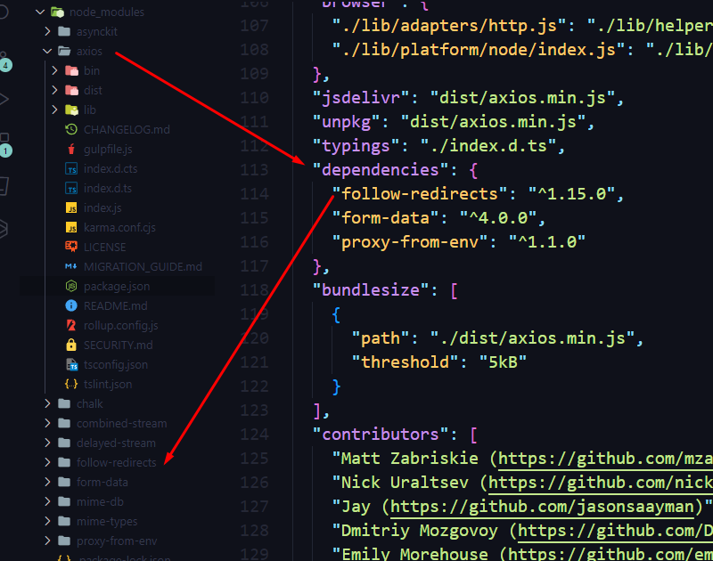
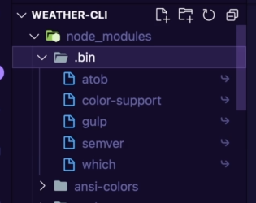
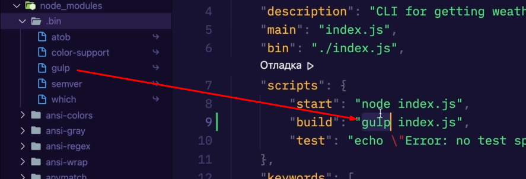

## 030 Обзор NPM

Самые популярные пакетные менеджеры:

- `npm` - самый популярный, простой и понятный менеджер
- `yarn` - разработанный `facebook` менеджер. Обычно устанавливается первая версия, которая не развивается, но так же имеется и третья версия
- `pnpm` - хранит все скачанные модули в одном месте, но имеет минус в более тяжёлой настройке
- `boar`

Если говорить про `NPM`, то мы имеем возможность загружать наши пакеты в него и скачивать для использования в отдельных приложениях. Так же имеется и приватный репозиторий.



Так же менеджер создаёт папку с частоиспользуемыми зависимостями, чтобы быстро их закидывать в наш проект



Эта команда позволяет быстро обновить `npm`

```bash
npm i -g npm
```

## 031 Авторизация и профиль

Далее у нас идут команды авторизации и редактирования информации нашего профиля

```bash
// даст войти в npm
npm login

// покажет, под каким пользователем сейчас находимся
npm whoami

// устанавливаем в наше окно информации об аккаунте значения
npm profile set fullname "Lvov Valery"

//получаем информацию об аккаунте
npm profile get

// выйти из аккаунта npm
npm logout
```

Таким образом мы можем залогиниться в наш профиль



А тут поменять информацию и вывести её



## 032 Разбор package.json

Первым делом нужно инициализировать пакет в `git` и `npm`

```bash
// далее добавим его в гит
git init
git add .
git commit -m "first commit"
git branch -M main
git remote add origin <ссылка_на_репозиторий>
git push -u origin main

// инициализируем наш проект с пэкеджем
npm init
```

И во время иннициализации `npm` начально настраиваем пэкэджер

```bash
package name: (my) weather-cli <имя пакета>
version: (1.0.0) <версия нашего пакета: мажор.минор.фикс-[aplha|beta]>
description: CLI for getting weather <о чём этот пакет>
entry point: (index.js) <входная точка в пакет>
test command:
git repository: <вставляем имеющийся репозиторий>
keywords: cli, weather, <ключевые слова по нашему пакету>
author: Lvov Valery <имя автора>
license: (ISC) MIT <вид лицензии>
```

И далее мы получаем такой файлик с нашими изначальными значениями:

`package.json`

```JSON
{
  "name": "weather-cli",
  "version": "1.0.0-alpha",
  "description": "CLI for getting weather",
  "main": "index.js",
  "scripts": {
    "test": "echo \"Error: no test specified\" && exit 1"
  },
  "keywords": [
    "cli",
    "weather"
  ],
  "author": "Lvov Valery",
  "license": "MIT"
}

```

- `name` - Само имя нашего пакета, которое будет отображаться у него при скачивании и установлении зависимостей
- `verison` - хранит в себе версию нашего пакета:
    - Мажорная версия проета - это breaking changes, которые конкретно меняют наш пакет и весь старый код может полететь.
    - Минорные изменения - это имплементация новых фич, которые дополняют мажорную версию.
    - И третья цифра - это мелкие фиксы старых багов.
- `description` - Кратное описание проекта
- `scripts` - хранит в себе консольные команды, которые мы можем быстро вызвать
- `homepage` - тут хранится ссылка на ваш сайт с этим пакетом
- `repository` - тут хранится репозиторий пакета
- `bugs` - сюда можно обратиться для баг-репортов
- `private` - тут определяется приватный пакет или нет
- `main` - это точка входа в пакет, и если она будет указана неправильно, то войти в приложение не получится
- `browser` - то же самое, что и main, но если мы публикуем фронт-эндовский пакет
- `bin` - это точка входа в приложение, если мы будем использовать его как отдельное приложение (например, CLI)
- `os` - указываем ограничения по поддерживаемым системам. Например `["win32"]` - поддерживается всё, кроме 32-ух разрядных ==Windows==
- `cpu` - поможет указать, какие процессоры поддерживаем или не поддерживаем (так же: `"cpu": ["!arm"]`)
- `man` - хранит в себе путь до мануала по данному пакету (`["./README.md"]`)
- `engines` - тут уже можно указать, какие версии ноды поддерживаются данным пакетом
- `funding` - тут указывается ссылка на сайт, где можно поддержать развитие проекта
- `files` - позволяет указать, какие файлы мы можем заливать с нашим пакетом, а какие нет (стоит вместо этого использовать гитигнор и нпмигнор)

Так выглядит забитый `json` наших настроек

`package.json`

```JSON
{
  "name": "weather-cli",
  "version": "1.0.0-alpha",
  "private": false,
  "description": "CLI for getting weather",
  "main": "index.js",
  "bin": "./index.js",
  "os": ["!win32"],
  "cpu": ["!arm"],
  "man": ["./README.md"],
  "engines": {
    "node": ">14"
  },
  "files": ["./src/**/*.js"],
  "funding": [],
  "scripts": {
    "test": "echo \"Error: no test specified\" && exit 1"
  },
  "keywords": [
    "cli",
    "weather"
  ],
  "author": "Lvov Valery",
  "license": "MIT",
  "homepage": "http://www.weather",
  "repository": {
    "type": "git",
    "url": "https://github.com/ZeiZel/npm-weather-cli"
  },
  "bugs": {
    "url": "https://github.com/",
    "email": "valera2003lvov@yandex.ru"
  }
}
```

Тут будут храниться те данные, которые мы не хотим загружать в гит

`.gitignore`

```md
/dist
/node_modules
```

Тут будут храниться файлы, которые мы не хотим загружать на сайт `npm`

`.npmignore`

```md
/.vscode
/.idea
```

## 033 Управление зависимостями

`package-lock.json` хранит в себе залоченные версии наших зависимостей. Если нам важно сохранять их, то стоит отправлять этот файл на гитхаб.

Базовые операции, которые нам нужно проводить:

```bash
// установит нужный нам модуль
npm install <модуль>

// поможет найти в консоли модуль, который может нам помочь
npm search <ключевое_слово>

// установит все зависимости из package.json, если таковые уже заранее имеются
npm i

// проверяет наши модули на потенциально небезопасные связи
npm audit

// исправит ошибки, которые аудит сможет исправить
npm audit fix --force

// полностью переустанавливает папку нод модулей, учитывая package-lock
npm ci

// покажет модули, авторов которых можно поддержать
npm fund

// ! две полезные команды, если будут ошибки связей
// позволит верифицировать связи наших модулей
npm cache verify
// позволит очистить кэш и заново установить зависимости с ошибками
npm cache clear
```



И здесь отображены наши зависимости модулей:
В реальности мы буем использовать только `dependencies` (для работы приложения), `devDependencies` (для разработки приложения) и `peerDependencies` (для написания своих плагинов к модулям)

```JSON
// это зависимости для работы самого приложения
"dependencies": {}

// это зависимости для работы наших инструментов разработки (gulp, webpack, typescript)
"devDependencies": {}

// позволяет указать, что для работы пакета нужны другие зависимости / то есть позволяет эффективно указать, что у нашего пакета есть обязательные зависимости (например, мы пишем свой плагин для nestjs и без него нельзя будет запускаться несту и работать)
"peerDependencies": {}

// это мета-информация для peerDependencies, которая позволяет указать дополнительные настройки (например, фейлиться ли нашему приложению при отсутствии модуля)
"peerDependenciesMeta": {}

// опциональные зависимости - необязательные
"optionalDependencies": {}
```

Так выглядит работа с нужными для нас модулями:

```bash
// установка пакета с зависимостями для рантайма
npm i axios chalk dedent-js

// установка пакета с зависимостями для разработки
npm i -D gulp

// удаляет пакет из проекта и все его зависимости
npm uni gulp

// установка пакета в глобальное пространство (теперь его можно будет вызвать отовсюду)
npm i -g gulp
```

Тут мы можем определить, какая версия модуля нам нужна будет в дальнейшем

```JSON
{
	"axios": "^1.2.0", // будет поднимать все версии, кроме мажорных
	"axios": "~1.2.0", // будет поднимать только версии фиксов
	"axios": "1.2.0" // не будет поднимать версию совсем
}
```

И так же у наших установленных модулей есть свои зависимости, которые так же дополнительно нам устанавливаются. Тут нужно сказать, что не нужно на каждую свою задачу искать модуль, так как модули сильно разрастутся и нам сложно будет отследить модуль с уязвимостью или вирусом, так как от него будет много что зависеть



Папка `.bin` хранит в себе бинарники вызова самой утилиты



Этот бинарник вызывается, когда мы упомянаем наш плагин в скриптах


