## 034 Обзор приложения

Наше приложение будет работать в консоли и выводить погоду по запросу пользователя

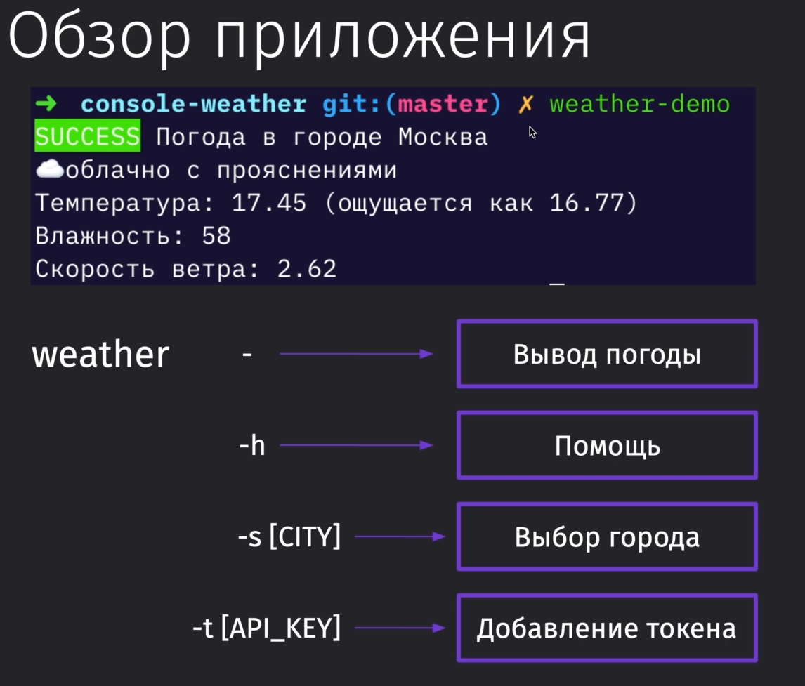

Приложение будет стилизованным, получать аргументы и работать со сторонним API


###### Получать погоду будем [отсюда](https://openweathermap.org/)

## 035 Аргументы командной строки

Поменяем точку входа в приложение и добавим бинарник, чтобы при глобальной установке нашего модуля, можно было его запустить и воспользоваться им. Так же импорты будем использовать в виде модулей, а не коммона

```JSON
"main": "weather.js",
"bin": {
	"weather": "weather.js"
},
"type": "module",
```

Эту строчку укажем в файле входа в наше приложение, чтобы указать системе как запускать этот файл

```JS
#!/usr/bin/env node
```

Объект `process.argv` хранит аргументы, которые мы передали на данный момент в консоль

```JS
#!/usr/bin/env node

const initCLI = () => {
	console.log(process.argv);
};

initCLI();
```

И тут мы можем увидеть все аргументы, что напишем в консоль

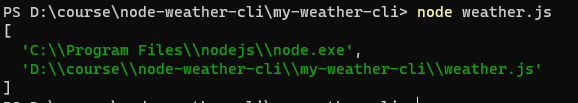

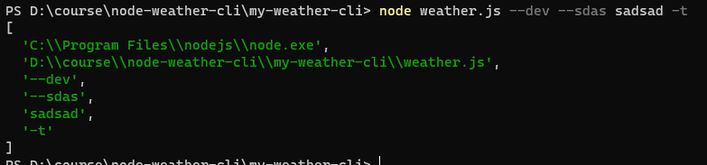

Ну и далее опишем логику реализации получения

`helpers > args.js`

```JS
// эта функция будет получать аргументы, которые мы передали в скрипт терминала
const getArgs = (args) => {
	// этот объект будет хранить результат с флагами
	const res = {};
	// тут мы раскладываем наш массив
	// первые два значения - это вызыватель и вызываемый файл
	// всё остальное (rest) - это переданные аргументы
	const [executer, file, ...rest] = args;

	// отдельное значение, индекс, исходный массив
	rest.forEach((value, i, array) => {
		// если первое значение это "-", то ...
		if (value.charAt(0) == "-") {
			// если мы дошли до последнего элемента (после дефиса ничего нет)
			if (i == array.length - 1) {
				// то по ключу этого значения просто поставим true
				res[value.substring(1)] = true;

				// ... однако если второе значение уже какая-то буква, а не "-" или пустота, то ...
			} else if (array[i + 1].charAt(0) != "-") {
				// ключ в res создаём без первого минуса в значении (откидываем "-") и добавляем следующий аргумент в качестве значения флага
				res[value.substring(1)] = array[i + 1];

				// ... однако, если у нас есть второй элемент, содержащий "-", то ...
			} else {
				res[value.substring(1)] = true;
			}
		}
	});

	return res;
};

export { getArgs };
```

И тут выведем в качестве объекта наши полученные значения ключей

`weather.js`

```JS
#!/usr/bin/env node
import { getArgs } from "./helpers/args.js";

const initCLI = () => {
	const args = getArgs(process.argv);
	console.log(args);

	if (args.h) {
		// вывод help
	}

	if (args.s) {
		// сохранить город
	}

	if (args.t) {
		// сохранить токен
	}

	// Вывести погоду
};

initCLI();
```

Можно увидеть, что нашим ключам присваивается значение, если мы его передали следующим аргументом

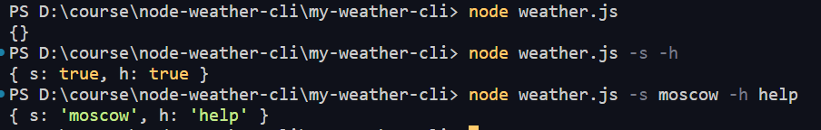

## 036 Вывод в консоль

Дальше мы создадим сервис, который будет реализовывать различные выводы в консоль

Для того, чтобы покрасить текст в разные цвета, нужно будет воспользоваться модулем `chalk`, в котором есть красивые раскраски нашего текста в консоли

`services > log.service.js`

```JS
import chalk from "chalk";
import dedent from "dedent-js";

// выводим ошибку
const printError = (error) => {
	console.log(`${chalk.bgRed(" ERROR")} ${error}`);
};

// выводим оповещение об успешном запросе
const printSuccess = (success) => {
	console.log(`${chalk.bgGreen(" Success")} ${success}`);
};

// выводим помощь нашему пользователю
const printHelp = () => {
	console.log(
		dedent`
			${chalk.bgCyan(" HELP ")}
			Без параметров - вывод погоды
			-s [CITY] для установки города
			-t [API_KEY] для установки токена
			-h для показа помощи
		`
	);
};

export { printError, printSuccess, printHelp };
```

Тут мы будем вызывать сами наши функции для вывода информации

`weather.js`

```JS
#!/usr/bin/env node
import { getArgs } from "./helpers/args.js";
import { printHelp, printError, printSuccess } from "./services/log.service.js";

const initCLI = () => {
	const args = getArgs(process.argv);

	if (args.h) {
		printHelp();
	}

	if (args.s) {
		// сохранить город
	}

	if (args.t) {
		// сохранить токен
	}

	// Вывести погоду
};

initCLI();
```

И тут можно встретиться с такой проблемой, что у нас текст перенимает те же отступы, что и в коде. Их можно исправить, убрав отступы в коде, но можно их убрать через отдельный модуль `dedent-js`

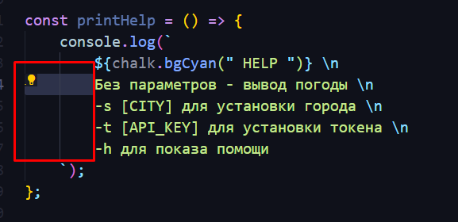
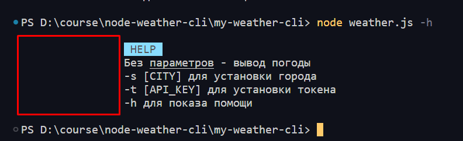

Отдельно хочется рассказать про краткую запись передачи строки внутрь функции. Конкретно тут мы не оборачивали строку в `()`. Тут достаточно просто написать функцию и сразу после в кавычках строку, чтобы передать значение внутрь неё:

```JS
dedent`строка`
```

```JS
console.log(
		dedent`
			${chalk.bgCyan(" HELP ")}
			Без параметров - вывод погоды
			-s [CITY] для установки города
			-t [API_KEY] для установки токена
			-h для показа помощи
		`
	);
```

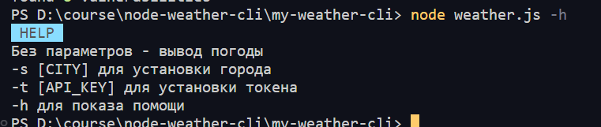

## 037 OS и path

Далее мы можем подготовиться к реализации функциональности записи данных в отдельное хранилище, которое будет находиться в домашней директории ПК

`weather.js`

```JS
#!/usr/bin/env node
import { getArgs } from "./helpers/args.js";
import { printHelp, printError, printSuccess } from "./services/log.service.js";
import { saveKeyValue } from "./services/storage.service.js";

const initCLI = () => {
	const args = getArgs(process.argv);

	if (args.h) {
		printHelp();
	}

	if (args.s) {
		// сохранить город
	}

	if (args.t) {
		saveKeyValue("token", args.t);
	}

	// Вывести погоду
};

initCLI();
```

Тут мы получаем доступ к домашней директории нашей операционной системы

`services > storage.service.js`

```JS
// os - это библиотека для работы с операционной системой
// homedir - выведет домашнюю директорию (учитывая ОС)
import { homedir } from "os";
// path - это библиотека для работы с путями
// join - позволяет из нескольких аргументов строить ПРАВИЛЬНЫЙ путь
import { join } from "path";

const filePath = join(homedir(), "weather-data.json");

const saveKeyValue = (key, value) => {
};

export { saveKeyValue };
```

Библиотека `path`:

- `join()` -
- `basename()` - выведет вложение последней папки
- `dirname()` - покажет, где находится указанный в строке путь
- `extname()` - получаем расширение файла
- `relative()` - показывает путь относительно двух элементов (что нужно сделать, чтобы прийти от первого элемента ко второму)
- `isAbsolute()` - проверяет, абсолютный ли путь
- `resolve()` - покажет путь, который будет, если выполнить определённые шаги (отходит относительно текущей папки)
- `sep` - покажет, какой сепаратор используется в нашей операционной системе (`/` или `\`)


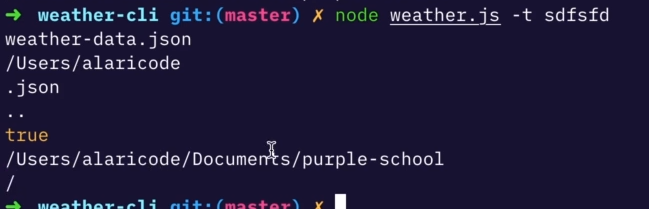

## 038 Работа с файловой системой

Дополним наш сервис по сохранению данных. Конкретно тут нужно было реализовать:

- создание файла,
- проверку его существования,
- сохранения его данных в память, если файл существует, чтобы в будущем переписать его значения

Нужно отметить, что тут мы не пользовались библиотекой `writeFile` или `writeFileSync`. Вместо них мы использовали `promises`, который предоставляет тот же стандартный функционал, но в виде промисов.

`services > storage.service.js`

```JS
// os - это библиотека для работы с операционной системой
// homedir - выведет домашнюю директорию (учитывая ОС)
import { homedir } from "os";
// path - это библиотека для работы с путями
// join - позволяет из нескольких аргументов строить ПРАВИЛЬНЫЙ путь
import { join } from "path";
// fs - это модуль по работе с файловой системой нашего ПК
import { promises } from "fs";

// создаём путь до нашего файла, в который мы будем сохранять данные
const filePath = join(homedir(), "weather-data.json");

// это функция сохранения наших данных в отдельном файле
const saveKeyValue = async (key, value) => {
	// это наши данные из файла, поэтому они должны быть изменяемыми (let)
	let data = {};

	// если файл по данному пути существует, то мы можем сохранить его данные в ОЗУ
	if (await isExist(filePath)) {
		const file = await promises.readFile(filePath);
		data = JSON.parse(file);
	}

	// Далее занести новые данные в data
	data[key] = value;

	// и теперь мы можем перезаписать наш файл
	await promises.writeFile(filePath, JSON.stringify(data));
};

// далее мы получаем ключ нашего значения
const getKeyValue = async (key) => {
	if (await isExist(filePath)) {
		const file = await promises.readFile(filePath);
		const data = JSON.parse(file);
		// вернёт ключ данных, если они существуют
		return data[key];
	}
	// и ничего не вернёт, если проверка не прошла
	return undefined;
};

// Эта функция проверит, существует ли данный файл
const isExist = async (path) => {
	try {
		// stat возвращает статистику по файлу, но если файла нет, то он падает
		await promises.stat(path);
		// да, так как он смог вернуть статистику
		return true;
	} catch (e) {
		// и нет, так как статистику не вернул и функция упала
		return false;
	}
};

export { saveKeyValue, getKeyValue };
```

Тут же мы сделаем проверку на сохранение токена и так же оповестим пользователя о статусе операции

`weather.js`

```JS
#!/usr/bin/env node
import { getArgs } from "./helpers/args.js";
import { printHelp, printError, printSuccess } from "./services/log.service.js";
import { saveKeyValue } from "./services/storage.service.js";

// сохранение токена и уведомление о завершении операции
const saveToken = async (token) => {
	// проверяем наличие токена
	if (!token.length) {
		printError("Не передан токен");
		return;
	}

	// само выполнение сохранения и уведомления
	try {
		await saveKeyValue("token", token);
		printSuccess("Токен сохранён");
	} catch (e) {
		printError("Токен не удалось сохранить :( " + e.message);
	}
};

const initCLI = () => {
	const args = getArgs(process.argv);

	if (args.h) {
		printHelp();
	}

	if (args.s) {
		// сохранить город
	}

	if (args.t) {
		return saveToken(args.t);
	}

	// Вывести погоду
};

initCLI();
```

Как итог, мы имеем сгенерированный нами файл с токеном

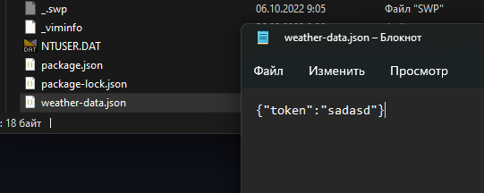

## 039 Взаимодействие с API

Первым делом, после регистрации, нужно получить токен

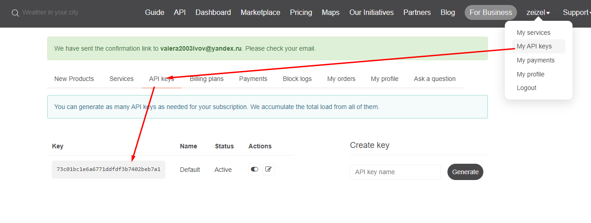

Затем нам этот токен нужно сохранить в программе

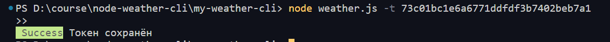

Дальше, чтобы реализовывать запросы на наш сервер для получения данных, нужно перейти в документацию по получению запросов

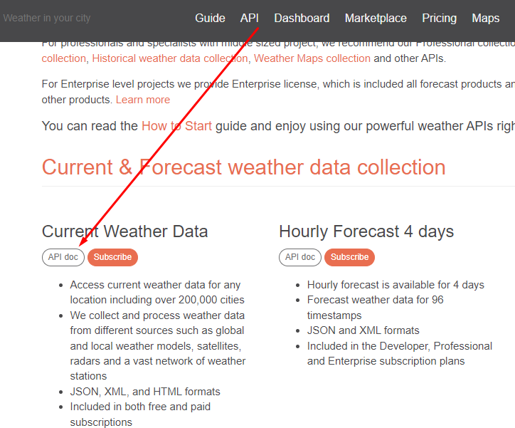

Так же для реализации безопасности (чтобы мы не допустили ошибок при вводе имени ключа), нужно создать словарь, который будет хранить ключи наших значений в файле

`storage.service.js`

```JS
// тут мы создаём словарь, который будет хранить названия наших ключей в файле storage
const TOKEN_DICTIONARY = {
	token: "token",
	city: "city",
};

export { saveKeyValue, getKeyValue, TOKEN_DICTIONARY };
```

И использовать вместо текста `"token"` определённое значение

`weather.js`

```JS
#!/usr/bin/env node
import { getArgs } from "./helpers/args.js";
import { getWeather } from "./services/api.service.js";
import { printHelp, printError, printSuccess } from "./services/log.service.js";
import { saveKeyValue, TOKEN_DICTIONARY } from "./services/storage.service.js";

// сохранение токена и уведомление о завершении операции
const saveToken = async (token) => {
	// проверяем наличие токена
	if (!token.length) {
		printError("Не передан токен");
		return;
	}

	// само выполнение сохранения и уведомления
	try {
		await saveKeyValue(TOKEN_DICTIONARY.token, token);
		printSuccess("Токен сохранён");
	} catch (e) {
		printError("Токен не удалось сохранить :( " + e.message);
	}
};
```

Сначала попробуем реализовать дефолтный вызов погоды без использования `axios` обычным запросом на удалённый сервер через модуль `https`

`api.service.js`

```JS
// подключаем модуль по работе с ссылками
import https from "https";
import { getKeyValue, TOKEN_DICTIONARY } from "./storage.service.js";

const getWeather = async (city) => {
	return new Promise(async (resolve, reject) => {
		// получаем из нашего словаря токен
		const token = await getKeyValue(TOKEN_DICTIONARY.token);
		if (!token) {
			throw new Error(
				"Токен не задан! Задайте его через команду -t [API_KEY]"
			);
		}

		// вместо того, чтобы конструировать нашу ссылку самостоятельно
		// const url = `https://api.openweathermap.org/data/2.5/weather?q=${city}&appid=${key}`;
		// можно создать ссылку через инстанс URL и модифицировать её
		const url = new URL("https://api.openweathermap.org/data/2.5/weather");
		// добавим город
		url.searchParams.append("q", city);
		// добавим токен
		url.searchParams.append("appid", token);
		// язык выдачи - русский
		url.searchParams.append("lang", "ru");
		// единицы измерения - метрические
		url.searchParams.append("units", "metrics");

		// и отправляем запрос о получении данных с сервера
		https.get(url, (response) => {
			let res = ""; // заготовка под результат

			// при получении куска данных (chunk)
			response.on("data", (chunk) => {
				// мы будем добавлять эти данные в результат
				res += chunk;
			});

			// когда соединение закончится, можно будет вывести результат
			response.on("end", () => {
				resolve(console.log(res));
			});

			// далее мы подписываемся на ошибку, если таковая будет
			response.on("error", (err) => {
				reject(err);
			});
		});
	});
};

export { getWeather };
```

Тут мы вызываем нашу функцию для просмотра погоды

`weather.js`

```JS
const initCLI = () => {
	const args = getArgs(process.argv);

	if (args.h) {
		printHelp();
	}

	if (args.s) {
		// сохранить город
	}

	if (args.t) {
		return saveToken(args.t);
	}

	// вызовем метод получения данных о погоде
	getWeather("moscow");
};
```

Тут можно увидеть нераспаршеный текст ответа от сервера

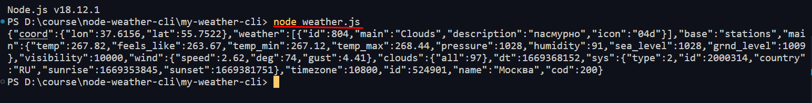

Далее реализуем функционал нашего сервиса получения данных с помощью библиотеки запросов `axios`. Главным его преймуществом является то, что мы можем ввести очень быстро параметры, которые сформируют нашу ссылку и отправить запрос на сервер

```JS
// подключаем модуль по работе с ссылками
import axios from "axios";
import https from "https";
import { getKeyValue, TOKEN_DICTIONARY } from "./storage.service.js";

const getWeather = async (city) => {
	// получаем из нашего словаря токен
	const token = await getKeyValue(TOKEN_DICTIONARY.token);
	if (!token) {
		throw new Error(
			"Токен не задан! Задайте его через команду -t [API_KEY]"
		);
	}

	// так же мы можем воспользоваться библиотекой axios, чтобы совершить быстрый запрос к нашему серверу на получение данных
	const { data } = await axios.get(
		"https://api.openweathermap.org/data/2.5/weather",
		{
			params: {
				q: city,
				appid: token,
				lang: "ru",
				units: "metric",
			},
		}
	);

	console.log(data); // надо будет удалить эту строку - она для примера
	return data;
};

export { getWeather };
```

На выходе мы получим уже готовый JSON-файл

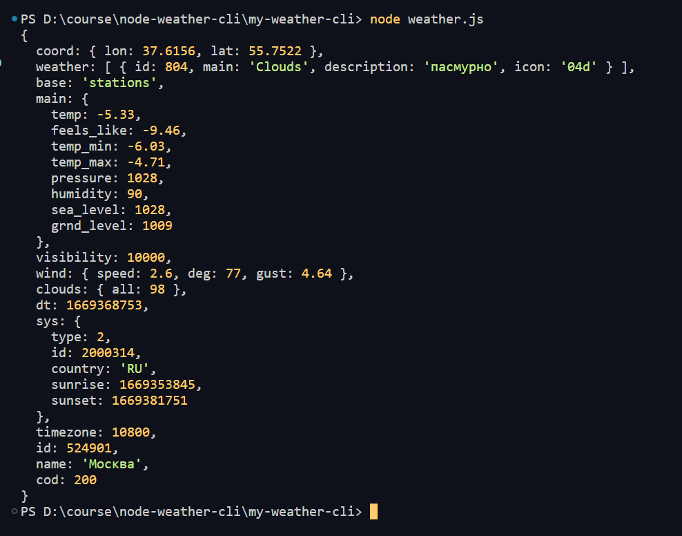

## 040 Переменные окружения

Переменные окружения - это переменные, к котором мы можем получить доступ во время разработки из любой части программы. Они могут очень сильно помочь, например, для корректирования работы приложения в разных режимах работы (разработка/продакш) или для сохранения глобальных данных (например, для сохранения токена и модификации его)

```JS
console.log(process.env);
```

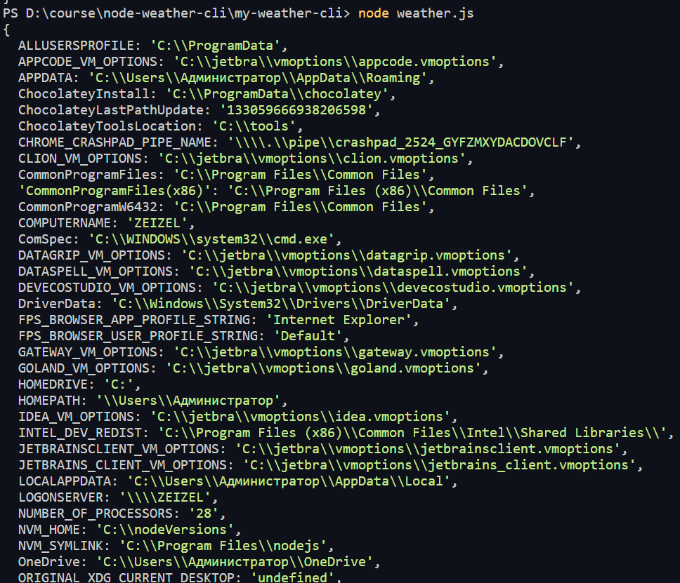

И тут у нас пример, что мы можем задать свой токен и модифицировать его в любой момент. В другой части приложения мы используем либо токен из глобального окружения, если он имеется, либо получаем токен стандартным путём

```JS
// weather.js
process.env.TOKEN = "73c01bc1e6a6771ddfdf3b7402beb7a1";

// api.service.js
const token = process.env.TOKEN ?? await getKeyValue(TOKEN_DICTIONARY.token);
```

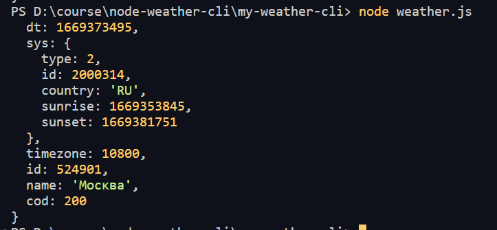

## 041 Обработка ошибок

Изначально мы имеем две явные возможные ошибки: неверный город - `401`, неверный токен - `404`

Для начала, нужно вынести вызов самой функции получения данных в другую функцию, которая уже будет обрабатывать ==специфические ошибки==, которые можно получить через `axios`

`weather.js`

```JS
const getForecast = async () => {
	const weather = await getWeather("moscow");
	console.log(weather);
};

const initCLI = () => {
	const args = getArgs(process.argv);

	// console.log(process.env.TOKEN);

	if (args.h) {
		printHelp();
	}

	if (args.s) {
		// сохранить город
	}

	if (args.t) {
		return saveToken(args.t);
	}

	// вызовем метод получения данных о погоде
	getForecast();
};

initCLI();
```

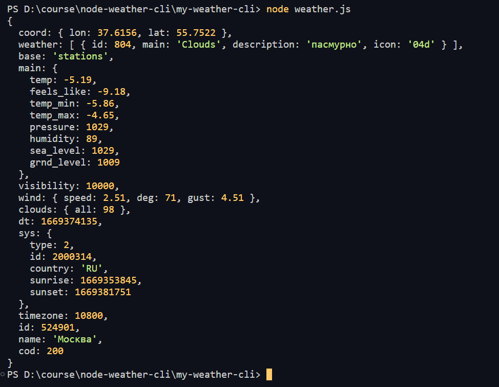

И сейчас мы можем проверить, что у нас идеально отрабатывает наша проверка ошибок. Коды ошибок мы использовали те, что возвращает нам `axios` - свои специальные

`weather.js`

```JS
process.env.TOKEN = "73c01bc1e6a6771ddfdf3b7402beb7a1";
process.env.CITY = "mosco"; // ! "moscow"

const getForecast = async () => {
	try {
		const weather = await getWeather(process.env.CITY);
		console.log(weather);
	} catch (e) {
		if (e?.response?.status === 404) {
			printError("Неверно указан город");
			return;
		} else if (e.response.status === 401) {
			printError("Неверно указан токен");
			return;
		} else {
			printError(e.message);
		}
	}
};
```

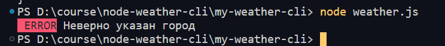

## 042 Упражнение - Завершение приложения

Далее нам нужно реализовать сохранение города с проверкой на то, что город правильно введён. Так же нам нужно реализовать красивый вывод погоды в консоли.

В модуле работы с `api`, было добавлено условие, которое по полученным данным погоды на улице, возвращает нам символ с погодой (смайлик)

`api.service.js`

```JS
// подключаем модуль по работе с ссылками
import axios from "axios";
import https from "https";
import { getKeyValue, TOKEN_DICTIONARY } from "./storage.service.js";

// Это функция для получения изображения под каждую погоду
const getIcon = (icon) => {
	switch (icon.slice(0, -1)) {
		case "01":
			return "☀️";
		case "02":
			return "🌤️";
		case "03":
			return "☁️";
		case "04":
			return "☁️";
		case "09":
			return "🌧️";
		case "10":
			return "🌦️";
		case "11":
			return "🌩️";
		case "13":
			return "❄️";
		case "50":
			return "🌫️";
	}
};

const getWeather = async (city) => {
	// получаем из нашего словаря токен
	const token =
		process.env.TOKEN ?? (await getKeyValue(TOKEN_DICTIONARY.token));
	if (!token) {
		throw new Error(
			"Токен не задан! Задайте его через команду -t [API_KEY]"
		);
	}

	// так же мы можем воспользоваться библиотекой axios, чтобы совершить быстрый запрос к нашему серверу на получение данных
	const { data } = await axios.get(
		"https://api.openweathermap.org/data/2.5/weather",
		{
			params: {
				q: city,
				appid: token,
				lang: "ru",
				units: "metric",
			},
		}
	);
	return data;
};

export { getWeather, getIcon };
```

В логе была реализована функция `printWeather`, которая выводит нам данные о погоде

`log.service.js`

```JS
// эта библиотека красит выводы текста
import chalk from "chalk";
// эта библиотека удаляет табуляцию при использовании косых кавычек
import dedent from "dedent-js";

// выводим ошибку
const printError = (error) => {
	console.log(`${chalk.bgRed(" ERROR")} ${error}`);
};

// оповещаем об успехе
const printSuccess = (success) => {
	console.log(`${chalk.bgGreen(" Success")} ${success}`);
};

// выводим помощь
const printHelp = () => {
	console.log(
		dedent`
			${chalk.bgCyan(" HELP ")}
			Без параметров - вывод погоды
			-s [CITY] для установки города
			-t [API_KEY] для установки токена
			-h для показа помощи
		`
	);
};

const printWeather = (res, icon) => {
	console.log(
		dedent`
			${chalk.bgMagenta(" ПОГОДА ")} погода в городе ${res.name}
			${icon}  ${res.weather[0].description}
			Температура: ${Math.round(res.main.temp)}
			Чувствуется как: ${Math.round(res.main.feels_like)}
			Влажность: ${res.main.humidity}%
			Скорость ветра: ${Math.round(res.wind.speed)} м/с
			`
	);
};

export { printError, printSuccess, printHelp, printWeather };
```

И уже тут был доработан вывод данных и реализована функция `saveCity`, которая сохраняла город

`weather.js`

```JS
#!/usr/bin/env node
import { getArgs } from "./helpers/args.js";
import { getWeather, getIcon } from "./services/api.service.js";
import {
	printHelp,
	printError,
	printSuccess,
	printWeather,
} from "./services/log.service.js";
import {
	saveKeyValue,
	getKeyValue,
	TOKEN_DICTIONARY,
} from "./services/storage.service.js";

process.env.TOKEN = "73c01bc1e6a6771ddfdf3b7402beb7a1";
process.env.CITY = "moscow";

// сохранение токена и уведомление о завершении операции
const saveToken = async (token) => {
	// проверяем наличие токена
	if (!token.length) {
		printError("Не передан токен");
		return;
	}

	// само выполнение сохранения и уведомления
	try {
		await saveKeyValue(TOKEN_DICTIONARY.token, token);
		printSuccess("Токен сохранён");
	} catch (e) {
		printError("Токен не удалось сохранить :( " + e.message);
	}
};

// сохранение токена и уведомление о завершении операции
const saveCity = async (city) => {
	// проверяем наличие токена
	if (!city.length) {
		printError("Не передан город");
		return;
	}

	// само выполнение сохранения и уведомления
	try {
		await saveKeyValue(TOKEN_DICTIONARY.city, city);
		printSuccess("Город сохранён");
	} catch (e) {
		printError("Город не удалось сохранить " + e.message);
	}
};

const getForecast = async () => {
	try {
		const city = process.env.CITY ?? getKeyValue(TOKEN_DICTIONARY.city);
		// получаем погоду
		const weather = await getWeather(city);
		// выводим погоду в консоль
		printWeather(weather, getIcon(weather.weather[0].icon));
	} catch (e) {
		// если мы не получили город, то получим ошибку
		if (e?.response?.status === 404) {
			printError("Неверно указан город");
			return;
			// если мы не получили город, то получим ошибку
		} else if (e.response.status === 401) {
			printError("Неверно указан токен");
			return;
			// и в остальных случаях просто получим ошибку
		} else {
			printError(e.message);
		}
	}
};

const initCLI = () => {
	const args = getArgs(process.argv);

	// console.log(process.env.TOKEN);

	if (args.h) {
		// вывод помощи
		return printHelp();
	}

	if (args.s) {
		// сохранить город
		return saveCity(args.s);
	}

	if (args.t) {
		// сохранение токена
		return saveToken(args.t);
	}

	// вызовем метод получения данных о погоде
	return getForecast();
};

initCLI();
```

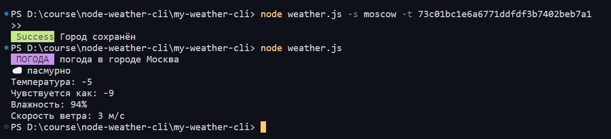

## 043 Публикация пакета в NPM

И теперь мы можем опубликовать, установить и запустить у себя на компьютере нашу утилиту

```bash
npm publish

npm i -g zeizel-weather-cli

weather
```

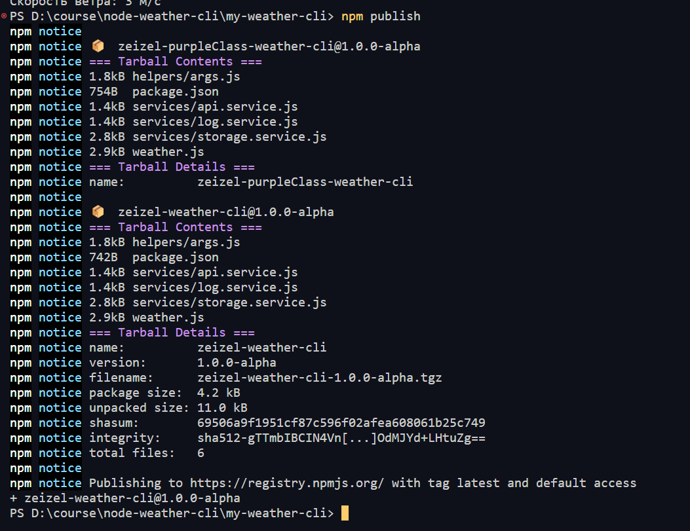

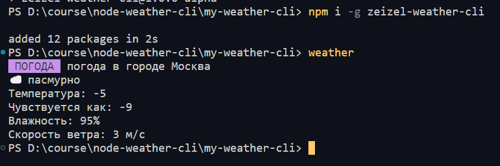

Так же у нас есть автоматические скрипты, начинающиеся на `pre-`, которые выполняются до определённого действия. Конкретно мы можем записать `prepare` скрипт, который будет выполняться до публикации пакета на npm

```JSON
"scripts": {
    "prepare": "tsc",
    "test": "echo \"Error: no test specified\" && exit 1"
  },
```

## 044 Npx и npm exec

Команда `"start"` хранит в себе быстрый запуск нашей утилиты

```JSON
"scripts": {
    "prepare": "tsc",
    "start": "node weather.js",
    "test": "echo \"Error: no test specified\" && exit 1"
  },
```

И тут стоит указать первое уточнение. Если мы будем с такую запись просто передавать параметры, то это не сработает, так как параметры будут передаваться непосредственно npm-пакету. Чтобы параметры передавались нашей команде, которая записана в `"start"`, нужно их записывать после `--`

```bash
// такой код не будет работать
npm start -s moscow

// сейчас отработает правильно
npm start -- -s moscow
```

Так же у нас есть команда `npm exec` или `npx`. Она позволяет запускать какие-либо пакеты в нашем проекте без внедрения в него зависимостей

В примере у нас пакет скачается в кеш и будет запускаться из него, но не будет установлен в проект в качестве зависимостей. Так же здесь можно будет передать параметры непосредственно в приложение без `--`

```bash
// удалим наш пакет
npm uni -g zeizel-weather-cli

// и далее просто запустим наш пакет
npx zeizel-weather-cli -s mosow
```
