## 046 Простой http сервер

И вот так выглядит создание самого простого сервера:

```JS
import http from "http";

// сам хост
const host = "127.0.0.1";
// и канал, по которому можно будет слушать
const port = 8000;

// тут уже создаётся сам сервер
const server = http.createServer((request, response) => {
	// обработка запроса на сервере
	response.statusCode = 200;
	response.setHeader("Content-Type", "text/plain");
	response.end("Привет!");
});

// это обработчик, который слушает наши запросы
server.listen(port, host, () => {
	console.log(`Сервер запущен на ${host}: ${port}`);
});
```

Запускаем сервер

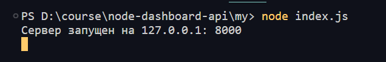

И стучимся к нему

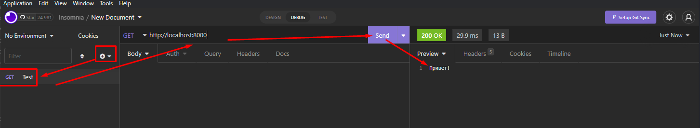

И вот так выглядит роутинг нашего приложения, который осуществляется через `switch`

```JS
import http from "http";

// сам хост
const host = "127.0.0.1";
// и канал, по которому можно будет слушать
const port = 8000;

// тут уже создаётся сам сервер
const server = http.createServer((request, response) => {
	// Запрос от пользователя будет POST или GET
	switch (request.method) {
		case "GET":
			// Ссылка через которую пользователь отправил запрос
			switch (request.url) {
				case "/hello":
					// обработка запроса на сервере
					response.statusCode = 200;
					response.setHeader("Content-Type", "text/plain");
					response.end("Привет!");
					break;
			}
			break;
	}
});

// это обработчик, который слушает наши запросы
server.listen(port, host, () => {
	console.log(`Сервер запущен на ${host}: ${port}`);
});
```

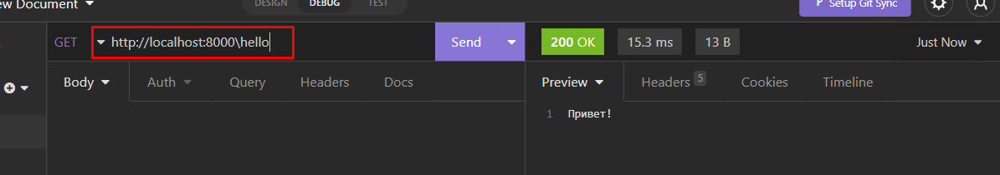

> [!warning] Основная проблема такого подхода заключается в том, что нам нужно будет писать свои абстракции под каждое разбиение кода

## 047 Переходим на express

Установим экспресс

```bash
npm i express
```

Инициализируем приложение на экспрессе

```JS
import express from "express";

const port = 8000;
// тут мы инициилизируем приложение экспресса
const app = express();

// будет срабатывать на гете этого роута
app.get('/hello', (request, response)=> {
	response.send('привет')
})

// это сам листенер запросов пользователей
app.listen(port, () => {
	console.log(`Сервер запущен на http://localhost:${port}`);
});
```

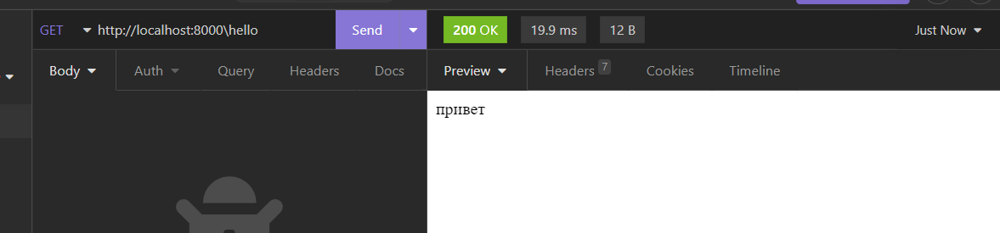

## 048 Маршрутизация

Мы можем очень просто реализовывать принятие любого http-запроса по определённому роуту для реализации определённого функционала

```JS
import express from "express";

const port = 8000;
const app = express();

app.all("/hello", (request, response, next) => {
	console.log("ALL");
	next();
});

app.get("/hello", (request, response) => {
	response.send("привет");
});

app.post("/hello", (request, response) => {
	response.send("привет");
});

// put, patch
app.delete("/hello", (request, response) => {
	response.send("удалено");
});

app.listen(port, () => {
	console.log(`Сервер запущен на http://localhost:${port}`);
});
```

Мы имеем много разных видов обработчиков наших запросов:

- `post`
- `get`
- `put`
- `patch`
- `delete`
- `all` - это обработчик, который срабатывает на любой вид обработки. - Он представляет из себя `middleware`, который будет срабатывать до любого другого запроса - ==Он запустится только если находится в самом верху - над остальными запросами по данному роуту== - Тут так же добавляется третий аргумент - `next` - он уже в себя принимает функцию, которая пойдёт дальше
  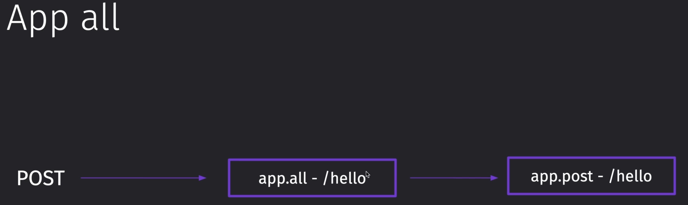

И уже непосредственно между вызовом поста на фронте и на сервере сработал `all`

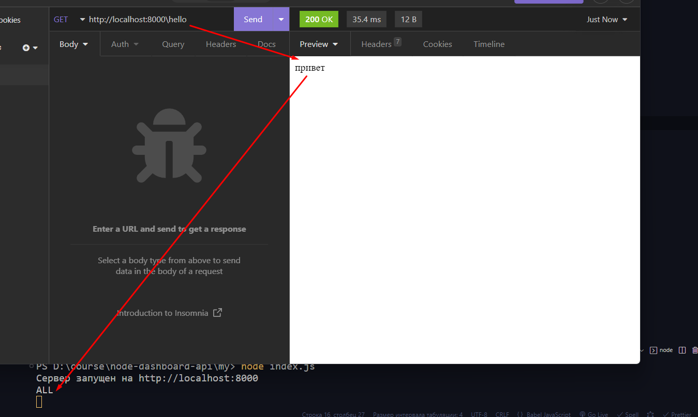

Так же мы можем воспользоваться паттернами при написании нашего запроса

```JS
// hello или helo
app.get("/hel?lo", (request, response) => {
	response.send("привет");
});

// hello или hel + lllllllllllllllllll + lo
app.get("/hel+lo", (request, response) => {
	response.send("привет");
});

// hello или hel + sdkfsdlfjsldkfjsldfksldf + lo
app.get("/hel*lo", (request, response) => {
	response.send("привет");
});

// helo или helalo
app.get("/he(la)?lo", (request, response) => {
	response.send("привет");
});

// так же мы можем воспользоваться regexp
// любая строка любой длины, кторая заканчивается на "a" - aasdfasda
app.get(/.*a$/, (request, response) => {
	response.send("привет");
});
```

Так же мы можем добавлять свои промежуточные коллбэки в наши запросы

```JS
// сначала сработает он - ALL
app.all("/hello", (request, response, next) => {
	console.log("ALL");
	next();
});

// потом сработает он - callback
const callback = (request, response, next) => {
	console.log("callback");
	// вызываем дальнейшую работу функции
	next();
};

// и тут вызваем оба коллбэка
app.get("/hello", callback, (request, response) => {
	response.send("привет");
});
```

Так же мы можем вызвать целый массив коллбэков, если на то нам потребуется воля

```JS
app.get("/hello", [callback, callback2, callback3, (request, response) => {
	response.send("привет");
}]);
```

Так же мы можем на одну сущность повесить сразу несколько обработчиков

```JS
app.route("/user")
	.get("/hello", (request, response) => {
		response.send("Hello GET");
	})
	.post("/hello", (request, response) => {
		response.send("Hello POST");
	});
```

## 049 Ответы клиенту

И тут представлены основные ответы пользователю от сервера

```JS
import express from "express";

const port = 8000;
const app = express();

app.get("/hello", (request, response) => {
	// этой командой мы просто отправляем клиенту сообщение
	response.send({ success: true });
	// конкретно тут мы отправляем с сообщением и новый статус страницы
	response.status(201).send({ success: true });
	// этот метод предназначен для непосредственной работы с json
	response.json({ success: true });
	// этот метод даёт пользователю скачать файл: 1 аргумент - сам файл, 2 аргумент - имя файла, которое получит пользователь
	response.download("/test.pdf", "test-for-user.pdf");
	// а тут мы назначим пользователю переадресацию
	response.redirect(301, "https://example.com");
});

app.get("/set", (request, response) => {
	// тут уже мы можем установить заголовок для нашего сообщения
	response.set("Content-Type", "text/plain");
	response.send("Привет!");
});

app.get("/append", (request, response) => {
	// а это метод для добавления заголовка
	response.append("Warning", "code");
	response.send("Предупреждение!");
});

app.get("/type", (request, response) => {
	// а этот метод переопределит тип нашего сообщения и отобразит в нём
	response.type("application/json");
	response.send("Привет!");
});

app.get("/location", (request, response) => {
	// тут мы определяем расположение файла
	response.location("");
	response.send("Привет!");
});

app.get("/links", (request, response) => {
	// а тут вкладываем в ответ ссылки, к которым он будет относиться
	response.links({
		next: "https://www.next.com",
		last: "https://www.last.com",
	});
	response.send("Привет!");
});

app.get("/cookies", (request, response) => {
	// так же мы можем генерировать куки пользователя
	// делается это, например, для авторизации пользователя в системе
	response.cookie("token", "sadasdasdasd", {
		domain: "", // домен
		path: "/", // путь
		secure: true, // требуется ли шифрование
		expires: 60000, // сколько времени будет валидным
	});
	// так же мы можем очистить куки: имя самого токена и [опционально] путь до куки
	// это делается, например, чтобы разлогинить пользователя
	response.clearCookie("token", { path: "" });
	response.send("Добро пожаловать!");
});

app.get("/stopporing", (request, response) => {
	// сайт застопорится, так как ответа не будет
});

app.get("/continue", (request, response) => {
	// сразу получит запрос от сервера, что что-то не в порядке и остановит загрузку
	response.status(404).end();
	// или можно так, но статус будет 200
	response.end();
});

app.listen(port, () => {
	console.log(`Сервер запущен на http://localhost:${port}`);
});
```

## 050 Router

Далее мы можем воспользоваться конструктором `Router`, который позволит создать уникальный роут для каждой функциональности

Конкретно тут мы описываем функционал для пользователя

`users > uers.js`

```JS
import express from "express";

const userRouter = express.Router();

userRouter.post("/login", (req, res) => {
	res.send("login");
});

userRouter.post("/register", (req, res) => {
	res.send("register");
});

export { userRouter };
```

А тут уже импортируем через `app.use` определённый роутер и через него можем раздельно получать запросы

`index.js`

```JS
import express from "express";
import { userRouter } from "./users/users.js";

const port = 8000;
const app = express();

app.get("/hello", (request, response) => {
	response.send("Привет!");
	response.end();
});

app.use("/users", userRouter);

app.listen(port, () => {
	console.log(`Сервер запущен на http://localhost:${port}`);
});
```

И теперь мы можем получить отдельно по каждой ссылке свой запрос. Обращаемся по роуту `/users` на ссылку `/register`

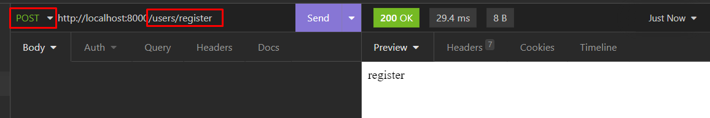

## 051 Промежуточные обработчики

Метод `use()` позволяет сделать обработчик по типу `all`, который срабатывает на все обработчики, поступающие на сервер данного приложения

`index.js`

```JS
import express from "express";
import { userRouter } from "./users/users.js";

const port = 8000;
const app = express();

// на каждый запрос к этому файлу, будет выводиться время запроса
app.use((req, res, next) => {
	console.log("Время запроса: ", Date.now());
	next();
});

app.get("/hello", (request, response) => {
	response.send("Привет!");
	response.end();
});

app.use("/users", userRouter);

app.listen(port, () => {
	console.log(`Сервер запущен на http://localhost:${port}`);
});
```

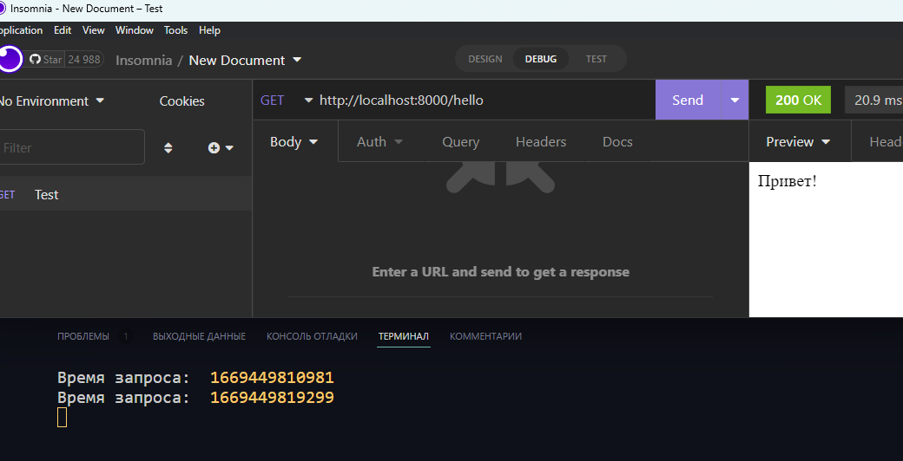

Если мы расположим обработчик внутри дочернего элемента, а именно роута, то сработают оба обработчика - главный (у приложения) и дочерний (у роута)

`users > uers.js`

```JS
import express from "express";

const userRouter = express.Router();

// сейчас уже сначала триггернётся главный обработчик, а потом этот обработчик
userRouter.use((req, res, next) => {
	console.log("Обработчик users");
	next();
});

userRouter.post("/login", (req, res) => {
	res.send("login");
});

userRouter.post("/register", (req, res) => {
	res.send("register");
});

export { userRouter };
```

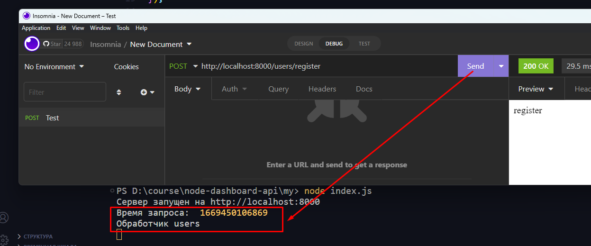

Так же мы можем определить, для какого конкретно обработчика будет работать `use()`. Конкретно тут он будет работать как обработчик `all()`

```JS
app.use('/hello', (req, res, next) => {
	console.log("Время запроса: ", Date.now());
	next();
});
```

И если расположить данный обработчик в конце приложения, то он будет отлавливать ошибки

`index.js`

```JS
// тут располагается предобработчик всех запросов на сервер
app.use((req, res, next) => {
	console.log("Время запроса: ", Date.now());
	next();
});

// тут у нас появляется сама ошибка
app.get("/error", (request, response) => {
	throw new Error("Error (!!)");
});

// тут располагается постобработчик
// конкретно он будет реагировать на ошибки во всех наших запросах
app.use((err, req, res, next) => {
	res.status(500).send(err.message);
});
```

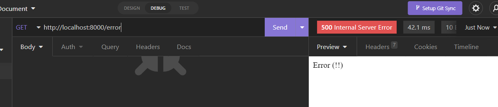

И примерно так выглядит схема работы всех `middleware` обработчиков:

- Отправляется запрос
- Потом он попадает в `use` обработчик нашего приложения
- Дальше он попадает в `use` обработчик конкретного роута
- Потом обрабатывается самим обработчиком, на который этот запрос был отправлен
- Затем уже он обрабатывается постобработчиком `use`, который уже принимает в себя первым параметром ошибку

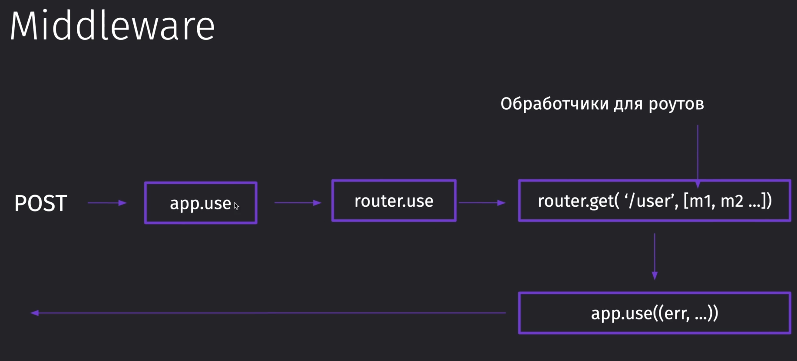
