## 068 Разбор DI и IOC

==DI - dependency injection==
==IOC - inversion of control==

Само явление внедрения зависимостей избавляет нас от потребности инстанциирования объекта внутри самого класса. Таким образом, мы можем внедрять разный функционал по заранее определённому интерфейсу.

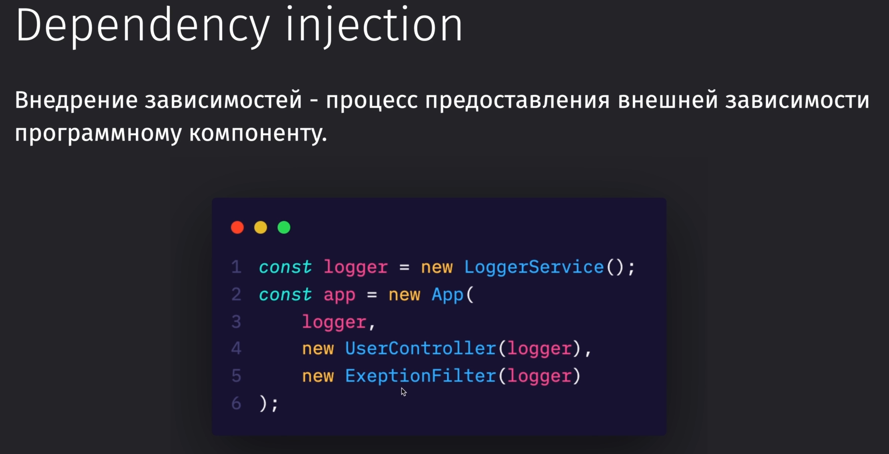

Такой подход так же позволяет отделить программный компонент, чтобы его отдельно протестировать

Совершить самое простое внедрение зависимостей можно:
1) Через конструктор
2) Либо через метод

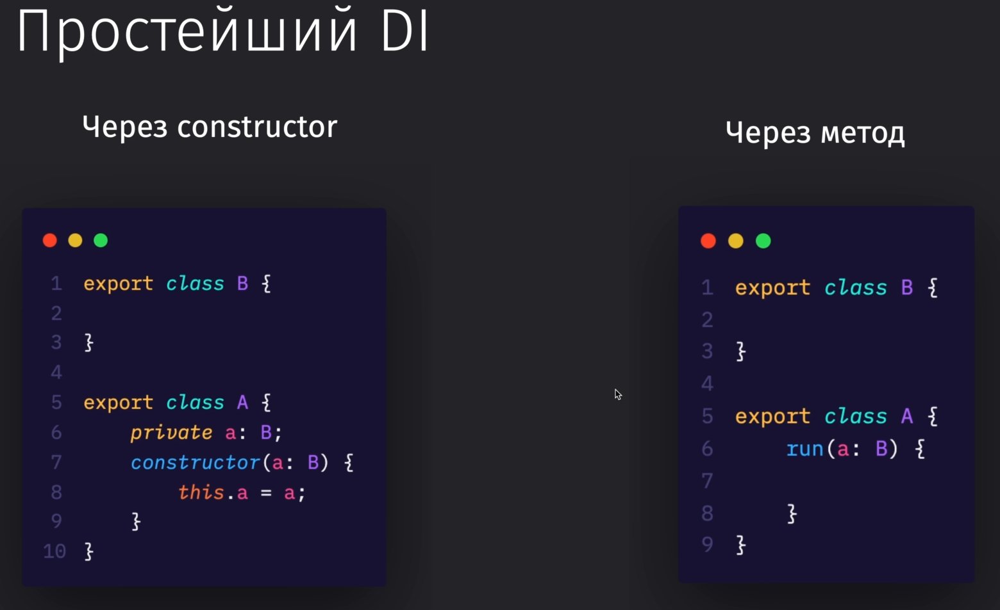

==Composition root== - это одна точка, в которой собираются все зависимости с приложения

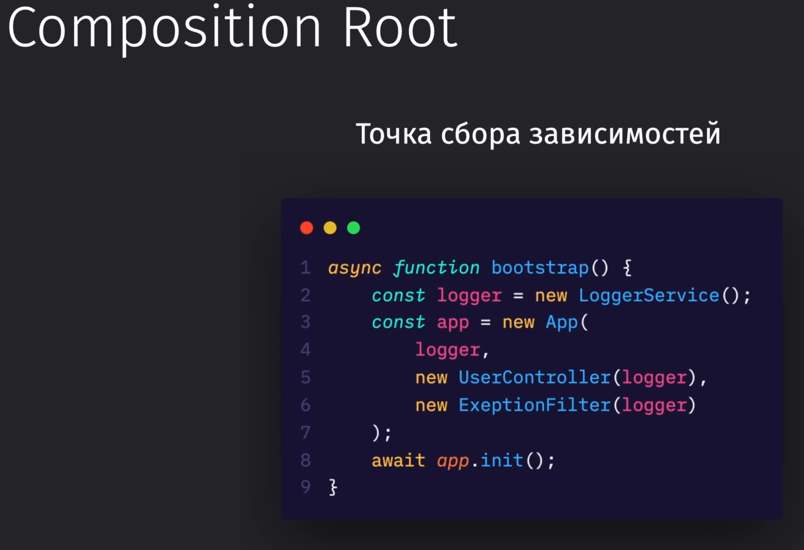

Это схема простого DI, который мы можем повторить в любом языке

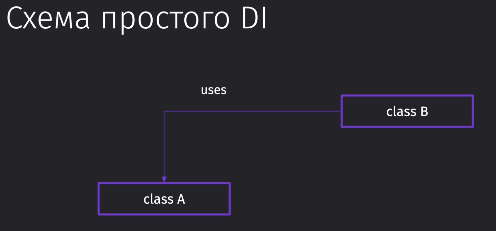

А это схема с типизируемыми языками, в которой можно определить конкретный интерфейс той зависимости, которую мы будем внедрять
Интерфейс выступает в данном случае неким контрактом, который определяет то, что должно присутствовать в классе

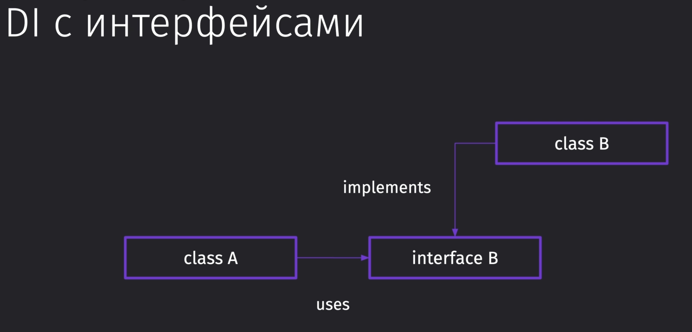

И вот тут можно увидеть пример, что наш интерфейс представляет из себя контракт того, что должно присутствовать в классе

`logger.interface.ts`
```TS
import { Logger } from "tslog";

export interface ILogger {
	logger: unknown;

	log: (...args: unknown[]) => void;
	error: (...args: unknown[]) => void;
	warn: (...args: unknown[]) => void;
}
```

А тут мы по контракту реализуем методы, которые должны будут присутствовать в классе обязательно

`logger.service.ts`
```TS
import { Logger } from "tslog";
import { ILogger } from "./logger.interface";

export class LoggerService implements ILogger {
	public logger: Logger<string>;

	constructor() {
		this.logger = new Logger();
	}

	log(...args: unknown[]) {
		this.logger.info(...args);
	}

	error(...args: unknown[]) {
		this.logger.error(...args);
	}

	warn(...args: unknown[]) {
		this.logger.warn(...args);
	}
}
```

И теперь в главном классе можно поменять входной инстанс не на сам класс логгера, а на интерфейс, которому должен удовлетворять передаваемый внутрь `app` логгер

`app.ts`
```TS
export class App {
	private app: Express;
	private server: Server;
	private port: number;
	// принимает в себя логгер по интерфейсу
	private logger: ILogger;
	private userController: UserController;
	private exceptionFilter: ExceptionFilter;

	constructor(
		// принимает в себя логгер по интерфейсу
		logger: ILogger,
		userController: UserController,
		exceptionFilter: ExceptionFilter
	) {
		this.app = express();
		this.port = 8000;
		this.logger = logger;
		this.userController = userController;
		this.exceptionFilter = exceptionFilter;
	}
	
	// код...
}
```

Первый принцип говорит о том, что все наши компоненты должны быть максимально изолированны друг от друга. Связываем все компоненты через абстракции и интерфейсы, которые предоставляют определённый контракт на функциональность, которая должна присутствовать в другом компоненте:

*Мы создали в классе приложения переменную, которая принимает в себя интерфейс логгера, в котором должны присутствовать методы: `log`, `error` и `warn` - сам логгер мы не принимаем, но в нём должны быть методы, которые мы описали в интерфейсе.*

Второй принцип говорит нам о том, что нам нельзя прокидывать в более мелкие модули (те же сервисы) модули более высокого уровня:
*Нам нельзя прокидывать инстанс `app` внутрь того же `exception`, `logger` или `router`.*

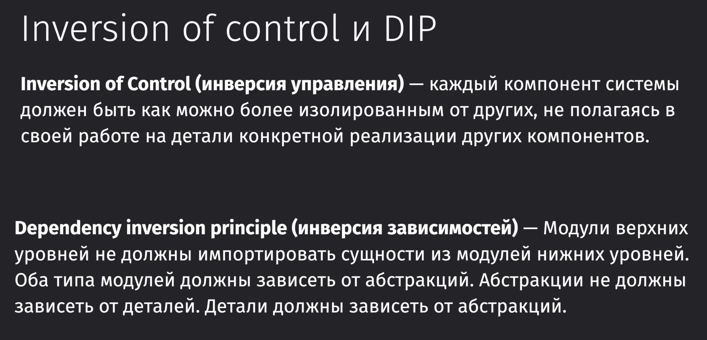

Конкретно мы имеем:
- Принципы, которым мы должны следовать
- Паттерн, по которому эти принципы можно реализовать
- И сама реализация

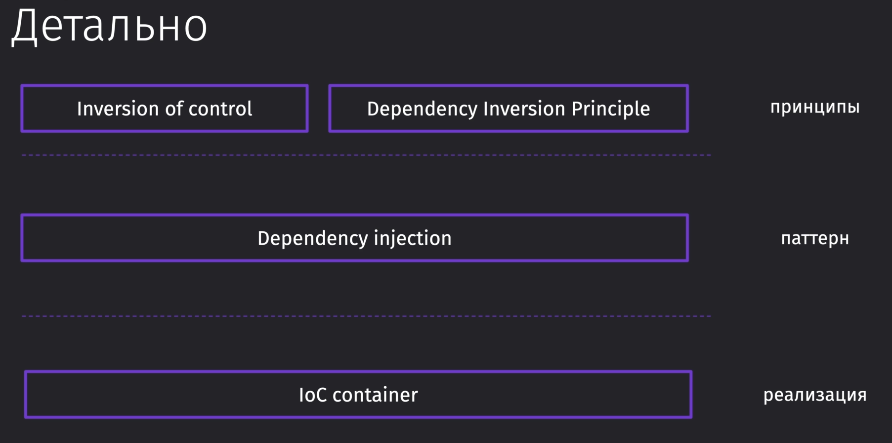

При регистрации приложения наш класс А регистрируется в контейнере: мы понимаем, что он заинтсанциирован и что он удовлетворяет какому-либо интерфейсу
То же самое происходит с классом Б
Контейнер - это центральная точка управления, которая за нас создаёт наши классы, при этом он понимает, какие зависимости ему нужны, создаёт эти зависимости и передаёт их внутрь. 
Таким образом мы избавляемся от самостоятельного создания ==Agregation Root== - теперь он создаётся автоматически и его реализация от нас скрыта, что упрощает наш DI, уменьшая строчки нужного кода

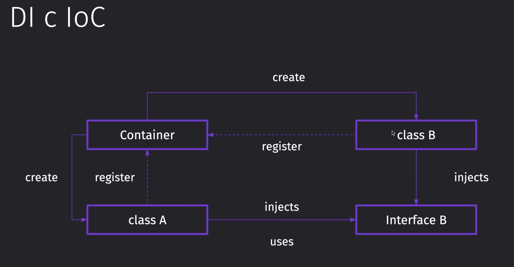

Так же в контейнере обычно реализуется сервис локатор, в котором мы регистрируем все наши сервисы, а потом уже можем вытащить конкретный инстанс этого сервиса, чтобы его в дальнейшем использовать
*Такой паттерн не стоит использовать в реальной работе - это просто схожесть с контейнером, который будет использоваться в данной системе - в нашем случае это полезно для тестов и запуска самого приложения*

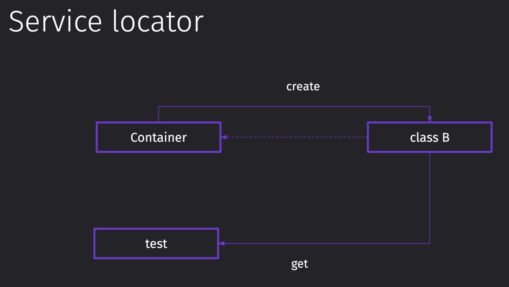

## 069 Декораторы

Всю информацию о декораторах можно найти тут: [Декораторы](../../../TypeScript/_lessons/10%20Декораторы.md)

Сам декоратор представляет из себя обёртку, которая получает тот объект, над которым будут проводиться манипуляции и далее модифицирует поведение этого объекта

Декоратор класса. Он принимает в себя таргет - сам класс и позволяет выполнить какие-либо манипуляции над классом или же просто выполнить что-то вместе с классом. 

```TS
function Component(target: Function) {
	console.log(target);
}

@Component
export class User {
	id: number;

	updateId(newId: number): number {
		this.id = newId;
		return this.id;
	}
}
```

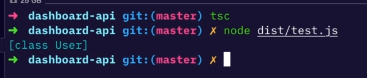

И чтобы мы могли изменять свойства нашего класса, мы можем получить функцию и вернуть её же обратно, но модифицированную, как показано ниже в примере. 
Тут мы поменяли внутреннее свойство класса на переданное в декоратор. Декоратор так же сейчас записывается не через `@Component`, а через `@Component(значение)`

```TS
function Component(id: number) {
	console.log("init");
	return (target: Function) => {
		console.log("run");
		target.prototype.id = id;
	};
}

@Component(1)
export class User {
	id: number;

	updateId(newId: number): number {
		this.id = newId;
		return this.id;
	}
}

console.log(new User().id);
```

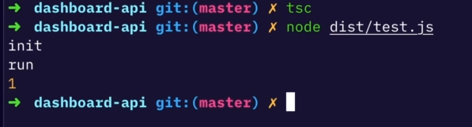

Так же мы можем оборачивать наши объекты сразу в несколько декораторов. Будет идти порядок выполнения снизу вверх в случае классов.
В остальных случаях - сверху вниз

```TS
function Component(id: number) {
	console.log("init Component");
	return (target: Function) => {
		console.log("run Component");
		target.prototype.id = id;
	};
}

function Logger() {
	console.log("init Logger");
	return (target: Function) => {
		console.log("run Logger");
	};
}

@Logger()
@Component(1)
export class User {
	id: number;

	updateId(newId: number): number {
		this.id = newId;
		return this.id;
	}
}

console.log(new User().id);
```

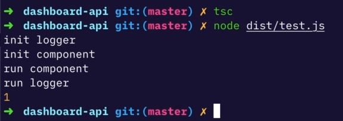

Декоратор методов. Так же мы можем вовсе переопределить логику работы методов внутри классов. Декоратор позволяет сохранить изначальную работу метода и просто её дополнить, либо переопределить вовсе.

```TS

// код ...

// это декоратор метода
function Method(
	// сам объект
	target: Object,
	// имя метода
	propertyKey: string,
	propertyDescriptor: PropertyDescriptor
) {
	// тут выводим название метода
	console.log(propertyKey);
	// тут мы сохраняем старый метод
	const oldValue = propertyDescriptor.value;
	// тут уже мы можем поменять работу функции
	propertyDescriptor.value = function (...args: unknown[]) {
		// oldValue(); // таким образом мы можем вызвать исходный метод

		// умножит переданный id на 10, если он является числом
		if (typeof args[0] === "number") {
			return args[0] * 10;
		}
		return args;
	};
}

@Logger()
@Component(1)
export class User {
	id: number;

	@Method
	updateId(newId: number): number {
		this.id = newId;
		return this.id;
	}
}

console.log(new User().id);
console.log(new User().updateId(2)); // 20
```

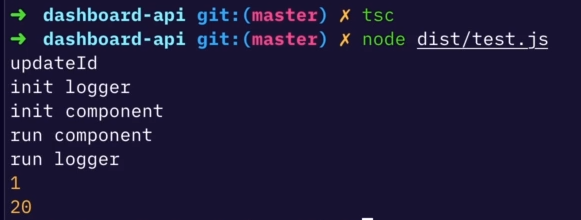

Тут уже представлена работа всех декораторов, включая декораторы свойства и параметра метода 

`полный листинг`
```TS
// Декоратор класса
function Component(id: number) {
	console.log("init Component");

	// чтобы поменять значение свойства класса, нужно вернуть функцию этого класса
	return (target: Function) => {
		console.log("run Component");
		// передаём значение во внутреннее свойство класса
		target.prototype.id = id;
	};
}

// это второй декоратор класса - логгер
function Logger() {
	console.log("init Logger");

	// возвращает сам класс и выводит лог
	return (target: Function) => {
		console.log("run Logger");
	};
}

// это декоратор метода
function Method(
	// сам объект
	target: Object,
	// имя метода
	propertyKey: string,
	propertyDescriptor: PropertyDescriptor
) {
	// тут выводим название метода
	console.log(propertyKey);
	// тут мы сохраняем старый метод
	const oldValue = propertyDescriptor.value;
	// тут уже мы можем поменять работу функции
	propertyDescriptor.value = function (...args: unknown[]) {
		// oldValue(); // таким образом мы можем вызвать исходный метод

		// умножит переданный id на 10, если он является числом
		if (typeof args[0] === "number") {
			return args[0] * 10;
		}
		return args;
	};
}

// декоратор для свойства класса
function Prop(target: Object, propertyKey: string) {
	let value: number;

	// геттер для проперти
	const getter = () => {
		console.log("get");
		return value;
	};

	// сеттер для проперти
	const setter = (newValue: number) => {
		console.log("set");
		value = newValue;
	};

	// переопределяем геттер и сеттер для значения
	Object.defineProperty(target, propertyKey, {
		get: getter,
		set: setter,
	});
}

// декоратор для параметра функции
function Param(
	target: Object,
	propertyKey: string,
	// индекс конкретного параметра функции
	index: number
) {
	console.log(propertyKey, index);
}

@Logger() // срабатывает вторым
@Component(1) // срабатывает первым
export class User {
	// декоратор свойства
	@Prop id: number;

	// декоратор метода + декоратор параметра метода
	@Method
	updateId(@Param newId: number): number {
		this.id = newId;
		return this.id;
	}
}

console.log(new User().id);
console.log(new User().updateId(2)); // 20
```

Это декоратор для свойства класса

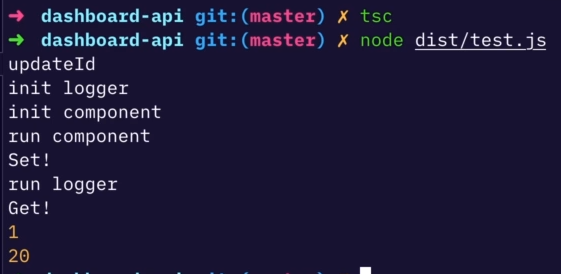

А тут работа декоратора для аргумента метода

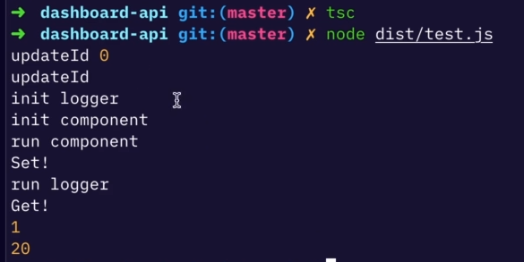

## 070 Metadata Reflection

Мы можем осуществлять хранение метаданных наших объектов с помощью библиотеки `Reflect`. 
В ней присутствует метод `defineMetadata()`, которая позволяет присвоить определённый ключ с определённым значением к определённому объекту.
Так же методом `getMetadata()` мы можем по этому ключу получить метаинформацию по объекту 

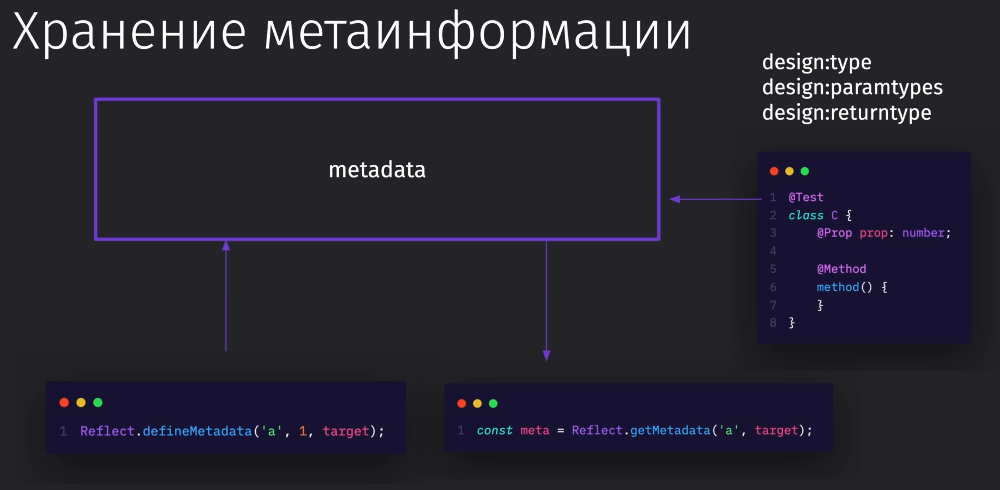

Так мы подключаем библиотеку метаданных

```bash
npm i reflect-metadata
```

Так выглядит синтаксис создания и получения метаданных для определённого объекта

```TS
import "reflect-metadata";

function Test(target: Function) {
	// сохранение метадаты под ключом "a" значение 1 под нашим классом
	Reflect.defineMetadata("a", 1, target);

	// получение метаданных под ключом "a" от нашего класса
	const meta = Reflect.getMetadata("a", target);

	console.log(meta);
}

@Test
export class C {}
```

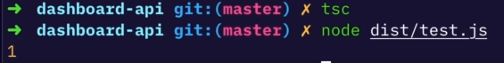

Вкупе с этой настройкой компилятора ТС, у нас будет переноситься проверка типов и в наш рантайм (будет работать после компиляции)

`tsconfig.json`
```JSON
"emitDecoratorMetadata": true,
```

Ну и сейчас нужно объяснить связь декораторов и метаданных. Дело в том, что мы можем вызвать декораторы под определённый инстанс класса и делать DI с помощью вызова декоратора, который инджектит инстанс класса при получении конструктором другого класса. То есть идёт связывание классов друг с другом через метаданные, которые сохраняются при вызове декоратора, вызываемого под параметры конструктора или под класс.   

```TS
import "reflect-metadata";

// Pseudocode

function Injectable(key: string) {
	return (target: Function) => {
		Reflect.defineMetadata(key, 1, target);
		const meta = Reflect.getMetadata(key, target);
		console.log(meta);
	};
}

function Inject(key: string) {}

function Prop(target: Object, name: string) {}

// обозначаем класс "C"
@Injectable("C")
export class C {
	@Prop prop: number;
}

// обозначаем класс "D"
@Injectable("D")
export class D {
	// тут идёт связывание инстанса класса "C" с параметром, который передаётся в конструктор
	constructor(@Inject('C') c: C) {}
}
```

## 071 Внедряем InversifyJS

В первую очередь, нужно установить `inversify` в проект

```bash
npm i inversify
```

Тут будут храниться символы, по которым будет происходить связывание наших компонентов внутри контейнера

`types.ts`
```TS
export const TYPES = {
	Application: Symbol.for('Application'),
	ILogger: Symbol.for('ILogger'),
	UserController: Symbol.for('UserController'),
	ExceptionFilter: Symbol.for('ExceptionFilter'),
};
```

Далее в основном файле приложения мы можем наконец создать контейнер, внутри которого будет происходить связывание класса с его идентификатором (в качестве которого выступает символ `TYPES`)

`main.ts`
```TS
// Контейнер - это коробка, в которую мы будем вкладывать биндинги символов на конкретную реализацию, а потом будем переиспользовать
const appContainer = new Container();

// Тут уже будут лежать биндинги того, что мы хотим реализовать
// Тут мы указали, что для интерфейса ILogger будет соответствовать LoggerService через символ TYPES.ILogger
appContainer.bind<ILogger>(TYPES.ILogger).to(LoggerService);
appContainer.bind<IExceptionFilter>(TYPES.ExceptionFilter).to(ExceptionFilter);
appContainer.bind<UserController>(TYPES.UserController).to(UserController);
appContainer.bind<App>(TYPES.Application).to(App);

// Тут уже мы достаём из контейнера наш компонент App
const app = appContainer.get<App>(TYPES.Application);

app.init();

export { app, appContainer };
```

Так же для реализации связывания, мы можем подставить в качестве дженерика не интерфейс, а сам класс, если мы подразумеваем, что фильтры будут идти отдельными компонентами.

```TS
// Тут уже вместо интерфейса используем конкретную реализацию ExceptionFilter для связывания
appContainer
	.bind<ExceptionFilter>(TYPES.ExceptionFilter)
	.to(ExceptionFilter);
```

Далее нам нужно произвести инжек всех зависимостей от основного приложения, чтобы они попали в контейнер и до них можно было достучаться во время использования контейнера инверсифая

`logger.service.ts`
```TS
// данный декоратор говорит, что мы можем положить данный класс в контейнер
// то есть пока мы не передали аргументы, то мы не реализуем никакой связи с символами
@injectable()
export class LoggerService implements ILogger {
	public logger: Logger<string>;

	// code ...
```

Так же нужно произвести инжект всех зависимостей параметров, которые должны быть доступны внутри контейнера

`exception.filter.ts`
```TS
import 'reflect-metadata';

@injectable()
export class ExeptionFilter implements IExeptionFilter {
	// inject - это декоратор, который принимает то, что нужно заинджектить
	constructor(@inject(TYPES.ILogger) private logger: ILogger) { }
	// code...
```

Так же нужно упомянуть, что имена параметров и классов не стоит повторять, так как они могут конфликтовать в контейнере

`users.controller.ts`
```TS
@injectable()
export class UserController extends BaseController {
	// меняем имя logger на loggerService, чтобы не было конфликтов внутри контейнера
	constructor(@inject(TYPES.ILogger) private loggerService: ILogger) {
		super(loggerService);
		this.bindRoutes([
			{
				path: "/register",
				method: "post",
				func: this.register,
			},
			{
				path: "/login",
				method: "post",
				func: this.login,
			},
		]);
	}

	// code ...
```

`base.controller.ts`
```TS
// этот класс нужно так же заинджектить, так как им расширяется users.controller
@injectable()
export abstract class BaseController {
	private readonly _router: Router;

	constructor(private logger: ILogger) {
		this._router = Router();
	}

	// code ...
```

И в основном классе приложения нужно так же заинжектить все параметры и сам класс

`app.ts`
```TS
// делаем основной класс тоже внедряемым
@injectable()
export class App {
	app: Express;
	server: Server;
	port: number;

	constructor(
		// И тут меняем все наши зависимости с использованием декорирования
		@inject(TYPES.ILogger) private logger: ILogger,
		@inject(TYPES.UserController) private userController: UserController,
		@inject(TYPES.ExceptionFilter) private exceptionFilter: ExceptionFilter
	) {
		this.app = express();
		this.port = 8000;
	}

	// code ...
```

`common > base.controller.ts`
```TS
export abstract class BaseController {
	private readonly _router: Router;

	// Здесь должен быть интерфейс ILogger
	constructor(private logger: ILogger) {
		this._router = Router();
	}

	// code ...
```

Далее, чтобы всё заработало, нужно добавить данный импорт во все файлы, в которых был использован `inject` из библиотеки `inversify` 

```TS
import 'reflect-metadata';
```

И теперь можно убедиться, что наше приложение работает. 

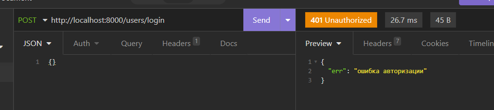
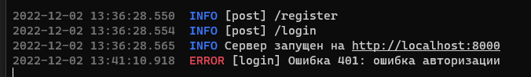

>[!note] Итог:
> - В итоге мы заменили наш DI на ручной биндинг контроллера.
> - Основным плюсом такого подходя является то, что мы можем в любой момент времени получить любой инстанс объекта через `get`. 
> - Если у нас где-то появится новый нджектэбл, то нам не придётся его прокидывать вручную. Нам нужно будет только один раз сделать `bind` контейнера и в том месте, где нужно будет подставить тип, мы сможем его подставить через `@inject(TYPES.тип)`
> - Такой подход позволяет нам легко менять сервисы - достаточно просто поменять его в `.to(Сервис)` и у нас всё будет работать.

## 072 Упражнение - Улучшаем DI

Далее наше приложение может сильно разрастись и количество биндингов будет выходить за рамки 30 и 40 штук. Для решения проблемы с большим количеством биндингов, которая возникает во время разработки, был придуман модуль контейнера

`main.ts`
```TS
appContainer.bind<ILogger>(TYPES.ILogger).to(LoggerService);
appContainer.bind<IExeptionFilter>(TYPES.ExeptionFilter).to(ExeptionFilter);
appContainer.bind<UserController>(TYPES.UserController).to(UserController);
appContainer.bind<App>(TYPES.Application).to(App);
```

Вот так выглядит обновлённая версия проекта с собранными биндингами. Так же мы можем экспортировать эти биндинги, чтобы не хранить их в одном месте, а распределить по проекту и удобно разделять их, чтобы в будущем можно было удобно различать их и модифицировать

`main.ts`
```TS
// Это функция, которая будет совершать биндинги инверсифая
export const appBindings = new ContainerModule((bind: interfaces.Bind) => {
	bind<ILogger>(TYPES.ILogger).to(LoggerService);
	bind<IExeptionFilter>(TYPES.ExeptionFilter).to(ExeptionFilter);
	bind<UserController>(TYPES.UserController).to(UserController);
	bind<App>(TYPES.Application).to(App);
});

function bootstrap() {
	const appContainer = new Container();

	// уже тут мы просто загрузим все биндинги, которые реализовали ранее
	appContainer.load(appBindings);

	const app = appContainer.get<App>(TYPES.Application);
	app.init();

	// возвращаем сформированный контейнер и приложение
	return { app, appContainer };
}

// экспортируем переменные, полученные из функции
export const { app, appContainer } = bootstrap();
```

И далее нужно немного улучшить наш DI и реализовать интерфейс для контроллера пользователей. Он будет иметь логин и регистрацию. 

`users.controller.interface.ts`
```TS
import { NextFunction, Request, Response } from 'express';

export interface IUserController {
	login: (req: Request, res: Response, next: NextFunction) => void;
	register: (req: Request, res: Response, next: NextFunction) => void;
}
```

В самом контроллере нам нужно вместе с экстендом от базового модуля ещё и заимплементироваться от интерфейса. Чтобы можно было одновременно сделать и то, и то, нужно сначала произвести `extends`, а уже потом `implements`

`users.controller.ts`
```TS
// imports...
import { IUserController } from './users.controller.interface';

@injectable()
export class UserController extends BaseController implements IUserController {
	constructor(
		@inject(TYPES.ILogger) private loggerService: ILogger
	) {
		super(loggerService);
		this.bindRoutes([
			{ path: '/register', method: 'post', func: this.register },
			{ path: '/login', method: 'post', func: this.login },
		])
	}

	login(req: Request, res: Response, next: NextFunction) {
		next(new HTTPError(401, 'ошибка авторизации', 'login'));
	}

	register(req: Request, res: Response, next: NextFunction) {
		this.ok(res, 'register');
	}
}
```

